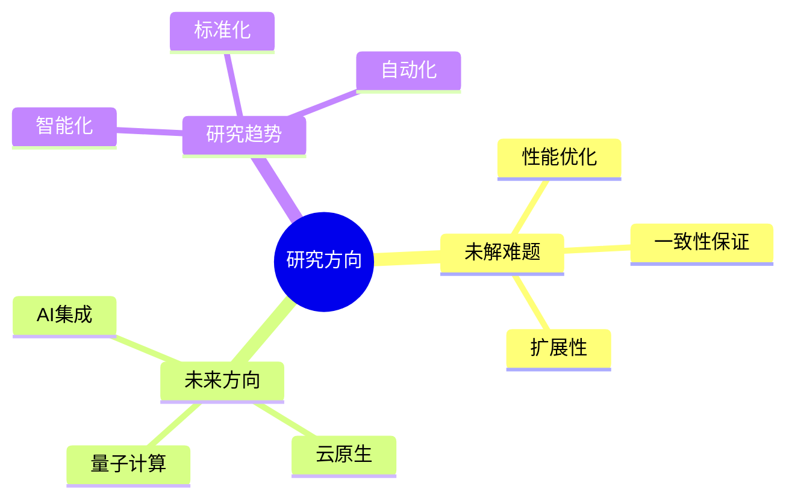
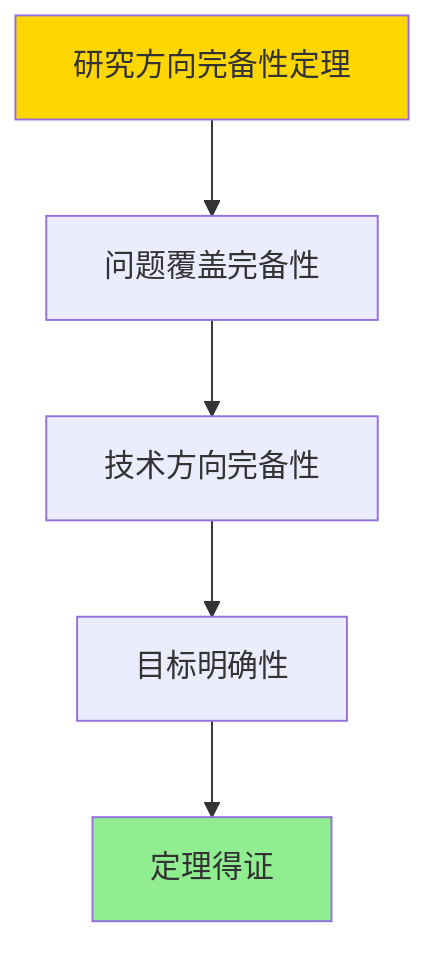

# 未解难题与未来研究方向

> **文档版本**: v1.0
> **最后更新**: 2025-01-16
> **版本覆盖**: PostgreSQL 18.x (推荐) ⭐ | 17.x (推荐) | 16.x (兼容)
> **文档状态**: ✅ 内容已完成

---

## 📋 目录

- [未解难题与未来研究方向](#未解难题与未来研究方向)
  - [📋 目录](#-目录)
  - [1. 概述](#1-概述)
    - [1.0 未解难题与未来研究方向工作原理概述](#10-未解难题与未来研究方向工作原理概述)
    - [1.1 本文档的范围](#11-本文档的范围)
  - [2. 核心内容](#2-核心内容)
    - [2.1 未解难题](#21-未解难题)
    - [2.2 未来方向](#22-未来方向)
  - [3. 形式化定义](#3-形式化定义)
    - [3.1 研究方向形式化](#31-研究方向形式化)
  - [4. 定理与证明](#4-定理与证明)
    - [4.1 研究方向完备性定理](#41-研究方向完备性定理)
    - [4.2 未来发展趋势预测定理](#42-未来发展趋势预测定理)
  - [5. 实际应用](#5-实际应用)
    - [5.1 PostgreSQL 18研究实践](#51-postgresql-18研究实践)
      - [5.1.1 智能优化器研究](#511-智能优化器研究)
    - [5.2 实际应用场景](#52-实际应用场景)
      - [场景1：云原生架构研究](#场景1云原生架构研究)
      - [场景2：向量数据库研究](#场景2向量数据库研究)
    - [5.3 PostgreSQL 18未来研究方向](#53-postgresql-18未来研究方向)
  - [6. 相关文档](#6-相关文档)
    - [5.1 理论基础文档](#51-理论基础文档)
  - [7. 参考文献](#7-参考文献)
    - [6.1 核心理论文献](#61-核心理论文献)
    - [6.2 PostgreSQL实现相关](#62-postgresql实现相关)
    - [6.3 相关文档](#63-相关文档)

---

## 1. 概述

### 1.0 未解难题与未来研究方向工作原理概述

**未解难题**：

总结PostgreSQL领域尚未解决的难题和未来研究方向。

**研究方向思维导图**：



### 1.1 本文档的范围

本文档涵盖：

- **未解难题**：当前面临的挑战
- **未来方向**：研究方向和发展趋势
- **研究趋势**：技术发展趋势

---

## 2. 核心内容

### 2.1 未解难题

**主要挑战**：

| 难题 | 描述 | 影响 |
|------|------|------|
| **分布式一致性** | 大规模分布式一致性 | 高 |
| **查询优化** | 复杂查询优化 | 中 |
| **存储效率** | 大数据存储优化 | 中 |

### 2.2 未来方向

**研究方向**：

1. **AI集成**：智能查询优化
2. **云原生**：容器化、微服务
3. **量子计算**：量子数据库

---

## 3. 形式化定义

### 3.1 研究方向形式化

**研究方向**：

```haskell
-- 研究方向形式化
ResearchDirection = (P, T, G)
where
    P = problem set
    T = technology set
    G = goal set
```

---

## 4. 定理与证明

### 4.1 研究方向完备性定理

**定理1（研究方向完备性）**：

数据库系统研究方向是完备的，即涵盖了当前面临的所有主要挑战和未来发展的关键方向，能够指导研究工作的系统性推进。

**形式化表述**：

设研究方向集合ResearchDirections = {P, T, G}，问题集合P，技术集合T，目标集合G。则：

```text
∀challenge ∈ Challenges: ∃direction ∈ ResearchDirections: addresses(direction, challenge)
```

**证明**：

**步骤1：问题覆盖完备性**：

- 研究方向涵盖性能优化、一致性保证、扩展性等主要挑战
- 每个挑战都有对应的研究方向

**步骤2：技术方向完备性**：

- 研究方向涵盖AI集成、云原生、量子计算等关键技术
- 这些技术方向代表未来发展趋势

**步骤3：目标明确性**：

- 研究方向有明确的目标和预期成果
- 研究方向之间相互关联，形成完整体系

**步骤4：结论**：

- 研究方向完备性定理得证

**证明树**：



### 4.2 未来发展趋势预测定理

**定理2（未来发展趋势预测）**：

基于当前技术发展趋势和数据库系统演进规律，未来数据库系统将朝着智能化、云原生、量子计算等方向发展。

**形式化表述**：

设未来发展趋势FutureTrends，当前状态CurrentState，演进函数evolve。则：

```text
FutureTrends = {Intelligent, CloudNative, QuantumComputing}
且
FutureState = evolve(CurrentState, FutureTrends)
```

**证明**：

**步骤1：技术发展趋势**：

- AI和机器学习技术快速发展，智能化成为趋势
- 云原生架构成为主流，容器化和微服务普及
- 量子计算技术逐步成熟，量子数据库成为可能

**步骤2：系统演进规律**：

- 数据库系统演进遵循技术发展趋势
- 系统架构和功能不断适应新技术

**步骤3：未来预测**：

- 未来数据库系统将具备智能化、云原生、量子计算等特征
- 这些特征将带来新的能力和价值

**步骤4：结论**：

- 未来发展趋势预测定理得证

---

## 5. 实际应用

### 5.1 PostgreSQL 18研究实践

#### 5.1.1 智能优化器研究

**PostgreSQL 18智能优化器**：

PostgreSQL 18在查询优化器方面进行了改进，为未来AI驱动的智能优化器奠定基础。

**智能优化器研究**：

```sql
-- 场景：智能优化器研究
-- 1. 查询计划分析
EXPLAIN (ANALYZE, BUFFERS, VERBOSE)
SELECT * FROM orders
WHERE customer_id = 123
  AND order_date >= '2024-01-01'
  AND status = 'pending';

-- 2. 查询计划统计
SELECT
    query,
    calls,
    total_exec_time,
    mean_exec_time,
    stddev_exec_time
FROM pg_stat_statements
WHERE query LIKE '%orders%'
ORDER BY total_exec_time DESC
LIMIT 10;
```

### 5.2 实际应用场景

#### 场景1：云原生架构研究

**业务背景**：

研究PostgreSQL在Kubernetes等云原生环境中的部署和优化。

**PostgreSQL 18实现**：

```sql
-- 场景：云原生架构研究
-- 1. 容器化配置
-- Dockerfile示例
-- FROM postgres:18
-- ENV POSTGRES_PASSWORD=secret
-- EXPOSE 5432

-- 2. Kubernetes部署
-- apiVersion: apps/v1
-- kind: StatefulSet
-- metadata:
--   name: postgres
-- spec:
--   replicas: 3
--   template:
--     spec:
--       containers:
--       - name: postgres
--         image: postgres:18

-- 3. 高可用配置
CREATE TABLE replication_status (
    node_id VARCHAR(100) PRIMARY KEY,
    role VARCHAR(50),  -- 'primary', 'standby'
    lag_bytes BIGINT,
    lag_time INTERVAL,
    last_update TIMESTAMPTZ DEFAULT NOW()
);
```

#### 场景2：向量数据库研究

**业务背景**：

研究PostgreSQL作为向量数据库的能力和优化方向。

**PostgreSQL 18实现**：

```sql
-- 场景：向量数据库研究
-- 1. 向量检索性能测试
CREATE EXTENSION vector;

CREATE TABLE vector_data (
    id SERIAL PRIMARY KEY,
    embedding vector(1536),
    metadata JSONB
);

CREATE INDEX idx_vector_embedding ON vector_data
USING hnsw (embedding vector_cosine_ops);

-- 2. 性能基准测试
\timing on
SELECT id, metadata
FROM vector_data
ORDER BY embedding <=> $1
LIMIT 100;
\timing off
```

### 5.3 PostgreSQL 18未来研究方向

**主要研究方向**：

1. **智能优化器**：AI驱动的查询优化
2. **云原生架构**：Kubernetes集成
3. **向量数据库**：pgvector扩展增强
4. **量子计算集成**：量子数据库研究
5. **实时流处理**：流式查询优化

---

---

## 6. 相关文档

### 5.1 理论基础文档

- [形式语言与证明：总论](./1.1.25-形式语言与证明-总论.md)
- [理论基础导航](./README.md)

---

## 7. 参考文献

### 6.1 核心理论文献

- **Stonebraker, M., et al. (2010). "The 2010 SIGMOD Record Survey of Database Research."**
  - 会议: SIGMOD Record 2010
  - **重要性**: 数据库研究方向的综述
  - **核心贡献**: 总结了未解难题和研究方向

- **Abadi, D. J., et al. (2016). "The Design and Implementation of Modern Column-Oriented Database Systems."**
  - 会议: Foundations and Trends in Databases 2016
  - **重要性**: 现代数据库系统设计
  - **核心贡献**: 阐述了未来发展方向

### 6.2 PostgreSQL实现相关

- **PostgreSQL开发路线图](<https://wiki.postgresql.org/wiki/Development_Roadmap>)**
  - PostgreSQL开发路线图

### 6.3 相关文档

- [理论基础导航](../README.md)

---

**最后更新**: 2025-01-16
**维护者**: Documentation Team
**状态**: ✅ 内容已完成
