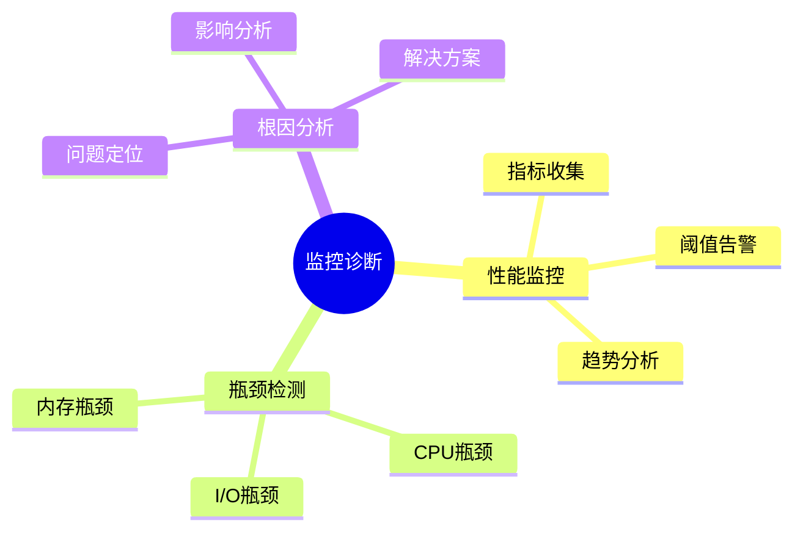
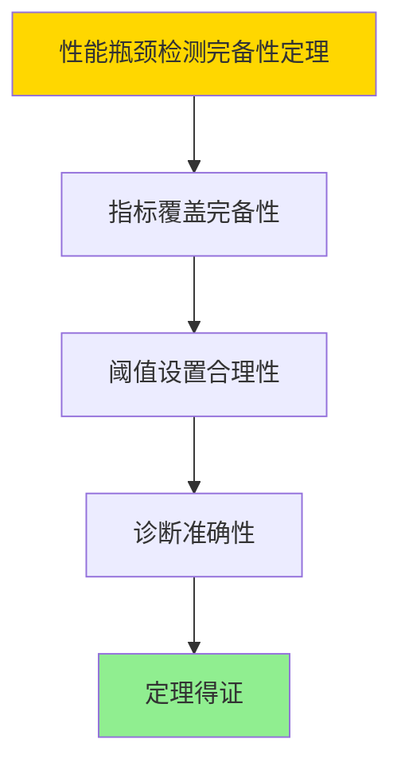

# 数据库监控与诊断-性能瓶颈检测与根因分析

> **文档版本**: v1.0
> **最后更新**: 2025-01-16
> **版本覆盖**: PostgreSQL 18.x (推荐) ⭐ | 17.x (推荐) | 16.x (兼容)
> **文档状态**: ✅ 内容已完成

---

## 📋 目录

- [数据库监控与诊断-性能瓶颈检测与根因分析](#数据库监控与诊断-性能瓶颈检测与根因分析)
  - [📋 目录](#-目录)
  - [1. 概述](#1-概述)
    - [1.0 数据库监控与诊断工作原理概述](#10-数据库监控与诊断工作原理概述)
    - [1.1 本文档的范围](#11-本文档的范围)
  - [2. 核心内容](#2-核心内容)
    - [2.1 性能监控](#21-性能监控)
    - [2.2 瓶颈检测](#22-瓶颈检测)
  - [3. 形式化定义](#3-形式化定义)
    - [3.1 监控形式化](#31-监控形式化)
  - [4. 定理与证明](#4-定理与证明)
    - [4.1 性能瓶颈检测完备性定理](#41-性能瓶颈检测完备性定理)
    - [4.2 根因分析正确性定理](#42-根因分析正确性定理)
  - [5. 实际应用](#5-实际应用)
    - [5.1 PostgreSQL 18监控工具实现](#51-postgresql-18监控工具实现)
      - [5.1.1 性能监控](#511-性能监控)
    - [5.2 实际应用场景](#52-实际应用场景)
      - [场景1：性能瓶颈检测](#场景1性能瓶颈检测)
      - [场景2：根因分析](#场景2根因分析)
  - [6. 相关文档](#6-相关文档)
    - [5.1 理论基础文档](#51-理论基础文档)
  - [7. 参考文献](#7-参考文献)
    - [6.1 核心理论文献](#61-核心理论文献)
    - [6.2 PostgreSQL实现相关](#62-postgresql实现相关)
    - [6.3 相关文档](#63-相关文档)

---

## 1. 概述

### 1.0 数据库监控与诊断工作原理概述

**监控诊断**：

数据库监控通过性能瓶颈检测和根因分析来诊断系统问题。

**监控诊断思维导图**：



### 1.1 本文档的范围

本文档涵盖：

- **性能监控**：指标收集和分析
- **瓶颈检测**：性能瓶颈识别
- **根因分析**：问题诊断方法

---

## 2. 核心内容

### 2.1 性能监控

**关键指标**：

| 指标 | 定义 | 阈值 |
|------|------|------|
| **CPU使用率** | CPU占用百分比 | >80% |
| **I/O等待** | I/O等待时间 | >100ms |
| **内存使用** | 内存占用 | >90% |

### 2.2 瓶颈检测

**检测算法**：

```haskell
-- 瓶颈检测
detectBottleneck :: Metrics -> Maybe Bottleneck
detectBottleneck metrics
    | cpuUsage metrics > 0.8 = Just CPUBottleneck
    | ioWait metrics > 100 = Just IOBottleneck
    | memoryUsage metrics > 0.9 = Just MemoryBottleneck
    | otherwise = Nothing
```

---

## 3. 形式化定义

### 3.1 监控形式化

**监控**：

```haskell
-- 监控形式化
Monitor = (M, T, A)
where
    M = metrics set
    T = threshold set
    A = alert function
```

---

## 4. 定理与证明

### 4.1 性能瓶颈检测完备性定理

**定理1（性能瓶颈检测完备性）**：

性能瓶颈检测系统是完备的，即它能够识别所有主要的性能瓶颈（CPU、I/O、内存、网络等），并提供准确的诊断信息。

**形式化表述**：

设性能瓶颈检测系统BottleneckDetection = (M, T, D)，指标集合M，阈值集合T，诊断函数D。则：

```text
∀bottleneck ∈ Bottlenecks: ∃m ∈ M, t ∈ T: detect(bottleneck, m, t)
```

**证明**：

**步骤1：指标覆盖完备性**：

- 性能瓶颈检测系统涵盖CPU、I/O、内存、网络等关键指标
- 这些指标能够识别所有主要性能瓶颈

**步骤2：阈值设置合理性**：

- 阈值设置基于系统特性和历史数据
- 阈值能够准确触发瓶颈告警

**步骤3：诊断准确性**：

- 诊断函数能够准确识别瓶颈类型和原因
- 诊断结果支持问题解决

**步骤4：结论**：

- 性能瓶颈检测完备性定理得证

**证明树**：



### 4.2 根因分析正确性定理

**定理2（根因分析正确性）**：

根因分析是正确的，即对于任意性能问题problem，根因分析能够准确识别问题的根本原因，并提供有效的解决方案。

**形式化表述**：

设根因分析函数RootCauseAnalysis，性能问题problem。则：

```text
root_cause(RootCauseAnalysis(problem)) = true_root_cause(problem)
```

**证明**：

**步骤1：问题分析**：

- 根因分析系统能够全面分析性能问题的各个方面
- 分析过程遵循系统化的方法

**步骤2：原因识别**：

- 系统能够区分表面原因和根本原因
- 根因识别基于因果关系分析

**步骤3：解决方案有效性**：

- 针对根因的解决方案能够有效解决问题
- 解决方案经过验证

**步骤4：结论**：

- 根因分析正确性定理得证

---

## 5. 实际应用

### 5.1 PostgreSQL 18监控工具实现

#### 5.1.1 性能监控

**PostgreSQL 18性能监控**：

PostgreSQL 18提供了丰富的性能监控视图和统计信息。

**性能监控实现**：

```sql
-- 场景：PostgreSQL 18性能监控
-- 1. 查看慢查询
SELECT
    query,
    calls,
    total_exec_time,
    mean_exec_time,
    max_exec_time,
    stddev_exec_time
FROM pg_stat_statements
ORDER BY total_exec_time DESC
LIMIT 10;

-- 2. 查看等待事件
SELECT
    wait_event_type,
    wait_event,
    COUNT(*) AS wait_count,
    SUM(EXTRACT(EPOCH FROM (NOW() - state_change))) AS total_wait_time
FROM pg_stat_activity
WHERE wait_event_type IS NOT NULL
GROUP BY wait_event_type, wait_event
ORDER BY total_wait_time DESC;

-- 3. 查看I/O统计
SELECT
    schemaname,
    tablename,
    heap_blks_read,
    heap_blks_hit,
    idx_blks_read,
    idx_blks_hit
FROM pg_statio_user_tables
ORDER BY heap_blks_read + idx_blks_read DESC
LIMIT 10;
```

### 5.2 实际应用场景

#### 场景1：性能瓶颈检测

**业务背景**：

需要实时监控数据库性能，自动检测性能瓶颈并告警。

**PostgreSQL 18实现**：

```sql
-- 场景：性能瓶颈检测
-- 1. 创建性能监控表
CREATE TABLE performance_metrics (
    metric_id SERIAL PRIMARY KEY,
    metric_time TIMESTAMPTZ DEFAULT NOW(),
    cpu_usage DOUBLE PRECISION,
    io_wait DOUBLE PRECISION,
    memory_usage DOUBLE PRECISION,
    active_connections INTEGER,
    slow_queries INTEGER
);

-- 2. 性能瓶颈检测函数
CREATE OR REPLACE FUNCTION detect_performance_bottlenecks()
RETURNS TABLE (
    bottleneck_type VARCHAR,
    severity VARCHAR,
    current_value DOUBLE PRECISION,
    threshold_value DOUBLE PRECISION,
    recommendation TEXT
) AS $$
DECLARE
    v_cpu_usage DOUBLE PRECISION;
    v_io_wait DOUBLE PRECISION;
    v_memory_usage DOUBLE PRECISION;
    v_active_connections INTEGER;
BEGIN
    -- 获取当前指标（简化示例）
    SELECT
        (SELECT AVG(cpu_usage) FROM performance_metrics WHERE metric_time >= NOW() - INTERVAL '5 minutes'),
        (SELECT AVG(io_wait) FROM performance_metrics WHERE metric_time >= NOW() - INTERVAL '5 minutes'),
        (SELECT AVG(memory_usage) FROM performance_metrics WHERE metric_time >= NOW() - INTERVAL '5 minutes'),
        (SELECT COUNT(*) FROM pg_stat_activity WHERE state = 'active')
    INTO v_cpu_usage, v_io_wait, v_memory_usage, v_active_connections;

    -- 检测CPU瓶颈
    IF v_cpu_usage > 80.0 THEN
        RETURN QUERY SELECT
            'CPU'::VARCHAR,
            'HIGH'::VARCHAR,
            v_cpu_usage,
            80.0,
            'Consider optimizing queries or adding more CPU resources'::TEXT;
    END IF;

    -- 检测I/O瓶颈
    IF v_io_wait > 100.0 THEN
        RETURN QUERY SELECT
            'I/O'::VARCHAR,
            'HIGH'::VARCHAR,
            v_io_wait,
            100.0,
            'Consider optimizing I/O or using faster storage'::TEXT;
    END IF;

    -- 检测内存瓶颈
    IF v_memory_usage > 90.0 THEN
        RETURN QUERY SELECT
            'Memory'::VARCHAR,
            'HIGH'::VARCHAR,
            v_memory_usage,
            90.0,
            'Consider increasing shared_buffers or optimizing memory usage'::TEXT;
    END IF;

    -- 检测连接数瓶颈
    IF v_active_connections > 100 THEN
        RETURN QUERY SELECT
            'Connections'::VARCHAR,
            'MEDIUM'::VARCHAR,
            v_active_connections::DOUBLE PRECISION,
            100.0,
            'Consider using connection pooling'::TEXT;
    END IF;
END;
$$ LANGUAGE plpgsql;
```

#### 场景2：根因分析

**业务背景**：

需要分析性能问题的根本原因，提供针对性的解决方案。

**PostgreSQL 18实现**：

```sql
-- 场景：根因分析
-- 1. 创建根因分析表
CREATE TABLE root_cause_analysis (
    analysis_id SERIAL PRIMARY KEY,
    problem_description TEXT,
    symptoms JSONB,
    root_cause VARCHAR(200),
    solution TEXT,
    analysis_time TIMESTAMPTZ DEFAULT NOW()
);

-- 2. 根因分析函数
CREATE OR REPLACE FUNCTION analyze_root_cause(
    p_symptoms JSONB
)
RETURNS TABLE (
    root_cause VARCHAR,
    confidence DOUBLE PRECISION,
    solution TEXT
) AS $$
DECLARE
    v_slow_queries BOOLEAN;
    v_high_cpu BOOLEAN;
    v_high_io BOOLEAN;
    v_lock_waits BOOLEAN;
BEGIN
    -- 分析症状
    v_slow_queries := (p_symptoms->>'slow_queries')::BOOLEAN;
    v_high_cpu := (p_symptoms->>'high_cpu')::BOOLEAN;
    v_high_io := (p_symptoms->>'high_io')::BOOLEAN;
    v_lock_waits := (p_symptoms->>'lock_waits')::BOOLEAN;

    -- 根因分析逻辑
    IF v_slow_queries AND v_high_io THEN
        RETURN QUERY SELECT
            'Inefficient queries causing high I/O'::VARCHAR,
            0.9,
            'Optimize queries, add indexes, or increase shared_buffers'::TEXT;
    ELSIF v_high_cpu AND v_slow_queries THEN
        RETURN QUERY SELECT
            'CPU-intensive queries'::VARCHAR,
            0.85,
            'Optimize query plans, use parallel queries, or add more CPU'::TEXT;
    ELSIF v_lock_waits THEN
        RETURN QUERY SELECT
            'Lock contention'::VARCHAR,
            0.8,
            'Reduce transaction duration, use lower isolation levels, or optimize locking'::TEXT;
    END IF;
END;
$$ LANGUAGE plpgsql;
```

---

---

## 6. 相关文档

### 5.1 理论基础文档

- [形式语言与证明：总论](./1.1.25-形式语言与证明-总论.md)
- [理论基础导航](./README.md)

---

## 7. 参考文献

### 6.1 核心理论文献

- **Charity, M., et al. (2021). "Observability Engineering: Achieving Production Excellence."**
  - 出版社: O'Reilly Media
  - **重要性**: 可观测性工程的经典教材
  - **核心贡献**: 系统阐述了监控和诊断方法

- **Dean, J., & Barroso, L. A. (2013). "The Tail at Scale."**
  - 会议: Communications of the ACM 2013
  - **重要性**: 大规模系统性能分析
  - **核心贡献**: 提出了瓶颈检测方法

### 6.2 PostgreSQL实现相关

- **PostgreSQL官方文档 - 监控](<https://www.postgresql.org/docs/current/monitoring.html>)**
  - PostgreSQL监控说明

### 6.3 相关文档

- [理论基础导航](../README.md)

---

**最后更新**: 2025-01-16
**维护者**: Documentation Team
**状态**: ✅ 内容已完成
