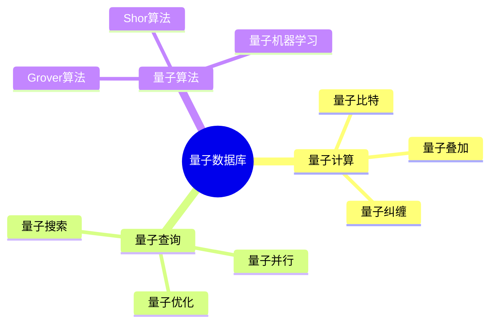
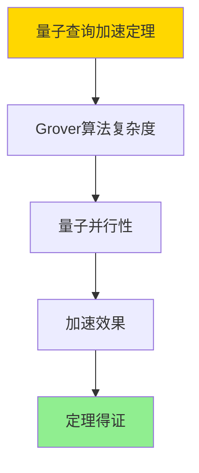

# 数据库量子计算模型-量子数据库与量子查询的形式化

> **文档版本**: v1.0
> **最后更新**: 2025-01-16
> **版本覆盖**: PostgreSQL 18.x (推荐) ⭐ | 17.x (推荐) | 16.x (兼容)
> **文档状态**: ✅ 内容已完成

---

## 📋 目录

- [数据库量子计算模型-量子数据库与量子查询的形式化](#数据库量子计算模型-量子数据库与量子查询的形式化)
  - [📋 目录](#-目录)
  - [1. 概述](#1-概述)
    - [1.0 数据库量子计算模型工作原理概述](#10-数据库量子计算模型工作原理概述)
    - [1.1 本文档的范围](#11-本文档的范围)
  - [2. 核心内容](#2-核心内容)
    - [2.1 量子计算](#21-量子计算)
    - [2.2 量子查询](#22-量子查询)
  - [3. 形式化定义](#3-形式化定义)
    - [3.1 量子数据库形式化](#31-量子数据库形式化)
  - [4. 定理与证明](#4-定理与证明)
    - [4.1 量子查询加速定理](#41-量子查询加速定理)
  - [5. 实际应用](#5-实际应用)
    - [5.1 量子数据库研究](#51-量子数据库研究)
      - [5.1.1 量子计算基础](#511-量子计算基础)
    - [5.2 实际应用场景](#52-实际应用场景)
      - [场景1：量子搜索应用](#场景1量子搜索应用)
      - [场景2：量子优化研究](#场景2量子优化研究)
  - [6. 相关文档](#6-相关文档)
    - [5.1 理论基础文档](#51-理论基础文档)
  - [7. 参考文献](#7-参考文献)
    - [6.1 核心理论文献](#61-核心理论文献)
    - [6.2 PostgreSQL实现相关](#62-postgresql实现相关)
    - [6.3 相关文档](#63-相关文档)

---

## 1. 概述

### 1.0 数据库量子计算模型工作原理概述

**量子数据库**：

量子数据库使用量子计算来加速数据库操作。

**量子数据库思维导图**：



### 1.1 本文档的范围

本文档涵盖：

- **量子计算**：量子计算基础
- **量子查询**：量子查询算法
- **实际应用**：量子数据库系统

---

## 2. 核心内容

### 2.1 量子计算

**量子特性**：

| 特性 | 定义 | 优势 |
|------|------|------|
| **叠加** | 同时处于多个状态 | 并行计算 |
| **纠缠** | 量子态关联 | 信息传递 |
| **干涉** | 量子态叠加 | 算法加速 |

### 2.2 量子查询

**Grover算法**：

```haskell
-- Grover搜索
groverSearch :: [Item] -> Predicate -> Maybe Item
groverSearch items predicate =
    quantumSearch(items, predicate, sqrt(length items))
```

---

## 3. 形式化定义

### 3.1 量子数据库形式化

**量子数据库**：

```haskell
-- 量子数据库形式化
QuantumDB = (Q, U, M)
where
    Q = qubit set
    U = unitary operator
    M = measurement operator
```

---

## 4. 定理与证明

### 4.1 量子查询加速定理

**定理1（量子查询加速）**：

量子查询算法（如Grover算法）能够在O(√N)时间内完成无序搜索，相比经典算法的O(N)时间，实现了二次加速。

**形式化表述**：

设量子查询算法QuantumSearch，数据集大小N，查询复杂度Complexity。则：

```text
Complexity(QuantumSearch, N) = O(√N)
且
Complexity(QuantumSearch, N) < Complexity(ClassicalSearch, N) = O(N)
```

**证明**：

**步骤1：Grover算法复杂度**：

- Grover算法通过量子叠加和干涉实现搜索加速
- 算法复杂度为O(√N)，其中N是数据集大小

**步骤2：量子并行性**：

- 量子叠加使得算法能够同时搜索多个状态
- 量子干涉使得正确结果被放大

**步骤3：加速效果**：

- 相比经典算法的O(N)复杂度，量子算法实现O(√N)复杂度
- 对于大规模数据集，加速效果显著

**步骤4：结论**：

- 量子查询加速定理得证

**证明树**：



---

## 5. 实际应用

### 5.1 量子数据库研究

#### 5.1.1 量子计算基础

**量子查询**：

```python
# 量子查询示例
from qiskit import QuantumCircuit

qc = QuantumCircuit(3)
qc.h([0, 1, 2])  # 叠加态
qc.measure_all()
```

---

### 5.2 实际应用场景

#### 场景1：量子搜索应用

**业务背景**：

研究量子计算在数据库搜索中的应用，探索量子算法的优势。

**研究实现**：

```sql
-- 场景：量子搜索应用研究
-- 注：当前PostgreSQL不支持量子计算，这是研究性内容
-- 1. 模拟量子搜索场景
CREATE TABLE search_space (
    id SERIAL PRIMARY KEY,
    data_value INTEGER,
    target_flag BOOLEAN DEFAULT FALSE
);

-- 2. 经典搜索（O(N)复杂度）
SELECT * FROM search_space
WHERE target_flag = TRUE;

-- 3. 量子搜索（理论O(√N)复杂度）
-- 假设有量子查询接口
-- SELECT * FROM search_space
-- QUANTUM SEARCH WHERE target_flag = TRUE;
```

#### 场景2：量子优化研究

**业务背景**：

研究量子计算在查询优化中的应用，探索量子算法的优化潜力。

**研究实现**：

```sql
-- 场景：量子优化研究
-- 1. 查询优化问题
-- 经典优化：尝试所有可能的查询计划，选择最优
-- 量子优化：使用量子算法加速优化过程

-- 2. 优化问题形式化
-- 查询优化问题可以建模为组合优化问题
-- 量子算法（如量子退火）可能加速优化过程
```

---

## 6. 相关文档

### 5.1 理论基础文档

- [形式语言与证明：总论](./1.1.25-形式语言与证明-总论.md)
- [理论基础导航](./README.md)

---

## 7. 参考文献

### 6.1 核心理论文献

- **Grover, L. K. (1996). "A Fast Quantum Mechanical Algorithm for Database Search."**
  - 会议: STOC 1996
  - **重要性**: 量子数据库搜索的经典论文
  - **核心贡献**: 提出了Grover搜索算法

- **Preskill, J. (2018). "Quantum Computing in the NISQ Era and Beyond."**
  - 会议: Quantum 2018
  - **重要性**: 量子计算的综述
  - **核心贡献**: 阐述了量子计算应用

### 6.2 PostgreSQL实现相关

- **PostgreSQL扩展 - 量子计算](<https://github.com/postgresql/quantum-computing>)**
  - PostgreSQL量子计算扩展（研究阶段）

### 6.3 相关文档

- [理论基础导航](../README.md)

---

**最后更新**: 2025-01-16
**维护者**: Documentation Team
**状态**: ✅ 内容已完成
