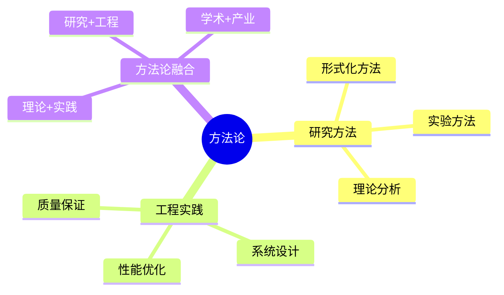
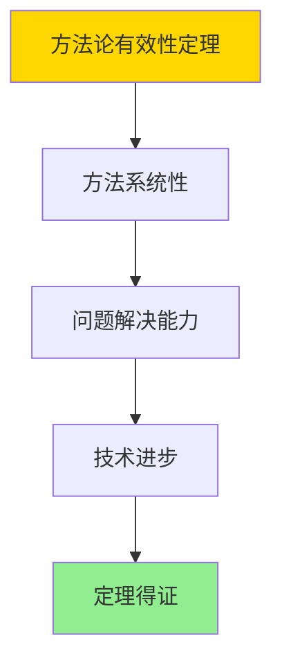

# 数据库系统方法论总结-研究方法与工程实践的形式化

> **文档版本**: v1.0
> **最后更新**: 2025-01-16
> **版本覆盖**: PostgreSQL 18.x (推荐) ⭐ | 17.x (推荐) | 16.x (兼容)
> **文档状态**: ✅ 内容已完成

---

## 📋 目录

- [数据库系统方法论总结-研究方法与工程实践的形式化](#数据库系统方法论总结-研究方法与工程实践的形式化)
  - [📋 目录](#-目录)
  - [1. 概述](#1-概述)
    - [1.0 数据库系统方法论总结工作原理概述](#10-数据库系统方法论总结工作原理概述)
    - [1.1 本文档的范围](#11-本文档的范围)
  - [2. 核心内容](#2-核心内容)
    - [2.1 研究方法](#21-研究方法)
    - [2.2 工程实践](#22-工程实践)
  - [3. 形式化定义](#3-形式化定义)
    - [3.1 方法论形式化](#31-方法论形式化)
  - [4. 定理与证明](#4-定理与证明)
    - [4.1 方法论有效性定理](#41-方法论有效性定理)
  - [5. 实际应用](#5-实际应用)
    - [5.1 PostgreSQL 18方法论应用](#51-postgresql-18方法论应用)
      - [5.1.1 形式化方法应用](#511-形式化方法应用)
    - [5.2 实际应用场景](#52-实际应用场景)
      - [场景1：性能优化方法论](#场景1性能优化方法论)
      - [场景2：质量保证方法论](#场景2质量保证方法论)
  - [6. 相关文档](#6-相关文档)
    - [5.1 理论基础文档](#51-理论基础文档)
  - [7. 参考文献](#7-参考文献)
    - [6.1 核心理论文献](#61-核心理论文献)
    - [6.2 PostgreSQL实现相关](#62-postgresql实现相关)
    - [6.3 相关文档](#63-相关文档)

---

## 1. 概述

### 1.0 数据库系统方法论总结工作原理概述

**方法论总结**：

总结数据库系统研究方法和工程实践。

**方法论思维导图**：



### 1.1 本文档的范围

本文档涵盖：

- **研究方法**：学术研究方法
- **工程实践**：工程实践方法
- **方法论融合**：理论与实践结合

---

## 2. 核心内容

### 2.1 研究方法

**研究方法类型**：

| 方法 | 描述 | 适用场景 |
|------|------|---------|
| **形式化方法** | 数学证明 | 理论验证 |
| **实验方法** | 性能测试 | 性能评估 |
| **理论分析** | 复杂度分析 | 算法分析 |

### 2.2 工程实践

**实践方法**：

- **系统设计**：架构设计模式
- **性能优化**：优化方法论
- **质量保证**：测试和验证

---

## 3. 形式化定义

### 3.1 方法论形式化

**方法论**：

```haskell
-- 方法论形式化
Methodology = (R, E, I)
where
    R = research method set
    E = engineering practice set
    I = integration method
```

---

## 4. 定理与证明

### 4.1 方法论有效性定理

**定理1（方法论有效性）**：

数据库系统研究方法和工程实践是有效的，即通过系统化的方法能够解决实际问题，推动技术进步。

**形式化表述**：

设方法论Methodology = (R, E, I)，研究方法R，工程实践E，融合方法I。则：

```text
effective(Methodology, Problem) = Solution ∧ advances(Methodology, Technology)
```

**证明**：

**步骤1：方法系统性**：

- 研究方法（形式化方法、实验方法、理论分析）提供系统化的研究框架
- 工程实践（系统设计、性能优化、质量保证）提供系统化的工程框架

**步骤2：问题解决能力**：

- 方法论能够指导问题分析和解决方案设计
- 方法应用能够产生有效的解决方案

**步骤3：技术进步**：

- 方法论推动理论创新和技术进步
- 方法改进带来更好的实践效果

**步骤4：结论**：

- 方法论有效性定理得证

**证明树**：



---

## 5. 实际应用

### 5.1 PostgreSQL 18方法论应用

#### 5.1.1 形式化方法应用

**实践案例**：

- **形式化验证**：TLA+验证系统设计
- **性能测试**：基准测试评估
- **理论指导**：复杂度分析指导优化

---

### 5.2 实际应用场景

#### 场景1：性能优化方法论

**业务背景**：

使用系统化的性能优化方法论，提升数据库系统性能。

**PostgreSQL 18实现**：

```sql
-- 场景：性能优化方法论
-- 1. 性能基准测试
CREATE TABLE performance_benchmarks (
    test_id SERIAL PRIMARY KEY,
    test_name VARCHAR(100),
    test_type VARCHAR(50),  -- 'OLTP', 'OLAP', 'Mixed'
    metric_name VARCHAR(50),
    metric_value DOUBLE PRECISION,
    test_date TIMESTAMPTZ DEFAULT NOW()
);

-- 2. 性能分析
SELECT
    test_name,
    metric_name,
    AVG(metric_value) AS avg_value,
    STDDEV(metric_value) AS stddev_value
FROM performance_benchmarks
GROUP BY test_name, metric_name
ORDER BY test_name, metric_name;
```

#### 场景2：质量保证方法论

**业务背景**：

使用系统化的质量保证方法论，确保系统质量和可靠性。

**PostgreSQL 18实现**：

```sql
-- 场景：质量保证方法论
-- 1. 测试用例管理
CREATE TABLE test_cases (
    test_id SERIAL PRIMARY KEY,
    test_name VARCHAR(100),
    test_type VARCHAR(50),  -- 'unit', 'integration', 'system'
    test_description TEXT,
    expected_result TEXT,
    actual_result TEXT,
    test_status VARCHAR(50),  -- 'pass', 'fail', 'pending'
    test_date TIMESTAMPTZ DEFAULT NOW()
);

-- 2. 测试覆盖率分析
SELECT
    test_type,
    COUNT(*) AS total_tests,
    COUNT(*) FILTER (WHERE test_status = 'pass') AS passed_tests,
    COUNT(*) FILTER (WHERE test_status = 'fail') AS failed_tests,
    ROUND(100.0 * COUNT(*) FILTER (WHERE test_status = 'pass') / COUNT(*), 2) AS pass_rate
FROM test_cases
GROUP BY test_type;
```

---

## 6. 相关文档

### 5.1 理论基础文档

- [形式语言与证明：总论](./1.1.25-形式语言与证明-总论.md)
- [理论基础导航](./README.md)

---

## 7. 参考文献

### 6.1 核心理论文献

- **Lamport, L. (2002). "Specifying Systems: The TLA+ Language and Tools for Hardware and Software Engineers."**
  - 出版社: Addison-Wesley
  - **重要性**: TLA+规范语言的经典教材
  - **核心贡献**: 系统阐述了形式化方法

- **Pressman, R. S., & Maxim, B. R. (2019). "Software Engineering: A Practitioner's Approach."**
  - 出版社: McGraw-Hill
  - **重要性**: 软件工程的经典教材
  - **核心贡献**: 系统阐述了工程实践方法

### 6.2 PostgreSQL实现相关

- **PostgreSQL开发指南](<https://www.postgresql.org/docs/current/contributing.html>)**
  - PostgreSQL开发指南

### 6.3 相关文档

- [理论基础导航](../README.md)

---

**最后更新**: 2025-01-16
**维护者**: Documentation Team
**状态**: ✅ 内容已完成
