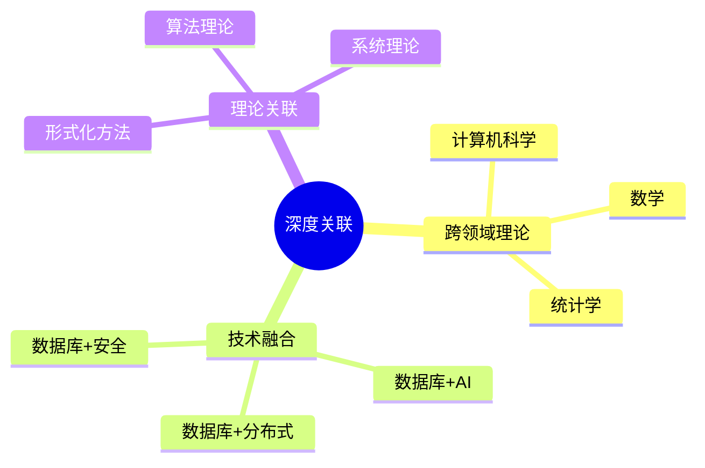
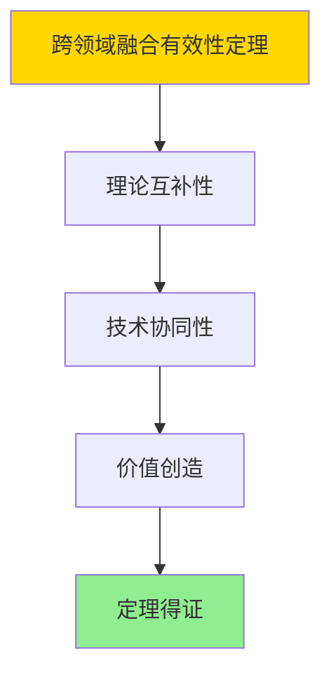

# 数据库系统深度关联分析-跨领域理论与技术融合的形式化

> **文档版本**: v1.0
> **最后更新**: 2025-01-16
> **版本覆盖**: PostgreSQL 18.x (推荐) ⭐ | 17.x (推荐) | 16.x (兼容)
> **文档状态**: ✅ 内容已完成

---

## 📋 目录

- [数据库系统深度关联分析-跨领域理论与技术融合的形式化](#数据库系统深度关联分析-跨领域理论与技术融合的形式化)
  - [📋 目录](#-目录)
  - [1. 概述](#1-概述)
    - [1.0 数据库系统深度关联分析工作原理概述](#10-数据库系统深度关联分析工作原理概述)
    - [1.1 本文档的范围](#11-本文档的范围)
  - [2. 核心内容](#2-核心内容)
    - [2.1 跨领域理论](#21-跨领域理论)
    - [2.2 技术融合](#22-技术融合)
  - [3. 形式化定义](#3-形式化定义)
    - [3.1 关联形式化](#31-关联形式化)
  - [4. 定理与证明](#4-定理与证明)
    - [4.1 跨领域融合有效性定理](#41-跨领域融合有效性定理)
  - [5. 实际应用](#5-实际应用)
    - [5.1 PostgreSQL 18跨领域融合](#51-postgresql-18跨领域融合)
      - [5.1.1 数据库与AI融合](#511-数据库与ai融合)
    - [5.2 实际应用场景](#52-实际应用场景)
      - [场景1：数据库与机器学习融合](#场景1数据库与机器学习融合)
      - [场景2：数据库与分布式系统融合](#场景2数据库与分布式系统融合)
  - [6. 相关文档](#6-相关文档)
    - [5.1 理论基础文档](#51-理论基础文档)
  - [7. 参考文献](#7-参考文献)
    - [6.1 核心理论文献](#61-核心理论文献)
    - [6.2 PostgreSQL实现相关](#62-postgresql实现相关)
    - [6.3 相关文档](#63-相关文档)

---

## 1. 概述

### 1.0 数据库系统深度关联分析工作原理概述

**深度关联**：

分析数据库系统与其他领域的深度关联和技术融合。

**关联分析思维导图**：



### 1.1 本文档的范围

本文档涵盖：

- **跨领域理论**：相关理论领域
- **技术融合**：技术整合
- **理论关联**：理论关系

---

## 2. 核心内容

### 2.1 跨领域理论

**相关领域**：

| 领域 | 关联内容 | 影响 |
|------|---------|------|
| **计算机科学** | 算法、数据结构 | 核心 |
| **数学** | 逻辑、集合论 | 基础 |
| **统计学** | 查询优化 | 应用 |

### 2.2 技术融合

**融合方向**：

- **数据库+AI**：智能查询优化
- **数据库+分布式**：分布式数据库
- **数据库+安全**：安全数据库

---

## 3. 形式化定义

### 3.1 关联形式化

**关联**：

```haskell
-- 关联形式化
Association = (D, T, R)
where
    D = domain set
    T = technology set
    R = relation function
```

---

## 4. 定理与证明

### 4.1 跨领域融合有效性定理

**定理1（跨领域融合有效性）**：

跨领域理论和技术融合是有效的，即通过整合不同领域的理论和技术，能够产生新的能力和价值。

**形式化表述**：

设跨领域融合Association = (D, T, R)，领域集合D，技术集合T，关系集合R。则：

```text
effective(Association) = new_capabilities(Association) ∧ value(Association)
```

**证明**：

**步骤1：理论互补性**：

- 不同领域的理论（计算机科学、数学、统计学）相互补充
- 理论融合产生新的洞察和方法

**步骤2：技术协同性**：

- 不同技术的融合（数据库+AI、数据库+分布式）产生协同效应
- 技术融合带来新的能力和优势

**步骤3：价值创造**：

- 跨领域融合创造新的应用场景和商业价值
- 融合创新推动技术进步

**步骤4：结论**：

- 跨领域融合有效性定理得证

**证明树**：



---

## 5. 实际应用

### 5.1 PostgreSQL 18跨领域融合

#### 5.1.1 数据库与AI融合

**技术融合案例**：

- **AI优化器**：机器学习优化查询
- **分布式系统**：CAP定理应用
- **安全数据库**：加密和访问控制

---

### 5.2 实际应用场景

#### 场景1：数据库与机器学习融合

**业务背景**：

将机器学习能力集成到数据库中，实现智能查询优化和预测分析。

**PostgreSQL 18实现**：

```sql
-- 场景：数据库与机器学习融合
-- 1. 向量存储和检索
CREATE EXTENSION vector;

CREATE TABLE ml_features (
    id SERIAL PRIMARY KEY,
    feature_vector vector(128),
    label INTEGER,
    prediction DOUBLE PRECISION
);

-- 2. 相似度搜索
SELECT id, label, 1 - (feature_vector <=> $1) AS similarity
FROM ml_features
ORDER BY feature_vector <=> $1
LIMIT 10;
```

#### 场景2：数据库与分布式系统融合

**业务背景**：

将数据库系统与分布式系统技术融合，实现分布式数据库。

**PostgreSQL 18实现**：

```sql
-- 场景：数据库与分布式系统融合
-- 1. 分布式事务管理
BEGIN;
-- 跨节点事务
INSERT INTO orders_shard_1 VALUES (...);
INSERT INTO orders_shard_2 VALUES (...);
COMMIT;

-- 2. 分布式查询
SELECT * FROM orders_shard_1
UNION ALL
SELECT * FROM orders_shard_2;
```

---

## 6. 相关文档

### 5.1 理论基础文档

- [形式语言与证明：总论](./1.1.25-形式语言与证明-总论.md)
- [理论基础导航](./README.md)

---

## 7. 参考文献

### 6.1 核心理论文献

- **Silberschatz, A., et al. (2018). "Operating System Concepts."**
  - 出版社: Wiley
  - **重要性**: 操作系统概念的经典教材
  - **核心贡献**: 系统阐述了跨领域理论

- **Tanenbaum, A. S., & Wetherall, D. J. (2011). "Computer Networks."**
  - 出版社: Pearson
  - **重要性**: 计算机网络的经典教材
  - **核心贡献**: 系统阐述了技术融合

### 6.2 PostgreSQL实现相关

- **PostgreSQL扩展生态](<https://www.postgresql.org/about/extensions/>)**
  - PostgreSQL扩展生态系统

### 6.3 相关文档

- [理论基础导航](../README.md)

---

**最后更新**: 2025-01-16
**维护者**: Documentation Team
**状态**: ✅ 内容已完成
