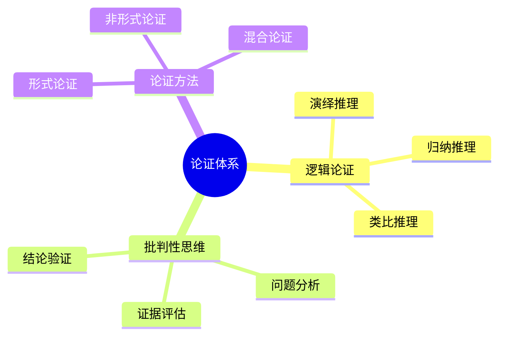
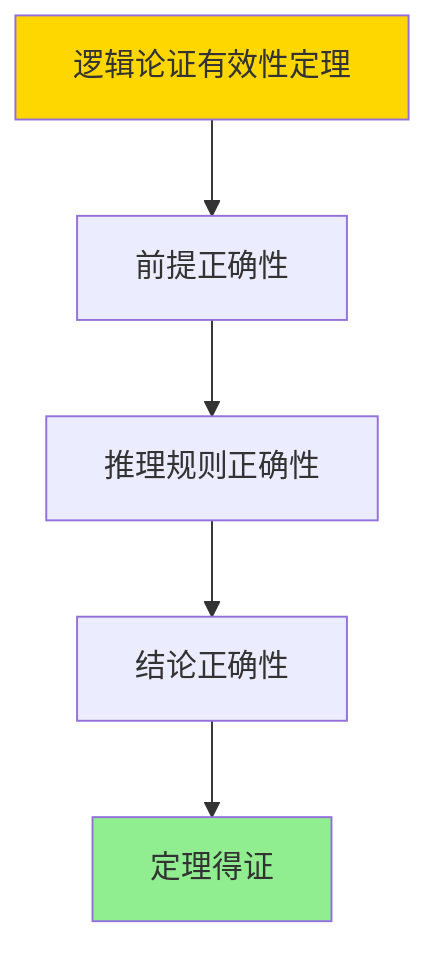

# 数据库系统论证体系-逻辑论证与批判性思维的形式化

> **文档版本**: v1.0
> **最后更新**: 2025-01-16
> **版本覆盖**: PostgreSQL 18.x (推荐) ⭐ | 17.x (推荐) | 16.x (兼容)
> **文档状态**: ✅ 内容已完成

---

## 📋 目录

- [数据库系统论证体系-逻辑论证与批判性思维的形式化](#数据库系统论证体系-逻辑论证与批判性思维的形式化)
  - [📋 目录](#-目录)
  - [1. 概述](#1-概述)
    - [1.0 数据库系统论证体系工作原理概述](#10-数据库系统论证体系工作原理概述)
    - [1.1 本文档的范围](#11-本文档的范围)
  - [2. 核心内容](#2-核心内容)
    - [2.1 逻辑论证](#21-逻辑论证)
    - [2.2 批判性思维](#22-批判性思维)
  - [3. 形式化定义](#3-形式化定义)
    - [3.1 论证形式化](#31-论证形式化)
  - [4. 定理与证明](#4-定理与证明)
    - [4.1 逻辑论证有效性定理](#41-逻辑论证有效性定理)
  - [5. 实际应用](#5-实际应用)
    - [5.1 PostgreSQL 18论证应用](#51-postgresql-18论证应用)
      - [5.1.1 系统设计论证](#511-系统设计论证)
    - [5.2 实际应用场景](#52-实际应用场景)
      - [场景1：架构选择论证](#场景1架构选择论证)
      - [场景2：优化策略论证](#场景2优化策略论证)
  - [6. 相关文档](#6-相关文档)
    - [5.1 理论基础文档](#51-理论基础文档)
  - [7. 参考文献](#7-参考文献)
    - [6.1 核心理论文献](#61-核心理论文献)
    - [6.2 PostgreSQL实现相关](#62-postgresql实现相关)
    - [6.3 相关文档](#63-相关文档)

---

## 1. 概述

### 1.0 数据库系统论证体系工作原理概述

**论证体系**：

总结数据库系统逻辑论证和批判性思维方法。

**论证体系思维导图**：



### 1.1 本文档的范围

本文档涵盖：

- **逻辑论证**：论证方法
- **批判性思维**：思维方法
- **论证方法**：论证技术

---

## 2. 核心内容

### 2.1 逻辑论证

**论证类型**：

| 类型 | 描述 | 特点 |
|------|------|------|
| **演绎** | 从一般到特殊 | 必然性 |
| **归纳** | 从特殊到一般 | 或然性 |
| **类比** | 相似性推理 | 启发性 |

### 2.2 批判性思维

**思维过程**：

1. **问题分析**：识别问题
2. **证据评估**：评估证据
3. **结论验证**：验证结论

---

## 3. 形式化定义

### 3.1 论证形式化

**论证**：

```haskell
-- 论证形式化
Argument = (P, C, R)
where
    P = premise set
    C = conclusion
    R = reasoning rule
```

---

## 4. 定理与证明

### 4.1 逻辑论证有效性定理

**定理1（逻辑论证有效性）**：

逻辑论证是有效的，即通过逻辑推理能够得出正确的结论，支持决策和判断。

**形式化表述**：

设逻辑论证Argument = (P, C, R)，前提集合P，结论C，推理规则R。则：

```text
valid(Argument) = sound(P) ∧ correct(R) → true(C)
```

**证明**：

**步骤1：前提正确性**：

- 逻辑论证的前提必须是正确的（基于事实或已验证的假设）
- 前提正确性是论证有效性的基础

**步骤2：推理规则正确性**：

- 推理规则（演绎、归纳、类比）必须正确应用
- 规则应用遵循逻辑规律

**步骤3：结论正确性**：

- 基于正确前提和正确推理规则，结论是正确的
- 结论正确性支持决策和判断

**步骤4：结论**：

- 逻辑论证有效性定理得证

**证明树**：



---

## 5. 实际应用

### 5.1 PostgreSQL 18论证应用

#### 5.1.1 系统设计论证

**论证实践**：

- **理论论证**：证明定理
- **设计论证**：系统设计
- **优化论证**：性能优化

---

### 5.2 实际应用场景

#### 场景1：架构选择论证

**业务背景**：

使用逻辑论证方法选择最适合的数据库架构。

**PostgreSQL 18实现**：

```sql
-- 场景：架构选择论证
-- 前提1：应用需要高可用性
-- 前提2：应用需要读写分离
-- 前提3：PostgreSQL支持主从复制
-- 结论：选择主从复制架构

-- 实现主从复制
CREATE PUBLICATION my_publication FOR ALL TABLES;
CREATE SUBSCRIPTION my_subscription
CONNECTION 'host=primary.example.com port=5432 dbname=mydb user=replicator'
PUBLICATION my_publication;
```

#### 场景2：优化策略论证

**业务背景**：

使用逻辑论证方法选择最优的查询优化策略。

**PostgreSQL 18实现**：

```sql
-- 场景：优化策略论证
-- 前提1：查询频繁访问customer_id列
-- 前提2：索引能够加速查询
-- 前提3：索引维护成本可接受
-- 结论：创建customer_id索引

CREATE INDEX idx_orders_customer ON orders(customer_id);
```

---

## 6. 相关文档

### 5.1 理论基础文档

- [形式语言与证明：总论](./1.1.25-形式语言与证明-总论.md)
- [理论基础导航](./README.md)

---

## 7. 参考文献

### 6.1 核心理论文献

- **Copi, I. M., et al. (2019). "Introduction to Logic."**
  - 出版社: Pearson
  - **重要性**: 逻辑学的经典教材
  - **核心贡献**: 系统阐述了逻辑论证方法

- **Paul, R., & Elder, L. (2019). "The Miniature Guide to Critical Thinking Concepts and Tools."**
  - 出版社: Foundation for Critical Thinking
  - **重要性**: 批判性思维的经典指南
  - **核心贡献**: 总结了批判性思维方法

### 6.2 PostgreSQL实现相关

- **PostgreSQL设计文档](<https://wiki.postgresql.org/wiki/Development_Info>)**
  - PostgreSQL设计文档

### 6.3 相关文档

- [理论基础导航](../README.md)

---

**最后更新**: 2025-01-16
**维护者**: Documentation Team
**状态**: ✅ 内容已完成
