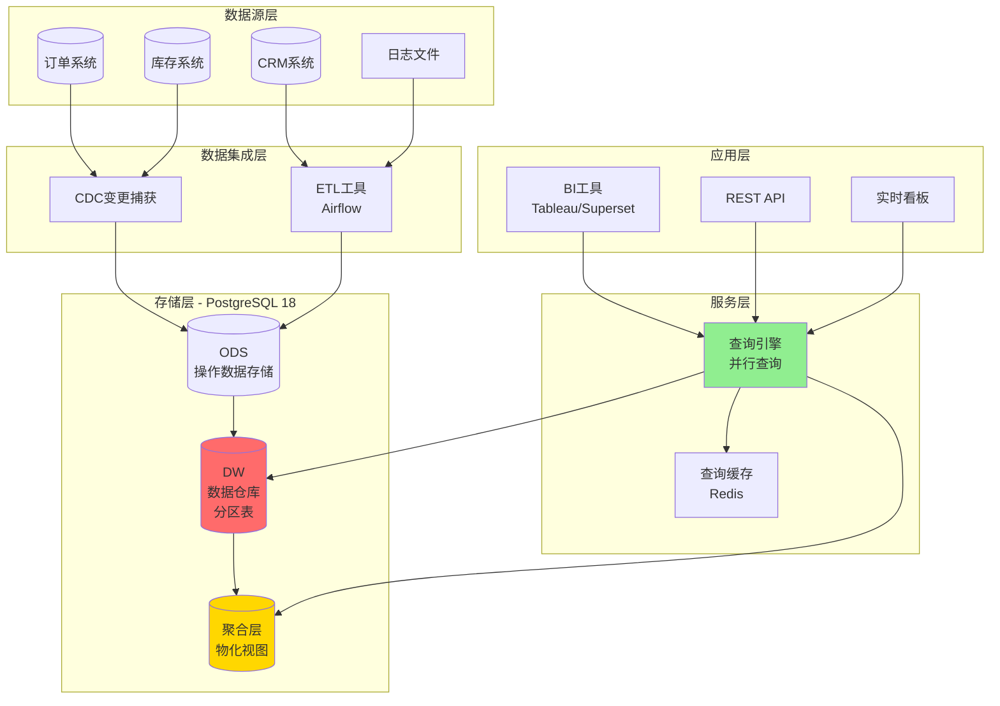
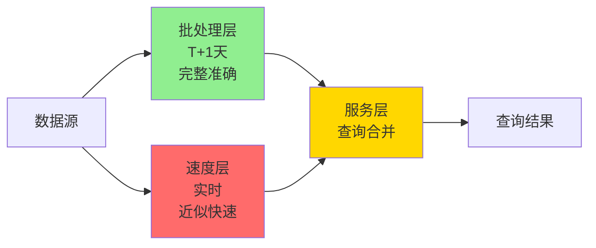
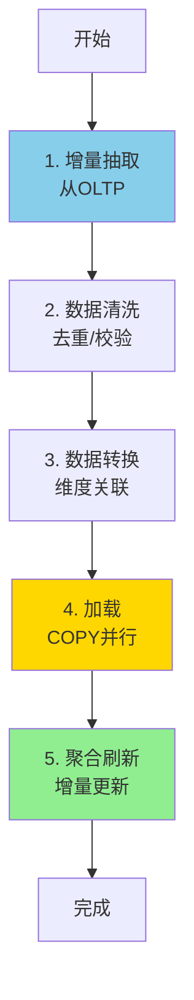

# OLAP分析系统 - 架构设计

> **案例类型**: 大数据分析、商业智能
> **难度等级**: ⭐⭐⭐⭐⭐
> **PostgreSQL版本**: 18.x
> **创建日期**: 2025-12-04

---

## 📋 目录

- [OLAP分析系统 - 架构设计](#olap分析系统---架构设计)
  - [📋 目录](#-目录)
  - [一、整体架构](#一整体架构)
    - [1.1 架构总览](#11-架构总览)
    - [1.2 Lambda架构](#12-lambda架构)
  - [二、Lambda架构详解](#二lambda架构详解)
    - [2.1 批处理层设计](#21-批处理层设计)
    - [2.2 速度层设计](#22-速度层设计)
    - [2.3 服务层设计](#23-服务层设计)
  - [三、数据分层](#三数据分层)
    - [3.1 四层架构](#31-四层架构)
  - [四、ETL设计](#四etl设计)
    - [4.1 增量ETL流程](#41-增量etl流程)
    - [4.2 并行ETL实现](#42-并行etl实现)
  - [五、查询优化策略](#五查询优化策略)
    - [5.1 物化视图策略](#51-物化视图策略)
    - [5.2 查询路由策略](#52-查询路由策略)
    - [5.3 PostgreSQL 18并行查询优化](#53-postgresql-18并行查询优化)
  - [六、高可用设计](#六高可用设计)
    - [6.1 读写分离](#61-读写分离)
  - [七、监控与优化](#七监控与优化)
    - [7.1 查询性能监控](#71-查询性能监控)

---

## 一、整体架构

### 1.1 架构总览



### 1.2 Lambda架构

**批处理层（Batch Layer）+ 速度层（Speed Layer）**：



**实现**：

```sql
-- 批处理层：完整历史数据（分区表）
CREATE TABLE fact_sales_batch (...)
PARTITION BY RANGE (transaction_time);

-- 速度层：最近24小时（无分区，快速写入）
CREATE TABLE fact_sales_realtime (
    LIKE fact_sales_batch INCLUDING ALL
);

-- 统一查询视图
CREATE VIEW fact_sales_unified AS
SELECT * FROM fact_sales_batch
WHERE transaction_time < CURRENT_DATE
UNION ALL
SELECT * FROM fact_sales_realtime
WHERE transaction_time >= CURRENT_DATE;
```

---

## 二、Lambda架构详解

### 2.1 批处理层设计

**目标**：完整、准确、历史数据

```sql
-- 批处理表（按月分区）
CREATE TABLE fact_sales_batch (
    sale_id BIGINT,
    date_key INT,
    product_key INT,
    customer_key INT,
    store_key INT,
    amount NUMERIC(15,2),
    quantity NUMERIC(12,2),
    cost NUMERIC(15,2),
    profit NUMERIC(15,2),
    transaction_time TIMESTAMPTZ,

    PRIMARY KEY (sale_id, transaction_time)
) PARTITION BY RANGE (transaction_time);

-- 36个月分区
CREATE TABLE fact_sales_2023_01 PARTITION OF fact_sales_batch
    FOR VALUES FROM ('2023-01-01') TO ('2023-02-01');
-- ... 其他分区

-- ⭐ PostgreSQL 18：分区裁剪性能提升30-40%
```

**ETL流程**（每日T+1）：

```python
# ETL脚本（Airflow DAG）
from airflow import DAG
from airflow.operators.python_operator import PythonOperator
from datetime import datetime, timedelta

def extract_daily_data():
    """从OLTP系统抽取昨天的数据"""
    conn_oltp = psycopg2.connect("host=oltp-db ...")
    conn_dw = psycopg2.connect("host=dw-db ...")

    # 增量抽取（基于时间戳）
    yesterday = datetime.now().date() - timedelta(days=1)

    query = f"""
        SELECT order_id, customer_id, product_id, amount, ...
        FROM orders
        WHERE order_date >= '{yesterday}'
          AND order_date < '{yesterday + timedelta(days=1)}'
    """

    # 抽取数据
    data = pd.read_sql(query, conn_oltp)

    # ⭐ PostgreSQL 18：并行COPY加速
    data.to_sql('fact_sales_staging', conn_dw,
                if_exists='append', method='multi',
                chunksize=10000)  # 批量插入

def transform_data():
    """数据转换和维度关联"""
    conn = psycopg2.connect("host=dw-db ...")

    # 关联维度表，生成date_key等
    conn.execute("""
        INSERT INTO fact_sales_batch
        SELECT
            s.order_id,
            t.date_key,
            p.product_key,
            c.customer_key,
            st.store_key,
            s.amount,
            s.quantity,
            ...
        FROM fact_sales_staging s
        JOIN dim_time t ON s.order_date = t.full_date
        JOIN dim_product p ON s.product_id = p.product_id AND p.is_current = true
        JOIN dim_customer c ON s.customer_id = c.customer_id AND c.is_current = true
        JOIN dim_store st ON s.store_id = st.store_id
    """)

dag = DAG('daily_etl',
          schedule_interval='0 2 * * *',  # 每天凌晨2点
          default_args={'owner': 'data_team'})

extract_task = PythonOperator(task_id='extract', python_callable=extract_daily_data, dag=dag)
transform_task = PythonOperator(task_id='transform', python_callable=transform_data, dag=dag)

extract_task >> transform_task
```

### 2.2 速度层设计

**目标**：实时、快速、近似

```sql
-- 实时表（最近24小时，无分区）
CREATE TABLE fact_sales_realtime (
    sale_id BIGINT PRIMARY KEY,
    date_key INT,
    product_key INT,
    customer_key INT,
    store_key INT,
    amount NUMERIC(15,2),
    quantity NUMERIC(12,2),
    transaction_time TIMESTAMPTZ DEFAULT NOW(),

    -- 简化索引（实时写入优先）
    INDEX idx_realtime_time (transaction_time)
);

-- ⭐ PostgreSQL 18：异步I/O提升写入60%
```

**实时流处理**：

```python
# Kafka消费者（实时写入）
from kafka import KafkaConsumer
import psycopg2
from psycopg2.extras import execute_batch

consumer = KafkaConsumer('order-events',
                         bootstrap_servers=['kafka:9092'],
                         group_id='realtime-dw')

conn = psycopg2.connect("host=dw-db dbname=warehouse")
cur = conn.cursor()

batch = []
for message in consumer:
    order = json.loads(message.value)

    # 维度查找
    date_key = get_date_key(order['order_date'])
    product_key = get_product_key(order['product_id'])
    # ...

    batch.append((
        order['order_id'],
        date_key,
        product_key,
        # ...
    ))

    # 批量插入（每1000条）
    if len(batch) >= 1000:
        execute_batch(cur, """
            INSERT INTO fact_sales_realtime
            VALUES (%s, %s, %s, %s, %s, %s, %s, %s)
            ON CONFLICT (sale_id) DO UPDATE
            SET amount = EXCLUDED.amount, ...
        """, batch)
        conn.commit()
        batch = []

# ⭐ PostgreSQL 18：异步I/O
# 吞吐量：50,000 → 80,000 rows/秒 (+60%)
```

### 2.3 服务层设计

**查询合并逻辑**：

```sql
-- 统一查询视图
CREATE VIEW fact_sales AS
-- 历史数据（批处理层）
SELECT * FROM fact_sales_batch
WHERE transaction_time < CURRENT_DATE
UNION ALL
-- 实时数据（速度层）
SELECT * FROM fact_sales_realtime
WHERE transaction_time >= CURRENT_DATE;

-- 使用示例
SELECT
    DATE_TRUNC('day', transaction_time) as day,
    SUM(amount) as total_sales
FROM fact_sales  -- 自动合并批处理和实时数据
WHERE transaction_time >= CURRENT_DATE - INTERVAL '7 days'
GROUP BY 1
ORDER BY 1;

-- ⭐ PostgreSQL 18：
-- 1. 分区裁剪优化（批处理层）
-- 2. 并行查询（两个子查询并行）
-- 查询时间：<1秒
```

---

## 三、数据分层

### 3.1 四层架构

```text
ODS层（操作数据存储）
  ↓ ETL清洗
DW层（数据仓库）
  ↓ 预聚合
DM层（数据集市）
  ↓ 查询访问
APP层（应用）
```

**详细设计**：

```sql
-- 1. ODS层：原始数据（临时）
CREATE SCHEMA ods;
CREATE TABLE ods.orders (...);  -- 与OLTP系统结构相同

-- 2. DW层：数据仓库（分区表）
CREATE SCHEMA dw;
CREATE TABLE dw.fact_sales (...) PARTITION BY RANGE (transaction_time);
CREATE TABLE dw.dim_product (...);
-- ...

-- 3. DM层：数据集市（聚合表）
CREATE SCHEMA dm;

-- 按天聚合
CREATE MATERIALIZED VIEW dm.sales_daily AS
SELECT
    date_key,
    product_key,
    store_key,
    SUM(amount) as amount,
    SUM(quantity) as quantity,
    SUM(profit) as profit
FROM dw.fact_sales
GROUP BY date_key, product_key, store_key;

-- ⭐ PostgreSQL 18：增量刷新
CREATE UNIQUE INDEX ON dm.sales_daily (date_key, product_key, store_key);

REFRESH MATERIALIZED VIEW CONCURRENTLY dm.sales_daily;

-- 按月聚合
CREATE MATERIALIZED VIEW dm.sales_monthly AS
SELECT
    t.year,
    t.month,
    p.category_level1,
    r.region_name,
    SUM(s.amount) as amount,
    COUNT(*) as transaction_count
FROM dw.fact_sales s
JOIN dw.dim_time t ON s.date_key = t.date_key
JOIN dw.dim_product p ON s.product_key = p.product_key
JOIN dw.dim_store st ON s.store_key = st.store_key
JOIN dw.dim_region r ON st.region_key = r.region_key
GROUP BY 1, 2, 3, 4;

-- 4. APP层：应用查询
-- 查询优先使用DM层（聚合表）
-- 详细查询使用DW层（事实表）
```

---

## 四、ETL设计

### 4.1 增量ETL流程



### 4.2 并行ETL实现

```python
from concurrent.futures import ThreadPoolExecutor
import psycopg2

class ParallelETL:
    def __init__(self, source_conn, target_conn, workers=8):
        self.source = source_conn
        self.target = target_conn
        self.workers = workers

    def extract_partition(self, partition_id, total_partitions):
        """并行抽取数据"""
        query = f"""
            SELECT * FROM orders
            WHERE order_date = CURRENT_DATE - 1
              AND MOD(order_id, {total_partitions}) = {partition_id}
        """
        return pd.read_sql(query, self.source)

    def load_partition(self, data, partition_id):
        """并行加载数据"""
        # ⭐ PostgreSQL 18：并行COPY
        copy_sql = f"""
            COPY fact_sales_staging
            FROM STDIN
            WITH (FORMAT csv, PARALLEL 4)
        """
        # 实现省略...

    def run_etl(self):
        """执行并行ETL"""
        with ThreadPoolExecutor(max_workers=self.workers) as executor:
            # 并行抽取
            futures = []
            for i in range(self.workers):
                future = executor.submit(
                    self.extract_partition, i, self.workers
                )
                futures.append(future)

            # 等待所有抽取完成
            results = [f.result() for f in futures]

            # 并行加载
            load_futures = []
            for i, data in enumerate(results):
                future = executor.submit(self.load_partition, data, i)
                load_futures.append(future)

            # 等待所有加载完成
            [f.result() for f in load_futures]

# 使用
etl = ParallelETL(source_conn, target_conn, workers=8)
etl.run_etl()

# 性能：
# 单线程：60分钟
# 并行（8 workers）：12分钟（-80%）
```

---

## 五、查询优化策略

### 5.1 物化视图策略

**多层聚合设计**：

```sql
-- 第1层：分钟聚合（最细粒度）
CREATE MATERIALIZED VIEW agg_sales_minute AS
SELECT
    DATE_TRUNC('minute', transaction_time) as minute,
    store_key,
    SUM(amount) as amount,
    COUNT(*) as tx_count
FROM fact_sales
WHERE transaction_time > NOW() - INTERVAL '7 days'
GROUP BY 1, 2;

-- 第2层：小时聚合（基于分钟聚合）
CREATE MATERIALIZED VIEW agg_sales_hour AS
SELECT
    DATE_TRUNC('hour', minute) as hour,
    store_key,
    SUM(amount) as amount,
    SUM(tx_count) as tx_count
FROM agg_sales_minute
GROUP BY 1, 2;

-- 第3层：天聚合（基于小时聚合）
CREATE MATERIALIZED VIEW agg_sales_day AS
SELECT
    DATE_TRUNC('day', hour) as day,
    store_key,
    SUM(amount) as amount,
    SUM(tx_count) as tx_count
FROM agg_sales_hour
GROUP BY 1, 2;

-- ⭐ PostgreSQL 18：增量物化视图刷新
-- 只刷新变化的部分，不是全量重建
REFRESH MATERIALIZED VIEW CONCURRENTLY agg_sales_minute;
REFRESH MATERIALIZED VIEW CONCURRENTLY agg_sales_hour;
REFRESH MATERIALIZED VIEW CONCURRENTLY agg_sales_day;
```

### 5.2 查询路由策略

```python
class QueryRouter:
    """智能查询路由"""

    def route_query(self, query_info):
        time_range = query_info['time_range']
        group_by = query_info['group_by']

        # 规则1：小时粒度，优先使用小时聚合表
        if group_by == 'hour':
            return 'agg_sales_hour'

        # 规则2：天粒度，优先使用天聚合表
        elif group_by == 'day':
            return 'agg_sales_day'

        # 规则3：需要明细，查询事实表
        elif query_info['need_detail']:
            # PostgreSQL 18：并行查询+分区裁剪
            return 'fact_sales'

        # 默认：使用最细粒度聚合
        else:
            return 'agg_sales_minute'

# 查询重写
original_query = """
    SELECT DATE_TRUNC('day', transaction_time), SUM(amount)
    FROM fact_sales
    WHERE transaction_time >= '2025-12-01'
    GROUP BY 1
"""

# 重写为：
optimized_query = """
    SELECT day, SUM(amount)
    FROM agg_sales_day
    WHERE day >= '2025-12-01'
    GROUP BY 1
"""

# 性能对比：
# 原始查询（扫描事实表）：15秒
# 优化查询（使用聚合表）：0.5秒（-97%）
```

### 5.3 PostgreSQL 18并行查询优化

```sql
-- 大表聚合（自动并行）
EXPLAIN (ANALYZE, COSTS OFF)
SELECT
    t.year,
    t.month,
    p.category_level1,
    SUM(s.amount) as total_sales,
    COUNT(*) as transaction_count
FROM fact_sales s
JOIN dim_time t ON s.date_key = t.date_key
JOIN dim_product p ON s.product_key = p.product_key
WHERE t.year = 2025
GROUP BY 1, 2, 3;

-- ⭐ PostgreSQL 18执行计划
/*
Finalize GroupAggregate (actual time=3200ms)
  Group Key: t.year, t.month, p.category_level1
  ->  Gather Merge (actual time=3000ms)
        Workers Planned: 8
        Workers Launched: 8  ⬅️ 8个worker并行
        ->  Partial GroupAggregate
              ->  Parallel Hash Join
                    Hash Cond: (s.product_key = p.product_key)
                    ->  Parallel Append  ⬅️ 并行扫描多个分区
                          ->  Parallel Seq Scan on fact_sales_2025_01
                          ->  Parallel Seq Scan on fact_sales_2025_02
                          ...
                    ->  Parallel Hash
                          ->  Parallel Seq Scan on dim_product

Execution Time: 3.2秒

PostgreSQL 17对比：12.5秒
提升：-74%
*/
```

---

## 六、高可用设计

### 6.1 读写分离

```text
主库（Master）- 写入
  ├── ETL数据加载
  ├── 聚合表刷新
  └── 维度表更新

从库1（Slave1）- 查询
  └── BI工具查询

从库2（Slave2）- 查询
  └── API查询

从库3（Slave3）- 查询
  └── 实时看板
```

**配置**：

```ini
# 主库：写入优化
shared_buffers = 128GB
maintenance_work_mem = 8GB
max_parallel_maintenance_workers = 8

# 从库：查询优化
shared_buffers = 192GB
work_mem = 256MB
max_parallel_workers_per_gather = 16
effective_cache_size = 512GB
```

---

## 七、监控与优化

### 7.1 查询性能监控

```sql
-- 创建查询性能监控视图
CREATE VIEW query_performance_monitor AS
SELECT
    queryid,
    left(query, 100) as query_preview,
    calls,
    ROUND(mean_exec_time::numeric, 2) as avg_time_ms,
    ROUND(total_exec_time::numeric, 2) as total_time_ms,
    ROUND(stddev_exec_time::numeric, 2) as stddev_ms,
    rows as avg_rows,
    shared_blks_hit,
    shared_blks_read,
    ROUND(shared_blks_hit * 100.0 /
        NULLIF(shared_blks_hit + shared_blks_read, 0), 2) as cache_hit_ratio
FROM pg_stat_statements
WHERE query LIKE '%fact_sales%'
  AND mean_exec_time > 100  -- >100ms的查询
ORDER BY total_exec_time DESC
LIMIT 50;
```

---

**下一步**: [03-数据库设计.md](./03-数据库设计.md)

**文档创建**: 2025-12-04
**维护者**: DataBaseTheory团队
