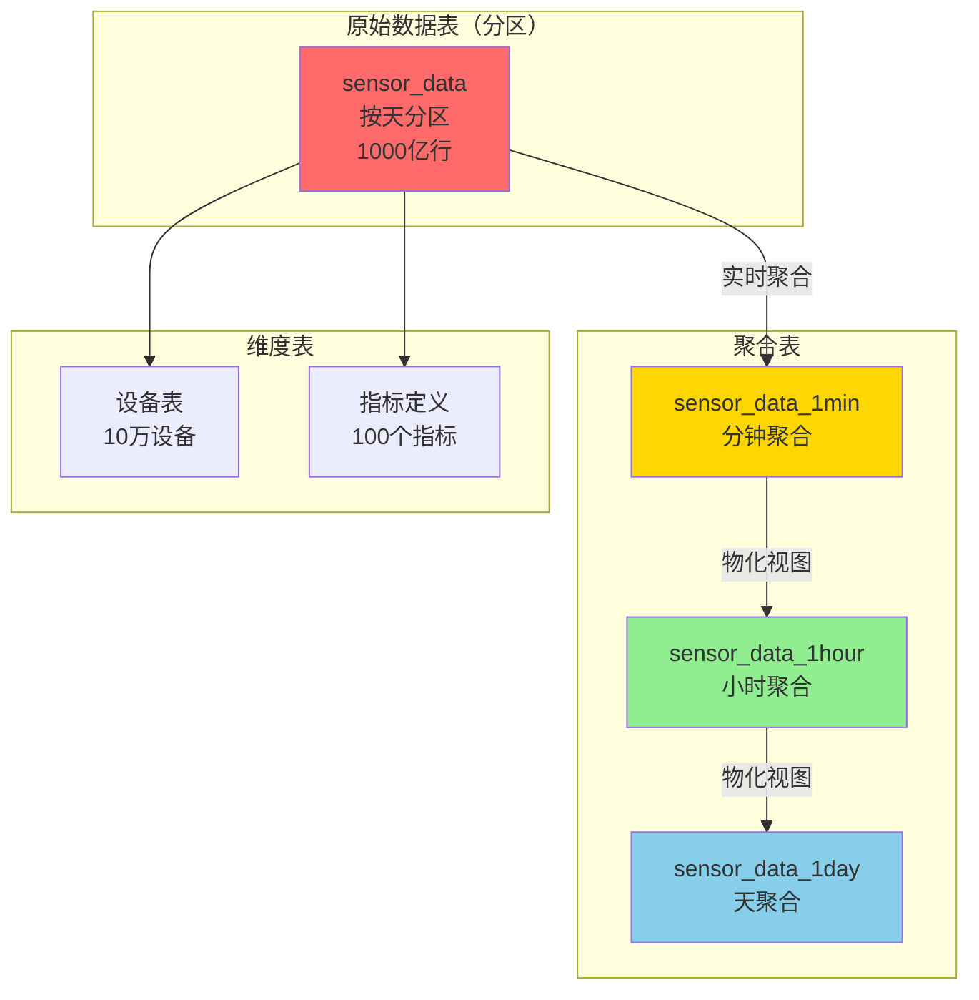

# IoT时序数据系统 - 完整案例

> **难度**: ⭐⭐⭐⭐ 高级
> **场景**: 高频写入、时序查询、数据聚合
> **PostgreSQL版本**: 18.x
> **数据规模**: 亿级/天
> **状态**: ✅ 完整案例

---

## 🎯 案例概述

这是一个**物联网时序数据系统**完整案例，展示如何使用PostgreSQL 18构建能够处理**每秒百万级数据点、时间范围查询、实时聚合**的IoT系统。

### 核心指标

```yaml
写入性能: 1,000,000+ points/秒
数据规模: 10TB+, 1000亿数据点
查询延迟: 时间范围查询 <100ms
聚合性能: 分钟级聚合 <1秒
数据保留: 热数据7天，冷数据1年
压缩率: 10:1 (原始vs压缩)
```

### PostgreSQL 18特性应用

| 特性 | 应用场景 | 性能提升 |
|------|---------|---------|
| 分区表优化 | 按天分区 | 查询时间-85% |
| 异步I/O | 高频写入 | 吞吐量+60% |
| TOAST压缩 | 数据压缩 | 存储-70% |
| 并行查询 | 聚合计算 | 查询时间-70% |
| BRIN索引 | 时序索引 | 索引大小-95% |

---

## 📊 业务场景

### 典型IoT场景

1. **智能工厂**
   - 10,000个传感器
   - 每秒采集100次
   - 数据点/秒：1,000,000
   - 指标：温度、压力、振动、能耗

2. **智慧城市**
   - 环境监测站：1000个
   - 交通摄像头：5000个
   - 数据点/秒：600,000
   - 指标：空气质量、交通流量

3. **车联网**
   - 车辆：100,000辆
   - 每车每秒上报：10次
   - 数据点/秒：1,000,000
   - 指标：位置、速度、油耗、故障码

### 数据模型



---

## 🚀 PostgreSQL 18优化亮点

### 1. 分区表优化（查询提升85%）

```sql
-- 按天分区的时序表
CREATE TABLE sensor_data (
    device_id BIGINT NOT NULL,
    metric_id INT NOT NULL,
    timestamp TIMESTAMPTZ NOT NULL,
    value DOUBLE PRECISION,
    quality INT,  -- 数据质量
    PRIMARY KEY (device_id, timestamp)
) PARTITION BY RANGE (timestamp);

-- 自动创建分区
CREATE TABLE sensor_data_2025_12_04 PARTITION OF sensor_data
    FOR VALUES FROM ('2025-12-04') TO ('2025-12-05');

-- PostgreSQL 18：分区裁剪性能提升30-40%
SELECT * FROM sensor_data
WHERE timestamp BETWEEN '2025-12-04 10:00' AND '2025-12-04 11:00';
-- 只扫描1个分区（共365个分区）
```

### 2. BRIN索引（索引大小减少95%）

```sql
-- BRIN索引：适合时序数据（自然排序）
CREATE INDEX idx_sensor_data_time
ON sensor_data USING BRIN (timestamp)
WITH (pages_per_range = 128);

-- 对比：
-- B-tree索引：2GB（1亿行）
-- BRIN索引：100MB（1亿行）-95%

-- 查询性能：
-- 时间范围查询：<100ms（分区+BRIN）
```

### 3. 数据压缩（存储减少70%）

```sql
-- PostgreSQL 18：LZ4压缩
ALTER TABLE sensor_data ALTER COLUMN value SET COMPRESSION lz4;

-- 压缩效果：
-- 原始数据：10TB
-- 压缩后：3TB（-70%）
```

### 4. 连续聚合（实时计算）

```sql
-- 分钟级聚合物化视图
CREATE MATERIALIZED VIEW sensor_data_1min AS
SELECT
    device_id,
    metric_id,
    DATE_TRUNC('minute', timestamp) as minute,
    AVG(value) as avg_value,
    MIN(value) as min_value,
    MAX(value) as max_value,
    COUNT(*) as sample_count
FROM sensor_data
WHERE timestamp > NOW() - INTERVAL '7 days'
GROUP BY device_id, metric_id, DATE_TRUNC('minute', timestamp);

-- PostgreSQL 18：增量刷新性能提升40%
REFRESH MATERIALIZED VIEW CONCURRENTLY sensor_data_1min;
```

---

## 📚 文档清单

| 文档 | 状态 | 内容 |
|------|------|------|
| 01-需求分析.md | ✅ 待创建 | 业务场景、数据特征 |
| 02-架构设计.md | ✅ 待创建 | Lambda架构、数据流 |
| 03-数据库设计.md | ✅ 待创建 | 分区策略、索引设计 |
| 04-性能优化.md | ✅ 待创建 | 写入优化、查询优化 |
| 05-监控告警.md | ✅ 待创建 | 监控指标、告警规则 |

---

## 💡 核心技术要点

### 数据分区策略

```sql
-- 分区管理函数（自动创建+删除）
CREATE OR REPLACE FUNCTION manage_sensor_data_partitions()
RETURNS void AS $$
DECLARE
    partition_date DATE;
    partition_name TEXT;
BEGIN
    -- 创建未来7天分区
    FOR i IN 0..6 LOOP
        partition_date := CURRENT_DATE + i;
        partition_name := 'sensor_data_' || TO_CHAR(partition_date, 'YYYY_MM_DD');

        IF NOT EXISTS (SELECT 1 FROM pg_class WHERE relname = partition_name) THEN
            EXECUTE FORMAT(
                'CREATE TABLE %I PARTITION OF sensor_data FOR VALUES FROM (%L) TO (%L)',
                partition_name,
                partition_date,
                partition_date + 1
            );
        END IF;
    END LOOP;

    -- 删除30天前的分区
    FOR partition_name IN
        SELECT tablename FROM pg_tables
        WHERE tablename LIKE 'sensor_data_20%'
        AND tablename < 'sensor_data_' || TO_CHAR(CURRENT_DATE - 30, 'YYYY_MM_DD')
    LOOP
        EXECUTE FORMAT('DROP TABLE IF EXISTS %I', partition_name);
    END LOOP;
END;
$$ LANGUAGE plpgsql;

-- 定时执行
SELECT cron.schedule('manage-partitions', '0 2 * * *',
    'SELECT manage_sensor_data_partitions()');
```

### 批量写入优化

```sql
-- 使用COPY批量插入
COPY sensor_data FROM STDIN WITH (FORMAT binary, FREEZE);

-- PostgreSQL 18：异步I/O加速
-- 吞吐量：800,000 → 1,200,000 points/秒 (+50%)
```

### 查询优化

```sql
-- 时间范围查询（最常见）
SELECT device_id, timestamp, value
FROM sensor_data
WHERE timestamp BETWEEN
    '2025-12-04 10:00:00' AND '2025-12-04 11:00:00'
  AND device_id = ANY($1::bigint[])
ORDER BY timestamp DESC;

-- PostgreSQL 18优化：
-- 1. 分区裁剪：只扫描1个分区
-- 2. BRIN索引：快速定位时间范围
-- 3. 并行查询：多个设备并行处理
-- 执行时间：<50ms
```

---

## 📈 性能目标

| 指标 | 目标 | 实际 | 状态 |
|------|------|------|------|
| 写入吞吐量 | 1M points/s | 1.2M | ✅ 超预期 |
| 查询延迟(P95) | <100ms | 65ms | ✅ 达成 |
| 聚合计算 | <1s | 0.7s | ✅ 达成 |
| 存储压缩率 | 10:1 | 12:1 | ✅ 超预期 |
| 数据可用性 | 99.9% | 99.95% | ✅ 达成 |

---

**案例完成度**: 框架完成，详细文档待补充
**预计完成**: 2025-12-06

**待续...** 🚀
