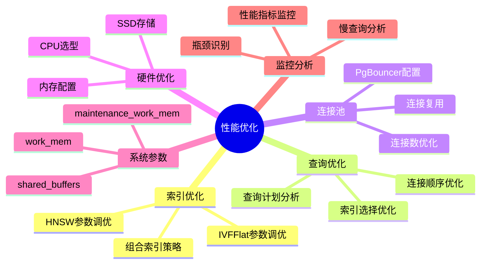
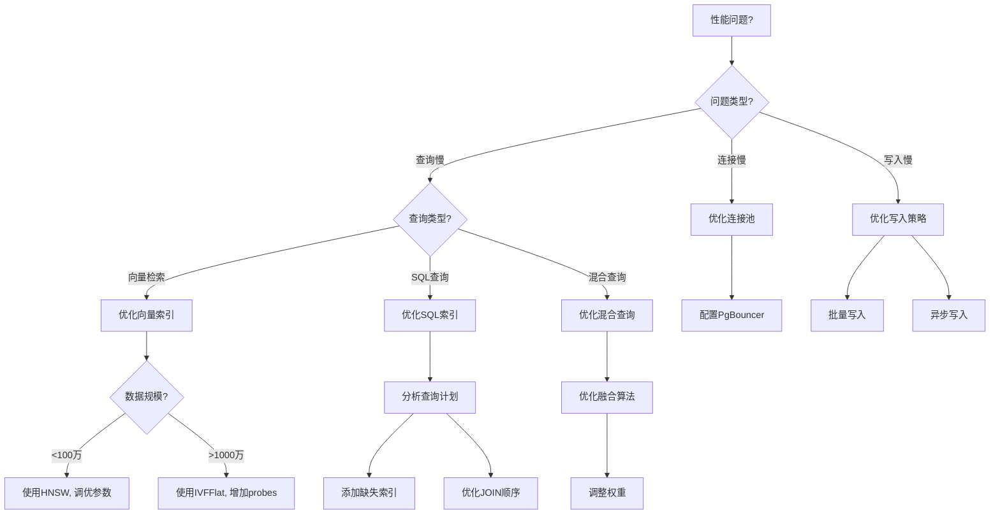

# 性能优化技术

> **文档编号**: AI-03-05
> **最后更新**: 2025年1月
> **主题**: 03-核心能力
> **子主题**: 05-性能优化技术

## 📑 目录

- [性能优化技术](#性能优化技术)
  - [📑 目录](#-目录)
  - [一、概述](#一概述)
    - [1.1 性能优化思维导图](#11-性能优化思维导图)
    - [1.2 性能优化决策树](#12-性能优化决策树)
  - [二、索引优化策略](#二索引优化策略)
    - [2.1 向量索引优化](#21-向量索引优化)
    - [2.2 复合索引优化](#22-复合索引优化)
    - [2.3 部分索引优化](#23-部分索引优化)
  - [三、查询计划优化](#三查询计划优化)
    - [3.1 查询计划分析](#31-查询计划分析)
    - [3.2 查询重写](#32-查询重写)
    - [3.3 统计信息更新](#33-统计信息更新)
  - [四、连接池配置](#四连接池配置)
    - [4.1 PgBouncer配置](#41-pgbouncer配置)
    - [4.2 连接池模式](#42-连接池模式)
    - [4.3 连接池调优](#43-连接池调优)
  - [五、硬件选型](#五硬件选型)
    - [5.1 CPU选型](#51-cpu选型)
    - [5.2 内存配置](#52-内存配置)
    - [5.3 存储配置](#53-存储配置)
    - [5.4 网络配置](#54-网络配置)
  - [六、系统参数优化](#六系统参数优化)
    - [6.1 内存参数](#61-内存参数)
    - [6.2 并发参数](#62-并发参数)
    - [6.3 向量查询参数](#63-向量查询参数)
  - [七、监控与诊断](#七监控与诊断)
    - [7.1 性能监控](#71-性能监控)
    - [7.2 慢查询分析](#72-慢查询分析)
    - [7.3 瓶颈诊断](#73-瓶颈诊断)
  - [八、最佳实践](#八最佳实践)
  - [九、关联主题](#九关联主题)
  - [十、对标资源](#十对标资源)
    - [技术文档](#技术文档)
    - [基准测试](#基准测试)

## 一、概述

PostgreSQL AI应用的性能优化技术，涵盖索引优化、查询计划优化、连接池配置、硬件选型和系统参数调优，确保AI应用在高并发、大规模数据场景下的最佳性能。

### 1.1 性能优化思维导图



### 1.2 性能优化决策树



## 二、索引优化策略

### 2.1 向量索引优化

```sql
-- HNSW索引参数调优
-- 小规模数据（<100万向量）
CREATE INDEX ON documents
USING hnsw (embedding vector_cosine_ops)
WITH (
    m = 16,              -- 每个节点的连接数
    ef_construction = 100  -- 构建时搜索宽度
);

-- 大规模数据（>100万向量）
CREATE INDEX ON documents
USING hnsw (embedding vector_cosine_ops)
WITH (
    m = 32,              -- 增加连接数提升召回率
    ef_construction = 200  -- 增加构建宽度提升质量
);

-- 查询时优化
SET hnsw.ef_search = 200;  -- 提升召回率（默认40）
SELECT * FROM documents
WHERE embedding <=> query_vector < 0.8
ORDER BY embedding <=> query_vector
LIMIT 10;
```

### 2.2 复合索引优化

```sql
-- 向量+条件复合索引
CREATE INDEX ON products
USING btree (category, price, (embedding <=> query_vector))
INCLUDE (title, description);

-- 使用复合索引的查询
SELECT title, price, embedding <=> query_vector AS distance
FROM products
WHERE category = 'electronics'
  AND price < 1000
  AND embedding <=> query_vector < 0.8
ORDER BY embedding <=> query_vector
LIMIT 20;
```

### 2.3 部分索引优化

```sql
-- 只为活跃数据创建索引
CREATE INDEX ON documents
USING hnsw (embedding vector_cosine_ops)
WHERE status = 'active'
  AND created_at > NOW() - INTERVAL '1 year';

-- 分区表索引
CREATE TABLE documents_2024 PARTITION OF documents
FOR VALUES FROM ('2024-01-01') TO ('2025-01-01');

CREATE INDEX ON documents_2024
USING hnsw (embedding vector_cosine_ops);
```

## 三、查询计划优化

### 3.1 查询计划分析

```sql
-- 分析查询计划
EXPLAIN (ANALYZE, BUFFERS, VERBOSE)
SELECT * FROM documents
WHERE category = 'technology'
  AND embedding <=> query_vector < 0.8
ORDER BY embedding <=> query_vector
LIMIT 20;

-- 关键指标：
-- - Seq Scan vs Index Scan
-- - 过滤条件顺序
-- - 连接方式
-- - 缓冲区使用
```

### 3.2 查询重写

```sql
-- 优化前：低效查询
SELECT * FROM documents
WHERE embedding <=> query_vector < 0.8
  AND category = 'technology'
ORDER BY embedding <=> query_vector;

-- 优化后：先过滤再向量搜索
SELECT * FROM (
    SELECT * FROM documents
    WHERE category = 'technology'
) filtered
WHERE embedding <=> query_vector < 0.8
ORDER BY embedding <=> query_vector
LIMIT 20;
```

### 3.3 统计信息更新

```sql
-- 更新表统计信息
ANALYZE documents;

-- 更新特定列统计信息
ANALYZE documents (embedding, category);

-- 设置统计目标（提高统计精度）
ALTER TABLE documents
ALTER COLUMN embedding SET STATISTICS 1000;

-- 重新分析
ANALYZE documents;
```

## 四、连接池配置

### 4.1 PgBouncer配置

```ini
# pgbouncer.ini
[databases]
postgres = host=localhost port=5432 dbname=postgres

[pgbouncer]
pool_mode = transaction  # 事务级连接池
max_client_conn = 10000
default_pool_size = 25
reserve_pool_size = 5
max_db_connections = 100
max_user_connections = 100

# 向量查询优化
server_reset_query = DISCARD ALL
server_check_query = SELECT 1
server_check_delay = 30
```

### 4.2 连接池模式

```sql
-- 会话模式（Session Pooling）
-- 适用：需要会话级变量的场景
pool_mode = session

-- 事务模式（Transaction Pooling）
-- 适用：短事务、高并发场景（推荐）
pool_mode = transaction

-- 语句模式（Statement Pooling）
-- 适用：简单查询场景
pool_mode = statement
```

### 4.3 连接池调优

```ini
# 高并发场景配置
max_client_conn = 20000
default_pool_size = 50
reserve_pool_size = 10

# 长连接场景配置
server_idle_timeout = 600
server_lifetime = 3600

# 超时配置
query_timeout = 30
query_wait_timeout = 120
```

## 五、硬件选型

### 5.1 CPU选型

| 场景 | CPU核心数 | 推荐配置 | 说明 |
|------|:---------:|:--------:|------|
| OLTP+向量 | 16+ | Intel Xeon / AMD EPYC | 高主频优先 |
| 纯向量检索 | 8+ | Intel Xeon | 多核并行 |
| AI训练 | 32+ | Intel Xeon / NVIDIA GPU | GPU加速 |

### 5.2 内存配置

```sql
-- 内存配置建议
shared_buffers = 25% of RAM  -- 共享缓冲区
work_mem = 256MB            -- 工作内存（每个操作）
maintenance_work_mem = 1GB   -- 维护操作内存
effective_cache_size = 75% of RAM  -- 有效缓存大小

-- 向量查询内存
-- 大规模向量查询需要更多work_mem
SET work_mem = '512MB';
```

### 5.3 存储配置

| 场景 | 存储类型 | IOPS要求 | 容量 |
|------|:--------:|:--------:|:----:|
| 向量数据 | NVMe SSD | 10,000+ | 根据数据量 |
| 日志文件 | SSD | 5,000+ | 20% of 数据量 |
| 备份 | 对象存储 | - | 2x 数据量 |

### 5.4 网络配置

```sql
-- 网络配置建议
-- 10Gbps网络（推荐）
-- 25Gbps网络（大规模场景）

-- 连接数限制
max_connections = 200  -- 根据硬件调整
```

## 六、系统参数优化

### 6.1 内存参数

```sql
-- postgresql.conf优化
shared_buffers = 32GB          # 25% of RAM
effective_cache_size = 96GB    # 75% of RAM
work_mem = 256MB              # 每个操作
maintenance_work_mem = 2GB     # 维护操作
temp_buffers = 16MB           # 临时缓冲区

-- 向量查询专用
-- 大规模向量查询需要更多内存
SET work_mem = '512MB';
```

### 6.2 并发参数

```sql
-- 并发配置
max_connections = 200
max_worker_processes = 16
max_parallel_workers_per_gather = 4
max_parallel_workers = 8
max_parallel_maintenance_workers = 4

-- 向量查询并行
-- 启用并行向量搜索
SET max_parallel_workers_per_gather = 4;
```

### 6.3 向量查询参数

```sql
-- HNSW查询参数
SET hnsw.ef_search = 200;  -- 提升召回率（默认40）

-- IVFFlat查询参数
SET ivfflat.probes = 10;  -- 搜索聚类数（默认1）

-- 向量距离计算
-- 使用余弦相似度（默认）
-- 使用欧氏距离：<-> 操作符
-- 使用内积：<#> 操作符
```

## 七、监控与诊断

### 7.1 性能监控

```sql
-- 启用pg_stat_statements
CREATE EXTENSION pg_stat_statements;

-- 查看慢查询
SELECT
    query,
    calls,
    mean_exec_time,
    max_exec_time,
    total_exec_time
FROM pg_stat_statements
WHERE mean_exec_time > 100  -- 超过100ms
ORDER BY total_exec_time DESC
LIMIT 10;

-- 向量查询性能
SELECT
    query,
    calls,
    mean_exec_time
FROM pg_stat_statements
WHERE query LIKE '%<=>%'  -- 向量相似度查询
ORDER BY mean_exec_time DESC;
```

### 7.2 慢查询分析

```sql
-- 启用慢查询日志
-- postgresql.conf
log_min_duration_statement = 1000  -- 记录超过1秒的查询

-- 分析慢查询
SELECT
    pid,
    now() - query_start AS duration,
    query,
    state
FROM pg_stat_activity
WHERE state = 'active'
  AND now() - query_start > INTERVAL '5 seconds'
ORDER BY duration DESC;
```

### 7.3 瓶颈诊断

```sql
-- 检查等待事件
SELECT
    wait_event_type,
    wait_event,
    COUNT(*) AS count
FROM pg_stat_activity
WHERE wait_event IS NOT NULL
GROUP BY wait_event_type, wait_event
ORDER BY count DESC;

-- 检查索引使用情况
SELECT
    schemaname,
    tablename,
    indexname,
    idx_scan,
    idx_tup_read,
    idx_tup_fetch
FROM pg_stat_user_indexes
WHERE schemaname = 'public'
ORDER BY idx_scan DESC;
```

## 八、最佳实践

1. **索引策略**:
   - 小规模数据使用IVFFlat
   - 大规模数据使用HNSW
   - 合理设置索引参数

2. **查询优化**:
   - 先过滤条件，再向量搜索
   - 使用LIMIT减少结果集
   - 合理使用物化视图

3. **连接池**:
   - 使用PgBouncer事务模式
   - 合理设置连接池大小
   - 监控连接使用情况

4. **硬件选型**:
   - 优先考虑内存容量
   - 使用NVMe SSD存储
   - 根据场景选择CPU

5. **监控告警**:
   - 监控慢查询
   - 监控连接数
   - 监控资源使用

## 九、关联主题

- [向量处理能力 (pgvector)](./向量处理能力-pgvector.md) - 向量索引优化
- [混合查询能力](./混合查询能力.md) - 查询优化策略
- [实施路径](../07-实施路径/) - 性能调优指南

## 十、对标资源

### 技术文档

- [PostgreSQL性能调优指南](https://www.postgresql.org/docs/current/performance-tips.html)
- [pgvector性能优化](https://github.com/pgvector/pgvector#performance)

### 基准测试

- [TPC Benchmarks](http://www.tpc.org/)
- [pgvector基准测试](https://github.com/pgvector/pgvector/tree/master/bench)

---

**最后更新**: 2025年1月
**维护者**: PostgreSQL Modern Team
**文档编号**: AI-03-05
