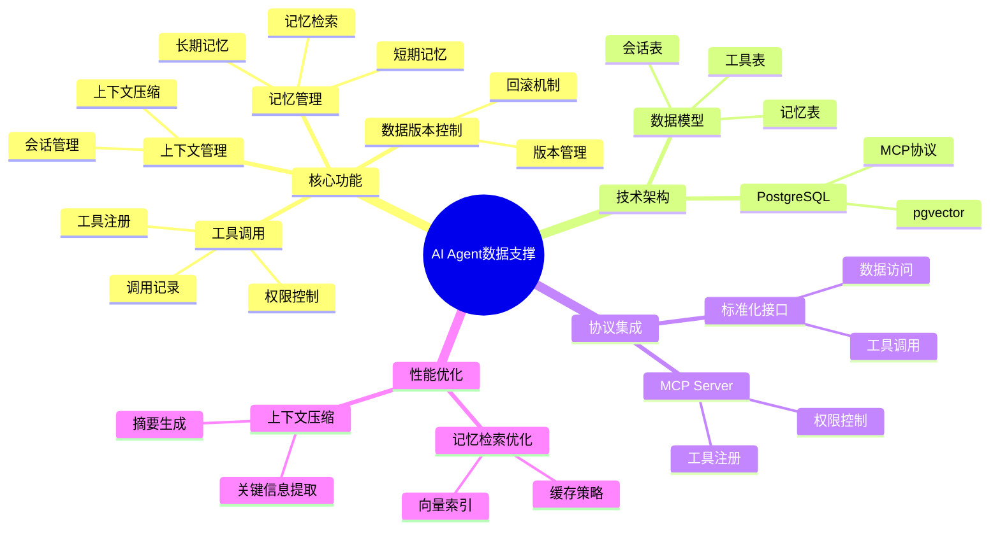
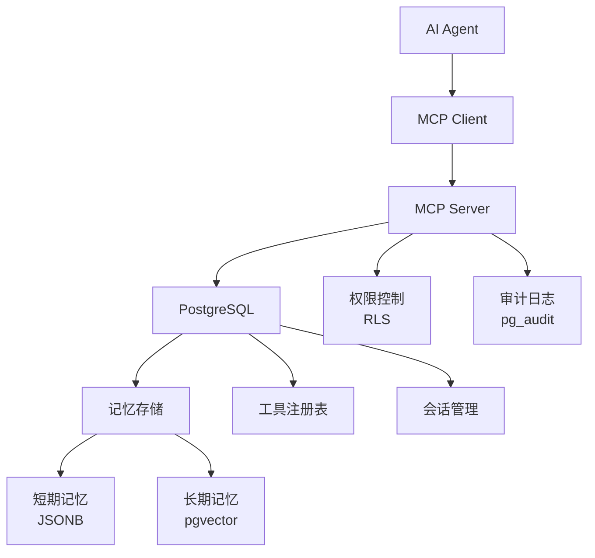

# AI Agent数据支撑

> **文档编号**: AI-04-04
> **最后更新**: 2025年1月
> **主题**: 04-应用场景
> **子主题**: 04-AI Agent数据支撑

## 📑 目录

- [AI Agent数据支撑](#ai-agent数据支撑)
  - [📑 目录](#-目录)
  - [一、概述](#一概述)
    - [1.1 AI Agent数据支撑思维导图](#11-ai-agent数据支撑思维导图)
  - [二、架构设计](#二架构设计)
    - [2.1 系统架构](#21-系统架构)
    - [2.2 数据流](#22-数据流)
  - [三、数据模型设计](#三数据模型设计)
    - [3.1 Agent记忆管理](#31-agent记忆管理)
    - [3.2 工具调用记录](#32-工具调用记录)
    - [3.3 上下文管理](#33-上下文管理)
    - [3.4 会话管理](#34-会话管理)
  - [四、核心功能实现](#四核心功能实现)
    - [4.1 短期记忆](#41-短期记忆)
    - [4.2 长期记忆](#42-长期记忆)
    - [4.3 工具调用接口](#43-工具调用接口)
    - [4.4 数据版本控制](#44-数据版本控制)
  - [五、MCP协议集成](#五mcp协议集成)
    - [5.1 MCP Server实现](#51-mcp-server实现)
    - [5.2 工具注册](#52-工具注册)
    - [5.3 权限控制](#53-权限控制)
  - [六、性能优化](#六性能优化)
    - [6.1 记忆检索优化](#61-记忆检索优化)
    - [6.2 上下文压缩](#62-上下文压缩)
    - [6.3 缓存策略](#63-缓存策略)
  - [七、最佳实践](#七最佳实践)
  - [八、关联主题](#八关联主题)
  - [九、对标资源](#九对标资源)
    - [企业案例](#企业案例)
    - [技术文档](#技术文档)
    - [学术论文](#学术论文)

## 一、概述

PostgreSQL作为AI Agent的数据支撑平台，提供记忆管理、工具调用、上下文管理和数据版本控制等功能，通过MCP协议实现标准化接口，支持AI Agent的长期运行和知识积累。

### 1.1 AI Agent数据支撑思维导图



## 二、架构设计

### 2.1 系统架构



### 2.2 数据流

1. **记忆存储流**:
   - Agent交互 → 短期记忆(JSONB) → 向量化 → 长期记忆(pgvector)

2. **工具调用流**:
   - Agent请求 → MCP Server → 工具函数 → 结果返回

3. **上下文管理流**:
   - 查询请求 → 记忆检索 → 上下文构建 → Agent处理

## 三、数据模型设计

### 3.1 Agent记忆管理

```sql
-- Agent表
CREATE TABLE agents (
    id SERIAL PRIMARY KEY,
    agent_id TEXT UNIQUE NOT NULL,
    name TEXT,
    type TEXT,  -- 'assistant', 'copilot', 'autonomous'
    created_at TIMESTAMPTZ DEFAULT NOW(),
    metadata JSONB
);

-- 短期记忆表（JSONB存储）
CREATE TABLE agent_short_term_memory (
    id SERIAL PRIMARY KEY,
    agent_id TEXT REFERENCES agents(agent_id),
    session_id TEXT,
    memory_data JSONB NOT NULL,
    created_at TIMESTAMPTZ DEFAULT NOW(),
    expires_at TIMESTAMPTZ
);

-- 长期记忆表（向量存储）
CREATE TABLE agent_long_term_memory (
    id SERIAL PRIMARY KEY,
    agent_id TEXT REFERENCES agents(agent_id),
    memory_text TEXT NOT NULL,
    memory_vector vector(1536),  -- 记忆向量化
    memory_type TEXT,  -- 'experience', 'knowledge', 'pattern'
    importance DECIMAL(3,2) DEFAULT 0.5,
    access_count INTEGER DEFAULT 0,
    last_accessed TIMESTAMPTZ DEFAULT NOW(),
    created_at TIMESTAMPTZ DEFAULT NOW(),
    metadata JSONB
);

-- 长期记忆向量索引
CREATE INDEX ON agent_long_term_memory
USING hnsw (memory_vector vector_cosine_ops)
WITH (m = 16, ef_construction = 100);

-- Agent记忆关联索引
CREATE INDEX ON agent_long_term_memory (agent_id, created_at DESC);
```

### 3.2 工具调用记录

```sql
-- 工具注册表
CREATE TABLE agent_tools (
    id SERIAL PRIMARY KEY,
    tool_name TEXT UNIQUE NOT NULL,
    tool_function TEXT NOT NULL,  -- 函数名
    description TEXT,
    parameters JSONB,  -- 参数定义
    created_at TIMESTAMPTZ DEFAULT NOW()
);

-- 工具调用记录表
CREATE TABLE agent_tool_calls (
    id SERIAL PRIMARY KEY,
    agent_id TEXT REFERENCES agents(agent_id),
    session_id TEXT,
    tool_name TEXT REFERENCES agent_tools(tool_name),
    input_parameters JSONB,
    output_result JSONB,
    execution_time_ms INTEGER,
    success BOOLEAN,
    error_message TEXT,
    created_at TIMESTAMPTZ DEFAULT NOW()
);

-- 工具调用索引
CREATE INDEX ON agent_tool_calls (agent_id, created_at DESC);
CREATE INDEX ON agent_tool_calls (tool_name, success);
```

### 3.3 上下文管理

```sql
-- 上下文表
CREATE TABLE agent_contexts (
    id SERIAL PRIMARY KEY,
    agent_id TEXT REFERENCES agents(agent_id),
    session_id TEXT,
    context_data JSONB NOT NULL,
    context_summary TEXT,  -- 上下文摘要
    context_vector vector(1536),  -- 上下文向量
    token_count INTEGER,
    created_at TIMESTAMPTZ DEFAULT NOW(),
    expires_at TIMESTAMPTZ
);

-- 上下文向量索引
CREATE INDEX ON agent_contexts
USING hnsw (context_vector vector_cosine_ops);

-- 会话上下文关联
CREATE INDEX ON agent_contexts (agent_id, session_id, created_at DESC);
```

### 3.4 会话管理

```sql
-- 会话表
CREATE TABLE agent_sessions (
    id SERIAL PRIMARY KEY,
    agent_id TEXT REFERENCES agents(agent_id),
    session_id TEXT UNIQUE NOT NULL,
    user_id TEXT,
    status TEXT DEFAULT 'active',  -- 'active', 'paused', 'ended'
    context_window_usage INTEGER DEFAULT 0,
    total_tokens INTEGER DEFAULT 0,
    created_at TIMESTAMPTZ DEFAULT NOW(),
    last_activity TIMESTAMPTZ DEFAULT NOW(),
    ended_at TIMESTAMPTZ,
    metadata JSONB
);

-- 会话索引
CREATE INDEX ON agent_sessions (agent_id, status, last_activity DESC);
```

## 四、核心功能实现

### 4.1 短期记忆

```sql
-- 存储短期记忆
CREATE OR REPLACE FUNCTION store_short_term_memory(
    p_agent_id TEXT,
    p_session_id TEXT,
    p_memory_data JSONB,
    p_ttl INTERVAL DEFAULT '1 hour'
) RETURNS INTEGER AS $$
DECLARE
    v_memory_id INTEGER;
BEGIN
    INSERT INTO agent_short_term_memory (
        agent_id,
        session_id,
        memory_data,
        expires_at
    ) VALUES (
        p_agent_id,
        p_session_id,
        p_memory_data,
        NOW() + p_ttl
    )
    RETURNING id INTO v_memory_id;

    RETURN v_memory_id;
END;
$$ LANGUAGE plpgsql;

-- 检索短期记忆
CREATE OR REPLACE FUNCTION get_short_term_memory(
    p_agent_id TEXT,
    p_session_id TEXT,
    p_limit INTEGER DEFAULT 10
) RETURNS JSONB AS $$
BEGIN
    RETURN (
        SELECT jsonb_agg(memory_data ORDER BY created_at DESC)
        FROM agent_short_term_memory
        WHERE agent_id = p_agent_id
          AND session_id = p_session_id
          AND expires_at > NOW()
        LIMIT p_limit
    );
END;
$$ LANGUAGE plpgsql;
```

### 4.2 长期记忆

```sql
-- 存储长期记忆
CREATE OR REPLACE FUNCTION store_long_term_memory(
    p_agent_id TEXT,
    p_memory_text TEXT,
    p_memory_type TEXT DEFAULT 'experience',
    p_importance DECIMAL DEFAULT 0.5
) RETURNS INTEGER AS $$
DECLARE
    v_memory_id INTEGER;
    v_memory_vector vector(1536);
BEGIN
    -- 生成向量
    v_memory_vector := ai.embedding('text-embedding-3-small', p_memory_text);

    -- 存储记忆
    INSERT INTO agent_long_term_memory (
        agent_id,
        memory_text,
        memory_vector,
        memory_type,
        importance
    ) VALUES (
        p_agent_id,
        p_memory_text,
        v_memory_vector,
        p_memory_type,
        p_importance
    )
    RETURNING id INTO v_memory_id;

    RETURN v_memory_id;
END;
$$ LANGUAGE plpgsql;

-- 检索相关长期记忆
CREATE OR REPLACE FUNCTION retrieve_long_term_memory(
    p_agent_id TEXT,
    p_query_text TEXT,
    p_limit INTEGER DEFAULT 5
) RETURNS TABLE (
    memory_text TEXT,
    similarity DECIMAL,
    memory_type TEXT
) AS $$
DECLARE
    v_query_vector vector(1536);
BEGIN
    -- 生成查询向量
    v_query_vector := ai.embedding('text-embedding-3-small', p_query_text);

    -- 检索相关记忆
    RETURN QUERY
    SELECT
        altm.memory_text,
        (1 - (altm.memory_vector <=> v_query_vector))::DECIMAL(5,4) AS similarity,
        altm.memory_type
    FROM agent_long_term_memory altm
    WHERE altm.agent_id = p_agent_id
      AND altm.memory_vector <=> v_query_vector < 0.8
    ORDER BY altm.memory_vector <=> v_query_vector
    LIMIT p_limit;

    -- 更新访问统计
    UPDATE agent_long_term_memory
    SET access_count = access_count + 1,
        last_accessed = NOW()
    WHERE agent_id = p_agent_id
      AND memory_vector <=> v_query_vector < 0.8;
END;
$$ LANGUAGE plpgsql;
```

### 4.3 工具调用接口

```sql
-- 注册工具
CREATE OR REPLACE FUNCTION register_agent_tool(
    p_tool_name TEXT,
    p_tool_function TEXT,
    p_description TEXT,
    p_parameters JSONB
) RETURNS INTEGER AS $$
DECLARE
    v_tool_id INTEGER;
BEGIN
    INSERT INTO agent_tools (
        tool_name,
        tool_function,
        description,
        parameters
    ) VALUES (
        p_tool_name,
        p_tool_function,
        p_description,
        p_parameters
    )
    ON CONFLICT (tool_name) DO UPDATE
    SET tool_function = p_tool_function,
        description = p_description,
        parameters = p_parameters
    RETURNING id INTO v_tool_id;

    RETURN v_tool_id;
END;
$$ LANGUAGE plpgsql;

-- 调用工具
CREATE OR REPLACE FUNCTION call_agent_tool(
    p_agent_id TEXT,
    p_session_id TEXT,
    p_tool_name TEXT,
    p_input_parameters JSONB
) RETURNS JSONB AS $$
DECLARE
    v_tool_function TEXT;
    v_result JSONB;
    v_start_time TIMESTAMPTZ;
    v_execution_time INTEGER;
BEGIN
    -- 获取工具函数
    SELECT tool_function INTO v_tool_function
    FROM agent_tools
    WHERE tool_name = p_tool_name;

    IF v_tool_function IS NULL THEN
        RAISE EXCEPTION 'Tool % not found', p_tool_name;
    END IF;

    v_start_time := NOW();

    -- 执行工具函数（动态SQL）
    EXECUTE format('SELECT %I($1)', v_tool_function)
    USING p_input_parameters
    INTO v_result;

    v_execution_time := EXTRACT(EPOCH FROM (NOW() - v_start_time)) * 1000;

    -- 记录调用
    INSERT INTO agent_tool_calls (
        agent_id,
        session_id,
        tool_name,
        input_parameters,
        output_result,
        execution_time_ms,
        success
    ) VALUES (
        p_agent_id,
        p_session_id,
        p_tool_name,
        p_input_parameters,
        v_result,
        v_execution_time,
        true
    );

    RETURN v_result;
EXCEPTION
    WHEN OTHERS THEN
        -- 记录错误
        INSERT INTO agent_tool_calls (
            agent_id,
            session_id,
            tool_name,
            input_parameters,
            execution_time_ms,
            success,
            error_message
        ) VALUES (
            p_agent_id,
            p_session_id,
            p_tool_name,
            p_input_parameters,
            EXTRACT(EPOCH FROM (NOW() - v_start_time)) * 1000,
            false,
            SQLERRM
        );
        RAISE;
END;
$$ LANGUAGE plpgsql;
```

### 4.4 数据版本控制

```sql
-- 使用Neon Branching实现数据版本控制
-- 为每个Agent实验创建独立分支
CREATE OR REPLACE FUNCTION create_agent_branch(
    p_agent_id TEXT,
    p_branch_name TEXT
) RETURNS TEXT AS $$
DECLARE
    v_branch_id TEXT;
BEGIN
    -- 创建分支（使用Neon API或FDW）
    -- 返回分支连接字符串
    v_branch_id := format('agent_%s_%s', p_agent_id, p_branch_name);

    -- 记录分支信息
    INSERT INTO agent_branches (
        agent_id,
        branch_name,
        branch_id,
        created_at
    ) VALUES (
        p_agent_id,
        p_branch_name,
        v_branch_id,
        NOW()
    );

    RETURN v_branch_id;
END;
$$ LANGUAGE plpgsql;
```

## 五、MCP协议集成

### 5.1 MCP Server实现

```python
# MCP Server实现示例
from mcp.server import Server
from mcp.types import Tool, TextContent

server = Server("postgres-mcp")

@server.list_tools()
async def list_tools() -> list[Tool]:
    """列出所有可用工具"""
    tools = []
    # 从PostgreSQL查询工具列表
    with psycopg2.connect(...) as conn:
        cur = conn.cursor()
        cur.execute("SELECT tool_name, description, parameters FROM agent_tools")
        for row in cur.fetchall():
            tools.append(Tool(
                name=row[0],
                description=row[1],
                inputSchema=row[2]
            ))
    return tools

@server.call_tool()
async def call_tool(name: str, arguments: dict) -> list[TextContent]:
    """调用工具"""
    # 调用PostgreSQL函数
    with psycopg2.connect(...) as conn:
        cur = conn.cursor()
        cur.execute(
            "SELECT call_agent_tool(%s, %s, %s, %s)",
            (agent_id, session_id, name, json.dumps(arguments))
        )
        result = cur.fetchone()[0]
    return [TextContent(type="text", text=json.dumps(result))]
```

### 5.2 工具注册

```sql
-- 注册常用工具
SELECT register_agent_tool(
    'search_database',
    'search_database_tool',
    '在数据库中搜索信息',
    '{"type": "object", "properties": {"query": {"type": "string"}}}'::jsonb
);

SELECT register_agent_tool(
    'execute_sql',
    'execute_sql_tool',
    '执行SQL查询',
    '{"type": "object", "properties": {"sql": {"type": "string"}}}'::jsonb
);

SELECT register_agent_tool(
    'get_memory',
    'get_agent_memory',
    '检索Agent记忆',
    '{"type": "object", "properties": {"query": {"type": "string"}}}'::jsonb
);
```

### 5.3 权限控制

```sql
-- 行级安全策略（RLS）
ALTER TABLE agent_tool_calls ENABLE ROW LEVEL SECURITY;

-- 创建策略：Agent只能访问自己的工具调用记录
CREATE POLICY agent_tool_access ON agent_tool_calls
    FOR ALL
    TO agent_role
    USING (agent_id = current_setting('app.agent_id'));

-- 审计日志
CREATE EXTENSION IF NOT EXISTS pg_audit;

-- 审计所有工具调用
ALTER TABLE agent_tool_calls ENABLE AUDIT;
```

## 六、性能优化

### 6.1 记忆检索优化

```sql
-- 使用重要性权重优化检索
CREATE OR REPLACE FUNCTION retrieve_weighted_memory(
    p_agent_id TEXT,
    p_query_vector vector(1536),
    p_limit INTEGER DEFAULT 5
) RETURNS TABLE (
    memory_text TEXT,
    weighted_score DECIMAL
) AS $$
BEGIN
    RETURN QUERY
    SELECT
        altm.memory_text,
        (
            (1 - (altm.memory_vector <=> p_query_vector)) * 0.6 +
            altm.importance * 0.2 +
            LEAST(altm.access_count / 100.0, 1.0) * 0.2
        )::DECIMAL(5,4) AS weighted_score
    FROM agent_long_term_memory altm
    WHERE altm.agent_id = p_agent_id
      AND altm.memory_vector <=> p_query_vector < 0.8
    ORDER BY weighted_score DESC
    LIMIT p_limit;
END;
$$ LANGUAGE plpgsql;
```

### 6.2 上下文压缩

```sql
-- 上下文压缩：保留重要信息
CREATE OR REPLACE FUNCTION compress_context(
    p_agent_id TEXT,
    p_session_id TEXT,
    p_max_tokens INTEGER DEFAULT 4000
) RETURNS JSONB AS $$
DECLARE
    v_context JSONB;
    v_token_count INTEGER;
BEGIN
    -- 获取当前上下文
    SELECT context_data, token_count
    INTO v_context, v_token_count
    FROM agent_contexts
    WHERE agent_id = p_agent_id
      AND session_id = p_session_id
    ORDER BY created_at DESC
    LIMIT 1;

    -- 如果超过限制，进行压缩
    IF v_token_count > p_max_tokens THEN
        -- 使用LLM压缩上下文（通过pgai）
        v_context := ai.chat_complete(
            'gpt-4',
            format('压缩以下上下文，保留关键信息:\n\n%s', v_context::text)
        )->>'content';
    END IF;

    RETURN v_context;
END;
$$ LANGUAGE plpgsql;
```

### 6.3 缓存策略

```sql
-- 记忆检索缓存
CREATE TABLE memory_retrieval_cache (
    cache_key TEXT PRIMARY KEY,
    agent_id TEXT,
    query_vector vector(1536),
    results JSONB,
    created_at TIMESTAMPTZ DEFAULT NOW(),
    expires_at TIMESTAMPTZ DEFAULT NOW() + INTERVAL '1 hour'
);

-- 使用缓存的记忆检索
CREATE OR REPLACE FUNCTION get_cached_memory(
    p_agent_id TEXT,
    p_query_text TEXT
) RETURNS JSONB AS $$
DECLARE
    v_cache_key TEXT;
    v_results JSONB;
    v_query_vector vector(1536);
BEGIN
    v_query_vector := ai.embedding('text-embedding-3-small', p_query_text);
    v_cache_key := md5(p_agent_id || v_query_vector::text);

    -- 检查缓存
    SELECT results INTO v_results
    FROM memory_retrieval_cache
    WHERE cache_key = v_cache_key
      AND expires_at > NOW();

    IF v_results IS NOT NULL THEN
        RETURN v_results;
    END IF;

    -- 检索记忆
    SELECT jsonb_agg(
        jsonb_build_object(
            'memory_text', memory_text,
            'similarity', similarity
        )
    ) INTO v_results
    FROM retrieve_long_term_memory(p_agent_id, p_query_text);

    -- 更新缓存
    INSERT INTO memory_retrieval_cache (cache_key, agent_id, query_vector, results)
    VALUES (v_cache_key, p_agent_id, v_query_vector, v_results)
    ON CONFLICT (cache_key) DO UPDATE
    SET results = v_results,
        expires_at = NOW() + INTERVAL '1 hour';

    RETURN v_results;
END;
$$ LANGUAGE plpgsql;
```

## 七、最佳实践

1. **记忆管理**:
   - 短期记忆使用JSONB，定期清理过期数据
   - 长期记忆使用向量存储，支持语义检索
   - 根据重要性调整记忆权重

2. **工具设计**:
   - 工具函数应该是幂等的
   - 记录所有工具调用用于审计
   - 使用RLS控制工具访问权限

3. **性能优化**:
   - 使用缓存减少向量计算
   - 压缩上下文减少Token消耗
   - 使用物化视图预计算常用查询

4. **安全控制**:
   - 使用RLS实现行级安全
   - 启用审计日志记录所有操作
   - 限制工具调用权限

## 八、关联主题

- [向量处理能力 (pgvector)](../03-核心能力/向量处理能力-pgvector.md) - 长期记忆向量存储
- [AI原生调用 (pgai)](../03-核心能力/AI原生调用-pgai.md) - 上下文压缩
- [Neon AI Agent案例](../05-实践案例/Neon-AI-Agent案例.md) - 实际应用案例

## 九、对标资源

### 企业案例

- **Neon**: AI Agent数据库实例管理
- **性能**: 实例创建速率1.2万次/小时
- **成本**: Scale-to-Zero节省40%成本

### 技术文档

- [MCP协议文档](https://modelcontextprotocol.io/)
- [Neon Branching文档](https://neon.tech/docs/guides/branching)

### 学术论文

- AI Agent记忆管理研究
- 上下文窗口优化技术

---

**最后更新**: 2025年1月
**维护者**: PostgreSQL Modern Team
**文档编号**: AI-04-04
