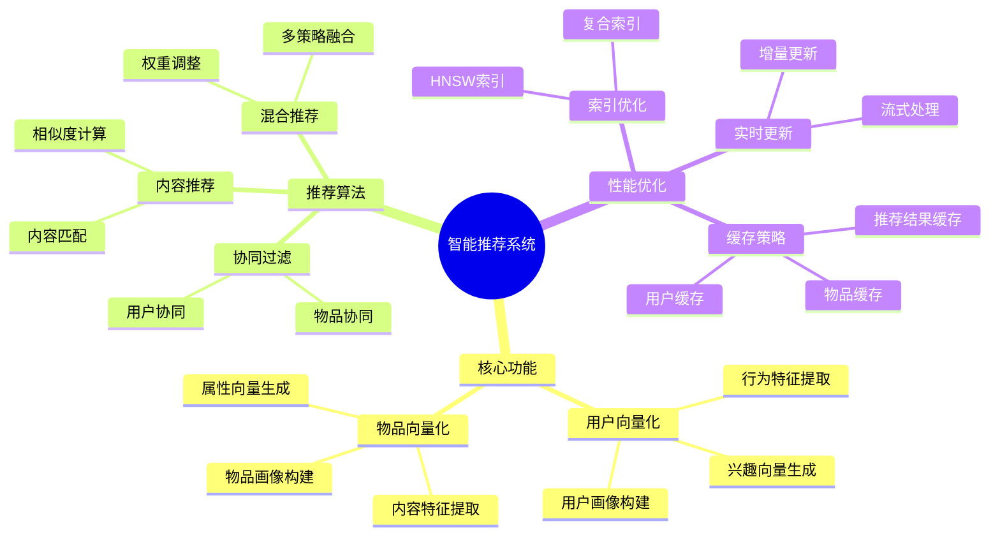
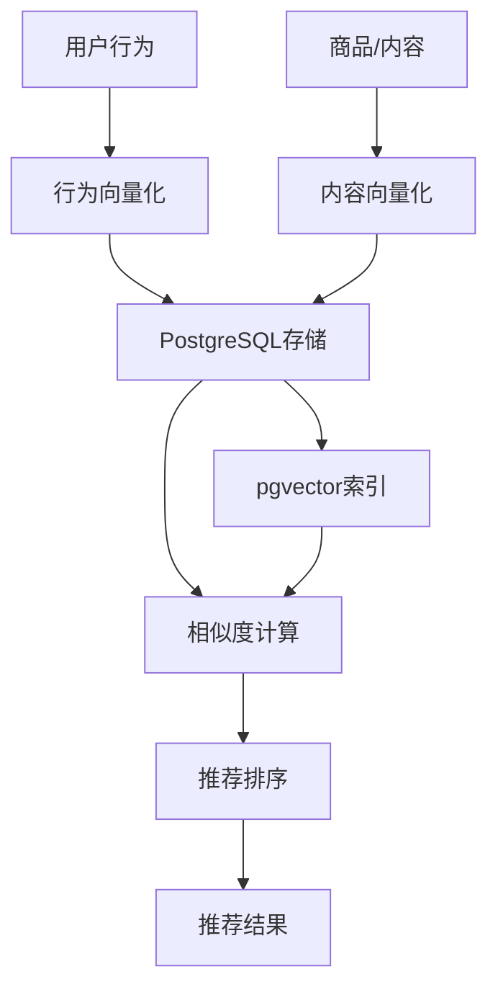

# 智能推荐系统

> **文档编号**: AI-04-02
> **最后更新**: 2025年1月
> **主题**: 04-应用场景
> **子主题**: 02-智能推荐系统

## 📑 目录

- [智能推荐系统](#智能推荐系统)
  - [📑 目录](#-目录)
  - [一、概述](#一概述)
    - [1.1 推荐系统思维导图](#11-推荐系统思维导图)
  - [二、架构设计](#二架构设计)
    - [2.1 系统架构](#21-系统架构)
    - [2.2 数据流](#22-数据流)
  - [三、数据模型设计](#三数据模型设计)
    - [3.1 用户行为表](#31-用户行为表)
    - [3.2 商品/内容表](#32-商品内容表)
    - [3.3 推荐结果表](#33-推荐结果表)
  - [四、推荐算法实现](#四推荐算法实现)
    - [4.1 协同过滤](#41-协同过滤)
    - [4.2 内容推荐](#42-内容推荐)
    - [4.3 混合推荐](#43-混合推荐)
  - [五、实时推荐引擎](#五实时推荐引擎)
    - [5.1 实时特征计算](#51-实时特征计算)
    - [5.2 实时推荐生成](#52-实时推荐生成)
    - [5.3 推荐结果缓存](#53-推荐结果缓存)
  - [六、性能优化](#六性能优化)
    - [6.1 向量索引优化](#61-向量索引优化)
    - [6.2 查询优化](#62-查询优化)
    - [6.3 缓存策略](#63-缓存策略)
  - [七、效果评估](#七效果评估)
    - [7.1 评估指标](#71-评估指标)
    - [7.2 A/B测试](#72-ab测试)
  - [八、关联主题](#八关联主题)
  - [九、对标资源](#九对标资源)
    - [企业案例](#企业案例)
    - [学术论文](#学术论文)
    - [技术文档](#技术文档)

## 一、概述

基于PostgreSQL和pgvector构建的智能推荐系统，通过向量相似度计算实现个性化推荐，支持实时推荐和离线推荐两种模式。

### 1.1 推荐系统思维导图



## 二、架构设计

### 2.1 系统架构



### 2.2 数据流

1. **离线处理**:
   - 用户行为数据 → 特征提取 → 向量化 → 存储到PostgreSQL

2. **实时处理**:
   - 用户行为事件 → 实时向量更新 → 实时推荐计算

3. **推荐生成**:
   - 用户向量 → 相似度搜索 → 推荐排序 → 结果返回

## 三、数据模型设计

### 3.1 用户行为表

```sql
-- 用户行为表
CREATE TABLE user_behaviors (
    id SERIAL PRIMARY KEY,
    user_id INTEGER NOT NULL,
    item_id INTEGER NOT NULL,
    behavior_type TEXT NOT NULL,  -- 'view', 'click', 'purchase', 'like'
    behavior_vector vector(1536),  -- 行为向量化表示
    timestamp TIMESTAMPTZ DEFAULT NOW(),
    metadata JSONB
);

-- 用户行为向量索引
CREATE INDEX ON user_behaviors
USING hnsw (behavior_vector vector_cosine_ops)
WITH (m = 16, ef_construction = 100);

-- 用户行为聚合表
CREATE TABLE user_profiles (
    user_id INTEGER PRIMARY KEY,
    behavior_vector vector(1536),  -- 用户整体行为向量
    last_updated TIMESTAMPTZ DEFAULT NOW(),
    behavior_count INTEGER DEFAULT 0
);
```

### 3.2 商品/内容表

```sql
-- 商品表
CREATE TABLE items (
    id SERIAL PRIMARY KEY,
    title TEXT NOT NULL,
    description TEXT,
    category TEXT,
    price DECIMAL(10,2),
    content_vector vector(1536),  -- 商品内容向量
    created_at TIMESTAMPTZ DEFAULT NOW(),
    metadata JSONB
);

-- 商品向量索引
CREATE INDEX ON items
USING hnsw (content_vector vector_cosine_ops)
WITH (m = 16, ef_construction = 100);

-- 复合索引优化
CREATE INDEX ON items (category, (content_vector <=> query_vector));
```

### 3.3 推荐结果表

```sql
-- 推荐结果表
CREATE TABLE recommendations (
    id SERIAL PRIMARY KEY,
    user_id INTEGER NOT NULL,
    item_id INTEGER NOT NULL,
    score DECIMAL(5,4),  -- 推荐分数
    recommendation_type TEXT,  -- 'collaborative', 'content', 'hybrid'
    created_at TIMESTAMPTZ DEFAULT NOW(),
    expires_at TIMESTAMPTZ,
    UNIQUE(user_id, item_id)
);

-- 推荐结果索引
CREATE INDEX ON recommendations (user_id, score DESC, created_at DESC);
```

## 四、推荐算法实现

### 4.1 协同过滤

基于用户行为相似度的推荐：

```sql
-- 查找相似用户
WITH similar_users AS (
    SELECT
        ub2.user_id,
        ub1.behavior_vector <=> ub2.behavior_vector AS similarity
    FROM user_behaviors ub1
    JOIN user_behaviors ub2 ON ub1.item_id = ub2.item_id
    WHERE ub1.user_id = :target_user_id
      AND ub2.user_id != :target_user_id
    GROUP BY ub2.user_id, ub1.behavior_vector, ub2.behavior_vector
    HAVING ub1.behavior_vector <=> ub2.behavior_vector < 0.8
    ORDER BY similarity
    LIMIT 100
)
-- 推荐相似用户喜欢的商品
SELECT
    i.id,
    i.title,
    COUNT(*) AS recommendation_count,
    AVG(su.similarity) AS avg_similarity
FROM similar_users su
JOIN user_behaviors ub ON su.user_id = ub.user_id
JOIN items i ON ub.item_id = i.id
WHERE i.id NOT IN (
    SELECT item_id FROM user_behaviors WHERE user_id = :target_user_id
)
GROUP BY i.id, i.title
ORDER BY recommendation_count DESC, avg_similarity DESC
LIMIT 20;
```

### 4.2 内容推荐

基于商品内容相似度的推荐：

```sql
-- 基于用户历史行为的内容推荐
WITH user_preferences AS (
    SELECT
        AVG(behavior_vector) AS avg_preference_vector
    FROM user_behaviors
    WHERE user_id = :target_user_id
      AND behavior_type IN ('purchase', 'like')
)
SELECT
    i.id,
    i.title,
    i.category,
    up.avg_preference_vector <=> i.content_vector AS similarity
FROM items i
CROSS JOIN user_preferences up
WHERE i.id NOT IN (
    SELECT item_id FROM user_behaviors WHERE user_id = :target_user_id
)
ORDER BY up.avg_preference_vector <=> i.content_vector
LIMIT 20;
```

### 4.3 混合推荐

结合协同过滤和内容推荐：

```sql
-- 混合推荐：协同过滤 + 内容推荐
WITH collaborative_recs AS (
    -- 协同过滤推荐（权重0.6）
    SELECT item_id, score * 0.6 AS weighted_score
    FROM (
        -- 协同过滤逻辑
        SELECT item_id, COUNT(*) AS score
        FROM user_behaviors
        WHERE user_id IN (
            SELECT similar_user_id FROM similar_users WHERE user_id = :target_user_id
        )
        GROUP BY item_id
    ) cf
),
content_recs AS (
    -- 内容推荐（权重0.4）
    SELECT
        i.id AS item_id,
        (1 - (up.avg_preference_vector <=> i.content_vector)) * 0.4 AS weighted_score
    FROM items i
    CROSS JOIN user_preferences up
    WHERE i.id NOT IN (
        SELECT item_id FROM user_behaviors WHERE user_id = :target_user_id
    )
)
SELECT
    COALESCE(cf.item_id, cr.item_id) AS item_id,
    COALESCE(cf.weighted_score, 0) + COALESCE(cr.weighted_score, 0) AS final_score
FROM collaborative_recs cf
FULL OUTER JOIN content_recs cr ON cf.item_id = cr.item_id
ORDER BY final_score DESC
LIMIT 20;
```

## 五、实时推荐引擎

### 5.1 实时特征计算

```sql
-- 实时更新用户行为向量
CREATE OR REPLACE FUNCTION update_user_profile(
    p_user_id INTEGER,
    p_behavior_vector vector(1536)
) RETURNS void AS $$
BEGIN
    INSERT INTO user_profiles (user_id, behavior_vector, behavior_count)
    VALUES (p_user_id, p_behavior_vector, 1)
    ON CONFLICT (user_id) DO UPDATE
    SET
        behavior_vector = (
            (user_profiles.behavior_vector * user_profiles.behavior_count + p_behavior_vector)
            / (user_profiles.behavior_count + 1)
        ),
        behavior_count = user_profiles.behavior_count + 1,
        last_updated = NOW();
END;
$$ LANGUAGE plpgsql;
```

### 5.2 实时推荐生成

```sql
-- 实时推荐函数
CREATE OR REPLACE FUNCTION get_realtime_recommendations(
    p_user_id INTEGER,
    p_limit INTEGER DEFAULT 20
) RETURNS TABLE (
    item_id INTEGER,
    title TEXT,
    score DECIMAL(5,4)
) AS $$
DECLARE
    v_user_vector vector(1536);
BEGIN
    -- 获取用户当前向量
    SELECT behavior_vector INTO v_user_vector
    FROM user_profiles
    WHERE user_id = p_user_id;

    -- 如果用户向量不存在，使用默认推荐
    IF v_user_vector IS NULL THEN
        RETURN QUERY
        SELECT i.id, i.title, 0.5::DECIMAL(5,4) AS score
        FROM items i
        ORDER BY RANDOM()
        LIMIT p_limit;
        RETURN;
    END IF;

    -- 基于向量相似度推荐
    RETURN QUERY
    SELECT
        i.id,
        i.title,
        (1 - (v_user_vector <=> i.content_vector))::DECIMAL(5,4) AS score
    FROM items i
    WHERE i.id NOT IN (
        SELECT item_id FROM user_behaviors WHERE user_id = p_user_id
    )
    ORDER BY v_user_vector <=> i.content_vector
    LIMIT p_limit;
END;
$$ LANGUAGE plpgsql;
```

### 5.3 推荐结果缓存

```sql
-- 推荐结果缓存表
CREATE TABLE recommendation_cache (
    user_id INTEGER PRIMARY KEY,
    recommendations JSONB,
    created_at TIMESTAMPTZ DEFAULT NOW(),
    expires_at TIMESTAMPTZ DEFAULT NOW() + INTERVAL '1 hour'
);

-- 使用缓存的推荐函数
CREATE OR REPLACE FUNCTION get_cached_recommendations(
    p_user_id INTEGER
) RETURNS JSONB AS $$
DECLARE
    v_cached JSONB;
BEGIN
    -- 检查缓存
    SELECT recommendations INTO v_cached
    FROM recommendation_cache
    WHERE user_id = p_user_id
      AND expires_at > NOW();

    -- 如果缓存有效，直接返回
    IF v_cached IS NOT NULL THEN
        RETURN v_cached;
    END IF;

    -- 生成新推荐
    SELECT jsonb_agg(
        jsonb_build_object(
            'item_id', item_id,
            'title', title,
            'score', score
        )
    ) INTO v_cached
    FROM get_realtime_recommendations(p_user_id);

    -- 更新缓存
    INSERT INTO recommendation_cache (user_id, recommendations, expires_at)
    VALUES (p_user_id, v_cached, NOW() + INTERVAL '1 hour')
    ON CONFLICT (user_id) DO UPDATE
    SET recommendations = v_cached,
        created_at = NOW(),
        expires_at = NOW() + INTERVAL '1 hour';

    RETURN v_cached;
END;
$$ LANGUAGE plpgsql;
```

## 六、性能优化

### 6.1 向量索引优化

```sql
-- 优化HNSW索引参数
CREATE INDEX ON items
USING hnsw (content_vector vector_cosine_ops)
WITH (
    m = 32,  -- 增加连接数提升召回率
    ef_construction = 200  -- 增加构建时搜索宽度
);

-- 查询时设置ef_search
SET hnsw.ef_search = 200;  -- 提升召回率
```

### 6.2 查询优化

```sql
-- 使用物化视图预计算热门推荐
CREATE MATERIALIZED VIEW popular_recommendations AS
SELECT
    user_id,
    item_id,
    score,
    ROW_NUMBER() OVER (PARTITION BY user_id ORDER BY score DESC) AS rank
FROM recommendations
WHERE expires_at > NOW();

CREATE INDEX ON popular_recommendations (user_id, rank);

-- 定期刷新物化视图
REFRESH MATERIALIZED VIEW CONCURRENTLY popular_recommendations;
```

### 6.3 缓存策略

```sql
-- 使用Redis缓存（通过pg_redis扩展）
-- 或使用PostgreSQL内置缓存表
CREATE TABLE recommendation_cache_v2 (
    cache_key TEXT PRIMARY KEY,
    cache_value JSONB,
    created_at TIMESTAMPTZ DEFAULT NOW(),
    ttl INTERVAL DEFAULT '1 hour'
);

-- 自动清理过期缓存
CREATE OR REPLACE FUNCTION cleanup_expired_cache()
RETURNS void AS $$
BEGIN
    DELETE FROM recommendation_cache_v2
    WHERE created_at + ttl < NOW();
END;
$$ LANGUAGE plpgsql;

-- 定时任务（使用pg_cron）
SELECT cron.schedule('cleanup-cache', '0 * * * *', 'SELECT cleanup_expired_cache()');
```

## 七、效果评估

### 7.1 评估指标

```sql
-- 计算推荐效果指标
CREATE OR REPLACE FUNCTION calculate_recommendation_metrics(
    p_start_date TIMESTAMPTZ,
    p_end_date TIMESTAMPTZ
) RETURNS TABLE (
    metric_name TEXT,
    metric_value DECIMAL(10,4)
) AS $$
BEGIN
    RETURN QUERY
    SELECT '点击率'::TEXT,
           COUNT(*) FILTER (WHERE behavior_type = 'click')::DECIMAL /
           COUNT(*)::DECIMAL AS value
    FROM user_behaviors
    WHERE timestamp BETWEEN p_start_date AND p_end_date;

    RETURN QUERY
    SELECT '转化率'::TEXT,
           COUNT(*) FILTER (WHERE behavior_type = 'purchase')::DECIMAL /
           COUNT(*) FILTER (WHERE behavior_type = 'click')::DECIMAL AS value
    FROM user_behaviors
    WHERE timestamp BETWEEN p_start_date AND p_end_date;

    RETURN QUERY
    SELECT '平均推荐分数'::TEXT,
           AVG(score)::DECIMAL(10,4) AS value
    FROM recommendations
    WHERE created_at BETWEEN p_start_date AND p_end_date;
END;
$$ LANGUAGE plpgsql;
```

### 7.2 A/B测试

```sql
-- A/B测试表
CREATE TABLE ab_test_recommendations (
    user_id INTEGER,
    test_group TEXT,  -- 'A' or 'B'
    recommendation_type TEXT,
    item_id INTEGER,
    score DECIMAL(5,4),
    created_at TIMESTAMPTZ DEFAULT NOW()
);

-- A/B测试结果分析
SELECT
    test_group,
    recommendation_type,
    COUNT(DISTINCT user_id) AS user_count,
    AVG(score) AS avg_score,
    COUNT(*) FILTER (WHERE score > 0.8) AS high_score_count
FROM ab_test_recommendations
GROUP BY test_group, recommendation_type;
```

## 八、关联主题

- [向量处理能力 (pgvector)](../03-核心能力/向量处理能力-pgvector.md) - 向量相似度计算
- [AI原生调用 (pgai)](../03-核心能力/AI原生调用-pgai.md) - 实时特征向量化
- [Qunar途家案例](../05-实践案例/Qunar途家案例.md) - 实际应用案例

## 九、对标资源

### 企业案例

- **Qunar途家**: 向量搜索在旅游推荐中的应用
- **性能提升**: 召回率提升30%, 用户点击率提升18%

### 学术论文

- Collaborative Filtering论文
- Content-Based Recommendation论文

### 技术文档

- [pgvector推荐系统示例](https://github.com/pgvector/pgvector/tree/master/examples)

---

**最后更新**: 2025年1月
**维护者**: PostgreSQL Modern Team
**文档编号**: AI-04-02
