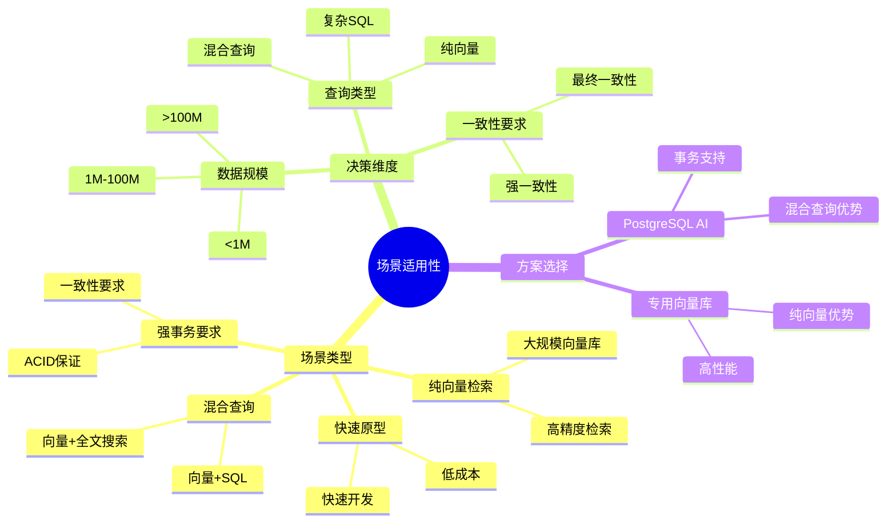
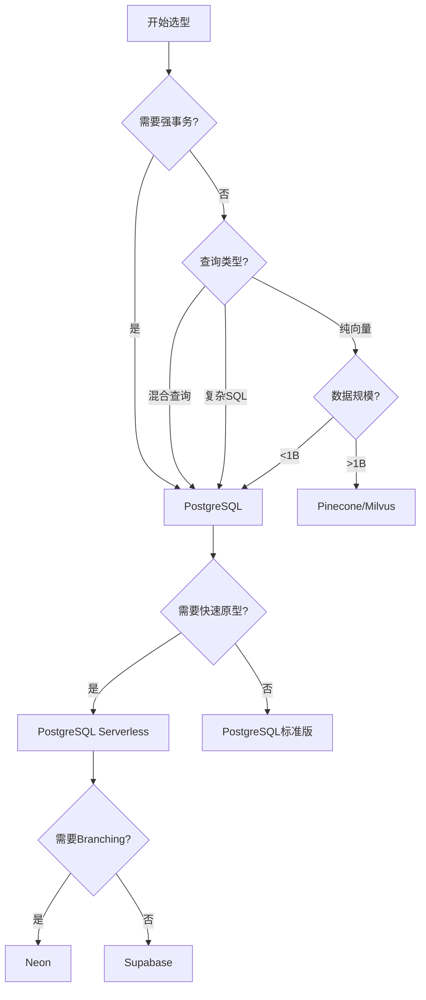

# 场景适用性决策矩阵

> **文档编号**: AI-06-03
> **最后更新**: 2025年1月
> **主题**: 06-对比分析
> **子主题**: 03-场景适用性决策矩阵

## 📑 目录

- [场景适用性决策矩阵](#场景适用性决策矩阵)
  - [📑 目录](#-目录)
  - [一、概述](#一概述)
    - [1.1 场景适用性思维导图](#11-场景适用性思维导图)
  - [二、决策维度](#二决策维度)
  - [三、场景分类](#三场景分类)
    - [3.1 纯向量检索场景](#31-纯向量检索场景)
    - [3.2 混合查询场景](#32-混合查询场景)
    - [3.3 强事务要求场景](#33-强事务要求场景)
    - [3.4 快速原型场景](#34-快速原型场景)
    - [3.5 大规模场景](#35-大规模场景)
    - [3.6 AI Agent场景](#36-ai-agent场景)
  - [四、决策矩阵](#四决策矩阵)
    - [4.1 综合决策矩阵](#41-综合决策矩阵)
    - [4.2 成本决策矩阵](#42-成本决策矩阵)
    - [4.3 性能决策矩阵](#43-性能决策矩阵)
  - [五、决策树](#五决策树)
  - [六、案例映射](#六案例映射)
    - [6.1 Qunar途家案例](#61-qunar途家案例)
    - [6.2 Neon AI Agent案例](#62-neon-ai-agent案例)
    - [6.3 Timescale MarketReader案例](#63-timescale-marketreader案例)
    - [6.4 阿里云PolarDB案例](#64-阿里云polardb案例)
  - [七、关联主题](#七关联主题)
  - [八、对标资源](#八对标资源)
    - [技术文档](#技术文档)
    - [决策工具](#决策工具)

## 一、概述

场景适用性决策矩阵帮助技术选型，根据业务场景特征（数据规模、查询类型、一致性要求、成本预算等）选择最适合的PostgreSQL AI方案或替代方案。

### 1.1 场景适用性思维导图

## 二、决策维度

1. **数据规模**: 向量数量（<1M, 1M-100M, >100M）
2. **查询类型**: 纯向量、混合查询、复杂SQL
3. **一致性要求**: 强一致性、最终一致性
4. **性能要求**: 延迟、吞吐量
5. **成本预算**: 低、中、高
6. **开发周期**: 快速原型、标准开发、长期项目

## 三、场景分类

### 3.1 纯向量检索场景

**特征**:

- 仅需要向量相似度搜索
- 无复杂SQL需求
- 数据规模>1B向量

**推荐方案**: Pinecone / Weaviate

**PostgreSQL适用性**: ⭐⭐⭐

- 适用: 向量规模<1B
- 不适用: 超大规模纯向量场景

### 3.2 混合查询场景

**特征**:

- 需要向量+SQL联合查询
- 需要向量+全文搜索
- 需要向量+地理空间查询

**推荐方案**: PostgreSQL + pgvector

**适用性**: ⭐⭐⭐⭐⭐

- 完美支持混合查询
- 统一查询接口
- 复杂业务逻辑

### 3.3 强事务要求场景

**特征**:

- 需要ACID保证
- 金融交易
- 电商订单

**推荐方案**: PostgreSQL + pgvector

**适用性**: ⭐⭐⭐⭐⭐

- 唯一提供完整ACID支持
- 强一致性保证
- 事务隔离级别

### 3.4 快速原型场景

**特征**:

- 快速验证想法
- 零运维成本
- 按需付费

**推荐方案**: PostgreSQL Serverless (Neon/Supabase)

**适用性**: ⭐⭐⭐⭐⭐

- 零运维成本
- 快速部署
- Scale-to-Zero

### 3.5 大规模场景

**特征**:

- 数据规模>1B向量
- 高并发访问
- 需要水平扩展

**推荐方案**:

- PostgreSQL + Citus (水平扩展)
- Milvus (专用向量库)

**PostgreSQL适用性**: ⭐⭐⭐⭐

- 通过Citus实现水平扩展
- 适合大多数场景

### 3.6 AI Agent场景

**特征**:

- 需要数据库分支
- 快速创建/销毁实例
- 低成本实验

**推荐方案**: Neon (Serverless + Branching)

**适用性**: ⭐⭐⭐⭐⭐

- 完美支持Branching
- Scale-to-Zero
- 低成本实验

## 四、决策矩阵

### 4.1 综合决策矩阵

| 场景特征 | PostgreSQL | Pinecone | Weaviate | Milvus | Elasticsearch |
|---------|:----------:|:--------:|:--------:|:------:|:-------------:|
| **纯向量检索** | ⭐⭐⭐ | ⭐⭐⭐⭐⭐ | ⭐⭐⭐⭐ | ⭐⭐⭐⭐⭐ | ⭐⭐⭐ |
| **混合查询** | ⭐⭐⭐⭐⭐ | ⭐ | ⭐⭐ | ⭐ | ⭐⭐⭐ |
| **强事务** | ⭐⭐⭐⭐⭐ | ⭐ | ⭐ | ⭐ | ⭐ |
| **快速原型** | ⭐⭐⭐⭐⭐ | ⭐⭐⭐⭐ | ⭐⭐⭐ | ⭐⭐ | ⭐⭐ |
| **大规模** | ⭐⭐⭐⭐ | ⭐⭐⭐⭐⭐ | ⭐⭐⭐⭐ | ⭐⭐⭐⭐⭐ | ⭐⭐⭐⭐⭐ |
| **AI Agent** | ⭐⭐⭐⭐⭐ | ⭐⭐ | ⭐⭐ | ⭐⭐ | ⭐⭐ |
| **成本效益** | ⭐⭐⭐⭐⭐ | ⭐⭐⭐ | ⭐⭐⭐ | ⭐⭐⭐ | ⭐⭐⭐ |

### 4.2 成本决策矩阵

**3年TCO对比（中等规模场景）**:

| 方案 | 基础设施 | 开发 | 运维 | 迁移 | 许可证 | **总TCO** |
|------|:--------:|:----:|:----:|:----:|:------:|:---------:|
| **PostgreSQL Serverless** | $18,000 | $15,000 | $5,000 | $3,000 | $0 | **$41,000** |
| **Pinecone** | $72,000 | $60,000 | $10,000 | $10,000 | $0 | **$152,000** |
| **自建Elasticsearch** | $51,000 | $120,000 | $30,000 | $20,000 | $30,000 | **$251,000** |
| **混合架构** | $87,000 | $200,000 | $50,000 | $35,000 | $60,000 | **$432,000** |

**成本优势**: PostgreSQL成本最低，节省111,000-391,000美元。

### 4.3 性能决策矩阵

| 场景 | PostgreSQL | Pinecone | Weaviate | Milvus |
|------|:----------:|:--------:|:--------:|:------:|
| **延迟 (P95)** | 3-10ms | 2-5ms | 5-15ms | 5-20ms |
| **吞吐量 (QPS)** | 5,000-8,000 | 10,000+ | 3,000-5,000 | 5,000-10,000 |
| **召回率** | >0.95 | >0.95 | >0.95 | >0.95 |
| **混合查询** | ✅ 原生 | ❌ 无 | ⚠️ 有限 | ❌ 无 |

## 五、决策树

## 六、案例映射

### 6.1 Qunar途家案例

**场景**: 混合查询（向量+地理+评分）

**选择**: PostgreSQL + pgvector + PostGIS

**原因**:

- 需要向量相似度搜索
- 需要地理位置过滤
- 需要评分排序
- 混合查询需求

### 6.2 Neon AI Agent案例

**场景**: AI Agent数据支撑

**选择**: Neon Serverless + Branching

**原因**:

- 需要快速创建数据库实例
- 需要数据隔离
- 需要低成本实验
- Scale-to-Zero需求

### 6.3 Timescale MarketReader案例

**场景**: 自动化Embedding生成

**选择**: PostgreSQL + pgai

**原因**:

- 需要自动化向量化
- 需要SQL内AI调用
- 需要降低开发成本
- 统一数据平台

### 6.4 阿里云PolarDB案例

**场景**: 金融风控系统

**选择**: PolarDB (PostgreSQL兼容)

**原因**:

- 需要强事务一致性
- 需要复杂报表查询
- 需要AI能力集成
- 云原生架构

## 七、关联主题

- [技术能力对比矩阵](./技术能力对比矩阵.md) - 技术对比
- [TCO总拥有成本分析](./TCO总拥有成本分析.md) - 成本分析
- [渐进式演进路线](../07-实施路径/渐进式演进路线.md) - 实施路径

## 八、对标资源

### 技术文档

- [PostgreSQL选型指南](https://www.postgresql.org/docs/current/)
- [向量数据库对比](https://www.pinecone.io/learn/vector-database/)

### 决策工具

- TCO计算器
- 场景匹配工具

---

**最后更新**: 2025年1月
**维护者**: PostgreSQL Modern Team
**文档编号**: AI-06-03
