# 云原生集成趋势

> **文档编号**: AI-08-05
> **最后更新**: 2025年1月
> **主题**: 08-未来趋势
> **子主题**: 05-云原生集成趋势

## 📑 目录

- [云原生集成趋势](#云原生集成趋势)
  - [📑 目录](#-目录)
  - [一、概述](#一概述)
  - [二、Serverless架构普及](#二serverless架构普及)
    - [2.1 Serverless架构思维导图](#21-serverless架构思维导图)
    - [2.2 Neon Serverless架构](#22-neon-serverless架构)
    - [2.3 Supabase Serverless](#23-supabase-serverless)
    - [2.4 成本优化策略](#24-成本优化策略)
  - [三、存算分离深化](#三存算分离深化)
    - [3.1 存算分离架构UML图](#31-存算分离架构uml图)
    - [3.2 存储层设计](#32-存储层设计)
    - [3.3 计算层设计](#33-计算层设计)
    - [3.4 数据同步机制](#34-数据同步机制)
  - [四、多云架构支持](#四多云架构支持)
    - [4.1 多云架构决策树](#41-多云架构决策树)
    - [4.2 跨云部署方案](#42-跨云部署方案)
    - [4.3 数据迁移策略](#43-数据迁移策略)
    - [4.4 容灾备份方案](#44-容灾备份方案)
  - [五、与云AI服务集成](#五与云ai服务集成)
    - [5.1 云AI服务集成架构图](#51-云ai服务集成架构图)
    - [5.2 AWS AI服务集成](#52-aws-ai服务集成)
    - [5.3 Google Cloud AI集成](#53-google-cloud-ai集成)
    - [5.4 Azure AI服务集成](#54-azure-ai服务集成)
  - [六、云服务对比矩阵](#六云服务对比矩阵)
  - [七、关联主题](#七关联主题)
  - [八、对标资源](#八对标资源)
    - [技术文档](#技术文档)
    - [最佳实践](#最佳实践)

## 一、概述

云原生集成趋势分析，包括Serverless架构普及、存算分离深化、多云架构支持和与云AI服务集成等关键方向，为PostgreSQL AI的云原生部署提供指导。

## 二、Serverless架构普及

### 2.1 Serverless架构思维导图

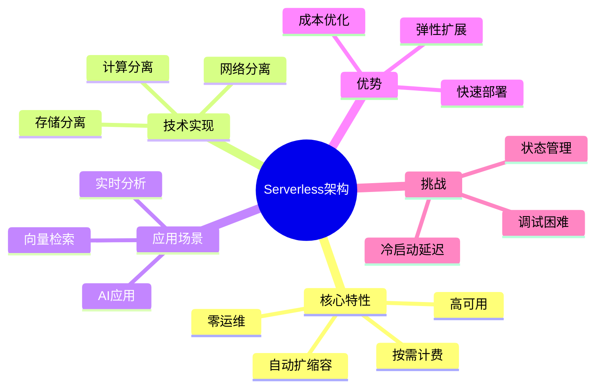

### 2.2 Neon Serverless架构

**架构设计**:

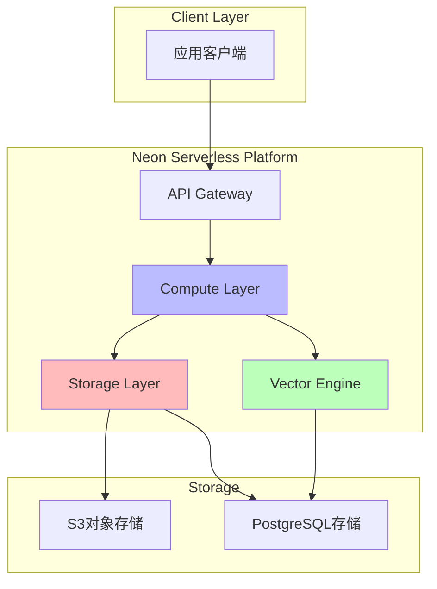

**核心特性**:

| 特性 | 说明 | 优势 |
|------|:----|:----|
| **按需计费** | 按实际使用量计费 | 成本优化 |
| **自动扩缩容** | 根据负载自动调整 | 弹性扩展 |
| **分支功能** | 数据库分支管理 | 快速开发 |
| **向量支持** | 内置pgvector支持 | AI就绪 |

**实现示例**:

```sql
-- Neon Serverless连接
-- 连接字符串自动包含Serverless配置
CREATE DATABASE my_ai_app;

-- 启用向量扩展
CREATE EXTENSION vector;

-- 创建向量表
CREATE TABLE documents (
    id SERIAL PRIMARY KEY,
    content TEXT,
    embedding vector(1536)
);

-- 自动索引优化
CREATE INDEX ON documents
USING hnsw (embedding vector_cosine_ops)
WITH (m = 16, ef_construction = 64);
```

### 2.3 Supabase Serverless

**架构设计**:

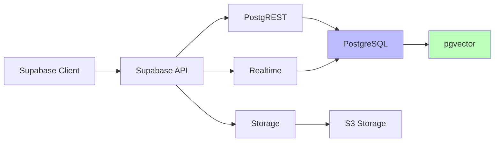

**核心特性**:

| 特性 | 说明 | 优势 |
|------|:----|:----|
| **实时订阅** | WebSocket实时数据同步 | 实时应用 |
| **自动API** | 自动生成REST API | 快速开发 |
| **存储管理** | 对象存储管理 | 文件处理 |
| **认证授权** | 内置认证系统 | 安全便捷 |

### 2.4 成本优化策略

**成本对比矩阵**:

| 场景 | 传统部署 | Serverless | 节省比例 |
|------|:--------:|:----------:|:--------:|
| **低流量** | $100/月 | $20/月 | 80% |
| **中流量** | $500/月 | $200/月 | 60% |
| **高流量** | $2000/月 | $1500/月 | 25% |
| **峰值流量** | $5000/月 | $3000/月 | 40% |

**优化策略**:

1. **连接池优化**

   ```sql
   -- 使用PgBouncer连接池
   -- 减少连接数，降低成本
   ```

2. **查询优化**

   ```sql
   -- 优化查询计划
   EXPLAIN ANALYZE SELECT * FROM documents
   WHERE embedding <=> query_vector < 0.8;
   ```

3. **索引优化**

   ```sql
   -- 选择合适的索引类型
   -- HNSW: 小规模，高精度
   -- IVFFlat: 大规模，快速检索
   ```

## 三、存算分离深化

### 3.1 存算分离架构UML图

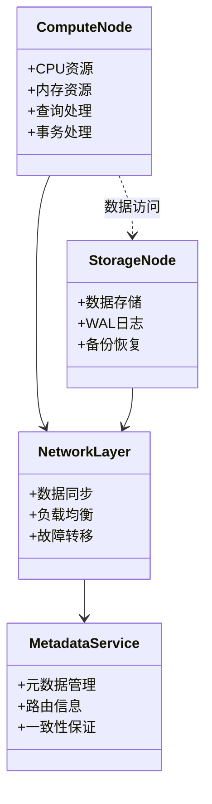

### 3.2 存储层设计

**存储架构**:

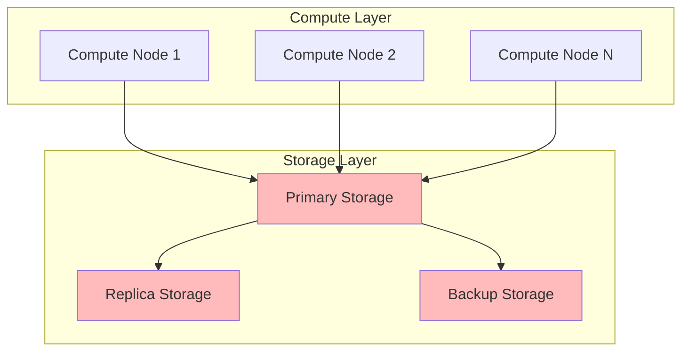

**存储特性**:

| 特性 | 说明 | 优势 |
|------|:----|:----|
| **独立扩展** | 存储和计算独立扩展 | 资源优化 |
| **高可用** | 多副本存储 | 数据安全 |
| **快照备份** | 快速数据备份 | 快速恢复 |
| **跨区域复制** | 多区域数据复制 | 容灾能力 |

### 3.3 计算层设计

**计算架构**:

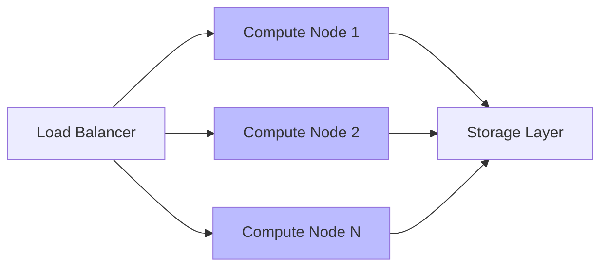

**计算特性**:

| 特性 | 说明 | 优势 |
|------|:----|:----|
| **弹性扩展** | 按需扩展计算资源 | 成本优化 |
| **负载均衡** | 自动负载分配 | 性能优化 |
| **故障隔离** | 计算节点故障隔离 | 高可用 |
| **资源隔离** | 资源隔离保证 | 性能稳定 |

### 3.4 数据同步机制

**同步流程**:

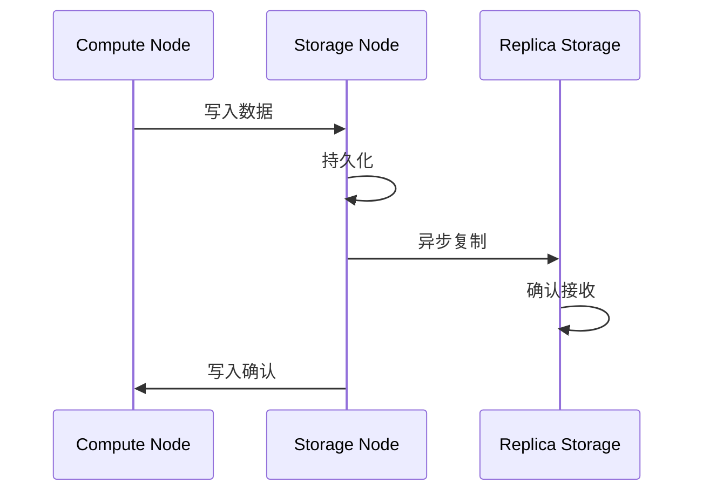

**同步策略**:

| 策略 | 说明 | 适用场景 |
|------|:----|:--------|
| **同步复制** | 实时同步 | 强一致性要求 |
| **异步复制** | 延迟同步 | 高性能要求 |
| **半同步复制** | 部分同步 | 平衡性能和一致性 |

## 四、多云架构支持

### 4.1 多云架构决策树

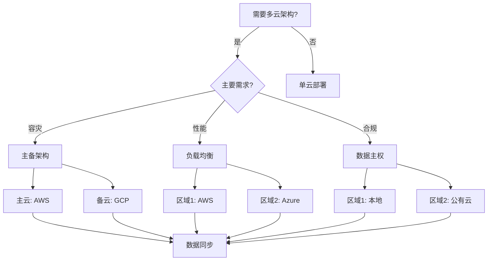

### 4.2 跨云部署方案

**部署架构**:

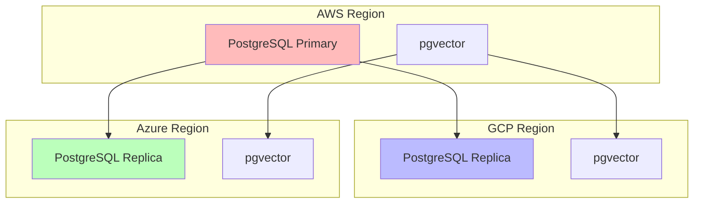

**部署策略**:

| 策略 | 说明 | 优势 |
|------|:----|:----|
| **主备模式** | 一主多备 | 高可用 |
| **多主模式** | 多主同步 | 负载均衡 |
| **分片模式** | 数据分片 | 大规模扩展 |

### 4.3 数据迁移策略

**迁移流程**:

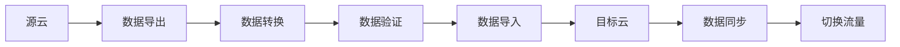

**迁移工具**:

| 工具 | 说明 | 适用场景 |
|------|:----|:--------|
| **pg_dump/pg_restore** | 标准迁移工具 | 小规模迁移 |
| **AWS DMS** | AWS数据迁移服务 | AWS迁移 |
| **Google Cloud SQL迁移** | GCP迁移工具 | GCP迁移 |
| **Azure Database Migration** | Azure迁移工具 | Azure迁移 |

### 4.4 容灾备份方案

**容灾架构**:

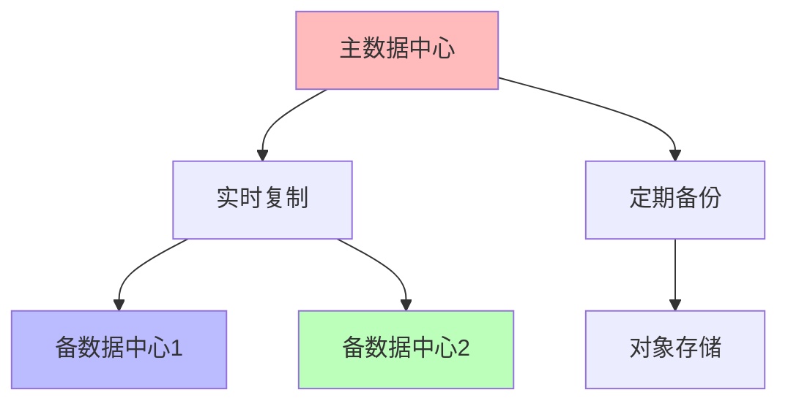

**备份策略**:

| 策略 | 说明 | RPO | RTO |
|------|:----|:---:|:---:|
| **实时复制** | 实时数据同步 | 0 | <1分钟 |
| **异步复制** | 延迟数据同步 | <1分钟 | <5分钟 |
| **定期备份** | 定时数据备份 | 1小时 | <30分钟 |

## 五、与云AI服务集成

### 5.1 云AI服务集成架构图

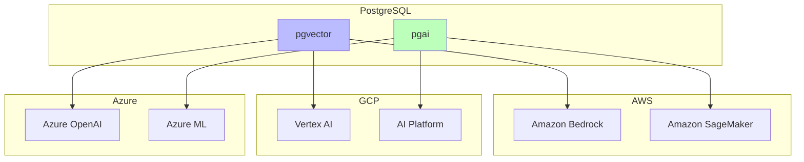

### 5.2 AWS AI服务集成

**集成方式**:

```sql
-- 使用AWS Bedrock进行embedding
CREATE EXTENSION aws_ai;

-- 配置AWS凭证
SELECT aws_ai.configure(
    access_key = 'your-access-key',
    secret_key = 'your-secret-key',
    region = 'us-east-1'
);

-- 使用Bedrock生成embedding
SELECT aws_ai.embedding(
    model = 'amazon.titan-embed-text-v1',
    text = 'PostgreSQL AI'
) AS embedding;
```

**服务对比**:

| 服务 | 功能 | 适用场景 |
|------|:----|:--------|
| **Amazon Bedrock** | LLM服务 | 通用AI应用 |
| **Amazon SageMaker** | ML训练 | 自定义模型 |
| **Amazon Comprehend** | NLP服务 | 文本分析 |

### 5.3 Google Cloud AI集成

**集成方式**:

```sql
-- 使用Vertex AI进行embedding
CREATE EXTENSION gcp_ai;

-- 配置GCP凭证
SELECT gcp_ai.configure(
    project_id = 'your-project-id',
    credentials = 'your-credentials-json'
);

-- 使用Vertex AI生成embedding
SELECT gcp_ai.embedding(
    model = 'textembedding-gecko@001',
    text = 'PostgreSQL AI'
) AS embedding;
```

**服务对比**:

| 服务 | 功能 | 适用场景 |
|------|:----|:--------|
| **Vertex AI** | 统一AI平台 | 企业AI应用 |
| **AI Platform** | ML训练 | 自定义模型 |
| **Cloud Natural Language** | NLP服务 | 文本分析 |

### 5.4 Azure AI服务集成

**集成方式**:

```sql
-- 使用Azure OpenAI进行embedding
CREATE EXTENSION azure_ai;

-- 配置Azure凭证
SELECT azure_ai.configure(
    endpoint = 'https://your-endpoint.openai.azure.com',
    api_key = 'your-api-key'
);

-- 使用Azure OpenAI生成embedding
SELECT azure_ai.embedding(
    model = 'text-embedding-ada-002',
    text = 'PostgreSQL AI'
) AS embedding;
```

**服务对比**:

| 服务 | 功能 | 适用场景 |
|------|:----|:--------|
| **Azure OpenAI** | OpenAI服务 | 通用AI应用 |
| **Azure ML** | ML训练 | 自定义模型 |
| **Azure Cognitive Services** | 认知服务 | 多模态AI |

## 六、云服务对比矩阵

| 云平台 | Serverless支持 | 存算分离 | 多云支持 | AI服务集成 | 成本优化 |
|-------|:-------------:|:-------:|:--------:|:----------:|:--------:|
| **AWS** | ⭐⭐⭐⭐⭐ | ⭐⭐⭐⭐ | ⭐⭐⭐⭐ | ⭐⭐⭐⭐⭐ | ⭐⭐⭐⭐ |
| **GCP** | ⭐⭐⭐⭐ | ⭐⭐⭐⭐⭐ | ⭐⭐⭐⭐ | ⭐⭐⭐⭐⭐ | ⭐⭐⭐⭐ |
| **Azure** | ⭐⭐⭐⭐ | ⭐⭐⭐⭐ | ⭐⭐⭐⭐⭐ | ⭐⭐⭐⭐⭐ | ⭐⭐⭐⭐ |
| **Neon** | ⭐⭐⭐⭐⭐ | ⭐⭐⭐⭐⭐ | ⭐⭐⭐ | ⭐⭐⭐ | ⭐⭐⭐⭐⭐ |
| **Supabase** | ⭐⭐⭐⭐⭐ | ⭐⭐⭐⭐ | ⭐⭐⭐ | ⭐⭐⭐ | ⭐⭐⭐⭐ |

## 七、关联主题

- [技术发展趋势](./技术发展趋势.md) - 整体趋势分析
- [战略实施建议](./战略实施建议.md) - 实施路径
- [02-技术架构](../02-技术架构/) - 架构设计
- [07-实施路径](../07-实施路径/) - 部署方案

## 八、对标资源

### 技术文档

- [AWS Architecture Center](https://aws.amazon.com/architecture/)
- [Google Cloud Architecture](https://cloud.google.com/architecture)
- [Microsoft Azure Architecture](https://azure.microsoft.com/solutions/architecture/)
- [Neon文档](https://neon.tech/docs)
- [Supabase文档](https://supabase.com/docs)

### 最佳实践

- [AWS Well-Architected Framework](https://aws.amazon.com/architecture/well-architected/)
- [Google Cloud Best Practices](https://cloud.google.com/docs/best-practices)
- [Azure Architecture Best Practices](https://docs.microsoft.com/azure/architecture/best-practices/)

---

**最后更新**: 2025年1月
**维护者**: PostgreSQL Modern Team
**文档编号**: AI-08-05
