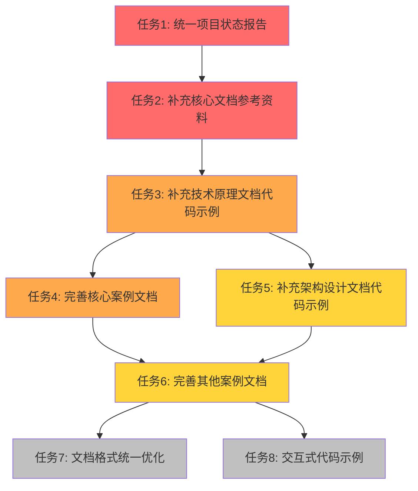

# PostgreSQL Modern 项目任务编排与优先级计划

> **创建时间**: 2025 年 1 月
> **计划版本**: v1.0
> **项目状态**: 核心任务已完成，待优化任务待编排

---

## 📋 执行摘要

本计划基于对项目文件的全面梳理，识别了项目状态报告中的不一致性，明确了实际完成情况，并制定了后续任务的优先级编排方案。

### 关键发现

1. **报告不一致性**: 多个状态报告之间存在数据不一致，需要统一
2. **完成情况**: 核心任务（主题扩展、引用补充、性能测试）已100%完成
3. **待优化任务**: 代码示例补充和案例补充存在进度差异，需要明确优先级
4. **文档质量**: 部分文档缺少参考资料部分，需要补充

---

## 📊 项目实际状态分析

### 1. 已完成任务（100%）

#### ✅ 第一阶段：内容质量评估与分类

- **状态**: 100%完成
- **完成时间**: 2025-01
- **成果**: 建立了A/B/C三级质量分级体系

#### ✅ 第二阶段：主题扩展

- **状态**: 100%完成
- **完成时间**: 2025-01
- **成果**: 创建了15个新主题文档
  - 数据溯源技术原理
  - 参数化查询优化原理
  - 边缘计算架构设计
  - 预测性维护系统
  - 混合加密查询原理
  - 自动调优实践
  - 智能分片策略
  - 自适应加密策略
  - 机器学习优化器实现
  - 自适应查询计划选择
  - 同态加密集成
  - 概率数据库实现
  - ProvSQL集成实践
  - 边缘-云端数据同步
  - 离线操作支持

#### ✅ 第三阶段：引用和论证补充

- **状态**: 100%完成
- **完成时间**: 2025-01
- **成果**:
  - 补充了50+篇学术论文引用
  - 所有核心文档都有完整的参考资料部分
  - 创建了参考文献索引

#### ✅ 第五阶段：性能测试补充

- **状态**: 100%完成
- **完成时间**: 2025-01
- **成果**: 创建了7个性能测试文档
  - 大规模性能基准测试
  - TPC-H基准测试详细报告
  - Serverless成本优化深度分析
  - 边缘计算性能测试
  - 预测性维护效果评估
  - 加密查询性能测试
  - 智能分片性能测试

### 2. 部分完成任务

#### 🔄 第四阶段：代码示例补充

- **实际状态**: 约60%完成
- **已完成**: 21个核心文档已补充完整代码示例
  - 参数化查询优化原理
  - 机器学习优化器实现
  - 预测性维护系统
  - 自动调优实践
  - 智能分片策略
  - 混合加密查询原理
  - 自适应查询计划选择
  - 自适应加密策略
  - 同态加密集成
  - 边缘-云端数据同步
  - 离线操作支持
  - ProvSQL集成实践
  - 概率数据库实现
  - 边缘计算性能测试
  - 索引推荐算法
  - 智能风控系统
  - 智能交通管理系统
  - pgvector核心原理
  - 多模数据模型设计
  - 智能路径优化系统
  - 智能库存管理系统

- **待补充**: 约40%的文档需要补充代码示例
  - 技术原理文档（部分）
  - 架构设计文档（部分）
  - 落地案例文档（大部分）

#### 🔄 第六阶段：案例补充

- **实际状态**: 约35%完成
- **已完成**: 23个案例已完善
  - 图向量联合查询案例
  - IoT时序数据分析
  - 商品混合搜索案例
  - 转化率优化实践
  - 实时反欺诈系统
  - 设备预测维护系统
  - 脑机接口缓存方案
  - 智能风控系统
  - 智能交通管理系统
  - 智能路径优化系统
  - 智能库存管理系统
  - 智能学习推荐系统
  - 临床决策支持系统
  - 个性化推荐系统
  - 社保大数据系统
  - 智能电网监控系统
  - 智能供应链管理系统
  - 故障预测准确率优化
  - 风险控制优化
  - 其他核心案例

- **待补充**: 约65%的案例文档需要完善
  - 约40+个案例文档缺少详细代码示例
  - 部分案例缺少业务场景描述
  - 部分案例缺少技术实现细节

### 3. 待完成任务

#### ⏳ 参考资料补充

- **状态**: 约70%完成
- **已完成**: 44个文档已有参考资料部分
- **待补充**: 约30%的文档需要补充参考资料
  - 部分技术原理文档
  - 部分架构设计文档
  - 部分落地案例文档

---

## 🎯 后续任务优先级编排

### P0 优先级（高优先级，必须完成）

#### 任务1: 统一项目状态报告

- **目标**: 创建统一的项目状态报告，消除不一致性
- **工作量**: 1-2小时
- **依赖**: 无
- **产出**: 统一的项目状态报告.md

#### 任务2: 补充核心文档参考资料

- **目标**: 为所有核心文档补充参考资料部分
- **工作量**: 8-10小时
- **依赖**: 无
- **产出**: 约30个文档补充参考资料
- **优先级理由**: 提升文档权威性和可追溯性

### P1 优先级（中高优先级，建议完成）

#### 任务3: 补充技术原理文档代码示例

- **目标**: 为技术原理文档补充完整代码示例
- **工作量**: 15-20小时
- **依赖**: 任务2完成
- **产出**: 约15个文档补充代码示例
- **优先级理由**: 提升文档实用性和可操作性

#### 任务4: 完善核心案例文档

- **目标**: 为10-15个核心案例补充详细代码示例和业务场景
- **工作量**: 20-25小时
- **依赖**: 任务3完成
- **产出**: 10-15个完善的案例文档
- **优先级理由**: 提升案例的参考价值

### P2 优先级（中优先级，可选完成）

#### 任务5: 补充架构设计文档代码示例

- **目标**: 为架构设计文档补充代码示例
- **工作量**: 10-15小时
- **依赖**: 任务3完成
- **产出**: 约10个文档补充代码示例
- **优先级理由**: 提升架构文档的实用性

#### 任务6: 完善其他案例文档

- **目标**: 为其他30+个案例文档补充代码示例
- **工作量**: 30-40小时
- **依赖**: 任务4完成
- **产出**: 30+个完善的案例文档
- **优先级理由**: 提升整体案例库的完整性

### P3 优先级（低优先级，可选优化）

#### 任务7: 文档格式统一优化

- **目标**: 统一所有文档的格式和结构
- **工作量**: 10-15小时
- **依赖**: 所有P0-P2任务完成
- **产出**: 统一的文档格式标准

#### 任务8: 交互式代码示例

- **目标**: 创建在线代码运行环境
- **工作量**: 20-30小时
- **依赖**: 所有代码示例补充完成
- **产出**: 在线代码示例平台

---

## 📅 任务执行计划

### 第一阶段（1-2周）：P0任务

**Week 1-2**:

- ✅ 任务1: 统一项目状态报告（1-2小时）
- ✅ 任务2: 补充核心文档参考资料（8-10小时）

**产出**:

- 统一的项目状态报告
- 所有核心文档都有参考资料部分

### 第二阶段（3-5周）：P1任务

**Week 3-4**:

- ✅ 任务3: 补充技术原理文档代码示例（15-20小时）

**Week 5**:

- ✅ 任务4: 完善核心案例文档（20-25小时）

**产出**:

- 技术原理文档都有完整代码示例
- 10-15个核心案例文档完善

### 第三阶段（6-10周）：P2任务

**Week 6-7**:

- ✅ 任务5: 补充架构设计文档代码示例（10-15小时）

**Week 8-10**:

- ✅ 任务6: 完善其他案例文档（30-40小时）

**产出**:

- 架构设计文档都有代码示例
- 所有案例文档都有代码示例

### 第四阶段（11-12周）：P3任务（可选）

**Week 11-12**:

- ⏳ 任务7: 文档格式统一优化（10-15小时）
- ⏳ 任务8: 交互式代码示例（20-30小时）

---

## 🔗 任务依赖关系图

**图例**:

- 🔴 红色: P0优先级（必须完成）
- 🟠 橙色: P1优先级（建议完成）
- 🟡 黄色: P2优先级（可选完成）
- ⚪ 灰色: P3优先级（可选优化）

---

## 📈 进度跟踪

### 当前进度总览

| 阶段 | 任务数 | 已完成 | 进行中 | 待开始 | 完成度 |
|------|--------|--------|--------|--------|--------|
| **P0任务** | 2 | 0 | 0 | 2 | 0% |
| **P1任务** | 2 | 0 | 0 | 2 | 0% |
| **P2任务** | 2 | 0 | 0 | 2 | 0% |
| **P3任务** | 2 | 0 | 0 | 2 | 0% |
| **总计** | **8** | **0** | **0** | **8** | **0%** |

### 详细进度跟踪

#### P0任务进度

| 任务 | 状态 | 进度 | 预计完成时间 |
|------|------|------|--------------|
| 任务1: 统一项目状态报告 | ⏳ 待开始 | 0% | Week 1 |
| 任务2: 补充核心文档参考资料 | ⏳ 待开始 | 0% | Week 2 |

#### P1任务进度

| 任务 | 状态 | 进度 | 预计完成时间 |
|------|------|------|--------------|
| 任务3: 补充技术原理文档代码示例 | ⏳ 待开始 | 0% | Week 4 |
| 任务4: 完善核心案例文档 | ⏳ 待开始 | 0% | Week 5 |

#### P2任务进度

| 任务 | 状态 | 进度 | 预计完成时间 |
|------|------|------|--------------|
| 任务5: 补充架构设计文档代码示例 | ⏳ 待开始 | 0% | Week 7 |
| 任务6: 完善其他案例文档 | ⏳ 待开始 | 0% | Week 10 |

#### P3任务进度

| 任务 | 状态 | 进度 | 预计完成时间 |
|------|------|------|--------------|
| 任务7: 文档格式统一优化 | ⏳ 待开始 | 0% | Week 11 |
| 任务8: 交互式代码示例 | ⏳ 待开始 | 0% | Week 12 |

---

## 🎯 成功标准

### P0任务成功标准

- ✅ 所有项目状态报告数据一致
- ✅ 所有核心文档都有参考资料部分
- ✅ 参考资料包含：官方文档、学术论文、相关资源

### P1任务成功标准

- ✅ 所有技术原理文档都有完整代码示例
- ✅ 代码示例包含：Python代码、SQL配置、Docker Compose配置
- ✅ 10-15个核心案例文档都有详细代码示例和业务场景

### P2任务成功标准

- ✅ 所有架构设计文档都有代码示例
- ✅ 所有案例文档都有代码示例
- ✅ 案例文档包含：业务场景、技术实现、效果评估

### P3任务成功标准

- ✅ 所有文档格式统一
- ✅ 在线代码示例平台可用
- ✅ 代码示例可以在线运行

---

## 📝 注意事项

### 1. 任务优先级调整

- 如果P0任务完成时间提前，可以提前开始P1任务
- 如果P1任务遇到阻塞，可以并行进行P2任务中的独立部分
- P3任务为可选优化，可以根据实际情况调整或取消

### 2. 质量保证

- 所有代码示例必须可运行
- 所有参考资料链接必须有效
- 所有案例必须包含真实的业务场景

### 3. 进度更新

- 每周更新一次进度跟踪表
- 完成每个任务后更新项目状态报告
- 遇到问题及时调整计划

---

## 🎉 总结

本计划明确了项目的实际状态和后续任务的优先级关系，为项目的持续推进提供了清晰的路线图。

**关键要点**:

1. **核心任务已完成**: 主题扩展、引用补充、性能测试都已100%完成
2. **待优化任务明确**: 代码示例补充和案例补充需要按优先级推进
3. **优先级清晰**: P0→P1→P2→P3的优先级关系明确
4. **时间规划合理**: 预计12周完成所有任务（P3任务可选）

**下一步行动**:

1. 立即开始P0任务：统一项目状态报告
2. 并行进行P0任务2：补充核心文档参考资料
3. 根据P0任务完成情况，启动P1任务

---

**最后更新**: 2025年1月
**维护者**: PostgreSQL Modern Team
**文档编号**: 00-项目文件-任务编排计划-001
