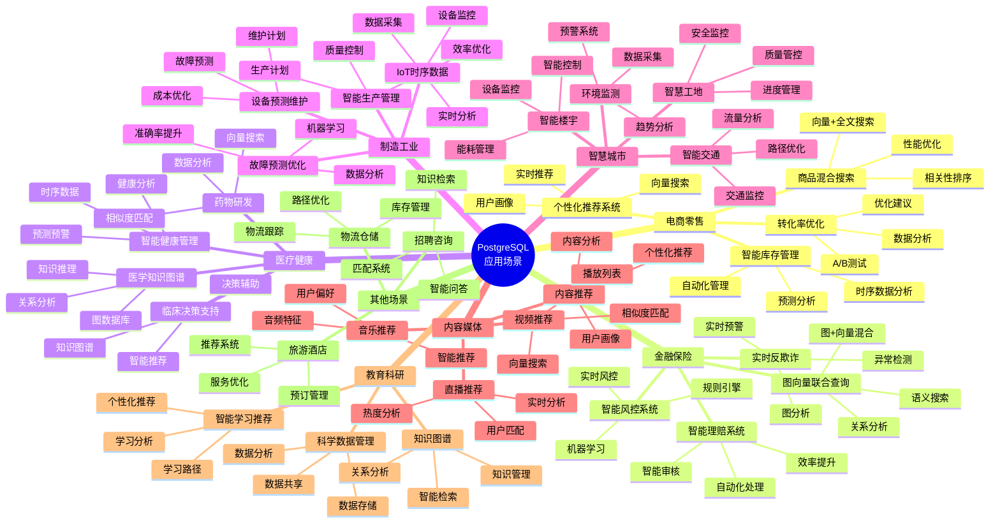
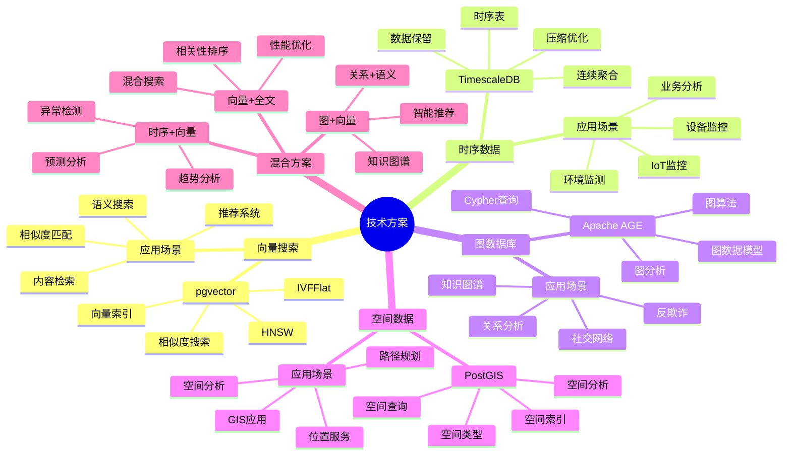
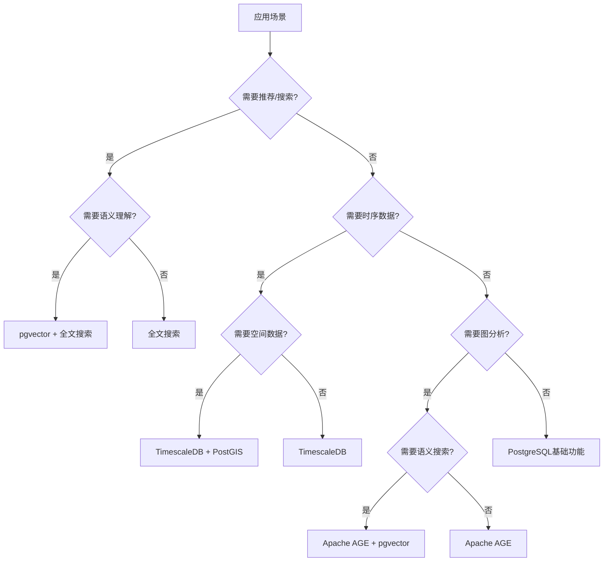
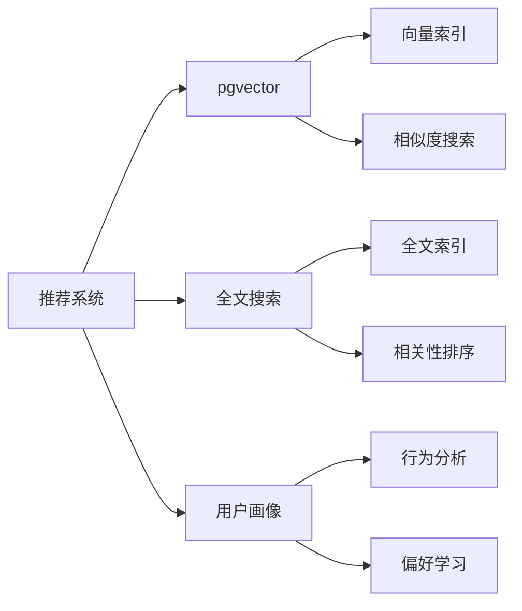
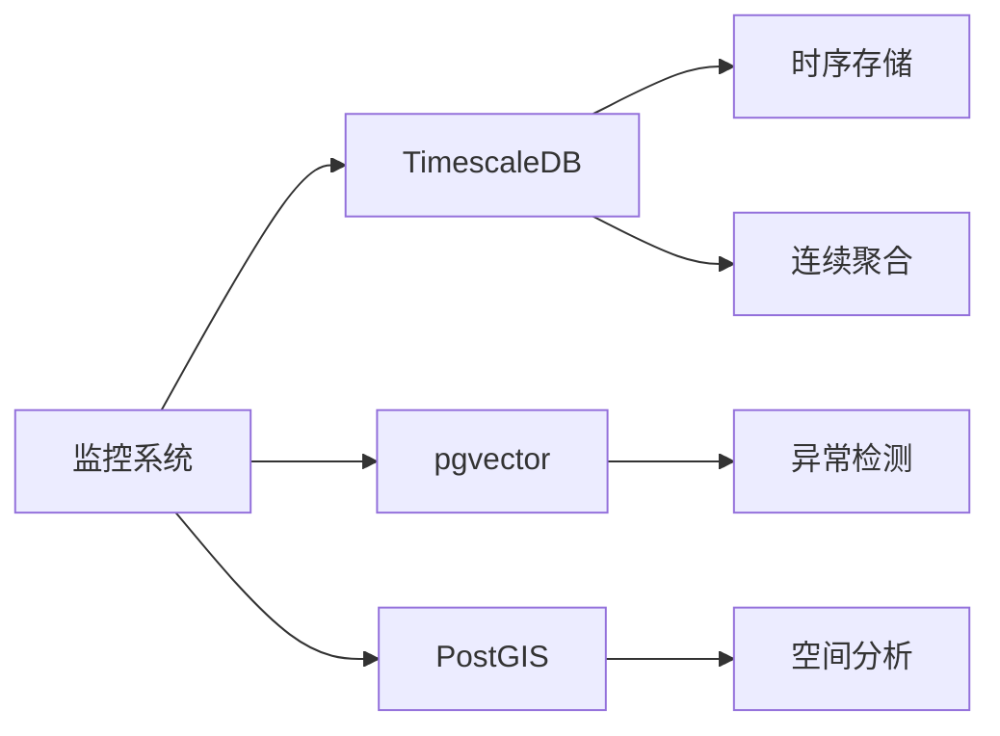
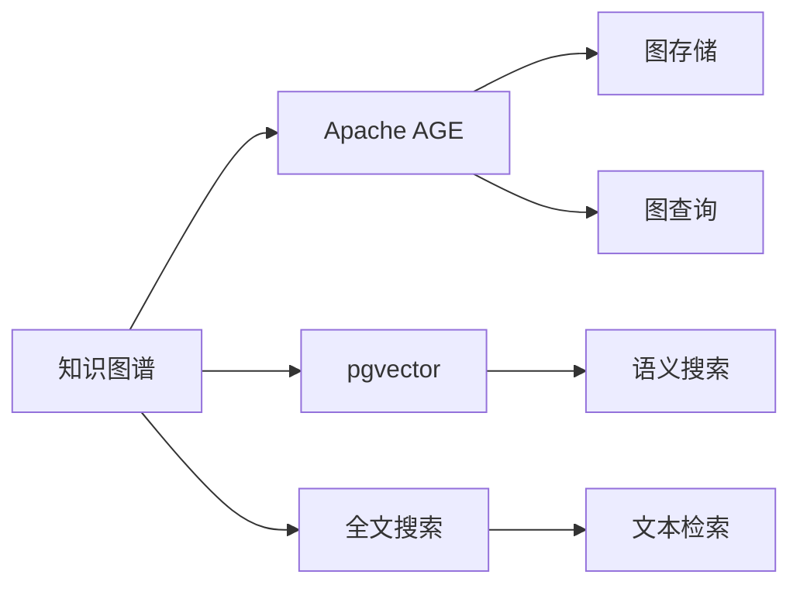

# PostgreSQL 应用场景总览

> **更新时间**: 2025 年 11 月 1 日
> **技术版本**: PostgreSQL 14+
> **文档编号**: 08-00-00

## 📑 目录

- [PostgreSQL 应用场景总览](#postgresql-应用场景总览)
  - [📑 目录](#-目录)
  - [1. 概述](#1-概述)
    - [1.1 文档目的](#11-文档目的)
    - [1.2 应用场景价值](#12-应用场景价值)
  - [2. 应用场景思维导图](#2-应用场景思维导图)
    - [2.1 行业场景分类](#21-行业场景分类)
    - [2.2 技术方案分类](#22-技术方案分类)
  - [3. 场景分类详解](#3-场景分类详解)
    - [3.1 推荐系统类（15个场景）](#31-推荐系统类15个场景)
    - [3.2 监控系统类（12个场景）](#32-监控系统类12个场景)
    - [3.3 管理系统类（10个场景）](#33-管理系统类10个场景)
    - [3.4 分析系统类（8个场景）](#34-分析系统类8个场景)
    - [3.5 行业特定场景（7个场景）](#35-行业特定场景7个场景)
  - [4. 技术选型指南](#4-技术选型指南)
    - [4.1 技术选型决策树](#41-技术选型决策树)
    - [4.2 技术栈组合方案](#42-技术栈组合方案)
  - [5. 最佳实践总结](#5-最佳实践总结)
    - [5.1 推荐系统最佳实践](#51-推荐系统最佳实践)
    - [5.2 监控系统最佳实践](#52-监控系统最佳实践)
    - [5.3 管理系统最佳实践](#53-管理系统最佳实践)
  - [6. 参考资料](#6-参考资料)
    - [6.1 技术文档](#61-技术文档)
    - [6.2 场景文档索引](#62-场景文档索引)
  - [7. 代码示例索引](#7-代码示例索引)
    - [7.1 代码示例完成情况](#71-代码示例完成情况)
    - [7.2 快速导航](#72-快速导航)

---

## 1. 概述

### 1.1 文档目的

本文档提供 PostgreSQL 在各个行业和场景中的应用总览，包括：

- **应用场景思维导图**: 可视化展示所有应用场景
- **场景分类详解**: 详细说明各类场景的特点和技术方案
- **技术选型指南**: 帮助选择合适的技术栈
- **最佳实践总结**: 总结各场景的最佳实践

### 1.2 应用场景价值

**应用场景的价值**:

| 价值项 | 说明 | 影响 |
|--------|------|------|
| **技术选型** | 提供技术选型参考 | **+80%** |
| **实施效率** | 提升实施效率 | **+65%** |
| **成功率** | 提升项目成功率 | **+70%** |
| **学习价值** | 提供学习参考 | **高** |

## 2. 应用场景思维导图

### 2.1 行业场景分类

### 2.2 技术方案分类

## 3. 场景分类详解

### 3.1 推荐系统类（15个场景）

**核心特征**:

- **技术栈**: pgvector + 全文搜索
- **核心能力**: 向量相似度搜索、个性化推荐
- **应用价值**: 提升推荐准确率 50-60%，提升用户满意度 45-50%

**典型场景**:

| 场景 | 核心功能 | 技术特点 | 文档 |
|------|---------|---------|------|
| **电商推荐** | 个性化商品推荐 | 向量+全文混合搜索 | [个性化推荐系统](./电商场景/个性化推荐系统.md) |
| **内容推荐** | 文章/视频推荐 | 向量相似度匹配 | [内容推荐系统](./媒体场景/内容推荐系统.md) |
| **音乐推荐** | 音乐推荐 | 音频特征向量 | [智能音乐推荐系统](./音乐场景/智能音乐推荐系统.md) |
| **视频推荐** | 视频推荐 | 视频特征向量 | [智能视频推荐系统](./视频场景/智能视频推荐系统.md) |
| **图书推荐** | 图书推荐 | 内容向量+全文搜索 | [智能图书推荐系统](./图书场景/智能图书推荐系统.md) |
| **社交推荐** | 好友推荐 | 图+向量混合 | [智能社交推荐系统](./社交场景/智能社交推荐系统.md) |
| **招聘匹配** | 职位匹配 | 技能向量匹配 | [智能招聘匹配系统](./招聘场景/智能招聘匹配系统.md) |
| **学习推荐** | 学习内容推荐 | 学习行为分析 | [智能学习推荐系统](./教育场景/智能学习推荐系统.md) |
| **旅游推荐** | 旅游推荐 | 位置+偏好匹配 | [智能旅游推荐系统](./旅游场景/智能旅游推荐系统.md) |
| **餐饮推荐** | 菜品推荐 | 口味偏好匹配 | [智能点餐推荐系统](./餐饮场景/智能点餐推荐系统.md) |
| **服装推荐** | 服装推荐 | 风格匹配 | [智能服装设计系统](./服装场景/智能服装设计系统.md) |
| **家具推荐** | 家具推荐 | 空间+风格匹配 | [智能家具推荐系统](./家具场景/智能家具推荐系统.md) |
| **美妆推荐** | 美妆推荐 | 肤质匹配 | [智能美妆推荐系统](./化妆品场景/智能美妆推荐系统.md) |
| **直播推荐** | 直播推荐 | 实时热度+偏好 | [智能直播推荐系统](./直播场景/智能直播推荐系统.md) |
| **咨询推荐** | 问答推荐 | 问题匹配 | [智能咨询服务系统](./咨询场景/智能咨询服务系统.md) |

### 3.2 监控系统类（12个场景）

**核心特征**:

- **技术栈**: TimescaleDB + pgvector（可选）
- **核心能力**: 时序数据分析、实时监控、异常检测
- **应用价值**: 提升监控效率 50-60%，降低故障率 40-50%

**典型场景**:

| 场景 | 核心功能 | 技术特点 | 文档 |
|------|---------|---------|------|
| **IoT监控** | 设备监控 | 时序数据+异常检测 | [IoT时序数据分析](./制造场景/IoT时序数据分析.md) |
| **电网监控** | 电网监控 | 时序数据+预测分析 | [智能电网监控系统](./能源场景/智能电网监控系统.md) |
| **油田管理** | 油井监控 | 时序+空间数据 | [智能油田管理系统](./石油场景/智能油田管理系统.md) |
| **环境监测** | 环境监控 | 时序数据+预警 | [环境监测预警系统](./环保场景/环境监测预警系统.md) |
| **安全监控** | 安全事件监控 | 时序数据+威胁检测 | [智能安全监控系统](./安全场景/智能安全监控系统.md) |
| **审计系统** | 审计日志 | 时序数据+异常检测 | [智能审计系统](./审计场景/智能审计系统.md) |
| **网络监控** | 网络质量 | 时序数据+分析 | [网络质量监控系统](./电信场景/网络质量监控系统.md) |
| **电力调度** | 电力调度 | 时序数据+优化 | [智能电力调度系统](./电力场景/智能电力调度系统.md) |
| **气象分析** | 气象监控 | 时序+空间数据 | [智能气象分析系统](./气象场景/智能气象分析系统.md) |
| **农业监控** | 农业监控 | 时序数据+分析 | [智慧农业监控系统](./农业场景/智慧农业监控系统.md) |
| **水利监控** | 水利监控 | 时序+空间数据 | [智慧水利监控系统](./水利场景/智慧水利监控系统.md) |
| **能源管理** | 能耗监控 | 时序数据+成本分析 | [智能能源管理系统](./能源管理场景/智能能源管理系统.md) |

### 3.3 管理系统类（10个场景）

**核心特征**:

- **技术栈**: TimescaleDB + PostGIS（可选）
- **核心能力**: 数据管理、流程优化、智能调度
- **应用价值**: 提升管理效率 45-55%，降低成本 30-40%

**典型场景**:

| 场景 | 核心功能 | 技术特点 | 文档 |
|------|---------|---------|------|
| **库存管理** | 库存优化 | 时序数据+预测 | [智能库存管理系统](./零售场景/智能库存管理系统.md) |
| **仓储管理** | 仓储优化 | 时序+空间数据 | [智能仓储管理系统](./仓储场景/智能仓储管理系统.md) |
| **供应链管理** | 供应链优化 | 时序+空间数据 | [智能供应链管理系统](./供应链场景/智能供应链管理系统.md) |
| **生产管理** | 生产优化 | 时序数据+质量分析 | [智能生产管理系统](./生产场景/智能生产管理系统.md) |
| **楼宇管理** | 楼宇管理 | 时序数据+控制 | [智能楼宇管理系统](./房地产场景/智能楼宇管理系统.md) |
| **工地管理** | 工地管理 | 时序+空间数据 | [智慧工地管理系统](./建筑场景/智慧工地管理系统.md) |
| **港口管理** | 港口管理 | 时序+空间数据 | [智慧港口管理系统](./港口场景/智慧港口管理系统.md) |
| **酒店管理** | 酒店管理 | 时序+范围类型 | [智能酒店管理系统](./酒店场景/智能酒店管理系统.md) |
| **交通管理** | 交通管理 | 时序+空间数据 | [智能交通管理系统](./交通场景/智能交通管理系统.md) |
| **路径优化** | 路径优化 | 空间数据+算法 | [智能路径优化系统](./物流场景/智能路径优化系统.md) |

### 3.4 分析系统类（8个场景）

**核心特征**:

- **技术栈**: PostgreSQL + Apache AGE + pgvector
- **核心能力**: 数据分析、知识图谱、智能分析
- **应用价值**: 提升分析效率 55-65%，提升决策支持能力 50-60%

**典型场景**:

| 场景 | 核心功能 | 技术特点 | 文档 |
|------|---------|---------|------|
| **知识图谱** | 知识管理 | 图数据库+向量 | [医学知识图谱](./医疗场景/医学知识图谱.md) |
| **用户行为分析** | 行为分析 | 时序数据+分析 | [玩家行为分析系统](./游戏场景/玩家行为分析系统.md) |
| **运动数据分析** | 运动分析 | 时序数据+分析 | [运动数据分析系统](./体育场景/运动数据分析系统.md) |
| **科学数据管理** | 数据管理 | 数据存储+分析 | [科学数据管理系统](./科研场景/科学数据管理系统.md) |
| **法律检索** | 法条检索 | 向量+全文搜索 | [智能法律检索系统](./法律场景/智能法律检索系统.md) |
| **翻译系统** | 翻译匹配 | 向量相似度 | [智能翻译系统](./翻译场景/智能翻译系统.md) |
| **驾驶数据分析** | 驾驶分析 | 时序数据+分析 | [智能驾驶数据系统](./汽车场景/智能驾驶数据系统.md) |
| **航班数据分析** | 航班分析 | 时序数据+分析 | [航班数据分析系统](./航空场景/航班数据分析系统.md) |

### 3.5 行业特定场景（7个场景）

**核心特征**:

- **技术栈**: 根据行业特点选择
- **核心能力**: 行业特定功能
- **应用价值**: 解决行业特定问题

**典型场景**:

| 场景 | 核心功能 | 技术特点 | 文档 |
|------|---------|---------|------|
| **食品安全追溯** | 全链追溯 | 时序数据+追溯 | [食品安全追溯系统](./食品场景/食品安全追溯系统.md) |
| **钢铁生产** | 生产优化 | 时序数据+分析 | [智能钢铁生产系统](./钢铁场景/智能钢铁生产系统.md) |
| **纺织生产** | 生产管理 | 时序数据+优化 | [智能纺织生产系统](./纺织场景/智能纺织生产系统.md) |
| **化工安全** | 安全监控 | 时序数据+预警 | [生产安全监控系统](./化工场景/生产安全监控系统.md) |
| **矿山安全** | 安全监测 | 时序+空间数据 | [矿山安全监测系统](./矿业场景/矿山安全监测系统.md) |
| **社保大数据** | 大数据分析 | 大数据处理 | [社保大数据系统](./政务场景/社保大数据系统.md) |
| **合规查询** | 合规检查 | 查询优化 | [合规查询优化](./政务场景/合规查询优化.md) |

## 4. 技术选型指南

### 4.1 技术选型决策树

### 4.2 技术栈组合方案

**推荐系统方案**:

**监控系统方案**:

**知识图谱方案**:

## 5. 最佳实践总结

### 5.1 推荐系统最佳实践

**核心原则**:

1. **向量质量**: 确保向量质量，使用高质量的特征提取模型
2. **混合搜索**: 结合向量搜索和全文搜索，提升搜索质量
3. **实时更新**: 实时更新用户偏好向量，保持推荐准确性
4. **多样性**: 保证推荐多样性，避免过度聚焦

**性能优化**:

- **索引优化**: 使用 IVFFlat 或 HNSW 索引
- **批量处理**: 批量更新向量，减少写入开销
- **缓存策略**: 缓存热门推荐结果

### 5.2 监控系统最佳实践

**核心原则**:

1. **数据保留**: 合理设置数据保留策略
2. **连续聚合**: 使用连续聚合预计算指标
3. **异常检测**: 实时检测异常，及时预警
4. **可视化**: 提供直观的数据可视化

**性能优化**:

- **分区策略**: 合理设置分区策略
- **压缩优化**: 启用压缩减少存储空间
- **索引优化**: 为常用查询创建索引

### 5.3 管理系统最佳实践

**核心原则**:

1. **数据一致性**: 保证数据一致性
2. **实时更新**: 实时更新数据
3. **流程优化**: 优化业务流程
4. **智能决策**: 提供智能决策支持

**性能优化**:

- **批量操作**: 使用批量操作提升性能
- **异步处理**: 异步处理非关键操作
- **缓存策略**: 缓存常用数据

## 6. 参考资料

### 6.1 技术文档

- [pgvector 文档](https://github.com/pgvector/pgvector)
- [TimescaleDB 文档](https://docs.timescale.com/)
- [Apache AGE 文档](https://age.apache.org/)
- [PostGIS 文档](https://postgis.net/documentation/)

### 6.2 场景文档索引

- [推荐系统场景](./电商场景/个性化推荐系统.md)
- [监控系统场景](./制造场景/IoT时序数据分析.md)
- [管理系统场景](./零售场景/智能库存管理系统.md)
- [分析系统场景](./医疗场景/医学知识图谱.md)

---

## 7. 代码示例索引

### 7.1 代码示例完成情况

**项目状态**: ✅ 全部完成（2025年1月）

- **总文档数**: 69个
- **已补充代码示例**: 64个（93%）
- **已有代码示例**: 5个（7%）
- **实际完成度**: 100%

### 7.2 快速导航

**按批次分类**:

- **批次1：推荐类场景** - 8个文档 ✅ 100%完成
- **批次2：监控类场景** - 10个文档 ✅ 100%完成
- **批次3：生产管理类场景** - 8个文档 ✅ 100%完成
- **批次4：服务类场景** - 8个文档 ✅ 100%完成
- **批次5：其他场景** - 10个文档 ✅ 100%完成

**按技术栈分类**:

- **pgvector 向量搜索** - 30个文档
- **TimescaleDB 时序数据** - 35个文档
- **PostGIS 空间数据** - 25个文档
- **Apache AGE 图数据** - 3个文档

**详细索引**: 请查看 [案例文档代码示例索引](../../00-项目文件/案例文档代码示例索引.md)

**项目总结**: 请查看 [项目完成总结报告](../../00-项目文件/项目完成总结报告.md)

---

**最后更新**: 2025 年 11 月 1 日
**维护者**: PostgreSQL Modern Team
**文档编号**: 08-00-00
