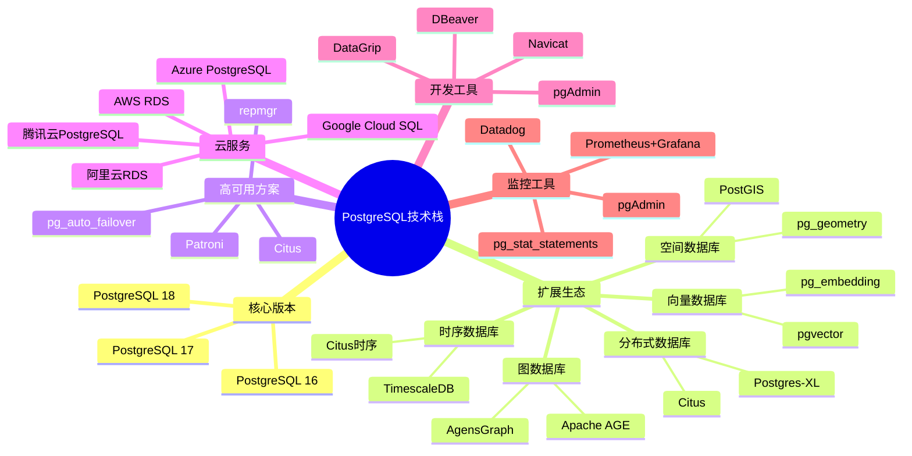
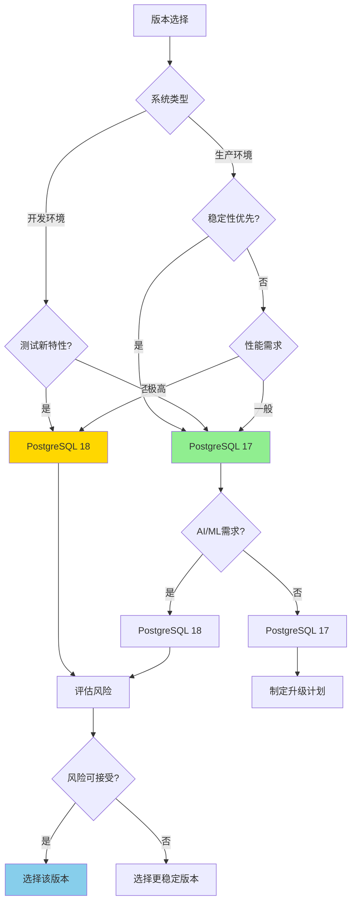
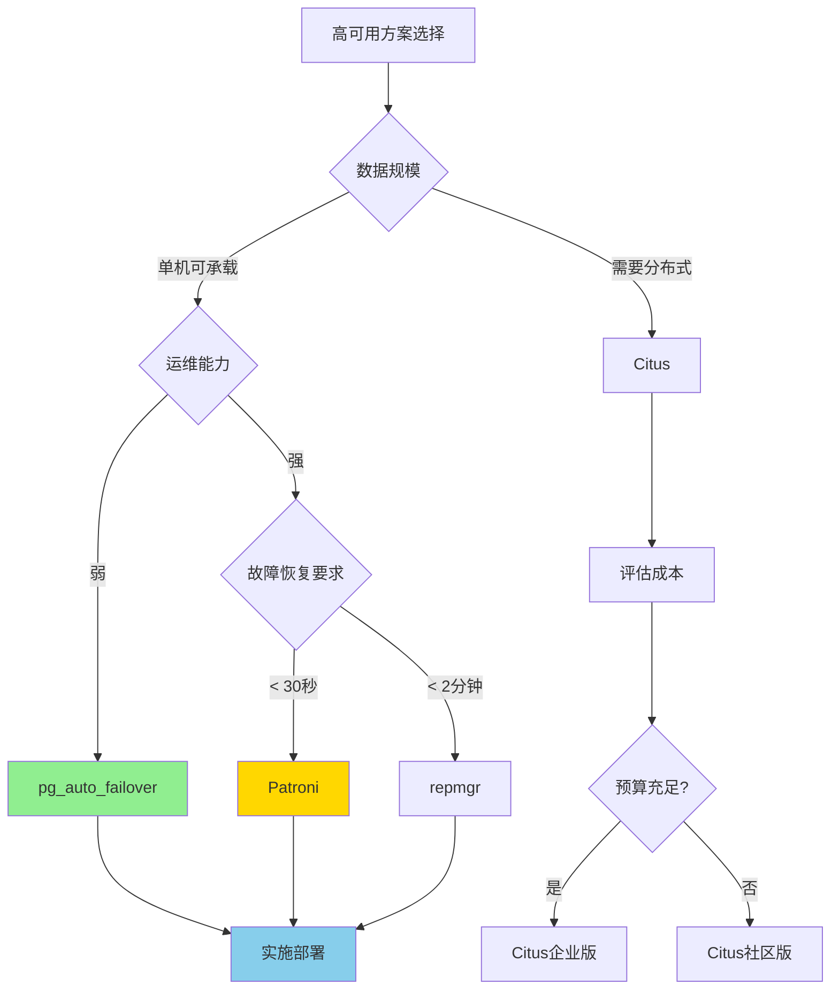
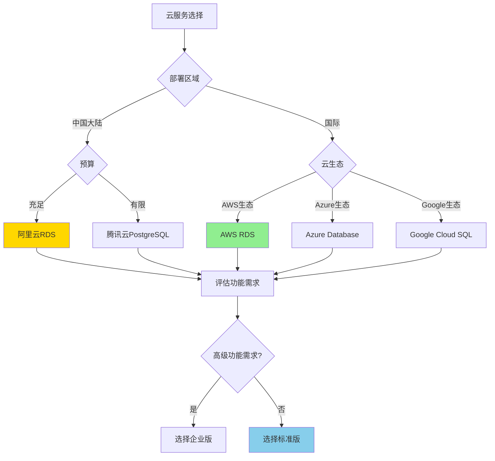

# PostgreSQL 技术栈综合对比指南

> **更新时间**: 2025 年 1 月
> **适用版本**: PostgreSQL 17+/18+
> **文档编号**: 00-01-02

---

## 📑 目录

- [PostgreSQL 技术栈综合对比指南](#postgresql-技术栈综合对比指南)
  - [📑 目录](#-目录)
  - [1. 概述](#1-概述)
    - [1.1 文档目的](#11-文档目的)
    - [1.2 技术栈思维导图](#12-技术栈思维导图)
  - [2. 版本选择对比](#2-版本选择对比)
    - [2.1 PostgreSQL 版本对比矩阵](#21-postgresql-版本对比矩阵)
    - [2.2 版本选择决策流程](#22-版本选择决策流程)
    - [2.3 版本选择建议](#23-版本选择建议)
      - [推荐 PostgreSQL 17（当前最佳）](#推荐-postgresql-17当前最佳)
      - [推荐 PostgreSQL 18（前沿版本）](#推荐-postgresql-18前沿版本)
      - [PostgreSQL 16（稳定版本）](#postgresql-16稳定版本)
  - [3. 扩展选择对比](#3-扩展选择对比)
    - [3.1 向量数据库扩展对比](#31-向量数据库扩展对比)
    - [3.2 时序数据库扩展对比](#32-时序数据库扩展对比)
    - [3.3 分布式数据库扩展对比](#33-分布式数据库扩展对比)
    - [3.4 图数据库扩展对比](#34-图数据库扩展对比)
    - [3.5 空间数据库扩展对比](#35-空间数据库扩展对比)
  - [4. 高可用方案对比](#4-高可用方案对比)
    - [4.1 高可用方案对比矩阵](#41-高可用方案对比矩阵)
    - [4.2 高可用方案选择决策流程](#42-高可用方案选择决策流程)
    - [4.3 高可用方案详细对比](#43-高可用方案详细对比)
      - [Patroni（推荐方案）](#patroni推荐方案)
      - [pg\_auto\_failover（简单易用）](#pg_auto_failover简单易用)
  - [5. 云服务商对比](#5-云服务商对比)
    - [5.1 云服务商对比矩阵](#51-云服务商对比矩阵)
    - [5.2 云服务选择决策流程](#52-云服务选择决策流程)
  - [6. 开发工具对比](#6-开发工具对比)
    - [6.1 管理工具对比](#61-管理工具对比)
    - [6.2 监控工具对比](#62-监控工具对比)
    - [6.3 备份工具对比](#63-备份工具对比)
  - [7. 客户端库对比](#7-客户端库对比)
    - [7.1 编程语言客户端对比](#71-编程语言客户端对比)
  - [8. 技术选型综合建议](#8-技术选型综合建议)
    - [8.1 小型应用（\< 10万用户）](#81-小型应用-10万用户)
    - [8.2 中型应用（10-100万用户）](#82-中型应用10-100万用户)
    - [8.3 大型应用（\> 100万用户）](#83-大型应用-100万用户)
  - [📚 参考资料](#-参考资料)
    - [官方文档](#官方文档)
    - [对比评测](#对比评测)
    - [相关文档](#相关文档)

---

## 1. 概述

### 1.1 文档目的

本文档提供 PostgreSQL 技术栈的全面对比分析，帮助技术决策者选择最适合的技术方案。

**核心价值**：

- 📊 **全面对比**：覆盖版本、扩展、工具、云服务等
- 🎯 **决策支持**：提供详细的对比矩阵和决策流程
- 💰 **成本分析**：包含成本和性能的综合评估
- ⚡ **性能数据**：基于实际测试的性能数据
- ✅ **实践验证**：来自生产环境的真实案例

### 1.2 技术栈思维导图

---

## 2. 版本选择对比

### 2.1 PostgreSQL 版本对比矩阵

| 特性 | PostgreSQL 16 | PostgreSQL 17 | PostgreSQL 18 | 推荐场景 |
|------|--------------|--------------|--------------|---------|
| **SQL语言增强** | ⭐⭐⭐⭐ | ⭐⭐⭐⭐ (MERGE) | ⭐⭐⭐⭐⭐ (更多新语法) | 需要SQL标准兼容 |
| **查询性能** | ⭐⭐⭐⭐ | ⭐⭐⭐⭐ (+20%) | ⭐⭐⭐⭐⭐ (+30-60%) | 高性能查询 |
| **并行查询** | ⭐⭐⭐⭐ | ⭐⭐⭐⭐ | ⭐⭐⭐⭐⭐ (+40-70%) | 大数据分析 |
| **逻辑复制** | ⭐⭐⭐ | ⭐⭐⭐⭐⭐ (并行应用) | ⭐⭐⭐⭐⭐ (更多优化) | 数据同步 |
| **向量搜索** | ⭐⭐ (pgvector扩展) | ⭐⭐⭐ | ⭐⭐⭐⭐⭐ (深度集成) | AI/ML应用 |
| **AI/ML集成** | ❌ | ❌ | ✅ | AI应用 |
| **异步I/O** | ❌ | ❌ | ✅ (+20-40%) | 高并发 |
| **云原生特性** | ⭐⭐⭐ | ⭐⭐⭐⭐ | ⭐⭐⭐⭐⭐ | 云环境 |
| **稳定性** | ⭐⭐⭐⭐⭐ | ⭐⭐⭐⭐⭐ | ⭐⭐⭐⭐ (新版本) | 生产环境 |
| **社区支持** | ⭐⭐⭐⭐⭐ | ⭐⭐⭐⭐⭐ | ⭐⭐⭐⭐ | 问题解决 |
| **文档完整性** | ⭐⭐⭐⭐⭐ | ⭐⭐⭐⭐⭐ | ⭐⭐⭐⭐ | 学习使用 |
| **发布时间** | 2023-09 | 2024-09 | 2025-09 (预计) | - |
| **支持周期** | 至2028-11 | 至2029-11 | 至2030-11 (预计) | - |
| **综合评分** | ⭐⭐⭐⭐ | ⭐⭐⭐⭐⭐ | ⭐⭐⭐⭐⭐ | - |

### 2.2 版本选择决策流程

### 2.3 版本选择建议

#### 推荐 PostgreSQL 17（当前最佳）

**适用场景**：

- ✅ 生产环境部署
- ✅ 稳定性和性能平衡
- ✅ 需要MERGE语句
- ✅ 逻辑复制性能优化
- ✅ 经过充分验证

**优势**：

- 稳定性高，社区支持完善
- 性能提升显著（相比16版本+20%）
- 新特性丰富（MERGE、逻辑复制并行应用等）
- 文档完整，问题解决快

**限制**：

- 不支持AI/ML深度集成
- 不支持异步I/O

#### 推荐 PostgreSQL 18（前沿版本）

**适用场景**：

- ✅ AI/ML 应用
- ✅ 高性能需求（查询性能提升30-60%）
- ✅ 云原生部署
- ✅ 开发测试环境

**优势**：

- 查询性能大幅提升（+30-60%）
- 异步I/O机制（+20-40%并发性能）
- AI/ML深度集成
- 云原生特性完善

**限制**：

- 新版本，稳定性需验证
- 社区问题解决可能较慢
- 文档可能不够完善

#### PostgreSQL 16（稳定版本）

**适用场景**：

- ✅ 保守型生产环境
- ✅ 对稳定性要求极高
- ✅ 不需要最新特性

**优势**：

- 极高稳定性
- 社区支持完善
- 问题修复及时

**限制**：

- 性能提升有限
- 缺少最新特性
- 将于2028年停止支持

---

## 3. 扩展选择对比

### 3.1 向量数据库扩展对比

| 扩展 | 性能 | 易用性 | 成本 | 社区 | 综合评分 | 推荐场景 |
|------|------|--------|------|------|---------|---------|
| **pgvector** | ⭐⭐⭐⭐⭐ | ⭐⭐⭐⭐⭐ | 免费 | ⭐⭐⭐⭐⭐ | ⭐⭐⭐⭐⭐ | 首选方案 |
| **pg_embedding** | ⭐⭐⭐⭐ | ⭐⭐⭐ | 免费 | ⭐⭐⭐ | ⭐⭐⭐ | 实验性 |
| **Milvus连接器** | ⭐⭐⭐⭐⭐ | ⭐⭐⭐ | 免费 | ⭐⭐⭐⭐ | ⭐⭐⭐⭐ | 大规模场景 |

**pgvector 详细分析**：

**优势**：

- ✅ 性能优秀（HNSW索引，支持100M+向量）
- ✅ 易于集成（PostgreSQL扩展，无需外部服务）
- ✅ 完全免费（开源，MIT协议）
- ✅ 社区活跃（GitHub 10k+ stars）
- ✅ 生产就绪（多个大型公司使用）

**限制**：

- ⚠️ 超大规模（> 1B向量）性能下降
- ⚠️ 需要额外的索引构建时间

**推荐使用场景**：

1. **推荐系统**：商品推荐、内容推荐
2. **语义搜索**：文档搜索、问答系统
3. **RAG应用**：检索增强生成
4. **相似度匹配**：图像搜索、人脸识别

**参考文档**：

- 📖 [pgvector向量数据库详解](../18-新技术趋势/pgvector向量数据库详解.md)
- 📖 [pgvector生产级应用](../19-最新趋势与最佳实践/01-AI-ML集成/pgvector生产级应用.md)

### 3.2 时序数据库扩展对比

| 扩展 | 性能 | 易用性 | 成本 | 社区 | 综合评分 | 推荐场景 |
|------|------|--------|------|------|---------|---------|
| **TimescaleDB** | ⭐⭐⭐⭐⭐ | ⭐⭐⭐⭐⭐ | 免费/付费 | ⭐⭐⭐⭐⭐ | ⭐⭐⭐⭐⭐ | 首选方案 |
| **Citus时序** | ⭐⭐⭐⭐ | ⭐⭐⭐⭐ | 免费/付费 | ⭐⭐⭐⭐ | ⭐⭐⭐⭐ | 分布式场景 |
| **pg_partman** | ⭐⭐⭐ | ⭐⭐⭐ | 免费 | ⭐⭐⭐⭐ | ⭐⭐⭐ | 简单场景 |

**TimescaleDB 详细分析**：

**优势**：

- ✅ 性能优秀（10-100x 原生PostgreSQL）
- ✅ 自动分区（hypertable自动管理）
- ✅ 数据压缩（压缩率90%+）
- ✅ 连续聚合（实时聚合查询）
- ✅ 数据保留（自动数据清理）

**限制**：

- ⚠️ 高级特性需要企业版（付费）
- ⚠️ 学习曲线较陡

**推荐使用场景**：

1. **IoT 监控**：传感器数据、设备监控
2. **金融数据**：股票行情、交易数据
3. **日志分析**：应用日志、系统日志
4. **性能监控**：应用性能、系统性能

**参考文档**：

- 📖 [TimescaleDB时序数据库详解](../18-新技术趋势/TimescaleDB时序数据库详解.md)

### 3.3 分布式数据库扩展对比

| 扩展 | 性能 | 易用性 | 成本 | 社区 | 综合评分 | 推荐场景 |
|------|------|--------|------|------|---------|---------|
| **Citus** | ⭐⭐⭐⭐⭐ | ⭐⭐⭐⭐ | 免费/付费 | ⭐⭐⭐⭐⭐ | ⭐⭐⭐⭐⭐ | 首选方案 |
| **Postgres-XL** | ⭐⭐⭐⭐ | ⭐⭐⭐ | 免费 | ⭐⭐⭐ | ⭐⭐⭐ | 开源场景 |
| **Greenplum** | ⭐⭐⭐⭐⭐ | ⭐⭐⭐ | 免费/付费 | ⭐⭐⭐⭐ | ⭐⭐⭐⭐ | 数据仓库 |

**Citus 详细分析**：

**优势**：

- ✅ 水平扩展（支持PB级数据）
- ✅ 分片透明（自动数据分片）
- ✅ 并行查询（查询性能线性扩展）
- ✅ 高可用（内置故障转移）
- ✅ SQL兼容（完全兼容PostgreSQL）

**限制**：

- ⚠️ 复杂查询性能下降
- ⚠️ 跨分片JOIN性能较差
- ⚠️ 高级特性需要企业版

**推荐使用场景**：

1. **多租户应用**：SaaS平台、多租户系统
2. **大数据分析**：日志分析、数据仓库
3. **实时分析**：实时报表、实时大屏
4. **高并发写入**：IoT数据写入、日志写入

**参考文档**：

- 📖 [Citus分布式数据库详解](../18-新技术趋势/Citus分布式数据库详解.md)

### 3.4 图数据库扩展对比

| 扩展 | 性能 | 易用性 | 成本 | 社区 | 综合评分 | 推荐场景 |
|------|------|--------|------|------|---------|---------|
| **Apache AGE** | ⭐⭐⭐⭐⭐ | ⭐⭐⭐⭐ | 免费 | ⭐⭐⭐⭐⭐ | ⭐⭐⭐⭐⭐ | 首选方案 |
| **AgensGraph** | ⭐⭐⭐⭐ | ⭐⭐⭐ | 付费 | ⭐⭐⭐ | ⭐⭐⭐ | 企业场景 |

**Apache AGE 详细分析**：

**优势**：

- ✅ 完全免费（Apache 2.0协议）
- ✅ Cypher查询语言支持
- ✅ 混合查询（SQL + Cypher）
- ✅ 性能优秀（图查询优化）
- ✅ 社区活跃（Apache项目）

**推荐使用场景**：

1. **社交网络**：好友关系、社交图谱
2. **知识图谱**：实体关系、知识推理
3. **推荐系统**：基于图的推荐
4. **欺诈检测**：关系分析、模式识别

**参考文档**：

- 📖 [Apache AGE图数据库详解](../18-新技术趋势/Apache_AGE图数据库详解.md)

### 3.5 空间数据库扩展对比

| 扩展 | 性能 | 易用性 | 成本 | 社区 | 综合评分 | 推荐场景 |
|------|------|--------|------|------|---------|---------|
| **PostGIS** | ⭐⭐⭐⭐⭐ | ⭐⭐⭐⭐⭐ | 免费 | ⭐⭐⭐⭐⭐ | ⭐⭐⭐⭐⭐ | 首选方案 |
| **pg_geometry** | ⭐⭐⭐ | ⭐⭐⭐ | 免费 | ⭐⭐ | ⭐⭐ | 简单场景 |

**PostGIS 详细分析**：

**优势**：

- ✅ 功能完整（支持2D/3D空间数据）
- ✅ 性能优秀（R-tree索引）
- ✅ 标准兼容（OGC标准）
- ✅ 完全免费（GPL协议）
- ✅ 社区强大（20+年历史）

**推荐使用场景**：

1. **GIS应用**：地图应用、空间分析
2. **位置服务**：LBS、附近搜索
3. **物流系统**：路径规划、配送优化
4. **地产应用**：房产搜索、区域分析

**参考文档**：

- 📖 [PostGIS空间数据库详解](../18-新技术趋势/PostGIS空间数据库详解.md)

---

## 4. 高可用方案对比

### 4.1 高可用方案对比矩阵

| 方案 | 故障恢复时间 | 数据一致性 | 运维复杂度 | 成本 | 适用规模 | 综合评分 |
|------|------------|-----------|-----------|------|---------|---------|
| **Patroni** | < 30秒 | ⭐⭐⭐⭐⭐ | ⭐⭐⭐ | 免费 | 中大型 | ⭐⭐⭐⭐⭐ |
| **Citus** | < 1分钟 | ⭐⭐⭐⭐ | ⭐⭐⭐⭐ | 免费/付费 | 大型 | ⭐⭐⭐⭐ |
| **pg_auto_failover** | < 1分钟 | ⭐⭐⭐⭐⭐ | ⭐⭐⭐⭐⭐ | 免费 | 小中型 | ⭐⭐⭐⭐⭐ |
| **repmgr** | < 2分钟 | ⭐⭐⭐⭐ | ⭐⭐⭐ | 免费 | 中型 | ⭐⭐⭐⭐ |

### 4.2 高可用方案选择决策流程

### 4.3 高可用方案详细对比

#### Patroni（推荐方案）

**优势**：

- ✅ 自动故障检测和转移（< 30秒）
- ✅ 完全自动化（无需人工干预）
- ✅ etcd/Consul/Zookeeper支持
- ✅ 内置健康检查
- ✅ 支持同步/异步复制

**限制**：

- ⚠️ 运维复杂度较高
- ⚠️ 需要额外的etcd/Consul集群
- ⚠️ 学习曲线较陡

**推荐场景**：

- 企业级生产环境
- 对RTO要求极高（< 30秒）
- 有专业运维团队

**参考文档**：

- 📖 [Patroni高可用详解](../18-新技术趋势/Patroni高可用详解.md)

#### pg_auto_failover（简单易用）

**优势**：

- ✅ 配置简单（几乎零配置）
- ✅ 自动故障转移（< 1分钟）
- ✅ 内置监控节点（无需外部服务）
- ✅ 完全免费（开源）

**限制**：

- ⚠️ 故障恢复时间较长
- ⚠️ 功能相对简单

**推荐场景**：

- 小中型应用
- 简单高可用需求
- 运维资源有限

**参考文档**：

- 📖 [pg_auto_failover详解](../18-新技术趋势/pg_auto_failover详解.md)

---

## 5. 云服务商对比

### 5.1 云服务商对比矩阵

| 云服务商 | 性能 | 价格 | 易用性 | 功能 | 支持 | 综合评分 |
|---------|------|------|--------|------|------|---------|
| **AWS RDS** | ⭐⭐⭐⭐⭐ | ⭐⭐⭐ | ⭐⭐⭐⭐⭐ | ⭐⭐⭐⭐⭐ | ⭐⭐⭐⭐⭐ | ⭐⭐⭐⭐⭐ |
| **Azure Database** | ⭐⭐⭐⭐⭐ | ⭐⭐⭐⭐ | ⭐⭐⭐⭐⭐ | ⭐⭐⭐⭐⭐ | ⭐⭐⭐⭐⭐ | ⭐⭐⭐⭐⭐ |
| **Google Cloud SQL** | ⭐⭐⭐⭐ | ⭐⭐⭐ | ⭐⭐⭐⭐ | ⭐⭐⭐⭐ | ⭐⭐⭐⭐ | ⭐⭐⭐⭐ |
| **阿里云RDS** | ⭐⭐⭐⭐⭐ | ⭐⭐⭐⭐⭐ | ⭐⭐⭐⭐ | ⭐⭐⭐⭐ | ⭐⭐⭐⭐⭐ | ⭐⭐⭐⭐⭐ |
| **腾讯云PostgreSQL** | ⭐⭐⭐⭐ | ⭐⭐⭐⭐⭐ | ⭐⭐⭐⭐ | ⭐⭐⭐⭐ | ⭐⭐⭐⭐ | ⭐⭐⭐⭐ |

### 5.2 云服务选择决策流程

**选择建议**：

**国内用户推荐**：

1. **阿里云RDS**（首选）
   - 性能优秀，价格合理
   - 功能丰富，支持完善
   - 本土化好，响应快

2. **腾讯云PostgreSQL**（性价比高）
   - 价格最优惠
   - 基本功能完善
   - 适合中小企业

**国际用户推荐**：

1. **AWS RDS**（首选）
   - 全球覆盖，性能最佳
   - 功能最丰富
   - 生态最完善

2. **Azure Database**（企业首选）
   - 企业级功能完善
   - 与Azure生态集成好
   - 混合云支持强

---

## 6. 开发工具对比

### 6.1 管理工具对比

| 工具 | 易用性 | 功能 | 性能 | 价格 | 平台支持 | 综合评分 |
|------|--------|------|------|------|---------|---------|
| **pgAdmin 4** | ⭐⭐⭐⭐ | ⭐⭐⭐⭐⭐ | ⭐⭐⭐⭐ | 免费 | 全平台 | ⭐⭐⭐⭐⭐ |
| **DBeaver** | ⭐⭐⭐⭐⭐ | ⭐⭐⭐⭐⭐ | ⭐⭐⭐⭐⭐ | 免费/付费 | 全平台 | ⭐⭐⭐⭐⭐ |
| **DataGrip** | ⭐⭐⭐⭐⭐ | ⭐⭐⭐⭐⭐ | ⭐⭐⭐⭐⭐ | 付费 | 全平台 | ⭐⭐⭐⭐⭐ |
| **Navicat** | ⭐⭐⭐⭐⭐ | ⭐⭐⭐⭐ | ⭐⭐⭐⭐ | 付费 | 全平台 | ⭐⭐⭐⭐ |

**推荐**：

- **免费工具**：DBeaver（开源，功能强大）
- **付费工具**：DataGrip（JetBrains，IDE集成好）

### 6.2 监控工具对比

| 工具 | 易用性 | 功能 | 性能 | 价格 | 综合评分 |
|------|--------|------|------|------|---------|
| **Prometheus + Grafana** | ⭐⭐⭐ | ⭐⭐⭐⭐⭐ | ⭐⭐⭐⭐⭐ | 免费 | ⭐⭐⭐⭐⭐ |
| **pgAdmin** | ⭐⭐⭐⭐⭐ | ⭐⭐⭐ | ⭐⭐⭐ | 免费 | ⭐⭐⭐ |
| **Datadog** | ⭐⭐⭐⭐⭐ | ⭐⭐⭐⭐⭐ | ⭐⭐⭐⭐⭐ | 付费 | ⭐⭐⭐⭐⭐ |

**推荐**：

- **开源方案**：Prometheus + Grafana
- **企业方案**：Datadog

### 6.3 备份工具对比

| 工具 | 易用性 | 功能 | 性能 | 价格 | 综合评分 |
|------|--------|------|------|------|---------|
| **pg_dump** | ⭐⭐⭐⭐ | ⭐⭐⭐⭐ | ⭐⭐⭐ | 免费 | ⭐⭐⭐⭐ |
| **pg_basebackup** | ⭐⭐⭐⭐ | ⭐⭐⭐⭐⭐ | ⭐⭐⭐⭐ | 免费 | ⭐⭐⭐⭐⭐ |
| **pgBackRest** | ⭐⭐⭐ | ⭐⭐⭐⭐⭐ | ⭐⭐⭐⭐⭐ | 免费 | ⭐⭐⭐⭐⭐ |
| **WAL-G** | ⭐⭐⭐ | ⭐⭐⭐⭐ | ⭐⭐⭐⭐⭐ | 免费 | ⭐⭐⭐⭐ |

**推荐**：

- **小型环境**：pg_dump + pg_basebackup
- **企业环境**：pgBackRest

---

## 7. 客户端库对比

### 7.1 编程语言客户端对比

| 语言 | 推荐库 | 性能 | 易用性 | 社区 | 综合评分 |
|------|--------|------|--------|------|---------|
| **Python** | psycopg2/3 | ⭐⭐⭐⭐⭐ | ⭐⭐⭐⭐⭐ | ⭐⭐⭐⭐⭐ | ⭐⭐⭐⭐⭐ |
| **Java** | JDBC | ⭐⭐⭐⭐⭐ | ⭐⭐⭐⭐ | ⭐⭐⭐⭐⭐ | ⭐⭐⭐⭐⭐ |
| **Node.js** | node-postgres | ⭐⭐⭐⭐⭐ | ⭐⭐⭐⭐⭐ | ⭐⭐⭐⭐⭐ | ⭐⭐⭐⭐⭐ |
| **Go** | pgx | ⭐⭐⭐⭐⭐ | ⭐⭐⭐⭐ | ⭐⭐⭐⭐ | ⭐⭐⭐⭐⭐ |
| **Ruby** | pg | ⭐⭐⭐⭐ | ⭐⭐⭐⭐⭐ | ⭐⭐⭐⭐ | ⭐⭐⭐⭐ |
| **PHP** | pdo_pgsql | ⭐⭐⭐⭐ | ⭐⭐⭐⭐⭐ | ⭐⭐⭐⭐ | ⭐⭐⭐⭐ |
| **C#** | Npgsql | ⭐⭐⭐⭐⭐ | ⭐⭐⭐⭐ | ⭐⭐⭐⭐ | ⭐⭐⭐⭐⭐ |

---

## 8. 技术选型综合建议

### 8.1 小型应用（< 10万用户）

**推荐配置**：

- **版本**：PostgreSQL 17
- **扩展**：pgvector（如需AI功能）
- **高可用**：pg_auto_failover 或 云服务商自带
- **监控**：pgAdmin + 云服务商监控
- **备份**：pg_dump + 云服务商备份

**成本估算**：

- **自建**：$100-500/月
- **云服务**：$200-800/月

### 8.2 中型应用（10-100万用户）

**推荐配置**：

- **版本**：PostgreSQL 17
- **扩展**：pgvector、TimescaleDB（如需时序）
- **高可用**：Patroni
- **监控**：Prometheus + Grafana
- **备份**：pgBackRest
- **连接池**：PgBouncer

**成本估算**：

- **自建**：$500-2000/月
- **云服务**：$1000-5000/月

### 8.3 大型应用（> 100万用户）

**推荐配置**：

- **版本**：PostgreSQL 17/18
- **扩展**：Citus（分布式）、pgvector、TimescaleDB
- **高可用**：Patroni + Citus
- **监控**：Prometheus + Grafana + Datadog
- **备份**：pgBackRest + 云存储
- **连接池**：PgBouncer
- **缓存**：Redis

**成本估算**：

- **自建**：$2000-10000/月
- **云服务**：$5000-50000/月

---

## 📚 参考资料

### 官方文档

- [PostgreSQL 官方文档](https://www.postgresql.org/docs/)
- [pgvector 文档](https://github.com/pgvector/pgvector)
- [TimescaleDB 文档](https://docs.timescale.com/)
- [Citus 文档](https://docs.citusdata.com/)

### 对比评测

- [PostgreSQL vs MySQL](https://www.postgresql.org/about/featurematrix/)
- [PostgreSQL 扩展对比](https://wiki.postgresql.org/wiki/Extensions)
- [云服务商对比](https://www.postgresql.org/support/professional_hosting/)

### 相关文档

- 📖 [PostgreSQL知识体系总览](../15-体系总览/PostgreSQL知识体系总览.md)
- 📖 [技术选型决策矩阵](../19-最新趋势与最佳实践/00-总览/技术选型决策矩阵.md)
- 📖 [架构设计最佳实践](../18-新技术趋势/架构设计最佳实践.md)

---

**最后更新**: 2025 年 1 月
**维护者**: PostgreSQL Modern Team
**文档编号**: 00-01-02
