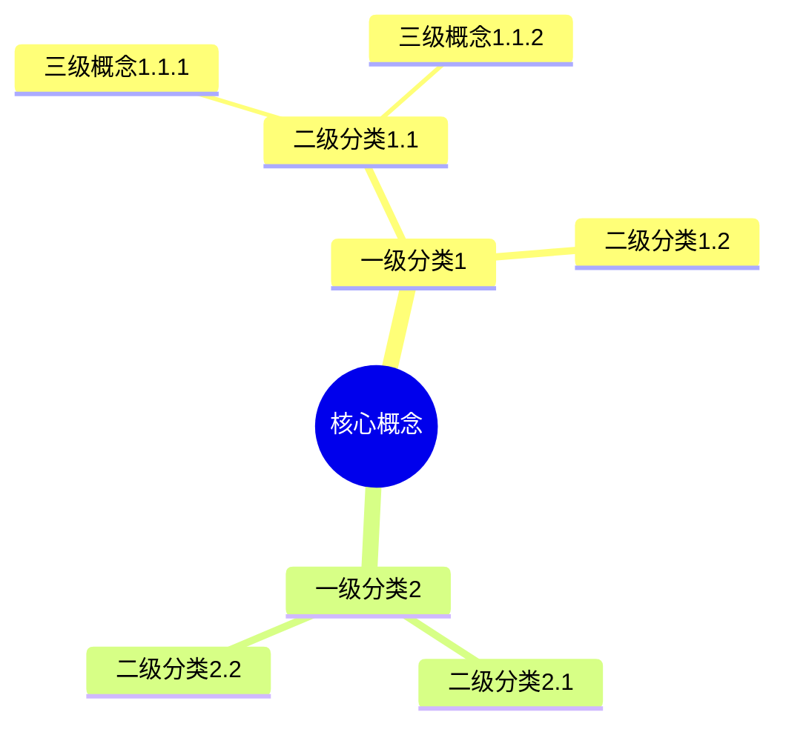
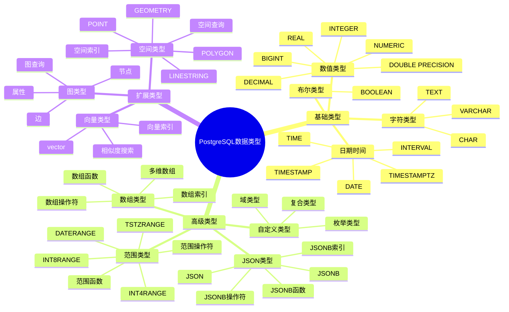
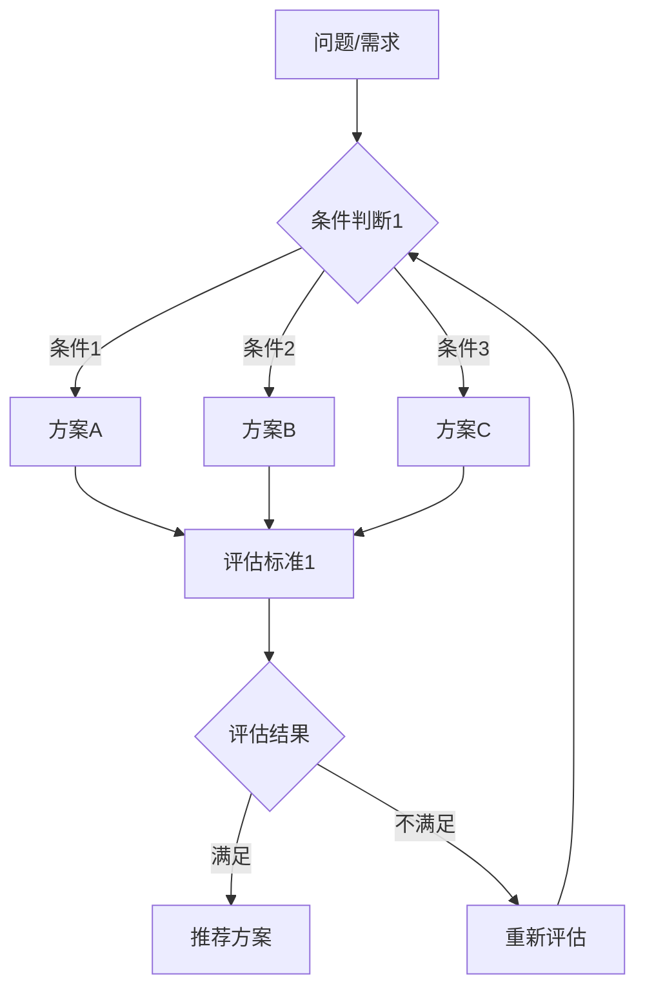
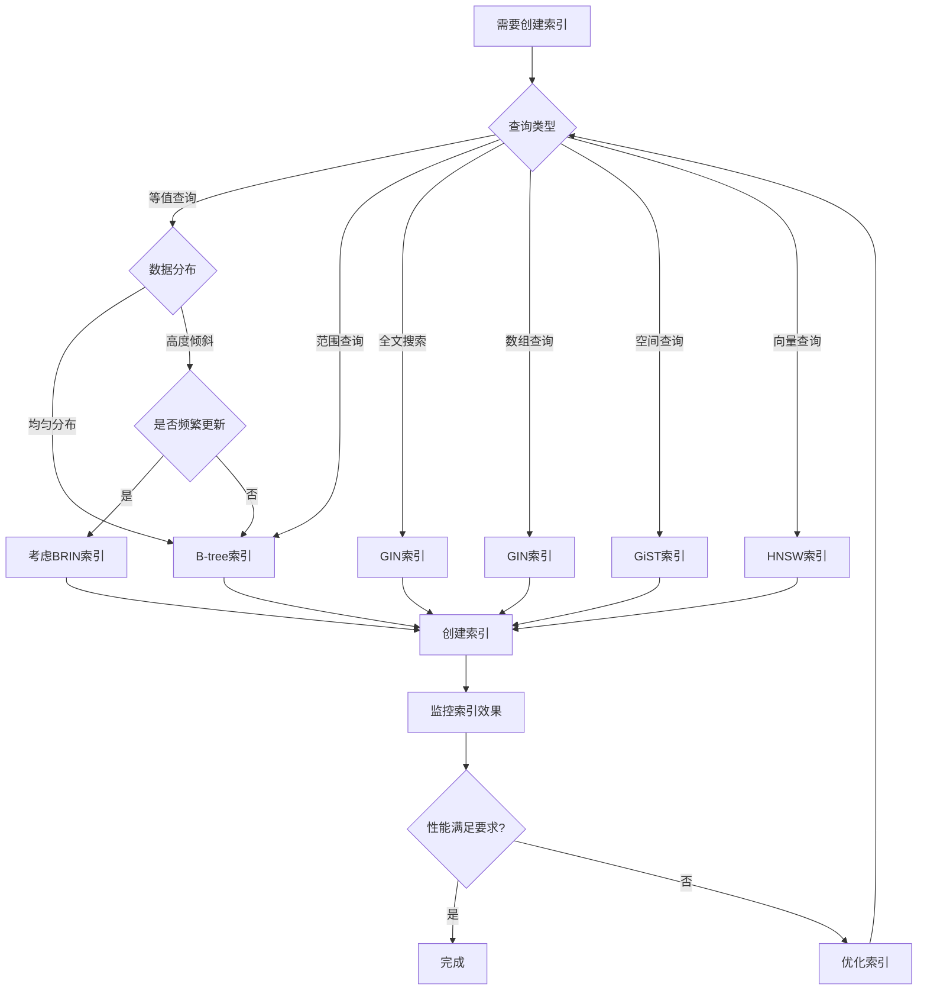
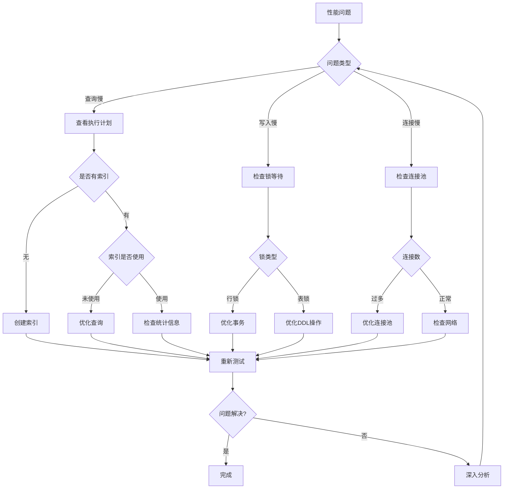

# PostgreSQL 培训文档思维表征方式应用指南

> **制定时间**: 2025年1月
> **指南版本**: v1.0
> **目标**: 规范思维表征方式的应用，提升文档质量

---

## 📋 概述

本文档详细说明如何在 PostgreSQL 培训文档中应用多种思维表征方式，包括思维导图、多维概念矩阵对比、形式化论证、论证过程和决策思维导图。

---

## 🎨 思维表征方式详解

### 1. 思维导图（Mind Map）

#### 1.1 应用场景

**知识体系梳理**：

- 模块知识体系总览
- 概念分类和层次关系
- 学习路径规划

**概念关系可视化**：

- 技术概念之间的关系
- 依赖关系和继承关系
- 组合关系和聚合关系

#### 1.2 制作规范

**Mermaid 格式示例**：



**内容要求**：

- 层次清晰：最多4层
- 节点命名：简洁明确
- 关系明确：使用连接线表示关系
- 完整性：覆盖主要概念

#### 1.3 应用示例

**数据类型体系思维导图**：



---

### 2. 多维概念矩阵对比（Multi-dimensional Concept Matrix）

#### 2.1 应用场景

**技术选型决策**：

- 不同技术方案的对比
- 不同配置的对比
- 不同版本的对比

**性能对比分析**：

- 不同算法的性能对比
- 不同索引的性能对比
- 不同配置的性能对比

#### 2.2 矩阵结构规范

**标准矩阵格式**：

| 对比维度 | 维度1 | 维度2 | 维度3 | 维度4 | 维度5 | 综合评分 |
|---------|------|------|------|------|------|---------|
| **方案A** | 值1 | 值2 | 值3 | 值4 | 值5 | 4.5/5 |
| **方案B** | 值1 | 值2 | 值3 | 值4 | 值5 | 4.2/5 |
| **方案C** | 值1 | 值2 | 值3 | 值4 | 值5 | 3.8/5 |

**评分标准**：

- ⭐⭐⭐⭐⭐ (5分)：优秀
- ⭐⭐⭐⭐ (4分)：良好
- ⭐⭐⭐ (3分)：一般
- ⭐⭐ (2分)：较差
- ⭐ (1分)：差

#### 2.3 应用示例

**索引类型选择矩阵**：

| 索引类型 | 查询性能 | 写入性能 | 存储空间 | 维护成本 | 适用场景 | 综合评分 |
|---------|---------|---------|---------|---------|---------|---------|
| **B-tree** | ⭐⭐⭐⭐⭐ | ⭐⭐⭐⭐⭐ | ⭐⭐⭐⭐ | ⭐⭐⭐⭐⭐ | 等值查询、范围查询 | 4.8/5 |
| **GIN** | ⭐⭐⭐⭐⭐ | ⭐⭐ | ⭐⭐ | ⭐⭐⭐ | 全文搜索、数组查询 | 3.5/5 |
| **GiST** | ⭐⭐⭐⭐ | ⭐⭐⭐ | ⭐⭐⭐ | ⭐⭐⭐ | 空间数据、范围类型 | 3.5/5 |
| **HNSW** | ⭐⭐⭐⭐⭐ | ⭐⭐⭐ | ⭐⭐ | ⭐⭐⭐ | 向量相似度搜索 | 3.8/5 |
| **BRIN** | ⭐⭐⭐ | ⭐⭐⭐⭐⭐ | ⭐⭐⭐⭐⭐ | ⭐⭐⭐⭐⭐ | 时序数据、大表 | 4.2/5 |

**数据类型选择矩阵**：

| 数据类型 | 存储效率 | 查询性能 | 功能丰富度 | 兼容性 | 适用场景 | 综合评分 |
|---------|---------|---------|----------|--------|---------|---------|
| **JSON** | ⭐⭐⭐ | ⭐⭐ | ⭐⭐⭐⭐ | ⭐⭐⭐⭐⭐ | 简单JSON存储 | 3.3/5 |
| **JSONB** | ⭐⭐⭐⭐ | ⭐⭐⭐⭐⭐ | ⭐⭐⭐⭐⭐ | ⭐⭐⭐⭐⭐ | 复杂JSON查询 | 4.6/5 |
| **TEXT** | ⭐⭐⭐⭐⭐ | ⭐⭐ | ⭐⭐ | ⭐⭐⭐⭐⭐ | 纯文本存储 | 3.5/5 |
| **数组** | ⭐⭐⭐⭐ | ⭐⭐⭐⭐ | ⭐⭐⭐ | ⭐⭐⭐⭐ | 固定结构数组 | 3.8/5 |

---

### 3. 概念定义属性关系形式化论证（Formal Definition and Proof）

#### 3.1 应用场景

**技术原理说明**：

- MVCC 机制原理
- 事务隔离级别实现
- 查询优化器算法

**算法解释**：

- 索引算法（B-tree、GIN、GiST）
- 查询优化算法
- 并发控制算法

#### 3.2 形式化论证结构

**标准格式**：

```text
## 3. 概念定义与形式化论证

### 3.1 概念定义

**定义 1（概念C）**：
设 C = {A₁, A₂, ..., Aₙ} 是一个概念，其中：
- A₁ 是属性1，类型为 T₁
- A₂ 是属性2，类型为 T₂
- ...
- Aₙ 是属性n，类型为 Tₙ

**属性关系**：
- A₁ → A₂ (关系类型：依赖/包含/等价)
- A₂ → A₃ (关系类型：...)

### 3.2 形式化证明

**定理 1**：关于概念C的性质

**前提条件**：
- P₁: 前提条件1
- P₂: 前提条件2
- ...

**证明过程**：
1. 步骤1：基于P₁和P₂，应用规则R₁，得到结论C₁
2. 步骤2：基于C₁和P₃，应用规则R₂，得到结论C₂
3. ...
4. 步骤n：基于Cₙ₋₁，应用规则Rₙ，得到最终结论C

**结论**：C成立

### 3.3 实际应用

**应用场景1**：
- 问题描述
- 应用形式化结论C
- 解决方案
- 效果评估

**应用场景2**：
- ...
```

#### 3.3 应用示例

**MVCC机制形式化论证**：

```text
## MVCC机制形式化论证

### 定义

**定义 1（事务）**：
设 T = {tid, start_time, commit_time, status} 是一个事务，其中：
- tid ∈ N：事务ID
- start_time ∈ R：开始时间
- commit_time ∈ R ∪ {∞}：提交时间
- status ∈ {active, committed, aborted}

**定义 2（元组版本）**：
设 V = {xmin, xmax, data} 是一个元组版本，其中：
- xmin ∈ N：创建该版本的事务ID
- xmax ∈ N ∪ {∞}：删除该版本的事务ID
- data：元组数据

**定义 3（可见性）**：
元组版本V对事务T可见，当且仅当：
- V.xmin ≤ T.tid < V.xmax
- T.tid能够看到V.xmin的提交状态

### 定理

**定理 1（MVCC一致性）**：
在MVCC机制下，每个事务看到的数据快照是一致的。

**证明**：
1. 每个事务在开始时获得一个唯一的事务ID
2. 每个元组版本记录创建和删除的事务ID
3. 可见性判断基于事务ID和提交状态
4. 因此，每个事务看到的数据快照是确定的、一致的

**结论**：MVCC机制保证了一致性
```

---

### 4. 充分的论证过程（Comprehensive Argumentation）

#### 4.1 应用场景

**技术选型论证**：

- 为什么选择这个技术方案
- 为什么这个方案优于其他方案
- 如何评估方案优劣

**性能优化论证**：

- 为什么这个优化有效
- 优化的理论依据
- 优化的实际效果

#### 4.2 论证结构规范

**标准论证结构**：

```text
## 4. 技术选型论证

### 4.1 问题定义

**问题描述**：
- 问题是什么
- 问题的影响范围
- 问题的严重程度

**问题原因分析**：
- 原因1：...
- 原因2：...
- 原因3：...

### 4.2 方案分析

**方案1：方案名称**
- **描述**：方案的具体内容
- **优点**：
  - 优点1：...
  - 优点2：...
- **缺点**：
  - 缺点1：...
  - 缺点2：...
- **适用场景**：...
- **性能数据**：...
- **成本分析**：...

**方案2：方案名称**
- ...

**方案3：方案名称**
- ...

### 4.3 对比分析

**性能对比**：

| 方案 | 指标1 | 指标2 | 指标3 | 综合性能 |
|------|------|------|------|---------|
| 方案1 | 值1 | 值2 | 值3 | 4.5/5 |
| 方案2 | 值1 | 值2 | 值3 | 4.2/5 |
| 方案3 | 值1 | 值2 | 值3 | 3.8/5 |

**成本对比**：
- 方案1：成本分析
- 方案2：成本分析
- 方案3：成本分析

**复杂度对比**：
- 方案1：复杂度分析
- 方案2：复杂度分析
- 方案3：复杂度分析

### 4.4 决策依据

**决策标准**：
- 标准1：权重30%
- 标准2：权重25%
- 标准3：权重25%
- 标准4：权重20%

**评分计算**：
- 方案1总分 = Σ(标准i评分 × 权重i)
- 方案2总分 = ...
- 方案3总分 = ...

### 4.5 结论与建议

**推荐方案**：方案X

**推荐理由**：
1. 理由1：...
2. 理由2：...
3. 理由3：...

**实施建议**：
- 建议1：...
- 建议2：...
- 建议3：...

**风险提示**：
- 风险1：...
- 风险2：...
- 风险3：...
```

#### 4.3 应用示例

**索引选择论证示例**：

```text
## 索引选择论证

### 问题定义

**问题**：查询性能慢，需要选择合适的索引类型

**查询特征**：
- 查询类型：等值查询、范围查询、全文搜索
- 数据量：1000万条记录
- 更新频率：低

### 方案分析

**方案1：B-tree索引**
- 优点：等值查询快、范围查询快、写入性能好
- 缺点：全文搜索不支持
- 性能数据：等值查询 < 1ms，范围查询 < 5ms
- 存储成本：中等

**方案2：GIN索引**
- 优点：全文搜索快、数组查询快
- 缺点：写入性能差、存储空间大
- 性能数据：全文搜索 < 10ms，写入慢10倍
- 存储成本：高

**方案3：组合索引（B-tree + GIN）**
- 优点：兼顾等值查询和全文搜索
- 缺点：存储成本高、维护复杂
- 性能数据：等值查询 < 1ms，全文搜索 < 10ms
- 存储成本：高

### 对比分析

| 方案 | 等值查询 | 范围查询 | 全文搜索 | 写入性能 | 存储成本 | 综合评分 |
|------|---------|---------|---------|---------|---------|---------|
| B-tree | ⭐⭐⭐⭐⭐ | ⭐⭐⭐⭐⭐ | ⭐ | ⭐⭐⭐⭐⭐ | ⭐⭐⭐⭐ | 4.0/5 |
| GIN | ⭐⭐ | ⭐ | ⭐⭐⭐⭐⭐ | ⭐⭐ | ⭐⭐ | 2.8/5 |
| 组合 | ⭐⭐⭐⭐⭐ | ⭐⭐⭐⭐⭐ | ⭐⭐⭐⭐⭐ | ⭐⭐⭐ | ⭐⭐ | 4.2/5 |

### 决策依据

**决策标准**：
- 查询性能：权重40%
- 写入性能：权重30%
- 存储成本：权重20%
- 维护复杂度：权重10%

**评分计算**：
- B-tree：4.0 × 0.4 + 5.0 × 0.3 + 4.0 × 0.2 + 5.0 × 0.1 = 4.3
- GIN：2.8 × 0.4 + 2.0 × 0.3 + 2.0 × 0.2 + 3.0 × 0.1 = 2.5
- 组合：4.2 × 0.4 + 3.0 × 0.3 + 2.0 × 0.2 + 3.0 × 0.1 = 3.4

### 结论与建议

**推荐方案**：B-tree索引

**推荐理由**：
1. 查询性能优秀，满足主要查询需求
2. 写入性能好，不影响数据更新
3. 存储成本适中
4. 维护简单

**实施建议**：
- 在主要查询字段上创建B-tree索引
- 如果后续需要全文搜索，再考虑添加GIN索引
- 定期监控索引使用情况
```

---

### 5. 决策思维导图（Decision Tree）

#### 5.1 应用场景

**问题诊断流程**：

- 性能问题诊断
- 故障排查流程
- 错误诊断流程

**方案选择流程**：

- 技术选型流程
- 架构设计流程
- 优化路径规划

#### 5.2 决策树格式规范

**Mermaid 流程图格式**：



**内容要求**：

- 条件明确：每个判断条件清晰
- 路径完整：覆盖所有可能路径
- 结果明确：每个路径都有明确结果
- 可操作性：决策流程可实际执行

#### 5.3 应用示例

**索引选择决策流程**：



**性能问题诊断流程**：



---

## 📋 文档模板

### 标准文档结构模板

```markdown
    # 文档标题

    > **更新时间**: YYYY年MM月DD日
    > **技术版本**: PostgreSQL XX+
    > **文档编号**: XX-XX-XX

    ## 📑 目录

    [自动生成]

    ---

    ## 1. 概述

    ### 1.1 技术背景
    - 技术背景说明
    - 应用场景
    - 核心价值

    ### 1.2 核心价值
    - 定量价值论证
    - 实际应用效果

    ### 1.3 知识体系思维导图

    ```mermaid
    mindmap
      root((核心概念))
        ...
    ```

    ---

    ## 2. 技术原理

    ### 2.1 概念定义（形式化）

    **定义 1（概念C）**：
    [形式化定义]

    **属性关系**：
    [属性关系说明]

    ### 2.2 工作原理（形式化论证）

    **定理 1**：关于概念C的性质

    **前提条件**：

    - P₁: ...
    - P₂: ...

    **证明过程**：

    1. 步骤1：...
    2. 步骤2：...
    3. ...

    **结论**：...

    ### 2.3 技术对比矩阵

    | 技术方案 | 维度1 | 维度2 | 维度3 | 综合评分 |
    |---------|------|------|------|---------|
    | 方案A | ⭐⭐⭐⭐⭐ | ⭐⭐⭐⭐ | ⭐⭐⭐⭐⭐ | 4.7/5 |
    | 方案B | ⭐⭐⭐⭐ | ⭐⭐⭐⭐⭐ | ⭐⭐⭐⭐ | 4.3/5 |

    ---

    ## 3. 实际应用

    ### 3.1 应用场景

    - 场景1：...
    - 场景2：...

    ### 3.2 代码示例

    ```sql
    -- 示例1：...
    ```

    ```python
    # 示例2：...
    ```

    ### 3.3 实际案例

    **案例：案例名称**

    - **业务背景**：...
    - **技术方案**：...
    - **实施过程**：...
    - **效果评估**：...

    ---

    ## 4. 决策指南

    ### 4.1 选型决策矩阵

    [多维矩阵对比]

    ### 4.2 决策思维导图

    ```mermaid
    flowchart TD
        A[问题] --> B{条件}
        ...
    ```

    ### 4.3 技术选型论证

    [完整的论证过程]

    ### 4.4 最佳实践

    **推荐做法**：

    - 做法1：...
    - 做法2：...

    **避免做法**：

    - 反模式1：...
    - 反模式2：...

    ---

    ## 5. 参考资料

    ### 5.1 官方文档

    - [文档链接](URL)

    ### 5.2 学术论文

    - [论文标题](URL)

    ### 5.3 技术博客

    - [博客标题](URL)

    ### 5.4 社区资源

    - [资源链接](URL)

    ---

    **最后更新**: YYYY年MM月DD日
    **维护者**: PostgreSQL Modern Team
    **文档编号**: XX-XX-XX

```

---

## ✅ 检查清单

### 每个文档必须包含

- [ ] **思维导图**：至少1个知识体系或概念关系图
- [ ] **多维矩阵**：至少1个技术对比或选型矩阵
- [ ] **形式化论证**：至少1个核心概念的形式化定义和论证
- [ ] **论证过程**：至少1个技术选型或优化的完整论证
- [ ] **决策思维导图**：至少1个问题诊断或方案选择流程
- [ ] **代码示例**：至少5个完整可运行的示例
- [ ] **实际案例**：至少1个真实应用案例
- [ ] **引用来源**：官方文档、论文、技术博客引用（至少5个）

---

**最后更新**: 2025年1月
**维护者**: PostgreSQL Modern Team
**指南版本**: v1.0
