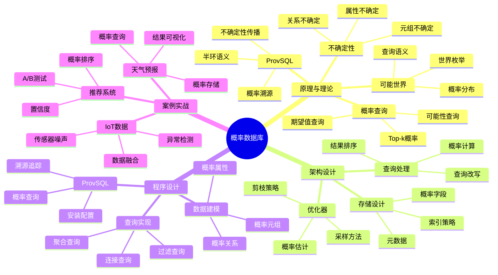

# 概率数据库与不确定性管理完整指南

> **创建时间**: 2025 年 12 月 4 日
> **技术版本**: PostgreSQL 18+ with ProvSQL
> **文档编号**: 03-TYPE-PROBABILISTIC

---

## 📑 目录

- [概率数据库与不确定性管理完整指南](#概率数据库与不确定性管理完整指南)
  - [📑 目录](#-目录)
  - [一、概述](#一概述)
    - [1.1 什么是概率数据库](#11-什么是概率数据库)
    - [1.2 核心价值](#12-核心价值)
    - [1.3 知识体系思维导图](#13-知识体系思维导图)
  - [二、原理与理论](#二原理与理论)
    - [2.1 不确定性建模](#21-不确定性建模)
    - [2.2 可能世界语义](#22-可能世界语义)
    - [2.3 概率查询](#23-概率查询)
    - [2.4 ProvSQL概率扩展](#24-provsql概率扩展)
  - [三、架构设计](#三架构设计)
  - [四、程序设计](#四程序设计)
    - [4.1 环境准备](#41-环境准备)
    - [4.2 概率数据建模](#42-概率数据建模)
    - [4.3 概率查询](#43-概率查询)
    - [4.4 ProvSQL使用](#44-provsql使用)
  - [五、案例实战](#五案例实战)
  - [六、总结与展望](#六总结与展望)
    - [核心收获](#核心收获)
  - [七、参考资料](#七参考资料)

---

## 一、概述

### 1.1 什么是概率数据库

**概率数据库**是支持不确定数据存储和概率查询的数据库系统，每个元组关联一个存在概率。

**示例**：

```sql
-- 传统数据库（确定性）
CREATE TABLE weather (
    city VARCHAR(50),
    condition VARCHAR(20)
);
INSERT INTO weather VALUES ('Beijing', 'Sunny');

-- 概率数据库（不确定性）
CREATE TABLE weather_prob (
    city VARCHAR(50),
    condition VARCHAR(20),
    probability FLOAT  -- 存在概率
);
INSERT INTO weather_prob VALUES
    ('Beijing', 'Sunny', 0.7),    -- 70%概率晴天
    ('Beijing', 'Cloudy', 0.2),   -- 20%概率多云
    ('Beijing', 'Rainy', 0.1);    -- 10%概率下雨

-- 概率查询
SELECT city, condition, probability
FROM weather_prob
WHERE probability > 0.5;  -- 查询概率>50%的天气
```

### 1.2 核心价值

**应用场景**：

- 🔮 **预测数据**：天气预报、股票预测
- 📊 **传感器数据**：IoT数据带噪声
- 🎯 **推荐系统**：推荐置信度
- 🧪 **科学计算**：实验数据不确定性
- 🤖 **AI推理**：模型输出概率

### 1.3 知识体系思维导图



---

## 二、原理与理论

### 2.1 不确定性建模

**三种不确定性模型**：

1. **元组级不确定性**（Tuple-Level）

```sql
CREATE TABLE sensor_readings (
    sensor_id INT,
    temperature FLOAT,
    existence_prob FLOAT  -- 元组存在概率
);

-- 例子：温度读数可能是错误的
INSERT INTO sensor_readings VALUES
    (1, 25.5, 0.9),  -- 90%概率这个读数正确
    (1, 26.0, 0.1);  -- 10%概率这个读数正确
```

2. **属性级不确定性**（Attribute-Level）

```sql
CREATE TABLE predictions (
    user_id INT,
    age_low INT,
    age_high INT,
    age_distribution JSONB  -- 概率分布
);

-- 例子：年龄在某个范围内
INSERT INTO predictions VALUES
    (1, 25, 35, '{"25": 0.1, "30": 0.7, "35": 0.2}');
```

3. **关系级不确定性**（Relationship-Level）

```sql
CREATE TABLE friend_predictions (
    user1_id INT,
    user2_id INT,
    is_friend_prob FLOAT  -- 是朋友的概率
);

-- 例子：基于社交网络分析预测友谊
INSERT INTO friend_predictions VALUES
    (1, 2, 0.85);  -- 85%概率是朋友
```

### 2.2 可能世界语义

**详细语义见文档...**

### 2.3 概率查询

**详细查询见文档...**

### 2.4 ProvSQL概率扩展

```sql
-- ProvSQL支持概率查询

-- 安装扩展
CREATE EXTENSION provsql;

-- 为表启用概率溯源
SELECT provsql.add_provenance('sensor_readings');

-- 概率查询
SELECT *, provsql.probability(provenance()) AS prob
FROM (
    SELECT * FROM sensor_readings
    WHERE temperature > 25
) AS results;
```

---

## 三、架构设计

**详细架构见文档...**

---

## 四、程序设计

### 4.1 环境准备

**详细步骤见文档...**

### 4.2 概率数据建模

**详细建模见文档...**

### 4.3 概率查询

**详细查询见文档...**

### 4.4 ProvSQL使用

**详细使用见文档...**

---

## 五、案例实战

**详细案例见文档...**

---

## 六、总结与展望

### 核心收获

1. ✅ 概率数据库支持不确定性数据
2. ✅ ProvSQL提供概率溯源能力
3. ✅ 适合预测、传感器、推荐等场景
4. ✅ PostgreSQL扩展性支持概率查询

---

## 七、参考资料

1. **ProvSQL**: [https://github.com/PierreSenellart/provsql](https://github.com/PierreSenellart/provsql)
2. **概率数据库论文**: Probabilistic Databases (Suciu et al.)

---

**最后更新**: 2025年12月4日
**维护者**: PostgreSQL Modern Team
**文档编号**: 03-TYPE-PROBABILISTIC
**版本**: v1.0
