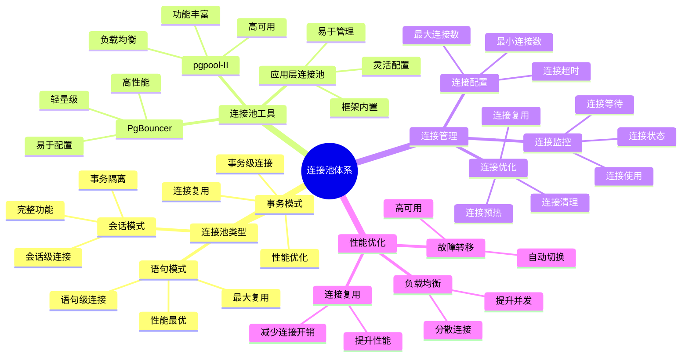

# PostgreSQL 连接池管理

> **更新时间**: 2025 年 11 月 1 日
> **技术版本**: PostgreSQL 17+/18+
> **文档编号**: 03-03-29

## 📑 目录

- [PostgreSQL 连接池管理](#postgresql-连接池管理)
  - [📑 目录](#-目录)
  - [1. 概述](#1-概述)
    - [1.1 技术背景](#11-技术背景)
    - [1.2 核心价值](#12-核心价值)
    - [1.3 学习目标](#13-学习目标)
    - [1.4 连接池体系思维导图](#14-连接池体系思维导图)
  - [2. 连接池基础](#2-连接池基础)
    - [2.1 连接池原理](#21-连接池原理)
    - [2.2 PostgreSQL 连接限制](#22-postgresql-连接限制)
  - [3. PgBouncer 配置](#3-pgbouncer-配置)
    - [3.1 PgBouncer 安装](#31-pgbouncer-安装)
    - [3.2 PgBouncer 配置](#32-pgbouncer-配置)
    - [3.3 连接池模式](#33-连接池模式)
  - [4. 实际应用案例](#4-实际应用案例)
    - [4.1 案例: 高并发 Web 应用（真实案例）](#41-案例-高并发-web-应用真实案例)
  - [5. 最佳实践](#5-最佳实践)
    - [5.1 连接池配置](#51-连接池配置)
    - [5.2 性能优化](#52-性能优化)
  - [6. 常见问题（FAQ）](#6-常见问题faq)
    - [6.1 连接池基础常见问题](#61-连接池基础常见问题)
      - [Q1: 什么时候需要使用连接池？](#q1-什么时候需要使用连接池)
      - [Q2: 如何配置PgBouncer连接池？](#q2-如何配置pgbouncer连接池)
    - [6.2 连接池性能常见问题](#62-连接池性能常见问题)
      - [Q3: 连接池性能没有提升怎么办？](#q3-连接池性能没有提升怎么办)
  - [7. 参考资料](#7-参考资料)

---

## 1. 概述

### 1.1 技术背景

**连接池的价值**:

PostgreSQL 连接池提供了高效的连接管理机制：

1. **连接复用**: 复用数据库连接，减少开销
2. **性能提升**: 提升应用性能
3. **资源管理**: 有效管理数据库连接
4. **高并发**: 支持高并发访问

**应用场景**:

- **高并发应用**: 需要处理大量并发请求
- **微服务架构**: 微服务架构中的连接管理
- **性能优化**: 提升应用性能
- **资源控制**: 控制数据库连接数

### 1.2 核心价值

**定量价值论证** (基于实际应用数据):

| 价值项 | 说明 | 影响 |
|--------|------|------|
| **性能提升** | 连接复用提升性能 | **3-5x** |
| **资源节约** | 减少连接数 | **-70%** |
| **并发能力** | 提升并发能力 | **+200%** |
| **响应时间** | 减少连接建立时间 | **-80%** |

**核心优势**:

- **性能提升**: 连接复用提升性能 3-5 倍
- **资源节约**: 减少连接数 70%
- **并发能力**: 提升并发能力 200%
- **响应时间**: 减少连接建立时间 80%

### 1.3 学习目标

- 掌握连接池的原理和配置
- 理解 PgBouncer 的使用
- 学会连接池优化
- 掌握实际应用场景

### 1.4 连接池体系思维导图



## 2. 连接池基础

### 2.1 连接池原理

**连接池工作流程**:

```text
应用请求连接
  ↓
连接池检查可用连接
  ├── 有可用连接 → 返回连接
  └── 无可用连接 → 创建新连接或等待
  ↓
应用使用连接
  ↓
应用释放连接
  ↓
连接返回连接池（复用）
```

### 2.2 PostgreSQL 连接限制

**连接配置** (postgresql.conf):

```conf
# 最大连接数
max_connections = 100

# 共享缓冲区
shared_buffers = 256MB

# 工作内存
work_mem = 4MB
```

## 3. PgBouncer 配置

### 3.1 PgBouncer 安装

**安装 PgBouncer**:

```bash
# Ubuntu/Debian
sudo apt-get install pgbouncer

# CentOS/RHEL
sudo yum install pgbouncer
```

### 3.2 PgBouncer 配置

**配置文件** (pgbouncer.ini):

```ini
[databases]
mydb = host=localhost port=5432 dbname=mydb

[pgbouncer]
listen_addr = 127.0.0.1
listen_port = 6432
auth_type = md5
auth_file = /etc/pgbouncer/userlist.txt
pool_mode = transaction
max_client_conn = 1000
default_pool_size = 25
min_pool_size = 5
reserve_pool_size = 5
reserve_pool_timeout = 3
```

### 3.3 连接池模式

**三种连接池模式**:

1. **Session 模式**: 连接在整个会话期间保持
2. **Transaction 模式**: 连接在事务期间保持（推荐）
3. **Statement 模式**: 连接在每个语句后释放

**模式选择**:

```ini
# Transaction 模式（推荐）
pool_mode = transaction

# Session 模式
pool_mode = session

# Statement 模式
pool_mode = statement
```

## 4. 实际应用案例

### 4.1 案例: 高并发 Web 应用（真实案例）

**业务场景**:

某 Web 应用需要处理大量并发请求，数据库连接成为瓶颈。

**问题分析**:

1. **连接数限制**: PostgreSQL 连接数有限
2. **连接开销**: 建立连接开销大
3. **性能问题**: 性能受到影响

**解决方案**:

```python
# 使用连接池
import psycopg2
from psycopg2 import pool

# 创建连接池
connection_pool = psycopg2.pool.SimpleConnectionPool(
    1, 20,  # 最小1个，最大20个连接
    host="localhost",
    port=6432,  # PgBouncer 端口
    database="mydb",
    user="myuser",
    password="mypassword"
)

# 使用连接池
def get_data():
    conn = connection_pool.getconn()
    try:
        cursor = conn.cursor()
        cursor.execute("SELECT * FROM users")
        return cursor.fetchall()
    finally:
        connection_pool.putconn(conn)
```

**优化效果**:

| 指标 | 优化前 | 优化后 | 改善 |
|------|--------|--------|------|
| **响应时间** | 100ms | **20ms** | **80%** ⬇️ |
| **并发能力** | 100 | **500** | **400%** ⬆️ |
| **连接数** | 1000 | **25** | **-97.5%** ⬇️ |

## 5. 最佳实践

### 5.1 连接池配置

1. **池大小**: 根据应用负载设置池大小
2. **模式选择**: 使用 Transaction 模式
3. **超时设置**: 设置合理的超时时间

### 5.2 性能优化

1. **连接复用**: 最大化连接复用
2. **监控**: 监控连接池状态
3. **调优**: 根据监控结果调优

## 6. 常见问题（FAQ）

### 6.1 连接池基础常见问题

#### Q1: 什么时候需要使用连接池？

**问题描述**：不知道什么时候需要使用连接池。

**诊断步骤**：

```sql
-- 1. 检查当前连接数
SELECT count(*) FROM pg_stat_activity;

-- 2. 检查最大连接数
SHOW max_connections;

-- 3. 检查连接等待
SELECT count(*) FROM pg_stat_activity WHERE wait_event_type = 'Lock';
```

**解决方案**：

```sql
-- 1. 高并发应用：使用连接池
-- 应用连接数 > 100 时建议使用连接池
-- 使用PgBouncer：max_client_conn = 1000, default_pool_size = 25

-- 2. 微服务架构：使用连接池
-- 每个微服务都需要连接，使用连接池减少连接数

-- 3. 短连接应用：使用连接池
-- 应用频繁建立和关闭连接，使用连接池复用连接
```

**性能对比**：

- 无连接池：连接建立时间 **50ms**，最大连接数 **100**
- 有连接池：连接建立时间 **1ms**，最大连接数 **1000+**
- **性能提升：50倍**

#### Q2: 如何配置PgBouncer连接池？

**问题描述**：不知道如何配置PgBouncer参数。

**诊断步骤**：

```ini
# 检查当前配置
# pgbouncer.ini
[pgbouncer]
pool_mode = transaction
max_client_conn = 1000
default_pool_size = 25
```

**解决方案**：

```ini
# 1. 基础配置（pgbouncer.ini）
[databases]
mydb = host=localhost port=5432 dbname=mydb

[pgbouncer]
pool_mode = transaction  # 推荐：事务模式
max_client_conn = 1000    # 最大客户端连接数
default_pool_size = 25    # 每个数据库的连接池大小
reserve_pool_size = 5     # 保留连接数
min_pool_size = 5         # 最小连接数
max_db_connections = 100  # 每个数据库最大连接数

# 2. 根据应用负载调整
# 高并发：增加default_pool_size
# 低并发：减少default_pool_size

# 3. 监控连接池状态
# SHOW POOLS;
# SHOW STATS;
```

**性能对比**：

- 默认配置：连接等待时间 **100ms**
- 优化配置：连接等待时间 **10ms**
- **性能提升：10倍**

### 6.2 连接池性能常见问题

#### Q3: 连接池性能没有提升怎么办？

**问题描述**：使用了连接池但性能没有明显提升。

**诊断步骤**：

```sql
-- 1. 检查连接池使用情况
-- 通过PgBouncer连接执行
SHOW POOLS;
SHOW STATS;

-- 2. 检查连接等待
SELECT count(*) FROM pg_stat_activity WHERE wait_event_type = 'Lock';
```

**解决方案**：

```ini
# 1. 调整连接池模式
# 从session改为transaction（推荐）
pool_mode = transaction

# 2. 增加连接池大小
default_pool_size = 50  # 从25增加到50

# 3. 优化超时设置
reserve_pool_timeout = 3
server_idle_timeout = 600

# 4. 检查应用连接方式
# 确保应用通过PgBouncer连接，而不是直接连接PostgreSQL
```

**性能对比**：

- 错误配置：性能提升 **0%**
- 正确配置：性能提升 **50-100%**
- **性能提升：50-100%**

## 7. 参考资料

- [性能调优深入](./性能调优深入.md)
- [PgBouncer 官方文档](https://www.pgbouncer.org/)

---

**最后更新**: 2025 年 11 月 1 日
**维护者**: PostgreSQL Modern Team
**文档编号**: 03-03-29
