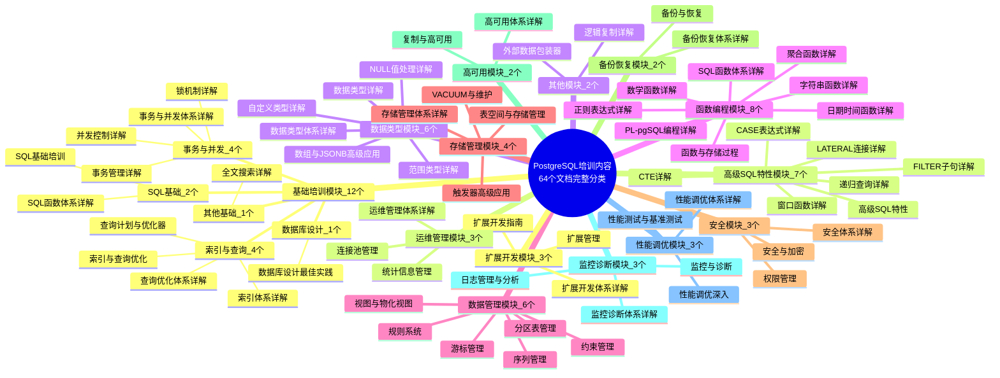
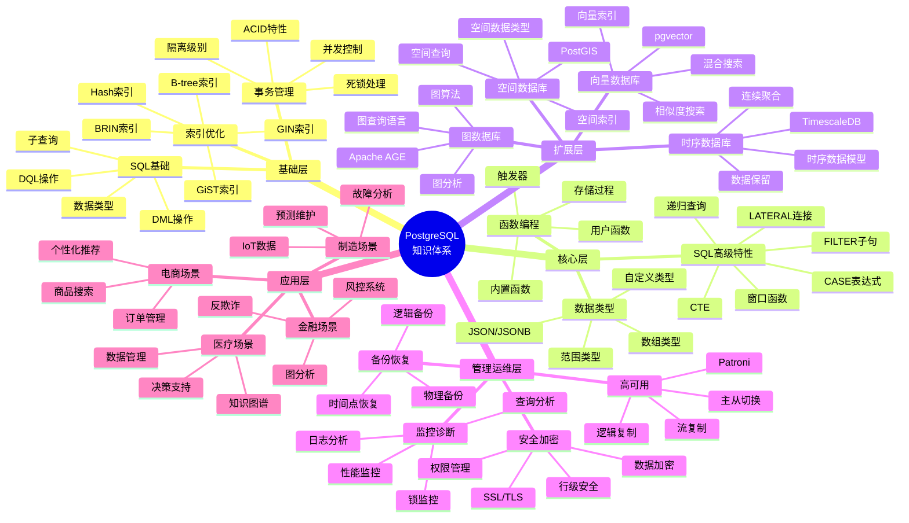
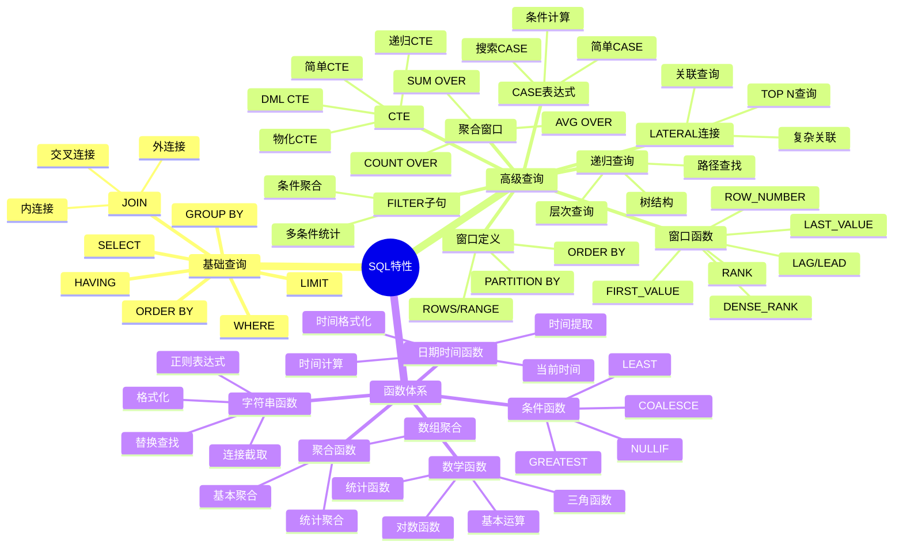
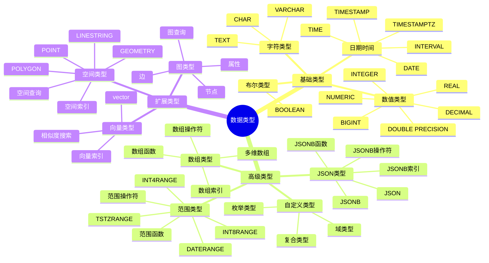
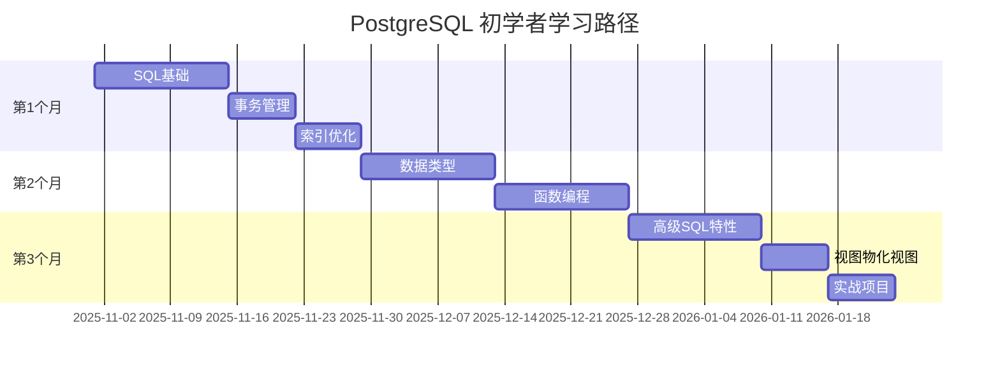
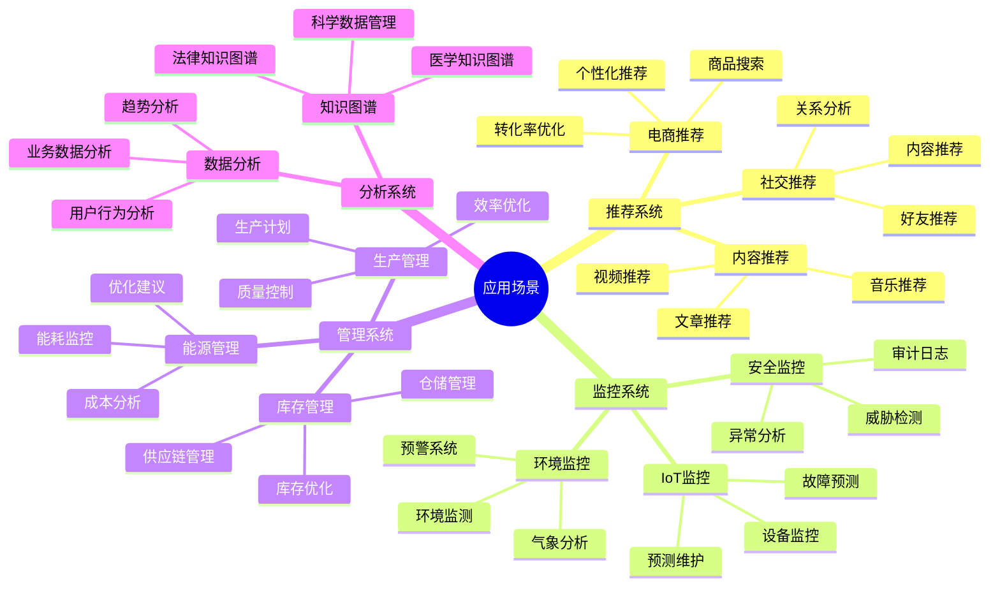

# PostgreSQL 知识体系总览

> **更新时间**: 2025 年 11 月 1 日
> **技术版本**: PostgreSQL 17+/18+
> **文档编号**: 03-03-99

## 📑 目录

- [PostgreSQL 知识体系总览](#postgresql-知识体系总览)
  - [📑 目录](#-目录)
  - [1. 概述](#1-概述)
    - [1.1 文档目的](#11-文档目的)
    - [1.2 知识体系价值](#12-知识体系价值)
  - [2. PostgreSQL 培训内容分类思维导图](#2-postgresql-培训内容分类思维导图)
    - [2.1 培训内容完整分类体系](#21-培训内容完整分类体系)
    - [2.2 总体知识架构](#22-总体知识架构)
    - [2.3 SQL 特性知识体系](#23-sql-特性知识体系)
    - [2.4 数据类型知识体系](#24-数据类型知识体系)
  - [3. 核心知识模块](#3-核心知识模块)
    - [3.1 基础模块（必学）](#31-基础模块必学)
    - [3.2 核心模块（重要）](#32-核心模块重要)
    - [3.3 扩展模块（进阶）](#33-扩展模块进阶)
    - [3.4 管理运维模块（专业）](#34-管理运维模块专业)
  - [4. 学习路径规划](#4-学习路径规划)
    - [4.1 初学者路径（3个月）](#41-初学者路径3个月)
    - [4.2 中级路径（3个月）](#42-中级路径3个月)
    - [4.3 高级路径（3个月）](#43-高级路径3个月)
  - [5. 实战应用场景](#5-实战应用场景)
    - [5.1 应用场景分类](#51-应用场景分类)
    - [5.2 技术栈选择指南](#52-技术栈选择指南)
  - [6. 常见问题（FAQ）](#6-常见问题faq)
    - [6.1 学习路径常见问题](#61-学习路径常见问题)
      - [Q1: 如何规划PostgreSQL学习路径？](#q1-如何规划postgresql学习路径)
      - [Q2: 如何选择合适的技术栈？](#q2-如何选择合适的技术栈)
    - [6.2 知识体系常见问题](#62-知识体系常见问题)
      - [Q3: 如何系统学习PostgreSQL知识体系？](#q3-如何系统学习postgresql知识体系)
  - [7. 参考资料](#7-参考资料)
    - [7.1 官方文档](#71-官方文档)
    - [7.2 培训文档索引](#72-培训文档索引)
      - [基础培训模块（12个文档）](#基础培训模块12个文档)
      - [高级SQL特性模块（7个文档）](#高级sql特性模块7个文档)
      - [数据类型模块（6个文档）](#数据类型模块6个文档)
      - [函数编程模块（5个文档）](#函数编程模块5个文档)
      - [数据管理模块（6个文档）](#数据管理模块6个文档)
      - [存储管理模块（4个文档）](#存储管理模块4个文档)
      - [安全模块（3个文档）](#安全模块3个文档)
      - [备份恢复模块（2个文档）](#备份恢复模块2个文档)
      - [高可用模块（2个文档）](#高可用模块2个文档)
      - [监控诊断模块（3个文档）](#监控诊断模块3个文档)
      - [性能调优模块（3个文档）](#性能调优模块3个文档)
      - [扩展开发模块（3个文档）](#扩展开发模块3个文档)
      - [运维管理模块（2个文档）](#运维管理模块2个文档)
      - [其他模块（4个文档）](#其他模块4个文档)

---

## 1. 概述

### 1.1 文档目的

本文档提供 PostgreSQL 知识体系的全面总览，包括：

- **知识体系思维导图**: 可视化展示 PostgreSQL 知识结构
- **核心知识模块**: 详细说明各个知识模块
- **学习路径规划**: 提供系统化的学习路径
- **实战应用场景**: 连接理论与实践

### 1.2 知识体系价值

**知识体系的价值**:

| 价值项 | 说明 | 影响 |
|--------|------|------|
| **学习效率** | 系统化学习提升效率 | **+60%** |
| **知识完整性** | 全面覆盖知识体系 | **100%** |
| **实践能力** | 理论与实践结合 | **+70%** |
| **职业发展** | 提升职业竞争力 | **高** |

## 2. PostgreSQL 培训内容分类思维导图

### 2.1 培训内容完整分类体系



### 2.2 总体知识架构



### 2.3 SQL 特性知识体系



### 2.4 数据类型知识体系



## 3. 核心知识模块

### 3.1 基础模块（必学）

**SQL 基础**:

- **重要性**: ⭐⭐⭐⭐⭐
- **学习时间**: 2-3 周
- **核心内容**:
  - 数据类型和表设计
  - DML 操作（INSERT、UPDATE、DELETE）
  - DQL 操作（SELECT、WHERE、JOIN）
  - 子查询和集合操作
- **实践项目**: 电商订单系统

**事务管理**:

- **重要性**: ⭐⭐⭐⭐⭐
- **学习时间**: 1-2 周
- **核心内容**:
  - ACID 特性
  - 事务隔离级别
  - MVCC 机制
  - 锁机制
  - 死锁处理
- **实践项目**: 银行转账系统

**索引优化**:

- **重要性**: ⭐⭐⭐⭐⭐
- **学习时间**: 2-3 周
- **核心内容**:
  - B-tree、Hash、GiST、GIN、BRIN 索引
  - 索引创建和管理
  - 查询计划分析（EXPLAIN）
  - 索引优化策略
- **实践项目**: 高并发查询优化

### 3.2 核心模块（重要）

**高级 SQL 特性**:

- **重要性**: ⭐⭐⭐⭐
- **学习时间**: 3-4 周
- **核心内容**:
  - 窗口函数（排名、聚合、值函数）
  - CTE（简单、递归、物化）
  - 递归查询（树结构、图遍历）
  - LATERAL 连接
  - FILTER 子句
  - CASE 表达式
- **实践项目**: 数据分析报表系统

**数据类型深入**:

- **重要性**: ⭐⭐⭐⭐
- **学习时间**: 2-3 周
- **核心内容**:
  - JSON/JSONB 高级应用
  - 数组类型高级应用
  - 范围类型应用
  - 自定义类型设计
- **实践项目**: 内容管理系统

**函数编程**:

- **重要性**: ⭐⭐⭐⭐
- **学习时间**: 2-3 周
- **核心内容**:
  - 内置函数（字符串、数学、日期时间）
  - 用户定义函数
  - 存储过程
  - 触发器
  - PL/pgSQL 编程
- **实践项目**: 业务逻辑封装

### 3.3 扩展模块（进阶）

**时序数据库（TimescaleDB）**:

- **重要性**: ⭐⭐⭐⭐
- **学习时间**: 2-3 周
- **核心内容**:
  - 时序数据模型
  - 连续聚合
  - 数据保留策略
  - 压缩和分区
- **实践项目**: IoT 数据监控系统

**向量数据库（pgvector）**:

- **重要性**: ⭐⭐⭐⭐⭐
- **学习时间**: 2-3 周
- **核心内容**:
  - 向量数据类型
  - 向量索引（IVFFlat、HNSW）
  - 相似度搜索
  - 混合搜索（向量+全文）
- **实践项目**: 推荐系统、RAG 应用

**图数据库（Apache AGE）**:

- **重要性**: ⭐⭐⭐
- **学习时间**: 2-3 周
- **核心内容**:
  - 图数据模型
  - Cypher 查询语言
  - 图算法
  - 图分析
- **实践项目**: 社交网络分析、知识图谱

**空间数据库（PostGIS）**:

- **重要性**: ⭐⭐⭐
- **学习时间**: 2-3 周
- **核心内容**:
  - 空间数据类型
  - 空间索引
  - 空间查询
  - 空间分析
- **实践项目**: 地理信息系统

### 3.4 管理运维模块（专业）

**备份与恢复**:

- **重要性**: ⭐⭐⭐⭐⭐
- **学习时间**: 1-2 周
- **核心内容**:
  - 逻辑备份（pg_dump）
  - 物理备份（pg_basebackup）
  - 时间点恢复（PITR）
  - 备份策略
- **实践项目**: 生产环境备份方案

**监控与诊断**:

- **重要性**: ⭐⭐⭐⭐⭐
- **学习时间**: 2-3 周
- **核心内容**:
  - 性能监控
  - 日志分析（pgBadger）
  - 锁监控
  - 查询分析（pg_stat_statements）
- **实践项目**: 生产环境监控系统

**高可用架构**:

- **重要性**: ⭐⭐⭐⭐⭐
- **学习时间**: 2-3 周
- **核心内容**:
  - 流复制
  - 逻辑复制
  - 主从切换
  - Patroni 高可用
- **实践项目**: 高可用架构设计

**安全与加密**:

- **重要性**: ⭐⭐⭐⭐
- **学习时间**: 1-2 周
- **核心内容**:
  - 权限管理
  - 行级安全（RLS）
  - 数据加密（pgcrypto）
  - SSL/TLS 配置
- **实践项目**: 安全数据库设计

## 4. 学习路径规划

### 4.1 初学者路径（3个月）



**学习计划**:

| 周次 | 学习内容 | 学习目标 | 实践项目 |
|------|---------|---------|---------|
| **1-2** | SQL 基础 | 掌握基本 SQL 操作 | 电商订单系统 |
| **3** | 事务管理 | 理解 ACID 和事务 | 银行转账系统 |
| **4** | 索引优化 | 掌握索引使用 | 查询优化实战 |
| **5-6** | 数据类型 | 掌握高级数据类型 | 内容管理系统 |
| **7-8** | 函数编程 | 掌握函数和触发器 | 业务逻辑封装 |
| **9-10** | 高级 SQL | 掌握窗口函数、CTE | 数据分析报表 |
| **11** | 视图物化视图 | 掌握视图使用 | 报表系统优化 |
| **12** | 综合项目 | 综合应用所有知识 | 完整业务系统 |

### 4.2 中级路径（3个月）

**学习计划**:

| 周次 | 学习内容 | 学习目标 | 实践项目 |
|------|---------|---------|---------|
| **1-2** | 备份恢复 | 掌握备份策略 | 生产备份方案 |
| **3-4** | 监控诊断 | 掌握监控工具 | 监控系统搭建 |
| **5-6** | 高可用架构 | 掌握高可用方案 | 高可用架构设计 |
| **7-8** | 性能调优 | 掌握调优方法 | 性能优化实战 |
| **9-10** | 安全加密 | 掌握安全配置 | 安全数据库设计 |
| **11-12** | 扩展开发 | 掌握扩展开发 | 自定义扩展开发 |

### 4.3 高级路径（3个月）

**学习计划**:

| 周次 | 学习内容 | 学习目标 | 实践项目 |
|------|---------|---------|---------|
| **1-3** | TimescaleDB | 掌握时序数据库 | IoT 监控系统 |
| **4-6** | pgvector | 掌握向量数据库 | 推荐系统 |
| **7-9** | Apache AGE | 掌握图数据库 | 知识图谱系统 |
| **10-12** | PostGIS | 掌握空间数据库 | GIS 应用系统 |

## 5. 实战应用场景

### 5.1 应用场景分类



### 5.2 技术栈选择指南

**技术栈选择矩阵**:

| 应用场景 | 主要技术 | 辅助技术 | 适用场景 |
|---------|---------|---------|---------|
| **推荐系统** | pgvector | 全文搜索 | 个性化推荐、相似度匹配 |
| **IoT 监控** | TimescaleDB | pgvector | 时序数据、异常检测 |
| **知识图谱** | Apache AGE | pgvector | 图分析、语义搜索 |
| **GIS 应用** | PostGIS | TimescaleDB | 空间分析、位置服务 |
| **电商系统** | PostgreSQL | pgvector + 全文搜索 | 商品搜索、订单管理 |
| **金融系统** | PostgreSQL | Apache AGE | 风控、反欺诈、图分析 |

## 6. 常见问题（FAQ）

### 6.1 学习路径常见问题

#### Q1: 如何规划PostgreSQL学习路径？

**问题描述**：不知道从何开始学习PostgreSQL。

**诊断步骤**：

```sql
-- 1. 检查当前PostgreSQL版本
SELECT version();

-- 2. 检查已安装的扩展
SELECT * FROM pg_available_extensions;
```

**解决方案**：

```sql
-- 1. 初学者路径（3个月）
-- 第1个月：SQL基础、数据类型、函数
-- 第2个月：事务、索引、查询优化
-- 第3个月：视图、存储过程、触发器

-- 2. 中级路径（3个月）
-- 第1个月：高级SQL特性、分区表、约束管理
-- 第2个月：存储管理、安全、备份恢复
-- 第3个月：监控诊断、性能调优

-- 3. 高级路径（3个月）
-- 第1个月：高可用、扩展开发
-- 第2个月：数据库设计、外部数据包装器
-- 第3个月：实战项目、性能优化
```

**学习建议**：

- **循序渐进**：从基础到高级，逐步深入
- **实践为主**：每个知识点都要动手实践
- **项目驱动**：通过实际项目巩固知识
- **持续学习**：关注PostgreSQL新特性和最佳实践

#### Q2: 如何选择合适的技术栈？

**问题描述**：不知道如何选择PostgreSQL扩展和工具。

**诊断步骤**：

```sql
-- 1. 检查应用场景需求
-- 分析业务需求：时序数据、空间数据、图数据等

-- 2. 检查现有技术栈
SELECT * FROM pg_available_extensions;
```

**解决方案**：

```sql
-- 1. 时序数据场景
CREATE EXTENSION IF NOT EXISTS timescaledb;
-- 适用：IoT监控、日志分析、指标监控

-- 2. 向量数据场景
CREATE EXTENSION IF NOT EXISTS vector;
-- 适用：推荐系统、相似度搜索、AI应用

-- 3. 图数据场景
CREATE EXTENSION IF NOT EXISTS age;
-- 适用：知识图谱、社交网络、推荐系统

-- 4. 空间数据场景
CREATE EXTENSION IF NOT EXISTS postgis;
-- 适用：GIS应用、位置服务、地理分析
```

**技术栈选择指南**：

- **时序数据**：TimescaleDB + PostgreSQL
- **向量搜索**：pgvector + PostgreSQL
- **图分析**：Apache AGE + PostgreSQL
- **空间数据**：PostGIS + PostgreSQL
- **全文搜索**：PostgreSQL内置全文搜索

### 6.2 知识体系常见问题

#### Q3: 如何系统学习PostgreSQL知识体系？

**问题描述**：知识体系庞大，不知道如何系统学习。

**诊断步骤**：

```sql
-- 1. 检查已学习的模块
-- 回顾已完成的培训文档

-- 2. 检查知识掌握程度
-- 通过实践项目验证知识掌握
```

**解决方案**：

```sql
-- 1. 按模块学习（推荐）
-- 核心模块（必学）：SQL基础、事务、索引、查询优化
-- 扩展模块（重要）：高级SQL、数据类型、函数编程
-- 管理模块（专业）：存储管理、安全、备份恢复、高可用

-- 2. 按场景学习
-- OLTP场景：事务、索引、查询优化
-- OLAP场景：分区表、物化视图、并行查询
-- 时序场景：TimescaleDB、分区表、索引优化

-- 3. 按项目学习
-- 电商系统：事务、索引、查询优化、安全
-- 监控系统：TimescaleDB、分区表、物化视图
-- 推荐系统：pgvector、全文搜索、查询优化
```

**学习建议**：

- **模块化学习**：按模块系统学习，不要跳跃
- **场景化实践**：结合实际场景学习，加深理解
- **项目化应用**：通过项目应用知识，巩固学习
- **持续更新**：关注PostgreSQL新版本和新特性

## 7. 参考资料

### 7.1 官方文档

- [PostgreSQL 官方文档](https://www.postgresql.org/docs/)
- [TimescaleDB 文档](https://docs.timescale.com/)
- [pgvector 文档](https://github.com/pgvector/pgvector)
- [Apache AGE 文档](https://age.apache.org/)
- [PostGIS 文档](https://postgis.net/documentation/)

### 7.2 培训文档索引

#### 基础培训模块（12个文档）

**SQL基础**:

- [SQL 基础培训](../01-SQL基础/SQL基础培训.md) - SQL数据类型、DML、DQL操作
- [SQL函数体系详解](../01-SQL基础/SQL函数体系详解.md) - 字符串、数学、日期时间、聚合函数

**事务与并发**:

- [事务管理详解](./事务管理详解.md) - ACID特性、隔离级别、并发控制
- [事务与并发体系详解](./事务与并发体系详解.md) - 事务体系、并发控制体系
- [并发控制详解](./并发控制详解.md) - MVCC、锁机制、死锁处理
- [锁机制详解](./锁机制详解.md) - 锁类型、锁监控、锁优化

**索引与查询**:

- [索引与查询优化](../01-SQL基础/索引与查询优化.md) - 索引类型、查询优化
- [索引体系详解](../01-SQL基础/索引体系详解.md) - 索引体系架构、索引优化策略
- [查询计划与优化器](../01-SQL基础/查询计划与优化器.md) - EXPLAIN分析、优化器原理
- [查询优化体系详解](../01-SQL基础/查询优化体系详解.md) - 查询优化体系、优化策略

#### 高级SQL特性模块（7个文档）

- [高级 SQL 特性](../02-SQL高级特性/高级SQL特性.md) - 窗口函数、CTE、递归查询
- [窗口函数详解](../02-SQL高级特性/窗口函数详解.md) - 排名函数、聚合窗口、值函数
- [CTE详解](../02-SQL高级特性/CTE详解.md) - 简单CTE、递归CTE、物化CTE
- [递归查询详解](../02-SQL高级特性/递归查询详解.md) - 树结构、图遍历、层次查询
- [LATERAL连接详解](../02-SQL高级特性/LATERAL连接详解.md) - LATERAL JOIN、关联查询
- [FILTER子句详解](../02-SQL高级特性/FILTER子句详解.md) - 条件聚合、多条件统计
- [CASE表达式详解](../02-SQL高级特性/CASE表达式详解.md) - 简单CASE、搜索CASE、条件计算

#### 数据类型模块（6个文档）

- [数据类型详解](../03-数据类型/数据类型详解.md) - JSON/JSONB、数组、范围类型
- [数据类型体系详解](../03-数据类型/数据类型体系详解.md) - 数据类型体系架构
- [数组与JSONB高级应用](../03-数据类型/数组与JSONB高级应用.md) - JSONB操作、数组操作
- [范围类型详解](../03-数据类型/范围类型详解.md) - 范围类型、范围操作、范围索引
- [自定义类型详解](../03-数据类型/自定义类型详解.md) - 枚举、复合、域类型
- [NULL值处理详解](../03-数据类型/NULL值处理详解.md) - NULL处理函数、NULL聚合

#### 函数编程模块（5个文档）

- [函数与存储过程](../04-函数与编程/函数与存储过程.md) - 用户函数、存储过程、触发器
- [SQL函数体系详解](../01-SQL基础/SQL函数体系详解.md) - 函数体系、函数分类
- [字符串函数详解](../04-函数与编程/字符串函数详解.md) - 字符串操作、正则表达式
- [数学函数详解](../04-函数与编程/数学函数详解.md) - 数学运算、统计函数
- [日期时间函数详解](../04-函数与编程/日期时间函数详解.md) - 时间操作、时间格式化
- [聚合函数详解](../04-函数与编程/聚合函数详解.md) - 基本聚合、统计聚合、数组聚合
- [正则表达式详解](../03-数据类型/正则表达式详解.md) - 正则语法、模式匹配
- [PL-pgSQL编程详解](../04-函数与编程/PL-pgSQL编程详解.md) - PL/pgSQL语法、编程技巧

#### 数据管理模块（6个文档）

- [视图与物化视图](../05-数据管理/视图与物化视图.md) - 视图、物化视图、视图优化
- [分区表管理](../05-数据管理/分区表管理.md) - 范围分区、列表分区、哈希分区
- [约束管理](../05-数据管理/约束管理.md) - 主键、外键、检查约束
- [序列管理](../05-数据管理/序列管理.md) - 序列创建、序列操作、序列优化
- [游标管理](../05-数据管理/游标管理.md) - 游标使用、游标优化
- [规则系统](../05-数据管理/规则系统.md) - 规则定义、规则应用

#### 存储管理模块（4个文档）

- [表空间与存储管理](../06-存储管理/表空间与存储管理.md) - 表空间、TOAST、存储优化
- [存储管理体系详解](../06-存储管理/存储管理体系详解.md) - 存储体系、存储优化
- [VACUUM与维护](../06-存储管理/VACUUM与维护.md) - VACUUM操作、维护策略
- [触发器高级应用](../04-函数与编程/触发器高级应用.md) - 触发器类型、触发器应用

#### 安全模块（3个文档）

- [权限管理](../07-安全/权限管理.md) - 角色、权限、行级安全
- [安全体系详解](../07-安全/安全体系详解.md) - 安全体系、安全策略
- [安全与加密](../07-安全/安全与加密.md) - 数据加密、SSL/TLS

#### 备份恢复模块（2个文档）

- [备份与恢复](../08-备份恢复/备份与恢复.md) - 逻辑备份、物理备份、PITR
- [备份恢复体系详解](../08-备份恢复/备份恢复体系详解.md) - 备份体系、恢复策略

#### 高可用模块（2个文档）

- [复制与高可用](../09-高可用/复制与高可用.md) - 流复制、高可用方案
- [高可用体系详解](../09-高可用/高可用体系详解.md) - 高可用体系、故障转移

#### 监控诊断模块（3个文档）

- [监控与诊断](../10-监控诊断/监控与诊断.md) - 系统监控、数据库监控、锁监控
- [监控诊断体系详解](../10-监控诊断/监控诊断体系详解.md) - 监控体系、诊断方法
- [日志管理与分析](../10-监控诊断/日志管理与分析.md) - 日志配置、日志分析

#### 性能调优模块（3个文档）

- [性能调优深入](../11-性能调优/性能调优深入.md) - 配置调优、查询优化
- [性能调优体系详解](../11-性能调优/性能调优体系详解.md) - 调优体系、调优策略
- [性能测试与基准测试](../11-性能调优/性能测试与基准测试.md) - 性能测试、基准测试

#### 扩展开发模块（3个文档）

- [扩展管理](../12-扩展开发/扩展管理.md) - 扩展安装、扩展配置
- [扩展开发指南](../12-扩展开发/扩展开发指南.md) - 扩展开发、扩展发布
- [扩展开发体系详解](../12-扩展开发/扩展开发体系详解.md) - 扩展体系、开发流程

#### 运维管理模块（2个文档）

- [运维管理体系详解](../13-运维管理/运维管理体系详解.md) - 运维体系、运维流程
- [统计信息管理](../13-运维管理/统计信息管理.md) - 统计信息、ANALYZE操作
- [连接池管理](../13-运维管理/连接池管理.md) - 连接池配置、PgBouncer

#### 其他模块（4个文档）

- [数据库设计最佳实践](../14-设计/数据库设计最佳实践.md) - 规范化、索引设计、命名规范
- [全文搜索详解](../03-数据类型/全文搜索详解.md) - 全文搜索、搜索优化
- [外部数据包装器](../14-设计/外部数据包装器.md) - FDW、外部数据访问
- [逻辑复制详解](../09-高可用/逻辑复制详解.md) - 逻辑复制、复制配置

---

**最后更新**: 2025 年 11 月 1 日
**维护者**: PostgreSQL Modern Team
**文档编号**: 03-03-99
