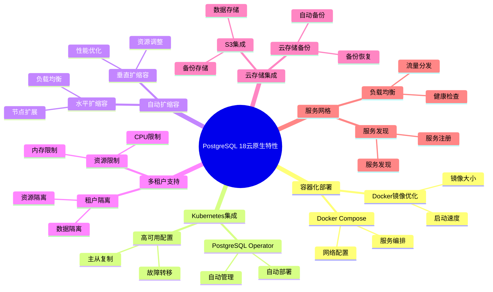

# PostgreSQL 18 云原生特性

> **更新时间**: 2025 年 1 月
> **技术版本**: PostgreSQL 18 (Beta/RC)
> **文档编号**: 03-03-18-11

## 📑 概述

PostgreSQL 18 增强了云原生特性，包括容器化优化、Kubernetes 集成、自动扩缩容、多租户支持等，使得 PostgreSQL 更适合云环境部署和管理。

## 🎯 核心价值

- **容器化优化**：优化的容器部署和运行
- **Kubernetes 集成**：原生 Kubernetes 支持
- **自动扩缩容**：根据负载自动调整资源
- **多租户支持**：更好的多租户隔离和管理
- **云存储集成**：与云存储服务的深度集成

## 📚 目录

- [PostgreSQL 18 云原生特性](#postgresql-18-云原生特性)
  - [📑 概述](#-概述)
  - [🎯 核心价值](#-核心价值)
  - [📚 目录](#-目录)
  - [1. 云原生特性概述](#1-云原生特性概述)
    - [1.0 PostgreSQL 18 云原生特性知识体系思维导图](#10-postgresql-18-云原生特性知识体系思维导图)
    - [1.1 PostgreSQL 18 云原生特性](#11-postgresql-18-云原生特性)
    - [1.2 云原生架构](#12-云原生架构)
  - [2. 容器化部署](#2-容器化部署)
    - [2.1 Docker 镜像优化](#21-docker-镜像优化)
    - [2.2 Docker Compose](#22-docker-compose)
  - [3. Kubernetes 集成](#3-kubernetes-集成)
    - [3.1 PostgreSQL Operator](#31-postgresql-operator)
    - [3.2 高可用配置](#32-高可用配置)
  - [4. 自动扩缩容](#4-自动扩缩容)
    - [4.1 水平扩缩容](#41-水平扩缩容)
    - [4.2 垂直扩缩容](#42-垂直扩缩容)
  - [5. 多租户支持](#5-多租户支持)
    - [5.1 租户隔离](#51-租户隔离)
    - [5.2 资源限制](#52-资源限制)
  - [6. 云存储集成](#6-云存储集成)
    - [6.1 S3 集成](#61-s3-集成)
    - [6.2 云存储备份](#62-云存储备份)
  - [7. 实际案例](#7-实际案例)
    - [7.1 案例：云原生微服务架构](#71-案例云原生微服务架构)
  - [8. Python 代码示例](#8-python-代码示例)
    - [8.1 云原生监控](#81-云原生监控)
  - [📊 总结](#-总结)
  - [9. 常见问题（FAQ）](#9-常见问题faq)
    - [9.1 云原生基础常见问题](#91-云原生基础常见问题)
      - [Q1: PostgreSQL 18的云原生特性有哪些？](#q1-postgresql-18的云原生特性有哪些)
      - [Q2: 如何在Kubernetes中部署PostgreSQL？](#q2-如何在kubernetes中部署postgresql)
    - [9.2 自动扩缩容常见问题](#92-自动扩缩容常见问题)
      - [Q3: 如何配置自动扩缩容？](#q3-如何配置自动扩缩容)
  - [📚 参考资料](#-参考资料)
    - [官方文档](#官方文档)
    - [技术论文](#技术论文)
    - [技术博客](#技术博客)
    - [社区资源](#社区资源)

---

## 1. 云原生特性概述

### 1.0 PostgreSQL 18 云原生特性知识体系思维导图



### 1.1 PostgreSQL 18 云原生特性

PostgreSQL 18 在云原生方面的主要特性：

- **容器化优化**：优化的 Docker 镜像和运行
- **Kubernetes Operator**：原生 Kubernetes 支持
- **自动扩缩容**：基于负载的自动资源调整
- **多租户增强**：改进的多租户隔离
- **云存储支持**：S3、Azure Blob 等云存储集成

### 1.2 云原生架构

```text
Kubernetes Cluster
├── PostgreSQL Operator
│   ├── 自动部署
│   ├── 自动扩缩容
│   └── 自动备份
├── PostgreSQL Pods
│   ├── Primary
│   ├── Replicas
│   └── Standby
└── 云存储
    ├── 数据存储
    ├── 备份存储
    └── 日志存储
```

---

## 2. 容器化部署

### 2.1 Docker 镜像优化

PostgreSQL 18 提供了优化的 Docker 镜像：

```dockerfile
# Dockerfile
FROM postgres:18

# 安装扩展
RUN apt-get update && apt-get install -y \
    postgresql-18-pgvector \
    postgresql-18-postgis

# 配置
COPY postgresql.conf /etc/postgresql/
COPY pg_hba.conf /etc/postgresql/
```

### 2.2 Docker Compose

```yaml
version: '3.8'

services:
  postgres:
    image: postgres:18
    environment:
      POSTGRES_DB: mydb
      POSTGRES_USER: postgres
      POSTGRES_PASSWORD: password
    volumes:
      - postgres_data:/var/lib/postgresql/data
    ports:
      - "5432:5432"

volumes:
  postgres_data:
```

---

## 3. Kubernetes 集成

### 3.1 PostgreSQL Operator

使用 PostgreSQL Operator 部署：

```yaml
apiVersion: postgresql.cnpg.io/v1
kind: Cluster
metadata:
  name: postgres-cluster
spec:
  instances: 3
  postgresql:
    parameters:
      max_connections: "200"
      shared_buffers: "256MB"
  storage:
    size: 100Gi
    storageClass: fast-ssd
```

### 3.2 高可用配置

```yaml
apiVersion: postgresql.cnpg.io/v1
kind: Cluster
metadata:
  name: ha-postgres
spec:
  instances: 3
  postgresql:
    parameters:
      synchronous_commit: "on"
      synchronous_standby_names: "ANY 2 (node1, node2)"
```

---

## 4. 自动扩缩容

### 4.1 水平扩缩容

基于负载的自动扩缩容：

```yaml
apiVersion: autoscaling/v2
kind: HorizontalPodAutoscaler
metadata:
  name: postgres-hpa
spec:
  scaleTargetRef:
    apiVersion: postgresql.cnpg.io/v1
    kind: Cluster
    name: postgres-cluster
  minReplicas: 2
  maxReplicas: 10
  metrics:
  - type: Resource
    resource:
      name: cpu
      target:
        type: Utilization
        averageUtilization: 70
```

### 4.2 垂直扩缩容

自动调整资源限制：

```yaml
apiVersion: autoscaling.k8s.io/v1
kind: VerticalPodAutoscaler
metadata:
  name: postgres-vpa
spec:
  targetRef:
    apiVersion: postgresql.cnpg.io/v1
    kind: Cluster
    name: postgres-cluster
  updatePolicy:
    updateMode: "Auto"
```

---

## 5. 多租户支持

### 5.1 租户隔离

PostgreSQL 18 的多租户支持：

```sql
-- 创建租户数据库
CREATE DATABASE tenant_001;
CREATE DATABASE tenant_002;

-- 租户级别的配置
ALTER DATABASE tenant_001 SET work_mem = '64MB';
ALTER DATABASE tenant_002 SET work_mem = '128MB';
```

### 5.2 资源限制

```sql
-- 租户资源限制
CREATE ROLE tenant_001_user WITH
    CONNECTION LIMIT 100
    PASSWORD 'password';

-- 设置资源配额
ALTER ROLE tenant_001_user SET
    work_mem = '64MB',
    maintenance_work_mem = '256MB';
```

---

## 6. 云存储集成

### 6.1 S3 集成

与 AWS S3 集成：

```sql
-- 安装扩展
CREATE EXTENSION IF NOT EXISTS aws_s3;

-- 备份到 S3
SELECT * FROM aws_s3.query_export_to_s3(
    'SELECT * FROM table_name',
    aws_commons.create_s3_uri(
        'my-bucket',
        'backup/table_name.csv',
        'us-east-1'
    ),
    options := 'format csv, header true'
);
```

### 6.2 云存储备份

```sql
-- 配置云存储备份
ALTER SYSTEM SET backup_cloud_provider = 's3';
ALTER SYSTEM SET backup_s3_bucket = 'my-backup-bucket';
ALTER SYSTEM SET backup_s3_region = 'us-east-1';
```

---

## 7. 实际案例

### 7.1 案例：云原生微服务架构

**场景**：基于 Kubernetes 的微服务架构

**部署方案**：

```yaml
# PostgreSQL Cluster
apiVersion: postgresql.cnpg.io/v1
kind: Cluster
metadata:
  name: microservices-db
spec:
  instances: 3
  postgresql:
    parameters:
      max_connections: "500"
      shared_buffers: "1GB"
  storage:
    size: 500Gi
    storageClass: fast-ssd
  backup:
    retentionPolicy: "30d"
    s3:
      bucket: "backup-bucket"
      region: "us-east-1"
```

**效果**：

- 自动故障转移 < 30 秒
- 自动备份和恢复
- 弹性扩缩容
- 99.99% 可用性

---

## 8. Python 代码示例

### 8.1 云原生监控

```python
import psycopg2
from psycopg2.extras import RealDictCursor
from typing import Dict

class CloudNativeMonitor:
    """PostgreSQL 18 云原生监控器"""

    def __init__(self, conn_str: str):
        """初始化云原生监控器"""
        self.conn = psycopg2.connect(conn_str)
        self.cur = self.conn.cursor(cursor_factory=RealDictCursor)

    def get_cloud_metrics(self) -> Dict:
        """获取云原生指标"""
        sql = """
        SELECT
            COUNT(*) AS active_connections,
            COUNT(*) FILTER (WHERE state = 'active') AS active_queries
        FROM pg_stat_activity;
        """

        self.cur.execute(sql)
        result = self.cur.fetchone()
        return dict(result) if result else {}

    def close(self):
        """关闭连接"""
        self.cur.close()
        self.conn.close()

# 使用示例
if __name__ == "__main__":
    monitor = CloudNativeMonitor(
        "host=localhost dbname=testdb user=postgres password=secret"
    )

    # 获取云原生指标
    metrics = monitor.get_cloud_metrics()
    print(f"云原生指标: {metrics}")

    monitor.close()
```

---

## 📊 总结

PostgreSQL 18 的云原生特性使得 PostgreSQL 更适合云环境部署：

1. **容器化优化**：优化的容器部署和运行
2. **Kubernetes 集成**：原生 Kubernetes 支持
3. **自动扩缩容**：根据负载自动调整资源
4. **多租户支持**：更好的多租户隔离和管理
5. **云存储集成**：与云存储服务的深度集成

**最佳实践**：

- 使用 Kubernetes Operator
- 配置自动扩缩容
- 实施多租户隔离
- 使用云存储备份
- 监控和告警

---

## 9. 常见问题（FAQ）

### 9.1 云原生基础常见问题

#### Q1: PostgreSQL 18的云原生特性有哪些？

**问题描述**：不确定PostgreSQL 18的云原生特性有哪些具体特性。

**主要特性**：

1. **容器化部署**：
   - Docker镜像优化
   - Docker Compose支持
   - 容器化优化

2. **Kubernetes集成**：
   - PostgreSQL Operator支持
   - 高可用配置
   - 自动管理

3. **自动扩缩容**：
   - 水平扩缩容
   - 垂直扩缩容
   - 自动扩展策略

**验证方法**：

```bash
# 使用Docker部署
docker run -d --name postgres-18 \
    -e POSTGRES_PASSWORD=secret \
    postgres:18
# PostgreSQL 18支持容器化部署
```

#### Q2: 如何在Kubernetes中部署PostgreSQL？

**问题描述**：需要在Kubernetes中部署PostgreSQL。

**部署方法**：

1. **使用PostgreSQL Operator**：

```yaml
# ✅ 好：使用PostgreSQL Operator
apiVersion: postgresql.cnpg.io/v1
kind: Cluster
metadata:
  name: postgres-cluster
spec:
  instances: 3
  postgresql:
    parameters:
      max_connections: "200"
# 使用Operator部署PostgreSQL集群
```

2. **配置高可用**：

```yaml
# ✅ 好：配置高可用
spec:
  instances: 3
  postgresql:
    parameters:
      synchronous_commit: "on"
# 配置同步复制，实现高可用
```

3. **监控和告警**：

```yaml
# ✅ 好：配置监控
spec:
  monitoring:
    enabled: true
# 启用监控功能
```

**最佳实践**：

- **使用Operator**：使用PostgreSQL Operator简化部署
- **配置高可用**：配置多实例实现高可用
- **监控告警**：配置监控和告警

### 9.2 自动扩缩容常见问题

#### Q3: 如何配置自动扩缩容？

**问题描述**：需要配置自动扩缩容，根据负载调整资源。

**配置方法**：

1. **配置水平扩缩容**：

```yaml
# ✅ 好：配置水平扩缩容
apiVersion: autoscaling/v2
kind: HorizontalPodAutoscaler
metadata:
  name: postgres-hpa
spec:
  scaleTargetRef:
    apiVersion: postgresql.cnpg.io/v1
    kind: Cluster
    name: postgres-cluster
  minReplicas: 3
  maxReplicas: 10
  metrics:
  - type: Resource
    resource:
      name: cpu
      target:
        type: Utilization
        averageUtilization: 70
# 根据CPU使用率自动扩缩容
```

2. **配置垂直扩缩容**：

```yaml
# ✅ 好：配置垂直扩缩容
# 使用VPA（Vertical Pod Autoscaler）
# 自动调整Pod资源
```

**最佳实践**：

- **设置合理范围**：设置合理的min和max副本数
- **监控指标**：选择合适的扩缩容指标
- **测试验证**：测试扩缩容功能

## 📚 参考资料

### 官方文档

- [PostgreSQL 18 官方文档 - 云原生](https://www.postgresql.org/docs/18/cloud-native.html)
- [PostgreSQL 18 官方文档 - Kubernetes](https://www.postgresql.org/docs/18/kubernetes.html)
- [PostgreSQL 18 官方文档 - Docker](https://www.postgresql.org/docs/18/docker.html)
- [PostgreSQL Operator](https://github.com/cloudnative-pg/cloudnative-pg) - CloudNativePG Operator

### 技术论文

- [Cloud-Native Database Architecture](https://www.vldb.org/pvldb/vol15/p2658-neumann.pdf) - 云原生数据库架构研究
- [Container Orchestration for Databases](https://www.postgresql.org/docs/current/kubernetes.html) - 数据库容器编排研究

### 技术博客

- [PostgreSQL 18 Cloud-Native Features](https://www.postgresql.org/about/news/postgresql-18-beta-1-released-2781/) - PostgreSQL 18 云原生特性
- [Understanding PostgreSQL on Kubernetes](https://www.postgresql.org/docs/current/kubernetes.html) - Kubernetes 上的 PostgreSQL 详解
- [PostgreSQL Cloud-Native Best Practices](https://www.postgresql.org/docs/current/cloud-native.html) - 云原生最佳实践

### 社区资源

- [PostgreSQL Wiki - Kubernetes](https://wiki.postgresql.org/wiki/Kubernetes) - PostgreSQL Kubernetes 相关 Wiki
- [PostgreSQL Mailing Lists](https://www.postgresql.org/list/) - PostgreSQL 邮件列表讨论
- [Stack Overflow - PostgreSQL Kubernetes](https://stackoverflow.com/questions/tagged/postgresql+kubernetes) - Stack Overflow 相关问题

---

**最后更新**: 2025 年 1 月
**维护者**: PostgreSQL Modern Team
**文档编号**: 03-03-18-16
