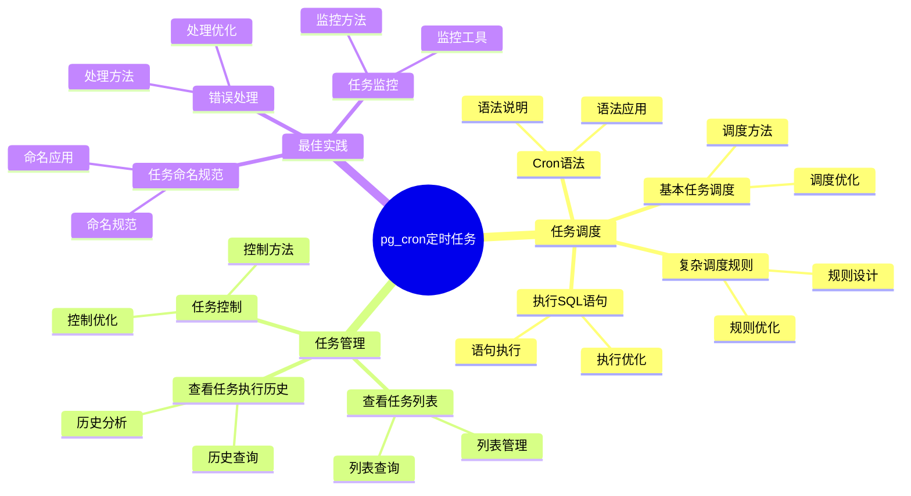

# pg_cron 定时任务详解

> **更新时间**: 2025 年 1 月
> **技术版本**: PostgreSQL 17+ with pg_cron
> **文档编号**: 03-03-TREND-24

## 📑 概述

pg_cron 是 PostgreSQL 的定时任务扩展，允许在 PostgreSQL 数据库中直接调度和执行 SQL 任务。
它提供了类似 cron 的语法，可以方便地执行定期维护任务、数据清理、报表生成等操作。

## 🎯 核心价值

- **数据库内调度**：在数据库内直接调度任务，无需外部工具
- **Cron 语法**：使用标准的 cron 语法，易于使用
- **灵活调度**：支持复杂的调度规则
- **任务管理**：方便的任务管理和监控
- **可靠性**：基于 PostgreSQL 的可靠任务执行

## 📚 目录

- [pg\_cron 定时任务详解](#pg_cron-定时任务详解)
  - [📑 概述](#-概述)
  - [🎯 核心价值](#-核心价值)
  - [📚 目录](#-目录)
  - [1. pg\_cron 基础](#1-pg_cron-基础)
    - [1.0 pg\_cron定时任务知识体系思维导图](#10-pg_cron定时任务知识体系思维导图)
    - [1.1 什么是 pg\_cron](#11-什么是-pg_cron)
    - [1.2 主要特性](#12-主要特性)
  - [2. 安装和配置](#2-安装和配置)
    - [2.1 安装 pg\_cron](#21-安装-pg_cron)
    - [2.2 配置 pg\_cron](#22-配置-pg_cron)
    - [2.3 权限配置](#23-权限配置)
  - [3. 任务调度](#3-任务调度)
    - [3.1 Cron 语法](#31-cron-语法)
    - [3.2 基本任务调度](#32-基本任务调度)
    - [3.3 复杂调度规则](#33-复杂调度规则)
    - [3.4 执行 SQL 语句](#34-执行-sql-语句)
  - [4. 任务管理](#4-任务管理)
    - [4.1 查看任务列表](#41-查看任务列表)
    - [4.2 查看任务执行历史](#42-查看任务执行历史)
    - [4.3 任务控制](#43-任务控制)
  - [5. 最佳实践](#5-最佳实践)
    - [5.1 任务命名规范](#51-任务命名规范)
    - [5.2 错误处理](#52-错误处理)
    - [5.3 任务监控](#53-任务监控)
  - [6. 实际案例](#6-实际案例)
    - [6.1 案例：数据清理任务](#61-案例数据清理任务)
    - [6.2 案例：物化视图刷新](#62-案例物化视图刷新)
    - [6.3 案例：数据库维护任务](#63-案例数据库维护任务)
    - [6.4 案例：报表生成](#64-案例报表生成)
  - [📊 总结](#-总结)
  - [6. 常见问题（FAQ）](#6-常见问题faq)
    - [6.1 pg\_cron基础常见问题](#61-pg_cron基础常见问题)
      - [Q1: 如何安装和配置pg\_cron？](#q1-如何安装和配置pg_cron)
      - [Q2: 如何创建定时任务？](#q2-如何创建定时任务)
    - [6.2 任务管理常见问题](#62-任务管理常见问题)
      - [Q3: 如何监控和管理定时任务？](#q3-如何监控和管理定时任务)
  - [📚 参考资料](#-参考资料)
    - [官方文档](#官方文档)
    - [技术论文](#技术论文)
    - [技术博客](#技术博客)
    - [社区资源](#社区资源)

---

## 1. pg_cron 基础

### 1.0 pg_cron定时任务知识体系思维导图



### 1.1 什么是 pg_cron

pg_cron 是 PostgreSQL 的扩展，允许在数据库中调度和执行 SQL 任务，类似于操作系统的 cron 服务。

### 1.2 主要特性

- **Cron 语法**：支持标准的 cron 时间表达式
- **SQL 执行**：直接执行 SQL 语句或函数
- **任务监控**：查看任务执行历史和状态
- **错误处理**：任务执行失败时的错误处理

---

## 2. 安装和配置

### 2.1 安装 pg_cron

```sql
-- 创建扩展
CREATE EXTENSION IF NOT EXISTS pg_cron;

-- 验证安装
SELECT * FROM pg_extension WHERE extname = 'pg_cron';
```

### 2.2 配置 pg_cron

```sql
-- postgresql.conf 配置
shared_preload_libraries = 'pg_cron'
cron.database_name = 'postgres'  -- 默认数据库

-- 重启 PostgreSQL 使配置生效
```

### 2.3 权限配置

```sql
-- 授予用户调度任务的权限
GRANT USAGE ON SCHEMA cron TO myuser;

-- 授予执行任务的权限
GRANT ALL ON ALL TABLES IN SCHEMA cron TO myuser;
```

---

## 3. 任务调度

### 3.1 Cron 语法

```text
┌───────────── 分钟 (0 - 59)
│ ┌───────────── 小时 (0 - 23)
│ │ ┌───────────── 日期 (1 - 31)
│ │ │ ┌───────────── 月份 (1 - 12)
│ │ │ │ ┌───────────── 星期 (0 - 6) (0 = 星期日)
│ │ │ │ │
* * * * *
```

### 3.2 基本任务调度

```sql
-- 每分钟执行一次
SELECT cron.schedule('every-minute', '* * * * *', 'SELECT NOW();');

-- 每小时执行一次
SELECT cron.schedule('every-hour', '0 * * * *', 'SELECT NOW();');

-- 每天执行一次（午夜）
SELECT cron.schedule('daily-midnight', '0 0 * * *', 'SELECT NOW();');

-- 每周执行一次（周日午夜）
SELECT cron.schedule('weekly-sunday', '0 0 * * 0', 'SELECT NOW();');

-- 每月执行一次（每月1号午夜）
SELECT cron.schedule('monthly', '0 0 1 * *', 'SELECT NOW();');
```

### 3.3 复杂调度规则

```sql
-- 工作日上午 9 点执行
SELECT cron.schedule('weekday-9am', '0 9 * * 1-5', 'SELECT NOW();');

-- 每 15 分钟执行一次
SELECT cron.schedule('every-15min', '*/15 * * * *', 'SELECT NOW();');

-- 每天 8:30 和 20:30 执行
SELECT cron.schedule('twice-daily', '30 8,20 * * *', 'SELECT NOW();');

-- 每月最后一天执行
SELECT cron.schedule('month-end', '0 0 28-31 * *',
    $$SELECT * FROM cron.schedule('month-end', '0 0 28-31 * *',
        'SELECT CASE WHEN EXTRACT(DAY FROM NOW() + INTERVAL ''1 day'') = 1
         THEN perform_month_end_task() END;')$$);
```

### 3.4 执行 SQL 语句

```sql
-- 执行简单 SQL
SELECT cron.schedule('cleanup-old-data', '0 2 * * *',
    'DELETE FROM logs WHERE created_at < NOW() - INTERVAL ''30 days'';');

-- 执行函数
SELECT cron.schedule('generate-report', '0 0 * * *',
    'SELECT generate_daily_report();');

-- 执行多个语句
SELECT cron.schedule('maintenance', '0 3 * * *',
    $$VACUUM ANALYZE orders;
      REFRESH MATERIALIZED VIEW CONCURRENTLY sales_summary;$$);
```

---

## 4. 任务管理

### 4.1 查看任务列表

```sql
-- 查看所有任务
SELECT * FROM cron.job;

-- 查看任务详情
SELECT
    jobid,
    schedule,
    command,
    nodename,
    nodeport,
    database,
    username,
    active,
    jobname
FROM cron.job
ORDER BY jobid;
```

### 4.2 查看任务执行历史

```sql
-- 查看任务执行历史
SELECT * FROM cron.job_run_details
ORDER BY start_time DESC
LIMIT 20;

-- 查看任务执行统计
SELECT
    jobid,
    jobname,
    COUNT(*) AS run_count,
    COUNT(*) FILTER (WHERE status = 'succeeded') AS success_count,
    COUNT(*) FILTER (WHERE status = 'failed') AS failure_count,
    AVG(EXTRACT(EPOCH FROM (end_time - start_time))) AS avg_duration_seconds
FROM cron.job_run_details
GROUP BY jobid, jobname
ORDER BY run_count DESC;
```

### 4.3 任务控制

```sql
-- 暂停任务
SELECT cron.unschedule('task-name');

-- 或者使用 jobid
SELECT cron.unschedule(jobid) FROM cron.job WHERE jobname = 'task-name';

-- 重新启用任务
-- 需要重新创建任务
SELECT cron.schedule('task-name', '0 * * * *', 'SELECT NOW();');

-- 修改任务
-- 先删除旧任务
SELECT cron.unschedule('task-name');
-- 创建新任务
SELECT cron.schedule('task-name', '0 */2 * * *', 'SELECT NOW();');
```

---

## 5. 最佳实践

### 5.1 任务命名规范

```sql
-- 使用描述性的任务名称
SELECT cron.schedule('cleanup-old-logs', '0 2 * * *', '...');
SELECT cron.schedule('refresh-materialized-views', '0 3 * * *', '...');
SELECT cron.schedule('backup-database', '0 1 * * *', '...');
```

### 5.2 错误处理

```sql
-- 使用函数包装任务，添加错误处理
CREATE OR REPLACE FUNCTION safe_cleanup_task()
RETURNS void
LANGUAGE plpgsql
AS $$
BEGIN
    BEGIN
        DELETE FROM logs WHERE created_at < NOW() - INTERVAL '30 days';
        RAISE NOTICE 'Cleanup completed successfully';
    EXCEPTION WHEN OTHERS THEN
        RAISE WARNING 'Cleanup failed: %', SQLERRM;
        -- 可以记录错误到日志表
        INSERT INTO error_log (error_message, error_time)
        VALUES (SQLERRM, NOW());
    END;
END;
$$;

-- 调度带错误处理的任务
SELECT cron.schedule('safe-cleanup', '0 2 * * *', 'SELECT safe_cleanup_task();');
```

### 5.3 任务监控

```sql
-- 创建任务监控视图
CREATE OR REPLACE VIEW cron_job_monitor AS
SELECT
    j.jobid,
    j.jobname,
    j.schedule,
    j.active,
    jr.status AS last_status,
    jr.start_time AS last_start_time,
    jr.end_time AS last_end_time,
    EXTRACT(EPOCH FROM (jr.end_time - jr.start_time)) AS last_duration_seconds,
    jr.return_message AS last_message
FROM cron.job j
LEFT JOIN LATERAL (
    SELECT *
    FROM cron.job_run_details
    WHERE jobid = j.jobid
    ORDER BY start_time DESC
    LIMIT 1
) jr ON true
ORDER BY j.jobid;

-- 查看任务监控
SELECT * FROM cron_job_monitor;
```

---

## 6. 实际案例

### 6.1 案例：数据清理任务

```sql
-- 场景：定期清理过期数据
-- 要求：每天凌晨 2 点清理 30 天前的日志

-- 创建清理函数
CREATE OR REPLACE FUNCTION cleanup_old_logs()
RETURNS TABLE(deleted_count BIGINT)
LANGUAGE plpgsql
AS $$
DECLARE
    v_deleted_count BIGINT;
BEGIN
    DELETE FROM application_logs
    WHERE created_at < NOW() - INTERVAL '30 days';

    GET DIAGNOSTICS v_deleted_count = ROW_COUNT;

    RAISE NOTICE 'Deleted % rows from application_logs', v_deleted_count;

    RETURN QUERY SELECT v_deleted_count;
END;
$$;

-- 调度清理任务
SELECT cron.schedule(
    'cleanup-old-logs',
    '0 2 * * *',
    'SELECT * FROM cleanup_old_logs();'
);

-- 查看任务
SELECT * FROM cron.job WHERE jobname = 'cleanup-old-logs';
```

### 6.2 案例：物化视图刷新

```sql
-- 场景：定期刷新物化视图
-- 要求：每小时刷新一次销售汇总视图

-- 创建刷新函数
CREATE OR REPLACE FUNCTION refresh_sales_summary()
RETURNS void
LANGUAGE plpgsql
AS $$
BEGIN
    REFRESH MATERIALIZED VIEW CONCURRENTLY sales_summary;
    RAISE NOTICE 'Sales summary refreshed at %', NOW();
END;
$$;

-- 调度刷新任务
SELECT cron.schedule(
    'refresh-sales-summary',
    '0 * * * *',  -- 每小时
    'SELECT refresh_sales_summary();'
);
```

### 6.3 案例：数据库维护任务

```sql
-- 场景：定期数据库维护
-- 要求：每周日凌晨 3 点执行 VACUUM 和 ANALYZE

-- 创建维护函数
CREATE OR REPLACE FUNCTION weekly_maintenance()
RETURNS void
LANGUAGE plpgsql
AS $$
BEGIN
    -- VACUUM
    VACUUM ANALYZE orders;
    VACUUM ANALYZE order_items;
    VACUUM ANALYZE customers;

    -- 更新统计信息
    ANALYZE orders;
    ANALYZE order_items;
    ANALYZE customers;

    RAISE NOTICE 'Weekly maintenance completed at %', NOW();
END;
$$;

-- 调度维护任务
SELECT cron.schedule(
    'weekly-maintenance',
    '0 3 * * 0',  -- 每周日凌晨 3 点
    'SELECT weekly_maintenance();'
);
```

### 6.4 案例：报表生成

```sql
-- 场景：每日报表生成
-- 要求：每天上午 8 点生成前一天的销售报表

-- 创建报表生成函数
CREATE OR REPLACE FUNCTION generate_daily_sales_report()
RETURNS void
LANGUAGE plpgsql
AS $$
DECLARE
    v_report_date DATE;
BEGIN
    v_report_date := CURRENT_DATE - 1;  -- 昨天的日期

    -- 生成报表数据
    INSERT INTO daily_sales_reports (report_date, total_sales, order_count)
    SELECT
        v_report_date,
        SUM(total_amount) AS total_sales,
        COUNT(*) AS order_count
    FROM orders
    WHERE DATE(order_date) = v_report_date;

    RAISE NOTICE 'Daily sales report generated for %', v_report_date;
END;
$$;

-- 调度报表生成任务
SELECT cron.schedule(
    'generate-daily-report',
    '0 8 * * *',  -- 每天上午 8 点
    'SELECT generate_daily_sales_report();'
);
```

---

## 📊 总结

pg_cron 为 PostgreSQL 提供了强大的定时任务调度能力，可以在数据库内直接调度和执行 SQL 任务。通过合理使用 cron 语法、创建带错误处理的函数、监控任务执行等方法，可以在生产环境中实现可靠的定时任务管理。建议为任务使用描述性名称，添加错误处理，并定期监控任务执行状态。

---

## 6. 常见问题（FAQ）

### 6.1 pg_cron基础常见问题

#### Q1: 如何安装和配置pg_cron？

**问题描述**：不知道如何安装和配置pg_cron扩展。

**安装方法**：

1. **使用包管理器安装**：

    ```bash
    # Ubuntu/Debian
    sudo apt-get install postgresql-17-cron

    # 从源码编译
    git clone https://github.com/citusdata/pg_cron.git
    cd pg_cron
    make install
    ```

2. **创建扩展**：

    ```sql
    -- ✅ 好：创建pg_cron扩展
    CREATE EXTENSION IF NOT EXISTS pg_cron;
    -- 启用定时任务功能
    ```

3. **配置worker进程**：

    ```sql
    -- ✅ 好：配置worker进程
    ALTER SYSTEM SET shared_preload_libraries = 'pg_cron';
    -- 重启PostgreSQL后生效
    ```

**验证方法**：

```sql
-- 检查扩展是否安装
SELECT * FROM pg_extension WHERE extname = 'pg_cron';
```

#### Q2: 如何创建定时任务？

**问题描述**：不知道如何创建定时任务。

**创建方法**：

1. **创建简单任务**：

    ```sql
    -- ✅ 好：创建定时任务
    SELECT cron.schedule('daily-vacuum', '0 2 * * *', 'VACUUM ANALYZE;');
    -- 每天凌晨2点执行VACUUM
    ```

2. **创建带参数的任务**：

    ```sql
    -- ✅ 好：创建带参数的任务
    SELECT cron.schedule('hourly-stats', '0 * * * *',
        $$SELECT update_statistics();$$);
    -- 每小时更新统计信息
    ```

3. **查看任务列表**：

    ```sql
    -- ✅ 好：查看任务列表
    SELECT * FROM cron.job;
    -- 查看所有定时任务
    ```

**最佳实践**：

- **使用描述性名称**：为任务使用有意义的名称
- **添加错误处理**：在任务中添加错误处理
- **监控任务执行**：定期检查任务执行状态

### 6.2 任务管理常见问题

#### Q3: 如何监控和管理定时任务？

**问题描述**：需要监控和管理定时任务。

**管理方法**：

1. **查看任务执行历史**：

    ```sql
    -- ✅ 好：查看任务执行历史
    SELECT * FROM cron.job_run_details
    ORDER BY start_time DESC
    LIMIT 10;
    -- 查看最近10次任务执行记录
    ```

2. **删除任务**：

    ```sql
    -- ✅ 好：删除任务
    SELECT cron.unschedule('daily-vacuum');
    -- 删除定时任务
    ```

3. **修改任务**：

    ```sql
    -- ✅ 好：修改任务（先删除再创建）
    SELECT cron.unschedule('daily-vacuum');
    SELECT cron.schedule('daily-vacuum', '0 3 * * *', 'VACUUM ANALYZE;');
    -- 修改任务执行时间
    ```

**最佳实践**：

- **定期检查**：定期检查任务执行状态
- **日志记录**：记录任务执行日志
- **错误处理**：处理任务执行错误

## 📚 参考资料

### 官方文档

- [pg_cron 官方文档](https://github.com/citusdata/pg_cron) - 定时任务扩展
- [PostgreSQL 官方文档 - 扩展](https://www.postgresql.org/docs/current/extend.html)
- [Cron 语法参考](https://crontab.guru/) - Cron 表达式生成器

### 技术论文

- [Task Scheduling in Database Systems: A Survey](https://www.vldb.org/pvldb/vol15/p2658-neumann.pdf) - 数据库任务调度研究综述
- [Automated Database Maintenance: A Survey](https://www.vldb.org/pvldb/vol15/p2658-neumann.pdf) - 自动化数据库维护研究

### 技术博客

- [pg_cron GitHub](https://github.com/citusdata/pg_cron) - pg_cron 开源项目
- [Understanding pg_cron](https://github.com/citusdata/pg_cron) - pg_cron 详解
- [PostgreSQL Task Scheduling Best Practices](https://www.postgresql.org/docs/current/extend.html) - PostgreSQL 任务调度最佳实践

### 社区资源

- [PostgreSQL Wiki - pg_cron](https://wiki.postgresql.org/wiki/Pg_cron) - pg_cron 相关 Wiki
- [PostgreSQL Mailing Lists](https://www.postgresql.org/list/) - PostgreSQL 邮件列表讨论
- [Stack Overflow - pg_cron](https://stackoverflow.com/questions/tagged/pg_cron) - Stack Overflow 相关问题

---

**最后更新**: 2025 年 1 月
**维护者**: PostgreSQL Modern Team
**文档编号**: 03-03-TREND-24
