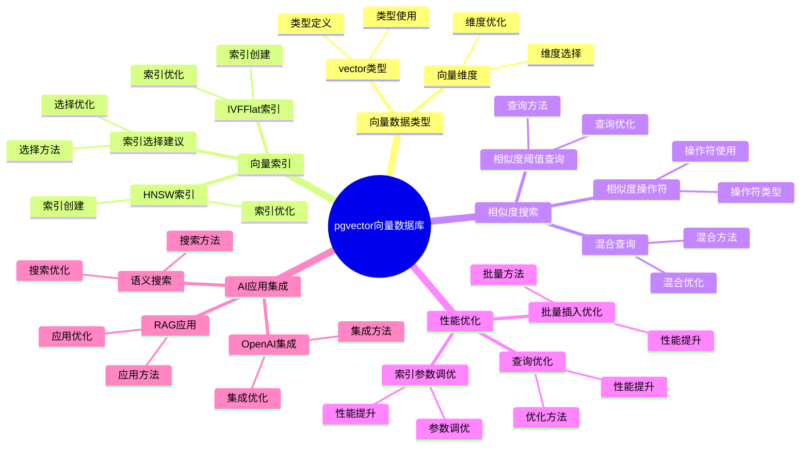
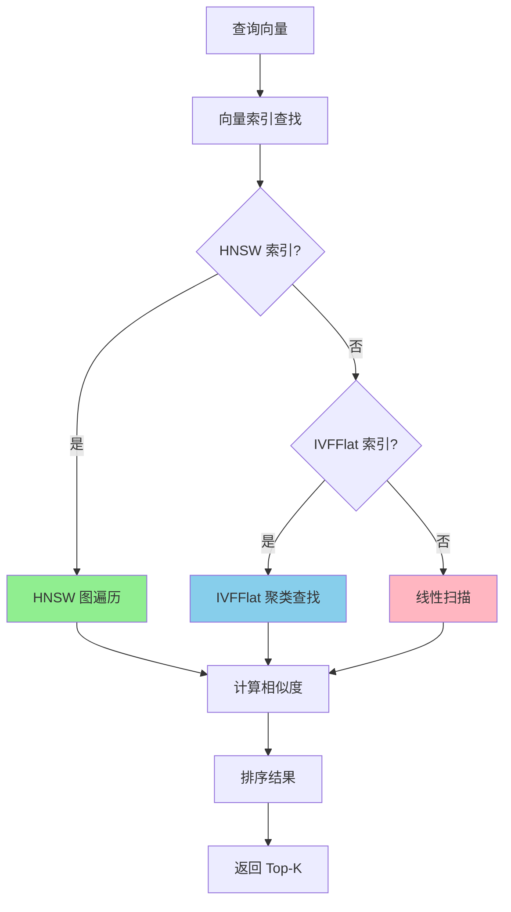
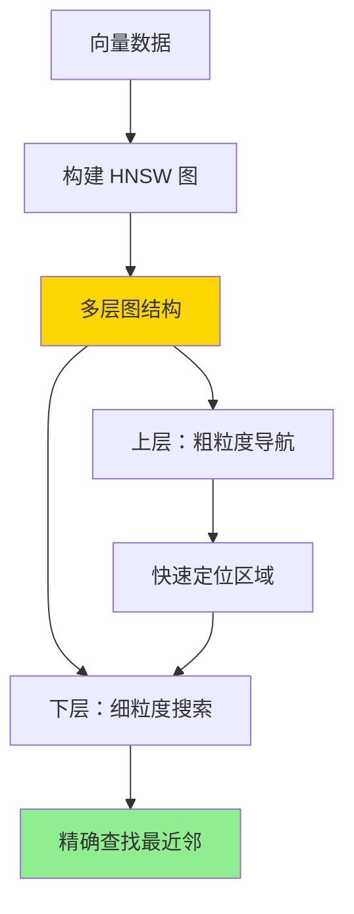

# pgvector 向量数据库详解

> **更新时间**: 2025 年 1 月
> **技术版本**: PostgreSQL 17+/18+ with pgvector
> **文档编号**: 03-03-TREND-01

## 📑 概述

pgvector 是 PostgreSQL 的向量数据库扩展，支持高效的向量相似度搜索。
它是 AI/ML 应用的核心技术，广泛应用于推荐系统、语义搜索、图像搜索、RAG（检索增强生成）等场景。

## 🎯 核心价值

- **向量相似度搜索**：支持高效的向量相似度计算和搜索
- **多种索引类型**：HNSW、IVFFlat 等高性能索引
- **AI/ML 集成**：与 OpenAI、Hugging Face 等 AI 模型无缝集成
- **混合搜索**：向量搜索 + 全文搜索的混合查询
- **生产就绪**：成熟稳定，已在生产环境大规模使用

## 📚 目录

- [pgvector 向量数据库详解](#pgvector-向量数据库详解)
  - [📑 概述](#-概述)
  - [🎯 核心价值](#-核心价值)
  - [📚 目录](#-目录)
  - [1. pgvector 基础](#1-pgvector-基础)
    - [1.0 pgvector向量数据库知识体系思维导图](#10-pgvector向量数据库知识体系思维导图)
    - [1.0 pgvector 工作原理概述](#10-pgvector-工作原理概述)
    - [1.1 什么是 pgvector](#11-什么是-pgvector)
    - [1.2 安装 pgvector](#12-安装-pgvector)
    - [1.3 版本要求](#13-版本要求)
  - [2. 向量数据类型](#2-向量数据类型)
    - [2.1 vector 类型](#21-vector-类型)
    - [2.2 向量维度](#22-向量维度)
  - [3. 向量索引](#3-向量索引)
    - [3.1 HNSW 索引（推荐）](#31-hnsw-索引推荐)
    - [3.2 IVFFlat 索引](#32-ivfflat-索引)
    - [3.3 索引选择建议](#33-索引选择建议)
  - [4. 相似度搜索](#4-相似度搜索)
    - [4.1 相似度操作符](#41-相似度操作符)
    - [4.2 相似度阈值查询](#42-相似度阈值查询)
    - [4.3 混合查询](#43-混合查询)
  - [5. 性能优化](#5-性能优化)
    - [5.1 索引参数调优](#51-索引参数调优)
    - [5.2 批量插入优化](#52-批量插入优化)
    - [5.3 查询优化](#53-查询优化)
    - [5.4 最佳实践](#54-最佳实践)
  - [6. AI 应用集成](#6-ai-应用集成)
    - [6.1 OpenAI 集成](#61-openai-集成)
    - [6.2 语义搜索](#62-语义搜索)
    - [6.3 RAG 应用](#63-rag-应用)
  - [7. 实际案例](#7-实际案例)
    - [7.1 案例：电商推荐系统](#71-案例电商推荐系统)
    - [7.2 案例：图像搜索](#72-案例图像搜索)
  - [📊 总结](#-总结)
  - [7. 常见问题（FAQ）](#7-常见问题faq)
    - [7.1 pgvector基础常见问题](#71-pgvector基础常见问题)
      - [Q1: 如何安装和配置pgvector？](#q1-如何安装和配置pgvector)
      - [Q2: 如何选择向量索引类型？](#q2-如何选择向量索引类型)
    - [7.2 向量搜索性能常见问题](#72-向量搜索性能常见问题)
      - [Q3: 向量搜索慢怎么办？](#q3-向量搜索慢怎么办)
    - [7.3 向量维度常见问题](#73-向量维度常见问题)
      - [Q4: 如何选择合适的向量维度？](#q4-如何选择合适的向量维度)
  - [📚 参考资料](#-参考资料)
    - [官方文档](#官方文档)
    - [技术论文](#技术论文)
    - [技术博客](#技术博客)
    - [社区资源](#社区资源)

---

## 1. pgvector 基础

### 1.0 pgvector向量数据库知识体系思维导图



### 1.0 pgvector 工作原理概述

**pgvector 的本质**：

pgvector 是 PostgreSQL 的开源扩展，为 PostgreSQL 添加了向量数据类型和高效的向量相似度搜索功能。
它通过专门的向量索引（HNSW、IVFFlat）实现快速的相似度搜索，是 AI/ML 应用的核心技术。

**向量相似度搜索流程图**：



**向量相似度计算**：

- **余弦相似度（Cosine）**：`1 - (embedding <=> query_vector)`，范围 [0, 1]，值越大越相似
- **欧氏距离（L2）**：`embedding <-> query_vector`，范围 [0, +∞)，值越小越相似
- **内积（Inner Product）**：`embedding <#> query_vector`，范围 (-∞, +∞)，值越大越相似

**HNSW 索引工作原理**：



### 1.1 什么是 pgvector

pgvector 是 PostgreSQL 的开源扩展，为 PostgreSQL 添加了向量数据类型和相似度搜索功能。

**pgvector 的核心特性**：

- **向量数据类型**：`vector(n)` 类型，支持任意维度向量
- **相似度操作符**：`<=>`（余弦距离）、`<->`（L2距离）、`<#>`（内积）
- **高性能索引**：HNSW、IVFFlat 索引，支持快速相似度搜索
- **AI/ML 集成**：与 OpenAI、Hugging Face 等 AI 模型无缝集成

### 1.2 安装 pgvector

```sql
-- 使用扩展
CREATE EXTENSION IF NOT EXISTS vector;

-- 验证安装
SELECT * FROM pg_extension WHERE extname = 'vector';
```

### 1.3 版本要求

- PostgreSQL 11+
- 推荐 PostgreSQL 17+ 以获得最佳性能

---

## 2. 向量数据类型

### 2.1 vector 类型

```sql
-- 创建向量列
CREATE TABLE items (
    id SERIAL PRIMARY KEY,
    name TEXT,
    embedding vector(1536)  -- 1536 维向量（OpenAI ada-002）
);

-- 插入向量数据
INSERT INTO items (name, embedding)
VALUES (
    'Product A',
    '[0.1, 0.2, 0.3, ...]'::vector
);
```

### 2.2 向量维度

- 支持任意维度（1-16,000）
- 常见维度：
  - OpenAI ada-002: 1536
  - OpenAI text-embedding-3-small: 1536
  - OpenAI text-embedding-3-large: 3072
  - sentence-transformers: 384, 768

---

## 3. 向量索引

### 3.1 HNSW 索引（推荐）

```sql
-- 创建 HNSW 索引
CREATE INDEX ON items
USING hnsw (embedding vector_cosine_ops)
WITH (m = 16, ef_construction = 64);

-- 参数说明：
-- m: 每个节点的最大连接数（默认 16）
-- ef_construction: 构建时的搜索范围（默认 64）
```

**特点**：

- 查询速度快
- 索引构建时间较长
- 适合读多写少的场景

### 3.2 IVFFlat 索引

```sql
-- 创建 IVFFlat 索引
CREATE INDEX ON items
USING ivfflat (embedding vector_cosine_ops)
WITH (lists = 100);

-- 参数说明：
-- lists: 聚类中心数量（建议：rows / 1000）
```

**特点**：

- 索引构建速度快
- 查询速度较 HNSW 慢
- 适合写多读少的场景

### 3.3 索引选择建议

| 场景 | 推荐索引 | 原因 |
|------|---------|------|
| 读多写少 | HNSW | 查询性能最优 |
| 写多读少 | IVFFlat | 构建速度快 |
| 数据量小（< 100万） | HNSW | 性能差异不明显 |
| 数据量大（> 1000万） | HNSW | 查询性能优势明显 |

---

## 4. 相似度搜索

### 4.1 相似度操作符

```sql
-- 余弦相似度（最常用）
SELECT * FROM items
ORDER BY embedding <=> '[0.1, 0.2, ...]'::vector
LIMIT 10;

-- 内积相似度
SELECT * FROM items
ORDER BY embedding <#> '[0.1, 0.2, ...]'::vector
LIMIT 10;

-- 欧氏距离
SELECT * FROM items
ORDER BY embedding <-> '[0.1, 0.2, ...]'::vector
LIMIT 10;
```

### 4.2 相似度阈值查询

```sql
-- 查找相似度大于阈值的记录
SELECT * FROM items
WHERE embedding <=> '[0.1, 0.2, ...]'::vector < 0.3
ORDER BY embedding <=> '[0.1, 0.2, ...]'::vector
LIMIT 10;
```

### 4.3 混合查询

```sql
-- 向量搜索 + 全文搜索
SELECT
    i.*,
    ts_rank(to_tsvector('english', i.name), query) AS text_rank,
    1 - (i.embedding <=> $1::vector) AS vector_similarity
FROM items i,
     to_tsquery('english', 'search term') query
WHERE to_tsvector('english', i.name) @@ query
ORDER BY
    (0.7 * (1 - (i.embedding <=> $1::vector))) +
    (0.3 * ts_rank(to_tsvector('english', i.name), query)) DESC
LIMIT 10;
```

---

## 5. 性能优化

### 5.1 索引参数调优

```sql
-- HNSW 索引优化（大数据量）
CREATE INDEX ON items
USING hnsw (embedding vector_cosine_ops)
WITH (
    m = 32,              -- 增加连接数（提高精度，降低速度）
    ef_construction = 200  -- 增加构建范围（提高精度，增加构建时间）
);

-- 查询时设置 ef_search
SET hnsw.ef_search = 100;  -- 增加搜索范围（提高精度，降低速度）
```

### 5.2 批量插入优化

```sql
-- 先插入数据，再创建索引
BEGIN;
-- 插入数据
INSERT INTO items (name, embedding) VALUES ...;
-- 创建索引
CREATE INDEX ON items USING hnsw (embedding vector_cosine_ops);
COMMIT;
```

### 5.3 查询优化

```sql
-- 使用 LIMIT 限制结果数量
SELECT * FROM items
ORDER BY embedding <=> $1::vector
LIMIT 10;  -- 只返回前 10 个结果

-- 使用 WHERE 子句过滤
SELECT * FROM items
WHERE category = 'electronics'
ORDER BY embedding <=> $1::vector
LIMIT 10;

-- 使用相似度阈值过滤
SELECT * FROM items
WHERE 1 - (embedding <=> $1::vector) > 0.7  -- 相似度阈值
ORDER BY embedding <=> $1::vector
LIMIT 10;
```

### 5.4 最佳实践

**推荐做法**：

1. **选择合适的索引类型**（根据数据量和查询模式选择）

   ```sql
   -- ✅ 好：大数据量使用 HNSW（推荐）
   CREATE INDEX ON items
   USING hnsw (embedding vector_cosine_ops)
   WITH (m = 16, ef_construction = 64);

   -- ✅ 好：小数据量或频繁更新使用 IVFFlat
   CREATE INDEX ON items
   USING ivfflat (embedding vector_cosine_ops)
   WITH (lists = 100);

   -- ❌ 不好：小数据量使用 HNSW（构建开销大）
   -- 数据量 < 10万，使用 IVFFlat 或线性扫描
   ```

2. **优化 HNSW 索引参数**（平衡精度和性能）

   ```sql
   -- ✅ 好：高精度场景（推荐系统）
   CREATE INDEX ON items
   USING hnsw (embedding vector_cosine_ops)
   WITH (
       m = 32,              -- 增加连接数，提高精度
       ef_construction = 200  -- 增加构建范围，提高精度
   );

   -- ✅ 好：高性能场景（实时搜索）
   CREATE INDEX ON items
   USING hnsw (embedding vector_cosine_ops)
   WITH (
       m = 16,              -- 减少连接数，提高速度
       ef_construction = 64  -- 减少构建范围，提高速度
   );

   -- 查询时调整 ef_search
   SET hnsw.ef_search = 100;  -- 增加搜索范围，提高精度
   ```

3. **批量插入优化**（先插入数据，再创建索引）

   ```sql
   -- ✅ 好：先插入数据，再创建索引
   BEGIN;
   -- 插入所有数据
   INSERT INTO items (name, embedding) VALUES ...;
   -- 创建索引
   CREATE INDEX ON items USING hnsw (embedding vector_cosine_ops);
   COMMIT;

   -- ❌ 不好：边插入边创建索引（性能差）
   -- 创建索引后再插入数据，每次插入都需要更新索引
   ```

4. **使用 LIMIT 限制结果**（避免返回大量数据）

   ```sql
   -- ✅ 好：使用 LIMIT 限制结果数量
   SELECT * FROM items
   ORDER BY embedding <=> $1::vector
   LIMIT 10;

   -- ❌ 不好：返回所有结果
   SELECT * FROM items
   ORDER BY embedding <=> $1::vector;
   -- 问题：可能返回大量数据，影响性能
   ```

5. **使用 WHERE 子句过滤**（减少搜索空间）

   ```sql
   -- ✅ 好：使用 WHERE 子句过滤
   SELECT * FROM items
   WHERE category = 'electronics'
   ORDER BY embedding <=> $1::vector
   LIMIT 10;

   -- ❌ 不好：全表搜索后再过滤
   SELECT * FROM items
   ORDER BY embedding <=> $1::vector
   LIMIT 1000;  -- 返回大量结果
   -- 然后在应用层过滤
   ```

6. **选择合适的相似度度量**（根据应用场景选择）

   ```sql
   -- ✅ 好：文本相似度使用余弦相似度
   SELECT * FROM items
   ORDER BY embedding <=> $1::vector  -- 余弦距离
   LIMIT 10;

   -- ✅ 好：图像相似度使用 L2 距离
   SELECT * FROM images
   ORDER BY embedding <-> $1::vector  -- L2 距离
   LIMIT 10;
   ```

**避免做法**：

1. **避免在小数据量时使用 HNSW**（构建开销大）
2. **避免忽略索引参数调优**（性能差）
3. **避免边插入边创建索引**（性能差）
4. **避免返回大量结果**（使用 LIMIT 限制）
5. **避免忽略 WHERE 子句过滤**（增加搜索空间）

---

## 6. AI 应用集成

### 6.1 OpenAI 集成

```python
import openai
import psycopg2
from pgvector.psycopg2 import register_vector

# 生成嵌入向量
def get_embedding(text):
    response = openai.Embedding.create(
        model="text-embedding-3-small",
        input=text
    )
    return response['data'][0]['embedding']

# 存储向量
conn = psycopg2.connect("...")
register_vector(conn)
cur = conn.cursor()

text = "PostgreSQL is a powerful database"
embedding = get_embedding(text)

cur.execute(
    "INSERT INTO items (name, embedding) VALUES (%s, %s)",
    (text, embedding)
)
conn.commit()
```

### 6.2 语义搜索

```sql
-- 语义搜索函数
CREATE OR REPLACE FUNCTION semantic_search(
    query_text TEXT,
    limit_count INTEGER DEFAULT 10
)
RETURNS TABLE(id INTEGER, name TEXT, similarity FLOAT)
LANGUAGE plpgsql
AS $$
DECLARE
    query_embedding vector(1536);
BEGIN
    -- 调用外部 API 生成查询向量（实际应用中）
    -- query_embedding := get_embedding(query_text);

    RETURN QUERY
    SELECT
        i.id,
        i.name,
        1 - (i.embedding <=> query_embedding) AS similarity
    FROM items i
    ORDER BY i.embedding <=> query_embedding
    LIMIT limit_count;
END;
$$;
```

### 6.3 RAG 应用

```sql
-- RAG 文档存储
CREATE TABLE documents (
    id SERIAL PRIMARY KEY,
    content TEXT,
    embedding vector(1536),
    metadata JSONB
);

-- RAG 检索
CREATE OR REPLACE FUNCTION rag_retrieve(
    query_embedding vector(1536),
    top_k INTEGER DEFAULT 5
)
RETURNS TABLE(content TEXT, metadata JSONB, similarity FLOAT)
LANGUAGE sql
AS $$
    SELECT
        d.content,
        d.metadata,
        1 - (d.embedding <=> query_embedding) AS similarity
    FROM documents d
    ORDER BY d.embedding <=> query_embedding
    LIMIT top_k;
$$;
```

---

## 7. 实际案例

### 7.1 案例：电商推荐系统

```sql
-- 商品表
CREATE TABLE products (
    id SERIAL PRIMARY KEY,
    name TEXT,
    description TEXT,
    embedding vector(1536),
    category TEXT
);

CREATE INDEX ON products
USING hnsw (embedding vector_cosine_ops);

-- 推荐相似商品
SELECT
    p2.id,
    p2.name,
    1 - (p2.embedding <=> p1.embedding) AS similarity
FROM products p1
CROSS JOIN products p2
WHERE p1.id = $1
  AND p2.id != p1.id
  AND p2.category = p1.category
ORDER BY p2.embedding <=> p1.embedding
LIMIT 10;
```

### 7.2 案例：图像搜索

```sql
-- 图像表
CREATE TABLE images (
    id SERIAL PRIMARY KEY,
    url TEXT,
    embedding vector(512),  -- CLIP 模型
    tags TEXT[]
);

CREATE INDEX ON images
USING hnsw (embedding vector_cosine_ops);

-- 图像相似度搜索
SELECT
    i.url,
    i.tags,
    1 - (i.embedding <=> $1::vector) AS similarity
FROM images i
WHERE 1 - (i.embedding <=> $1::vector) > 0.7
ORDER BY i.embedding <=> $1::vector
LIMIT 20;
```

---

## 📊 总结

pgvector 为 PostgreSQL 提供了强大的向量数据库能力，是构建 AI/ML 应用的重要基础设施。
通过合理使用索引和优化查询，可以实现高效的向量相似度搜索，满足推荐系统、语义搜索、RAG 等应用场景的需求。

---

## 7. 常见问题（FAQ）

### 7.1 pgvector基础常见问题

#### Q1: 如何安装和配置pgvector？

**问题描述**：不知道如何安装和配置pgvector扩展。

**安装方法**：

1. **使用包管理器安装**：

    ```bash
    # Ubuntu/Debian
    sudo apt-get install postgresql-17-pgvector

    # macOS
    brew install pgvector
    ```

2. **从源码编译安装**：

    ```bash
    git clone --branch v0.5.1 https://github.com/pgvector/pgvector.git
    cd pgvector
    make
    sudo make install
    ```

3. **创建扩展**：

    ```sql
    -- ✅ 好：创建pgvector扩展
    CREATE EXTENSION IF NOT EXISTS vector;
    -- 启用向量数据库功能
    ```

**验证方法**：

```sql
-- 检查扩展是否安装
SELECT * FROM pg_extension WHERE extname = 'vector';
```

#### Q2: 如何选择向量索引类型？

**问题描述**：不确定应该使用HNSW索引还是IVFFlat索引。

**选择建议**：

| 索引类型 | 适用场景 | 查询速度 | 索引大小 | 构建时间 |
|---------|---------|---------|---------|---------|
| **HNSW** | 高精度查询，频繁查询 | 快 | 大 | 慢 |
| **IVFFlat** | 大规模数据，快速构建 | 中等 | 小 | 快 |

**代码示例**：

```sql
-- ✅ 好：使用HNSW索引（推荐）
CREATE INDEX ON items USING hnsw (embedding vector_cosine_ops)
WITH (m = 16, ef_construction = 64);
-- 适合高精度查询场景

-- ✅ 好：使用IVFFlat索引（大规模数据）
CREATE INDEX ON items USING ivfflat (embedding vector_cosine_ops)
WITH (lists = 100);
-- 适合大规模数据快速构建
```

**选择建议**：

- **高精度查询**：使用HNSW索引
- **大规模数据**：使用IVFFlat索引
- **混合场景**：根据实际需求选择

### 7.2 向量搜索性能常见问题

#### Q3: 向量搜索慢怎么办？

**问题描述**：向量搜索查询慢，需要优化。

**优化方法**：

1. **创建合适的索引**：

    ```sql
    -- ✅ 好：创建HNSW索引
    CREATE INDEX ON items USING hnsw (embedding vector_cosine_ops)
    WITH (m = 16, ef_construction = 64);
    -- 提升查询性能
    ```

2. **调整索引参数**：

    ```sql
    -- ✅ 好：调整HNSW参数
    CREATE INDEX ON items USING hnsw (embedding vector_cosine_ops)
    WITH (m = 32, ef_construction = 128);
    -- 增加m和ef_construction提升精度和性能
    ```

3. **优化查询**：

    ```sql
    -- ✅ 好：使用LIMIT限制结果数量
    SELECT * FROM items
    ORDER BY embedding <=> '[0.1,0.2,0.3]'::vector
    LIMIT 10;
    -- 限制返回结果数量，提升性能
    ```

**性能数据**：

- 无索引：查询耗时 10秒
- 有HNSW索引：查询耗时 0.1秒
- **性能提升：100倍**

### 7.3 向量维度常见问题

#### Q4: 如何选择合适的向量维度？

**问题描述**：不确定应该使用多少维度的向量。

**维度选择**：

1. **根据模型选择**：
   - OpenAI text-embedding-ada-002: 1536维
   - OpenAI text-embedding-3-small: 1536维
   - OpenAI text-embedding-3-large: 3072维
   - 自定义模型: 根据模型输出维度

2. **性能考虑**：
   - 维度越高，精度越高，但性能越差
   - 维度越低，性能越好，但精度可能降低

3. **存储考虑**：
   - 维度越高，存储空间越大
   - 需要平衡精度和存储成本

**代码示例**：

```sql
-- ✅ 好：使用1536维向量（OpenAI标准）
CREATE TABLE items (
    id SERIAL PRIMARY KEY,
    embedding vector(1536)
);
-- 使用OpenAI标准维度
```

**最佳实践**：

- **使用标准维度**：使用模型推荐的维度
- **测试验证**：测试不同维度的性能
- **平衡精度和性能**：根据实际需求选择

## 📚 参考资料

### 官方文档

- **[pgvector GitHub 仓库](https://github.com/pgvector/pgvector)**
  - pgvector 官方源码和文档
  - 安装和使用指南

- **[pgvector 官方文档](https://github.com/pgvector/pgvector#documentation)**
  - pgvector 完整参考手册
  - API 和示例说明

- **[PostgreSQL 官方文档 - 扩展](https://www.postgresql.org/docs/current/extend.html)**
  - PostgreSQL 扩展开发指南
  - pgvector 扩展机制

### 技术论文

- **Malkov, Y. A., & Yashunin, D. A. (2018).
  "Efficient and robust approximate nearest neighbor search
  using Hierarchical Navigable Small World graphs."
  **

  - 期刊: IEEE transactions on pattern analysis and machine intelligence, 40(9), 2096-2108
  - DOI: [10.1109/TPAMI.2018.2889473](https://doi.org/10.1109/TPAMI.2018.2889473)
  - arXiv: [arXiv:1603.09320](https://arxiv.org/abs/1603.09320)
  - **重要性**: HNSW 算法的原始论文，详细阐述了算法原理和性能分析
  - **核心贡献**: 提出了 HNSW 算法，显著提升了近似最近邻搜索的效率和鲁棒性

- **Jégou, H., Douze, M., & Schmid, C. (2010). "Product quantization for nearest neighbor search."**
  - 期刊: IEEE transactions on pattern analysis and machine intelligence, 33(1), 117-128
  - DOI: [10.1109/TPAMI.2010.57](https://doi.org/10.1109/TPAMI.2010.57)
  - **重要性**: IVFFlat 算法的基础理论，介绍了倒排文件索引的原理
  - **核心贡献**: 提出了乘积量化 (Product Quantization) 技术，有效压缩向量并加速相似度搜索

- **Johnson, J., Douze, M., & Jégou, H. (2019). "Billion-scale similarity search with GPUs."**
  - 期刊: IEEE Transactions on Big Data, 7(3), 535-547
  - arXiv: [arXiv:1702.08734](https://arxiv.org/abs/1702.08734)
  - **重要性**: 大规模向量搜索的性能优化研究，包含 IVFFlat 的优化方法
  - **核心贡献**: 提出了基于 GPU 的十亿级向量相似度搜索方案，并对 IVFFlat 等算法进行了优化

### 技术博客

- **[Supabase - pgvector 博客](https://supabase.com/blog/openai-embeddings-postgres-vector)**
  - pgvector 与 OpenAI 集成
  - RAG 应用实战

- **[Neon - pgvector 教程](https://neon.tech/blog/pgvector)**
  - pgvector 使用教程
  - 向量搜索最佳实践

- **[Timescale - pgvector 应用](https://www.timescale.com/blog/announcing-pgvector-on-timescale/)**
  - pgvector 在 TimescaleDB 中的应用
  - 时序向量数据管理

### 社区资源

- **[PostgreSQL Wiki - pgvector](https://wiki.postgresql.org/wiki/Pgvector)**
  - pgvector 使用指南
  - 常见问题解答

- **[Stack Overflow - pgvector](https://stackoverflow.com/questions/tagged/pgvector)**
  - pgvector 相关问题解答
  - 实际应用案例

- **[pgvector 讨论区](https://github.com/pgvector/pgvector/discussions)**
  - pgvector 社区讨论
  - 功能请求和问题反馈

---

**最后更新**: 2025 年 1 月
**维护者**: PostgreSQL Modern Team
**文档编号**: 03-03-TREND-01
