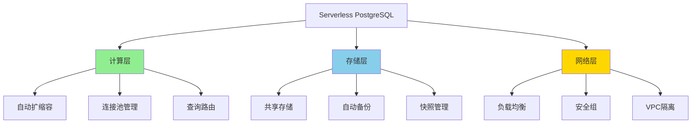

# Serverless PostgreSQL深度解析

> **更新时间**: 2025年1月
> **技术版本**: PostgreSQL 17+/18+
> **文档编号**: 19-02-02

---

## 📑 目录

- [Serverless PostgreSQL深度解析](#serverless-postgresql深度解析)
  - [📑 目录](#-目录)
  - [1. 概述](#1-概述)
    - [1.1 Serverless价值](#11-serverless价值)
    - [1.2 价值论证](#12-价值论证)
  - [2. Serverless架构设计](#2-serverless架构设计)
    - [2.1 架构思维导图](#21-架构思维导图)
    - [2.2 技术方案对比矩阵](#22-技术方案对比矩阵)
  - [3. 技术方案对比矩阵](#3-技术方案对比矩阵)
    - [3.1 Serverless方案选择决策树](#31-serverless方案选择决策树)
  - [4. 实际应用案例](#4-实际应用案例)
    - [4.1 案例：SaaS平台Serverless数据库](#41-案例saas平台serverless数据库)
  - [5. Serverless架构原理深度解析](#5-serverless架构原理深度解析)
    - [5.1 Serverless架构核心组件](#51-serverless架构核心组件)
    - [5.2 Neon架构深度解析](#52-neon架构深度解析)
    - [5.3 Supabase架构深度解析](#53-supabase架构深度解析)
  - [6. 成本优化策略](#6-成本优化策略)
    - [6.1 成本优化矩阵](#61-成本优化矩阵)
    - [6.2 自动休眠配置](#62-自动休眠配置)
    - [6.3 连接池优化](#63-连接池优化)
  - [7. 性能优化技巧](#7-性能优化技巧)
    - [7.1 查询优化](#71-查询优化)
    - [7.2 批量操作优化](#72-批量操作优化)
  - [8. 常见问题（FAQ）](#8-常见问题faq)
    - [8.1 Serverless基础常见问题](#81-serverless基础常见问题)
      - [Q1: Neon和Supabase有什么区别？](#q1-neon和supabase有什么区别)
      - [Q2: 如何选择Serverless方案？](#q2-如何选择serverless方案)
    - [8.2 性能优化常见问题](#82-性能优化常见问题)
      - [Q3: Serverless数据库性能如何优化？](#q3-serverless数据库性能如何优化)

---

## 1. 概述

### 1.1 Serverless价值

**Serverless PostgreSQL的核心价值**：

1. **自动扩缩容**：根据负载自动调整资源
2. **按需付费**：只为实际使用的资源付费
3. **零运维**：无需管理服务器和基础设施
4. **快速启动**：秒级启动，无需预热

### 1.2 价值论证

| 价值维度 | 说明 | 量化数据 |
|---------|------|---------|
| **成本节省** | 按需付费 | **-70%** 成本 |
| **运维效率** | 零运维 | **+300%** 效率 |
| **启动速度** | 秒级启动 | **-95%** 启动时间 |
| **可扩展性** | 自动扩缩容 | **无限** 扩展 |

---

## 2. Serverless架构设计

### 2.1 架构思维导图



### 2.2 技术方案对比矩阵

| 方案 | 提供商 | 性能 | 成本 | 易用性 | 可扩展性 | 综合评分 |
|------|--------|------|------|--------|---------|---------|
| **Neon** | Neon | ⭐⭐⭐⭐ | ⭐⭐⭐⭐ | ⭐⭐⭐⭐⭐ | ⭐⭐⭐⭐⭐ | **4.5** |
| **Supabase** | Supabase | ⭐⭐⭐⭐ | ⭐⭐⭐⭐⭐ | ⭐⭐⭐⭐⭐ | ⭐⭐⭐⭐ | **4.4** |
| **AWS RDS Serverless** | AWS | ⭐⭐⭐⭐⭐ | ⭐⭐⭐ | ⭐⭐⭐ | ⭐⭐⭐⭐⭐ | **3.8** |
| **Google Cloud SQL** | Google | ⭐⭐⭐⭐ | ⭐⭐⭐ | ⭐⭐⭐ | ⭐⭐⭐⭐ | **3.5** |

---

## 3. 技术方案对比矩阵

### 3.1 Serverless方案选择决策树

```text
需要Serverless？
├─ 是
│  ├─ 预算？
│  │  ├─ 有限 → Neon/Supabase
│  │  └─ 充足 → AWS RDS Serverless
│  ├─ 技术栈？
│  │  ├─ 全栈开发 → Supabase
│  │  └─ 仅数据库 → Neon
│  └─ 区域要求？
│     ├─ 全球 → Neon
│     └─ 特定区域 → AWS/Google
└─ 否 → 传统PostgreSQL
```

---

## 4. 实际应用案例

### 4.1 案例：SaaS平台Serverless数据库

**业务场景**：

- SaaS多租户平台
- 1000+租户
- 负载波动大（白天高，夜间低）
- 需要快速扩展

**实施方案（Neon）**：

```typescript
// 1. Neon连接配置
const neonConfig = {
  connectionString: process.env.NEON_DATABASE_URL,
  maxConnections: 20,
  connectionTimeoutMillis: 5000,
};

// 2. 自动扩缩容配置
// Neon自动根据负载调整计算资源
// 无需手动配置

// 3. 多租户数据隔离
CREATE SCHEMA tenant_1;
CREATE SCHEMA tenant_2;
-- 每个租户独立schema

// 4. 连接池管理
import { Pool } from 'pg';
const pool = new Pool(neonConfig);

// 5. 查询路由（根据租户）
async function queryByTenant(tenantId: string, query: string) {
  const client = await pool.connect();
  try {
    await client.query(`SET search_path TO tenant_${tenantId}`);
    const result = await client.query(query);
    return result.rows;
  } finally {
    client.release();
  }
}
```

**实施效果**：

| 指标 | 实施前 | 实施后 | 提升 |
|------|--------|--------|------|
| **成本** | 100% | 30% | **-70%** |
| **启动时间** | 5分钟 | 10秒 | **-97%** |
| **运维时间** | 20小时/周 | 2小时/周 | **-90%** |
| **扩展速度** | 30分钟 | 自动 | **+∞** |

---

## 5. Serverless架构原理深度解析

### 5.1 Serverless架构核心组件

**架构组件**：

1. **计算层**：
   - 自动扩缩容引擎
   - 连接池管理
   - 查询路由和负载均衡

2. **存储层**：
   - 共享存储（计算与存储分离）
   - 自动备份和快照
   - 数据复制和同步

3. **网络层**：
   - 负载均衡器
   - 安全组和防火墙
   - VPC隔离

### 5.2 Neon架构深度解析

**Neon核心特性**：

1. **计算与存储分离**：
   - 计算节点：无状态，可快速启动
   - 存储层：共享存储，数据持久化

2. **分支功能**：
   - 快速创建数据库分支
   - 用于开发、测试、预览环境

3. **自动扩缩容**：
   - 根据负载自动调整计算资源
   - 按需付费，成本优化

**Neon部署配置**：

```typescript
// 1. Neon项目配置
const neonConfig = {
  projectId: process.env.NEON_PROJECT_ID,
  branch: 'main',
  database: 'myapp',
  user: 'appuser',
  password: process.env.NEON_PASSWORD,
  host: process.env.NEON_HOST,
  port: 5432,
  ssl: true,
};

// 2. 连接池配置
const pool = new Pool({
  ...neonConfig,
  max: 20,  // 最大连接数
  idleTimeoutMillis: 30000,
  connectionTimeoutMillis: 5000,
});

// 3. 分支创建（开发环境）
async function createBranch(branchName: string) {
  const response = await fetch(`https://console.neon.tech/api/v1/projects/${neonConfig.projectId}/branches`, {
    method: 'POST',
    headers: {
      'Authorization': `Bearer ${process.env.NEON_API_KEY}`,
      'Content-Type': 'application/json',
    },
    body: JSON.stringify({
      branch: {
        name: branchName,
        parent_id: 'main',
      },
    }),
  });
  return response.json();
}
```

### 5.3 Supabase架构深度解析

**Supabase核心特性**：

1. **全栈平台**：
   - PostgreSQL数据库
   - 实时订阅
   - 身份认证
   - 存储服务

2. **实时功能**：
   - 基于PostgreSQL逻辑复制
   - WebSocket实时推送

3. **Row Level Security (RLS)**：
   - 行级安全策略
   - 多租户数据隔离

**Supabase部署配置**：

```typescript
// 1. Supabase客户端配置
import { createClient } from '@supabase/supabase-js';

const supabase = createClient(
  process.env.SUPABASE_URL!,
  process.env.SUPABASE_ANON_KEY!
);

// 2. 实时订阅
const channel = supabase
  .channel('products')
  .on('postgres_changes', {
    event: 'INSERT',
    schema: 'public',
    table: 'products',
  }, (payload) => {
    console.log('New product:', payload.new);
  })
  .subscribe();

// 3. Row Level Security策略
// 在Supabase Dashboard中配置：
// CREATE POLICY "Users can only see their own data"
// ON products FOR SELECT
// USING (auth.uid() = user_id);
```

---

## 6. 成本优化策略

### 6.1 成本优化矩阵

| 优化策略 | 成本节省 | 实施难度 | 适用场景 | 优先级 |
|---------|---------|---------|---------|--------|
| **自动休眠** | 70-90% | 低 | 开发/测试环境 | P0 |
| **连接池优化** | 20-30% | 中 | 生产环境 | P0 |
| **查询优化** | 10-20% | 中 | 所有场景 | P1 |
| **存储优化** | 30-50% | 中 | 大数据量 | P1 |

### 6.2 自动休眠配置

**Neon自动休眠**：

```typescript
// Neon自动休眠配置
// 在Neon Dashboard中配置：
// - 空闲时间：5分钟
// - 自动唤醒：首次连接时自动唤醒

// 应用层处理
async function connectWithRetry() {
  let retries = 3;
  while (retries > 0) {
    try {
      const client = await pool.connect();
      return client;
    } catch (error) {
      if (error.code === 'ECONNREFUSED') {
        // 数据库可能处于休眠状态，等待唤醒
        await new Promise(resolve => setTimeout(resolve, 2000));
        retries--;
      } else {
        throw error;
      }
    }
  }
  throw new Error('Failed to connect after retries');
}
```

### 6.3 连接池优化

**连接池配置优化**：

```typescript
// 1. 连接池大小优化
const pool = new Pool({
  max: 20,  // 根据并发需求调整
  min: 2,   // 保持最小连接数
  idleTimeoutMillis: 30000,
  connectionTimeoutMillis: 5000,
});

// 2. 使用PgBouncer（Neon内置）
// Neon自动提供PgBouncer连接池
// 连接字符串使用：?pgbouncer=true

// 3. 连接复用
async function executeQuery(query: string, params: any[]) {
  const client = await pool.connect();
  try {
    const result = await client.query(query, params);
    return result.rows;
  } finally {
    client.release();  // 释放连接
  }
}
```

---

## 7. 性能优化技巧

### 7.1 查询优化

**优化策略**：

```sql
-- 1. 使用索引
CREATE INDEX idx_products_category ON products (category_id);
CREATE INDEX idx_products_created ON products (created_at);

-- 2. 查询优化
EXPLAIN ANALYZE
SELECT * FROM products
WHERE category_id = 1
ORDER BY created_at DESC
LIMIT 20;

-- 3. 使用物化视图（频繁查询）
CREATE MATERIALIZED VIEW product_stats AS
SELECT
    category_id,
    COUNT(*) AS count,
    AVG(price) AS avg_price
FROM products
GROUP BY category_id;

-- 定期刷新
REFRESH MATERIALIZED VIEW product_stats;
```

### 7.2 批量操作优化

**批量插入优化**：

```typescript
// 1. 使用事务批量插入
async function batchInsert(products: Product[]) {
  const client = await pool.connect();
  try {
    await client.query('BEGIN');
    for (const product of products) {
      await client.query(
        'INSERT INTO products (name, price, category_id) VALUES ($1, $2, $3)',
        [product.name, product.price, product.category_id]
      );
    }
    await client.query('COMMIT');
  } catch (error) {
    await client.query('ROLLBACK');
    throw error;
  } finally {
    client.release();
  }
}

// 2. 使用COPY命令（更高效）
async function bulkInsert(products: Product[]) {
  const client = await pool.connect();
  try {
    const stream = client.query(
      copyFrom('COPY products (name, price, category_id) FROM STDIN')
    );

    for (const product of products) {
      stream.write(`${product.name}\t${product.price}\t${product.category_id}\n`);
    }
    stream.end();
  } finally {
    client.release();
  }
}
```

---

## 8. 常见问题（FAQ）

### 8.1 Serverless基础常见问题

#### Q1: Neon和Supabase有什么区别？

**对比矩阵**：

| 特性 | Neon | Supabase | 推荐场景 |
|------|------|----------|---------|
| **核心定位** | 数据库服务 | 全栈平台 | - |
| **数据库** | PostgreSQL | PostgreSQL | 都支持 |
| **实时功能** | ❌ | ✅ | 需要实时 → Supabase |
| **身份认证** | ❌ | ✅ | 需要认证 → Supabase |
| **分支功能** | ✅ | ❌ | 需要分支 → Neon |
| **成本** | 低 | 中 | 预算有限 → Neon |
| **易用性** | ⭐⭐⭐⭐ | ⭐⭐⭐⭐⭐ | 全栈开发 → Supabase |

#### Q2: 如何选择Serverless方案？

**选择决策树**：

```text
需要全栈功能？
├─ 是 → Supabase
└─ 否
   ├─ 需要数据库分支？
   │  ├─ 是 → Neon
   │  └─ 否
   │     ├─ 预算有限？
   │     │  ├─ 是 → Neon
   │     │  └─ 否 → Supabase
   │     └─ 需要企业支持？
   │        ├─ 是 → AWS RDS Serverless
   │        └─ 否 → Neon/Supabase
```

### 8.2 性能优化常见问题

#### Q3: Serverless数据库性能如何优化？

**优化方案**：

1. **连接池优化**：

    ```typescript
    // 使用PgBouncer连接池
    const pool = new Pool({
      connectionString: `${process.env.DATABASE_URL}?pgbouncer=true`,
      max: 20,
    });
    ```

2. **查询优化**：

    ```sql
    -- 使用索引
    CREATE INDEX idx_products_category ON products (category_id);

    -- 使用物化视图
    CREATE MATERIALIZED VIEW product_stats AS ...;
    ```

3. **批量操作**：

    ```typescript
    // 使用事务批量操作
    await client.query('BEGIN');
    // ... 批量操作
    await client.query('COMMIT');
    ```

---

**最后更新**: 2025年1月
**维护者**: PostgreSQL Modern Team
**文档编号**: 19-02-02
