# 现代PostgreSQL高可用架构设计

> **更新时间**: 2025年1月
> **技术版本**: PostgreSQL 17+/18+
> **文档编号**: 19-04-01

---

## 📑 目录

- [现代PostgreSQL高可用架构设计](#现代postgresql高可用架构设计)
  - [📑 目录](#-目录)
  - [1. 概述](#1-概述)
    - [1.1 现代高可用趋势](#11-现代高可用趋势)
    - [1.2 高可用价值论证](#12-高可用价值论证)
  - [2. 高可用方案对比矩阵](#2-高可用方案对比矩阵)
    - [2.1 工具对比矩阵](#21-工具对比矩阵)
    - [2.2 架构方案对比矩阵](#22-架构方案对比矩阵)
  - [3. 架构设计决策树](#3-架构设计决策树)
  - [4. 生产级架构设计](#4-生产级架构设计)
    - [4.1 Patroni高可用架构](#41-patroni高可用架构)
  - [5. 实际应用案例](#5-实际应用案例)
    - [5.1 案例：金融交易系统高可用架构](#51-案例金融交易系统高可用架构)
  - [6. pg\_auto\_failover架构设计](#6-pg_auto_failover架构设计)
    - [6.1 pg\_auto\_failover配置](#61-pg_auto_failover配置)
    - [6.2 多区域高可用架构](#62-多区域高可用架构)
  - [7. 读写分离架构](#7-读写分离架构)
    - [7.1 读写分离配置](#71-读写分离配置)
    - [7.2 智能路由](#72-智能路由)
  - [8. 常见问题（FAQ）](#8-常见问题faq)
    - [8.1 高可用架构基础常见问题](#81-高可用架构基础常见问题)
      - [Q1: 如何选择高可用方案？](#q1-如何选择高可用方案)
      - [Q2: 如何实现多区域高可用？](#q2-如何实现多区域高可用)
    - [8.2 高可用性能优化常见问题](#82-高可用性能优化常见问题)
      - [Q3: 如何优化高可用架构性能？](#q3-如何优化高可用架构性能)

---

## 1. 概述

### 1.1 现代高可用趋势

**2024-2025趋势**：

1. **自动化故障转移**：故障恢复时间 < 30秒
2. **多区域部署**：跨区域高可用
3. **读写分离优化**：智能路由
4. **云原生集成**：Kubernetes Operator

### 1.2 高可用价值论证

| 价值维度 | 说明 | 量化数据 |
|---------|------|---------|
| **可用性** | 自动故障恢复 | **99.9%** 可用性 |
| **恢复时间** | 快速故障恢复 | **< 30秒** |
| **数据一致性** | 强一致性保证 | **100%** |
| **运维成本** | 自动化运维 | **-70%** 成本 |

---

## 2. 高可用方案对比矩阵

### 2.1 工具对比矩阵

| 工具 | 故障恢复时间 | 数据一致性 | 运维复杂度 | 成本 | 可扩展性 | 综合评分 |
|------|------------|-----------|-----------|------|---------|---------|
| **Patroni** | < 30秒 | ⭐⭐⭐⭐⭐ | ⭐⭐⭐ | ⭐⭐⭐⭐ | ⭐⭐⭐⭐ | **4.1** |
| **pg_auto_failover** | < 1分钟 | ⭐⭐⭐⭐⭐ | ⭐⭐⭐⭐⭐ | ⭐⭐⭐⭐⭐ | ⭐⭐⭐ | **4.3** |
| **Citus** | < 1分钟 | ⭐⭐⭐⭐ | ⭐⭐⭐⭐ | ⭐⭐⭐ | ⭐⭐⭐⭐⭐ | **3.8** |
| **repmgr** | < 2分钟 | ⭐⭐⭐⭐ | ⭐⭐⭐ | ⭐⭐⭐⭐ | ⭐⭐⭐ | **3.5** |

### 2.2 架构方案对比矩阵

| 架构方案 | 可用性 | 性能 | 成本 | 复杂度 | 适用规模 | 综合评分 |
|---------|--------|------|------|--------|---------|---------|
| **主从复制** | 99.9% | ⭐⭐⭐⭐ | ⭐⭐⭐⭐⭐ | ⭐⭐ | 中小型 | **3.8** |
| **Patroni集群** | 99.99% | ⭐⭐⭐⭐ | ⭐⭐⭐⭐ | ⭐⭐⭐ | 中大型 | **4.1** |
| **Citus分布式** | 99.99% | ⭐⭐⭐⭐⭐ | ⭐⭐⭐ | ⭐⭐⭐⭐ | 超大型 | **4.0** |
| **多区域部署** | 99.999% | ⭐⭐⭐⭐ | ⭐⭐ | ⭐⭐⭐⭐⭐ | 大型 | **3.5** |

---

## 3. 架构设计决策树

```text
需要高可用？
├─ 是
│  ├─ 数据规模？
│  │  ├─ 小型（< 100GB） → 主从复制
│  │  ├─ 中型（100GB-1TB） → Patroni集群
│  │  └─ 大型（> 1TB） → Citus分布式
│  ├─ 故障恢复时间要求？
│  │  ├─ < 30秒 → Patroni
│  │  ├─ < 1分钟 → pg_auto_failover
│  │  └─ < 5分钟 → repmgr
│  └─ 区域要求？
│     ├─ 单区域 → 本地高可用
│     └─ 多区域 → 跨区域高可用
└─ 否 → 单机部署
```

---

## 4. 生产级架构设计

### 4.1 Patroni高可用架构

```mermaid
graph TD
    A[应用层] --> B[HAProxy负载均衡]
    B --> C1[PostgreSQL主节点]
    B --> C2[PostgreSQL从节点1]
    B --> C3[PostgreSQL从节点2]
    C1 --> D[流复制]
    D --> C2
    D --> C3
    C1 --> E[Patroni]
    C2 --> E
    C3 --> E
    E --> F[etcd/ZooKeeper]

    style C1 fill:#90EE90
    style E fill:#87CEEB
    style F fill:#FFD700
```



**架构特点**：

- 自动故障转移
- 强一致性保证
- 读写分离

---

## 5. 实际应用案例

### 5.1 案例：金融交易系统高可用架构

**业务场景**：

- 金融交易系统
- 每秒10万+交易
- 99.99%可用性要求
- 零数据丢失

**实施方案**：

```yaml
# Patroni配置
scope: finance-cluster
namespace: /db/
name: postgres-primary

restapi:
  listen: 0.0.0.0:8008
  connect_address: 10.0.1.10:8008

etcd:
  hosts: 10.0.1.20:2379,10.0.1.21:2379,10.0.1.22:2379

bootstrap:
  dcs:
    ttl: 30
    loop_wait: 10
    retry_timeout: 30
    maximum_lag_on_failover: 1048576
    postgresql:
      use_pg_rewind: true
      parameters:
        wal_level: replica
        max_wal_senders: 10
        synchronous_commit: on
        synchronous_standby_names: 'ANY 2 (standby1, standby2)'

postgresql:
  listen: 0.0.0.0:5432
  connect_address: 10.0.1.10:5432
  data_dir: /var/lib/postgresql/17/main
  authentication:
    replication:
      username: replicator
      password: replicator_password
```

**HAProxy配置**：

```haproxy
global
    log /dev/log local0
    maxconn 100

defaults
    log global
    mode tcp
    timeout connect 5000ms
    timeout client 50000ms
    timeout server 50000ms

frontend postgresql_frontend
    bind *:5432
    default_backend postgresql_backend

backend postgresql_backend
    option pgsql-check user postgres
    server postgresql1 10.0.1.10:5432 check
    server postgresql2 10.0.1.11:5432 check backup
    server postgresql3 10.0.1.12:5432 check backup
```

**实施效果**：

| 指标 | 实施前 | 实施后 | 提升 |
|------|--------|--------|------|
| **可用性** | 99.5% | 99.99% | **+0.49%** |
| **故障恢复时间** | 15分钟 | 25秒 | **-97%** |
| **数据丢失风险** | 中等 | 零丢失 | **-100%** |
| **交易处理能力** | 5万TPS | 10万TPS | **2x** |

---

## 6. pg_auto_failover架构设计

### 6.1 pg_auto_failover配置

**pg_auto_failover配置示例**：

```bash
# 1. 初始化Monitor节点
pg_autoctl create monitor \
  --pgdata /var/lib/postgresql/monitor \
  --pgport 5432 \
  --pgctl /usr/lib/postgresql/17/bin/pg_ctl \
  --run

# 2. 初始化主节点
pg_autoctl create postgres \
  --pgdata /var/lib/postgresql/primary \
  --pgport 5433 \
  --monitor 'postgres://autoctl_node@monitor:5432/pg_auto_failover' \
  --pgctl /usr/lib/postgresql/17/bin/pg_ctl \
  --run

# 3. 添加从节点
pg_autoctl create postgres \
  --pgdata /var/lib/postgresql/standby \
  --pgport 5434 \
  --monitor 'postgres://autoctl_node@monitor:5432/pg_auto_failover' \
  --pgctl /usr/lib/postgresql/17/bin/pg_ctl \
  --run
```

### 6.2 多区域高可用架构

**跨区域部署配置**：

```yaml
# 主区域（US-East）
scope: postgres-cluster-us
name: postgres-primary-us

etcd:
  hosts: us-etcd-1:2379,us-etcd-2:2379,us-etcd-3:2379

postgresql:
  connect_address: us-postgres-1:5432

# 备区域（EU-West）
scope: postgres-cluster-eu
name: postgres-standby-eu

etcd:
  hosts: eu-etcd-1:2379,eu-etcd-2:2379,eu-etcd-3:2379

postgresql:
  connect_address: eu-postgres-1:5432
```

---

## 7. 读写分离架构

### 7.1 读写分离配置

**使用HAProxy实现读写分离**：

```haproxy
global
    log /dev/log local0
    maxconn 100

defaults
    log global
    mode tcp
    timeout connect 5000ms
    timeout client 50000ms
    timeout server 50000ms

# 写服务（主节点）
frontend postgresql_write
    bind *:5432
    default_backend postgresql_primary

backend postgresql_primary
    option pgsql-check user postgres
    server postgresql1 10.0.1.10:5432 check

# 读服务（从节点）
frontend postgresql_read
    bind *:5433
    default_backend postgresql_replicas
    balance roundrobin

backend postgresql_replicas
    option pgsql-check user postgres
    server postgresql2 10.0.1.11:5432 check
    server postgresql3 10.0.1.12:5432 check
```

### 7.2 智能路由

**应用层路由配置**：

```typescript
// 读写分离路由
const writePool = new Pool({
  host: 'postgresql-write.example.com',
  port: 5432,
  database: 'mydb',
});

const readPool = new Pool({
  host: 'postgresql-read.example.com',
  port: 5433,
  database: 'mydb',
});

// 查询路由函数
async function query(sql: string, params: any[], isWrite: boolean = false) {
  const pool = isWrite ? writePool : readPool;
  return pool.query(sql, params);
}
```

---

## 8. 常见问题（FAQ）

### 8.1 高可用架构基础常见问题

#### Q1: 如何选择高可用方案？

**选择决策矩阵**：

| 场景 | Patroni | pg_auto_failover | repmgr | 推荐 |
|------|---------|------------------|--------|------|
| **故障恢复时间 < 30秒** | ⭐⭐⭐⭐⭐ | ⭐⭐⭐⭐ | ⭐⭐⭐ | Patroni |
| **配置简单** | ⭐⭐⭐ | ⭐⭐⭐⭐⭐ | ⭐⭐⭐ | pg_auto_failover |
| **功能完整** | ⭐⭐⭐⭐⭐ | ⭐⭐⭐⭐ | ⭐⭐⭐ | Patroni |
| **成本敏感** | ⭐⭐⭐⭐ | ⭐⭐⭐⭐⭐ | ⭐⭐⭐⭐ | pg_auto_failover |

#### Q2: 如何实现多区域高可用？

**解决方案**：

1. **跨区域流复制**：

    ```sql
    -- 主区域配置
    ALTER SYSTEM SET wal_level = replica;
    ALTER SYSTEM SET max_wal_senders = 10;

    -- 备区域配置
    -- 使用pg_basebackup从主区域备份
    ```

2. **使用逻辑复制**（推荐）：

    ```sql
    -- 主区域
    CREATE PUBLICATION global_publication FOR ALL TABLES;

    -- 备区域
    CREATE SUBSCRIPTION eu_subscription
    CONNECTION 'host=us-postgres.example.com port=5432 user=replicator password=xxx dbname=mydb'
    PUBLICATION global_publication;
    ```

### 8.2 高可用性能优化常见问题

#### Q3: 如何优化高可用架构性能？

**优化方案**：

1. **同步复制优化**：

    ```yaml
    synchronous_standby_names: "ANY 2 (standby1, standby2)"
    # 允许任意2个从节点同步，提高性能
    ```

2. **读写分离**：

    ```yaml
    # 使用HAProxy实现读写分离
    # 写请求路由到主节点
    # 读请求路由到从节点
    ```

3. **连接池优化**：

```yaml
# 使用PgBouncer连接池
# 减少连接开销
```

---

**最后更新**: 2025年1月
**维护者**: PostgreSQL Modern Team
**文档编号**: 19-04-01
