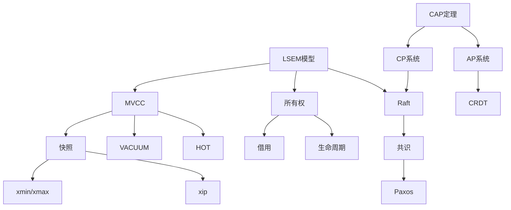

# 01 | 核心概念词典

> **工具定位**: 本文档提供所有核心概念的权威定义，支持快速查阅和准确理解。

---

## 📑 目录

- [01 | 核心概念词典](#01--核心概念词典)
  - [📑 目录](#-目录)
  - [零、概念词条规范](#零概念词条规范)
  - [一、按字母排序](#一按字母排序)
    - [A-C](#a-c)
    - [H-M](#h-m)
    - [P-Z](#p-z)
  - [二、按主题分类](#二按主题分类)
    - [并发控制](#并发控制)
    - [分布式系统](#分布式系统)
    - [Rust并发](#rust并发)
  - [三、完整词条列表（按字母排序）](#三完整词条列表按字母排序)
    - [A](#a)
    - [B](#b)
    - [C](#c)
    - [D](#d)
    - [E](#e)
    - [F](#f)
    - [G](#g)
    - [H](#h)
    - [I](#i)
    - [L](#l)
    - [M](#m)
    - [O](#o)
    - [P](#p)
    - [R](#r)
    - [S](#s)
    - [T](#t)
    - [V](#v)
    - [W](#w)
    - [X](#x)
  - [四、快速查找索引](#四快速查找索引)
    - [按技术领域](#按技术领域)
    - [按应用场景](#按应用场景)
  - [五、概念关系图](#五概念关系图)
  - [六、扩展阅读指南](#六扩展阅读指南)

---

## 零、概念词条规范

为避免不同文档中对同一概念给出略有差异甚至互相矛盾的定义，本词典中的**每个核心概念**都尽量遵循统一结构：

- **权威定义**：引用或对齐 ANSI SQL / ACM / Wikipedia / 教科书等的标准表述，给出最小必要、可验证的定义。
- **本体系定义**：在 LSEM 模型和本项目语境下，对概念做精炼重述，说明它在 TCDT 中处于哪一层、扮演什么角色。
- **正向示例**：给出 1 个典型的“正确使用/正确理解”场景，最好能落到 SQL / 代码 / 实际系统行为。
- **反例与常见误解**：指出 1–2 个在工业界/网络上常见的误解或错误用法，解释为什么不符合权威定义。
- **关联文档与可视化**：链接到对应的核心理论文档、思维导图、概念关系图、多维矩阵、证明树等，形成多重表征。

> 后续在检查和修订各模块时，可以以本词典为“唯一真源”：
>
> - 当发现某文档中的表述与这里不一致时，应优先以词典为准，或先在此处修正后再同步到其他文档。

---

## 一、按字母排序

### A-C

**ACID**:

- **权威定义**：数据库事务应当具备原子性 (Atomicity)、一致性 (Consistency)、隔离性 (Isolation)、持久性 (Durability) 四个属性，用于保证并发和故障下的数据正确性。
- **本体系定义**：在 LSEM 模型下，ACID 是对「状态从一个一致快照安全演化到另一个一致快照」的约束集合，分别约束状态转换的“全或无”“不变量保持”“并发视图隔离”“崩溃后可恢复”四个维度。
- **正向示例**：
- 银行转账事务
- `UPDATE accounts SET balance = balance - 100 WHERE id = A;`
- `UPDATE accounts SET balance = balance + 100 WHERE id = B; COMMIT;`
- 在系统崩溃/并发读写下，始终保证总余额守恒、要么两条 UPDATE 都生效要么都不生效、外部读到的中间状态被隔离、崩溃恢复后已提交结果仍然存在。

- **反例与常见误解**：
  - 误解1：「ACID 只与数据库实现有关，与业务无关」—— 实际上，一致性 (C) 中的大部分约束来自**业务不变量**，数据库只负责不打破这些约束。
  - 误解2：「只要用了事务就是强一致」—— 若隔离级别选择错误（如在需要可重复读/串行化的报表中使用 Read Committed），仍然可能出现不可重复读/写偏斜等违背直觉的一致性问题。
- **关联文档与可视化**：
  - 理论：`01-核心理论模型/03-ACID理论与实现.md`
  - 设计权衡：`02-设计权衡分析/02-隔离级别权衡矩阵.md`
  - 可视化：`07-可视化与思维模型/01-核心思维导图集.md` 中的 ACID 导图；`02-概念关系图集.md` 中 ACID 概念网络

**Arc<T>** (Rust)

- **权威定义**：
- Rust 标准库中的原子引用计数智能指针类型，允许在多个线程之间安全地共享同一份只读或通过内部可变性封装的所有权。
- **本体系定义**：
- 在本体系的 Rust 并发语境中，`Arc<T>` 用于在 L1 运行时层安全地共享状态，是「所有权 + 并发」桥接的基础构件之一，通常与 `Mutex<T>` / `RwLock<T>` 组合为高层并发原语。
- **正向示例**：
  - 在多线程 HTTP 服务中使用 `Arc<DbPool>` 共享数据库连接池，线程只持有克隆的 `Arc` 句柄，避免拷贝底层资源。
- **反例与常见误解**：
  - 误解1：「有了 Arc 就自动线程安全」—— 实际上 `Arc<T>` 只保证指针本身的引用计数是线程安全的，内部 `T` 若被可变访问仍需 `Mutex`/`RwLock` 等同步原语。
  - 误解2：「Arc 适合任意场景」—— 对高频短生命周期对象滥用 Arc 会引入不必要的原子操作开销，应根据访问模式权衡。
- **关联文档与可视化**：
  - 理论：`01-核心理论模型/06-所有权模型(Rust).md`
  - 设计：`02-设计权衡分析/05-Rust并发原语选型矩阵.md`
  - 可视化：`07-可视化与思维模型/03-决策树图集.md` 中 Rust 并发原语决策树

**CAP定理**:

- **权威定义**：在存在网络分区 (P) 的前提下，分布式系统不可能同时完全满足强一致性 (C) 和高可用性 (A)，任何实际系统都只能在 C 与 A 之间进行权衡。
- **本体系定义**：在 LSEM 的 L2 层，CAP 定理刻画了「跨节点状态演化」时在**可见性偏序**与**请求可达性**之间的根本约束，是分布式并发控制和复制协议设计的边界条件。
- **正向示例**：
  - Spanner / 传统分布式数据库：在分区时宁可牺牲可用性（阻塞一部分写入），以维护强一致性 (CP 系统)。
  - 某些 Key-Value 存储 / 缓存：在分区时继续服务（AP 系统），接受短时间内的数据不一致。
- **反例与常见误解**：
  - 误解1：「CAP 三选二，平时可以同时满足 CAP」—— 正确说法是在**发生网络分区时**，无法同时强 C 和强 A；在没有分区时并不存在硬性冲突。
  - 误解2：「选择了 CP 就没有可用性问题」—— 实际上 CP 系统在分区期间会通过拒绝请求来保证 C，本质上是牺牲了可用性的一部分。
- **关联文档与可视化**：
  - 理论：`01-核心理论模型/04-CAP理论与权衡.md`
  - 设计权衡：`02-设计权衡分析/03-CAP权衡矩阵.md`
  - 工具：`11-工具与自动化/03-CAP权衡分析器.md`
  - 可视化：`07-可视化与思维模型/01-核心思维导图集.md` 中 CAP 导图；`02-概念关系图集.md` 中 CAP 概念三角

**CCaaLF (Concurrency Control as a Learnable Function)**:

- **定义**: 学习型并发控制，使用机器学习优化并发控制策略
- **核心**: 将并发控制决策建模为学习问题 $f: \text{Workload} \rightarrow \text{Strategy}$
- **性能**: 相比传统方法提升12-56%
- **相关**: [09-学习型并发控制(CCaaLF).md](../10-前沿研究方向/09-学习型并发控制(CCaaLF).md)

---

### H-M

**happens-before**:

- **权威定义**：在并发程序的内存模型中，`happens-before` 是一个偏序关系，用于刻画事件之间的因果先后顺序；若 A happens-before B，则 B 必须能观察到 A 的所有效果。
- **本体系定义**：在 L1 运行时层，`happens-before` 统一抽象了语言内存模型、锁/原子操作/消息传递所建立的可见性约束，是我们讨论数据竞争、可见性与重排序合法性的基础关系。
- **正向示例**：
  - 在 Rust 中，一个线程对 `AtomicBool` 的 `store(true, Ordering::Release)` 与另一线程对同一变量的 `load(Ordering::Acquire)` 之间建立了 `happens-before`，保证前者写入的相关数据对后者可见。
- **反例与常见误解**：
  - 误解1：「按时间先后执行就一定 happens-before」—— 实际上没有同步的并发操作可能在硬件上乱序执行，时间先后并不等价于内存模型中的 happens-before。
  - 误解2：「只要没有数据竞争就一定有顺序」—— 无数据竞争保证的是行为可归约为某个顺序执行，但具体哪些事件有 happens-before 仍需根据同步原语判断。
- **关联文档与可视化**：
  - 理论：`01-核心理论模型/07-内存模型与排序.md`
  - 可视化：`07-可视化与思维模型/05-状态转换图集.md` 中内存事件偏序图

**HOT (Heap-Only Tuple)**:

- **权威定义**：PostgreSQL MVCC 中的性能优化机制，允许 UPDATE 操作在满足特定条件时，在同页内创建新版本而不更新索引，从而减少索引写放大，提升 UPDATE 性能。
- **本体系定义**：在 L0 存储层，HOT 优化通过同页内版本链（通过 ctid 指针连接）和索引指向链头的机制，将索引写操作从 $O(n)$ 优化为 $0$（n 为索引数量），是减少 MVCC 写放大的关键优化。
- **正向示例**：
  - 更新非索引列：`UPDATE users SET email='new@example.com' WHERE id=1;`（id 是主键索引列，email 不是索引列），若新版本在同一页且有空间，则触发 HOT 更新，索引仍指向旧版本位置，通过 HOT 链访问新版本，无需更新索引。
- **反例与常见误解**：
  - 误解1：「HOT 适用于所有 UPDATE」—— 实际上需要满足：未修改索引列、新版本在同一页、页面有足够空间；修改索引列或跨页更新无法使用 HOT。
  - 误解2：「HOT 会降低查询性能」—— 实际上 HOT 链遍历开销很小（1-10μs），而索引更新开销更大（10-100μs per index），HOT 整体提升性能 2-10×。
- **关联文档与可视化**：
  - 理论：`01-核心理论模型/02-MVCC理论完整解析.md` 中 HOT 部分
  - 实现：`05-实现机制/01-PostgreSQL-MVCC实现.md`
  - 可视化：`07-可视化与思维模型/04-流程图集.md` 中 HOT 更新流程；`02-概念关系图集.md` 中 HOT 与版本链关系

**Hazard Pointers (危险指针)**:

- **定义**: 无锁数据结构中的内存回收技术
- **机制**: 线程标记正在访问的指针，延迟释放
- **相关**: [06-无锁算法性能分析.md](../06-性能分析/06-无锁算法性能分析.md)

**HLC (Hybrid Logical Clock)**:

- **权威定义**：混合逻辑时钟，将物理时间戳与逻辑计数器结合，既近似真实时间顺序，又在网络延迟和时钟漂移下维持因果关系的偏序。
- **本体系定义**：在 L2 分布式层，HLC 是用来统一「物理时间感知」和「逻辑因果顺序」的时钟机制，方便在分布式事务、MVCC 版本戳和日志排序中折中精度、单调性和可实现性。
- **正向示例**：
  - 分布式数据库用 HLC 标记事务提交时间，使得“最近提交”的语义同时接近真实时间，又能在消息乱序时保持单调递增。
- **反例与常见误解**：
  - 误解1：「用了 HLC 就等价于全局精确时间」—— HLC 仍受底层物理时钟误差限制，只是缓和了完全逻辑时钟与完全物理时钟的不足。
  - 误解2：「HLC 能单独保证强一致性」—— HLC 只是时间/顺序工具，真正的一致性仍要依赖共识协议和并发控制机制。
- **关联文档与可视化**：
  - 理论：`04-分布式扩展/04-时钟同步(HLC_TrueTime).md`
  - 可视化：`07-可视化与思维模型/05-状态转换图集.md` 中时钟演化图；`02-概念关系图集.md` 中 HLC 与 MVCC/CAP 关系

**LSEM (Layered State Evolution Model)**:

- **定义**: 分层状态演化模型，本体系的核心元模型
- **层次**: L0(存储) + L1(运行时) + L2(分布式)
- **相关**: [01-分层状态演化模型(LSEM).md](../01-核心理论模型/01-分层状态演化模型(LSEM).md)

**MVCC (Multi-Version Concurrency Control)**:

- **权威定义**：一种并发控制机制，通过为同一逻辑记录保留多个版本，让读操作在无需阻塞写操作的情况下读取某一时间点的一致性快照，从而减少锁冲突并提高并发度。
- **本体系定义**：在 LSEM 的 L0 层，MVCC 通过「版本链 + 可见性谓词」实现对物理状态的时间切片，使上层事务能在逻辑上看到**偏序化的快照序列**，是本体系中连接 ACID、隔离级别与实现细节的核心桥梁。
- **正向示例**：
  - PostgreSQL 中一行记录在多次 UPDATE 后形成 `(xmin, xmax)` 链，Read Committed/Repeatable Read 事务通过快照 `(xmin_snap, xmax_snap, xip)` 的规则选择可见版本，实现读写并发且读不阻塞写。
- **反例与常见误解**：
  - 误解1：「用了 MVCC 就自动等价于串行化」—— 实际上标准 MVCC+SI 只保证快照隔离，还可能出现写偏斜，需要 SSI 等机制补足。
  - 误解2：「MVCC 一定不需要锁」—— MVCC 减少的是**读写锁冲突**，但在更新、约束检查、索引结构维护等场景仍然需要锁或类似机制。
- **关联文档与可视化**：
  - 理论：`01-核心理论模型/02-MVCC理论完整解析.md`
  - 形式化：`03-证明与形式化/02-MVCC正确性证明.md`
  - 实现：`05-实现机制/01-PostgreSQL-MVCC实现.md`
  - 可视化：`07-可视化与思维模型/01-核心思维导图集.md` 中 MVCC 导图；`02-概念关系图集.md` 中 MVCC 概念网络；`07-MVCC可视化调试器.md`

---

### P-Z

**Percolator**:

- **定义**: Google的分布式MVCC模型，基于Bigtable
- **机制**: 两阶段提交 + 分布式锁
- **相关**: [01-分布式MVCC(Percolator).md](../04-分布式扩展/01-分布式MVCC(Percolator).md)

**Raft**:

- **权威定义**：一种为提高可理解性而设计的分布式共识算法，通过 Leader 选举、日志复制和安全性规则在不可信网络环境中实现状态机复制。
- **本体系定义**：在 L2 分布式层，Raft 是我们分析「强一致复制 + 故障容忍」的基准协议，对理解 CAP 取舍、线性一致性和分布式事务提交的底层保障至关重要。
- **正向示例**：
  - 分布式 KV 存储使用 Raft 复制写操作日志，客户端只与 Leader 交互，确保在多数派节点存活的前提下读写结果线性一致。
- **反例与常见误解**：
  - 误解1：「用了 Raft 就天然高可用」—— 实际可用性还依赖故障模型、超时/选举参数和运维实践，错误配置可能导致频繁选主、整体抖动。
  - 误解2：「Raft 只能做强一致写、读一定要走 Leader」—— 可通过 ReadIndex 等机制在不牺牲线性一致性的前提下从 Follower 读，权衡性能与复杂度。
- **关联文档与可视化**：
  - 理论：`01-核心理论模型/08-共识协议理论.md`
  - 案例：`09-工业案例库/07-分布式缓存.md`
  - 可视化：`07-可视化与思维模型/04-流程图集.md` 中 Raft 选主/复制流程；`05-状态转换图集.md` 中 Leader/Follower 状态机

**Snapshot (快照)**:

- **权威定义**：数据库在某一逻辑时间点上，对所有数据对象的一个一致性视图；在事务隔离语义中，用于定义“事务所见的世界”。
- **本体系定义**：在 L0 MVCC 模型中，一个快照由三元组 $(xmin, xmax, xip)$ 表示：可见事务 ID 下界、上界以及活动事务集合，决定了版本链上哪些版本对当前读操作可见。
- **正向示例**：
  - PostgreSQL 的 `SnapshotData` 结构，以及 `HeapTupleSatisfiesMVCC` 函数根据 `(xmin, xmax, xip)` 判断一个元组版本是否对当前事务可见。
- **反例与常见误解**：
  - 误解1：「快照就是某个时间点的数据拷贝」—— 实际实现中通常不做物理拷贝，而是通过版本链和可见性规则**逻辑上**构造视图。
  - 误解2：「Repeatable Read 每条语句都有自己的快照」—— 在 PostgreSQL 中，Repeatable Read 使用**事务级快照**，所有语句共享同一个快照。
- **关联文档与可视化**：
  - 理论：`01-核心理论模型/02-MVCC理论完整解析.md`
  - 证明：`03-证明与形式化/02-MVCC正确性证明.md` 中的可见性谓词与不变式
  - 可视化：`07-可视化与思维模型/04-流程图集.md` 中 MVCC 可见性流程；`05-状态转换图集.md` 中版本状态演化图

**SSI (Serializable Snapshot Isolation)**:

- **权威定义**：一种在快照隔离之上，通过检测依赖图中的“危险结构”并强制回滚部分事务，从而保证执行结果等价于某个串行执行的并发控制机制。
- **本体系定义**：在本体系中，SSI 被视为从「快照隔离 SI」到「可串行化调度」的修正层，通过对读写依赖关系的在线分析，将允许写偏斜的 SI 调度削减为符合冲突可串行化/视图可串行化约束的子集。
- **正向示例**：
  - PostgreSQL Serializable 隔离级别下，对经典写偏斜场景（例如两医生并发排班修改不同行）触发 `serialization_failure` 错误，要求客户端重试。
- **反例与常见误解**：
  - 误解1：「Serializable = 全局大锁」—— 实际实现是基于依赖图与事务回滚，而非简单地串行执行所有事务。
  - 误解2：「SSI 可以消除所有异常」—— SSI 目标是实现串行化，但仍需要正确的实现和参数配置；错误实现/参数可能导致漏检。
- **关联文档与可视化**：
  - 理论：`01-核心理论模型/02-MVCC理论完整解析.md` 中 SSI 部分
  - 证明：`03-证明与形式化/03-串行化证明.md`
  - 可视化：`07-可视化与思维模型/03-决策树图集.md` 中隔离级别决策树；`08-证明树图集.md` 中串行化证明图

**TPC-C**:

- **定义**: 事务处理性能委员会制定的OLTP基准测试
- **指标**: TPM-C (Transactions Per Minute)
- **场景**: 模拟复杂订单处理系统（5种事务类型，9张表）
- **相关**: [04-量化对比实验.md](../06-性能分析/04-量化对比实验.md)

**TPC-H**:

- **定义**: 决策支持系统(DSS)的标准基准测试
- **指标**: QphH (Queries per Hour)
- **场景**: 22个复杂分析查询，模拟数据仓库场景
- **相关**: [04-量化对比实验.md](../06-性能分析/04-量化对比实验.md)

**VACUUM**:

- **权威定义**：PostgreSQL 中的数据库维护操作，用于回收被死元组占用的存储空间。在正常的 PostgreSQL 操作中，被删除或更新操作废弃的元组不会立即从表中物理移除，它们会一直存在直到执行 VACUUM。因此需要定期执行 VACUUM，特别是在频繁更新的表上。
- **本体系定义**：在 LSEM 的 L0 存储层，VACUUM 是 MVCC 系统的垃圾回收机制，通过识别不再对任何活跃事务可见的元组版本（死元组），回收存储空间，防止表膨胀，并执行 Freeze 操作防止 32 位事务 ID 回卷，是维护存储效率和查询性能的关键操作。
- **正向示例**：
  - 高更新频率表定期执行 `VACUUM orders;`，清理因多次 UPDATE 产生的死元组，回收存储空间，防止表从 4 倍大小膨胀到 1 倍大小。
  - 配置 AutoVacuum 自动触发：`ALTER TABLE orders SET (autovacuum_enabled = true, autovacuum_vacuum_scale_factor = 0.1);`，系统在死元组数量超过阈值时自动清理，无需手动维护。
- **反例与常见误解**：
  - 误解1：「禁用 AutoVacuum 可以提升性能」—— 实际上禁用后死元组无法清理，表持续膨胀，扫描开销增加，查询性能下降，最终需要手动 VACUUM FULL（会锁表）。
  - 误解2：「VACUUM 会立即物理删除死元组」—— 实际上标准 VACUUM 只标记空间为可用，不会立即物理删除；只有 VACUUM FULL 会重写表文件，但会锁表且耗时。
- **关联文档与可视化**：
  - 理论：`01-核心理论模型/02-MVCC理论完整解析.md` 中 VACUUM 部分
  - 实现：`05-实现机制/03-PostgreSQL-VACUUM机制.md`
  - 可视化：`07-可视化与思维模型/04-流程图集.md` 中 VACUUM 清理流程；`05-状态转换图集.md` 中死元组状态演化图

**Visibility Map**:

- **权威定义**：PostgreSQL MVCC 中存储在独立文件中的位图结构，每个堆页面对应两个位：all-visible 位和 all-frozen 位。all-visible 位表示页面上的所有元组对所有活跃事务可见，允许 Index-Only Scan 跳过堆访问，直接从索引获取数据。
- **本体系定义**：在 L0 存储层，Visibility Map 通过 $\text{AllVisible}(p) = 1 \iff \forall \tau \in p, \forall \text{snapshot } s: \text{Visible}(\tau, s)$ 标记全可见页面，将 Index-Only Scan 延迟从 10-100μs（需要访问堆表检查可见性）降低到 < 0.1μs（直接跳过堆访问），查询性能提升 2-10×。
- **正向示例**：
  - 覆盖索引查询：`SELECT id, name FROM users WHERE status='active';`（id, name 都在索引中），若 Visibility Map 标记页面为 all-visible，Index-Only Scan 可直接从索引返回数据，无需访问堆表。
- **反例与常见误解**：
  - 误解1：「Visibility Map 总是准确的」—— 实际上写操作会清除 all-visible 位，需要 VACUUM 重新标记；在高并发写场景下，Visibility Map 覆盖率可能较低。
  - 误解2：「Visibility Map 只用于 Index-Only Scan」—— 实际上 Visibility Map 还用于 VACUUM 优化（跳过全可见页面）和统计信息收集，是多个优化机制的基础。
- **关联文档与可视化**：
  - 理论：`01-核心理论模型/02-MVCC理论完整解析.md` 中 Visibility Map 部分
  - 实现：`05-实现机制/01-PostgreSQL-MVCC实现.md`
  - 可视化：`07-可视化与思维模型/04-流程图集.md` 中 Index-Only Scan 流程（含 Visibility Map 优化路径）

**Dead Tuple (死元组)**:

- **权威定义**：在多版本并发控制系统中，不再对任何活跃事务可见的元组版本。当行被更新或删除时，旧版本被标记为死元组，但仍保留在存储中直到被 VACUUM 清理。
- **本体系定义**：在 L0 存储层，死元组是 MVCC 版本链中满足 $\tau.xmax \neq 0 \land \tau.xmax < \text{OldestXmin} \land \text{Committed}(\tau.xmax)$ 的元组版本，表示该版本已被删除且删除事务已提交，对所有活跃快照都不可见，可以安全清理。
- **正向示例**：
  - 事务 T1 (xid=100) 更新行：`UPDATE users SET name='Bob' WHERE id=1;`，旧版本元组的 xmax 被设置为 100。T1 提交后，若 OldestXmin > 100，则旧版本成为死元组，可被 VACUUM 清理。
- **反例与常见误解**：
  - 误解1：「死元组会立即被删除」—— 实际上死元组会保留在存储中，直到 VACUUM 执行清理；忽略 VACUUM 会导致表膨胀。
  - 误解2：「所有 xmax 不为 0 的元组都是死元组」—— 实际上还需要满足 xmax < OldestXmin 且 xmax 已提交；如果删除事务仍在运行，元组不是死元组。
- **关联文档与可视化**：
  - 理论：`01-核心理论模型/02-MVCC理论完整解析.md` 中死元组识别部分
  - 可视化：`07-可视化与思维模型/05-状态转换图集.md` 中元组版本状态演化图

**WAL (Write-Ahead Logging)**:

- **权威定义**：预写式日志机制，要求对数据页的任何持久化更新都必须先将相应的日志记录以顺序追加方式写入稳定存储，再刷新数据页，从而在崩溃恢复时依赖日志重做/回滚。
- **本体系定义**：在 L0 存储层，WAL 是将 ACID 中 A/D（原子性/持久性）落地到实现层的核心桥梁，通过“日志先行 + 顺序写优化”在保证崩溃安全的同时降低随机写放大。
- **快速摘要**：先写日志再写数据；崩溃后依靠 WAL 重放/回滚保证事务的 All-or-Nothing 与 Durability。
- **相关**：`01-核心理论模型/03-ACID理论与实现.md`

**xmin/xmax**:

- **权威定义**：PostgreSQL MVCC 中元组头部的两个核心事务 ID 字段，xmin 记录创建该元组版本的事务 ID，xmax 记录删除或更新该元组版本的事务 ID（如果未被删除则为 0）。
- **本体系定义**：在 L0 存储层，xmin/xmax 是 MVCC 可见性判断的基础，通过比较元组的 xmin/xmax 与事务快照的 (xmin, xmax, xip)，系统可以确定该元组版本是否对当前事务可见，是版本链完整性不变式 $\tau_i.xmax = \tau_{i+1}.xmin$ 的核心组件。
- **正向示例**：
  - INSERT 操作：`INSERT INTO users VALUES (1, 'Alice');`，新元组的 xmin=当前事务ID，xmax=0（未删除）。
  - UPDATE 操作：`UPDATE users SET name='Bob' WHERE id=1;`，旧版本的 xmax=当前事务ID，新版本的 xmin=当前事务ID，满足版本链不变式。
- **反例与常见误解**：
  - 误解1：「xmax=0 表示元组永远可见」—— 实际上还需要检查 xmin 是否对当前快照可见；xmax=0 只表示该版本未被删除。
  - 误解2：「xmin/xmax 可以直接比较大小判断可见性」—— 实际上需要结合快照的 xmin/xmax/xip 和 Clog 状态进行复杂判断，不能简单比较数值。
- **关联文档与可视化**：
  - 理论：`01-核心理论模型/02-MVCC理论完整解析.md` 中 xmin/xmax 部分
  - 实现：`05-实现机制/01-PostgreSQL-MVCC实现.md`
  - 可视化：`07-可视化与思维模型/05-状态转换图集.md` 中元组版本状态演化图；`04-流程图集.md` 中可见性判断流程

---

## 二、按主题分类

### 并发控制

- **Concurrency Control (并发控制)**: 协调并发事务执行的机制，实现隔离性
- MVCC, 2PL (两阶段锁), OCC (乐观并发控制), SSI (串行化快照隔离), ESSN (扩展串行安全网)
- 锁(Lock), 死锁(Deadlock)
- 隔离级别(Isolation Level)
- Lock-Free, Wait-Free, Hazard Pointers
- CCaaLF (学习型并发控制)

### 分布式系统

- CAP, PACELC
- Raft, Paxos
- 2PC, Saga, TCC
- HLC, TrueTime

### Rust并发

- 所有权(Ownership)
- 借用(Borrow)
- 生命周期(Lifetime)
- Send/Sync trait

---

## 三、完整词条列表（按字母排序）

### A

**ACID**:

- **权威定义**：数据库事务应当具备原子性 (Atomicity)、一致性 (Consistency)、隔离性 (Isolation)、持久性 (Durability) 四个属性，用于保证并发和故障下的数据正确性。
- **本体系定义**：在 LSEM 模型下，ACID 是对「状态从一个一致快照安全演化到另一个一致快照」的约束集合，分别约束状态转换的“全或无”“不变量保持”“并发视图隔离”“崩溃后可恢复”四个维度。
- **快速记忆**：$ACID = \{A, C, I, D\}$，但具体语义以前文“按字母排序”中 ACID 词条为唯一真源。
- **相关**：`01-核心理论模型/03-ACID理论与实现.md`

**Arc<T>** (Rust)

- **快速摘要**：Rust 标准库中的原子引用计数智能指针，允许在多个线程之间安全地共享同一份只读或通过内部可变性封装的所有权。
- **权威定义 & 详细语义**：以前文「按字母排序」部分中的 `Arc<T>` 词条为唯一真源。
- **相关**：`01-核心理论模型/06-所有权模型(Rust).md`

**Advisory Lock** (PostgreSQL)

- **定义**: 应用层锁，不依赖数据库对象
- **函数**: `pg_advisory_lock(key)`, `pg_advisory_unlock(key)`
- **用途**: 分布式协调、应用层互斥
- **相关**: [02-PostgreSQL-锁机制.md](../05-实现机制/02-PostgreSQL-锁机制.md)

### B

**Borrow Checker (借用检查器)** (Rust)

- **权威定义**：Rust 编译器的静态分析组件，在编译期检查借用规则，确保内存安全。借用检查器强制执行"不可变借用与可变借用不能同时存在"的规则，防止数据竞争和悬垂指针。
- **本体系定义**：在 L1 运行时层，借用检查器是 Rust 在编译期保证内存安全的核心机制，通过静态分析所有权、借用和生命周期，在无需运行时开销的情况下防止内存安全问题，是 LSEM L1 层"编译期并发安全"的关键组件。
- **正向示例**：
  - 借用检查：`let mut s = String::from("hello"); let r1 = &s; let r2 = &s;` 允许（多个不可变借用），但 `let r3 = &mut s;` 会编译错误（不可变借用与可变借用冲突）。
- **反例与常见误解**：
  - 误解1：「借用检查器限制代码灵活性」—— 实际上通过合理的所有权设计和生命周期标注，可以在保证安全的前提下实现灵活的代码；学习曲线后，代码质量更高。
  - 误解2：「借用检查器会降低性能」—— 实际上借用检查器在编译期工作，运行时无开销；相比运行时检查（如 GC），性能更好。
- **关联文档与可视化**：
  - 理论：`01-核心理论模型/06-所有权模型(Rust).md` 中借用检查器部分
  - 可视化：`07-可视化与思维模型/05-状态转换图集.md` 中借用规则状态图

**Bigtable**:

- **定义**: Google的分布式存储系统，Percolator的基础
- **特点**: 列族存储、多版本、时间戳排序
- **相关**: [01-分布式MVCC(Percolator).md](../04-分布式扩展/01-分布式MVCC(Percolator).md)

### C

**Concurrency Control (并发控制)**:

- **权威定义**：数据库系统中确保事务并发执行而不导致数据不一致的机制。它协调并发事务的执行，维护数据完整性和一致性。主要目标是确保并发执行的事务产生与顺序执行相同的结果。
- **本体系定义**：在 LSEM 模型中，并发控制是协调并发访问的核心机制，通过 MVCC、2PL、OCC 等方法，在 L0/L1/L2 三层实现隔离性，确保并发事务执行正确且高效，在保持数据库一致性的同时允许最大并发度。
- **正向示例**：
  - PostgreSQL 使用 MVCC 实现并发控制：多个事务并发读取和写入，通过快照隔离和版本链，读操作不阻塞写操作，写操作通过锁机制保证一致性，实现高并发性能。
- **反例与常见误解**：
  - 误解1：「并发控制会降低性能」—— 实际上合理的并发控制（如 MVCC）可以提升并发度，减少锁竞争，整体性能更好；只有不当的并发控制才会降低性能。
  - 误解2：「所有数据库使用相同的并发控制方法」—— 实际上不同数据库使用不同方法（PostgreSQL 用 MVCC，MySQL InnoDB 用 MVCC+2PL，Oracle 用 MVCC+OCC），应根据场景选择。
- **关联文档与可视化**：
  - 理论：`01-核心理论模型/05-并发控制理论统一框架.md`
  - 设计：`02-设计权衡分析/01-并发控制决策树.md`
  - 可视化：`07-可视化与思维模型/03-决策树图集.md` 中并发控制选择决策树

**CAP定理**:

- **权威定义**：在存在网络分区 (P) 的前提下，分布式系统不可能同时完全满足强一致性 (C) 和高可用性 (A)，任何实际系统都只能在 C 与 A 之间进行权衡。
- **本体系定义**：在 LSEM 的 L2 层，CAP 定理刻画了「跨节点状态演化」时在**可见性偏序**与**请求可达性**之间的根本约束，是分布式并发控制和复制协议设计的边界条件。
- **快速记忆**：在**发生分区时**无法同时强 C 和强 A，平时可以兼得；具体语义以前文 CAP 词条为唯一真源。
- **相关**：`01-核心理论模型/04-CAP理论与权衡.md`

**CRDT (Conflict-free Replicated Data Types)**:

- **定义**: 无冲突复制数据类型，满足交换律和结合律
- **类型**: G-Counter, PN-Counter, OR-Set
- **相关**: [04-CAP理论与权衡.md](../01-核心理论模型/04-CAP理论与权衡.md)

**Clog (Commit Log / pg_xact)**:

- **权威定义**：PostgreSQL MVCC 中存储事务提交状态的核心数据结构（PostgreSQL 10+ 中称为 pg_xact）。Clog 使用位图结构存储每个事务的提交状态，每个事务占用 2 位，可以表示四种状态：进行中、已提交、已回滚、子事务已提交。
- **本体系定义**：在 L0 存储层，Clog 是 MVCC 可见性判断的权威数据源，通过 $\text{Clog}(xid) \in \{IN\_PROGRESS, COMMITTED, ABORTED, SUB\_COMMITTED\}$ 提供事务状态查询，支持 O(1) 直接访问（1-100μs），存储效率高（每个事务 0.25 字节，1M 事务仅需 250KB）。
- **正向示例**：
  - 可见性判断：`SELECT * FROM users WHERE id=1;`，系统查询 Clog 获取元组 xmin 对应事务的提交状态，若为 COMMITTED 且满足快照条件，则元组可见。
- **反例与常见误解**：
  - 误解1：「Clog 查询是性能瓶颈」—— 实际上 Clog 查询是 O(1) 操作（1-100μs），且 Hint Bits 可以缓存结果，避免重复查询；真正的瓶颈通常是 I/O 和锁竞争。
  - 误解2：「Clog 会无限增长」—— 实际上 Clog 会定期清理旧事务状态（通过 VACUUM），且采用位图压缩存储，空间效率高。
- **关联文档与可视化**：
  - 理论：`01-核心理论模型/02-MVCC理论完整解析.md` 中 Clog 部分
  - 实现：`05-实现机制/01-PostgreSQL-MVCC实现.md`
  - 可视化：`07-可视化与思维模型/04-流程图集.md` 中可见性判断流程（含 Clog 查询路径）

**Checkpoint**:

- **权威定义**：PostgreSQL WAL 恢复机制中优化恢复时间的核心机制。Checkpoint 是 WAL 序列中的一个点，在该点所有数据文件都已更新以反映日志中的信息，确保到该点为止的所有更改都已安全存储。
- **本体系定义**：在 L0 存储层，Checkpoint 通过 $\text{Checkpoint}(CP) \iff \forall \text{page } P: \text{Dirty}(P) \implies \text{Flushed}(P) \land \text{Recorded}(CP, \text{WAL})$ 将所有脏缓冲区刷盘，将恢复起始点从最早的 WAL 推进到最近的 Checkpoint，将恢复时间缩短 10-100×（从数小时缩短到数分钟）。
- **正向示例**：
  - 系统崩溃后恢复：从最近的 Checkpoint 开始重放 WAL，只需处理 Checkpoint 之后的日志（例如 1GB），而不是从数据库启动开始的所有日志（可能数 TB），恢复时间从数小时缩短到数分钟。
- **反例与常见误解**：
  - 误解1：「Checkpoint 越频繁越好」—— 实际上频繁 Checkpoint 会增加 I/O 开销，影响写入性能；应平衡恢复时间和写入性能，使用 checkpoint_completion_target 平滑执行。
  - 误解2：「Checkpoint 会阻塞所有写入」—— 实际上 PostgreSQL 使用增量 Checkpoint 和 checkpoint_completion_target，将刷盘分散到时间窗口内，避免突发 I/O，不阻塞写入。
- **关联文档与可视化**：
  - 理论：`01-核心理论模型/03-ACID理论与实现.md` 中 Checkpoint 部分
  - 实现：`05-实现机制/01-PostgreSQL-MVCC实现.md`
  - 可视化：`07-可视化与思维模型/04-流程图集.md` 中 Checkpoint 和恢复流程

### D

**Deadlock (死锁)**:

- **权威定义**：并发系统中的循环等待条件，多个事务相互等待对方释放资源，形成等待图中的环，导致所有相关事务都无法继续执行。
- **本体系定义**：在 LSEM 的 L0/L1 层，死锁是锁机制导致的系统级阻塞状态，满足 Coffman 条件（互斥、持有并等待、不可抢占、循环等待），通过等待图 + DFS 环检测算法检测，通过选择牺牲者事务并回滚解决。
- **正向示例**：
  - 死锁检测：PostgreSQL 定期检测等待图，发现事务 T1 等待 T2 的锁，T2 等待 T1 的锁，形成环，系统选择 T2 作为牺牲者并回滚，释放 T1。
- **反例与常见误解**：
  - 误解1：「死锁检测可以完全避免死锁」—— 实际上死锁检测只能检测和解决已发生的死锁，不能预防；应通过统一锁顺序等机制预防。
  - 误解2：「死锁只发生在数据库系统中」—— 实际上死锁是并发系统的普遍问题，也出现在操作系统、分布式系统、多线程程序中。
- **关联文档与可视化**：
  - 理论：`01-核心理论模型/05-并发控制理论统一框架.md`
  - 实现：`05-实现机制/02-PostgreSQL-锁机制.md`
  - 可视化：`07-可视化与思维模型/05-状态转换图集.md` 中死锁状态转换图

**Durability (持久性)**:

- **权威定义**：ACID 四大特性之一，指已提交事务的修改必须永久保存，即使系统崩溃也不能丢失。持久性确保一旦事务提交，其效果就会永久记录在数据库中。
- **本体系定义**：在 LSEM 的 L0 存储层，持久性通过 WAL（预写日志）+ fsync 机制实现，要求所有数据修改必须先写入 WAL 并刷盘到持久存储，然后才能修改数据文件，从而在崩溃恢复时通过 WAL 重放保证已提交事务的修改不丢失。
- **正向示例**：
  - 事务提交：`COMMIT;` 后，PostgreSQL 将 WAL 记录刷盘（fsync），即使系统立即崩溃，重启后也能从 WAL 恢复已提交的修改，保证持久性。
- **反例与常见误解**：
  - 误解1：「事务提交后数据立即持久化」—— 实际上需要等待 WAL 刷盘（fsync），这可能需要 1-10ms；可以通过异步提交优化，但会牺牲部分持久性保证。
  - 误解2：「持久性只依赖数据库」—— 实际上还需要底层存储系统（磁盘/SSD）的可靠性保证；硬件故障仍可能导致数据丢失，需要备份和复制。
- **关联文档与可视化**：
  - 理论：`01-核心理论模型/03-ACID理论与实现.md` 中持久性部分
  - 实现：`05-实现机制/01-PostgreSQL-MVCC实现.md` 中 WAL 部分
  - 可视化：`07-可视化与思维模型/04-流程图集.md` 中 WAL 和恢复流程

### E

**Epoch (纪元)**:

- **定义**: Rust中的内存管理单元
- **用途**: 无锁数据结构的内存回收
- **相关**: [05-Rust-并发原语.md](../05-实现机制/05-Rust-并发原语.md)

**ESSN (Extended Serial Safety Net)**:

- **定义**: 扩展串行安全网，SSN的泛化方法
- **核心**: 使用已知全序(KTO)简化串行化检测
- **性能**: 相比SSN提升22-47%，中止率降低33-47%
- **时间复杂度**: $O(|R| + |W|)$ - 线性时间复杂度
- **相关**: [10-扩展串行安全网(ESSN).md](../10-前沿研究方向/10-扩展串行安全网(ESSN).md)

### F

**Fast Path Locking**:

- **定义**: PostgreSQL的快速路径锁，避免共享内存访问
- **适用**: AccessShareLock, RowExclusiveLock
- **性能**: 10×加速
- **相关**: [02-PostgreSQL-锁机制.md](../05-实现机制/02-PostgreSQL-锁机制.md)

**Fillfactor**:

- **定义**: 页面填充因子，预留空间给HOT更新
- **默认**: 100（填满）
- **推荐**: 70-80（高频更新表）
- **相关**: [03-存储开销分析.md](../06-性能分析/03-存储开销分析.md)

**Freeze**:

- **权威定义**：PostgreSQL MVCC 中防止 32 位事务 ID 回卷的关键机制。当元组年龄（CurrentXid - xmin）超过 FreezeMaxAge（默认 200M）时，Freeze 操作将旧元组标记为永久可见，确保这些元组对所有事务始终可见，无论事务 ID 是否回卷。
- **本体系定义**：在 L0 存储层，Freeze 是 VACUUM 操作的重要组成部分，通过设置冻结标志位（PostgreSQL 9.4+）或替换 xmin 为 FrozenTransactionId=2（PostgreSQL < 9.4），将满足 $\text{NeedsFreeze}(\tau) \iff (\text{CurrentXid} - \tau.xmin) > \text{FreezeMaxAge} \land \tau.xmin < \text{OldestXmin}$ 的元组标记为永久可见，防止 XID 回卷导致的数据可见性错误和系统崩溃。
- **正向示例**：
  - 元组 xmin=100，当前 XID=200,100,100（超过 FreezeMaxAge=200M），VACUUM 执行 Freeze 操作，设置冻结标志位，该元组对所有事务永久可见，即使 XID 回卷也不会影响可见性判断。
- **反例与常见误解**：
  - 误解1：「Freeze 会降低查询性能」—— 实际上 Freeze 开销很小（< 0.1μs per tuple），且冻结后的元组可见性判断更简单（无需查询 Clog），对性能影响可忽略。
  - 误解2：「可以禁用 Freeze 以提升性能」—— 实际上禁用 Freeze 会导致 XID 回卷，系统会拒绝新事务（防止数据可见性错误），必须执行 Freeze 才能恢复。
- **关联文档与可视化**：
  - 理论：`01-核心理论模型/02-MVCC理论完整解析.md` 中 Freeze 部分
  - 实现：`05-实现机制/03-PostgreSQL-VACUUM机制.md`
  - 可视化：`07-可视化与思维模型/05-状态转换图集.md` 中 Freeze 状态转换图

### G

**G-Counter (Grow-Only Counter)**:

- **定义**: 仅增计数器CRDT
- **合并**: 取每个节点的最大值
- **相关**: [04-CAP理论与权衡.md](../01-核心理论模型/04-CAP理论与权衡.md)

### H

**happens-before**:

- **快速摘要**：Rust 内存模型中的偏序关系，用来刻画事件间因果顺序；若 A happens-before B，则 B 必须能观察到 A 的所有效果。
- **权威定义 & 详细语义**：以前文「按字母排序」部分中的 `happens-before` 词条为唯一真源。
- **相关**：`01-核心理论模型/07-内存模型与排序.md`

**HOT (Heap-Only Tuple)**:

- **快速摘要**：PostgreSQL MVCC 中减少索引写放大的性能优化机制，允许 UPDATE 操作在满足特定条件时，在同页内创建新版本而不更新索引，将索引写操作从 $O(n)$ 优化为 $0$，更新性能提升 2-10×。
- **权威定义 & 详细语义**：以前文「按字母排序」部分中的 `HOT` 词条为唯一真源。
- **相关**：`01-核心理论模型/02-MVCC理论完整解析.md` 中 HOT 部分；`05-实现机制/01-PostgreSQL-MVCC实现.md`

**Hazard Pointers (危险指针)**:

- **定义**: 无锁数据结构中的内存回收技术
- **机制**: 线程标记正在访问的指针，延迟释放
- **相关**: [06-无锁算法性能分析.md](../06-性能分析/06-无锁算法性能分析.md)

**HLC (Hybrid Logical Clock)**:

- **快速摘要**：混合逻辑时钟 = 物理时间戳 + 逻辑计数器，用于在分布式系统中同时近似真实时间并保持因果顺序。
- **权威定义 & 详细语义**：以前文「按字母排序」部分中的 `HLC` 词条为唯一真源。
- **相关**：`04-分布式扩展/04-时钟同步(HLC_TrueTime).md`

**Hint Bits**:

- **权威定义**：PostgreSQL MVCC 中存储在元组头部的标志位，用于缓存创建或删除该元组的事务的提交状态，避免重复查询事务提交日志（pg_clog/pg_xact），从而显著提升可见性判断性能。
- **本体系定义**：在 L0 存储层，Hint Bits 是可见性判断的缓存层，通过将事务状态信息（XMIN_COMMITTED、XMIN_INVALID、XMAX_COMMITTED、XMAX_INVALID）直接存储在元组头部，将可见性判断延迟从 1-100μs（需要查询 Clog）降低到 < 0.1μs（直接读取标志位）。
- **正向示例**：
  - 读操作频繁访问已提交元组：`SELECT * FROM users WHERE id=1;`，若元组设置了 XMIN_COMMITTED，系统可直接判断 xmin 已提交，无需查询 Clog，延迟从 10-100μs 降低到 < 0.1μs。
- **反例与常见误解**：
  - 误解1：「Hint Bits 总是提升性能」—— 实际上设置 Hint Bits 会导致页面变脏，需要写回磁盘；在高并发写场景下可能增加 I/O 开销，需要权衡。
  - 误解2：「Hint Bits 可以完全替代 Clog 查询」—— 实际上 Hint Bits 只是缓存，首次设置仍需查询 Clog；且在某些边界情况下仍需查询 Clog 验证。
- **关联文档与可视化**：
  - 理论：`01-核心理论模型/02-MVCC理论完整解析.md` 中 Hint Bits 部分
  - 实现：`05-实现机制/01-PostgreSQL-MVCC实现.md`
  - 可视化：`07-可视化与思维模型/04-流程图集.md` 中可见性判断流程（含 Hint Bits 优化路径）

### I

**Index-Only Scan (索引仅扫描)**:

- **权威定义**：PostgreSQL MVCC 中优化覆盖索引查询的性能优化机制，允许查询直接从索引获取数据，无需访问堆表。当 Visibility Map 标记页面为全可见时，Index-Only Scan 可以跳过堆访问，直接从索引返回数据。
- **本体系定义**：在 L0 存储层，Index-Only Scan 通过 $\text{IndexOnlyScan}(q, I) \iff \text{CoveringIndex}(I, q) \land \text{AllColumnsInIndex}(q, I)$ 和 Visibility Map 优化，将查询延迟从需要堆访问的 10-100μs 降低到 < 0.1μs（跳过堆访问），查询性能提升 2-10×。
- **正向示例**：
  - 覆盖索引查询：`SELECT id, name FROM users WHERE status='active';`（id, name, status 都在索引中），若 Visibility Map 标记页面为 all-visible，Index-Only Scan 直接从索引返回数据，无需访问堆表，I/O 减少 50-90%。
- **反例与常见误解**：
  - 误解1：「所有索引查询都可以使用 Index-Only Scan」—— 实际上需要覆盖索引（所有查询列在索引中）且 Visibility Map 标记页面为全可见；缺少任一条件都无法使用。
  - 误解2：「Index-Only Scan 总是更快」—— 实际上在高并发写场景下，Visibility Map 覆盖率低，Index-Only Scan 可能退化为普通索引扫描+堆访问，性能提升有限。
- **关联文档与可视化**：
  - 理论：`01-核心理论模型/02-MVCC理论完整解析.md` 中 Index-Only Scan 部分
  - 实现：`05-实现机制/01-PostgreSQL-MVCC实现.md`
  - 可视化：`07-可视化与思维模型/04-流程图集.md` 中 Index-Only Scan 流程

**Isolation Level (隔离级别)**:

- **权威定义**：ANSI SQL 中用于描述并发事务之间可见性约束强度的分级体系，不同级别允许/禁止不同类型的并发现象（脏读、不可重复读、幻读、写偏斜等）。
- **本体系定义**：在本体系中，隔离级别是从「并发调度空间」中剪裁掉一部分异常调度的策略集合，是连接 ACID 中 I（隔离性）、MVCC 实现和业务一致性需求的核心桥梁。
- **快速摘要**：典型级别包括 Read Uncommitted, Read Committed, Repeatable Read, Serializable；具体权衡和异常矩阵以前文隔离级别相关词条及 `02-隔离级别权衡矩阵.md` 为唯一真源。
- **相关**：`02-设计权衡分析/02-隔离级别权衡矩阵.md`

### L

**LSEM (Layered State Evolution Model / 分层状态演化模型)**:

- **权威定义**：本体系提出的统一并发控制理论框架，通过 L0（存储层）、L1（运行时层）、L2（分布式层）三层抽象，统一描述从单机数据库到分布式系统的并发控制机制，建立跨层的同构映射关系。
- **本体系定义**：LSEM 是本体系的核心元模型，通过 $LSEM = (Layers, States, Timestamps, Visibility, Conflict)$ 形式化定义，其中 Layers = {L0, L1, L2}，每层都满足状态原子性、可见性偏序、冲突可串行化三大公理，通过定理 4.1（层间同构）证明三层在并发控制语义上的等价性。
- **正向示例**：
  - 跨层映射：PostgreSQL MVCC（L0）的可见性判断与 Rust 所有权模型（L1）的借用检查在语义上同构，都通过偏序关系保证并发安全。
- **反例与常见误解**：
  - 误解1：「LSEM 只是理论框架，没有实际应用」—— 实际上 LSEM 提供了统一的分析工具，帮助理解不同系统的并发控制机制，指导系统设计。
  - 误解2：「三层是独立的，没有关联」—— 实际上通过层间同构定理，三层在并发控制语义上等价，可以相互映射和验证。
- **关联文档与可视化**：
  - 理论：`01-核心理论模型/01-分层状态演化模型(LSEM).md`
  - 可视化：`07-可视化与思维模型/01-核心思维导图集.md` 中 LSEM 架构图；`02-概念关系图集.md` 中三层映射关系图

**Lock (锁)**:

- **权威定义**：控制并发访问的同步机制，通过授予事务对数据项的独占或共享访问权限，防止并发事务同时修改同一数据项，从而保证数据一致性和可串行化。
- **本体系定义**：在 LSEM 的 L0/L1 层，锁是悲观并发控制的基础原语，通过共享锁（S-lock，允许多个读操作并发）和排他锁（X-lock，独占访问）的组合，配合 2PL 协议保证可串行化。
- **正向示例**：
  - 数据库行锁：`SELECT * FROM users WHERE id=1 FOR UPDATE;` 获取排他锁，防止其他事务同时修改该行，保证更新操作的原子性。
- **反例与常见误解**：
  - 误解1：「锁越多越安全」—— 实际上过度加锁会导致死锁风险和性能下降；应根据实际需求选择锁粒度。
  - 误解2：「共享锁和排他锁可以同时持有」—— 实际上共享锁和排他锁互斥，不能同时持有；多个共享锁可以并发，但排他锁需要独占。
- **关联文档与可视化**：
  - 理论：`01-核心理论模型/05-并发控制理论统一框架.md` 中 2PL 部分
  - 实现：`05-实现机制/02-PostgreSQL-锁机制.md`
  - 可视化：`07-可视化与思维模型/04-流程图集.md` 中锁获取/释放流程

**Lock-Free (无锁)**:

- **定义**: 并发算法保证至少一个线程能取得进展
- **保证**: 系统级进度保证，但非线程级
- **与Wait-Free区别**: Wait-Free保证所有线程都能取得进展
- **相关**: [06-无锁算法性能分析.md](../06-性能分析/06-无锁算法性能分析.md)

**Lifetime (生命周期)** (Rust)

- **权威定义**：Rust 中引用的有效期间，用于确保引用不会指向已释放的内存。生命周期通过 `'a`、`'static` 等标记在类型系统中表示，编译器使用生命周期信息进行借用检查。
- **本体系定义**：在 L1 运行时层，生命周期是 Rust 所有权系统的核心组件，通过 `'a: 'b`（生命周期 `'a` 至少和 `'b` 一样长）的约束，在编译期保证引用的有效性，防止悬垂指针，是 LSEM L1 层"编译期内存安全"的基础。
- **正向示例**：
  - 生命周期标注：`fn longest<'a>(x: &'a str, y: &'a str) -> &'a str` 表示返回值的生命周期至少和参数一样长，确保返回值不会悬垂。
- **反例与常见误解**：
  - 误解1：「所有引用都需要显式生命周期标注」—— 实际上编译器可以自动推导大多数生命周期（生命周期省略规则），只有存在歧义时才需要显式标注。
  - 误解2：「生命周期影响运行时性能」—— 实际上生命周期是编译期概念，运行时无开销；只是帮助编译器进行静态分析。
- **关联文档与可视化**：
  - 理论：`01-核心理论模型/06-所有权模型(Rust).md` 中生命周期部分
  - 可视化：`07-可视化与思维模型/05-状态转换图集.md` 中生命周期关系图

**Little's Law**:

- **定义**: 系统平均请求数 = 到达率 × 平均响应时间
- **公式**: $N = \lambda \times W$
- **应用**: 连接池大小计算
- **相关**: [01-吞吐量公式推导.md](../06-性能分析/01-吞吐量公式推导.md)

### M

**MVCC (Multi-Version Concurrency Control)**:

- **快速摘要**：通过为同一逻辑记录保留多个版本，并结合可见性规则来提供快照视图，从而减少读写锁冲突，实现读不阻塞写。
- **权威定义 & 详细语义**：以前文「按字母排序」部分中的 `MVCC` 词条为唯一真源。
- **相关**：`01-核心理论模型/02-MVCC理论完整解析.md`

**Version Chain (版本链)**:

- **定义**: 同一逻辑元组的所有版本的链表结构，通过ctid指针连接，表示同一数据在不同时间点的状态
- **结构**: 通过ctid指针连接版本，从新版本向旧版本遍历
- **作用**: 存储多个历史版本，支持快照隔离
- **完整性**: 必须满足 $\tau_i.\text{xmax} = \tau_{i+1}.\text{xmin}$ 不变式
- **相关**: [02-MVCC理论完整解析.md](../01-核心理论模型/02-MVCC理论完整解析.md)

**Mutex<T>** (Rust)

- **权威定义**：Rust 标准库中的互斥锁类型，提供对共享数据的独占访问。`Mutex<T>` 通过运行时锁机制保护内部数据，确保同一时刻只有一个线程可以访问数据，从而保证线程安全。
- **本体系定义**：在 L1 运行时层，`Mutex<T>` 是 Rust 并发原语的核心组件，通过编译期所有权检查和运行时锁机制，在保证内存安全的同时实现线程同步，通常与 `Arc<T>` 组合为 `Arc<Mutex<T>>` 实现跨线程共享可变数据。
- **正向示例**：
  - 多线程共享计数器：`let counter = Arc::new(Mutex::new(0));`，多个线程通过 `counter.lock().unwrap() += 1;` 安全地递增计数器，避免数据竞争。
- **反例与常见误解**：
  - 误解1：「Mutex 总是比 RwLock 快」—— 实际上在只读场景下，`RwLock<T>` 允许多个读操作并发，性能更好；`Mutex<T>` 适合读写混合或写多场景。
  - 误解2：「Mutex 可以防止死锁」—— 实际上 `Mutex<T>` 本身不防止死锁；多个 `Mutex` 的嵌套获取仍可能导致死锁，需要谨慎设计锁顺序。
- **关联文档与可视化**：
  - 理论：`01-核心理论模型/06-所有权模型(Rust).md`
  - 设计：`02-设计权衡分析/05-Rust并发原语选型矩阵.md`
  - 可视化：`07-可视化与思维模型/03-决策树图集.md` 中 Rust 并发原语决策树

### O

**OldestXmin**:

- **权威定义**：PostgreSQL MVCC 中所有活跃事务中最小的事务 ID，用于确定死元组边界。任何 xmax 小于 OldestXmin 的元组都保证对所有活跃事务不可见，因此可以安全清理。
- **本体系定义**：在 L0 存储层，OldestXmin 是 VACUUM 清理的安全边界，通过 $\text{OldestXmin} = \min\{T.xid : T \in \text{ActiveTransactions}\}$ 计算，确保 VACUUM 只清理满足 $\tau.xmax < \text{OldestXmin} \land \text{Committed}(\tau.xmax)$ 的死元组，不会删除活跃事务可见的元组。
- **正向示例**：
  - VACUUM 执行时计算 OldestXmin=150，识别 xmax=100 且已提交的元组为死元组（100 < 150），可以安全清理；而 xmax=200 的元组不是死元组（200 >= 150），不能清理。
- **反例与常见误解**：
  - 误解1：「OldestXmin 越大越好」—— 实际上 OldestXmin 由活跃事务决定，长事务会导致 OldestXmin 过小，死元组无法清理，表膨胀严重；应避免长事务。
  - 误解2：「OldestXmin 可以手动设置」—— 实际上 OldestXmin 是系统根据活跃事务自动计算的，不能手动设置；只能通过控制事务长度间接影响。
- **关联文档与可视化**：
  - 理论：`01-核心理论模型/02-MVCC理论完整解析.md` 中 OldestXmin 部分
  - 实现：`05-实现机制/03-PostgreSQL-VACUUM机制.md`
  - 可视化：`07-可视化与思维模型/05-状态转换图集.md` 中 OldestXmin 与死元组边界关系图

**Ownership (所有权)**:

- **权威定义**：Rust 的内存管理模型，规定每个值有且仅有一个所有者。当所有者离开作用域时，值会被自动释放。所有权可以通过移动（move）语义转移，但不能复制（除非类型实现 `Copy` trait）。
- **本体系定义**：在 L1 运行时层，所有权是 Rust 在编译期保证内存安全的核心机制，通过"每个值有唯一所有者"的规则，配合借用检查器（Borrow Checker）和生命周期（Lifetime），在无需垃圾回收的情况下实现内存安全，是 LSEM L1 层"编译期并发安全"的理论基础。
- **正向示例**：
  - 所有权转移：`let s1 = String::from("hello"); let s2 = s1;`，`s1` 的所有权转移到 `s2`，`s1` 不再可用，避免悬垂指针。
- **反例与常见误解**：
  - 误解1：「所有权会降低性能」—— 实际上所有权在编译期检查，运行时无开销；相比运行时垃圾回收，性能更好。
  - 误解2：「所有权限制代码灵活性」—— 实际上通过借用（Borrow）和生命周期，可以在不转移所有权的情况下安全共享数据。
- **关联文档与可视化**：
  - 理论：`01-核心理论模型/06-所有权模型(Rust).md`
  - 可视化：`07-可视化与思维模型/05-状态转换图集.md` 中所有权转移图

### P

**Percolator**:

- **定义**: Google的分布式MVCC模型，基于Bigtable
- **机制**: 两阶段提交 + 分布式锁
- **相关**: [01-分布式MVCC(Percolator).md](../04-分布式扩展/01-分布式MVCC(Percolator).md)

**Paxos**:

- **权威定义**：由 Leslie Lamport 提出的经典分布式共识算法，用于在不可信网络环境中就某个值达成一致。Paxos 通过 Prepare 和 Accept 两个阶段，在容忍 ⌊n/2⌋ 个节点故障的前提下，保证多数派节点就某个值达成一致。
- **本体系定义**：在 L2 分布式层，Paxos 是强一致共识协议的经典实现，通过多数派投票机制和两阶段协议，在 CAP 定理的 CP 选择中提供强一致性保证，是理解分布式一致性的基础协议。
- **正向示例**：
  - 配置中心：分布式配置服务使用 Paxos 在多个节点间同步配置变更，确保所有节点看到相同的配置值，即使部分节点故障也能正常工作。
- **反例与常见误解**：
  - 误解1：「Paxos 比 Raft 更好」—— 实际上 Paxos 理论更复杂，实现难度高；Raft 在保证相同安全性的前提下更易理解和实现，工业界更倾向使用 Raft。
  - 误解2：「Paxos 可以容忍任意数量的节点故障」—— 实际上 Paxos 只能容忍 ⌊n/2⌋ 个节点故障；超过这个数量，系统无法达成共识。
- **关联文档与可视化**：
  - 理论：`01-核心理论模型/08-共识协议理论.md` 中 Paxos 部分
  - 可视化：`07-可视化与思维模型/04-流程图集.md` 中 Paxos 两阶段流程

**PACELC**:

- **定义**: CAP的扩展，考虑正常情况下的延迟
- **公式**: If Partition: (A or C) Else: (L or C)
- **相关**: [04-CAP理论与权衡.md](../01-核心理论模型/04-CAP理论与权衡.md)

**Parallel VACUUM (并行VACUUM)**:

- **定义**: PostgreSQL MVCC中优化VACUUM性能的并行化机制。Parallel VACUUM允许索引清理阶段使用多个工作进程并行执行，从而显著减少VACUUM时间，特别是对于具有多个索引的大表。堆扫描和堆清理阶段仍保持单线程，以确保一致性。Parallel VACUUM将VACUUM时间降低2-4×（取决于索引数量和系统资源），从而减少VACUUM对系统性能的影响
- **形式化**: $$\text{ParallelVacuum}(R) \iff N_{indexes} > 1 \land \text{WorkersAvailable} > 0$; $T_{parallel\_vacuum} = T_{heap\_scan} + \frac{T_{index\_clean} \cdot N_{indexes}}{N_{workers}} + T_{heap\_vacuum}$; $\text{Speedup} = 2-4×$$
- **作用**: 并行清理索引，减少VACUUM时间，降低VACUUM对系统性能的影响
- **前提**: 多个索引、大表
- **机制**: 多工作进程并行清理索引，堆操作保持串行
- **性能**: Parallel VACUUM将VACUUM时间降低2-4×（取决于索引数量和工作进程数）
- **配置**: 根据索引数量和系统资源配置工作进程数，工作进程数不超过索引数
- **相关**: [02-MVCC理论完整解析.md](../01-核心理论模型/02-MVCC理论完整解析.md#63-parallel-vacuum-完整定义与分析), [03-PostgreSQL-VACUUM机制.md](../05-实现机制/03-PostgreSQL-VACUUM机制.md)

### R

**Raft**:

- **快速摘要**：一种为提高可理解性而设计的共识协议，通过 Leader 选举和日志复制实现强一致的状态机复制。
- **权威定义 & 详细语义**：以前文「按字母排序」部分中的 `Raft` 词条为唯一真源。
- **相关**：`04-分布式扩展/03-共识协议(Raft_Paxos).md`

**RwLock<T>** (Rust)

- **权威定义**：Rust 标准库中的读写锁类型，允许多个读操作并发执行，但写操作需要独占访问。`RwLock<T>` 通过共享锁（读锁）和排他锁（写锁）的区分，在只读场景下提供比 `Mutex<T>` 更好的并发性能。
- **本体系定义**：在 L1 运行时层，`RwLock<T>` 是 Rust 并发原语中适合读多写少场景的同步原语，通过 $\text{ReadLock}(T) \times N \parallel \text{WriteLock}(T) \times 1$ 的语义，允许多个读操作并发，但写操作需要独占，通常与 `Arc<T>` 组合为 `Arc<RwLock<T>>`。
- **正向示例**：
  - 多线程共享配置：`let config = Arc::new(RwLock::new(Config::default()));`，多个线程通过 `config.read().unwrap()` 并发读取配置，通过 `config.write().unwrap()` 独占更新配置。
- **反例与常见误解**：
  - 误解1：「RwLock 总是比 Mutex 快」—— 实际上在写多或读写混合场景下，`RwLock<T>` 的锁管理开销可能超过 `Mutex<T>`；应根据读写比例选择。
  - 误解2：「RwLock 读锁不会阻塞写锁」—— 实际上写锁请求会等待所有读锁释放，可能导致写操作饥饿；需要合理设计读写比例。
- **关联文档与可视化**：
  - 理论：`01-核心理论模型/06-所有权模型(Rust).md`
  - 设计：`02-设计权衡分析/05-Rust并发原语选型矩阵.md`
  - 可视化：`07-可视化与思维模型/03-决策树图集.md` 中 Rust 并发原语决策树

### S

**Saga**:

- **权威定义**：长事务模式，将长事务分解为多个本地事务，每个本地事务都有对应的补偿操作（Compensating Action）。如果某个本地事务失败，Saga 通过执行已提交事务的补偿操作来回滚，实现最终一致性。
- **本体系定义**：在 L2 分布式层，Saga 是分布式事务的最终一致性解决方案，通过"本地事务 + 补偿"的模式，避免长时间锁定资源，适合 CAP 定理的 AP 选择，但需要应用层实现补偿逻辑。
- **正向示例**：
  - 电商订单：创建订单（本地事务1）→ 扣减库存（本地事务2）→ 支付（本地事务3）；如果支付失败，执行补偿：释放库存 → 取消订单。
- **反例与常见误解**：
  - 误解1：「Saga 保证强一致性」—— 实际上 Saga 只保证最终一致性，在补偿执行前可能存在中间状态，需要应用层处理。
  - 误解2：「Saga 比 2PC 简单」—— 实际上 Saga 需要应用层实现复杂的补偿逻辑，开发和维护成本更高；2PC 由数据库/中间件实现，对应用透明。
- **关联文档与可视化**：
  - 理论：`04-分布式扩展/02-分布式事务协议.md` 中 Saga 部分
  - 可视化：`07-可视化与思维模型/04-流程图集.md` 中 Saga 执行和补偿流程

**Snapshot (快照)**:

- **快速摘要**：数据库在某一逻辑时刻的一致性视图，MVCC 中通常用三元组 $(xmin, xmax, xip)$ 表示可见性边界。
- **权威定义 & 详细语义**：以前文「按字母排序」部分中的 `Snapshot` 词条为唯一真源。
- **相关**：`01-核心理论模型/02-MVCC理论完整解析.md`

**SSI (Serializable Snapshot Isolation)**:

- **快速摘要**：在快照隔离之上通过检测危险结构并回滚部分事务，使并发调度结果等价于某个串行执行。
- **权威定义 & 详细语义**：以前文「按字母排序」部分中的 `SSI` 词条为唯一真源。
- **相关**：`01-核心理论模型/02-MVCC理论完整解析.md`

**Send/Sync** (Rust)

- **权威定义**：Rust 的并发安全 marker trait。`Send` 表示类型可以安全地跨线程传递所有权，`Sync` 表示类型可以安全地跨线程共享不可变引用。这两个 trait 是 Rust 在编译期保证线程安全的基础。
- **本体系定义**：在 L1 运行时层，`Send` 和 `Sync` 是 Rust 并发安全的形式化约束，通过 $\text{Send}(T) \iff \forall t_1, t_2: \text{SafeToMove}(T, t_1, t_2)$ 和 $\text{Sync}(T) \iff \forall t_1, t_2: \text{SafeToShare}(\&T, t_1, t_2)$ 定义，是 LSEM L1 层"编译期并发安全"的核心组件，与所有权系统共同保证内存安全和线程安全。
- **正向示例**：
  - `Send` 类型：`Arc<T>` 实现 `Send`，可以跨线程传递；`Rc<T>` 不实现 `Send`（内部使用非原子引用计数），不能跨线程传递。
  - `Sync` 类型：`Arc<T>` 实现 `Sync`（当 `T: Sync` 时），可以跨线程共享引用；`Mutex<T>` 实现 `Sync`（当 `T: Send` 时），可以跨线程共享。
- **反例与常见误解**：
  - 误解1：「所有类型都自动实现 Send/Sync」—— 实际上只有满足线程安全条件的类型才实现；例如 `Rc<T>` 不实现 `Send`，`Cell<T>` 不实现 `Sync`。
  - 误解2：「Send 和 Sync 是互斥的」—— 实际上大多数类型同时实现 `Send` 和 `Sync`；`Send` 关注所有权传递，`Sync` 关注引用共享，两者互补。
- **关联文档与可视化**：
  - 理论：`01-核心理论模型/06-所有权模型(Rust).md` 中 Send/Sync 部分
  - 可视化：`07-可视化与思维模型/05-状态转换图集.md` 中 Send/Sync 类型系统图

### T

**Transaction (事务)**:

- **权威定义**：数据库中作为一个整体执行的逻辑工作单元，要么全部生效要么全部撤销，其执行应满足 ACID 四大特性。
- **本体系定义**：在本体系中，事务被视为「从一个一致快照到另一个一致快照的状态演化片段」，是 L1 运行时层上 ACID 约束和并发控制机制（隔离级别/MVCC/锁）共同作用的基本载体。
- **快速摘要**：$T = \{op_1, ..., op_n\}$ 加上 ACID 约束，使得在并发和故障下数据库状态仍然可预期且可恢复；ACID 的精确定义以前文 ACID 词条为唯一真源。
- **相关**：`01-核心理论模型/03-ACID理论与实现.md`

**TCC (Try-Confirm-Cancel)**:

- **定义**: 三阶段分布式事务模式
- **阶段**: Try(预留) + Confirm(确认) + Cancel(取消)
- **相关**: [02-分布式事务协议.md](../04-分布式扩展/02-分布式事务协议.md)

**TPC-C**:

- **定义**: 事务处理性能委员会制定的OLTP基准测试
- **指标**: TPM-C (Transactions Per Minute)
- **场景**: 模拟复杂订单处理系统（5种事务类型，9张表）
- **典型性能**: 125,000 TPM-C (PostgreSQL RC, 100并发)
- **相关**: [04-量化对比实验.md](../06-性能分析/04-量化对比实验.md)

**TPC-H**:

- **定义**: 决策支持系统(DSS)的标准基准测试
- **指标**: QphH (Queries per Hour)
- **场景**: 22个复杂分析查询，模拟数据仓库场景
- **典型性能**: 248 QphH (PostgreSQL企业级配置，8并发)
- **相关**: [04-量化对比实验.md](../06-性能分析/04-量化对比实验.md)

**TrueTime**:

- **定义**: Google Spanner的时钟同步API
- **精度**: 7ms误差
- **用途**: 外部一致性保证
- **相关**: [04-时钟同步(HLC_TrueTime).md](../04-分布式扩展/04-时钟同步(HLC_TrueTime).md)

**2PL (Two-Phase Locking / 两阶段锁)**:

- **权威定义**：两阶段锁是一种并发控制方法，用于确保可串行化（事务处理的最高隔离级别）。在 2PL 中，每个事务经历两个不同阶段：(1) 增长阶段：事务获取所需的所有锁但不释放任何锁；(2) 收缩阶段：事务释放锁但不获取任何新锁。该协议确保一旦事务释放锁，就不能再获取新锁，从而防止某些类型的并发异常。
- **本体系定义**：在 LSEM 的 L0/L1 层，2PL 是悲观并发控制的核心协议，通过 $\forall T: \exists t_{\text{lock\_point}}: \forall t < t_{\text{lock\_point}}: \text{Acquire}(T) \land \neg\text{Release}(T) \land \forall t > t_{\text{lock\_point}}: \text{Release}(T) \land \neg\text{Acquire}(T)$ 将事务执行分为增长阶段和收缩阶段，保证可串行化。PostgreSQL 在写操作中使用严格 2PL，所有锁在事务提交或回滚时才释放。
- **正向示例**：
  - 高冲突场景：多个事务并发更新同一账户余额，使用 2PL 获取排他锁，确保串行执行，避免丢失更新。
- **反例与常见误解**：
  - 误解1：「2PL 适合所有场景」—— 实际上 2PL 适合高冲突场景（TPS = 10,000+），不适合读多场景（读操作需要加锁，性能差）；读多场景应使用 MVCC。
  - 误解2：「2PL 不会导致死锁」—— 实际上 2PL 可能导致死锁（循环等待），需要死锁检测或死锁预防机制。
- **关联文档与可视化**：
  - 理论：`01-核心理论模型/05-并发控制理论统一框架.md` 中 2PL 部分
  - 实现：`05-实现机制/02-PostgreSQL-锁机制.md`
  - 可视化：`07-可视化与思维模型/04-流程图集.md` 中 2PL 锁获取/释放流程

**2PC (Two-Phase Commit / 两阶段提交)**:

- **权威定义**：分布式事务提交协议，通过 Prepare（准备）和 Commit（提交）两个阶段，协调多个参与节点就事务提交或回滚达成一致。2PC 保证所有节点要么全部提交，要么全部回滚，实现分布式事务的原子性。
- **本体系定义**：在 L2 分布式层，2PC 是分布式事务提交的基础协议，通过协调者（Coordinator）和参与者（Participant）的两阶段交互，在 CAP 定理的 CP 选择中提供强一致性保证，但存在协调者单点故障和阻塞问题。
- **正向示例**：
  - 分布式转账：协调者向所有参与者发送 Prepare，参与者锁定资源并返回 Ready；所有参与者 Ready 后，协调者发送 Commit，参与者提交事务。
- **反例与常见误解**：
  - 误解1：「2PC 可以保证高可用」—— 实际上 2PC 存在协调者单点故障问题，协调者故障会导致整个系统阻塞；需要 3PC 或 Raft 等机制改进。
  - 误解2：「2PC 适合所有分布式场景」—— 实际上 2PC 适合低延迟网络和强一致性场景；高延迟网络或最终一致性场景应使用 Saga、TCC 等替代方案。
- **关联文档与可视化**：
  - 理论：`04-分布式扩展/02-分布式事务协议.md` 中 2PC 部分
  - 可视化：`07-可视化与思维模型/04-流程图集.md` 中 2PC 两阶段流程

**3PC (Three-Phase Commit)**:

- **定义**: 三阶段提交协议
- **阶段**: CanCommit + PreCommit + DoCommit
- **改进**: 减少阻塞，但仍有问题
- **相关**: [02-分布式事务协议.md](../04-分布式扩展/02-分布式事务协议.md)

### V

**VACUUM**:

- **快速摘要**：PostgreSQL MVCC 中清理死元组、回收存储空间的核心机制，通过识别不再对任何活跃事务可见的元组版本，回收存储空间，防止表膨胀，并执行 Freeze 操作防止 32 位事务 ID 回卷。
- **权威定义 & 详细语义**：以前文「按字母排序」部分中的 `VACUUM` 词条为唯一真源。
- **相关**：`01-核心理论模型/02-MVCC理论完整解析.md` 中 VACUUM 部分；`05-实现机制/03-PostgreSQL-VACUUM机制.md`

**Visibility Map**:

- **快速摘要**：PostgreSQL MVCC 中优化 Index-Only Scan 的性能优化机制，使用位图结构标记全可见页面，允许 Index-Only Scan 跳过堆访问，直接从索引获取数据，查询性能提升 2-10×。
- **权威定义 & 详细语义**：以前文「按字母排序」部分中的 `Visibility Map` 词条为唯一真源。
- **相关**：`01-核心理论模型/02-MVCC理论完整解析.md` 中 Visibility Map 部分；`05-实现机制/01-PostgreSQL-MVCC实现.md`

### W

**WAL (Write-Ahead Logging)**:

- **定义**: PostgreSQL实现原子性和持久性的核心机制。WAL的核心原则是"先写日志，后写数据"：所有对数据文件的修改必须先写入WAL日志并刷盘到持久存储，然后才能修改数据文件。这确保了系统崩溃后可以从WAL日志恢复数据库到一致状态
- **形式化**: $\forall \text{page } P, \forall \text{log record } L: \text{Write}(P) \implies \text{Flushed}(L)$ where $L$ describes updates to $P$
- **作用**: 保证原子性（WAL记录所有操作，支持回滚）和持久性（WAL刷盘，数据持久化）
- **LSN**: Log Sequence Number，日志序列号，用于确定日志顺序
- **恢复**: 系统崩溃后从WAL恢复，重做已提交事务，撤销已中止事务
- **性能**: fsync是WAL的主要性能瓶颈（1-10ms），可以通过异步提交优化
- **相关**: [03-ACID理论与实现.md](../01-核心理论模型/03-ACID理论与实现.md#61-wal-write-ahead-logging-完整定义与分析)

### X

**xmin/xmax**:

- **快速摘要**：PostgreSQL MVCC 中元组头部的两个核心事务 ID 字段，xmin 记录创建该元组版本的事务 ID，xmax 记录删除或更新该元组版本的事务 ID（如果未被删除则为 0），是可见性判断的基础。
- **权威定义 & 详细语义**：以前文「按字母排序」部分中的 `xmin/xmax` 词条为唯一真源。
- **相关**：`01-核心理论模型/02-MVCC理论完整解析.md` 中 xmin/xmax 部分；`05-实现机制/01-PostgreSQL-MVCC实现.md`

**xip (活跃事务列表)**:

- **权威定义**：PostgreSQL MVCC 快照的核心组件之一，用于存储快照创建时所有活跃事务的事务 ID 数组。xip 在可见性判断中起关键作用：如果元组的 xmin 在 xip 中，说明创建该元组的事务在快照创建时仍在运行（未提交），因此该元组对快照不可见，从而防止脏读。
- **本体系定义**：在 L0 存储层，xip 是快照三元组 $(xmin, xmax, xip)$ 的组成部分，通过 $snap.\text{xip} = \{xid | xid \text{ is active} \land snap.\text{xmin} \leq xid < snap.\text{xmax}\}$ 和 $\tau.\text{xmin} \in snap.\text{xip} \implies \neg \text{Visible}(\tau, snap)$ 实现脏读防护，使用有序数组和二分查找，时间复杂度为 $O(\log N_{active})$。
- **正向示例**：
  - 快照创建：事务 T1 (xid=100) 创建快照，xip=[101, 103, 105]（活跃事务列表），读取元组时若元组的 xmin=101（在 xip 中），则元组不可见（防止脏读）。
- **反例与常见误解**：
  - 误解1：「xip 包含所有事务 ID」—— 实际上 xip 只包含在 $[xmin, xmax)$ 范围内的活跃事务 ID，范围外的活跃事务不影响可见性判断。
  - 误解2：「xip 数组越大性能越差」—— 实际上 xip 使用有序数组和二分查找，查找开销为 $O(\log N_{active})$，即使有 1000 个活跃事务，查找开销也 < 0.1μs；但大量长事务会导致快照创建时间增加。
- **关联文档与可视化**：
  - 理论：`01-核心理论模型/02-MVCC理论完整解析.md` 中 xip 部分
  - 实现：`05-实现机制/01-PostgreSQL-MVCC实现.md`
  - 可视化：`07-可视化与思维模型/05-状态转换图集.md` 中快照创建和可见性判断流程

---

## 四、快速查找索引

### 按技术领域

**数据库理论**:

- ACID, MVCC, Snapshot, SSI, VACUUM, Parallel VACUUM, WAL, xmin/xmax, xip, HOT, Hint Bits, Visibility Map, Index-Only Scan, Clog, 2PL

**分布式系统**:

- CAP, PACELC, Raft, Paxos, 2PC, 3PC, Saga, TCC, Percolator, HLC, TrueTime, CRDT

**Rust并发**:

- Ownership, Borrow, Lifetime, Arc<T>, Mutex<T>, RwLock<T>, Send/Sync, Epoch, happens-before

**性能优化**:

- Little's Law, Fast Path Locking, Fillfactor, Advisory Lock, HOT, Index-Only Scan, Parallel VACUUM
- TPC-C, TPC-H (基准测试)
- 性能调优、容量规划

### 按应用场景

**高并发读**:

- MVCC, Snapshot, Visibility Map, Index-Only Scan

**高并发写**:

- HOT, Fillfactor, 乐观锁, 行分散

**分布式事务**:

- 2PC, 3PC, Saga, TCC, Percolator

**共识协调**:

- Raft, Paxos, HLC, TrueTime

---

## 五、概念关系图

---

## 六、扩展阅读指南

**入门概念** (先学):

- ACID, MVCC, Snapshot, 隔离级别

**进阶概念** (深入):

- SSI, HOT, Hint Bits, VACUUM机制

**高级概念** (研究):

- LSEM, CAP, Raft, Percolator, 所有权模型
- CCaaLF, ESSN (最新研究)
- Lock-Free算法, Hazard Pointers

**实践概念** (应用):

- Fast Path Locking, Fillfactor, Advisory Lock, TCC

---

**版本**: 2.1.0（最新研究补充）
**创建日期**: 2025-12-05
**最后更新**: 2025-12-05
**词条数**: 60+
**新增内容**:

- 完整词条列表、快速查找索引、概念关系图、扩展阅读指南
- CCaaLF (学习型并发控制)
- ESSN (扩展串行安全网)
- TPC-C, TPC-H (基准测试)
- Lock-Free, Hazard Pointers (无锁算法)

**状态**: 持续更新中
