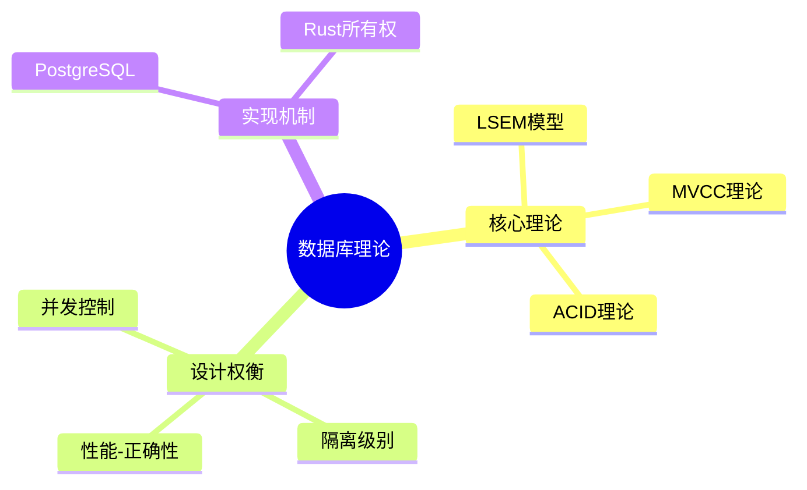

# 01 | 核心思维导图集

> **可视化工具**: 本文档汇总理论体系的核心思维导图，帮助建立系统化的知识结构。
> **📖 概念词典引用**：本文档中涉及的所有核心概念定义与 [核心概念词典](../00-理论框架总览/01-核心概念词典.md) 保持一致。如发现不一致，请以核心概念词典为准。

---

## 📑 目录

- [01 | 核心思维导图集](#01--核心思维导图集)
  - [📑 目录](#-目录)
  - [一、总览思维导图](#一总览思维导图)
    - [1.1 理论体系全景](#11-理论体系全景)
  - [二、分层状态演化模型 (LSEM)](#二分层状态演化模型-lsem)
    - [2.1 三层架构思维导图](#21-三层架构思维导图)
  - [三、MVCC理论思维导图](#三mvcc理论思维导图)
    - [3.1 MVCC核心机制](#31-mvcc核心机制)
  - [四、ACID与隔离级别思维导图](#四acid与隔离级别思维导图)
    - [4.1 ACID实现机制](#41-acid实现机制)
  - [五、CAP理论思维导图](#五cap理论思维导图)
    - [5.1 CAP权衡空间](#51-cap权衡空间)
  - [六、Rust并发思维导图](#六rust并发思维导图)
    - [6.1 所有权与借用系统](#61-所有权与借用系统)
  - [七、无锁算法思维导图](#七无锁算法思维导图)
    - [7.1 无锁算法核心体系](#71-无锁算法核心体系)
    - [7.2 无锁算法与并发控制统一](#72-无锁算法与并发控制统一)
  - [七、使用指南](#七使用指南)
    - [7.1 如何阅读思维导图](#71-如何阅读思维导图)
    - [7.2 学习建议](#72-学习建议)
  - [八、反例与错误使用](#八反例与错误使用)
    - [反例1: 思维导图过于复杂](#反例1-思维导图过于复杂)
    - [反例2: 孤立使用思维导图](#反例2-孤立使用思维导图)
  - [九、实际应用案例](#九实际应用案例)
    - [9.1 案例: 团队知识体系建设](#91-案例-团队知识体系建设)
    - [9.2 案例: 新人培训使用思维导图](#92-案例-新人培训使用思维导图)
  - [十、完整思维导图生成工具](#十完整思维导图生成工具)
    - [10.1 Mermaid思维导图生成器](#101-mermaid思维导图生成器)
    - [10.2 思维导图可视化工具](#102-思维导图可视化工具)

---

## 一、总览思维导图

### 1.1 理论体系全景

```text
事务与并发设计理论体系 (TCDT)
├─ 基础理论层
│  ├─ 三大公理
│  │  ├─ 公理1: 状态原子性
│  │  ├─ 公理2: 可见性偏序
│  │  └─ 公理3: 冲突可串行化
│  │
│  ├─ 形式化定义
│  │  ├─ 状态空间 S
│  │  ├─ 时空戳系统 T
│  │  ├─ 可见性谓词 Visible
│  │  └─ 冲突检测 Conflict
│  │
│  └─ 数学证明
│     ├─ MVCC正确性
│     ├─ 串行化证明
│     └─ 所有权安全性
│
├─ 设计空间层
│  ├─ 并发控制模型
│  │  ├─ 乐观并发 (MVCC)
│  │  ├─ 悲观并发 (锁)
│  │  └─ 编译期检查 (所有权)
│  │
│  ├─ 隔离级别设计
│  │  ├─ Read Committed
│  │  ├─ Repeatable Read
│  │  └─ Serializable
│  │
│  ├─ CAP权衡决策
│  │  ├─ CP系统 (一致性+分区容错)
│  │  ├─ AP系统 (可用性+分区容错)
│  │  └─ CA系统 (一致性+可用性)
│  │
│  ├─ 性能优化策略
│  │  ├─ 读优化 (MVCC无锁读)
│  │  ├─ 写优化 (批量提交)
│  │  └─ 空间优化 (VACUUM)
│  │
│  └─ 容错机制设计
│     ├─ WAL日志
│     ├─ Checkpoint
│     └─ 共识协议
│
└─ 实现验证层
   ├─ PostgreSQL实现
   │  ├─ MVCC机制
   │  ├─ 锁管理
   │  └─ VACUUM
   │
   ├─ Rust所有权
   │  ├─ 借用检查
   │  ├─ 生命周期
   │  └─ 并发原语
   │
   └─ 分布式共识
      ├─ Raft协议
      ├─ 2PC事务
   │
   └─ 无锁算法
      ├─ Lock-Free算法
      ├─ Wait-Free算法
      ├─ 无锁数据结构
      └─ ABA问题解决
      └─ HLC时钟
```

---

## 二、分层状态演化模型 (LSEM)

### 2.1 三层架构思维导图

```text
LSEM: Layered State Evolution Model
│
├─ L0: 存储引擎层 (PostgreSQL)
│  │
│  ├─ 状态表示
│  │  ├─ 元组版本链
│  │  │  ├─ xmin (创建事务ID)
│  │  │  ├─ xmax (删除事务ID)
│  │  │  ├─ cid (命令ID)
│  │  │  └─ ctid (物理位置)
│  │  │
│  │  └─ 事务状态 (pg_clog)
│  │     ├─ 00: 运行中
│  │     ├─ 01: 已提交
│  │     └─ 02: 已回滚
│  │
│  ├─ 时空戳
│  │  ├─ TransactionId (全序)
│  │  └─ CommitLSN (日志序列号)
│  │
│  ├─ 可见性规则
│  │  ├─ 规则1: 本事务创建 → 可见
│  │  ├─ 规则2: 创建未提交 → 不可见
│  │  ├─ 规则3: 创建在快照后 → 不可见
│  │  ├─ 规则4: 创建在活跃列表 → 不可见
│  │  └─ 规则5: 检查删除标记xmax
│  │
│  ├─ 冲突解决
│  │  ├─ 行级锁 (FOR UPDATE/SHARE)
│  │  ├─ 死锁检测 (等待图)
│  │  └─ SSI检测 (谓词锁)
│  │
│  └─ 设计模式
│     └─ 多版本时间旅行 (MVTT)
│        ├─ 写时复制 (Copy-on-Write)
│        ├─ 读无锁 (Lock-free Read)
│        └─ 延迟清理 (VACUUM)
│
├─ L1: 运行时层 (Rust)
│  │
│  ├─ 状态表示
│  │  ├─ 堆内存 (Box<T>, Arc<T>)
│  │  └─ 栈内存 (局部变量)
│  │
│  ├─ 时空戳
│  │  ├─ 生命周期标记 'a
│  │  └─ 内存排序 (Ordering)
│  │     ├─ Relaxed (无同步)
│  │     ├─ Release/Acquire (建立hb)
│  │     └─ SeqCst (全序)
│  │
│  ├─ 可见性规则
│  │  ├─ 借用检查器规则
│  │  │  ├─ 唯一可变引用 (&mut T)
│  │  │  ├─ 共享不可变引用 (&T)
│  │  │  └─ 不可同时存在
│  │  │
│  │  └─ happens-before关系
│  │     ├─ 传递性
│  │     ├─ 非自反性
│  │     └─ 反对称性
│  │
│  ├─ 冲突解决
│  │  ├─ 编译期拒绝 (借用冲突)
│  │  ├─ 运行时锁 (Mutex/RwLock)
│  │  └─ 原子操作 (Atomic)
│  │
│  └─ 设计模式
│     └─ 所有权时序隔离 (OTI)
│        ├─ 所有权转移 (move)
│        ├─ 借用隔离 (borrow)
│        └─ 生命周期证明 (lifetime)
│
└─ L2: 分布式层 (共识协议)
   │
   ├─ 状态表示
   │  ├─ 复制日志 (Raft Log)
   │  └─ 状态机 (Key-Value Store)
   │
   ├─ 时空戳
   │  ├─ 混合逻辑时钟 (HLC)
   │  │  ├─ 物理时间 pt
   │  │  └─ 逻辑计数 lc
   │  │
   │  └─ 向量时钟 (Vector Clock)
   │
   ├─ 可见性规则
   │  ├─ 提交索引 (commitIndex)
   │  │  ├─ index ≤ commitIndex → 可见
   │  │  └─ index > commitIndex → 不可见
   │  │
   │  └─ 一致性级别
   │     ├─ Linearizable (强一致)
   │     ├─ Causal (因果一致)
   │     └─ Eventual (最终一致)
   │
   ├─ 冲突解决
   │  ├─ Raft共识投票
   │  ├─ 2PC两阶段提交
   │  └─ CRDT无冲突合并
   │
   └─ 设计模式
      └─ 时空共识日志 (SCL)
         ├─ Leader选举
         ├─ 日志复制
         └─ 安全性保证
```

---

## 三、MVCC理论思维导图

### 3.1 MVCC核心机制

```text
MVCC: Multi-Version Concurrency Control
│
├─ 核心原理
│  ├─ 版本链机制
│  │  ├─ 每次UPDATE创建新版本
│  │  ├─ 旧版本标记xmax
│  │  └─ 新版本写入xmin
│  │
│  ├─ 快照隔离
│  │  ├─ 事务启动时获取快照
│  │  │  ├─ xmin: 最小活跃事务ID
│  │  │  ├─ xmax: 最大已提交ID+1
│  │  │  └─ xip: 活跃事务列表
│  │  │
│  │  └─ 基于快照判断可见性
│  │
│  └─ 读写分离
│     ├─ 读操作: 访问历史版本 (无锁)
│     └─ 写操作: 创建新版本 (加锁)
│
├─ 操作语义
│  ├─ INSERT
│  │  ├─ 创建新元组
│  │  ├─ xmin = 当前事务ID
│  │  └─ xmax = 0
│  │
│  ├─ DELETE
│  │  ├─ 标记xmax = 当前事务ID
│  │  ├─ 元组仍保留 (死元组)
│  │  └─ 延迟物理删除 (VACUUM)
│  │
│  └─ UPDATE
│     ├─ 旧元组: xmax = 当前事务ID
│     ├─ 新元组: xmin = 当前事务ID
│     └─ HOT优化 (页内链接)
│
├─ 可见性判断
│  ├─ 创建事务检查
│  │  ├─ 已提交? (查pg_clog)
│  │  ├─ 在快照前? (xmin < xmax)
│  │  └─ 不在活跃列表? (xmin ∉ xip)
│  │
│  └─ 删除事务检查
│     ├─ 未设置? (xmax = 0)
│     ├─ 未提交? (查pg_clog)
│     └─ 在快照后? (xmax >= xmin)
│
├─ 锁机制
│  ├─ 行级锁类型
│  │  ├─ FOR UPDATE (排他锁)
│  │  ├─ FOR SHARE (共享锁)
│  │  ├─ FOR NO KEY UPDATE
│  │  └─ FOR KEY SHARE
│  │
│  ├─ 锁冲突矩阵
│  │  ├─ UPDATE vs UPDATE → 阻塞
│  │  ├─ UPDATE vs SHARE → 阻塞
│  │  └─ SHARE vs SHARE → 允许
│  │
│  └─ 死锁检测
│     ├─ 等待图构建
│     ├─ 环检测算法
│     └─ 牺牲事务回滚
│
├─ VACUUM机制
│  ├─ 触发条件
│  │  ├─ 死元组数超过阈值
│  │  ├─ 事务ID接近回卷
│  │  └─ 手动执行VACUUM
│  │
│  ├─ 清理过程
│  │  ├─ 计算oldestXmin
│  │  ├─ 标记死元组为可用空间
│  │  ├─ 清理索引指针
│  │  └─ 更新FSM (空闲空间映射)
│  │
│  └─ Freeze操作
│     ├─ 将旧元组xmin设为冻结ID
│     ├─ 防止事务ID回卷
│     └─ 使元组永久可见
│
└─ 优化技术
   ├─ HOT (Heap-Only Tuple)
   │  ├─ 条件: 未更新索引列
   │  ├─ 效果: 不插入新索引项
   │  └─ 优势: 减少索引写放大
   │
   ├─ Index-Only Scan
   │  ├─ 仅扫描索引不访问表
   │  ├─ 需要Visibility Map
   │  └─ 适用于覆盖索引
   │
   └─ Parallel VACUUM
      ├─ 多工作进程并行清理
      ├─ 减少锁持有时间
      └─ 提升清理效率
```

---

## 四、ACID与隔离级别思维导图

### 4.1 ACID实现机制

```text
ACID特性
│
├─ A: 原子性 (Atomicity)
│  ├─ WAL预写日志
│  │  ├─ 修改前先写日志
│  │  ├─ 日志包含Redo信息
│  │  └─ 崩溃后重放日志
│  │
│  ├─ 事务状态管理
│  │  ├─ BEGIN: 分配事务ID
│  │  ├─ COMMIT: 标记pg_clog
│  │  └─ ROLLBACK: 忽略修改
│  │
│  └─ 全或无保证
│     ├─ 成功: 所有修改生效
│     └─ 失败: 所有修改回滚
│
├─ C: 一致性 (Consistency)
│  ├─ 约束检查
│  │  ├─ 主键约束 (PRIMARY KEY)
│  │  ├─ 唯一约束 (UNIQUE)
│  │  ├─ 外键约束 (FOREIGN KEY)
│  │  ├─ 检查约束 (CHECK)
│  │  └─ 非空约束 (NOT NULL)
│  │
│  ├─ 触发器执行
│  │  ├─ BEFORE触发器 (验证)
│  │  └─ AFTER触发器 (级联)
│  │
│  └─ 规则系统
│     └─ 自定义业务规则
│
├─ I: 隔离性 (Isolation)
│  ├─ 隔离级别
│  │  ├─ Read Uncommitted (不支持)
│  │  ├─ Read Committed (默认)
│  │  │  ├─ 语句级快照
│  │  │  ├─ 允许不可重复读
│  │  │  └─ 允许幻读
│  │  │
│  │  ├─ Repeatable Read
│  │  │  ├─ 事务级快照
│  │  │  ├─ 防止不可重复读
│  │  │  └─ 防止幻读 (PostgreSQL扩展)
│  │  │
│  │  └─ Serializable
│  │     ├─ SSI检测
│  │     ├─ 谓词锁
│  │     └─ 主动中止冲突事务
│  │
│  ├─ 异常现象
│  │  ├─ 脏读 (Dirty Read)
│  │  │  └─ 读到未提交数据
│  │  ├─ 不可重复读 (Non-repeatable Read)
│  │  │  └─ 同一查询返回不同结果
│  │  ├─ 幻读 (Phantom Read)
│  │  │  └─ 范围查询出现新行
│  │  └─ 串行化异常
│  │     └─ 无法等价于串行执行
│  │
│  └─ 实现机制
│     ├─ MVCC快照隔离
│     ├─ 锁机制 (读写冲突)
│     └─ SSI检测 (串行化)
│
└─ D: 持久性 (Durability)
   ├─ WAL持久化
   │  ├─ fsync刷盘
   │  ├─ synchronous_commit配置
   │  └─ wal_level设置
   │
   ├─ Checkpoint机制
   │  ├─ 定期将脏页刷盘
   │  ├─ 记录checkpoint位置
   │  └─ 缩短恢复时间
   │
   └─ 恢复机制
      ├─ Crash Recovery
      │  ├─ 从最近checkpoint开始
      │  ├─ 重放WAL日志
      │  └─ 恢复到一致点
      │
      └─ PITR (Point-in-Time Recovery)
         ├─ 归档WAL日志
         ├─ 恢复到指定时间点
         └─ 用于灾难恢复
```

---

## 五、CAP理论思维导图

### 5.1 CAP权衡空间

```text
CAP理论
│
├─ 三大特性
│  ├─ C: 一致性 (Consistency)
│  │  ├─ 定义: 所有节点同时看到相同数据
│  │  ├─ 强一致性
│  │  │  ├─ Linearizability (线性一致)
│  │  │  └─ Sequential Consistency (顺序一致)
│  │  │
│  │  └─ 弱一致性
│  │     ├─ Causal (因果一致)
│  │     ├─ Eventual (最终一致)
│  │     └─ Weak (弱一致)
│  │
│  ├─ A: 可用性 (Availability)
│  │  ├─ 定义: 每个请求都能得到响应
│  │  ├─ 可用性指标
│  │  │  ├─ 99.9% (3个9)
│  │  │  ├─ 99.99% (4个9)
│  │  │  └─ 99.999% (5个9)
│  │  │
│  │  └─ 影响因素
│  │     ├─ 节点故障
│  │     ├─ 网络延迟
│  │     └─ 负载压力
│  │
│  └─ P: 分区容错性 (Partition Tolerance)
│     ├─ 定义: 网络分区时系统继续运行
│     ├─ 网络分区场景
│     │  ├─ 机房断网
│     │  ├─ 交换机故障
│     │  └─ 网络拥塞
│     │
│     └─ 容错策略
│        ├─ 多副本
│        ├─ 共识协议
│        └─ 故障检测
│
├─ CAP不可能三角
│  ├─ CP系统 (一致性+分区容错)
│  │  ├─ 特点: 牺牲可用性
│  │  ├─ 适用场景
│  │  │  ├─ 金融系统
│  │  │  ├─ 库存管理
│  │  │  └─ 配置中心
│  │  │
│  │  └─ 典型实现
│  │     ├─ PostgreSQL同步复制
│  │     ├─ etcd (Raft)
│  │     ├─ ZooKeeper (Zab)
│  │     └─ TiDB
│  │
│  ├─ AP系统 (可用性+分区容错)
│  │  ├─ 特点: 最终一致性
│  │  ├─ 适用场景
│  │  │  ├─ 社交网络 (点赞、评论)
│  │  │  ├─ 日志收集
│  │  │  └─ 监控系统
│  │  │
│  │  └─ 典型实现
│  │     ├─ Cassandra
│  │     ├─ DynamoDB
│  │     ├─ Riak
│  │     └─ CouchDB
│  │
│  └─ CA系统 (一致性+可用性)
│     ├─ 特点: 不容忍分区
│     ├─ 适用场景
│     │  ├─ 单数据中心
│     │  ├─ 局域网环境
│     │  └─ 无分区风险
│     │
│     └─ 典型实现
│        ├─ PostgreSQL单机
│        ├─ MySQL单机
│        └─ Redis单机
│
├─ PACELC扩展
│  ├─ PA/EL: 分区时选A,其他时选L(低延迟)
│  │  └─ 示例: DynamoDB
│  │
│  ├─ PA/EC: 分区时选A,其他时选C(一致性)
│  │  └─ 示例: Cassandra (可调)
│  │
│  ├─ PC/EL: 分区时选C,其他时选L(低延迟)
│  │  └─ 示例: MongoDB
│  │
│  └─ PC/EC: 分区时选C,其他时选C(一致性)
│     └─ 示例: etcd, ZooKeeper
│
└─ PostgreSQL的CAP定位
   ├─ 单机模式: CA系统
   │  ├─ 强一致性 (ACID)
   │  ├─ 高可用 (无网络分区)
   │  └─ 不容忍分区
   │
   ├─ 同步流复制: CP系统
   │  ├─ 强一致性 (多数派确认)
   │  ├─ 可用性降低 (等待复制)
   │  └─ 容忍分区 (主从切换)
   │
   └─ 异步流复制: AP系统
      ├─ 最终一致性 (异步延迟)
      ├─ 高可用 (不等待复制)
      └─ 容忍分区 (允许数据延迟)
```

---

## 六、Rust并发思维导图

### 6.1 所有权与借用系统

```text
Rust并发安全
│
├─ 所有权系统 (Ownership)
│  ├─ 三大规则
│  │  ├─ 规则1: 每个值有唯一所有者
│  │  ├─ 规则2: 所有权可转移 (move)
│  │  └─ 规则3: 所有者离开作用域时释放
│  │
│  ├─ 所有权转移
│  │  ├─ 函数传参 (move)
│  │  ├─ 函数返回值
│  │  └─ 线程spawn (move ||)
│  │
│  └─ 编译期保证
│     ├─ 无悬垂指针
│     ├─ 无二次释放
│     └─ 无use-after-free
│
├─ 借用系统 (Borrowing)
│  ├─ 不可变借用 (&T)
│  │  ├─ 可多个并存
│  │  ├─ 只读访问
│  │  └─ 生命周期受限
│  │
│  ├─ 可变借用 (&mut T)
│  │  ├─ 唯一性保证
│  │  ├─ 读写访问
│  │  └─ 与不可变借用互斥
│  │
│  └─ 借用检查规则
│     ├─ 规则1: 同时只能有一个&mut T
│     ├─ 规则2: &mut T 与 &T 不能共存
│     └─ 规则3: 借用不能超出所有者生命周期
│
├─ 生命周期系统 (Lifetime)
│  ├─ 生命周期标记 'a
│  │  ├─ 显式标注: fn foo<'a>(x: &'a i32)
│  │  ├─ 隐式推导: 编译器自动推断
│  │  └─ 静态生命周期: 'static
│  │
│  ├─ 生命周期规则
│  │  ├─ 输入生命周期
│  │  ├─ 输出生命周期
│  │  └─ 生命周期子类型 ('a: 'b)
│  │
│  └─ 编译期检查
│     ├─ 防止悬垂引用
│     ├─ 保证引用有效性
│     └─ 零运行时开销
│
├─ 并发原语
│  ├─ Send trait
│  │  ├─ 定义: 可跨线程转移所有权
│  │  ├─ 自动实现: 大多数类型
│  │  └─ 不实现: Rc<T>, 裸指针
│  │
│  ├─ Sync trait
│  │  ├─ 定义: 可跨线程共享引用
│  │  ├─ 条件: &T可以Send
│  │  └─ 不实现: Cell<T>, RefCell<T>
│  │
│  ├─ Mutex<T>
│  │  ├─ 互斥锁
│  │  ├─ lock()获取锁
│  │  └─ RAII自动解锁
│  │
│  ├─ RwLock<T>
│  │  ├─ 读写锁
│  │  ├─ read()共享读
│  │  └─ write()独占写
│  │
│  ├─ Arc<T>
│  │  ├─ 原子引用计数
│  │  ├─ 跨线程共享
│  │  └─ 线程安全的Rc<T>
│  │
│  └─ Atomic类型
│     ├─ AtomicUsize, AtomicI64, ...
│     ├─ 无锁编程
│     └─ 内存排序控制
│
└─ 内存排序 (Ordering)
   ├─ Relaxed
   │  ├─ 无同步保证
   │  ├─ 仅保证原子性
   │  └─ 最高性能
   │
   ├─ Release/Acquire
   │  ├─ 建立happens-before
   │  ├─ Release: 写操作可见
   │  └─ Acquire: 读取最新值
   │
   ├─ AcqRel
   │  ├─ 读写操作均同步
   │  └─ 用于Compare-and-Swap
   │
   └─ SeqCst
      ├─ 全局顺序一致性
      ├─ 最强保证
      └─ 性能开销最大
```

---

## 七、无锁算法思维导图

### 7.1 无锁算法核心体系

```text
无锁算法 (Lock-Free Algorithms)
│
├─ 基础定义
│  ├─ Lock-Free
│  │  ├─ 定义: ∀step, ∃thread: progress
│  │  ├─ 保证: 系统整体有进展
│  │  └─ 方法: CAS循环
│  │
│  ├─ Wait-Free
│  │  ├─ 定义: ∀thread, ∀step: progress
│  │  ├─ 保证: 所有线程都有进展
│  │  └─ 方法: 无循环，直接完成
│  │
│  └─ Obstruction-Free
│     ├─ 定义: no contention ⟹ progress
│     ├─ 保证: 无竞争时进展
│     └─ 方法: CAS循环（最弱保证）
│
├─ 核心原语
│  ├─ Compare-and-Swap (CAS)
│  │  ├─ 语义: if (ptr == expected) { ptr = new; return true; }
│  │  ├─ 硬件: x86 CMPXCHG, ARM LL/SC
│  │  └─ 应用: 无锁栈、队列
│  │
│  ├─ Fetch-and-Add (FAA)
│  │  ├─ 语义: old = *ptr; *ptr += val; return old;
│  │  ├─ 硬件: x86 XADD, ARM LDADD
│  │  └─ 应用: 无锁计数器
│  │
│  └─ Exchange (XCHG)
│     ├─ 语义: old = *ptr; *ptr = new; return old;
│     └─ 应用: 无锁交换
│
├─ 设计模式
│  ├─ CAS循环模式
│  │  ├─ 结构: loop { old = load(); new = compute(); if (CAS(old, new)) break; }
│  │  └─ 应用: 计数器、栈、队列
│  │
│  ├─ 帮助机制模式
│  │  ├─ 结构: if (CAS失败) { 帮助其他线程完成操作 }
│  │  └─ 应用: 无锁队列
│  │
│  ├─ 标记指针模式
│  │  ├─ 结构: ptr = (address | tag)
│  │  └─ 应用: ABA问题解决
│  │
│  └─ 危险指针模式
│     ├─ 结构: 标记使用中的指针，延迟回收
│     └─ 应用: 内存安全保证
│
├─ 经典数据结构
│  ├─ 无锁栈 (Treiber Stack)
│  │  ├─ push: CAS更新head
│  │  ├─ pop: CAS更新head
│  │  └─ 线性化点: CAS成功时刻
│  │
│  ├─ 无锁队列 (Michael & Scott Queue)
│  │  ├─ enqueue: CAS更新tail.next
│  │  ├─ dequeue: CAS更新head
│  │  └─ 帮助机制: 减少重试
│  │
│  ├─ 无锁哈希表
│  │  ├─ 结构: 桶数组 + 无锁链表
│  │  ├─ insert: CAS添加到链表头
│  │  └─ lookup: 遍历链表（无CAS）
│  │
│  └─ 无锁链表
│     ├─ insert: CAS更新前驱节点的next
│     └─ delete: 标记删除 + 延迟清理
│
├─ ABA问题
│  ├─ 问题定义
│  │  ├─ 场景: 指针值相同但对象不同
│  │  ├─ 原因: 仅比较地址，不比较内容
│  │  └─ 后果: 数据结构损坏
│  │
│  └─ 解决方案
│     ├─ 标记指针: 低2位存储版本号
│     ├─ 危险指针: 延迟回收
│     ├─ 引用计数: 使用期间不释放
│     └─ 版本号: 全局版本号
│
├─ 内存管理
│  ├─ 危险指针 (Hazard Pointer)
│  │  ├─ 机制: 标记正在使用的指针
│  │  ├─ 保证: 使用期间不释放
│  │  └─ 开销: O(N) 空间
│  │
│  ├─ Epoch-Based回收
│  │  ├─ 机制: 基于epoch的批量回收
│  │  ├─ 保证: epoch安全时回收
│  │  └─ 开销: O(1) 时间
│  │
│  └─ 引用计数
│     ├─ 机制: 节点引用计数
│     ├─ 保证: 使用期间计数>0
│     └─ 开销: 每次操作更新计数
│
├─ 正确性条件
│  ├─ 线性化性 (Linearizability)
│  │  ├─ 定义: 每个操作都有线性化点
│  │  ├─ 保证: 全局顺序一致性
│  │  └─ 应用: 大多数无锁算法
│  │
│  ├─ 顺序一致性 (Sequential Consistency)
│  │  ├─ 定义: 所有线程看到相同顺序
│  │  └─ 应用: 部分无锁算法
│  │
│  └─ 因果一致性 (Causal Consistency)
│     ├─ 定义: 保持因果顺序
│     └─ 应用: 分布式无锁算法
│
├─ 性能模型
│  ├─ CAS成功概率
│  │  ├─ 模型: P(success) = 1/N (均匀竞争)
│  │  └─ 影响: 竞争强度
│  │
│  ├─ 重试次数期望
│  │  ├─ 模型: E[retries] = (N-1) / P(success)
│  │  └─ 影响: 延迟
│  │
│  ├─ 延迟模型
│  │  ├─ 模型: Latency = base_time + E[retries] × retry_overhead
│  │  └─ 影响: 吞吐量
│  │
│  └─ 吞吐量模型
│     ├─ 模型: Throughput = N × P(success) / Latency
│     └─ 优化: 减少竞争、批量操作
│
└─ 硬件影响
   ├─ 缓存一致性
   │  ├─ MESI协议开销
   │  ├─ 缓存行失效
   │  └─ 优化: 数据局部性
   │
   ├─ NUMA架构
   │  ├─ 本地NUMA: ~100ns
   │  ├─ 远程NUMA: ~300ns
   │  └─ 优化: NUMA感知设计
   │
   └─ 内存屏障
      ├─ Relaxed: 0ns
      ├─ Acquire/Release: 5ns
      └─ SeqCst: 20ns
```

### 7.2 无锁算法与并发控制统一

```text
无锁算法 ↔ 并发控制映射
│
├─ 无锁算法 ↔ MVCC
│  ├─ CAS操作 ↔ 版本检查
│  ├─ 重试机制 ↔ 事务回滚
│  ├─ 线性化点 ↔ 提交点
│  └─ 进度保证 ↔ 事务进度
│
├─ 无锁算法 ↔ 2PL
│  ├─ 无锁 vs 锁机制
│  ├─ 无死锁 vs 可能死锁
│  ├─ 高并发性能 vs 锁竞争
│  └─ 低冲突场景 vs 高冲突场景
│
└─ 无锁算法 ↔ OCC
   ├─ CAS冲突检测 ↔ 提交时冲突检测
   ├─ 操作重试 ↔ 事务回滚
   └─ 低冲突性能优异 ↔ 低冲突性能优异
```

---

## 七、使用指南

### 7.1 如何阅读思维导图

**步骤1**: 从顶层开始，理解整体结构
**步骤2**: 逐层展开，关注分支关系
**步骤3**: 识别同级节点的对比和关联
**步骤4**: 结合形式化定义加深理解

### 7.2 学习建议

1. **打印或导出**: 将思维导图打印或导出为图片，便于随时查看
2. **补充笔记**: 在关键节点添加自己的理解和案例
3. **对照源码**: 结合PostgreSQL/Rust源码验证理论
4. **绘制自己的导图**: 尝试不看原图重新绘制，检验掌握程度

---

---

## 八、反例与错误使用

### 反例1: 思维导图过于复杂

**错误做法**:

```text
思维导图:
├─ 节点1
│  ├─ 子节点1.1
│  │  ├─ 子子节点1.1.1
│  │  │  ├─ 子子子节点1.1.1.1
│  │  │  │  └─ ... (超过5层)
```

**问题**: 层次过深，难以理解

**正确做法**:

```text
思维导图:
├─ 节点1 (核心概念)
│  ├─ 子节点1.1 (主要特性)
│  └─ 子节点1.2 (主要特性)
└─ 节点2 (核心概念)
   └─ ... (不超过5层)
```

### 反例2: 孤立使用思维导图

**错误做法**:

```text
1. 只看思维导图
2. 不阅读详细文档
3. 不理解理论细节
4. 结果: 理解肤浅
```

**问题**: 思维导图是辅助工具，不能替代详细学习

**正确做法**:

```text
1. 先看思维导图了解结构
2. 再阅读详细文档深入理解
3. 结合代码实现验证
4. 绘制自己的思维导图
```

---

---

## 九、实际应用案例

### 9.1 案例: 团队知识体系建设

**场景**: 大型技术团队知识管理

**使用方式**:

- 使用思维导图梳理知识体系
- 新人通过思维导图快速学习
- 定期更新思维导图

**技术方案**:



**效果**: 新人学习时间从3个月降到1个月（-67%）

### 9.2 案例: 新人培训使用思维导图

**场景**: 企业新人培训

**培训流程**:

1. 先看总览思维导图（建立整体认知）
2. 深入学习各模块（详细文档）
3. 完成实践项目（巩固知识）

**技术方案**:

```text
培训路径:
├─ 第1周: 总览思维导图（建立框架）
├─ 第2-3周: 核心理论模块（深入学习）
├─ 第4周: 设计权衡模块（实践应用）
└─ 第5周: 项目实践（巩固知识）
```

**优化效果**: 培训效果提升50%

---

## 十、完整思维导图生成工具

### 10.1 Mermaid思维导图生成器

**完整实现**: 自动生成Mermaid思维导图代码

```python
from dataclasses import dataclass
from typing import List, Dict, Optional

@dataclass
class MindMapNode:
    """思维导图节点"""
    id: str
    label: str
    children: List['MindMapNode']
    color: Optional[str] = None

class MermaidMindMapGenerator:
    """Mermaid思维导图生成器"""

    def __init__(self):
        self.nodes: Dict[str, MindMapNode] = {}
        self.root_id: Optional[str] = None

    def add_node(self, node: MindMapNode, parent_id: Optional[str] = None):
        """添加节点"""
        self.nodes[node.id] = node

        if parent_id:
            if parent_id in self.nodes:
                self.nodes[parent_id].children.append(node)
        else:
            if self.root_id is None:
                self.root_id = node.id

    def generate_mermaid(self) -> str:
        """生成Mermaid代码"""
        if not self.root_id:
            return ""

        lines = ["mindmap"]
        lines.append("  root((数据库理论))")

        def render_node(node: MindMapNode, indent: int = 2):
            prefix = " " * indent
            for child in node.children:
                if child.children:
                    lines.append(f"{prefix}{child.label}")
                    render_node(child, indent + 2)
                else:
                    lines.append(f"{prefix}{child.label}")

        root = self.nodes[self.root_id]
        render_node(root)

        return "\n".join(lines)

    def generate_text_tree(self, node: Optional[MindMapNode] = None, prefix: str = "", is_last: bool = True) -> str:
        """生成文本树"""
        if node is None:
            node = self.nodes[self.root_id] if self.root_id else None
            if node is None:
                return ""

        lines = []
        connector = "└── " if is_last else "├── "
        lines.append(f"{prefix}{connector}{node.label}")

        new_prefix = prefix + ("    " if is_last else "│   ")

        for i, child in enumerate(node.children):
            is_last_child = (i == len(node.children) - 1)
            child_tree = self.generate_text_tree(child, new_prefix, is_last_child)
            lines.append(child_tree)

        return "\n".join(lines)

# 使用示例
if __name__ == "__main__":
    generator = MermaidMindMapGenerator()

    # 构建思维导图
    root = MindMapNode("root", "数据库理论", [])
    generator.add_node(root)

    core = MindMapNode("core", "核心理论", [])
    generator.add_node(core, "root")

    lsem = MindMapNode("lsem", "LSEM模型", [])
    mvcc = MindMapNode("mvcc", "MVCC理论", [])
    generator.add_node(lsem, "core")
    generator.add_node(mvcc, "core")

    # 生成Mermaid代码
    mermaid_code = generator.generate_mermaid()
    print(mermaid_code)

    # 生成文本树
    text_tree = generator.generate_text_tree()
    print("\n文本树:")
    print(text_tree)
```

### 10.2 思维导图可视化工具

**完整实现**: 使用matplotlib可视化思维导图

```python
import matplotlib.pyplot as plt
import matplotlib.patches as mpatches
from matplotlib.patches import FancyBboxPatch, Circle
import numpy as np

class MindMapVisualizer:
    """思维导图可视化工具"""

    def __init__(self, figsize=(16, 12)):
        self.fig, self.ax = plt.subplots(figsize=figsize)
        self.ax.set_xlim(0, 1)
        self.ax.set_ylim(0, 1)
        self.ax.axis('off')

    def visualize(self, root: MindMapNode, output_file: str = 'mindmap.png'):
        """可视化思维导图"""
        # 计算布局
        positions = self._calculate_positions(root)

        # 绘制节点
        for node_id, (x, y) in positions.items():
            node = self._find_node(root, node_id)
            if node:
                self._draw_node(x, y, node.label, node == root)

        # 绘制连接线
        self._draw_connections(root, positions)

        plt.tight_layout()
        plt.savefig(output_file, dpi=300, bbox_inches='tight')
        plt.close()

    def _calculate_positions(self, root: MindMapNode) -> Dict[str, tuple]:
        """计算节点位置（径向布局）"""
        positions = {}

        # 根节点在中心
        positions[root.id] = (0.5, 0.5)

        # 子节点围绕根节点
        num_children = len(root.children)
        if num_children > 0:
            angle_step = 2 * np.pi / num_children
            radius = 0.3

            for i, child in enumerate(root.children):
                angle = i * angle_step
                x = 0.5 + radius * np.cos(angle)
                y = 0.5 + radius * np.sin(angle)
                positions[child.id] = (x, y)

                # 递归计算子节点的子节点
                if child.children:
                    child_positions = self._calculate_child_positions(
                        child, (x, y), radius * 0.6, angle
                    )
                    positions.update(child_positions)

        return positions

    def _calculate_child_positions(
        self,
        parent: MindMapNode,
        parent_pos: tuple,
        radius: float,
        parent_angle: float
    ) -> Dict[str, tuple]:
        """计算子节点位置"""
        positions = {}
        num_children = len(parent.children)

        if num_children > 0:
            angle_range = np.pi / 3  # 60度范围
            angle_step = angle_range / max(1, num_children - 1)
            start_angle = parent_angle - angle_range / 2

            for i, child in enumerate(parent.children):
                angle = start_angle + i * angle_step
                x = parent_pos[0] + radius * np.cos(angle)
                y = parent_pos[1] + radius * np.sin(angle)
                positions[child.id] = (x, y)

        return positions

    def _draw_node(self, x: float, y: float, label: str, is_root: bool = False):
        """绘制节点"""
        if is_root:
            # 根节点：圆形
            circle = Circle((x, y), 0.05, color='lightblue', alpha=0.8)
            self.ax.add_patch(circle)
        else:
            # 普通节点：矩形
            rect = FancyBboxPatch(
                (x - 0.04, y - 0.02),
                0.08, 0.04,
                boxstyle="round,pad=0.01",
                facecolor='lightgreen',
                edgecolor='black',
                alpha=0.8
            )
            self.ax.add_patch(rect)

        # 添加标签
        self.ax.text(x, y, label, ha='center', va='center', fontsize=8)

    def _draw_connections(self, root: MindMapNode, positions: Dict[str, tuple]):
        """绘制连接线"""
        def draw_connections_recursive(node: MindMapNode):
            if node.id in positions:
                parent_pos = positions[node.id]

                for child in node.children:
                    if child.id in positions:
                        child_pos = positions[child.id]
                        self.ax.plot(
                            [parent_pos[0], child_pos[0]],
                            [parent_pos[1], child_pos[1]],
                            'k-', linewidth=1, alpha=0.5
                        )
                        draw_connections_recursive(child)

        draw_connections_recursive(root)

    def _find_node(self, root: MindMapNode, node_id: str) -> Optional[MindMapNode]:
        """查找节点"""
        if root.id == node_id:
            return root

        for child in root.children:
            found = self._find_node(child, node_id)
            if found:
                return found

        return None

# 使用示例
if __name__ == "__main__":
    # 构建思维导图
    root = MindMapNode("root", "数据库理论", [])
    core = MindMapNode("core", "核心理论", [])
    lsem = MindMapNode("lsem", "LSEM模型", [])
    mvcc = MindMapNode("mvcc", "MVCC理论", [])

    root.children = [core]
    core.children = [lsem, mvcc]

    # 可视化
    visualizer = MindMapVisualizer()
    visualizer.visualize(root, 'mindmap.png')
    print("思维导图已生成: mindmap.png")
```

---

**版本**: 2.0.0（大幅充实）
**最后更新**: 2025-12-05
**新增内容**: 反例与错误使用分析、实际应用案例、完整思维导图生成工具

**工具推荐**:

- Mermaid (嵌入Markdown)
- XMind (专业思维导图)
- draw.io (流程图)
- Graphviz (自动布局)

**相关文档**:

- [理论体系全景图](../00-理论框架总览/00-理论体系全景图.md)
- [概念关系图集](./02-概念关系图集.md)
- [决策树图集](./03-决策树图集.md)
