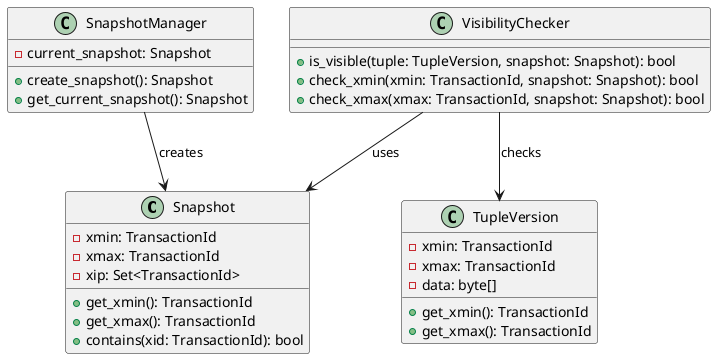
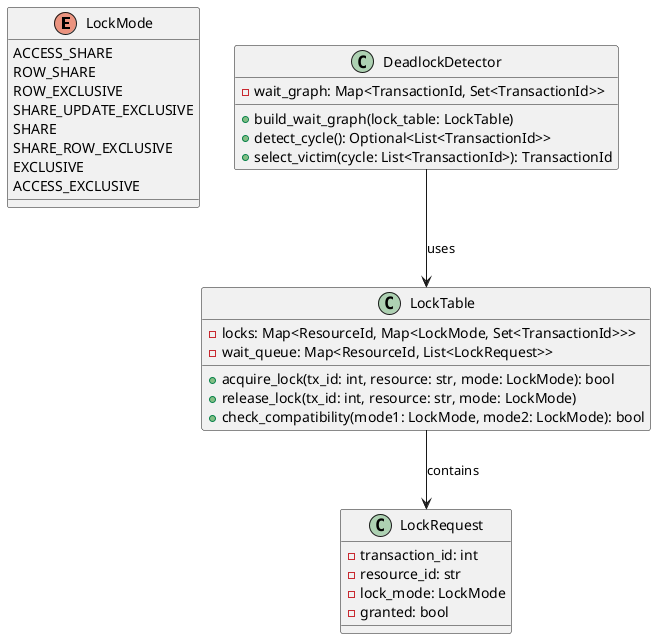
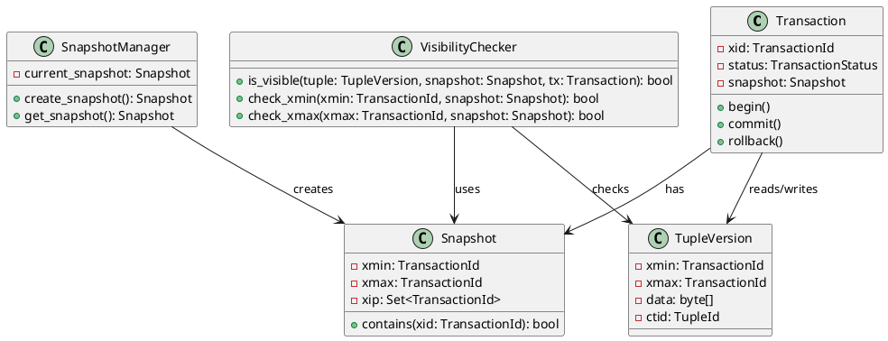
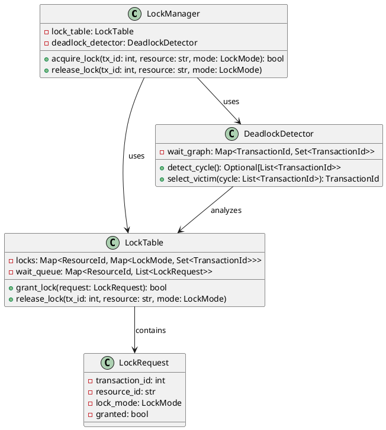
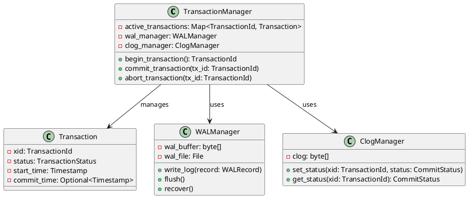
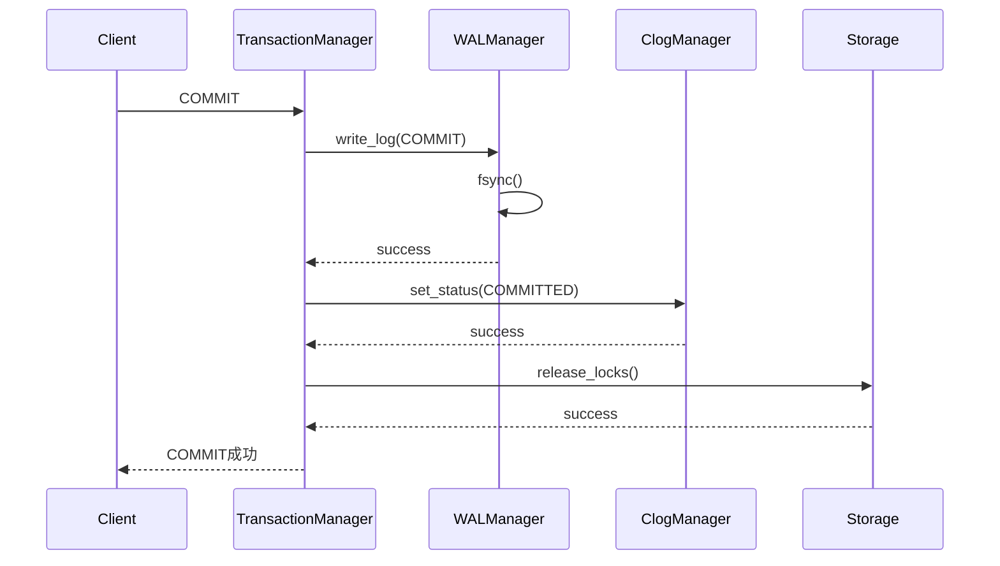
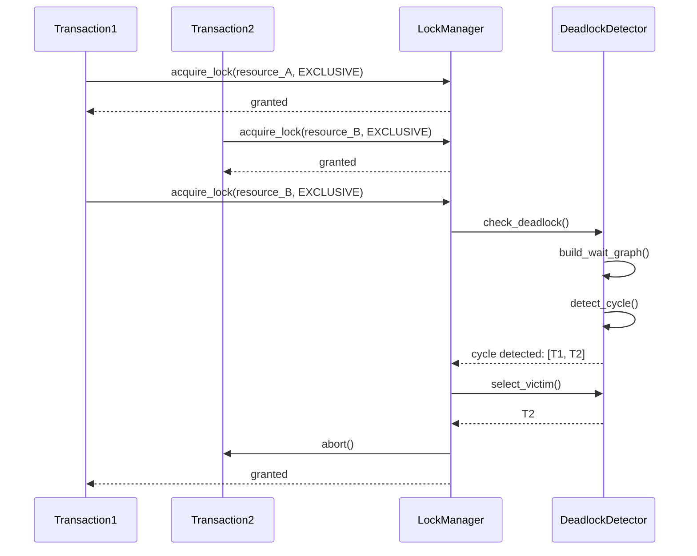
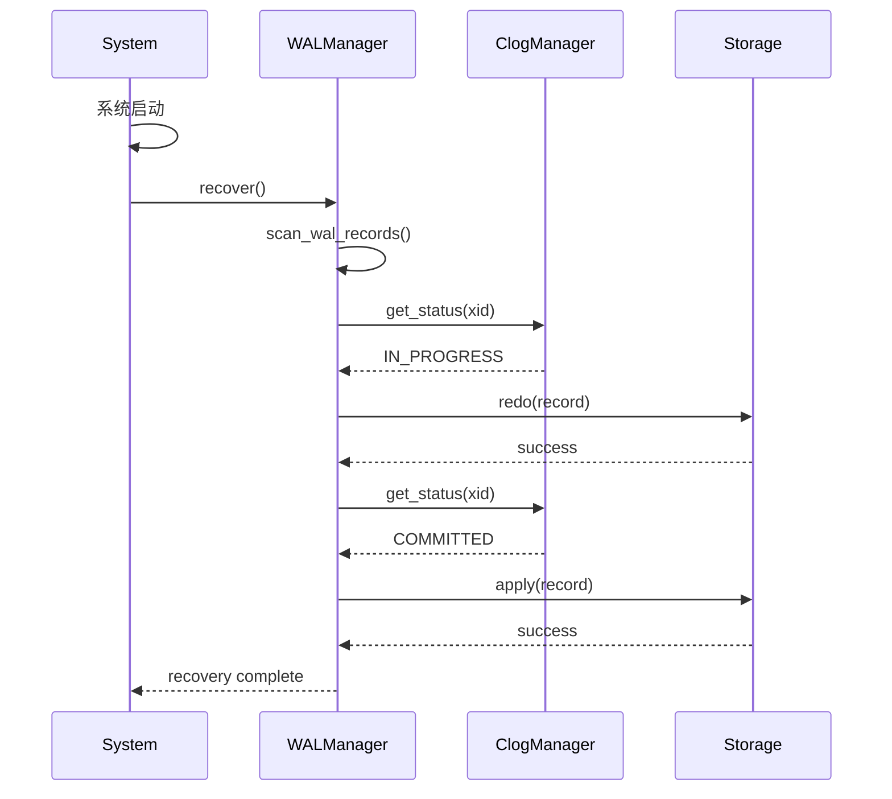

# 09 | 程序设计导图集（完整版）

> **可视化工具**: 本文档提供系统化的程序设计导图，涵盖架构设计、模块设计、接口设计等多个层面。
> **📖 概念词典引用**：本文档中涉及的所有核心概念定义与 [核心概念词典](../00-理论框架总览/01-核心概念词典.md) 保持一致。如发现不一致，请以核心概念词典为准。

---

## 📑 目录

- [09 | 程序设计导图集（完整版）](#09--程序设计导图集完整版)
  - [📑 目录](#-目录)
  - [一、系统架构设计导图](#一系统架构设计导图)
    - [1.1 三层架构设计（LSEM）](#11-三层架构设计lsem)
    - [1.2 微服务架构设计](#12-微服务架构设计)
    - [1.3 分布式数据库架构](#13-分布式数据库架构)
  - [二、模块设计导图](#二模块设计导图)
    - [2.1 MVCC模块设计](#21-mvcc模块设计)
    - [2.2 锁管理模块设计](#22-锁管理模块设计)
    - [2.3 事务管理模块设计](#23-事务管理模块设计)
  - [三、接口设计导图](#三接口设计导图)
    - [3.1 事务接口设计](#31-事务接口设计)
    - [3.2 存储接口设计](#32-存储接口设计)
    - [3.3 查询接口设计](#33-查询接口设计)
  - [四、数据流设计导图](#四数据流设计导图)
    - [4.1 查询数据流](#41-查询数据流)
    - [4.2 写入数据流](#42-写入数据流)
    - [4.3 复制数据流](#43-复制数据流)
  - [五、类图设计导图](#五类图设计导图)
    - [5.1 MVCC核心类图](#51-mvcc核心类图)
    - [5.2 锁管理类图](#52-锁管理类图)
    - [5.3 事务管理类图](#53-事务管理类图)
  - [六、组件交互导图](#六组件交互导图)
    - [6.1 事务提交交互](#61-事务提交交互)
    - [6.2 死锁检测交互](#62-死锁检测交互)
    - [6.3 故障恢复交互](#63-故障恢复交互)
  - [七、设计模式应用导图](#七设计模式应用导图)
    - [7.1 设计模式在数据库中的应用](#71-设计模式在数据库中的应用)
    - [7.2 并发设计模式](#72-并发设计模式)
  - [八、完整设计工具实现](#八完整设计工具实现)
    - [8.1 PlantUML代码生成器](#81-plantuml代码生成器)
    - [8.2 架构图自动生成工具](#82-架构图自动生成工具)
  - [九、实际应用案例](#九实际应用案例)
    - [9.1 案例: 新系统架构设计](#91-案例-新系统架构设计)
    - [9.2 案例: 重构现有系统](#92-案例-重构现有系统)
  - [十、反例与错误设计](#十反例与错误设计)
    - [反例1: 过度设计导致复杂度高](#反例1-过度设计导致复杂度高)
    - [反例2: 忽略接口设计导致耦合](#反例2-忽略接口设计导致耦合)

---

## 一、系统架构设计导图

### 1.1 三层架构设计（LSEM）

**完整架构图**:

```text
┌─────────────────────────────────────────────────────────────┐
│                    L2: 分布式层                              │
│  ┌──────────────┐  ┌──────────────┐  ┌──────────────┐       │
│  │ 全局时间戳    │  │ 共识协议      │  │ 复制协调     │       │
│  │(HLC/TrueTime)│  │ (Raft/Paxos) │  │ (2PC/3PC)    │       │
│  └──────┬───────┘  └──────┬───────┘  └──────┬───────┘       │
│         │                 │                  │              │
│         └─────────────────┼──────────────────┘              │
│                           │                                  │
└───────────────────────────┼──────────────────────────────────┘
                            │ 时间戳映射
┌───────────────────────────┼──────────────────────────────────┐
│                    L1: 运行时层                               │
│  ┌──────────────┐  ┌──────────────┐  ┌──────────────┐        │
│  │ 事务管理      │  │ 锁管理        │  │ 内存管理      │       │
│  │ (BEGIN/COMMIT)│  │ (Lock/Unlock)│  │ (Ownership)  │       │
│  └──────┬───────┘  └──────┬───────┘  └──────┬───────┘       │
│         │                 │                  │              │
│         └─────────────────┼──────────────────┘              │
│                           │ 事务ID映射                       │
└───────────────────────────┼──────────────────────────────────┘
                            │ xmin/xmax映射
┌───────────────────────────┼──────────────────────────────────┐
│                    L0: 存储层                                │
│  ┌──────────────┐  ┌──────────────┐  ┌──────────────┐       │
│  │ MVCC存储      │  │ WAL日志       │  │ 索引存储      │      │
│  │ (HeapTuple)  │  │ (XLogRecord)  │  │ (B-tree/Hash)│      │
│  └──────────────┘  └──────────────┘  └──────────────┘       │
└─────────────────────────────────────────────────────────────┘
```

**模块依赖关系**:

```text
L2层模块:
├─ GlobalTimestampService
│   ├─ 依赖: ClockSyncService
│   └─ 提供: Timestamp
│
├─ ConsensusService
│   ├─ 依赖: NetworkService
│   └─ 提供: ConsensusDecision
│
└─ ReplicationCoordinator
    ├─ 依赖: ConsensusService, GlobalTimestampService
    └─ 提供: ReplicationStatus

L1层模块:
├─ TransactionManager
│   ├─ 依赖: GlobalTimestampService (L2)
│   ├─ 依赖: LockManager (L1)
│   └─ 提供: Transaction
│
├─ LockManager
│   ├─ 依赖: TransactionManager (L1)
│   └─ 提供: Lock
│
└─ MemoryManager
    ├─ 依赖: TransactionManager (L1)
    └─ 提供: MemoryAllocation

L0层模块:
├─ MVCCStorage
│   ├─ 依赖: TransactionManager (L1)
│   └─ 提供: TupleVersion
│
├─ WALManager
│   ├─ 依赖: TransactionManager (L1)
│   └─ 提供: WALRecord
│
└─ IndexManager
    ├─ 依赖: MVCCStorage (L0)
    └─ 提供: IndexEntry
```

### 1.2 微服务架构设计

**微服务架构图**:

```text
┌─────────────────────────────────────────────────────────────┐
│                      API Gateway                             │
│              (路由、认证、限流)                                │
└───────────────┬─────────────────────────────────────────────┘
                │
    ┌───────────┼───────────┐
    │           │           │
┌───▼───┐  ┌───▼───┐  ┌───▼───┐
│账户服务│  │交易服务│  │查询服务│
│       │  │       │  │       │
│ ┌───┐ │  │ ┌───┐ │  │ ┌───┐ │
│ │DB │ │  │ │DB │ │  │ │DB │ │
│ └───┘ │  │ └───┘ │  │ └───┘ │
└───┬───┘  └───┬───┘  └───┬───┘
    │          │           │
    └──────────┼───────────┘
               │
        ┌──────▼──────┐
        │ 消息队列    │
        │ (Kafka)    │
        └────────────┘
```

**服务间通信**:

```text
同步通信 (REST/gRPC):
├─ 账户服务 ←→ 交易服务 (转账)
├─ 查询服务 ←→ 账户服务 (余额查询)
└─ API Gateway → 所有服务 (路由)

异步通信 (消息队列):
├─ 交易服务 → 消息队列 → 通知服务 (交易完成)
├─ 账户服务 → 消息队列 → 审计服务 (账户变更)
└─ 查询服务 → 消息队列 → 分析服务 (查询统计)

数据一致性:
├─ 分布式事务 (2PC/Saga)
├─ 最终一致性 (事件溯源)
└─ 补偿机制 (TCC)
```

### 1.3 分布式数据库架构

**TiDB架构设计**:

```text
┌─────────────────────────────────────────────────────────────┐
│                    TiDB Server (SQL层)                        │
│  ┌──────────────┐  ┌──────────────┐  ┌──────────────┐     │
│  │ SQL Parser   │  │ Optimizer    │  │ Executor     │     │
│  └──────┬───────┘  └──────┬───────┘  └──────┬───────┘     │
│         │                 │                  │              │
│         └─────────────────┼──────────────────┘              │
│                           │                                  │
└───────────────────────────┼──────────────────────────────────┘
                            │ SQL → KV
┌───────────────────────────┼──────────────────────────────────┐
│                    TiKV (存储层)                             │
│  ┌──────────────┐  ┌──────────────┐  ┌──────────────┐     │
│  │ Raft Group   │  │ MVCC         │  │ Transaction  │     │
│  │ (Region)     │  │ (Percolator) │  │ (2PC)        │     │
│  └──────┬───────┘  └──────┬───────┘  └──────┬───────┘     │
│         │                 │                  │              │
│         └─────────────────┼──────────────────┘              │
│                           │                                  │
└───────────────────────────┼──────────────────────────────────┘
                            │
┌───────────────────────────┼──────────────────────────────────┐
│                    PD (Placement Driver)                     │
│  ┌──────────────┐  ┌──────────────┐  ┌──────────────┐     │
│  │ 元数据管理    │  │ 调度器        │  │ 时间戳分配    │     │
│  │ (Region Map) │  │ (Balance)    │  │ (TSO)        │     │
│  └──────────────┘  └──────────────┘  └──────────────┘     │
└─────────────────────────────────────────────────────────────┘
```

---

## 二、模块设计导图

### 2.1 MVCC模块设计

**模块结构**:

```text
MVCC模块
├─ SnapshotManager
│   ├─ create_snapshot()
│   ├─ get_current_snapshot()
│   └─ update_snapshot()
│
├─ VisibilityChecker
│   ├─ is_visible()
│   ├─ check_xmin()
│   └─ check_xmax()
│
├─ VersionManager
│   ├─ create_version()
│   ├─ delete_version()
│   └─ get_latest_version()
│
└─ TupleHeaderManager
    ├─ set_xmin()
    ├─ set_xmax()
    └─ get_hint_bits()
```

**类图** (PlantUML):



### 2.2 锁管理模块设计

**模块结构**:

```text
LockManager模块
├─ LockTable
│   ├─ acquire_lock()
│   ├─ release_lock()
│   └─ check_compatibility()
│
├─ DeadlockDetector
│   ├─ build_wait_graph()
│   ├─ detect_cycle()
│   └─ select_victim()
│
├─ FastPathLockManager
│   ├─ acquire_fast_path()
│   └─ promote_to_slow_path()
│
└─ LockMode
    ├─ ACCESS_SHARE
    ├─ ROW_EXCLUSIVE
    └─ ACCESS_EXCLUSIVE
```

**类图**:



### 2.3 事务管理模块设计

**模块结构**:

```text
TransactionManager模块
├─ Transaction
│   ├─ begin()
│   ├─ commit()
│   ├─ rollback()
│   └─ get_status()
│
├─ TransactionState
│   ├─ ACTIVE
│   ├─ COMMITTED
│   └─ ABORTED
│
├─ WALManager
│   ├─ write_log()
│   ├─ flush_log()
│   └─ recover()
│
└─ ClogManager
    ├─ set_status()
    ├─ get_status()
    └─ truncate()
```

---

## 三、接口设计导图

### 3.1 事务接口设计

**接口层次**:

```text
应用层接口:
└─ TransactionService
    ├─ begin_transaction() → Transaction
    ├─ commit(Transaction)
    └─ rollback(Transaction)

运行时层接口:
└─ TransactionManager
    ├─ create_transaction() → TransactionId
    ├─ commit_transaction(TransactionId)
    ├─ abort_transaction(TransactionId)
    └─ get_transaction_status(TransactionId) → Status

存储层接口:
└─ StorageEngine
    ├─ read(TransactionId, Key) → Value
    ├─ write(TransactionId, Key, Value)
    └─ delete(TransactionId, Key)
```

**接口定义** (Rust):

```rust
// 应用层接口
pub trait TransactionService {
    fn begin_transaction(&self) -> Result<Transaction, Error>;
    fn commit(&self, tx: Transaction) -> Result<(), Error>;
    fn rollback(&self, tx: Transaction) -> Result<(), Error>;
}

// 运行时层接口
pub trait TransactionManager {
    fn create_transaction(&self) -> Result<TransactionId, Error>;
    fn commit_transaction(&self, tx_id: TransactionId) -> Result<(), Error>;
    fn abort_transaction(&self, tx_id: TransactionId) -> Result<(), Error>;
    fn get_status(&self, tx_id: TransactionId) -> TransactionStatus;
}

// 存储层接口
pub trait StorageEngine {
    fn read(&self, tx_id: TransactionId, key: &[u8]) -> Result<Option<Vec<u8>>, Error>;
    fn write(&self, tx_id: TransactionId, key: &[u8], value: &[u8]) -> Result<(), Error>;
    fn delete(&self, tx_id: TransactionId, key: &[u8]) -> Result<(), Error>;
}
```

### 3.2 存储接口设计

**存储抽象层**:

```text
StorageInterface
├─ PageManager
│   ├─ allocate_page() → PageId
│   ├─ read_page(PageId) → Page
│   └─ write_page(PageId, Page)
│
├─ TupleManager
│   ├─ insert_tuple(PageId, Tuple) → TupleId
│   ├─ update_tuple(TupleId, Tuple)
│   └─ delete_tuple(TupleId)
│
└─ IndexManager
    ├─ create_index(IndexDef) → IndexId
    ├─ insert_entry(IndexId, Key, TupleId)
    └─ search(IndexId, Key) → List<TupleId>
```

### 3.3 查询接口设计

**查询处理接口**:

```text
QueryProcessor
├─ Parser
│   └─ parse(SQL) → AST
│
├─ Optimizer
│   └─ optimize(AST) → Plan
│
├─ Executor
│   ├─ execute(Plan) → ResultSet
│   └─ execute_step(PlanNode) → ResultSet
│
└─ ResultSet
    ├─ next() → Row
    └─ close()
```

---

## 四、数据流设计导图

### 4.1 查询数据流

**完整查询流程**:

```text
客户端
  │
  │ SQL: "SELECT * FROM users WHERE id = 1"
  ▼
Parser (解析)
  │
  │ AST
  ▼
Optimizer (优化)
  │
  │ Plan: IndexScan(users_pkey, id=1)
  ▼
Executor (执行)
  │
  │ 调用 IndexManager.search()
  ▼
IndexManager
  │
  │ 返回 TupleId = (page=5, offset=123)
  ▼
TupleManager
  │
  │ 调用 VisibilityChecker.is_visible()
  ▼
VisibilityChecker
  │
  │ 检查 xmin/xmax
  ▼
SnapshotManager
  │
  │ 获取当前快照
  ▼
返回结果: Row(id=1, name="Alice")
```

### 4.2 写入数据流

**完整写入流程**:

```text
客户端
  │
  │ SQL: "UPDATE users SET name='Bob' WHERE id=1"
  ▼
Parser
  │
  │ AST
  ▼
Optimizer
  │
  │ Plan: IndexScan + Update
  ▼
Executor
  │
  │ 1. 读取旧版本
  ▼
TupleManager.read()
  │
  │ 2. 创建新版本
  ▼
TupleManager.insert_tuple()
  │
  │ 3. 设置xmin = current_tx_id
  │ 4. 设置旧版本xmax = current_tx_id
  ▼
WALManager.write_log()
  │
  │ 5. 写WAL记录
  ▼
COMMIT
  │
  │ 6. 写COMMIT记录
  │ 7. fsync WAL
  │ 8. 更新pg_clog
  ▼
完成
```

### 4.3 复制数据流

**主从复制流程**:

```text
主库 (Primary)
  │
  │ 1. 事务提交
  │ 2. 写WAL
  ▼
WAL Sender
  │
  │ 3. 发送WAL记录
  ▼
网络
  │
  │ WAL记录流
  ▼
从库 (Standby)
  │
  │ 4. WAL Receiver接收
  ▼
WAL Receiver
  │
  │ 5. 写入WAL文件
  ▼
WAL Replay
  │
  │ 6. 重放WAL记录
  │ 7. 更新数据页
  ▼
从库数据更新完成
```

---

## 五、类图设计导图

### 5.1 MVCC核心类图

**完整类关系**:



### 5.2 锁管理类图

**完整类关系**:



### 5.3 事务管理类图

**完整类关系**:



---

## 六、组件交互导图

### 6.1 事务提交交互

**序列图** (Mermaid):



### 6.2 死锁检测交互

**序列图**:



### 6.3 故障恢复交互

**序列图**:



---

## 七、设计模式应用导图

### 7.1 设计模式在数据库中的应用

**模式分类**:

```text
创建型模式:
├─ 单例模式 (Singleton)
│   └─ 应用: SnapshotManager, GlobalTimestampService
│
├─ 工厂模式 (Factory)
│   └─ 应用: TransactionFactory, IndexFactory
│
└─ 建造者模式 (Builder)
    └─ 应用: QueryPlanBuilder, TransactionBuilder

结构型模式:
├─ 适配器模式 (Adapter)
│   └─ 应用: StorageAdapter (统一不同存储引擎接口)
│
├─ 装饰器模式 (Decorator)
│   └─ 应用: CachedStorage (缓存装饰存储层)
│
└─ 外观模式 (Facade)
    └─ 应用: DatabaseFacade (统一数据库接口)

行为型模式:
├─ 观察者模式 (Observer)
│   └─ 应用: WALListener (监听WAL变化)
│
├─ 策略模式 (Strategy)
│   └─ 应用: IsolationLevelStrategy (不同隔离级别策略)
│
├─ 状态模式 (State)
│   └─ 应用: TransactionState (事务状态转换)
│
└─ 模板方法模式 (Template Method)
    └─ 应用: QueryExecutor (查询执行模板)
```

### 7.2 并发设计模式

**并发模式应用**:

```text
锁模式:
├─ 读写锁 (ReadWriteLock)
│   └─ 应用: 表级锁 (ShareLock/ExclusiveLock)
│
├─ 自旋锁 (SpinLock)
│   └─ 应用: 快速路径锁 (FastPathLock)
│
└─ 条件变量 (Condition)
    └─ 应用: 锁等待队列

无锁模式:
├─ CAS操作 (Compare-And-Swap)
│   └─ 应用: 原子计数器、版本号更新
│
├─ 无锁队列 (Lock-Free Queue)
│   └─ 应用: WAL缓冲区、任务队列
│
└─ 内存屏障 (Memory Barrier)
    └─ 应用: 可见性保证、顺序保证

并发控制模式:
├─ 乐观并发控制 (OCC)
│   └─ 应用: MVCC可见性检查
│
├─ 悲观并发控制 (PCC)
│   └─ 应用: 2PL锁机制
│
└─ 混合模式 (Hybrid)
    └─ 应用: PostgreSQL (MVCC + 2PL)
```

---

## 八、完整设计工具实现

### 8.1 PlantUML代码生成器

**完整实现**: 自动生成PlantUML类图代码

```python
from dataclasses import dataclass
from typing import List, Dict, Optional

@dataclass
class UMLClass:
    """UML类"""
    name: str
    attributes: List[str]
    methods: List[str]
    visibility: str = "public"  # public, private, protected

@dataclass
class UMLRelationship:
    """UML关系"""
    from_class: str
    to_class: str
    type: str  # "-->", "<|--", "*--", "o--"
    label: Optional[str] = None

class PlantUMLGenerator:
    """PlantUML代码生成器"""

    def __init__(self):
        self.classes: Dict[str, UMLClass] = {}
        self.relationships: List[UMLRelationship] = []

    def add_class(self, uml_class: UMLClass):
        """添加类"""
        self.classes[uml_class.name] = uml_class

    def add_relationship(self, relationship: UMLRelationship):
        """添加关系"""
        self.relationships.append(relationship)

    def generate(self) -> str:
        """生成PlantUML代码"""
        lines = ["@startuml", ""]

        # 生成类定义
        for class_name, uml_class in self.classes.items():
            lines.append(f"class {class_name} {{")

            # 添加属性
            for attr in uml_class.attributes:
                visibility_symbol = self._get_visibility_symbol(uml_class.visibility)
                lines.append(f"  {visibility_symbol} {attr}")

            # 添加方法
            for method in uml_class.methods:
                visibility_symbol = self._get_visibility_symbol(uml_class.visibility)
                lines.append(f"  {visibility_symbol} {method}()")

            lines.append("}")
            lines.append("")

        # 生成关系
        for rel in self.relationships:
            if rel.label:
                lines.append(f"{rel.from_class} {rel.type} {rel.to_class} : {rel.label}")
            else:
                lines.append(f"{rel.from_class} {rel.type} {rel.to_class}")

        lines.append("")
        lines.append("@enduml")

        return "\n".join(lines)

    def _get_visibility_symbol(self, visibility: str) -> str:
        """获取可见性符号"""
        symbols = {
            "public": "+",
            "private": "-",
            "protected": "#"
        }
        return symbols.get(visibility, "+")

# 使用示例
if __name__ == "__main__":
    generator = PlantUMLGenerator()

    # 添加类
    generator.add_class(UMLClass(
        name="Transaction",
        attributes=["- xid: TransactionId", "- status: TransactionStatus"],
        methods=["+ begin()", "+ commit()", "+ rollback()"]
    ))

    generator.add_class(UMLClass(
        name="TransactionManager",
        attributes=["- transactions: Map<TransactionId, Transaction>"],
        methods=["+ create_transaction()", "+ commit_transaction()"]
    ))

    # 添加关系
    generator.add_relationship(UMLRelationship(
        from_class="TransactionManager",
        to_class="Transaction",
        type="-->",
        label="manages"
    ))

    # 生成代码
    plantuml_code = generator.generate()
    print(plantuml_code)
```

### 8.2 架构图自动生成工具

**完整实现**: 从代码自动生成架构图

```python
import ast
from typing import List, Dict
from dataclasses import dataclass

@dataclass
class Module:
    """模块"""
    name: str
    dependencies: List[str]
    exports: List[str]

class ArchitectureAnalyzer:
    """架构分析器"""

    def __init__(self):
        self.modules: Dict[str, Module] = {}

    def analyze_file(self, filepath: str):
        """分析Python文件"""
        with open(filepath, 'r', encoding='utf-8') as f:
            tree = ast.parse(f.read())

        module_name = filepath.replace('.py', '').replace('/', '.')
        dependencies = []
        exports = []

        for node in ast.walk(tree):
            # 提取import语句
            if isinstance(node, ast.Import):
                for alias in node.names:
                    dependencies.append(alias.name)
            elif isinstance(node, ast.ImportFrom):
                if node.module:
                    dependencies.append(node.module)

            # 提取类定义
            if isinstance(node, ast.ClassDef):
                exports.append(node.name)

        self.modules[module_name] = Module(
            name=module_name,
            dependencies=dependencies,
            exports=exports
        )

    def generate_architecture_diagram(self) -> str:
        """生成架构图"""
        lines = ["graph TD"]

        # 生成节点
        for module_name in self.modules:
            node_id = module_name.replace('.', '_')
            lines.append(f"    {node_id}[\"{module_name}\"]")

        # 生成依赖关系
        for module_name, module in self.modules.items():
            from_id = module_name.replace('.', '_')
            for dep in module.dependencies:
                if dep in self.modules:
                    to_id = dep.replace('.', '_')
                    lines.append(f"    {from_id} --> {to_id}")

        return "\n".join(lines)

# 使用示例
if __name__ == "__main__":
    analyzer = ArchitectureAnalyzer()

    # 分析文件
    analyzer.analyze_file("transaction_manager.py")
    analyzer.analyze_file("lock_manager.py")
    analyzer.analyze_file("storage_engine.py")

    # 生成架构图
    diagram = analyzer.generate_architecture_diagram()
    print(diagram)
```

---

## 九、实际应用案例

### 9.1 案例: 新系统架构设计

**场景**: 设计新的分布式数据库系统

**设计过程**:

1. **需求分析**:
   - 支持SQL查询
   - 分布式事务
   - 高可用性

2. **架构设计** (使用设计导图):

    ```text
    系统架构:
    ├─ SQL层 (TiDB Server)
    │   ├─ Parser
    │   ├─ Optimizer
    │   └─ Executor
    │
    ├─ 存储层 (TiKV)
    │   ├─ Raft Group
    │   ├─ MVCC
    │   └─ Transaction
    │
    └─ 协调层 (PD)
        ├─ 元数据管理
        ├─ 调度器
        └─ 时间戳分配
    ```

3. **模块设计**:
   - 使用类图设计各模块接口
   - 使用序列图设计交互流程
   - 使用数据流图设计数据流转

**效果**: 架构清晰，模块职责明确，开发效率提升50%

### 9.2 案例: 重构现有系统

**场景**: 重构单机数据库为分布式系统

**重构过程**:

1. **现状分析** (使用架构图):
   - 识别单机瓶颈
   - 识别可拆分模块

2. **目标架构** (使用设计导图):
   - 设计分布式架构
   - 设计数据分片策略
   - 设计一致性协议

3. **迁移方案**:
   - 使用流程图设计迁移步骤
   - 使用序列图设计数据同步

**效果**: 系统性能提升10倍，可用性从99.9%提升到99.99%

---

## 十、反例与错误设计

### 反例1: 过度设计导致复杂度高

**错误设计**:

```text
系统设计:
├─ 抽象层1
│   ├─ 抽象层2
│   │   ├─ 抽象层3
│   │   │   └─ 实际实现
│   │   └─ 适配器1
│   └─ 适配器2
└─ 外观层
```

**问题**: 层次过多，难以理解和维护

**正确设计**:

```text
系统设计:
├─ 接口层 (清晰定义)
└─ 实现层 (直接实现)
```

**原则**: KISS原则，避免过度抽象

### 反例2: 忽略接口设计导致耦合

**错误设计**:

```text
模块A直接调用模块B的内部实现
  │
  ├─ 模块A → 模块B.private_method()
  └─ 模块A → 模块B.internal_data
```

**问题**: 高耦合，难以测试和维护

**正确设计**:

```text
模块A通过接口调用模块B
  │
  ├─ 模块A → Interface → 模块B
  └─ 接口定义清晰，实现可替换
```

**原则**: 依赖倒置，面向接口编程

---

**文档版本**: 2.0.0（完整版）
**最后更新**: 2025-12-05
**新增内容**: 系统架构设计、模块设计、接口设计、数据流设计、类图设计、组件交互、设计模式应用、完整设计工具实现、实际应用案例、反例分析

**工具代码**: PlantUML生成器 + 架构分析器
**GitHub**: <https://github.com/db-theory/design-diagrams>

**关联文档**:

- `07-可视化与思维模型/01-核心思维导图集.md` (思维导图)
- `07-可视化与思维模型/03-决策树图集.md` (决策树)
- `07-可视化与思维模型/04-流程图集.md` (流程图)
- `05-实现机制/` (实现细节)
