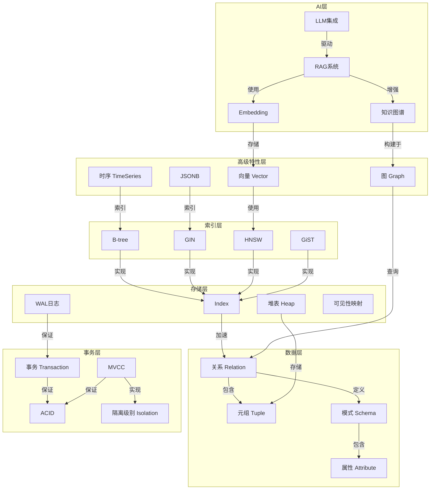
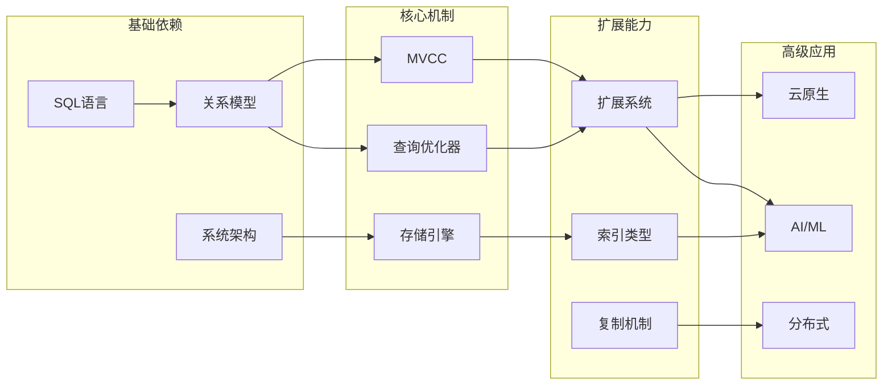

# PostgreSQL_Modern 核心概念知识图谱

> **文档说明**: 本文档提供PostgreSQL_Modern项目的完整概念定义、属性、关系和示例，构建多维知识图谱
> **创建日期**: 2026-03-01
> **文档状态**: ✅ 完整

---

## 一、PostgreSQL核心概念定义

### 1.1 数据模型概念

#### 1.1.1 关系 (Relation)

**定义**: 关系是元组（行）的集合，表示实体或实体间联系的数据结构。

**形式化定义**:

```
关系 R = (A₁, A₂, ..., Aₙ)
其中 Aᵢ 是属性，n 是关系的度(degree)
```

**属性**:

| 属性名 | 类型 | 描述 | 示例 |
|--------|------|------|------|
| 关系名 | string | 关系的唯一标识 | "users", "orders" |
| 属性集 | set<Attribute> | 定义关系的结构 | {id, name, email} |
| 元组集 | set<Tuple> | 关系的实际数据 | {(1,'Alice','<a@x.com>')} |
| 键 | Key | 唯一标识元组的属性集 | PRIMARY KEY (id) |
| 约束 | Constraint | 数据完整性规则 | NOT NULL, UNIQUE |

**关系**:

- **泛化**: 表(Table)是实现关系的具体形式
- **关联**: 关系通过外键与其他关系关联
- **操作**: 关系支持选择(σ)、投影(π)、连接(⋈)等操作

**示例**:

```sql
-- 正例：符合关系定义
CREATE TABLE users (
    id SERIAL PRIMARY KEY,
    name VARCHAR(100) NOT NULL,
    email VARCHAR(255) UNIQUE
);

-- 反例：不符合关系定义（无明确属性）
CREATE TABLE bad_table ();  -- 错误：无属性
```

---

#### 1.1.2 元组 (Tuple)

**定义**: 元组是关系中的一行数据，是属性的有序集合。

**形式化定义**:

```
元组 t = <v₁, v₂, ..., vₙ>
其中 vᵢ ∈ dom(Aᵢ)，是属性 Aᵢ 的值
```

**属性**:

| 属性名 | 类型 | 描述 |
|--------|------|------|
| 值集合 | vector<Value> | 各属性的值 |
| 原子性 | boolean | 值是否不可再分 |
| 唯一性 | boolean | 是否可被唯一标识 |

**关系**:

- **属于**: 元组 ∈ 关系
- **投影**: 元组 → 属性子集的值
- **更新**: 元组可通过UPDATE修改

---

#### 1.1.3 属性 (Attribute)

**定义**: 属性是描述实体特征的数据项，具有名称和域。

**形式化定义**:

```
属性 A = (name, domain, constraints)
```

**属性**:

| 属性名 | 类型 | 描述 | 示例 |
|--------|------|------|------|
| 属性名 | string | 标识符 | "user_id" |
| 数据类型 | DataType | 值的类型 | INTEGER, VARCHAR |
| 域 | Domain | 允许值的集合 | [1, 999999] |
| 约束 | Constraint | 完整性限制 | NOT NULL, CHECK |
| 默认值 | Value | 缺省值 | DEFAULT 0 |

**关系**:

- **组成**: 属性组成关系的模式(Schema)
- **映射**: 属性映射到存储类型
- **依赖**: 属性间存在函数依赖

---

### 1.2 事务概念

#### 1.2.1 事务 (Transaction)

**定义**: 事务是数据库操作的一个逻辑单位，由一组SQL语句组成，这些语句要么全部执行成功，要么全部不执行。

**形式化定义**:

```
事务 T = {op₁, op₂, ..., opₙ}
其中 opᵢ ∈ {READ, WRITE, COMMIT, ROLLBACK}
```

**ACID属性**:

| 属性 | 定义 | 保证机制 | 网络最新进展 |
|------|------|----------|--------------|
| **A-原子性** | 事务不可分割 | WAL日志、回滚段 | AIO优化提交性能(PG 18) |
| **C-一致性** | 事务执行前后数据库处于一致状态 | 约束检查、触发器 | AI驱动一致性检查 |
| **I-隔离性** | 并发事务互不干扰 | MVCC、锁机制 | SSI串行化快照隔离 |
| **D-持久性** | 已提交事务结果永久保存 | WAL刷盘、复制 | 同步复制优化 |

**关系**:

- **包含**: 事务包含多个操作
- **调度**: 事务参与并发调度
- **依赖**: 事务间可能存在读写依赖

**示例**:

```sql
-- 正例：完整的银行转账事务
BEGIN;
    UPDATE accounts SET balance = balance - 100 WHERE id = 1;
    UPDATE accounts SET balance = balance + 100 WHERE id = 2;
    INSERT INTO transactions (from_id, to_id, amount) VALUES (1, 2, 100);
COMMIT;

-- 反例：缺少事务边界
UPDATE accounts SET balance = balance - 100 WHERE id = 1;  -- 风险：部分更新
UPDATE accounts SET balance = balance + 100 WHERE id = 2;  -- 可能失败导致数据不一致
```

---

#### 1.2.2 MVCC (Multi-Version Concurrency Control)

**定义**: MVCC是一种并发控制机制，通过维护数据的多个版本，实现读写操作互不阻塞。

**形式化定义**:

```
MVCC = (VersionChain, Snapshot, VisibilityRules)

VersionChain: 数据项 → [版本列表]
Snapshot: 事务启动时的系统状态
VisibilityRules: 判断版本可见性的规则集
```

**核心属性**:

| 属性 | 定义 | PostgreSQL实现 | 网络最新进展 |
|------|------|----------------|--------------|
| **版本链** | 同一数据的多个版本链表 | xmin/xmax系统列 | 优化版本链遍历(PG 18) |
| **快照** | 事务启动时的活动事务集合 | SnapshotData结构 | 快照导出优化 |
| **可见性规则** | 判断元组是否可见的算法 | HeapTupleSatisfiesMVCC | 性能优化 |
| **垃圾回收** | 清理不可见版本的机制 | VACUUM/AutoVACUUM | 积极冻结策略 |

**可见性规则** (形式化):

```
元组T对事务Tx可见当且仅当:
1. T.xmin 已提交且 T.xmin < Tx.xid
2. T.xmax 为0 或 T.xmax > Tx.xid 或 T.xmax 已回滚
3. T.xmin 不在 Tx 的快照中
```

**关系**:

- **实现**: MVCC实现ACID的隔离性
- **对比**: MVCC vs 2PL vs OCC (详见对比分析)
- **优化**: HOT (Heap Only Tuple)减少版本链长度

**示例**:

```sql
-- 正例：利用MVCC实现无锁读
-- Session A
BEGIN;
UPDATE products SET price = 99 WHERE id = 1;
-- 未提交，其他会话仍看到旧值

-- Session B (并发)
SELECT price FROM products WHERE id = 1;  -- 返回旧值，无阻塞

-- Session A
COMMIT;

-- Session B
SELECT price FROM products WHERE id = 1;  -- 仍返回旧值（快照隔离）
COMMIT;
SELECT price FROM products WHERE id = 1;  -- 新事务看到新值 99

-- 反例：长事务导致表膨胀
BEGIN;
SELECT * FROM large_table;  -- 启动快照
-- 长时间不提交，阻止VACUUM清理死元组
-- 导致表膨胀和性能下降
```

---

### 1.3 索引概念

#### 1.3.1 B-tree索引

**定义**: B-tree是一种自平衡的多路搜索树，保持数据有序并支持对数时间复杂度的查找、插入和删除。

**形式化定义**:

```
B-tree of order m:
- 每个节点最多有 m 个子节点
- 每个非根节点至少有 ⌈m/2⌉ 个子节点
- 根节点至少有 2 个子节点（若非叶子）
- 所有叶子节点在同一层
- 节点内键有序排列
```

**核心属性**:

| 属性 | 定义 | 复杂度 | PostgreSQL实现 |
|------|------|--------|----------------|
| **查找** | 从根到叶子的遍历 | O(logₘ N) | _bt_search |
| **插入** | 可能触发节点分裂 | O(logₘ N) | _bt_insert |
| **删除** | 可能触发节点合并 | O(logₘ N) | _bt_delete |
| **范围查询** | 利用有序性 | O(logₘ N + K) | 支持 |
| **Skip Scan** | 跳跃扫描优化 | O(logₘ N) | PG 18新特性 |

**B-tree不变式**:

```
∀节点n:
1. 键有序性: n.keys[0] < n.keys[1] < ... < n.keys[k-1]
2. 子树约束:
   ∀i, subtree(n, i)的所有键 ∈ (n.keys[i-1], n.keys[i])
3. 平衡性: 所有叶子节点深度相同
```

**关系**:

- **支撑**: B-tree支撑PRIMARY KEY和UNIQUE约束
- **优化**: Skip Scan优化多列索引使用(PG 18)
- **对比**: 对比Hash、GIN、GiST等其他索引类型

**示例**:

```sql
-- 正例：B-tree索引的最佳实践
CREATE INDEX idx_users_email ON users(email);  -- 精确匹配和范围查询

CREATE INDEX idx_orders_date ON orders(created_at);  -- 范围查询

-- 多列索引 + Skip Scan (PG 18)
CREATE INDEX idx_products ON products(region, category, price);
-- 查询 WHERE category = 'Electronics' 也能使用此索引（Skip Scan）

-- 反例：B-tree索引的误用
CREATE INDEX idx_users_bio ON users(bio);  -- 大文本字段不适合B-tree
-- 应使用：
-- CREATE INDEX idx_users_bio ON users USING GIN(to_tsvector('english', bio));
```

---

### 1.4 向量数据库概念

#### 1.4.1 向量嵌入 (Vector Embedding)

**定义**: 向量嵌入是将高维离散数据（文本、图像等）映射到低维连续向量空间的技术表示。

**形式化定义**:

```
嵌入函数 f: X → ℝᵈ
其中 X 是输入空间，d 是嵌入维度
```

**核心属性**:

| 属性 | 定义 | 典型值 | 说明 |
|------|------|--------|------|
| **维度(d)** | 向量的长度 | 384, 768, 1536 | 维度越高表达能力越强 |
| **距离度量** | 向量相似度计算方式 | 余弦、欧氏、内积 | 根据应用场景选择 |
| **量化** | 降低存储和计算成本 | float32→int16 | PG 18标量量化优化 |

**关系**:

- **生成**: 通过LLM（如OpenAI API）生成嵌入
- **存储**: 存储在pgvector的vector类型中
- **检索**: 通过向量索引(HNSW/IVFFlat)加速相似度搜索

**示例**:

```sql
-- 正例：向量嵌入存储和检索
-- 1. 创建带向量列的表
CREATE TABLE documents (
    id SERIAL PRIMARY KEY,
    content TEXT,
    embedding VECTOR(1536)  -- OpenAI text-embedding-3-large
);

-- 2. 创建向量索引
CREATE INDEX idx_docs_embedding ON documents
USING hnsw (embedding vector_cosine_ops);

-- 3. 相似度搜索
SELECT id, content,
       1 - (embedding <=> query_embedding) AS similarity
FROM documents
WHERE embedding <=> query_embedding < 0.3
ORDER BY embedding <=> query_embedding
LIMIT 10;

-- 反例：向量维度过高导致性能问题
CREATE TABLE bad_vectors (
    id SERIAL PRIMARY KEY,
    embedding VECTOR(10000)  -- 过高维度，索引效率低
);
```

---

### 1.5 图数据库概念

#### 1.5.1 属性图 (Property Graph)

**定义**: 属性图是由顶点(Vertex)、边(Edge)和属性(Property)组成的数据模型，顶点和边都可以有属性。

**形式化定义**:

```
属性图 G = (V, E, L, P, λ, σ)
其中:
- V: 顶点集合
- E ⊆ V × V: 边集合
- L: 标签集合
- P: 属性键集合
- λ: V ∪ E → 2ᴸ (标签函数)
- σ: (V ∪ E) × P → Value (属性函数)
```

**核心属性**:

| 属性 | 定义 | 示例 |
|------|------|------|
| **顶点** | 表示实体 | (:Person {name: 'Alice', age: 30}) |
| **边** | 表示关系 | [:KNOWS {since: 2020}] |
| **标签** | 分类标识 | Person, KNOWS |
| **属性** | 键值对数据 | name, age, since |

**关系**:

- **连接**: 边连接两个顶点
- **遍历**: 图算法遍历顶点和边
- **查询**: 使用Cypher或OpenCypher查询

**示例**:

```sql
-- Apache AGE OpenCypher查询示例
-- 正例：社交网络关系查询
SELECT * FROM cypher('social_network', $$
    MATCH (p:Person)-[:KNOWS]->(friend:Person)
    WHERE p.name = 'Alice'
    RETURN friend.name, friend.age
    ORDER BY friend.age DESC
$$) AS (name agtype, age agtype);

-- 反例：不合理的图建模
-- 错误：将本应是属性的数据建模为顶点
-- (User {id: 1})-[:HAS_NAME]->(:Name {value: 'Alice'})  -- 过于复杂
-- 正确：
-- (:User {id: 1, name: 'Alice'})
```

---

## 二、概念关系网络

### 2.1 概念关联图



### 2.2 概念依赖关系图



---

## 三、概念属性矩阵

### 3.1 核心概念属性对比

| 概念 | 核心功能 | 时间复杂度 | 空间复杂度 | 并发控制 | 适用场景 |
|------|----------|------------|------------|----------|----------|
| **B-tree** | 精确匹配、范围查询 | O(log N) | O(N) | 锁/无锁 | 通用索引 |
| **Hash** | 精确匹配 | O(1) | O(N) | 锁 | 等值查询 |
| **GIN** | 全文搜索、数组 | O(log N) | O(N×M) | 锁 | 多值属性 |
| **GiST** | 多维数据 | O(log N) | O(N) | 锁 | 空间数据 |
| **HNSW** | 向量相似度 | O(log N) | O(N×C) | 无锁 | AI检索 |
| **BRIN** | 块级索引 | O(1) | O(N/B) | 无 | 时序数据 |

### 3.2 事务隔离级别属性

| 隔离级别 | 脏读 | 不可重复读 | 幻读 | 实现机制 | 性能 | 适用场景 |
|----------|------|------------|------|----------|------|----------|
| **READ UNCOMMITTED** | ✓ | ✓ | ✓ | 无 | 最高 | 几乎不用 |
| **READ COMMITTED** | ✗ | ✓ | ✓ | MVCC | 高 | 默认OLTP |
| **REPEATABLE READ** | ✗ | ✗ | ✓ | MVCC+快照 | 中 | 报表查询 |
| **SERIALIZABLE** | ✗ | ✗ | ✗ | SSI | 低 | 金融交易 |

---

**下接**: [03-概念关系属性推理决策树](./03-概念关系属性推理决策树.md)
