# 概念关系属性推理决策树

> **文档说明**: 本文档提供PostgreSQL技术选型和问题解决的决策树图谱，支持多维推理和决策
> **创建日期**: 2026-03-01

---

## 一、数据库选型决策树

### 1.1 PostgreSQL适用性决策

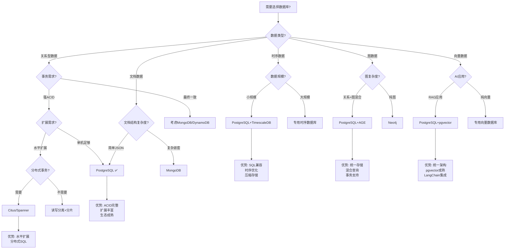

**决策规则说明**:

| 决策节点 | 条件 | 推荐方案 | 理由 |
|----------|------|----------|------|
| 关系型+强ACID+单机 | 标准OLTP | PostgreSQL | 完整ACID、丰富特性、成熟生态 |
| 关系型+分布式事务 | 金融/电商 | Citus/Spanner | 强一致性、水平扩展 |
| 关系+向量混合 | RAG应用 | PostgreSQL+pgvector | 统一架构、简化运维 |
| 关系+图混合 | 知识图谱 | PostgreSQL+AGE | ACID图事务、混合查询 |

---

### 1.2 PostgreSQL版本选择决策

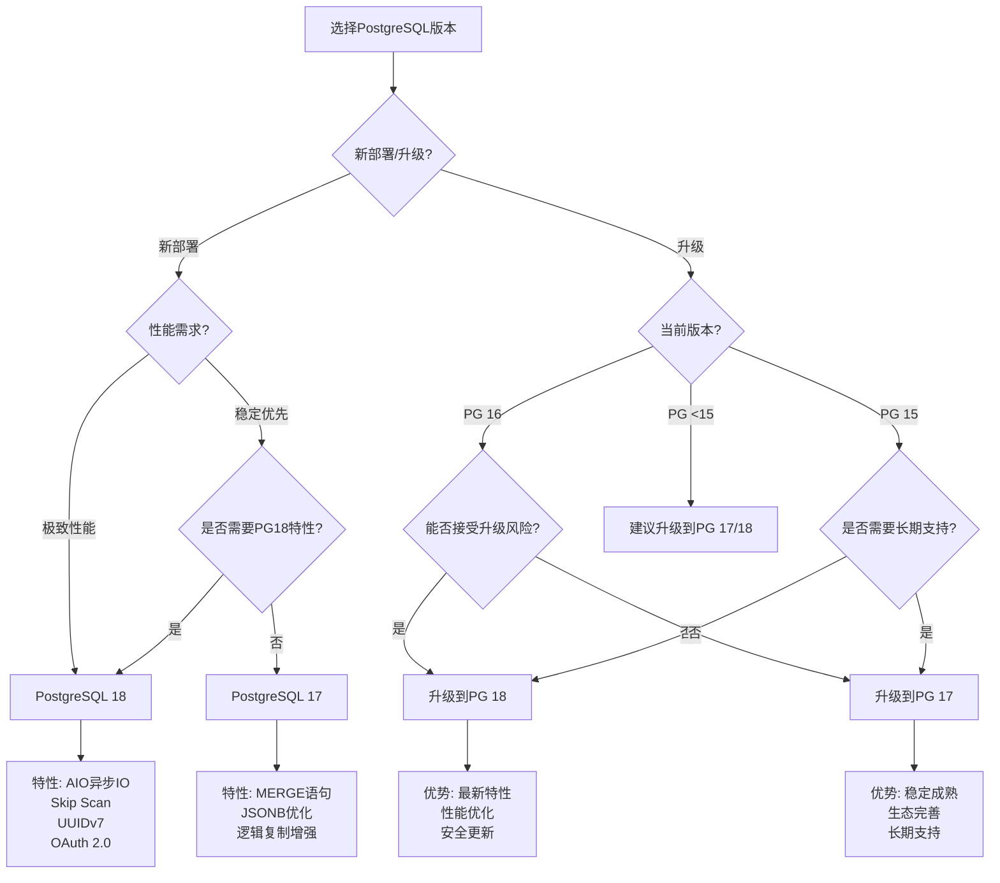

---

## 二、索引选型决策树

### 2.1 索引类型选择决策

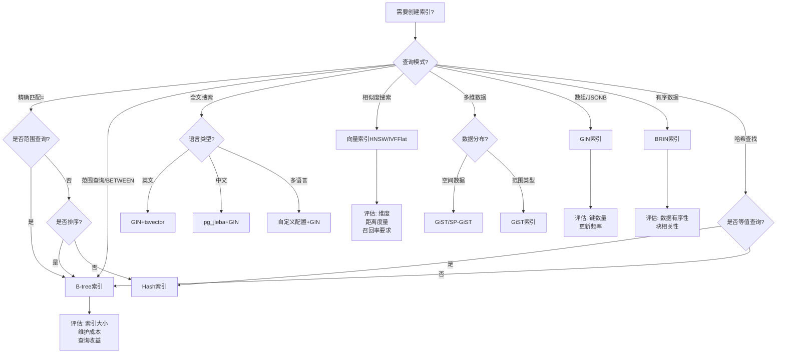

### 2.2 复合索引列顺序决策

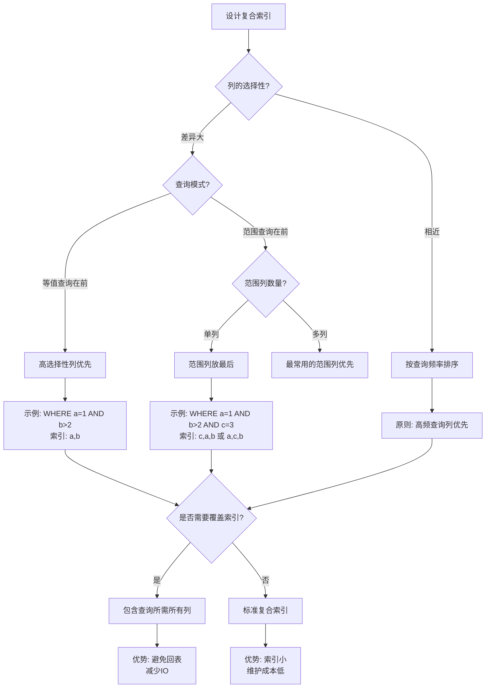

---

## 三、事务隔离级别选型决策

### 3.1 隔离级别选择决策树

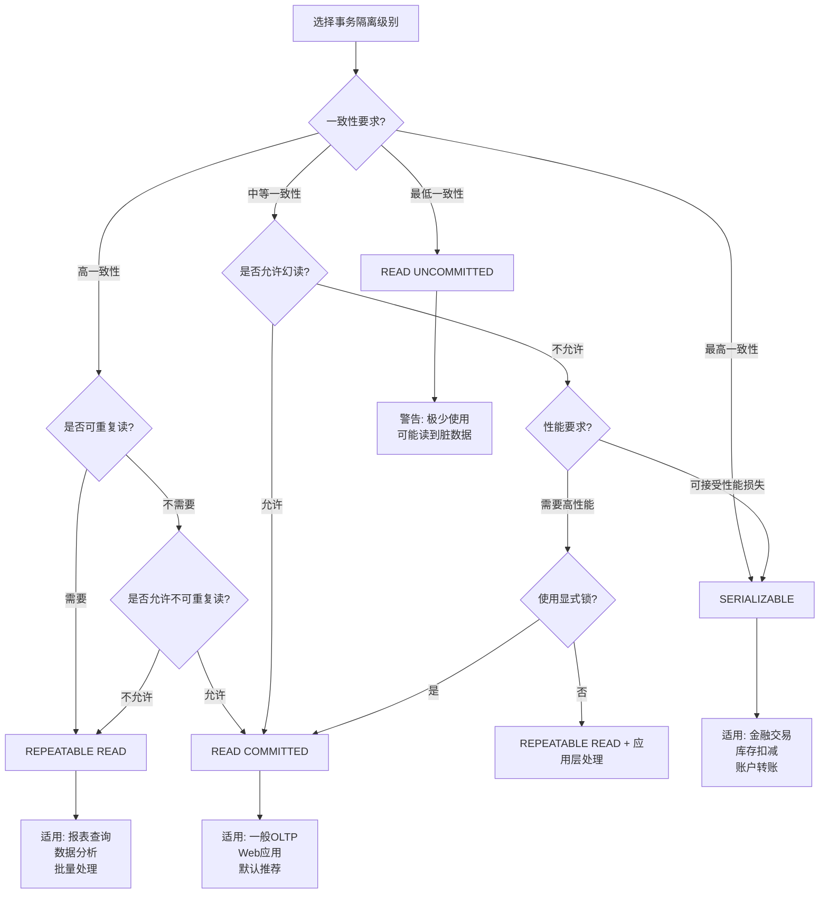

### 3.2 并发控制策略决策

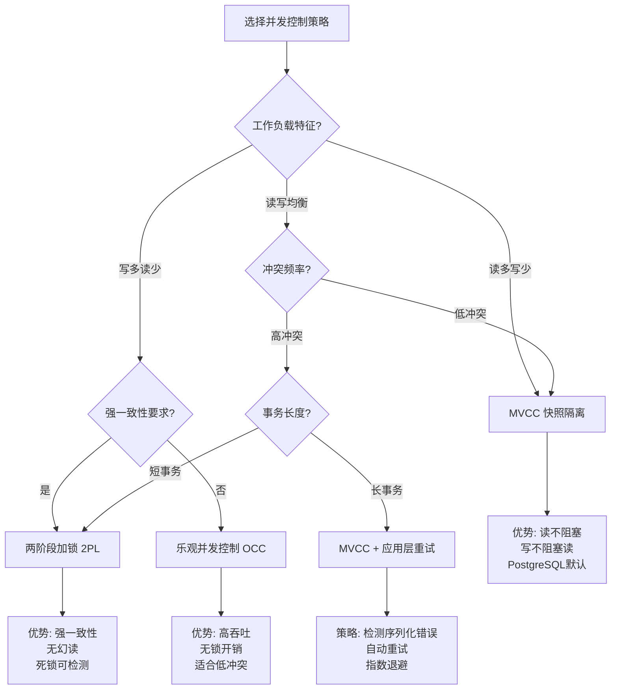

---

## 四、AI应用架构决策树

### 4.1 RAG系统选型决策

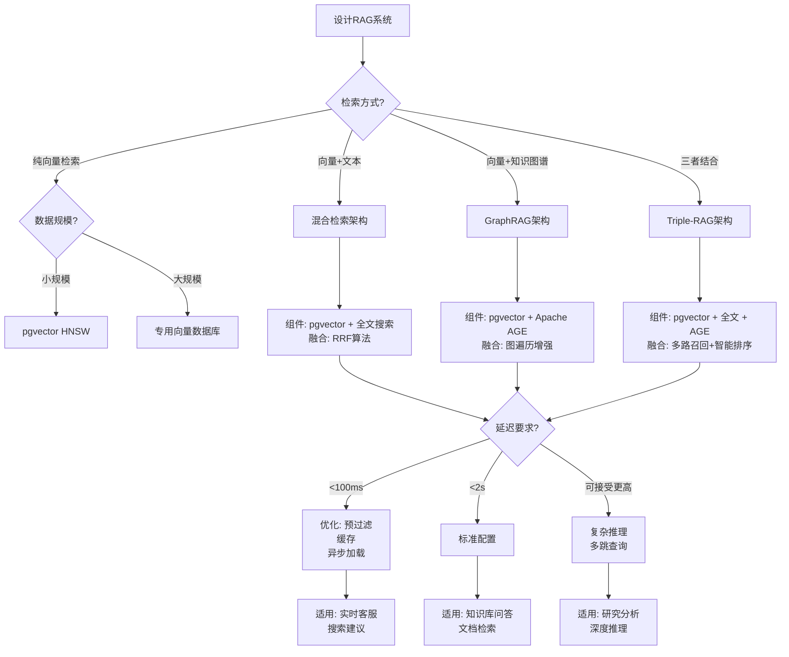

### 4.2 Embedding模型选型决策

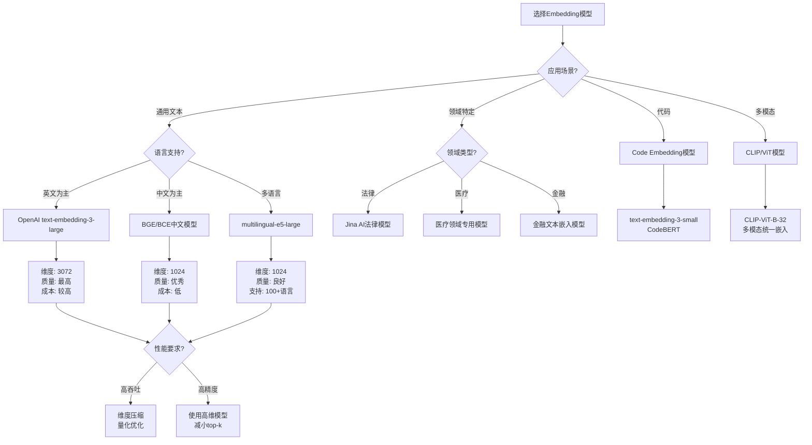

---

## 五、分布式架构决策树

### 5.1 分布式PostgreSQL选型

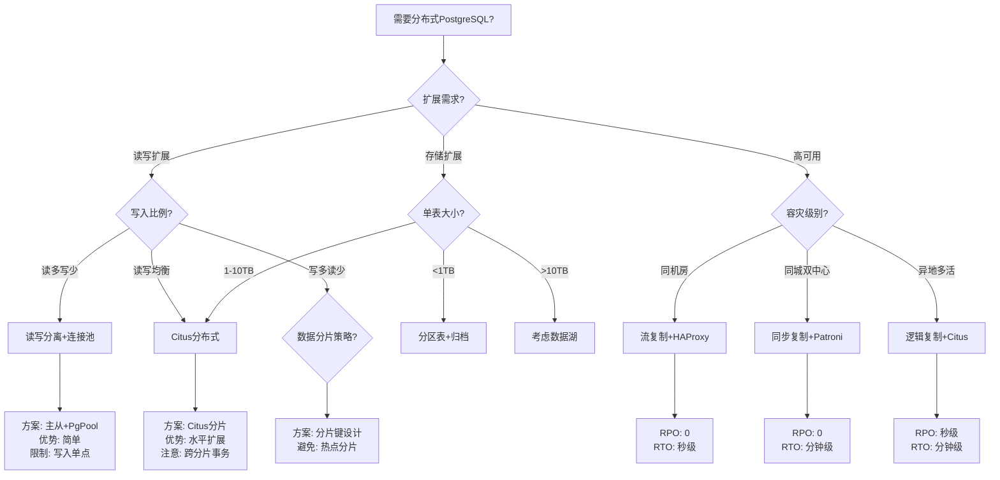

### 5.2 一致性模型决策

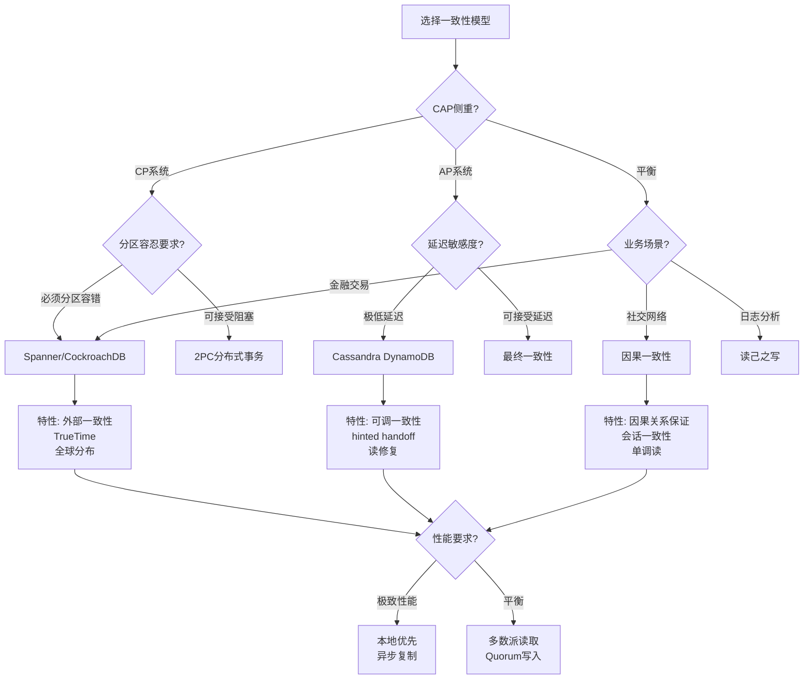

---

## 六、性能优化决策树

### 6.1 慢查询优化决策

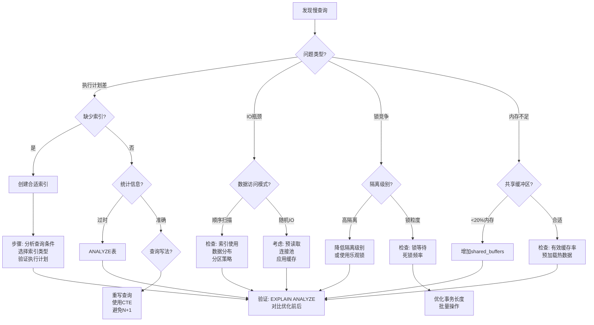

### 6.2 容量规划决策

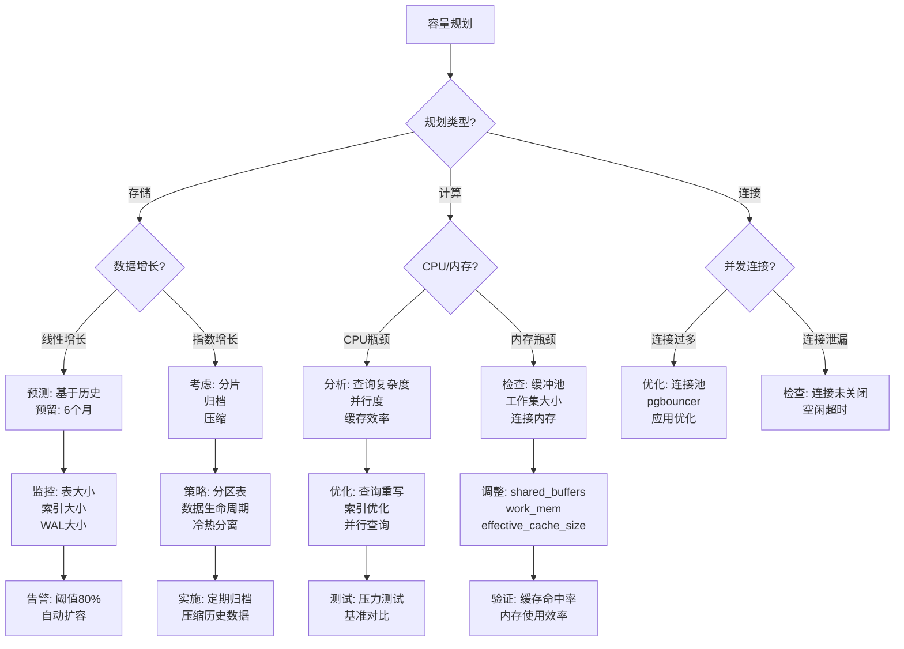

---

**下接**: [04-公理定理推理证明树](./04-公理定理推理证明树.md)
