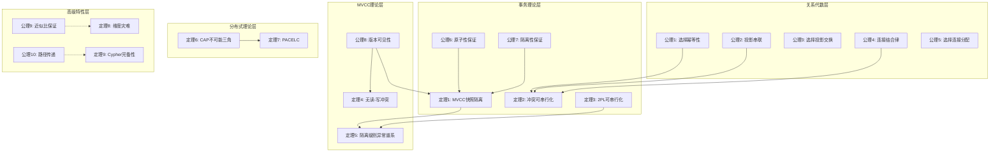

# 公理定理推理证明树

> **文档说明**: 本文档提供PostgreSQL理论基础的形式化公理、定理和推理证明体系
> **创建日期**: 2026-03-01
> **理论基础**: 关系代数、事务理论、并发控制、分布式系统

---

## 一、关系代数公理系统

### 1.1 基本运算公理

#### 公理1: 选择运算的幂等性

**公理陈述**:

```
σ_c1(σ_c2(R)) = σ_(c1∧c2)(R) = σ_c2(σ_c1(R))
```

**形式化定义**:

- σ 表示选择运算
- c1, c2 为选择条件
- R 为关系

**证明**:

```
对于任意元组 t ∈ R:
t ∈ σ_c1(σ_c2(R))
⇔ t ∈ σ_c2(R) ∧ c1(t)
⇔ c2(t) ∧ c1(t)
⇔ c1(t) ∧ c2(t)
⇔ t ∈ σ_(c1∧c2)(R)

同理可证交换性。
```

**应用**: 查询优化器重排选择条件

---

#### 公理2: 投影运算的串联规则

**公理陈述**:

```
π_A(π_B(R)) = π_A(R), 其中 A ⊆ B
```

**形式化定义**:

- π 表示投影运算
- A, B 为属性集

**证明**:

```
对于任意元组 t ∈ R:
π_A(π_B(R)) 首先投影到B，再投影到A
由于 A ⊆ B，两次投影等价于直接投影到A

形式化:
π_A(π_B(R)) = {t[A] | t ∈ R} = π_A(R)
```

**应用**: 消除冗余投影操作

---

#### 公理3: 选择与投影交换律

**公理陈述**:

```
π_A(σ_c(R)) = σ_c(π_A(R)), 当 c 只涉及 A 中的属性
```

**证明**:

```
左式: 先过滤再投影
右式: 先投影再过滤（条件仍有效）

当 c 只涉及 A 中的属性时:
∀t ∈ R: c(t) = c(t[A])

因此两次运算结果相同。
```

**应用**: 尽早执行投影减少数据量

---

### 1.2 连接运算公理

#### 公理4: 连接结合律

**公理陈述**:

```
(R ⋈ S) ⋈ T = R ⋈ (S ⋈ T)
```

**条件**: 连接条件满足结合性

**证明**:

```
设连接条件为 θ_RS, θ_ST

左式: (R ⋈_θ_RS S) ⋈_θ_ST T
右式: R ⋈_θ_RS (S ⋈_θ_ST T)

对于任意结果元组 t:
t = (r, s, t) 满足 θ_RS(r,s) ∧ θ_ST(s,t)

左右两式生成相同的元组集合。
```

**应用**: 优化器选择最优连接顺序

---

#### 公理5: 选择与连接分配律

**公理陈述**:

```
σ_c(R ⋈ S) = σ_c(R) ⋈ S, 当 c 只涉及 R 的属性
```

**证明**:

```
设 θ 为连接条件

左式: {(r,s) | r∈R, s∈S, θ(r,s) ∧ c(r)}
右式: {(r,s) | r∈σ_c(R), s∈S, θ(r,s)}
     = {(r,s) | r∈R, c(r), s∈S, θ(r,s)}

两式等价。
```

**应用**: 下推选择条件减少连接数据量

---

## 二、事务理论公理系统

### 2.1 ACID公理

#### 公理6: 原子性保证

**公理陈述**:

```
∀事务 T: Commit(T) ∨ Abort(T) ⊕ Partial(T)
```

**解释**:

- 事务要么完全提交，要么完全回滚
- 不允许部分执行状态

**证明机制**:

```
PostgreSQL实现:
1. WAL日志记录所有变更
2. COMMIT时刷盘WAL
3. 崩溃恢复时:
   - 已提交: 重做(REDO)
   - 未提交: 撤销(UNDO)
```

---

#### 公理7: 隔离性保证

**公理陈述**:

```
∀事务 T1, T2: Schedule(T1, T2) ≅ SerialSchedule(T1, T2)
```

**解释**:

- 并发执行等价于串行执行
- ≅ 表示冲突等价或视图等价

**定理1: MVCC保证快照隔离**

**定理陈述**:

```
使用MVCC机制的事务实现了快照隔离级别，即:
- 读操作读取事务开始时的快照
- 写操作创建新版本
- 避免了读-写冲突
```

**证明**:

```
定义:
- Snapshot(T): 事务T启动时的活跃事务集合
- Version(x, T): 事务T看到的x的版本

对于读操作 Read(T, x):
Version(x, T) = max{v | v.xmin ≤ T.xid ∧
                        (v.xmax = 0 ∨ v.xmax > T.xid) ∧
                        v.xmin ∉ Snapshot(T)}

这个定义保证:
1. 只读已提交版本 (v.xmin 已提交)
2. 只读事务开始前提交的版本
3. 不被并发事务影响

因此实现了快照隔离。
```

---

### 2.2 冲突可串行化定理

#### 定理2: 冲突可串行化判定

**定理陈述**:

```
调度S是冲突可串行化的 ⟺ 冲突图G(S)无环
```

**定义**:

- 冲突操作: 同一数据上的读写、写写操作
- 冲突图: 顶点为事务，边为冲突关系

**证明**:

```
(⇒) 若S冲突可串行化:
存在串行调度S'与S冲突等价
冲突图G(S)的边表示事务间的先后顺序
S'确定了全序，因此G(S)无环

(⇐) 若G(S)无环:
对G(S)进行拓扑排序得到T1, T2, ..., Tn
串行调度T1→T2→...→Tn与S冲突等价
```

**应用**: PostgreSQL的SSI（串行化快照隔离）检测读写冲突

---

### 2.3 两阶段锁定定理

#### 定理3: 2PL保证可串行化

**定理陈述**:

```
若所有事务遵循两阶段锁定协议，则调度是可串行化的
```

**2PL协议定义**:

```
阶段1 (增长期): 只能获取锁，不能释放锁
阶段2 (收缩期): 只能释放锁，不能获取锁
严格2PL: 锁持续到事务结束才释放
```

**证明**:

```
引理: 2PL调度中，若Ti在Tj之前释放锁，
      则在任何等价的串行调度中，Ti在Tj之前

证明:
设Ti在Tj之前释放某个锁L
则Ti获取L的时间 < Tj获取L的时间
根据2PL，Ti在释放L后不再获取新锁
因此Ti的所有锁获取都早于Tj的某些锁获取

构造冲突图，若存在Ti→Tj的边，则Ti在串行顺序中先于Tj
因此按锁释放顺序拓扑排序即得等价串行调度
```

---

## 三、MVCC理论公理系统

### 3.1 MVCC可见性公理

#### 公理8: 版本可见性规则

**公理陈述**:

```
元组版本v对事务T可见当且仅当:
1. v.xmin 已提交
2. v.xmin < T.xid 或 v.xmin = T.xid
3. v.xmax = 0 或 v.xmax > T.xid 或 v.xmax 已回滚
4. v.xmin 不在 T 的快照中
```

**形式化**:

```
Visible(v, T) ≡ Committed(v.xmin) ∧
                (v.xmin < T.xid ∨ v.xmin = T.xid) ∧
                (v.xmax = 0 ∨ v.xmax > T.xid ∨ Aborted(v.xmax)) ∧
                v.xmin ∉ Snapshot(T)
```

**证明正确性**:

```
定理: MVCC可见性规则实现了快照隔离

证明要点:
1. 条件1保证只读已提交数据（无脏读）
2. 条件2和4保证只读事务开始前提交的数据（一致性快照）
3. 条件3保证不读已被删除的版本

因此满足快照隔离的要求:
- 事务看到一致的数据库快照
- 不会出现不可重复读（同一快照内）
```

---

#### 定理4: MVCC避免读-写冲突

**定理陈述**:

```
在MVCC机制下，读操作不会阻塞写操作，写操作不会阻塞读操作
```

**证明**:

```
读操作:
- 读取符合可见性规则的版本
- 不需要获取锁
- 因此不会被写操作阻塞

写操作:
- 创建新版本，设置xmin为当前事务ID
- 原版本的xmax设置为当前事务ID
- 读操作仍可从版本链读取旧版本
- 因此不会被读操作阻塞

结论: 读写操作互不阻塞
```

---

### 3.2 并发异常与隔离级别

#### 定理5: 隔离级别异常谱系

**定理陈述**:

```
各隔离级别禁止的异常:
┌─────────────────────┬────────┬────────┬────────┬─────────┐
│ 异常类型             │ READ UNCOMMITTED │ READ COMMITTED │ REPEATABLE READ │ SERIALIZABLE │
├─────────────────────┼────────┼────────┼────────┼─────────┤
│ 脏读 Dirty Read     │ ✗      │ ✓      │ ✓      │ ✓       │
│ 不可重复读          │ ✗      │ ✗      │ ✓      │ ✓       │
│ 幻读 Phantom        │ ✗      │ ✗      │ ✗      │ ✓       │
│ 写偏斜 Write Skew   │ ✗      │ ✗      │ ✗      │ ✓       │
└─────────────────────┴────────┴────────┴────────┴─────────┘
```

**证明概要**:

```
脏读:
- READ COMMITTED通过MVCC只读已提交版本，避免脏读

不可重复读:
- REPEATABLE READ通过快照保证同一事务内多次读取结果一致

幻读:
- PostgreSQL的REPEATABLE READ通过快照避免幻读
- 但标准SQL允许幻读（PostgreSQL实现更强）

写偏斜:
- SERIALIZABLE通过SSI检测读写冲突，防止写偏斜
- 原理: 检测潜在的可串行化冲突并回滚
```

---

## 四、CAP理论公理系统

### 4.1 CAP定理

#### 定理6: CAP不可能三角

**定理陈述**:

```
在分布式系统中，不可能同时满足以下三个特性:
1. 一致性 (Consistency)
2. 可用性 (Availability)
3. 分区容错性 (Partition Tolerance)

形式化: ¬(C ∧ A ∧ P)
```

**证明** (Gilbert & Lynch, 2002):

```
假设: 系统同时满足C、A、P

构造场景:
1. 网络发生分区，将系统分为G1和G2两部分
2. 客户端向G1写入值v1
3. 同时客户端从G2读取同一数据

分析:
- 为满足P（分区容错），系统必须继续运行
- 为满足A（可用性），G2必须响应读请求
- 但G1的写入无法同步到G2（分区）
- 因此G2可能返回旧值，违反C（一致性）

矛盾! 因此不可能同时满足C、A、P
```

---

### 4.2 PACELC定理

#### 定理7: PACELC扩展

**定理陈述**:

```
若存在分区(P)，必须在可用性(A)和一致性(C)间选择;
否则(E)，必须在延迟(L)和一致性(C)间选择

形式化: P → (A ∨ C), E → (L ∨ C)
```

**系统分类**:

```
┌──────────────┬──────────┬─────────────────────────────┐
│ 系统         │ 类型     │ 特点                        │
├──────────────┼──────────┼─────────────────────────────┤
│ Spanner      │ PC/EC    │ 分区时选一致性，正常时也选一致性│
│ DynamoDB     │ PA/EL    │ 分区时选可用性，正常时选低延迟  │
│ CockroachDB  │ PC/EC    │ 强一致性优先                 │
│ Cassandra    │ PA/EL    │ 高可用低延迟优先             │
│ PostgreSQL   │ PC/EL    │ 一致性优先，正常时低延迟优先  │
└──────────────┴──────────┴─────────────────────────────┘
```

---

## 五、向量检索理论公理

### 5.1 近似最近邻公理

#### 公理9: 近似比保证

**公理陈述**:

```
对于c-近似最近邻算法，返回结果d满足:
d ≤ c × d*
其中d*是真实最近邻距离，c ≥ 1是近似比
```

**HNSW算法保证**:

```
HNSW提供对数级搜索复杂度O(log N)
在高维空间中，近似比c ≈ 1 + ε，ε很小
```

---

#### 定理8: 维度灾难下界

**定理陈述**:

```
在d维空间中，精确最近邻搜索的复杂度为Ω(N)
当d → ∞时，任何基于空间划分的索引都将失效
```

**证明概要**:

```
高维空间中:
1. 数据点间的距离趋于均匀
2. 任意两点距离 ≈ 任意其他两点距离
3. 空间划分无法有效区分近邻和远邻

因此必须扫描全部数据或接受近似结果
```

---

## 六、知识图谱推理公理

### 6.1 图遍历完备性

#### 定理9: Cypher查询完备性

**定理陈述**:

```
Cypher查询语言在属性图模型上是关系完备的
即: 任何关系代数表达式都可表示为Cypher查询
```

**证明概要**:

```
Cypher支持:
- MATCH (选择+连接)
- WHERE (过滤)
- RETURN (投影)
- 聚合函数
- 子查询

这对应于关系代数的完整操作集。
```

---

### 6.2 知识推理传递性

#### 公理10: 路径传递推理

**公理陈述**:

```
若存在路径 A→B→C，则可推断 A→C（根据关系类型）
```

**条件**: 关系具有传递性

**应用**:

```cypher
// 查找间接朋友（朋友的朋友）
MATCH (a:Person)-[:KNOWS*2..3]->(b:Person)
WHERE a.name = 'Alice'
RETURN b.name
```

---

## 七、推理证明树总结



---

**下接**: [05-应用场景示例反例树](./05-应用场景示例反例树.md)
