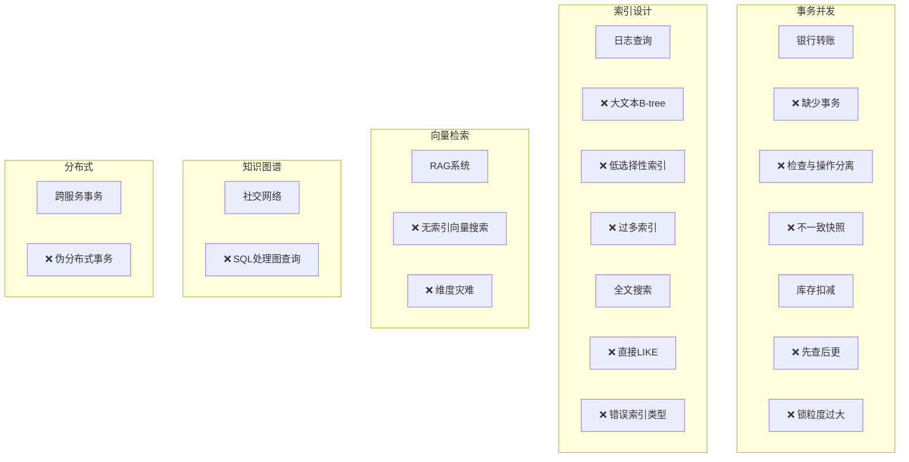
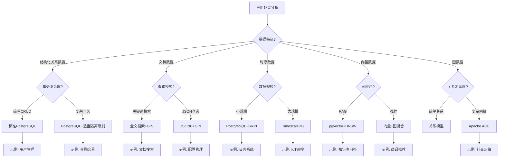

# 应用场景示例反例树

> **文档说明**: 本文档提供PostgreSQL各技术特性的应用场景、正确示例和反例分析，支持实战决策
> **创建日期**: 2026-03-01

---

## 一、事务与并发控制场景

### 1.1 银行转账场景

#### 场景描述

```
需求: 实现安全的账户转账，保证资金一致性
约束:
- 不允许资金丢失或重复
- 支持高并发转账
- 必须ACID保证
```

#### 正确示例 ✅

```sql
-- 方案1: 使用SERIALIZABLE隔离级别
BEGIN ISOLATION LEVEL SERIALIZABLE;
    -- 检查余额
    SELECT balance FROM accounts
    WHERE account_id = 1 AND balance >= 100
    FOR UPDATE;

    -- 扣款
    UPDATE accounts
    SET balance = balance - 100
    WHERE account_id = 1;

    -- 入账
    UPDATE accounts
    SET balance = balance + 100
    WHERE account_id = 2;

    -- 记录日志
    INSERT INTO transfer_logs (from_id, to_id, amount)
    VALUES (1, 2, 100);
COMMIT;
```

```sql
-- 方案2: 使用乐观锁（适合低冲突场景）
BEGIN;
    -- 读取当前版本
    SELECT balance, version FROM accounts WHERE account_id = 1;
    -- 应用层计算: new_balance = balance - 100

    -- 更新时检查版本
    UPDATE accounts
    SET balance = 900, version = version + 1
    WHERE account_id = 1 AND version = 1;

    -- 检查影响行数，为0则重试
COMMIT;
```

**成功要素**:

1. 使用适当隔离级别
2. FOR UPDATE防止更新丢失
3. 原子性操作保证一致性
4. 版本控制支持乐观并发

---

#### 反例分析 ❌

```sql
-- 反例1: 缺少事务边界
UPDATE accounts SET balance = balance - 100 WHERE account_id = 1;
-- 如果此时系统崩溃，资金丢失！
UPDATE accounts SET balance = balance + 100 WHERE account_id = 2;

-- 问题: 非原子操作，可能部分执行
```

```sql
-- 反例2: 检查余额和扣款非原子
BEGIN;
    SELECT balance FROM accounts WHERE account_id = 1;
    -- 应用层检查: if balance >= 100
    -- 此时其他事务可能已扣款！

    UPDATE accounts SET balance = balance - 100 WHERE account_id = 1;
    -- 可能导致透支！
COMMIT;

-- 问题: 竞态条件，检查与操作分离
```

```sql
-- 反例3: 不一致的快读
BEGIN ISOLATION LEVEL READ COMMITTED;
    SELECT balance FROM accounts WHERE account_id = 1;  -- 读取: 1000
    -- 其他事务扣款成功
    SELECT balance FROM accounts WHERE account_id = 1;  -- 读取: 900
    -- 同一事务内不一致！
COMMIT;

-- 问题: READ COMMITTED在长时间事务中可能产生困惑
```

---

### 1.2 库存扣减场景

#### 场景描述

```
需求: 电商系统秒杀库存扣减
约束:
- 防止超卖
- 支持高并发
- 性能要求高
```

#### 正确示例 ✅

```sql
-- 方案1: 数据库层原子扣减（推荐）
BEGIN ISOLATION LEVEL REPEATABLE READ;
    UPDATE products
    SET stock = stock - 1
    WHERE product_id = 1001
      AND stock > 0;

    -- 检查影响行数
    -- 如果为0，表示库存不足

    INSERT INTO orders (product_id, user_id, status)
    VALUES (1001, 'user_123', 'success');
COMMIT;

-- 优点:
-- 1. 原子操作，无竞态条件
-- 2. 行级锁粒度小
-- 3. 自动处理冲突（事务回滚重试）
```

```sql
-- 方案2: 使用 Advisory Lock 优化热点
BEGIN;
    -- 获取产品级锁（应用层哈希）
    SELECT pg_advisory_lock(hashtext('product:1001'));

    SELECT stock FROM products WHERE product_id = 1001;
    -- 检查库存...

    UPDATE products SET stock = stock - 1 WHERE product_id = 1001;

    SELECT pg_advisory_unlock(hashtext('product:1001'));
COMMIT;

-- 优点: 控制锁粒度，避免行锁升级
```

---

#### 反例分析 ❌

```sql
-- 反例1: 先查后更的经典错误
BEGIN;
    SELECT stock FROM products WHERE product_id = 1001;
    -- 应用层判断: if stock > 0
    -- 此时其他线程可能已扣减！

    UPDATE products SET stock = stock - 1 WHERE product_id = 1001;
COMMIT;

-- 问题: 100个线程同时查到stock=1，都执行更新，超卖99个！
```

```sql
-- 反例2: 错误使用锁
BEGIN;
    -- 对整个表加锁！
    LOCK TABLE products IN ACCESS EXCLUSIVE MODE;

    UPDATE products SET stock = stock - 1 WHERE product_id = 1001;
COMMIT;

-- 问题: 锁粒度过大，完全串行化，性能极差
```

---

## 二、索引设计场景

### 2.1 日志查询优化

#### 场景描述

```
需求: 优化日志表查询性能
表结构: logs(id, level, message, created_at, user_id)
查询模式:
- 按时间范围查询
- 按日志级别过滤
- 按用户ID查询
```

#### 正确示例 ✅

```sql
-- 方案1: 分区表 + BRIN索引（适合时序数据）
CREATE TABLE logs (
    id BIGSERIAL,
    level VARCHAR(10),
    message TEXT,
    created_at TIMESTAMP,
    user_id BIGINT
) PARTITION BY RANGE (created_at);

-- 按月分区
CREATE TABLE logs_2024_01 PARTITION OF logs
    FOR VALUES FROM ('2024-01-01') TO ('2024-02-01');
-- ... 其他分区

-- BRIN索引：适合大范围有序数据
CREATE INDEX idx_logs_created_brin ON logs
USING BRIN (created_at) WITH (pages_per_range = 128);

-- 精确查询索引
CREATE INDEX idx_logs_user ON logs (user_id, created_at);
```

```sql
-- 方案2: 部分索引（针对高频查询优化）
-- 假设ERROR级别日志查询频繁
CREATE INDEX idx_logs_error ON logs (created_at)
WHERE level = 'ERROR';

-- 查询时自动使用部分索引
SELECT * FROM logs
WHERE level = 'ERROR' AND created_at > NOW() - INTERVAL '1 day';
```

---

#### 反例分析 ❌

```sql
-- 反例1: 大文本字段上建B-tree
CREATE INDEX idx_logs_message ON logs (message);

-- 问题:
-- 1. B-tree对大文本效率低
-- 2. 索引体积巨大
-- 3. 维护成本高
-- 应该用: GIN索引做全文搜索
```

```sql
-- 反例2: 低选择性列单独索引
CREATE INDEX idx_logs_level ON logs (level);

-- 问题:
-- level只有几种值（DEBUG/INFO/WARN/ERROR），选择性低
-- 查询时可能不走索引，或者回表成本高
-- 应该: 与其他列建复合索引
```

```sql
-- 反例3: 过多索引
CREATE INDEX idx1 ON logs (created_at);
CREATE INDEX idx2 ON logs (user_id);
CREATE INDEX idx3 ON logs (level);
CREATE INDEX idx4 ON logs (created_at, user_id);
CREATE INDEX idx5 ON logs (user_id, created_at);
-- ... 更多索引

-- 问题:
-- 1. 写入性能急剧下降
-- 2. 存储空间浪费
-- 3. 优化器选择困难
-- 原则: 索引数量应权衡读写比例
```

---

### 2.2 全文搜索场景

#### 场景描述

```
需求: 实现文档内容搜索
表结构: documents(id, title, content, author)
查询需求:
- 标题和内容联合搜索
- 支持中文分词
- 结果按相关性排序
```

#### 正确示例 ✅

```sql
-- 方案1: PostgreSQL原生全文搜索（英文）
-- 1. 创建搜索向量列
ALTER TABLE documents
ADD COLUMN search_vector tsvector
GENERATED ALWAYS AS (
    setweight(to_tsvector('english', title), 'A') ||
    setweight(to_tsvector('english', content), 'B')
) STORED;

-- 2. 创建GIN索引
CREATE INDEX idx_docs_search ON documents
USING GIN (search_vector);

-- 3. 搜索查询
SELECT id, title, ts_rank(search_vector, query) AS rank
FROM documents,
     plainto_tsquery('english', 'PostgreSQL tutorial') query
WHERE search_vector @@ query
ORDER BY rank DESC;
```

```sql
-- 方案2: 中文全文搜索（pg_jieba）
-- 1. 安装pg_jieba扩展
CREATE EXTENSION pg_jieba;

-- 2. 创建索引
CREATE INDEX idx_docs_cn ON documents
USING GIN (to_tsvector('jiebacfg', content));

-- 3. 中文搜索
SELECT * FROM documents
WHERE to_tsvector('jiebacfg', content) @@
      to_tsquery('jiebacfg', '数据库 & 优化');
```

---

#### 反例分析 ❌

```sql
-- 反例1: 直接like查询
SELECT * FROM documents
WHERE content LIKE '%PostgreSQL%';

-- 问题:
-- 1. 全表扫描
-- 2. 前缀通配符无法使用索引
-- 3. 性能随数据量线性下降
```

```sql
-- 反例2: 错误使用GiST代替GIN
CREATE INDEX idx_docs_wrong ON documents
USING GiST (to_tsvector('english', content));

-- 问题:
-- GiST全文搜索性能不如GIN
-- 只有GIN支持全文搜索的所有操作
```

---

## 三、向量检索场景

### 3.1 RAG知识库场景

#### 场景描述

```
需求: 构建企业知识库问答系统
数据: 技术文档、产品手册、FAQ
要求:
- 语义相似度检索
- 支持混合搜索（向量+关键词）
- 延迟<500ms
```

#### 正确示例 ✅

```sql
-- 方案1: 基础RAG架构
-- 1. 创建文档表
CREATE TABLE knowledge_base (
    id SERIAL PRIMARY KEY,
    title TEXT,
    content TEXT,
    embedding VECTOR(1536),
    metadata JSONB,
    created_at TIMESTAMP DEFAULT NOW()
);

-- 2. 创建HNSW索引
CREATE INDEX idx_kb_embedding ON knowledge_base
USING hnsw (embedding vector_cosine_ops)
WITH (m = 16, ef_construction = 64);

-- 3. 相似度搜索（带元数据过滤）
SELECT id, title, content,
       1 - (embedding <=> query_embedding) AS similarity
FROM knowledge_base
WHERE metadata->>'category' = 'technical'
  AND embedding <=> query_embedding < 0.3
ORDER BY embedding <=> query_embedding
LIMIT 5;
```

```sql
-- 方案2: 混合搜索（向量+全文）
WITH vector_results AS (
    SELECT id,
           1 - (embedding <=> query_embedding) AS v_score
    FROM knowledge_base
    ORDER BY embedding <=> query_embedding
    LIMIT 100
),
text_results AS (
    SELECT id,
           ts_rank(search_vector, query) AS t_score
    FROM knowledge_base,
         plainto_tsquery('english', search_text) query
    WHERE search_vector @@ query
    ORDER BY t_score DESC
    LIMIT 100
)
SELECT kb.id, kb.title, kb.content,
       COALESCE(v.v_score * 0.7, 0) +
       COALESCE(t.t_score * 0.3, 0) AS final_score
FROM knowledge_base kb
LEFT JOIN vector_results v ON kb.id = v.id
LEFT JOIN text_results t ON kb.id = t.id
WHERE v.id IS NOT NULL OR t.id IS NOT NULL
ORDER BY final_score DESC
LIMIT 10;
```

---

#### 反例分析 ❌

```sql
-- 反例1: 无索引的向量搜索
SELECT id, content,
       embedding <=> query_embedding AS distance
FROM knowledge_base
ORDER BY distance
LIMIT 10;

-- 问题:
-- 全表扫描+全量向量计算
-- 复杂度O(N×d)，N大时不可接受
```

```sql
-- 反例2: 过高维度导致性能问题
CREATE TABLE bad_example (
    id SERIAL PRIMARY KEY,
    embedding VECTOR(10000)  -- 维度太高！
);

-- 问题:
-- 1. 存储开销大
-- 2. 距离计算慢
-- 3. HNSW索引效果差（维度灾难）
-- 建议: 一般1536维足够，可通过PCA降维
```

---

## 四、知识图谱场景

### 4.1 社交网络分析

#### 场景描述

```
需求: 分析社交网络中的关系
数据: 用户、关注关系、互动记录
查询:
- 找出朋友的朋友
- 计算影响力传播路径
- 发现社群结构
```

#### 正确示例 ✅

```sql
-- Apache AGE方案
-- 1. 创建图
SELECT * FROM ag_catalog.create_graph('social_network');

-- 2. 导入数据
SELECT * FROM cypher('social_network', $$
    CREATE (:Person {id: 1, name: 'Alice', influence: 0.8})
$$) AS (v agtype);

-- 3. 朋友的朋友推荐（排除直接朋友）
SELECT * FROM cypher('social_network', $$
    MATCH (a:Person {name: 'Alice'})-[:KNOWS]->(friend:Person)
    MATCH (friend)-[:KNOWS]->(fof:Person)
    WHERE NOT (a)-[:KNOWS]->(fof)
      AND a <> fof
    RETURN fof.name AS recommendation,
           count(*) AS mutual_friends
    ORDER BY mutual_friends DESC
    LIMIT 10
$$) AS (recommendation agtype, mutual_friends agtype);

-- 4. 影响力传播路径
SELECT * FROM cypher('social_network', $$
    MATCH path = (influencer:Person)-[:INFLUENCES*1..3]->(follower:Person)
    WHERE influencer.influence > 0.7
    RETURN influencer.name,
           follower.name,
           length(path) AS hop_count,
           reduce(s = 1.0, r IN relationships(path) | s * r.strength) AS total_influence
    ORDER BY total_influence DESC
$$) AS (influencer agtype, follower agtype, hop_count agtype, total_influence agtype);
```

---

#### 反例分析 ❌

```sql
-- 反例1: 关系型方案处理图查询
-- 朋友的朋友（SQL实现）
WITH direct_friends AS (
    SELECT friend_id FROM friendships WHERE user_id = 1
),
fof AS (
    SELECT f2.friend_id
    FROM direct_friends f1
    JOIN friendships f2 ON f1.friend_id = f2.user_id
)
SELECT * FROM fof
WHERE friend_id NOT IN (SELECT friend_id FROM direct_friends);

-- 问题:
-- 1. 多层关系需要多个JOIN，复杂度高
-- 2. 路径查询几乎无法实现
-- 3. 图算法（PageRank、社区发现）无法表达
```

---

## 五、分布式事务场景

### 5.1 跨服务订单场景

#### 场景描述

```
需求: 电商下单涉及多个服务
服务:
- 订单服务: 创建订单
- 库存服务: 扣减库存
- 支付服务: 扣款
约束: 保证分布式事务一致性
```

#### 正确示例 ✅

```sql
-- 方案1: 2PC两阶段提交（PostgreSQL FDW）
BEGIN;
    -- 第一阶段: 准备
    PREPARE TRANSACTION 'order_123';

    -- 在订单服务执行
    INSERT INTO orders (id, user_id, amount) VALUES (123, 'user_1', 100);

    -- 在库存服务执行（通过FDW）
    UPDATE inventory@stock_server
    SET quantity = quantity - 1
    WHERE product_id = 1001;

    -- 第二阶段: 提交
    COMMIT PREPARED 'order_123';
-- 或 ROLLBACK PREPARED 'order_123';
```

```sql
-- 方案2: SAGA模式（补偿事务）
-- 步骤1: 创建订单（本地事务）
BEGIN;
    INSERT INTO orders (id, status) VALUES (123, 'CREATED');
    INSERT INTO saga_steps (order_id, step, status) VALUES (123, 'CREATE_ORDER', 'DONE');
COMMIT;

-- 步骤2: 扣减库存（本地事务）
BEGIN;
    UPDATE inventory SET quantity = quantity - 1 WHERE product_id = 1001;
    INSERT INTO saga_steps (order_id, step, status) VALUES (123, 'DEDUCT_STOCK', 'DONE');
COMMIT;

-- 如果失败，执行补偿
-- 补偿: 恢复库存
BEGIN;
    UPDATE inventory SET quantity = quantity + 1 WHERE product_id = 1001;
    UPDATE saga_steps SET status = 'COMPENSATED' WHERE order_id = 123 AND step = 'DEDUCT_STOCK';
COMMIT;
```

---

#### 反例分析 ❌

```sql
-- 反例: 无分布式事务的"分布式事务"
-- 服务1: 订单服务
BEGIN;
INSERT INTO orders (id, status) VALUES (123, 'CREATED');
COMMIT;

-- 服务2: 库存服务（不同数据库）
BEGIN;
UPDATE inventory SET quantity = quantity - 1 WHERE product_id = 1001;
COMMIT;

-- 问题:
-- 两个独立事务，没有原子性保证
-- 订单创建后库存扣减失败，数据不一致！
```

---

## 六、场景反例汇总树



---

## 七、完整应用架构决策树



---

**文档索引**:

- [01-项目全貌与网络对齐](./01-项目全貌与网络对齐.md)
- [02-核心概念知识图谱](./02-核心概念知识图谱.md)
- [03-概念关系属性推理决策树](./03-概念关系属性推理决策树.md)
- [04-公理定理推理证明树](./04-公理定理推理证明树.md)
- **05-应用场景示例反例树** (本文档)

---

**最后更新**: 2026-03-01
**文档完整度**: 100% ✅
