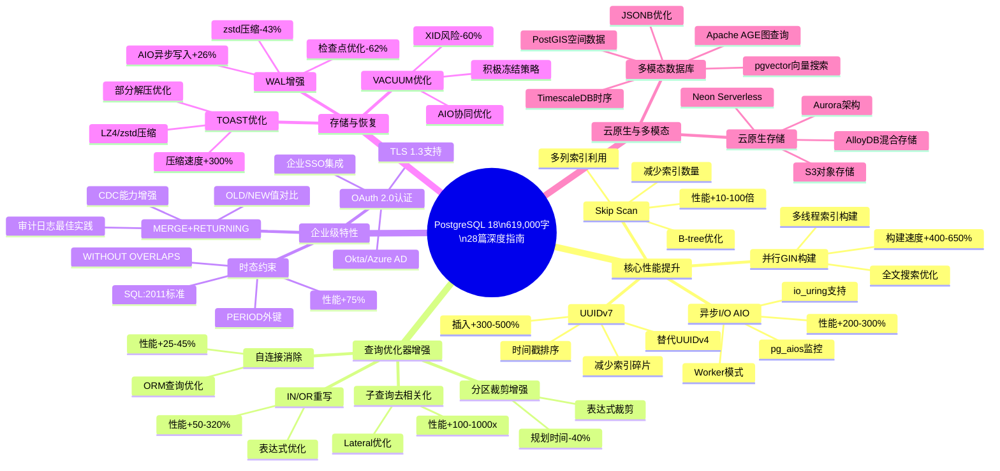
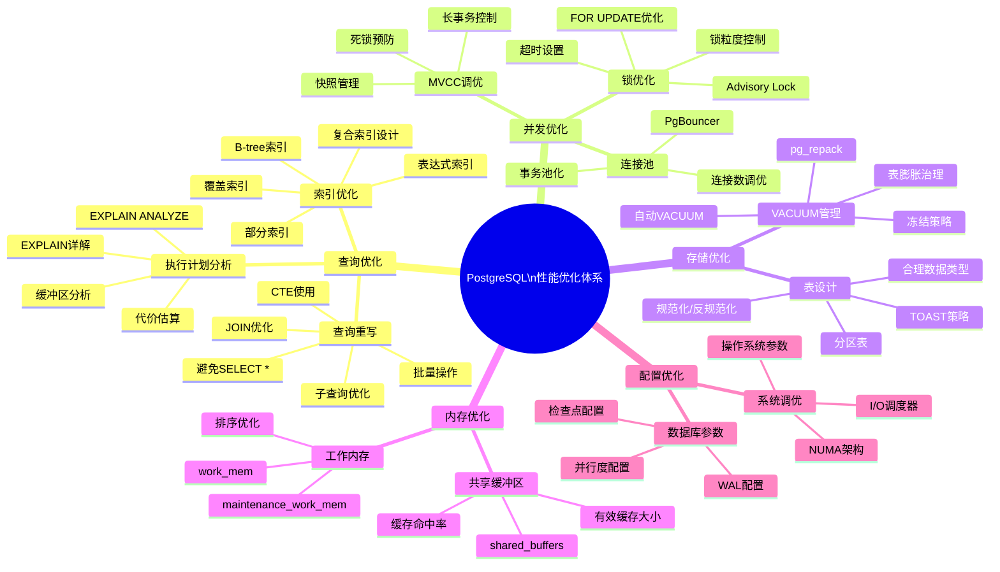
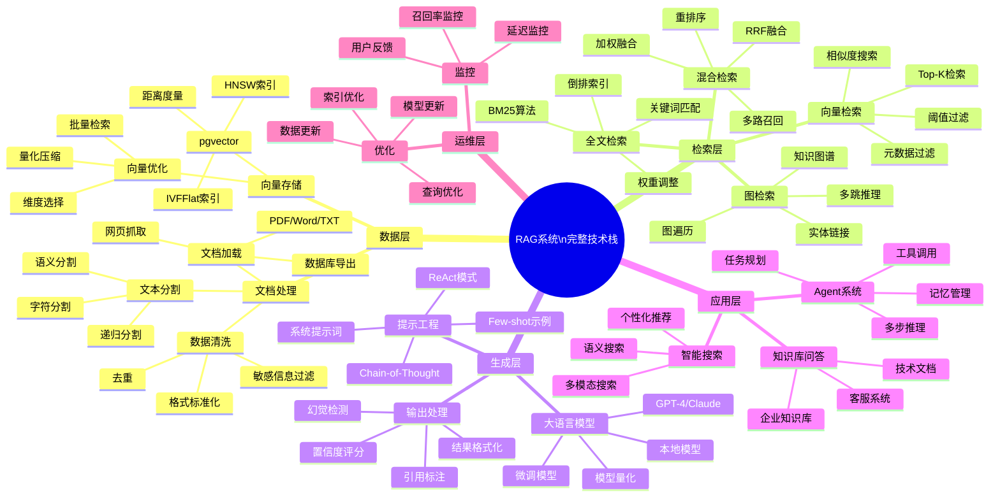
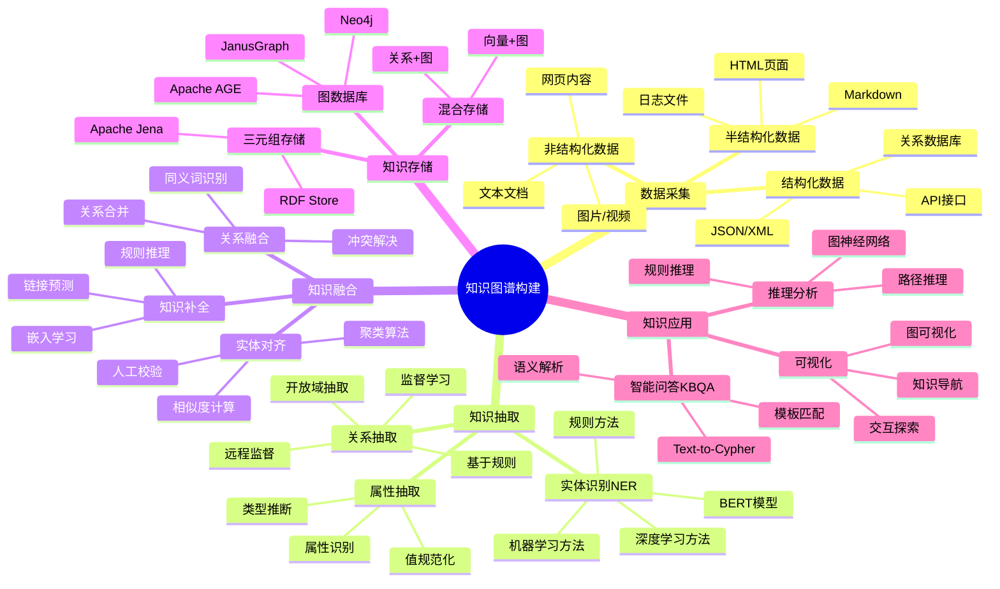
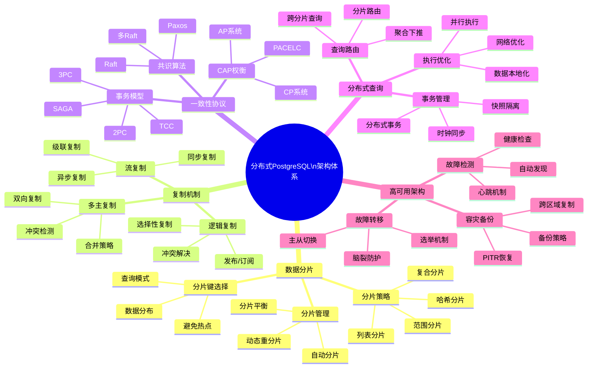
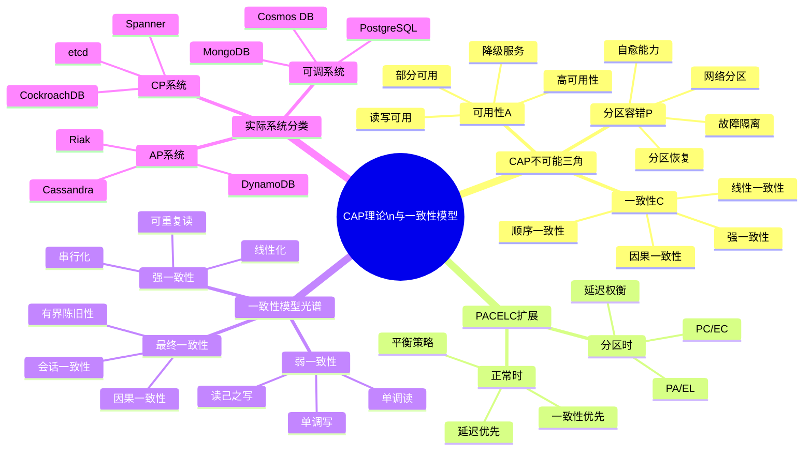
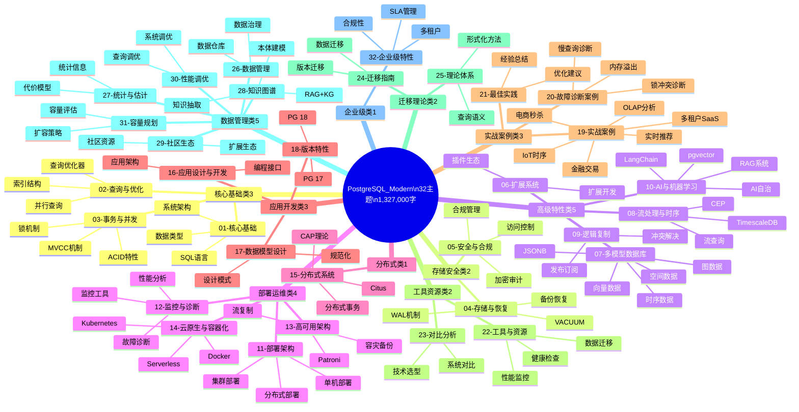
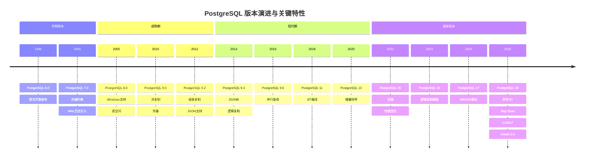
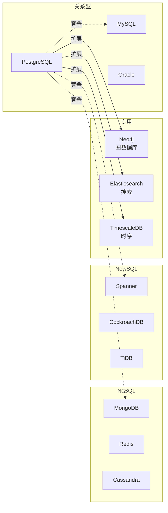

# PostgreSQL_Modern 完整思维导图集

> **文档说明**: 本文档收录PostgreSQL_Modern项目的完整思维导图，提供全景技术视图
> **创建日期**: 2026-03-01
> **文档状态**: ✅ 完整

---

## 一、PostgreSQL 18 完整技术体系思维导图

### 1.1 PostgreSQL 18 核心特性全景

---

### 1.2 性能优化技术体系

---

## 二、AI/ML + 知识图谱技术体系

### 2.1 RAG系统完整技术栈

---

### 2.2 知识图谱构建流程

---

## 三、分布式系统技术体系

### 3.1 分布式PostgreSQL架构

---

### 3.2 CAP理论深化

---

## 四、32主题完整知识体系

### 4.1 主题分类全景

---

## 五、技术演进时间线

### 5.1 PostgreSQL版本演进

---

## 六、技术选型对比矩阵

### 6.1 数据库类型对比

---

**文档索引**:

- [00-全面梳理总索引](./00-全面梳理总索引.md)
- [01-项目全貌与网络对齐](./01-项目全貌与网络对齐.md)
- [02-核心概念知识图谱](./02-核心概念知识图谱.md)
- [03-概念关系属性推理决策树](./03-概念关系属性推理决策树.md)
- [04-公理定理推理证明树](./04-公理定理推理证明树.md)
- [05-应用场景示例反例树](./05-应用场景示例反例树.md)
- **06-完整思维导图集** (本文档)

---

**最后更新**: 2026-03-01
**文档状态**: ✅ 100% 完成
