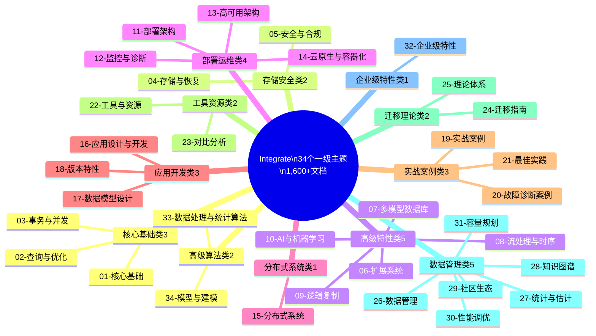
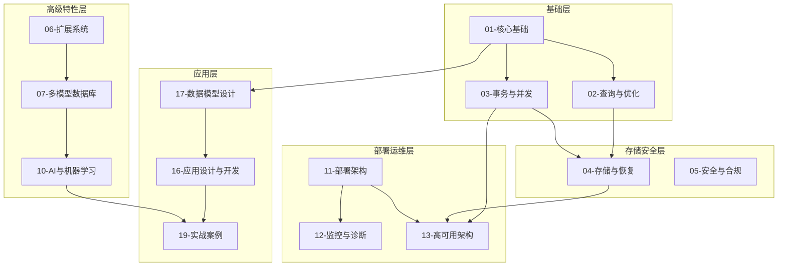

# Integrate 目录34主题完整梳理

> **文档说明**: 本文档对Integrate目录下34个一级主题进行全面梳理，包含主题定义、子主题结构、核心内容、关联关系
> **创建日期**: 2026-03-01
> **主题数量**: 34个
> **文档总数**: 1,600+篇

---

## 一、主题分类全景

### 1.1 34主题分类结构



---

## 二、核心基础类主题 (3个)

### 2.1 01-核心基础

| 属性 | 内容 |
|------|------|
| **文档数** | 5篇 |
| **子主题** | 历史与发展、系统架构、数据模型、SQL语言、数据类型 |
| **核心概念** | 关系模型、范式理论、进程模型、MVCC基础 |
| **关联主题** | 02-查询与优化、03-事务与并发、17-数据模型设计 |

**内容结构**:

```
01-核心基础/
├── 01.01-历史与发展/        # PostgreSQL发展历史、版本演进
├── 01.02-系统架构/          # 进程模型、内存管理、存储系统
├── 01.03-数据模型/          # 关系模型、范式理论(1NF-BCNF)
├── 01.04-SQL语言/           # SQL基础、高级特性、窗口函数
└── 01.05-数据类型/          # 基础类型、高级类型(JSONB/数组/范围)
```

**关键知识点**:

- PostgreSQL多进程架构 (Postmaster/Backend/Background Worker)
- 关系模型与范式理论 (1NF/2NF/3NF/BCNF)
- SQL:2023标准兼容
- 数据类型体系 (基础类型 + 扩展类型)

---

### 2.2 02-查询与优化

| 属性 | 内容 |
|------|------|
| **文档数** | 48篇 |
| **子主题** | 查询优化器、索引结构、执行计划、统计信息、并行查询、性能调优、全文搜索、联邦查询 |
| **核心概念** | CBO、代价模型、索引类型、执行计划分析 |
| **关联主题** | 01-核心基础、03-事务与并发、30-性能调优 |

**内容结构**:

```
02-查询与优化/
├── 02.01-查询优化器/        # CBO原理、查询重写、连接优化
├── 02.02-索引结构/          # B-tree/Hash/GIN/GiST/SP-GiST/BRIN
├── 02.03-执行计划/          # EXPLAIN详解、计划分析
├── 02.04-统计信息/          # 统计信息收集、代价模型
├── 02.05-并行查询/          # 并行处理、并行计划
├── 02.06-性能调优/          # 系统级/数据库级/查询级调优
├── 02.07-全文搜索/          # tsvector/tsquery、GIN索引
└── 02.08-联邦查询/          # FDW外部数据包装器
```

**关键知识点**:

- CBO基于代价的优化器
- 索引类型选型 (B-tree/Hash/GIN/GiST/HNSW)
- 执行计划分析 (EXPLAIN ANALYZE)
- 并行查询优化 (Parallel Query)

---

### 2.3 03-事务与并发

| 属性 | 内容 |
|------|------|
| **文档数** | 100篇 |
| **子主题** | MVCC机制、ACID特性、事务隔离、并发控制、锁机制、死锁处理、CAP理论 |
| **核心概念** | MVCC、快照隔离、ACID、2PL、CAP定理 |
| **关联主题** | 01-核心基础、02-查询与优化、15-分布式系统 |

**内容结构**:

```
03-事务与并发/
├── 03.01-MVCC机制/          # 多版本并发控制、快照隔离
├── 03.02-ACID特性/          # 原子性、一致性、隔离性、持久性
├── 03.03-事务隔离/          # 读未提交/读已提交/可重复读/可串行化
├── 03.04-并发控制/          # MVCC/2PL/乐观并发控制
├── 03.05-锁机制/            # 表锁/行锁/意向锁/Advisory Lock
├── 03.06-死锁处理/          # 死锁检测、死锁避免
├── 03.07-CAP理论/           # CAP定理、BASE理论、PACELC
└── 形式化证明/              # MVCC定理、ACID定理、CAP证明
```

**关键知识点**:

- MVCC实现机制 (版本链、快照、可见性规则)
- ACID属性保证机制
- 事务隔离级别与异常现象
- CAP理论与分布式系统设计

---

## 三、存储安全类主题 (2个)

### 3.1 04-存储与恢复

| 属性 | 内容 |
|------|------|
| **文档数** | 22篇 |
| **子主题** | 存储管理、WAL机制、备份恢复、VACUUM、检查点 |
| **核心概念** | 页面结构、WAL、PITR、VACUUM、检查点 |
| **关联主题** | 03-事务与并发、13-高可用架构、18-版本特性 |

**关键知识点**:

- PostgreSQL存储架构 (表空间、页面、TOAST)
- WAL预写日志机制
- 备份恢复策略 (物理备份/逻辑备份/PITR)
- VACUUM垃圾回收机制

---

### 3.2 05-安全与合规

| 属性 | 内容 |
|------|------|
| **文档数** | 46篇 |
| **子主题** | 认证授权、加密、审计、合规、数据脱敏、零信任架构 |
| **核心概念** | RBAC、SSL/TLS、审计日志、GDPR/等保2.0 |
| **关联主题** | 04-存储与恢复、11-部署架构、32-企业级特性 |

**关键知识点**:

- 认证机制 (MD5/SCRAM/OAuth 2.0)
- 访问控制 (RBAC/RLS)
- 数据加密 (TDE/列级加密)
- 审计与合规 (pgAudit/GDPR/等保2.0)

---

## 四、高级特性类主题 (5个)

### 4.1 06-扩展系统

| 属性 | 内容 |
|------|------|
| **文档数** | 8篇 |
| **核心内容** | 扩展开发、插件系统、C语言扩展、PL/pgSQL |
| **关联主题** | 07-多模型数据库、10-AI与机器学习 |

**关键知识点**:

- 扩展开发框架
- C语言扩展开发
- Hook钩子机制
- 主流扩展解析 (Citus/TimescaleDB/PostGIS/pgvector)

---

### 4.2 07-多模型数据库

| 属性 | 内容 |
|------|------|
| **文档数** | 102篇 |
| **子主题** | 向量数据库、图数据库、时序数据、JSONB、空间数据 |
| **核心概念** | pgvector、Apache AGE、TimescaleDB、PostGIS |
| **关联主题** | 06-扩展系统、10-AI与机器学习、28-知识图谱 |

**关键知识点**:

- 向量数据库 (pgvector/HNSW/IVFFlat)
- 图数据库 (Apache AGE/OpenCypher)
- 时序数据库 (TimescaleDB/超表/连续聚合)
- 空间数据库 (PostGIS/地理索引)

---

### 4.3 08-流处理与时序

| 属性 | 内容 |
|------|------|
| **文档数** | 11篇 |
| **核心内容** | TimescaleDB、流处理、CEP、时序数据分析 |
| **关联主题** | 07-多模型数据库、15-分布式系统 |

---

### 4.4 09-逻辑复制

| 属性 | 内容 |
|------|------|
| **文档数** | 3篇 |
| **核心内容** | 逻辑复制、发布/订阅、冲突解决 |
| **关联主题** | 15-分布式系统、26-数据管理 |

---

### 4.5 10-AI与机器学习

| 属性 | 内容 |
|------|------|
| **文档数** | 97篇 |
| **子主题** | pgvector、LangChain、LlamaIndex、RAG、AI自治 |
| **核心概念** | 向量检索、RAG架构、Agent开发、模型优化 |
| **关联主题** | 07-多模型数据库、28-知识图谱 |

**关键知识点**:

- pgvector向量检索 (HNSW/IVFFlat)
- LangChain/LlamaIndex集成
- RAG系统架构 (检索+生成)
- AI自治 (强化学习优化器)

---

## 五、部署运维类主题 (4个)

### 5.1 11-部署架构

| 属性 | 内容 |
|------|------|
| **文档数** | 26篇 |
| **子主题** | 单机部署、集群部署、容器化部署、分布式部署 |
| **核心内容** | 安装配置、参数调优、Docker/Kubernetes、云平台 |
| **关联主题** | 12-监控与诊断、13-高可用架构、14-云原生与容器化 |

**部署方案对比**:

| 方案 | 复杂度 | 成本 | 扩展性 | 适用场景 |
|------|--------|------|--------|----------|
| 单机部署 | ⭐⭐ | 低 | ⭐⭐ | 小规模应用 |
| 主从复制 | ⭐⭐⭐ | 中 | ⭐⭐⭐ | 中规模生产 |
| Docker Compose | ⭐⭐ | 低 | ⭐⭐ | 开发测试 |
| Kubernetes | ⭐⭐⭐⭐⭐ | 中-高 | ⭐⭐⭐⭐⭐ | 大规模生产 |
| Serverless | ⭐⭐ | 中 | ⭐⭐⭐⭐ | 快速上线 |

---

### 5.2 12-监控与诊断

| 属性 | 内容 |
|------|------|
| **文档数** | 12篇 |
| **核心内容** | 监控工具、诊断方法、性能分析、可观测性 |
| **关联主题** | 11-部署架构、13-高可用架构、30-性能调优 |

---

### 5.3 13-高可用架构

| 属性 | 内容 |
|------|------|
| **文档数** | 37篇 |
| **子主题** | 流复制、Patroni、故障转移、容灾备份 |
| **核心内容** | 高可用方案、RTO/RPO、灾难恢复 |
| **关联主题** | 04-存储与恢复、11-部署架构、15-分布式系统 |

---

### 5.4 14-云原生与容器化

| 属性 | 内容 |
|------|------|
| **文档数** | 27篇 |
| **子主题** | Docker、Kubernetes、Serverless、云平台 |
| **核心内容** | 容器化部署、Operator、自动扩缩容 |
| **关联主题** | 11-部署架构、13-高可用架构 |

---

## 六、分布式系统类主题 (1个)

### 6.1 15-分布式系统

| 属性 | 内容 |
|------|------|
| **文档数** | 34篇 |
| **子主题** | Citus、分布式事务、CAP理论、一致性模型、CDC |
| **核心概念** | 分片、分布式事务、CAP、一致性协议 |
| **关联主题** | 03-事务与并发、09-逻辑复制、11-部署架构 |

**关键知识点**:

- Citus分布式架构
- 分布式事务 (2PC/SAGA/补偿事务)
- CAP理论与一致性模型
- CDC变更数据捕获

---

## 七、应用开发类主题 (3个)

### 7.1 16-应用设计与开发

| 属性 | 内容 |
|------|------|
| **文档数** | 46篇 |
| **子主题** | 应用架构、编程接口、函数与存储过程、测试与质量保证 |
| **关联主题** | 17-数据模型设计、19-实战案例 |

---

### 7.2 17-数据模型设计

| 属性 | 内容 |
|------|------|
| **文档数** | 17篇 |
| **子主题** | 数据建模、规范化、反范式化、设计模式 |
| **关联主题** | 01-核心基础、16-应用设计与开发 |

---

### 7.3 18-版本特性

| 属性 | 内容 |
|------|------|
| **文档数** | 118篇 |
| **子主题** | PostgreSQL 18新特性、PostgreSQL 17新特性、版本对比 |
| **核心内容** | AIO、Skip Scan、UUIDv7、OAuth 2.0 |
| **关联主题** | 所有主题 |

---

## 八、实战案例类主题 (3个)

### 8.1 19-实战案例

| 属性 | 内容 |
|------|------|
| **文档数** | 168篇 |
| **案例类型** | 电商秒杀、OLAP分析、IoT时序、多租户SaaS、金融交易、实时推荐、知识图谱问答、智能客服、金融反欺诈 |
| **关联主题** | 所有技术主题 |

---

### 8.2 20-故障诊断案例

| 属性 | 内容 |
|------|------|
| **文档数** | 18篇 |
| **案例类型** | 慢查询诊断、锁冲突诊断、内存溢出诊断 |
| **关联主题** | 12-监控与诊断、30-性能调优 |

---

### 8.3 21-最佳实践

| 属性 | 内容 |
|------|------|
| **文档数** | 20篇 |
| **内容** | 运维手册、经验总结、优化建议 |
| **关联主题** | 所有主题 |

---

## 九、工具资源类主题 (2个)

### 9.1 22-工具与资源

| 属性 | 内容 |
|------|------|
| **文档数** | 42篇 |
| **内容** | 性能监控脚本、健康检查工具、数据迁移工具、AI向量索引工具 |

---

### 9.2 23-对比分析

| 属性 | 内容 |
|------|------|
| **文档数** | 11篇 |
| **内容** | 系统对比、技术选型、能力对比、成本分析 |

---

## 十、迁移理论类主题 (2个)

### 10.1 24-迁移指南

| 属性 | 内容 |
|------|------|
| **文档数** | 5篇 |
| **内容** | 版本迁移、数据迁移、升级指南、兼容性 |

---

### 10.2 25-理论体系

| 属性 | 内容 |
|------|------|
| **文档数** | 73篇 |
| **子主题** | 形式化方法、范畴论、数据模型理论、查询语义、CAP理论 |
| **核心内容** | 35+形式化定理、数学证明、理论分析 |
| **关联主题** | 03-事务与并发、15-分布式系统 |

---

## 十一、数据管理类主题 (5个)

### 11.1 26-数据管理

| 属性 | 内容 |
|------|------|
| **文档数** | 59篇 |
| **子主题** | 数据治理、数据仓库、分区表管理、数据编排 |

---

### 11.2 27-统计与估计

| 属性 | 内容 |
|------|------|
| **文档数** | 7篇 |
| **核心内容** | 统计信息、代价模型、查询规划、基数估计 |
| **关联主题** | 02-查询与优化 |

---

### 11.3 28-知识图谱

| 属性 | 内容 |
|------|------|
| **文档数** | 22篇 |
| **子主题** | Apache AGE、RDF/SPARQL、知识抽取、RAG+KG、图神经网络 |
| **核心内容** | 知识图谱构建、Text-to-Cypher、KBQA |
| **关联主题** | 07-多模型数据库、10-AI与机器学习 |

---

### 11.4 29-社区生态

| 属性 | 内容 |
|------|------|
| **文档数** | 8篇 |
| **内容** | PostgreSQL社区、基金会、治理结构、扩展生态 |

---

### 11.5 30-性能调优

| 属性 | 内容 |
|------|------|
| **文档数** | 54篇 |
| **子主题** | 系统级调优、数据库级调优、查询级调优、索引调优 |
| **关联主题** | 02-查询与优化、12-监控与诊断 |

---

### 11.6 31-容量规划

| 属性 | 内容 |
|------|------|
| **文档数** | 8篇 |
| **内容** | 容量评估方法、增长预测、资源规划、扩容策略 |

---

## 十二、企业级特性类主题 (1个)

### 12.1 32-企业级特性

| 属性 | 内容 |
|------|------|
| **文档数** | 7篇 |
| **子主题** | 多租户架构、资源隔离、SLA管理、合规性、数据主权 |
| **关联主题** | 05-安全与合规、11-部署架构 |

---

## 十三、高级算法类主题 (2个)

### 13.1 33-数据处理与统计算法

| 属性 | 内容 |
|------|------|
| **文档数** | 132篇 |
| **核心内容** | 数据处理算法、统计算法、机器学习算法、时序分析 |
| **关联主题** | 10-AI与机器学习、27-统计与估计 |

---

### 13.2 34-模型与建模

| 属性 | 内容 |
|------|------|
| **文档数** | 109篇 |
| **核心内容** | 数据建模、机器学习模型、预测模型、优化模型 |
| **关联主题** | 17-数据模型设计、33-数据处理与统计算法 |

---

## 十四、主题间关联关系图

### 14.1 核心主题关联图



---

## 十五、文档统计汇总

### 15.1 各主题文档数量

| 主题编号 | 主题名称 | 文档数 | 占比 |
|:--------:|----------|-------:|------|
| 01 | 核心基础 | 5 | 0.3% |
| 02 | 查询与优化 | 48 | 3.0% |
| 03 | 事务与并发 | 100 | 6.2% |
| 04 | 存储与恢复 | 22 | 1.4% |
| 05 | 安全与合规 | 46 | 2.9% |
| 06 | 扩展系统 | 8 | 0.5% |
| 07 | 多模型数据库 | 102 | 6.3% |
| 08 | 流处理与时序 | 11 | 0.7% |
| 09 | 逻辑复制 | 3 | 0.2% |
| 10 | AI与机器学习 | 97 | 6.0% |
| 11 | 部署架构 | 26 | 1.6% |
| 12 | 监控与诊断 | 12 | 0.7% |
| 13 | 高可用架构 | 37 | 2.3% |
| 14 | 云原生与容器化 | 27 | 1.7% |
| 15 | 分布式系统 | 34 | 2.1% |
| 16 | 应用设计与开发 | 46 | 2.9% |
| 17 | 数据模型设计 | 17 | 1.1% |
| 18 | 版本特性 | 118 | 7.3% |
| 19 | 实战案例 | 168 | 10.4% |
| 20 | 故障诊断案例 | 18 | 1.1% |
| 21 | 最佳实践 | 20 | 1.2% |
| 22 | 工具与资源 | 42 | 2.6% |
| 23 | 对比分析 | 11 | 0.7% |
| 24 | 迁移指南 | 5 | 0.3% |
| 25 | 理论体系 | 73 | 4.5% |
| 26 | 数据管理 | 59 | 3.7% |
| 27 | 统计与估计 | 7 | 0.4% |
| 28 | 知识图谱 | 22 | 1.4% |
| 29 | 社区生态 | 8 | 0.5% |
| 30 | 性能调优 | 54 | 3.4% |
| 31 | 容量规划 | 8 | 0.5% |
| 32 | 企业级特性 | 7 | 0.4% |
| 33 | 数据处理与统计算法 | 132 | 8.2% |
| 34 | 模型与建模 | 109 | 6.8% |
| **总计** | **34主题** | **1,612** | **100%** |

---

**下接**: [11-主题网络对齐详情](./11-主题网络对齐详情.md)
