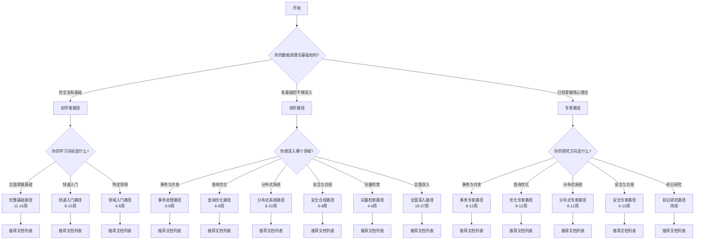

# 学习路径决策树

> **创建日期**: 2025-01-16
> **目标**: 根据学习者的背景和目标，推荐最适合的学习路径
> **状态**: ✅ 完成

---

## 🌳 学习路径决策树

---

## 📋 路径详细说明

### 初学者路径

#### 路径1：完整基础路径（11-16周）

**适合对象**: 完全没有数据库理论基础的学习者

**学习顺序**:

1. 08.02-关系代数与关系演算（1周）
2. 09.01-关系约束与规范化（1周）
3. 01.01-形式化验证方法（2周）
4. 03.01-MVCC高级分析与形式证明（2周）
5. 05.01-代价模型与优化器（2周）
6. 06.01-TLA+-事务与WAL（2周）
7. 选择一个扩展领域（2-4周）

**详细路径**: 参见[初学者学习路径](./初学者学习路径-2025-01-16.md)

---

#### 路径2：快速入门路径（8-10周）

**适合对象**: 有编程基础，想快速了解数据库理论

**学习顺序**:

1. 08.02-关系代数与关系演算（快速浏览，3天）
2. 09.01-关系约束与规范化（快速浏览，3天）
3. 03.01-MVCC高级分析与形式证明（1周）
4. 05.01-代价模型与优化器（1周）
5. 06.01-TLA+-事务与WAL（1周）
6. 选择一个扩展领域（1-2周）

---

#### 路径3：领域入门路径（6-8周）

**适合对象**: 对特定领域感兴趣的学习者

**选项A：事务处理入门**

1. 08.02-关系代数与关系演算（1周）
2. 03.01-MVCC高级分析与形式证明（2周）
3. 03.03-事务隔离与MVCC（1周）
4. 06.01-TLA+-事务与WAL（2周）

**选项B：查询优化入门**

1. 08.02-关系代数与关系演算（1周）
2. 09.01-关系约束与规范化（1周）
3. 05.01-代价模型与优化器（2周）
4. 05.02-索引结构正确性（2周）

---

### 进阶路径

#### 路径4：事务处理路径（6-8周）

**适合对象**: 已掌握基础，想深入理解事务处理

**学习顺序**:

1. 03.01-MVCC高级分析与形式证明（1周）
2. 03.02-MVCC与其他并发控制模型对比（1周）
3. 03.03-事务隔离与MVCC（1周）
4. 03.06-快照隔离异常谱系（1周）
5. 06.01-TLA+-事务与WAL（1周）
6. 06.03-ARIES日志恢复（1周）
7. 04.02-分布式一致性与CAP（1周）
8. 04.03-两阶段提交（1周）

---

#### 路径5：查询优化路径（6-8周）

**适合对象**: 已掌握基础，想深入理解查询优化

**学习顺序**:

1. 08.02-关系代数与关系演算（快速复习，3天）
2. 05.01-代价模型与优化器（1周）
3. 05.02-索引结构正确性（1周）
4. 05.10-查询重写等价性（1周）
5. 05.04-增量物化视图（1周）
6. 05.07-物化视图选择（1周）
7. 05.13-查询优化器自适应（1周）
8. 05.15-数据库性能调优（1周）

---

#### 路径6：分布式系统路径（8-10周）

**适合对象**: 已掌握基础，想深入理解分布式系统

**学习顺序**:

1. 03.01-MVCC高级分析与形式证明（快速复习，3天）
2. 04.02-分布式一致性与CAP（2周）
3. 04.03-两阶段提交（1周）
4. 04.04-SAGA与补偿事务（1周）
5. 04.05-CRDT与最终一致（1周）
6. 04.06-数据库区块链模型（1周）
7. 06.08-数据库容错与高可用（1周）

---

#### 路径7：安全合规路径（6-8周）

**适合对象**: 已掌握基础，想深入理解安全与合规

**学习顺序**:

1. 01.01-形式化验证方法（快速复习，3天）
2. 07.04-数据库安全模型（2周）
3. 07.03-行级安全-RLS（1周）
4. 07.01-安全策略与非干扰（1周）
5. 07.02-差分隐私（1周）
6. 07.05-数据库审计与合规（1周）

---

#### 路径8：向量检索路径（4-6周）

**适合对象**: 已掌握基础，想深入理解向量检索

**学习顺序**:

1. 05.01-代价模型与优化器（快速复习，3天）
2. 05.02-索引结构正确性（快速复习，3天）
3. 11.01-向量检索与Top-k（2周）
4. 相关向量索引文档（1-2周）

---

#### 路径9：全面深入路径（19-27周）

**适合对象**: 已掌握基础，想全面深入学习

**详细路径**: 参见[进阶学习路径](./进阶学习路径-2025-01-16.md)

---

### 专家路径

#### 路径10：事务专家路径（8-12周）

**适合对象**: 已掌握核心理论，想成为事务处理专家

**学习顺序**:

- 03-事务与并发控制模块的所有文档
- 相关分布式事务文档
- 最新研究论文

**详细路径**: 参见[专家学习路径](./专家学习路径-2025-01-16.md)

---

#### 路径11：优化专家路径（8-12周）

**适合对象**: 已掌握核心理论，想成为查询优化专家

**学习顺序**:

- 05-索引与查询优化模块的所有文档
- 相关查询语义文档
- 最新研究论文

**详细路径**: 参见[专家学习路径](./专家学习路径-2025-01-16.md)

---

#### 路径12：分布式专家路径（8-12周）

**适合对象**: 已掌握核心理论，想成为分布式系统专家

**学习顺序**:

- 04-分布式系统理论模块的所有文档
- 相关事务处理文档
- 最新研究论文

**详细路径**: 参见[专家学习路径](./专家学习路径-2025-01-16.md)

---

#### 路径13：安全专家路径（6-10周）

**适合对象**: 已掌握核心理论，想成为安全与合规专家

**学习顺序**:

- 07-安全与合规模块的所有文档
- 相关形式化方法文档
- 最新研究论文

**详细路径**: 参见[专家学习路径](./专家学习路径-2025-01-16.md)

---

#### 路径14：前沿研究路径（持续）

**适合对象**: 已掌握所有理论，想跟踪前沿研究

**学习内容**:

- 定期阅读SIGMOD、VLDB、ICDE论文
- 关注2024-2025最新研究
- 参与学术讨论
- 进行学术研究

---

## 🎯 路径选择建议

### 根据学习目标选择

| 学习目标 | 推荐路径 | 预计时间 |
|---------|---------|---------|
| **全面掌握基础** | 路径1：完整基础路径 | 11-16周 |
| **快速入门** | 路径2：快速入门路径 | 8-10周 |
| **深入特定领域** | 路径4-8：领域深入路径 | 4-10周 |
| **全面深入学习** | 路径9：全面深入路径 | 19-27周 |
| **成为领域专家** | 路径10-13：专家路径 | 6-12周 |
| **跟踪前沿研究** | 路径14：前沿研究路径 | 持续 |

---

### 根据背景选择

| 背景 | 推荐路径 | 说明 |
|------|---------|------|
| **完全没有基础** | 路径1：完整基础路径 | 系统学习基础理论 |
| **有编程基础** | 路径2：快速入门路径 | 快速了解核心概念 |
| **有数据库经验** | 路径4-8：领域深入路径 | 深入特定领域 |
| **有理论基础** | 路径9：全面深入路径 | 全面深入学习 |
| **研究者/专家** | 路径10-14：专家路径 | 深入研究或跟踪前沿 |

---

## 📊 路径对比

### 时间对比

| 路径类型 | 最短时间 | 最长时间 | 平均时间 |
|---------|---------|---------|---------|
| **初学者路径** | 8周 | 16周 | 12周 |
| **进阶路径** | 4周 | 27周 | 15周 |
| **专家路径** | 6周 | 持续 | 10周+ |

---

### 难度对比

| 路径类型 | 难度 | 前置要求 |
|---------|------|---------|
| **初学者路径** | ⭐⭐ 中等 | 无 |
| **进阶路径** | ⭐⭐⭐ 较高 | 基础理论 |
| **专家路径** | ⭐⭐⭐⭐ 很高 | 核心理论 |

---

## ✅ 使用建议

1. **先评估自己的基础**
   - 完成基础测试
   - 评估知识水平
   - 确定学习目标

2. **选择合适的路径**
   - 根据决策树选择
   - 考虑时间和精力
   - 考虑学习目标

3. **按路径学习**
   - 严格按照顺序学习
   - 完成每个检查点
   - 不要跳过内容

4. **调整路径**
   - 根据学习情况调整
   - 可以切换路径
   - 可以扩展学习

---

**最后更新**: 2025-01-16
**维护者**: Documentation Team
**状态**: ✅ 完成
