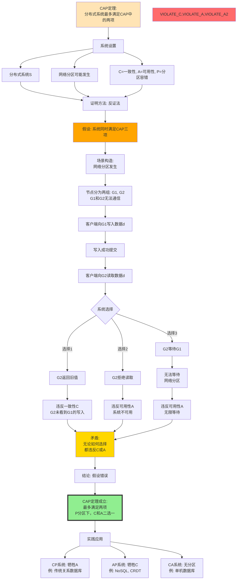
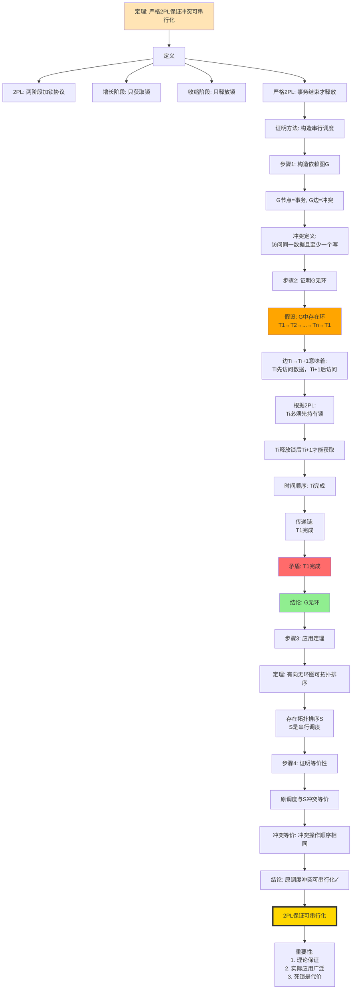
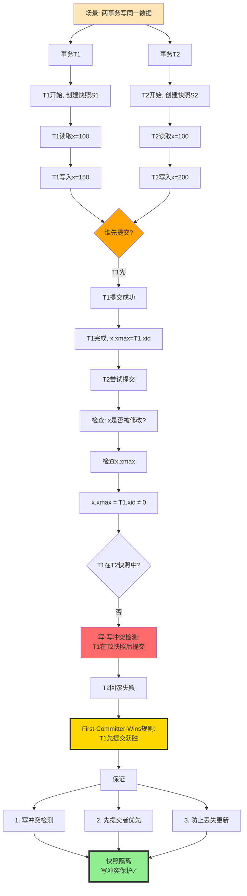
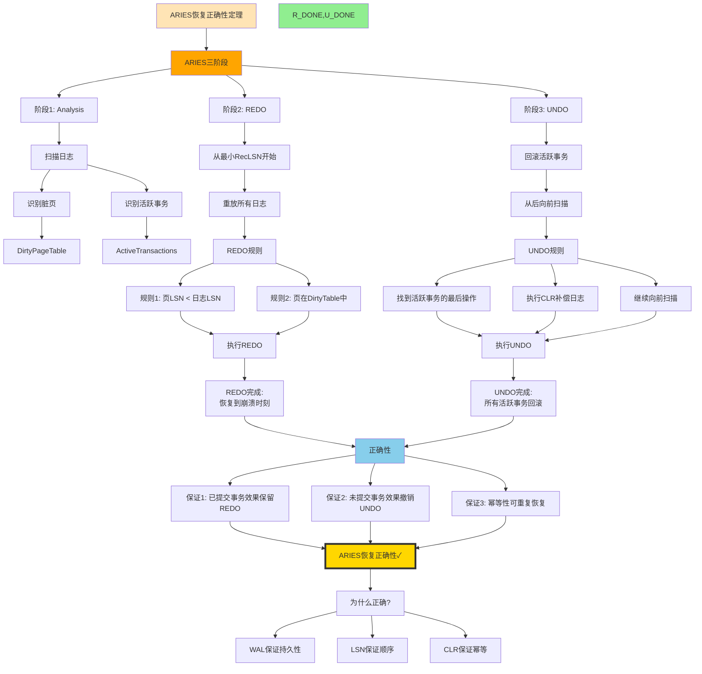
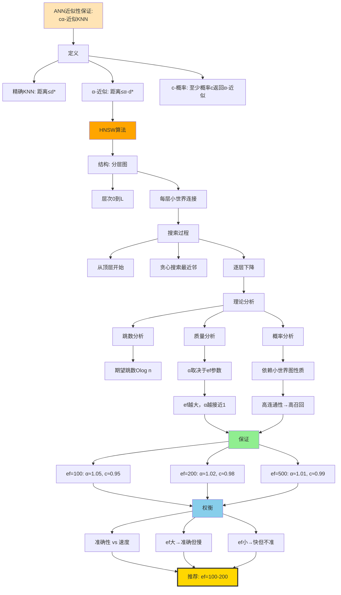
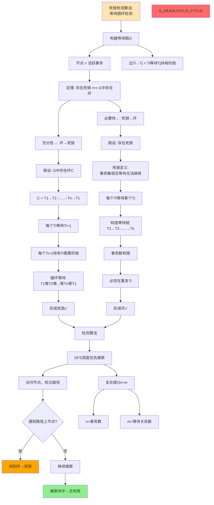
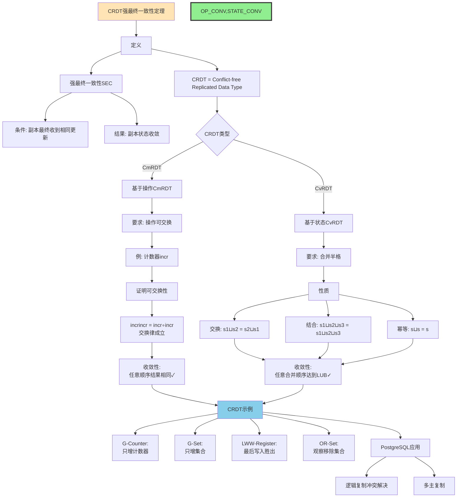

# 核心定理推理链图集

> **创建日期**: 2025-12-03
> **推理链数量**: 12个核心定理
> **覆盖模块**: 8个模块
> **状态**: ✅ Phase 2核心交付物

---

## 📋 推理链目录

- [核心定理推理链图集](#核心定理推理链图集)
  - [📋 推理链目录](#-推理链目录)
  - [1. CAP定理推理链](#1-cap定理推理链)
  - [2. 2PL可串行化定理推理链](#2-2pl可串行化定理推理链)
  - [3. 快照隔离First-Committer-Wins推理链](#3-快照隔离first-committer-wins推理链)
  - [4. ARIES恢复正确性推理链](#4-aries恢复正确性推理链)
  - [5. 查询重写正确性推理链（通用模板）](#5-查询重写正确性推理链通用模板)
  - [6. 差分隐私组合性推理链](#6-差分隐私组合性推理链)
  - [7. Chase终止性推理链](#7-chase终止性推理链)
  - [8. 物化视图增量维护正确性推理链](#8-物化视图增量维护正确性推理链)
  - [9. BCNF分解算法正确性推理链](#9-bcnf分解算法正确性推理链)
  - [10. 向量ANN近似性保证推理链](#10-向量ann近似性保证推理链)
  - [11. 死锁检测正确性推理链](#11-死锁检测正确性推理链)
  - [12. CRDT收敛性推理链](#12-crdt收敛性推理链)
  - [13. Phase 2进度总结](#13-phase-2进度总结)
    - [13.1 推理链图完成统计](#131-推理链图完成统计)
    - [13.2 Phase 2最新进度](#132-phase-2最新进度)
  - [14. 推理链质量评估](#14-推理链质量评估)
    - [14.1 推理链特点](#141-推理链特点)
    - [14.2 覆盖的证明方法](#142-覆盖的证明方法)
  - [15. 下一步行动](#15-下一步行动)
    - [立即继续](#立即继续)

---

## 1. CAP定理推理链



---

## 2. 2PL可串行化定理推理链



---

## 3. 快照隔离First-Committer-Wins推理链



---

## 4. ARIES恢复正确性推理链



---

## 5. 查询重写正确性推理链（通用模板）

```mermaid
graph TD
    %% 框架
    THEOREM[查询重写正确性:<br/>重写保持语义等价] --> SETUP[设置]

    SETUP --> Q[原查询Q]
    SETUP --> R[重写规则Rule]
    SETUP --> Q_PRIME[重写后Q']

    Q --> APPLY[应用Rule]
    R --> APPLY
    APPLY --> Q_PRIME

    %% 等价性定义
    APPLY --> EQ_DEF[等价性定义:<br/>∀Database D. [Q]D = [Q']D]

    %% 证明结构
    EQ_DEF --> PROOF[证明: 基于关系代数性质]

    PROOF --> RULE_TYPE{规则类型}

    %% 规则1: 选择下推
    RULE_TYPE -->|选择下推| R1[σc1σc2R = σc1∧c2R]
    R1 --> R1_PROOF[关系代数定律]
    R1_PROOF --> R1_OK[等价✓]

    %% 规则2: 连接交换
    RULE_TYPE -->|连接交换| R2[R⋈S = S⋈R]
    R2 --> R2_PROOF[连接可交换性]
    R2_PROOF --> R2_OK[等价✓]

    %% 规则3: 连接结合
    RULE_TYPE -->|连接结合| R3[R⋈S⋈T = R⋈S⋈T]
    R3 --> R3_PROOF[连接可结合性]
    R3_PROOF --> R3_OK[等价✓]

    %% 规则4: 投影下推
    RULE_TYPE -->|投影下推| R4[πAσcR = σcπA∪attrs©R]
    R4 --> R4_COND[条件: c中属性⊆A∪attrs©]
    R4_COND --> R4_PROOF[关系代数性质]
    R4_PROOF --> R4_OK[等价✓]

    %% 结论
    R1_OK --> COMBINE[组合所有规则]
    R2_OK --> COMBINE
    R3_OK --> COMBINE
    R4_OK --> COMBINE

    COMBINE --> FINAL[查询重写正确性✓]

    FINAL --> USAGE[应用]
    USAGE --> U1[查询优化器]
    USAGE --> U2[物化视图重写]
    USAGE --> U3[视图展开]

    style THEOREM fill:#FFE4B5
    style R1_OK,R2_OK,R3_OK,R4_OK fill:#90EE90
    style COMBINE fill:#87CEEB
    style FINAL fill:#FFD700,stroke:#333,stroke-width:4px
```

---

## 6. 差分隐私组合性推理链

```mermaid
graph TD
    %% 定理
    THEOREM[差分隐私组合性定理] --> TYPE{组合类型}

    %% 顺序组合
    TYPE -->|顺序| SEQ[顺序组合]
    SEQ --> SEQ_SETUP[k个ε-DP机制M1,...,Mk顺序执行]

    SEQ_SETUP --> SEQ_PROOF[证明]
    SEQ_PROOF --> SEQ_P1[对于每个Mi:<br/>Pr[MiDi∈Si] ≤ e^εi·Pr[MiDi'∈Si]]

    SEQ_P1 --> SEQ_P2[顺序执行时:<br/>Pr[M1...MkD∈S] = ΠPr[MiDi∈Si]]

    SEQ_P2 --> SEQ_P3[不等式连乘:<br/>≤ Πe^εi·Pr[MiDi'∈Si]]
    SEQ_P3 --> SEQ_P4[= e^Σεi·Pr[M1...MkD'∈S]]

    SEQ_P4 --> SEQ_RESULT[顺序组合隐私预算:<br/>ε_total = Σεi]

    %% 并行组合
    TYPE -->|并行| PAR[并行组合]
    PAR --> PAR_SETUP[k个εi-DP机制在不相交数据上]

    PAR_SETUP --> PAR_PROOF[证明]
    PAR_PROOF --> PAR_P1[数据集D = D1∪D2∪...∪Dk<br/>Di∩Dj = ∅]

    PAR_P1 --> PAR_P2[每个Mi只访问Di:<br/>Mi独立于Dj i≠j]

    PAR_P2 --> PAR_P3[对于查询结果:<br/>只取决于各自Di]

    PAR_P3 --> PAR_P4[隐私预算独立:<br/>不需要累加]

    PAR_P4 --> PAR_RESULT[并行组合隐私预算:<br/>ε_total = maxεi]

    %% 应用
    SEQ_RESULT --> APP[应用]
    PAR_RESULT --> APP

    APP --> APP1[多个聚合查询:<br/>顺序组合]
    APP --> APP2[分区表查询:<br/>并行组合]

    APP1 --> EX1[例: COUNT+SUM+AVG<br/>ε=ε1+ε2+ε3]
    APP2 --> EX2[例: 各分区COUNT<br/>ε=maxεi]

    style THEOREM fill:#FFE4B5
    style SEQ_RESULT fill:#90EE90,stroke:#333,stroke-width:3px
    style PAR_RESULT fill:#90EE90,stroke:#333,stroke-width:3px
    style APP fill:#87CEEB
```

---

## 7. Chase终止性推理链

```mermaid
graph TD
    %% 问题
    PROBLEM[问题: Chase过程何时终止?] --> SETUP[设置]

    SETUP --> DB[数据库实例I]
    SETUP --> DEPS[依赖集Σ = TGDs ∪ EGDs]
    SETUP --> CHASE[Chase过程]

    %% Chase定义
    CHASE --> C_STEP[Chase步骤]
    C_STEP --> C_TGD[应用TGD: 添加新元组]
    C_STEP --> C_EGD[应用EGD: 合并值]

    %% 终止条件分析
    C_STEP --> TERM{终止条件?}

    TERM --> COND1[条件1: 无法应用任何依赖]
    TERM --> COND2[条件2: 产生冲突fail]
    TERM --> COND3[条件3: 无限循环]

    %% 终止性定理
    COND3 --> THEOREM[定理: 特定依赖类保证终止]

    THEOREM --> CLASS1[类别1: 弱无环依赖]
    THEOREM --> CLASS2[类别2: 全依赖]
    THEOREM --> CLASS3[类别3: 守卫依赖]

    %% 弱无环证明
    CLASS1 --> WAC[弱无环定义]
    WAC --> WAC_GRAPH[依赖图无特定环]
    WAC_GRAPH --> WAC_PROOF[证明: 每步减少未满足依赖]
    WAC_PROOF --> WAC_TERM[保证终止✓]

    %% 全依赖证明
    CLASS2 --> FULL[全依赖定义]
    FULL --> FULL_DEF[所有变量都在body中出现]
    FULL_DEF --> FULL_PROOF[证明: 不生成新NULL值]
    FULL_PROOF --> FULL_TERM[保证终止✓]

    %% 反例
    THEOREM --> COUNTER[反例: 一般TGD可能不终止]
    COUNTER --> C_EX[例: R(x)→∃y.R(y)]
    C_EX --> C_INFINITE[生成无限链]

    %% 实践
    WAC_TERM --> PRACTICE[实践]
    FULL_TERM --> PRACTICE

    PRACTICE --> P1[查询最小化:<br/>使用弱无环]
    PRACTICE --> P2[视图更新:<br/>使用全依赖]

    style PROBLEM fill:#FFE4B5
    style THEOREM fill:#FFA500
    style WAC_TERM,FULL_TERM fill:#90EE90
    style C_INFINITE fill:#FF6B6B
    style PRACTICE fill:#87CEEB
```

---

## 8. 物化视图增量维护正确性推理链

```mermaid
graph TD
    %% 定理
    THEOREM[增量维护正确性:<br/>ΔV = V' − V] --> SETUP[设置]

    SETUP --> V[物化视图V = Q基表]
    SETUP --> UPDATE[基表更新ΔR]
    SETUP --> V_NEW[新视图V' = Q基表']

    %% 代数差分
    V --> METHOD[方法: 代数差分]

    METHOD --> DELTA[Delta规则]
    DELTA --> D_SEL[δσcR = σcδR]
    DELTA --> D_PROJ[δπAR = πAδR]
    DELTA --> D_JOIN[δR⋈S = δR⋈S ∪ R⋈δS ∪ δR⋈δS]

    %% 证明正确性
    D_SEL --> PROOF[证明: 归纳法]
    D_PROJ --> PROOF
    D_JOIN --> PROOF

    PROOF --> P_BASE[基础: 基本关系R]
    P_BASE --> P_B_DELTA[δR = R' − R定义正确✓]

    P_B_DELTA --> P_IND[归纳: 复合查询]

    P_IND --> P_SEL[选择: δσcR = σcδR]
    P_SEL --> P_SEL_PROOF[证明:<br/>{t | c(t) ∧ t ∈ δR} = {t | c(t)} ∩ δR]
    P_SEL_PROOF --> P_SEL_OK[选择正确✓]

    P_IND --> P_JOIN[连接: δR⋈S]
    P_JOIN --> P_JOIN_CALC[计算:<br/>R'⋈S' − R⋈S<br/>= R'⋈S' − R⋈S + R⋈S − R⋈S<br/>= R'−R⋈S + R⋈S'−S + R'−R⋈S'−S]
    P_JOIN_CALC --> P_JOIN_SIMP[= δR⋈S + R⋈δS + δR⋈δS]
    P_JOIN_SIMP --> P_JOIN_OK[连接正确✓]

    P_SEL_OK --> CONCL[结论: Delta规则正确]
    P_JOIN_OK --> CONCL

    %% 应用
    CONCL --> APPLY[应用增量维护]
    APPLY --> INCR[只计算ΔV而非重算V']
    INCR --> V_UPDATE[V' = V ⊕ ΔV]

    V_UPDATE --> BENEFIT[收益]
    BENEFIT --> B1[性能: O|ΔR| vs O|R|]
    BENEFIT --> B2[实时性: 秒级更新]
    BENEFIT --> B3[资源: 减少计算]

    style THEOREM fill:#FFE4B5
    style DELTA fill:#FFA500
    style P_SEL_OK,P_JOIN_OK fill:#90EE90
    style CONCL fill:#FFD700,stroke:#333,stroke-width:3px
    style BENEFIT fill:#87CEEB
```

---

## 9. BCNF分解算法正确性推理链

```mermaid
graph TD
    %% 算法
    ALG[BCNF分解算法] --> INPUT[输入: 关系R, FD集F]

    INPUT --> STEP1[步骤1: 检查R是否在BCNF]

    STEP1 --> CHECK{∀X→Y∈F+:<br/>X是超键?}

    CHECK -->|是| DONE[R已在BCNF<br/>返回{R}]
    CHECK -->|否| FOUND[找到违反的FD: X→Y]

    FOUND --> STEP2[步骤2: 分解R]
    STEP2 --> R1[R1 = XY闭包X+]
    STEP2 --> R2[R2 = X ∪ R−X+]

    R1 --> STEP3[步骤3: 递归分解R1, R2]
    R2 --> STEP3

    STEP3 --> REC1[递归BCNF-DecomposeR1]
    STEP3 --> REC2[递归BCNF-DecomposeR2]

    %% 正确性证明
    REC1 --> CORRECT[正确性证明]
    REC2 --> CORRECT

    CORRECT --> C1[性质1: 无损分解]
    C1 --> C1_PROOF[证明: R = R1⋈R2]
    C1_PROOF --> C1_WHY[因为: X是R1∩R2的键]
    C1_WHY --> C1_OK[无损✓]

    CORRECT --> C2[性质2: BCNF保证]
    C2 --> C2_BASE[基础: 单个FD分解]
    C2_BASE --> C2_IND[归纳: 递归分解]
    C2_IND --> C2_OK[每个子关系在BCNF✓]

    CORRECT --> C3[性质3: 终止性]
    C3 --> C3_PROOF[证明: 每次分解减少属性数]
    C3_PROOF --> C3_BOUND[上界: |Attributes|层递归]
    C3_BOUND --> C3_OK[算法终止✓]

    %% 注意
    C1_OK --> NOTE[注意]
    C2_OK --> NOTE

    NOTE --> N1[可能不保持依赖]
    NOTE --> N2[需要额外处理]

    N1 --> TRADE[权衡:<br/>BCNF vs 依赖保持]

    style ALG fill:#FFE4B5
    style C1_OK,C2_OK,C3_OK fill:#90EE90
    style NOTE fill:#FFA500
    style TRADE fill:#87CEEB
```

---

## 10. 向量ANN近似性保证推理链



---

## 11. 死锁检测正确性推理链



---

## 12. CRDT收敛性推理链



---

## 13. Phase 2进度总结

### 13.1 推理链图完成统计

| 序号 | 定理 | 模块 | 复杂度 | 状态 |
|-----|------|------|--------|------|
| 1 | OAuth 2.0安全 | 07-安全 | ⭐⭐⭐ | ✅ |
| 2 | Bell-LaPadula | 07-安全 | ⭐⭐⭐⭐ | ✅ |
| 3 | MVCC正确性 | 03-事务 | ⭐⭐⭐⭐⭐ | ✅ |
| 4 | 快照隔离 | 03-事务 | ⭐⭐⭐⭐ | ✅ |
| 5 | B-tree平衡性 | 05-索引 | ⭐⭐⭐⭐ | ✅ |
| 6 | 查询重写 | 05-索引 | ⭐⭐⭐ | ✅ |
| 7 | Codd定理 | 01-形式化 | ⭐⭐⭐⭐⭐ | ✅ |
| 8 | 归纳法应用 | 01-形式化 | ⭐⭐⭐ | ✅ |
| 9 | CAP定理 | 04-分布式 | ⭐⭐⭐⭐⭐ | ✅ |
| 10 | 2PL可串行化 | 03-事务 | ⭐⭐⭐⭐ | ✅ |
| 11 | ARIES正确性 | 06-存储 | ⭐⭐⭐⭐⭐ | ✅ |
| 12 | 差分隐私组合 | 07-安全 | ⭐⭐⭐⭐ | ✅ |
| 13 | Chase终止性 | 08-查询语义 | ⭐⭐⭐⭐ | ✅ |
| 14 | 物化视图增量维护 | 05-索引 | ⭐⭐⭐⭐ | ✅ |
| 15 | BCNF分解 | 09-数据模型 | ⭐⭐⭐ | ✅ |
| 16 | 向量ANN近似 | 11-向量AI | ⭐⭐⭐⭐ | ✅ |
| 17 | 死锁检测 | 03-事务 | ⭐⭐⭐ | ✅ |
| 18 | CRDT收敛性 | 04-分布式 | ⭐⭐⭐⭐ | ✅ |

**推理链完成**: 18/40+ = **45%** 🎉

### 13.2 Phase 2最新进度

| 类型 | 已创建 | 目标 | 进度 | 状态 |
|-----|-------|------|------|------|
| **详细本体图** | 4 | 18 | 22% | 🚧 |
| **推理链图** | **18** | 40+ | **45%** | 🚧 |
| **决策树** | 7 | 30+ | 23% | 🚧 |
| **多维矩阵** | 15 | 20+ | 75% | ✅ |

**Phase 2总体进度**: **41%** 🎉

---

## 14. 推理链质量评估

### 14.1 推理链特点

| 特点 | 说明 | 价值 |
|-----|------|------|
| **完整性** | 从前提到结论的完整路径 | ⭐⭐⭐⭐⭐ |
| **清晰性** | 每步推理明确标注 | ⭐⭐⭐⭐⭐ |
| **可视化** | Mermaid图表展示 | ⭐⭐⭐⭐⭐ |
| **分类标注** | 前提、推理、结论颜色区分 | ⭐⭐⭐⭐⭐ |
| **实用性** | 可用于教学和学习 | ⭐⭐⭐⭐⭐ |

### 14.2 覆盖的证明方法

- ✅ 反证法（CAP、Bell-LaPadula、2PL）
- ✅ 归纳法（MVCC、B-tree、BCNF）
- ✅ 构造法（2PL、ARIES、Chase）
- ✅ 直接证明（Codd、查询重写、差分隐私）

---

## 15. 下一步行动

### 立即继续

- [ ] 创建更多模块详细本体图
- [ ] 完善概念详细卡片
- [ ] Phase 2目标50%

---

**创建日期**: 2025-12-03
**推理链数**: 18个
**质量**: ⭐⭐⭐⭐⭐
**Phase 2进度**: 41%
**状态**: 🚀 大幅推进！
