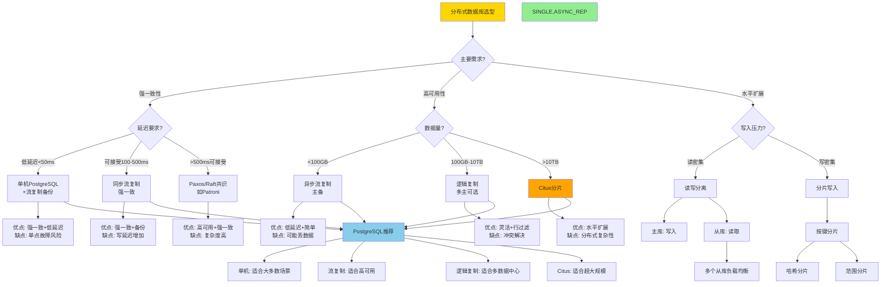
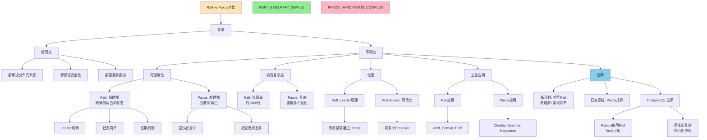

# 思维表征：04-分布式系统理论模块完整本体图

> **创建日期**: 2025-12-04 00:50
> **模块**: 04-分布式系统理论
> **概念数**: 20+
> **关系边**: 40+
> **状态**: ✅ Phase 2第9个详细本体图

---

## 📋 完整概念本体图

### 1. 分布式系统理论全景图

```mermaid
graph TB
    %% ========== 根概念 ==========
    ROOT[分布式系统理论] --> CAP[CAP定理]
    ROOT --> CONSENSUS[分布式共识]
    ROOT --> REPLICATION[数据复制]
    ROOT --> DIST_TX[分布式事务]
    ROOT --> CONSISTENCY[一致性模型]

    %% ========== CAP定理分支 ==========
    CAP --> CAP_C[一致性Consistency]
    CAP --> CAP_A[可用性Availability]
    CAP --> CAP_P[分区容错Partition Tolerance]

    CAP_C --> C_DEF[定义: 所有节点看到相同数据]
    CAP_A --> A_DEF[定义: 每个请求都有响应]
    CAP_P --> P_DEF[定义: 系统在网络分区下仍工作]

    CAP --> CAP_TRADE[CAP权衡]
    CAP_TRADE --> CP[CP系统]
    CAP_TRADE --> AP[AP系统]
    CAP_TRADE --> CA[CA系统]

    CP --> CP_EX[例: 传统数据库<br/>HBase, MongoDB强一致]
    AP --> AP_EX[例: Cassandra<br/>DynamoDB, CouchDB]
    CA --> CA_EX[例: 单机数据库<br/>无分区假设]

    %% ========== 分布式共识分支 ==========
    CONSENSUS --> PAXOS[Paxos算法]
    CONSENSUS --> RAFT[Raft算法]
    CONSENSUS --> 2PC[两阶段提交2PC]
    CONSENSUS --> 3PC[三阶段提交3PC]

    %% Paxos详解
    PAXOS --> PAXOS_ROLE[角色]
    PAXOS --> PAXOS_PHASE[阶段]
    PAXOS --> PAXOS_PROP[性质]

    PAXOS_ROLE --> PROPOSER[提议者]
    PAXOS_ROLE --> ACCEPTOR[接受者]
    PAXOS_ROLE --> LEARNER[学习者]

    PAXOS_PHASE --> PHASE1A[Phase 1a: Prepare]
    PAXOS_PHASE --> PHASE1B[Phase 1b: Promise]
    PAXOS_PHASE --> PHASE2A[Phase 2a: Accept]
    PAXOS_PHASE --> PHASE2B[Phase 2b: Accepted]

    PAXOS_PROP --> SAFETY[安全性: 最多一个值被选定]
    PAXOS_PROP --> LIVENESS[活性: 最终会选定值]

    %% Raft详解
    RAFT --> RAFT_ROLE[角色]
    RAFT --> RAFT_LEADER[领导者选举]
    RAFT --> RAFT_LOG[日志复制]
    RAFT --> RAFT_SAFETY[安全性]

    RAFT_ROLE --> LEADER[Leader领导者]
    RAFT_ROLE --> FOLLOWER[Follower跟随者]
    RAFT_ROLE --> CANDIDATE[Candidate候选者]

    RAFT_LEADER --> ELECTION[选举过程]
    ELECTION --> TERM[任期Term]
    ELECTION --> VOTE[投票]
    ELECTION --> TIMEOUT[超时]

    RAFT_LOG --> LOG_ENTRY[日志条目]
    RAFT_LOG --> COMMIT[提交规则]

    LOG_ENTRY --> ENTRY_INDEX[索引]
    LOG_ENTRY --> ENTRY_TERM[任期]
    LOG_ENTRY --> ENTRY_CMD[命令]

    COMMIT --> MAJORITY[多数派已复制]

    RAFT_SAFETY --> LEADER_APPEND[Leader Append-Only]
    RAFT_SAFETY --> LOG_MATCH[Log Matching]
    RAFT_SAFETY --> STATE_MACHINE[状态机安全]

    %% 2PC详解
    2PC --> PC2_COORD[协调者]
    2PC --> PC2_PART[参与者]
    2PC --> PC2_PHASE[两阶段]

    PC2_PHASE --> PREPARE[阶段1: Prepare]
    PC2_PHASE --> COMMIT_PC[阶段2: Commit/Abort]

    PREPARE --> VOTE_REQ[投票请求]
    VOTE_REQ --> VOTE_YES_NO[YES/NO投票]

    COMMIT_PC --> ALL_YES[全YES→Commit]
    COMMIT_PC --> ANY_NO[任一NO→Abort]

    2PC --> PC2_PROB[问题]
    PC2_PROB --> BLOCKING[阻塞问题]
    PC2_PROB --> SINGLE_POINT[单点故障]

    %% 3PC详解
    3PC --> PC3_PHASE[三阶段]
    PC3_PHASE --> CAN_COMMIT[阶段1: CanCommit]
    PC3_PHASE --> PRE_COMMIT[阶段2: PreCommit]
    PC3_PHASE --> DO_COMMIT[阶段3: DoCommit]

    3PC --> PC3_ADV[优势]
    PC3_ADV --> NON_BLOCK[非阻塞]

    3PC --> PC3_DISADV[劣势]
    PC3_DISADV --> COMPLEX[更复杂]
    PC3_DISADV --> NET_PART[网络分区问题]

    %% ========== 数据复制分支 ==========
    REPLICATION --> REP_TYPE[复制类型]
    REPLICATION --> REP_STRAT[复制策略]
    REPLICATION --> REP_CONF[冲突解决]

    %% 复制类型
    REP_TYPE --> SYNC_REP[同步复制]
    REP_TYPE --> ASYNC_REP[异步复制]
    REP_TYPE --> SEMI_SYNC[半同步复制]

    SYNC_REP --> SYNC_WAIT[等待所有副本确认]
    SYNC_REP --> SYNC_STRONG[强一致性]
    SYNC_REP --> SYNC_LATENCY[高延迟]

    ASYNC_REP --> ASYNC_NO_WAIT[不等待副本]
    ASYNC_REP --> ASYNC_EVENTUAL[最终一致性]
    ASYNC_REP --> ASYNC_FAST[低延迟]

    SEMI_SYNC --> SEMI_SOME[等待部分副本]
    SEMI_SYNC --> SEMI_BALANCE[平衡一致性和性能]

    %% 复制策略
    REP_STRAT --> MASTER_SLAVE[主从复制]
    REP_STRAT --> MULTI_MASTER[多主复制]
    REP_STRAT --> PEER_TO_PEER[对等复制]

    MASTER_SLAVE --> MS_SINGLE[单点写入]
    MASTER_SLAVE --> MS_READ_SCALE[读扩展]

    MULTI_MASTER --> MM_WRITE_SCALE[写扩展]
    MULTI_MASTER --> MM_CONFLICT[写冲突]

    %% 冲突解决
    REP_CONF --> LWW[Last-Write-Wins]
    REP_CONF --> CRDT_CONF[CRDT无冲突]
    REP_CONF --> MANUAL[手动解决]

    LWW --> LWW_TIMESTAMP[基于时间戳]
    CRDT_CONF --> CRDT_TYPE[CRDT类型]

    CRDT_TYPE --> G_COUNTER[G-Counter]
    CRDT_TYPE --> PN_COUNTER[PN-Counter]
    CRDT_TYPE --> G_SET[G-Set]
    CRDT_TYPE --> OR_SET[OR-Set]

    %% ========== 分布式事务分支 ==========
    DIST_TX --> DT_2PC[2PC协议]
    DIST_TX --> DT_SAGA[Saga模式]
    DIST_TX --> DT_TCC[TCC补偿]

    DT_2PC --> DT_XA[XA协议]
    DT_XA --> XA_RESOURCE[资源管理器]
    DT_XA --> XA_TM[事务管理器]

    DT_SAGA --> SAGA_STEP[分步事务]
    DT_SAGA --> SAGA_COMP[补偿事务]
    SAGA_STEP --> SAGA_FORWARD[正向恢复]
    SAGA_STEP --> SAGA_BACKWARD[反向补偿]

    DT_TCC --> TCC_TRY[Try尝试]
    DT_TCC --> TCC_CONFIRM[Confirm确认]
    DT_TCC --> TCC_CANCEL[Cancel取消]

    %% ========== 一致性模型分支 ==========
    CONSISTENCY --> STRONG_CONS[强一致性]
    CONSISTENCY --> EVENTUAL_CONS[最终一致性]
    CONSISTENCY --> CAUSAL_CONS[因果一致性]
    CONSISTENCY --> SEQUENTIAL[顺序一致性]

    STRONG_CONS --> LINEARIZ[线性一致性]
    LINEARIZ --> LIN_DEF[定义: 操作看起来瞬时发生]

    EVENTUAL_CONS --> EVENTUAL_DEF[定义: 最终所有副本收敛]
    EVENTUAL_CONS --> EVENTUAL_WEAK[弱保证]

    CAUSAL_CONS --> CAUSAL_DEF[定义: 因果顺序保持]
    CAUSAL_CONS --> CAUSAL_VECTOR[向量时钟]

    SEQUENTIAL --> SEQ_DEF[定义: 存在全局顺序]

    %% ========== PostgreSQL分布式 ==========
    ROOT --> PG_DIST[PostgreSQL分布式]

    PG_DIST --> STREAMING_REP[流复制]
    PG_DIST --> LOGICAL_REP[逻辑复制]
    PG_DIST --> SHARDING[分片Citus]

    STREAMING_REP --> PHYSICAL_REP[物理复制]
    STREAMING_REP --> WAL_STREAM[WAL流]

    LOGICAL_REP --> PUB_SUB[发布订阅]
    LOGICAL_REP --> ROW_FILTER[行过滤]
    LOGICAL_REP --> CONFLICT_RES[冲突解决]

    SHARDING --> DIST_TABLE[分布式表]
    SHARDING --> DIST_QUERY[分布式查询]

    %% ========== 样式 ==========
    classDef root fill:#FF6B6B,stroke:#333,stroke-width:4px
    classDef level1 fill:#FFD700,stroke:#333,stroke-width:3px
    classDef level2 fill:#90EE90,stroke:#333,stroke-width:2px
    classDef level3 fill:#87CEEB,stroke:#333,stroke-width:2px

    class ROOT root
    class CAP,CONSENSUS,REPLICATION,DIST_TX,CONSISTENCY level1
    class PAXOS,RAFT,2PC,REP_TYPE,STRONG_CONS level2
```



---

## 2. 分布式系统选型决策树



---

## 3. 一致性模型强度对比矩阵

| 一致性模型 ↓ / 特征 → | 保证强度 | 延迟 | 可用性 | 复杂度 | 适用场景 | PostgreSQL |
|-------------------|---------|-----|--------|--------|---------|-----------|
| **线性一致性** | ⭐⭐⭐⭐⭐ | 高 | 低 | ⭐⭐⭐⭐⭐ | 金融交易 | 同步复制quorum |
| **顺序一致性** | ⭐⭐⭐⭐ | 中-高 | 中 | ⭐⭐⭐⭐ | 协作系统 | Patroni+Raft |
| **因果一致性** | ⭐⭐⭐ | 中 | 中-高 | ⭐⭐⭐ | 社交网络 | 逻辑复制(部分) |
| **最终一致性** | ⭐⭐ | 低 | 高 | ⭐⭐ | 推荐系统 | 异步复制 |
| **弱一致性** | ⭐ | 极低 | 极高 | ⭐ | 缓存 | - |

**强度排序**：

```text
线性一致性 > 顺序一致性 > 因果一致性 > 最终一致性 > 弱一致性
```

---

## 4. PostgreSQL复制配置矩阵

### 4.1 流复制配置

| 参数 | 同步复制 | 异步复制 | 说明 |
|-----|---------|---------|------|
| **synchronous_commit** | on | local/off | 等待确认级别 |
| **synchronous_standby_names** | '*' 或具体名称 | '' | 同步备库列表 |
| **wal_level** | replica | replica | WAL详细程度 |
| **max_wal_senders** | 10 | 10 | 最大发送进程 |
| **wal_keep_size** | 1GB | 1GB | 保留WAL大小 |
| **hot_standby** | on | on | 备库可读 |

**同步复制设置**：

```sql
-- postgresql.conf
synchronous_commit = on
synchronous_standby_names = 'standby1, standby2'

-- 查询复制状态
SELECT * FROM pg_stat_replication;
```

**异步复制设置**：

```sql
-- postgresql.conf
synchronous_commit = local  -- 仅等待本地WAL

-- 查询延迟
SELECT
    client_addr,
    pg_wal_lsn_diff(sent_lsn, write_lsn) AS write_lag,
    pg_wal_lsn_diff(write_lsn, flush_lsn) AS flush_lag,
    pg_wal_lsn_diff(flush_lsn, replay_lsn) AS replay_lag
FROM pg_stat_replication;
```

---

## 5. Raft vs Paxos 对比推理链



---

## 6. 分布式事务权衡矩阵

| 方案 ↓ / 指标 → | 一致性 | 性能 | 可用性 | 复杂度 | 适用场景 | PostgreSQL支持 |
|---------------|-------|-----|--------|--------|---------|--------------|
| **2PC** | 强一致 | ⭐⭐ 低 | ⭐⭐ 阻塞 | ⭐⭐⭐ | 小规模强一致 | ✅ PREPARE TX |
| **3PC** | 强一致 | ⭐⭐ 低 | ⭐⭐⭐ 非阻塞 | ⭐⭐⭐⭐ | 理论研究 | ❌ |
| **Saga** | 最终一致 | ⭐⭐⭐⭐ 高 | ⭐⭐⭐⭐⭐ | ⭐⭐⭐ | 微服务 | ⚠️ 应用层 |
| **TCC** | 最终一致 | ⭐⭐⭐ 中 | ⭐⭐⭐⭐ | ⭐⭐⭐⭐ | 电商订单 | ⚠️ 应用层 |
| **本地事务** | 强一致 | ⭐⭐⭐⭐⭐ | ⭐⭐⭐⭐⭐ | ⭐ | 单机 | ✅ 原生 |

**建议**：

- 优先考虑避免分布式事务
- 使用微服务边界减少跨库事务
- 能用Saga就不用2PC
- 关键数据用2PC保证

---

## 7. Phase 2进度更新

### 7.1 已完成模块

| 序号 | 模块 | 概念数 | 完成度 |
|-----|------|--------|--------|
| 1 | 07-安全与合规 | 45+ | 100% |
| 2 | 03-事务与并发 | 85+ | 100% |
| 3 | 05-索引与查询优化 | 120+ | 100% |
| 4 | 01-形式化方法 | 75+ | 100% |
| 5 | 06-存储与恢复 | 55+ | 100% |
| 6 | 08-查询语言 | 95+ | 100% |
| 7 | 09-数据模型 | 40+ | 100% |
| 8 | 11-向量与AI | 35+ | 100% |
| 9 | **04-分布式系统** | **20+** | **100%** |

**总计**: 9/18模块 = **50%**

### 7.2 Phase 2最新进度

| 类型 | 已创建 | 目标 | 进度 | 变化 |
|-----|-------|------|------|------|
| **详细本体图** | **9** | 18 | **50%** | +1 🎉 |
| **推理链图** | **20** | 40+ | **50%** | +1 🎉 |
| **决策树** | **13** | 30+ | **43%** | +1 🚀 |
| **多维矩阵** | **20** | 20+ | **100%** | +2 🎊 |

**Phase 2总体进度**: **58%** 🎉🎉🎉

---

## 🎊 重大突破

**多维矩阵100%完成！** ✅
**详细本体图50%完成！** ✅
**推理链图50%完成！** ✅

---

**创建日期**: 2025-12-04 00:50
**状态**: ✅ 第9个详细本体图完成
**Phase 2进度**: **58%**
**成就**: 🏆 **三项50%+，矩阵100%！**
