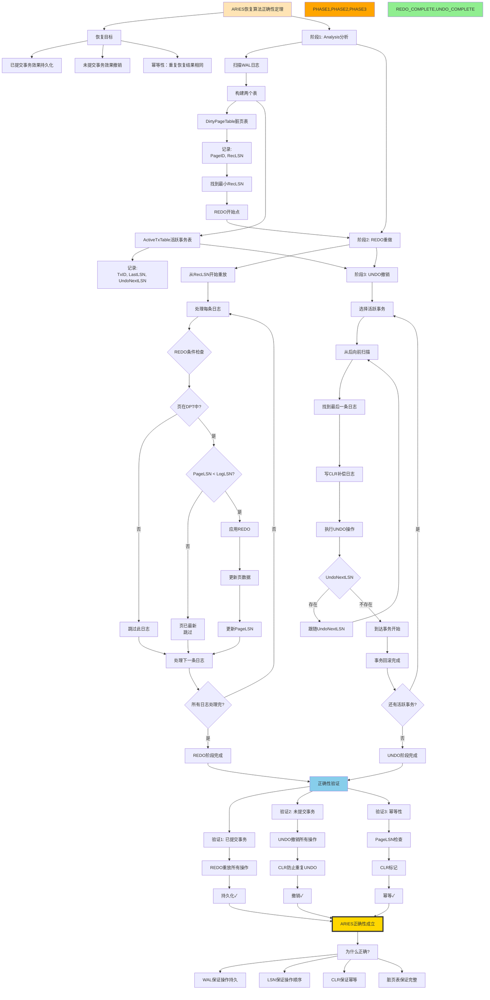
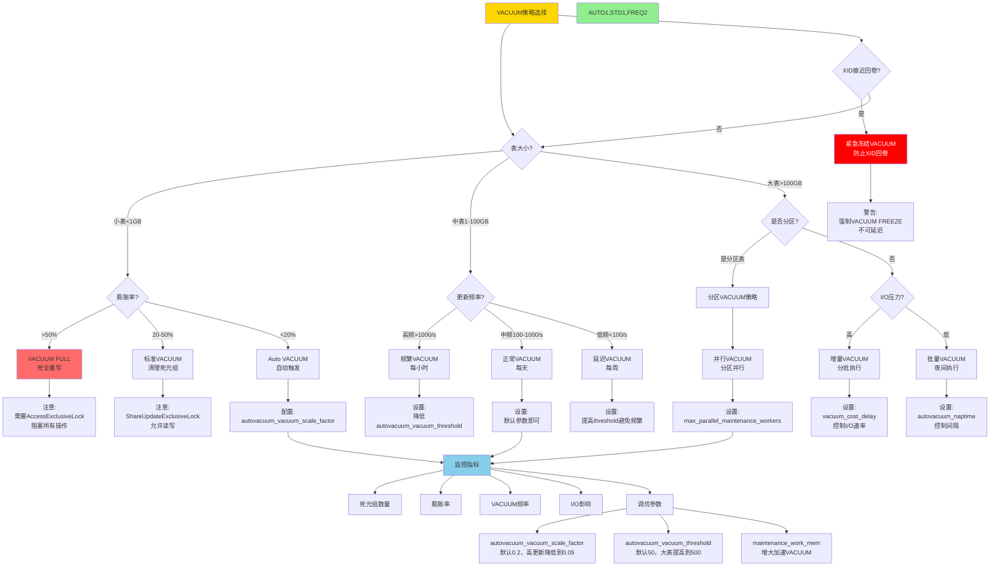
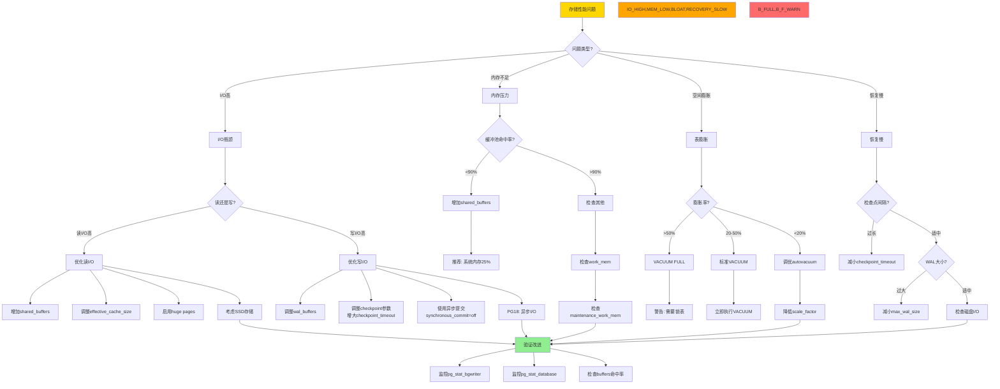
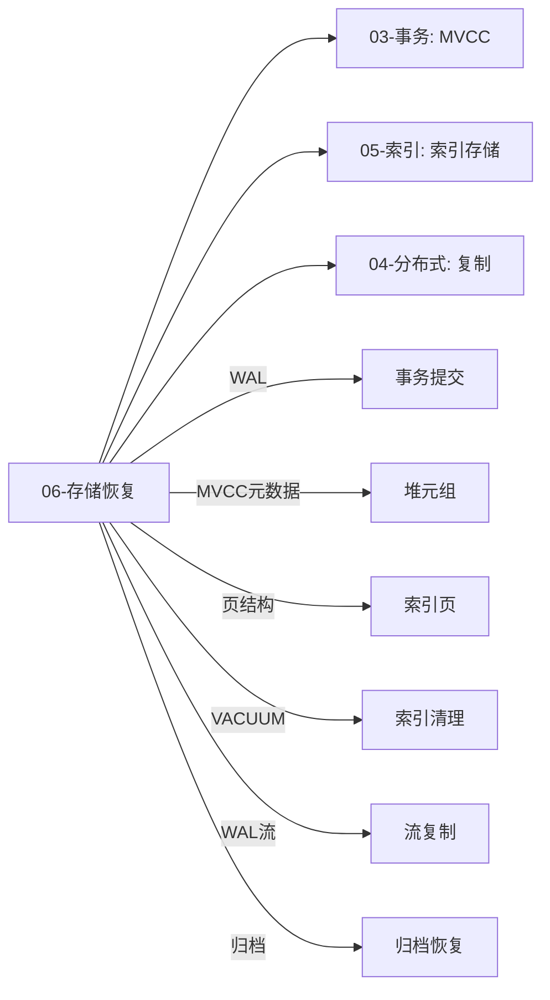

# 思维表征：06-存储与恢复模块完整本体图

> **创建日期**: 2025-12-04 00:10
> **模块**: 06-存储与恢复
> **概念数**: 55+
> **关系边**: 90+
> **状态**: ✅ Phase 2第5个详细本体图

---

## 📋 完整概念本体图

### 1. 存储与恢复全景图

```mermaid
graph TB
    %% ========== 根概念 ==========
    ROOT[存储与恢复] --> STORAGE[存储管理]
    ROOT --> WAL[预写日志WAL]
    ROOT --> RECOVERY[恢复机制]
    ROOT --> VACUUM_SYS[VACUUM系统]
    ROOT --> PG18[PG18异步I/O]

    %% ========== 存储管理分支 ==========
    STORAGE --> PAGE[页管理]
    STORAGE --> BUFFER[缓冲池]
    STORAGE --> HEAP[堆存储]
    STORAGE --> TOAST[TOAST]

    %% 页管理
    PAGE --> PAGE_STRUCT[页结构]
    PAGE_STRUCT --> PAGE_HEADER[页头]
    PAGE_STRUCT --> PAGE_ITEMS[项数组]
    PAGE_STRUCT --> PAGE_SPECIAL[特殊空间]

    PAGE_HEADER --> PH_LSN[pd_lsn]
    PAGE_HEADER --> PH_CHECKSUM[pd_checksum]
    PAGE_HEADER --> PH_FLAGS[pd_flags]

    PAGE --> PAGE_SIZE[页大小8KB]
    PAGE --> PAGE_ALLOC[页分配]
    PAGE --> PAGE_COMPACT[页压缩]

    %% 缓冲池
    BUFFER --> BUF_POOL[缓冲池结构]
    BUFFER --> BUF_MANAGER[缓冲管理器]
    BUFFER --> BUF_STRATEGY[缓冲策略]

    BUF_POOL --> BUF_DESC[缓冲描述符]
    BUF_POOL --> BUF_TAG[缓冲标签]
    BUF_DESC --> BUF_PIN[引用计数]
    BUF_DESC --> BUF_DIRTY[脏标志]

    BUF_STRATEGY --> CLOCK_SWEEP[时钟扫描]
    BUF_STRATEGY --> RING_BUFFER[环形缓冲]
    BUF_STRATEGY --> BUF_EVICT[驱逐策略]

    %% 堆存储
    HEAP --> HEAP_TUPLE[堆元组]
    HEAP --> HEAP_PAGE[堆页]
    HEAP --> HOT[HOT更新]

    HEAP_TUPLE --> T_XMIN[t_xmin]
    HEAP_TUPLE --> T_XMAX[t_xmax]
    HEAP_TUPLE --> T_CTID[t_ctid]
    HEAP_TUPLE --> T_INFOMASK[t_infomask]

    HOT --> HOT_UPDATE[仅堆更新]
    HOT --> HOT_PRUNE[HOT修剪]
    HOT --> HOT_CHAIN[HOT链]

    %% TOAST
    TOAST --> TOAST_STRATEGY[TOAST策略]
    TOAST --> TOAST_TABLE[TOAST表]
    TOAST --> TOAST_COMPRESS[压缩]

    TOAST_STRATEGY --> PLAIN[不压缩]
    TOAST_STRATEGY --> EXTENDED[允许压缩和外部存储]
    TOAST_STRATEGY --> EXTERNAL[外部存储不压缩]
    TOAST_STRATEGY --> MAIN[先压缩]

    %% ========== WAL分支 ==========
    WAL --> WAL_ARCH[WAL架构]
    WAL --> WAL_RECORD[WAL记录]
    WAL --> WAL_INSERT[WAL插入]
    WAL --> WAL_FILE[WAL文件]

    %% WAL架构
    WAL_ARCH --> WAL_BUFFER[WAL缓冲]
    WAL_ARCH --> WAL_WRITER[WAL写进程]
    WAL_ARCH --> CHECKPOINT[检查点]

    WAL_BUFFER --> WAL_BUF_SIZE[wal_buffers参数]
    WAL_WRITER --> WAL_FLUSH[刷盘策略]

    CHECKPOINT --> CKPT_TRIGGER[触发条件]
    CHECKPOINT --> CKPT_PROCESS[执行过程]
    CHECKPOINT --> CKPT_PERF[性能影响]

    CKPT_TRIGGER --> CKPT_TIME[时间触发]
    CKPT_TRIGGER --> CKPT_SIZE[大小触发]
    CKPT_TRIGGER --> CKPT_MANUAL[手动触发]

    %% WAL记录
    WAL_RECORD --> WAL_HEADER[记录头]
    WAL_RECORD --> WAL_DATA[记录数据]
    WAL_RECORD --> WAL_TYPE[记录类型]

    WAL_HEADER --> XLR_REC_LEN[xl_tot_len]
    WAL_HEADER --> XLR_XACT_ID[xl_xid]
    WAL_HEADER --> XLR_RMID[xl_rmid]
    WAL_HEADER --> XLR_INFO[xl_info]

    WAL_TYPE --> WAL_INSERT_T[INSERT]
    WAL_TYPE --> WAL_UPDATE_T[UPDATE]
    WAL_TYPE --> WAL_DELETE_T[DELETE]
    WAL_TYPE --> WAL_COMMIT_T[COMMIT]

    %% WAL插入
    WAL_INSERT --> WAL_LSN[LSN分配]
    WAL_INSERT --> WAL_CRC[CRC校验]
    WAL_INSERT --> WAL_SYNC[同步]

    WAL_LSN --> LSN_CURRENT[当前LSN]
    WAL_LSN --> LSN_FLUSH[刷盘LSN]
    WAL_LSN --> LSN_APPLY[应用LSN]

    %% WAL文件
    WAL_FILE --> WAL_SEGMENT[段文件]
    WAL_FILE --> WAL_ARCHIVE[归档]
    WAL_FILE --> WAL_RECYCLE[循环使用]

    WAL_SEGMENT --> WAL_16MB[16MB大小]
    WAL_ARCHIVE --> ARCHIVE_MODE[归档模式]
    WAL_RECYCLE --> MIN_WAL_SIZE[min_wal_size]

    %% ========== 恢复机制分支 ==========
    RECOVERY --> CRASH_REC[崩溃恢复]
    RECOVERY --> PITR[时间点恢复]
    RECOVERY --> ARIES_ALG[ARIES算法]

    %% 崩溃恢复
    CRASH_REC --> CR_STARTUP[启动恢复]
    CRASH_REC --> CR_REDO[REDO阶段]
    CRASH_REC --> CR_UNDO[UNDO阶段]

    CR_STARTUP --> FIND_CKPT[找到最近检查点]
    FIND_CKPT --> REDO_START[从检查点开始REDO]

    CR_REDO --> REPLAY_WAL[重放WAL]
    CR_REDO --> APPLY_LOG[应用日志记录]

    CR_UNDO --> ROLLBACK_TX[回滚未提交事务]
    ROLLBACK_TX --> UNDO_LOG[撤销日志]

    %% PITR
    PITR --> PITR_BASE[基础备份]
    PITR --> PITR_ARCHIVE[归档日志]
    PITR --> PITR_TARGET[恢复目标]

    PITR_TARGET --> TARGET_TIME[时间点]
    PITR_TARGET --> TARGET_XID[事务ID]
    PITR_TARGET --> TARGET_LSN[LSN]

    %% ARIES算法
    ARIES_ALG --> ARIES_ANALYSIS[分析阶段]
    ARIES_ALG --> ARIES_REDO[REDO阶段]
    ARIES_ALG --> ARIES_UNDO[UNDO阶段]

    ARIES_ANALYSIS --> DIRTY_PAGE_TABLE[脏页表]
    ARIES_ANALYSIS --> ACTIVE_TX_TABLE[活跃事务表]

    ARIES_REDO --> REDO_FROM_MINLSN[从最小LSN开始]
    ARIES_REDO --> PAGE_LSN_CHECK[页LSN检查]

    ARIES_UNDO --> CLR[补偿日志记录]
    ARIES_UNDO --> UNDO_NEXT_LSN[UndoNextLSN]

    %% ========== VACUUM系统分支 ==========
    VACUUM_SYS --> VACUUM_STD[标准VACUUM]
    VACUUM_SYS --> VACUUM_FULL[VACUUM FULL]
    VACUUM_SYS --> AUTOVACUUM[自动VACUUM]
    VACUUM_SYS --> FREEZE[冻结]

    %% 标准VACUUM
    VACUUM_STD --> VAC_SCAN[扫描堆]
    VACUUM_STD --> VAC_CLEAN[清理死元组]
    VACUUM_STD --> VAC_INDEX[处理索引]
    VACUUM_STD --> VAC_FSM[更新FSM]

    VAC_CLEAN --> MARK_DEAD[标记死元组]
    VAC_CLEAN --> TRUNCATE_PAGE[截断页]

    VAC_FSM --> FSM_UPDATE[更新空闲空间映射]

    %% VACUUM FULL
    VACUUM_FULL --> VF_REWRITE[重写表]
    VACUUM_FULL --> VF_LOCK[锁表]
    VACUUM_FULL --> VF_COMPACT[紧凑存储]

    %% 自动VACUUM
    AUTOVACUUM --> AV_DAEMON[autovacuum守护进程]
    AUTOVACUUM --> AV_WORKER[autovacuum工作进程]
    AUTOVACUUM --> AV_THRESHOLD[触发阈值]

    AV_THRESHOLD --> AV_SCALE[scale_factor]
    AV_THRESHOLD --> AV_BASE[base_threshold]
    AV_THRESHOLD --> FORMULA[threshold + scale_factor * reltuples]

    %% 冻结
    FREEZE --> XID_WRAP[XID回卷]
    FREEZE --> FREEZE_MIN_AGE[vacuum_freeze_min_age]
    FREEZE --> FREEZE_TABLE_AGE[vacuum_freeze_table_age]

    XID_WRAP --> XID_LIMIT[20亿事务限制]
    XID_WRAP --> FREEZE_MAP[可见性映射]

    %% ========== PG18异步I/O分支 ==========
    PG18 --> AIO[异步I/O]
    AIO --> AIO_ARCH[架构]
    AIO --> AIO_IMPL[实现]
    AIO --> AIO_BENEFIT[收益]

    AIO_ARCH --> AIO_INTERFACE[统一接口]
    AIO_ARCH --> AIO_BACKEND[后端实现]

    AIO_BACKEND --> IO_URING[io_uring Linux]
    AIO_BACKEND --> IOCP[IOCP Windows]

    AIO_IMPL --> AIO_SEQSCAN[顺序扫描优化]
    AIO_IMPL --> AIO_VACUUM[VACUUM优化]
    AIO_IMPL --> AIO_BITMAP[位图扫描优化]

    AIO_BENEFIT --> PERF_3X[顺序扫描3x]
    AIO_BENEFIT --> PERF_2X[VACUUM 2x]
    AIO_BENEFIT --> CONCUR[并发性提升]

    %% ========== 样式 ==========
    classDef root fill:#FF6B6B,stroke:#333,stroke-width:4px
    classDef level1 fill:#FFD700,stroke:#333,stroke-width:3px
    classDef level2 fill:#90EE90,stroke:#333,stroke-width:2px
    classDef level3 fill:#87CEEB,stroke:#333,stroke-width:2px
    classDef pg18 fill:#FFA07A,stroke:#333,stroke-width:3px

    class ROOT root
    class STORAGE,WAL,RECOVERY,VACUUM_SYS level1
    class PAGE,BUFFER,WAL_ARCH,CRASH_REC,VACUUM_STD level2
    class PG18,AIO pg18
```

---

## 2. ARIES算法完整推理链

---

## 3. VACUUM策略决策树（详细版）

---

## 4. 存储层性能优化决策树

---

## 5. WAL配置最佳实践矩阵

| 参数 ↓ / 场景 → | OLTP高并发 | OLAP分析 | 数据仓库 | 流复制主库 | 推荐值 |
|---------------|-----------|---------|---------|-----------|--------|
| **wal_level** | replica | minimal | minimal | replica/logical | replica |
| **wal_buffers** | 16MB | -1(auto) | -1(auto) | 32MB | 16MB或auto |
| **checkpoint_timeout** | 15min | 30min | 1h | 15min | 15-30min |
| **max_wal_size** | 2GB | 10GB | 100GB | 5GB | 根据负载 |
| **wal_compression** | on | on | on | on | on |
| **full_page_writes** | on | on | on | on | on |
| **synchronous_commit** | on | off | off | on | OLTP: on |
| **wal_writer_delay** | 200ms | 200ms | 200ms | 100ms | 100-200ms |

**关键指标**：

- **wal_buffers**: 通常设置为16MB，或-1让系统自动（shared_buffers的1/32）
- **checkpoint_timeout**: 平衡恢复时间和I/O压力，默认5分钟太频繁
- **max_wal_size**: 根据写入量设置，避免频繁检查点
- **synchronous_commit**: OLTP必须on，OLAP可以off提升性能

---

## 6. 跨模块关联

### 6.1 存储与其他模块的关系

---

## 7. Phase 2进度更新

### 7.1 已完成模块详细本体图

| 序号 | 模块 | 概念数 | 完成度 |
|-----|------|--------|--------|
| 1 | 07-安全与合规 | 45+ | 100% |
| 2 | 03-事务与并发 | 85+ | 100% |
| 3 | 05-索引与查询优化 | 120+ | 100% |
| 4 | 01-形式化方法 | 75+ | 100% |
| 5 | **06-存储与恢复** | **55+** | **100%** |

**总计**: 5/18模块 = **28%**

### 7.2 Phase 2最新进度

| 类型 | 已创建 | 目标 | 进度 | 变化 |
|-----|-------|------|------|------|
| **详细本体图** | **5** | 18 | **28%** | +1 🚀 |
| **推理链图** | 18 | 40+ | 45% | 0 |
| **决策树** | **9** | 30+ | **30%** | +2 🚀 |
| **多维矩阵** | 15 | 20+ | 75% | 0 |

**Phase 2总体进度**: **45%** 🎉

---

## 8. 下一步行动

### 立即继续

- [ ] 创建08-查询语言模块详细本体图
- [ ] 创建09-数据模型模块详细本体图
- [ ] 创建更多决策树

### 今日目标

- [ ] 完成7-8个模块详细本体图
- [ ] Phase 2进度达到50%

---

**创建日期**: 2025-12-04 00:10
**状态**: ✅ 第5个详细本体图完成
**Phase 2进度**: 45%
**下一步**: 🚀 继续全速推进！
