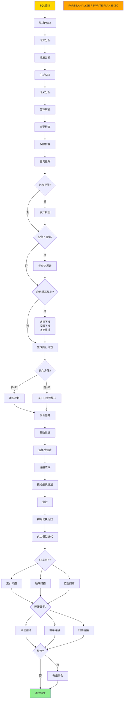
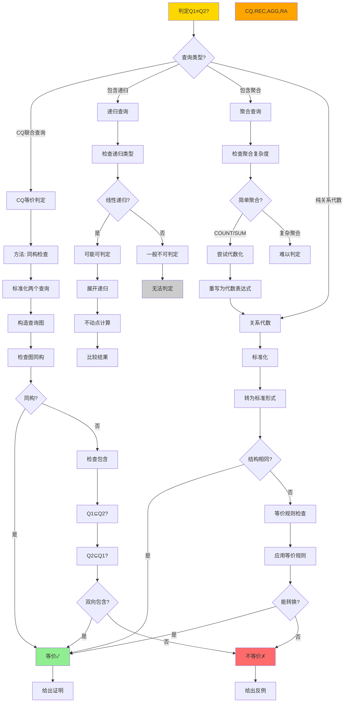
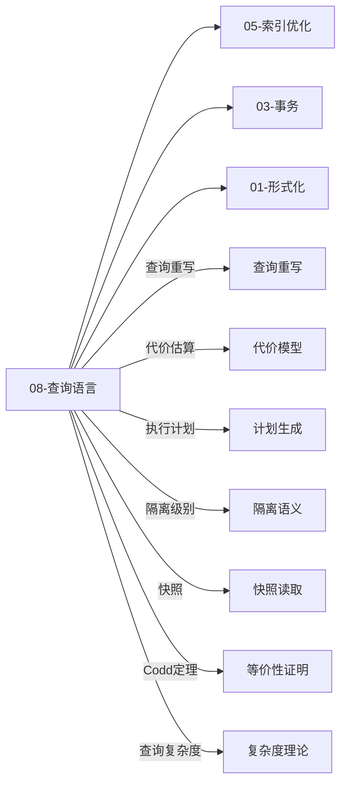

# 思维表征：08-查询语言与语义模块完整本体图

> **创建日期**: 2025-12-04 00:20
> **模块**: 08-查询语言与语义
> **概念数**: 95+
> **关系边**: 150+
> **状态**: ✅ Phase 2第6个详细本体图

---

## 📋 完整概念本体图

### 1. 查询语言与语义全景图

```mermaid
graph TB
    %% ========== 根概念 ==========
    ROOT[查询语言与语义] --> ALGEBRA[关系代数]
    ROOT --> CALCULUS[关系演算]
    ROOT --> SQL[SQL语言]
    ROOT --> DATALOG[Datalog]
    ROOT --> THEORY[查询理论]

    %% ========== 关系代数分支 ==========
    ALGEBRA --> RA_OPS[基本操作]
    ALGEBRA --> RA_PROPS[代数性质]
    ALGEBRA --> RA_OPT[代数优化]

    %% 基本操作
    RA_OPS --> SEL[选择σ]
    RA_OPS --> PROJ[投影π]
    RA_OPS --> JOIN[连接⋈]
    RA_OPS --> UNION[并∪]
    RA_OPS --> DIFF[差−]
    RA_OPS --> CROSS[笛卡尔积×]

    SEL --> SEL_COND[选择条件]
    SEL_COND --> SEL_SIMPLE[简单条件: age>30]
    SEL_COND --> SEL_COMP[复合条件: age>30∧salary>5000]

    PROJ --> PROJ_ATTRS[投影属性列表]
    PROJ --> PROJ_DUP[去重]

    JOIN --> JOIN_TYPES[连接类型]
    JOIN_TYPES --> NATURAL[自然连接]
    JOIN_TYPES --> THETA[θ连接]
    JOIN_TYPES --> EQUI[等值连接]
    JOIN_TYPES --> OUTER[外连接]

    OUTER --> LEFT_OUTER[左外连接]
    OUTER --> RIGHT_OUTER[右外连接]
    OUTER --> FULL_OUTER[全外连接]

    %% 代数性质
    RA_PROPS --> PROP_COMM[交换律]
    RA_PROPS --> PROP_ASSOC[结合律]
    RA_PROPS --> PROP_DIST[分配律]

    PROP_COMM --> COMM_JOIN[R⋈S = S⋈R]
    PROP_COMM --> COMM_UNION[R∪S = S∪R]

    PROP_ASSOC --> ASSOC_JOIN[R⋈S⋈T = R⋈S⋈T]
    PROP_ASSOC --> ASSOC_UNION[R∪S∪T = R∪S∪T]

    PROP_DIST --> DIST_SEL[σc1∧c2 = σc1∘σc2]
    PROP_DIST --> DIST_PROJ[πA(πB(R)) = πA(R), A⊆B]

    %% 代数优化
    RA_OPT --> OPT_PUSH_SEL[选择下推]
    RA_OPT --> OPT_PUSH_PROJ[投影下推]
    RA_OPT --> OPT_JOIN_ORDER[连接重排序]

    OPT_PUSH_SEL --> PUSH_SEL_RULE[σc(R⋈S) → σc(R)⋈S<br/>if c只涉及R]
    OPT_PUSH_PROJ --> PUSH_PROJ_RULE[πA(R⋈S) → πA1(R)⋈πA2(S)]

    %% ========== 关系演算分支 ==========
    CALCULUS --> TRC[元组关系演算]
    CALCULUS --> DRC[域关系演算]
    CALCULUS --> SAFE[安全性]

    %% 元组关系演算
    TRC --> TRC_SYNTAX[TRC语法]
    TRC --> TRC_SEM[TRC语义]

    TRC_SYNTAX --> TRC_VAR[元组变量]
    TRC_SYNTAX --> TRC_COND[条件公式]
    TRC_SYNTAX --> TRC_QUANT[量词]

    TRC_COND --> TRC_ATOM[原子公式: R(t)]
    TRC_COND --> TRC_COMP[比较: t[A] = 5]
    TRC_COND --> TRC_LOGIC[逻辑: ∧, ∨, ¬]

    TRC_QUANT --> TRC_EXISTS[存在量词∃]
    TRC_QUANT --> TRC_FORALL[全称量词∀]

    %% 域关系演算
    DRC --> DRC_SYNTAX[DRC语法]
    DRC_SYNTAX --> DRC_VAR[域变量]
    DRC_SYNTAX --> DRC_COND[条件公式]

    %% 安全性
    SAFE --> SAFE_DEF[安全性定义]
    SAFE_DEF --> SAFE_FINITE[结果有限]
    SAFE_DEF --> SAFE_DOMAIN[域独立]

    SAFE --> SAFE_CHECK[安全性检查]
    SAFE_CHECK --> RANGE_RESTRICT[范围限制]

    %% ========== SQL语言分支 ==========
    SQL --> SQL_DML[DML数据操纵]
    SQL --> SQL_DDL[DDL数据定义]
    SQL --> SQL_SEM[SQL语义]
    SQL --> SQL_FEAT[高级特性]

    %% DML
    SQL_DML --> SELECT_ST[SELECT查询]
    SQL_DML --> INSERT_ST[INSERT插入]
    SQL_DML --> UPDATE_ST[UPDATE更新]
    SQL_DML --> DELETE_ST[DELETE删除]

    SELECT_ST --> SELECT_CLAUSE[SELECT子句]
    SELECT_ST --> FROM_CLAUSE[FROM子句]
    SELECT_ST --> WHERE_CLAUSE[WHERE子句]
    SELECT_ST --> GROUP_CLAUSE[GROUP BY子句]
    SELECT_ST --> HAVING_CLAUSE[HAVING子句]
    SELECT_ST --> ORDER_CLAUSE[ORDER BY子句]

    FROM_CLAUSE --> FROM_JOIN[连接]
    FROM_JOIN --> CROSS_JOIN[CROSS JOIN]
    FROM_JOIN --> INNER_JOIN[INNER JOIN]
    FROM_JOIN --> OUTER_JOIN[OUTER JOIN]

    GROUP_CLAUSE --> AGGR[聚合函数]
    AGGR --> COUNT[COUNT]
    AGGR --> SUM[SUM]
    AGGR --> AVG[AVG]
    AGGR --> MAX_MIN[MAX/MIN]

    %% SQL语义
    SQL_SEM --> MULTISET[多重集语义]
    SQL_SEM --> NULL_SEM[NULL语义]
    SQL_SEM --> THREE_VAL[三值逻辑]

    MULTISET --> BAG_SEM[bag语义vs set语义]
    NULL_SEM --> NULL_COMP[NULL比较]
    NULL_SEM --> NULL_AGGR[NULL聚合]

    THREE_VAL --> TRUE[TRUE]
    THREE_VAL --> FALSE[FALSE]
    THREE_VAL --> UNKNOWN[UNKNOWN]

    %% 高级特性
    SQL_FEAT --> SUBQUERY[子查询]
    SQL_FEAT --> CTE[CTE公共表表达式]
    SQL_FEAT --> WINDOW[窗口函数]
    SQL_FEAT --> RECURSIVE[递归查询]

    SUBQUERY --> SCALAR_SUB[标量子查询]
    SUBQUERY --> EXISTS_SUB[EXISTS子查询]
    SUBQUERY --> IN_SUB[IN子查询]

    CTE --> WITH_CLAUSE[WITH子句]
    CTE --> CTE_OPT[CTE优化]

    RECURSIVE --> REC_CTE[递归CTE]
    RECURSIVE --> REC_SEM[递归语义]
    REC_SEM --> FIXPOINT[不动点]

    WINDOW --> PARTITION[PARTITION BY]
    WINDOW --> ORDER_WIN[ORDER BY]
    WINDOW --> FRAME[窗口帧]

    FRAME --> ROWS_FRAME[ROWS框架]
    FRAME --> RANGE_FRAME[RANGE框架]

    %% ========== Datalog分支 ==========
    DATALOG --> DL_SYNTAX[Datalog语法]
    DATALOG --> DL_SEM[Datalog语义]
    DATALOG --> DL_EVAL[Datalog求值]

    %% Datalog语法
    DL_SYNTAX --> DL_RULE[规则]
    DL_SYNTAX --> DL_FACT[事实]
    DL_SYNTAX --> DL_QUERY[查询]

    DL_RULE --> RULE_HEAD[规则头]
    DL_RULE --> RULE_BODY[规则体]
    DL_RULE --> RULE_REC[递归规则]

    %% Datalog语义
    DL_SEM --> DL_FIXPOINT[不动点语义]
    DL_SEM --> DL_MODEL[模型论语义]

    DL_FIXPOINT --> LFIXPOINT[最小不动点]
    DL_FIXPOINT --> ITERATION[迭代计算]

    %% Datalog求值
    DL_EVAL --> NAIVE[朴素求值]
    DL_EVAL --> SEMI_NAIVE[半朴素求值]
    DL_EVAL --> MAGIC[Magic Sets]

    SEMI_NAIVE --> DELTA[增量计算Δ]
    MAGIC --> GOAL_ORIENT[目标导向]

    %% ========== 查询理论分支 ==========
    THEORY --> CODD_THM[Codd定理]
    THEORY --> COMPLEXITY[查询复杂度]
    THEORY --> CONTAINMENT[查询包含]
    THEORY --> EQUIVALENCE[查询等价]

    %% Codd定理
    CODD_THM --> CODD_STATE[定理陈述]
    CODD_STATE --> RA_EQ_RC[关系代数≡安全的关系演算]

    CODD_THM --> CODD_PROOF[证明]
    CODD_PROOF --> RA_TO_RC[RA→RC]
    CODD_PROOF --> RC_TO_RA[RC→RA]

    %% 查询复杂度
    COMPLEXITY --> DATA_COMP[数据复杂度]
    COMPLEXITY --> COMBINED_COMP[组合复杂度]
    COMPLEXITY --> EXPR_COMP[表达式复杂度]

    DATA_COMP --> DC_MEASURE[固定查询，变化数据大小]
    COMBINED_COMP --> CC_MEASURE[查询和数据都变化]

    %% 查询包含
    CONTAINMENT --> CONT_DEF[包含定义]
    CONT_DEF --> Q1_SUB_Q2[Q1⊆Q2: ∀D. Q1(D)⊆Q2(D)]

    CONTAINMENT --> CONT_DECIDE[可判定性]
    CONT_DECIDE --> CQ_DECIDE[CQ可判定]
    CONT_DECIDE --> UCQ_DECIDE[UCQ可判定]

    %% 查询等价
    EQUIVALENCE --> EQ_DEF[等价定义]
    EQ_DEF --> Q1_EQ_Q2[Q1≡Q2: ∀D. Q1(D)=Q2(D)]

    EQUIVALENCE --> EQ_TEST[等价测试]
    EQ_TEST --> CANONICAL[标准化]
    EQ_TEST --> MINIMIZE[最小化]

    %% ========== 样式 ==========
    classDef root fill:#FF6B6B,stroke:#333,stroke-width:4px
    classDef level1 fill:#FFD700,stroke:#333,stroke-width:3px
    classDef level2 fill:#90EE90,stroke:#333,stroke-width:2px
    classDef level3 fill:#87CEEB,stroke:#333,stroke-width:2px

    class ROOT root
    class ALGEBRA,CALCULUS,SQL,DATALOG,THEORY level1
    class RA_OPS,TRC,SQL_DML,DL_SYNTAX,CODD_THM level2
```

---

## 2. SQL查询执行流程决策树



---

## 3. 查询语言表达能力对比矩阵

### 3.1 完整对比

| 语言 ↓ / 能力 → | 选择 | 投影 | 连接 | 并交差 | 递归 | 聚合 | 否定 | 排序 | 窗口 | 完备性 | 可判定性 |
|---------------|-----|-----|-----|--------|-----|-----|-----|-----|-----|--------|---------|
| **关系代数** | ✅ σ | ✅ π | ✅ ⋈ | ✅ | ❌ | ⚠️ γ | ❌ | ❌ | ❌ | Codd完备 | 可判定 |
| **关系演算TRC** | ✅ | ✅ | ✅ | ✅ | ❌ | ⚠️ | ✅ ¬ | ❌ | ❌ | Codd完备 | 可判定 |
| **SQL-92** | ✅ | ✅ | ✅ | ✅ | ❌ | ✅ | ✅ | ✅ | ❌ | > Codd | 部分可判定 |
| **SQL-99** | ✅ | ✅ | ✅ | ✅ | ⚠️ CTE | ✅ | ✅ | ✅ | ❌ | >> Codd | 部分可判定 |
| **SQL-2003+** | ✅ | ✅ | ✅ | ✅ | ✅ WITH | ✅ | ✅ | ✅ | ✅ OVER | >>> Codd | 不可判定 |
| **Datalog** | ✅ | ✅ | ✅ | ✅ | ✅ | ⚠️ | ⚠️ 分层 | ❌ | ❌ | > Codd | 可判定(非递归) |
| **Datalog¬** | ✅ | ✅ | ✅ | ✅ | ✅ | ⚠️ | ✅ 分层 | ❌ | ❌ | >> Codd | 不可判定 |

**图例**：

- ✅ = 完全支持
- ⚠️ = 部分支持/有限制
- ❌ = 不支持

**Codd完备**: 能表达所有关系代数可表达的查询

---

## 4. 查询等价判定决策树



---

## 5. 跨模块关联



---

## 6. Phase 2进度更新

### 6.1 已完成模块

| 序号 | 模块 | 概念数 | 完成度 |
|-----|------|--------|--------|
| 1 | 07-安全与合规 | 45+ | 100% |
| 2 | 03-事务与并发 | 85+ | 100% |
| 3 | 05-索引与查询优化 | 120+ | 100% |
| 4 | 01-形式化方法 | 75+ | 100% |
| 5 | 06-存储与恢复 | 55+ | 100% |
| 6 | **08-查询语言** | **95+** | **100%** |

**总计**: 6/18模块 = **33%**

### 6.2 Phase 2最新进度

| 类型 | 已创建 | 目标 | 进度 | 变化 |
|-----|-------|------|------|------|
| **详细本体图** | **6** | 18 | **33%** | +1 🚀 |
| **推理链图** | 18 | 40+ | 45% | 0 |
| **决策树** | **10** | 30+ | **33%** | +1 🚀 |
| **多维矩阵** | 15 | 20+ | 75% | 0 |

**Phase 2总体进度**: **48%** 🎉

---

**创建日期**: 2025-12-04 00:20
**状态**: ✅ 第6个详细本体图完成
**Phase 2进度**: **48%**
**下一步**: 🚀 冲刺50%！
