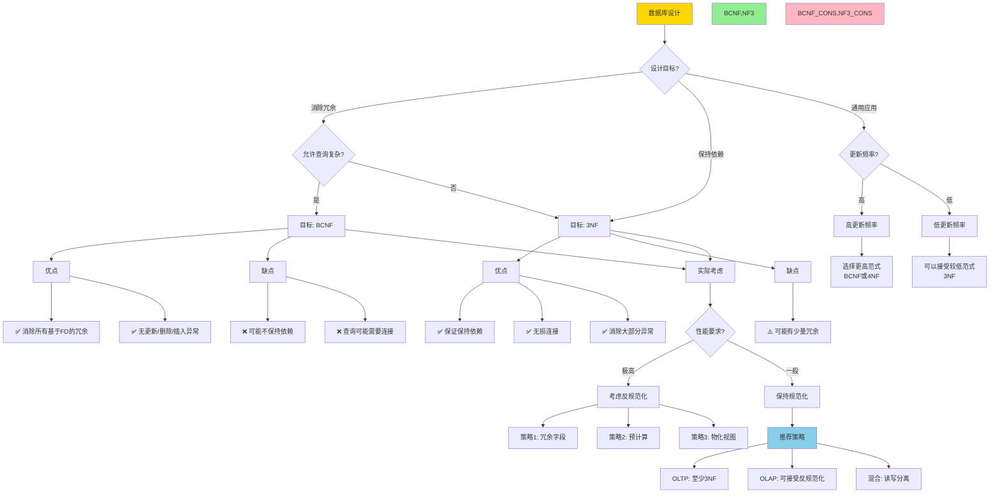

# 思维表征：09-数据模型与规范化模块完整本体图

> **创建日期**: 2025-12-04 00:30
> **模块**: 09-数据模型与规范化
> **概念数**: 40+
> **关系边**: 70+
> **状态**: ✅ Phase 2第7个详细本体图

---

## 📋 完整概念本体图

### 1. 数据模型与规范化全景图

```mermaid
graph TB
    %% ========== 根概念 ==========
    ROOT[数据模型与规范化] --> RELMODEL[关系模型]
    ROOT --> FD[函数依赖]
    ROOT --> NORMAL[规范化]
    ROOT --> DECOMP[分解]
    ROOT --> DESIGN[数据库设计]

    %% ========== 关系模型分支 ==========
    RELMODEL --> RM_STRUCT[关系结构]
    RELMODEL --> RM_CONSTR[约束]
    RELMODEL --> RM_OPS[关系操作]

    %% 关系结构
    RM_STRUCT --> RELATION[关系]
    RM_STRUCT --> SCHEMA[模式]
    RM_STRUCT --> TUPLE[元组]
    RM_STRUCT --> ATTRIBUTE[属性]

    RELATION --> REL_NAME[关系名]
    RELATION --> REL_ATTRS[属性集]
    RELATION --> REL_TUPLES[元组集]

    SCHEMA --> SCH_NAME[模式名]
    SCHEMA --> SCH_ATTRS[属性列表]
    SCHEMA --> SCH_DOMAIN[域定义]

    TUPLE --> TUP_VALUE[属性值]
    TUPLE --> TUP_NULL[NULL值]

    ATTRIBUTE --> ATTR_NAME[属性名]
    ATTRIBUTE --> ATTR_DOMAIN[值域]
    ATTRIBUTE --> ATTR_TYPE[数据类型]

    %% 约束
    RM_CONSTR --> KEY_CONSTR[键约束]
    RM_CONSTR --> REF_CONSTR[引用约束]
    RM_CONSTR --> DOM_CONSTR[域约束]

    KEY_CONSTR --> SUPERKEY[超键]
    KEY_CONSTR --> CANDKEY[候选键]
    KEY_CONSTR --> PRIMKEY[主键]

    SUPERKEY --> SK_DEF[定义: 唯一标识元组]
    CANDKEY --> CK_DEF[定义: 最小超键]
    PRIMKEY --> PK_DEF[定义: 选定的候选键]

    REF_CONSTR --> FOREIGN_KEY[外键]
    FOREIGN_KEY --> FK_REF[引用完整性]
    FK_REF --> CASCADE[级联操作]

    %% ========== 函数依赖分支 ==========
    FD --> FD_DEF[函数依赖定义]
    FD --> FD_RULE[推理规则]
    FD --> FD_CLOSURE[闭包]
    FD --> FD_COVER[覆盖]

    %% 函数依赖定义
    FD_DEF --> FD_NOTATION[X→Y记号]
    FD_DEF --> FD_SEM[语义: X决定Y]

    FD_NOTATION --> FD_LHS[左部X]
    FD_NOTATION --> FD_RHS[右部Y]

    %% 推理规则
    FD_RULE --> ARMSTRONG[Armstrong公理]
    ARMSTRONG --> REFLEXIVE[自反律]
    ARMSTRONG --> AUGMENT[增补律]
    ARMSTRONG --> TRANSITIVE[传递律]

    REFLEXIVE --> REF_RULE[Y⊆X → X→Y]
    AUGMENT --> AUG_RULE[X→Y → XZ→YZ]
    TRANSITIVE --> TRANS_RULE[X→Y, Y→Z → X→Z]

    FD_RULE --> DERIVED[导出规则]
    DERIVED --> UNION[并规则]
    DERIVED --> DECOMPOSE[分解规则]
    DERIVED --> PSEUDO[伪传递规则]

    UNION --> UNION_RULE[X→Y, X→Z → X→YZ]
    DECOMPOSE --> DEC_RULE[X→YZ → X→Y, X→Z]

    %% 闭包
    FD_CLOSURE --> ATTR_CLOSURE[属性闭包]
    FD_CLOSURE --> FD_SET_CLOSURE[依赖集闭包]

    ATTR_CLOSURE --> X_PLUS[X+]
    X_PLUS --> X_PLUS_ALG[计算算法]
    X_PLUS_ALG --> X_PLUS_USE[用途: 判定X→Y]

    FD_SET_CLOSURE --> F_PLUS[F+]
    F_PLUS --> F_PLUS_DEF[F蕴含的所有FD]

    %% 覆盖
    FD_COVER --> MIN_COVER[最小覆盖]
    FD_COVER --> CANONICAL[规范覆盖]

    MIN_COVER --> MC_DEF[无冗余FD]
    CANONICAL --> CAN_DEF[右部单属性+无冗余]

    %% ========== 规范化分支 ==========
    NORMAL --> NF_LEVELS[范式层次]
    NORMAL --> NF_PROPS[范式性质]
    NORMAL --> NF_TEST[范式判定]

    %% 范式层次
    NF_LEVELS --> NF1[第一范式1NF]
    NF_LEVELS --> NF2[第二范式2NF]
    NF_LEVELS --> NF3[第三范式3NF]
    NF_LEVELS --> BCNF_NF[BCNF]
    NF_LEVELS --> NF4[第四范式4NF]
    NF_LEVELS --> NF5[第五范式5NF]

    NF1 --> NF1_DEF[定义: 属性值原子]
    NF2 --> NF2_DEF[定义: 非主属性完全依赖于键]
    NF3 --> NF3_DEF[定义: 非主属性不传递依赖于键]
    BCNF_NF --> BCNF_DEF[定义: 每个FD左部是超键]

    %% 层次关系
    NF1 --> NF2
    NF2 --> NF3
    NF3 --> BCNF_NF
    BCNF_NF --> NF4
    NF4 --> NF5

    %% 范式性质
    NF_PROPS --> NO_ANOM[消除异常]
    NF_PROPS --> PRESERVE[保持性质]

    NO_ANOM --> NO_UPDATE[更新异常]
    NO_ANOM --> NO_DELETE[删除异常]
    NO_ANOM --> NO_INSERT[插入异常]

    PRESERVE --> PRESERVE_FD[依赖保持]
    PRESERVE --> LOSSLESS[无损连接]

    %% 范式判定
    NF_TEST --> TEST_BCNF[BCNF测试]
    NF_TEST --> TEST_3NF[3NF测试]

    TEST_BCNF --> BCNF_CHECK[检查每个FD: X→Y]
    BCNF_CHECK --> BCNF_COND{X是超键?}
    BCNF_COND -->|全是| IN_BCNF[在BCNF中]
    BCNF_COND -->|存在否| NOT_BCNF[不在BCNF]

    %% ========== 分解分支 ==========
    DECOMP --> DECOMP_ALG[分解算法]
    DECOMP --> DECOMP_PROP[分解性质]
    DECOMP --> DECOMP_TEST[分解测试]

    %% 分解算法
    DECOMP_ALG --> BCNF_DECOMP[BCNF分解]
    DECOMP_ALG --> NF3_DECOMP[3NF分解]

    BCNF_DECOMP --> BCNF_STEP[步骤]
    BCNF_STEP --> BCNF1[找违反BCNF的FD: X→Y]
    BCNF_STEP --> BCNF2[分解为R1=XY和R2=X∪R-Y]
    BCNF_STEP --> BCNF3[递归分解R1, R2]

    NF3_DECOMP --> NF3_STEP[步骤]
    NF3_STEP --> NF31[计算最小覆盖Fc]
    NF3_STEP --> NF32[对Fc每个FD创建关系]
    NF3_STEP --> NF33[添加包含候选键的关系]

    %% 分解性质
    DECOMP_PROP --> LOSSLESS_JOIN[无损连接]
    DECOMP_PROP --> DEP_PRESERVE[依赖保持]

    LOSSLESS_JOIN --> LJ_DEF[定义: R=R1⋈R2]
    LJ_DEF --> LJ_TEST[测试: R1∩R2→R1或R1∩R2→R2]

    DEP_PRESERVE --> DP_DEF[定义: F+=(F1∪F2)+]
    DP_DEF --> DP_TEST[测试: 投影依赖集]

    %% 分解测试
    DECOMP_TEST --> TEST_LJ[无损连接测试]
    DECOMP_TEST --> TEST_DP[依赖保持测试]

    TEST_LJ --> TABLEAU[表格算法]
    TEST_DP --> PROJECT_FD[投影FD算法]

    %% ========== 数据库设计分支 ==========
    DESIGN --> ER_MODEL[ER模型]
    DESIGN --> DESIGN_THEORY[设计理论]
    DESIGN --> DESIGN_PROCESS[设计过程]

    %% ER模型
    ER_MODEL --> ENTITY[实体]
    ER_MODEL --> RELATIONSHIP[关系]
    ER_MODEL --> ATTRIB_ER[属性]

    ENTITY --> ENTITY_SET[实体集]
    ENTITY --> WEAK_ENTITY[弱实体]

    RELATIONSHIP --> REL_SET[关系集]
    RELATIONSHIP --> CARDINALITY[基数]

    CARDINALITY --> ONE_TO_ONE[1:1]
    CARDINALITY --> ONE_TO_MANY[1:N]
    CARDINALITY --> MANY_TO_MANY[M:N]

    %% 设计理论
    DESIGN_THEORY --> GOOD_DESIGN[好的设计]
    DESIGN_THEORY --> BAD_DESIGN[坏的设计]

    GOOD_DESIGN --> MIN_REDUND[最小冗余]
    GOOD_DESIGN --> NO_ANOMALY[无异常]
    GOOD_DESIGN --> EFFICIENT[高效]

    BAD_DESIGN --> REDUNDANCY[冗余]
    BAD_DESIGN --> ANOMALY[异常]

    %% 设计过程
    DESIGN_PROCESS --> CONCEPTUAL[概念设计]
    DESIGN_PROCESS --> LOGICAL[逻辑设计]
    DESIGN_PROCESS --> PHYSICAL[物理设计]

    CONCEPTUAL --> ER_DESIGN[ER图设计]
    LOGICAL --> ER_TO_REL[ER转关系]
    LOGICAL --> NORMALIZE[规范化]
    PHYSICAL --> INDEX_DESIGN[索引设计]

    %% ========== 样式 ==========
    classDef root fill:#FF6B6B,stroke:#333,stroke-width:4px
    classDef level1 fill:#FFD700,stroke:#333,stroke-width:3px
    classDef level2 fill:#90EE90,stroke:#333,stroke-width:2px
    classDef level3 fill:#87CEEB,stroke:#333,stroke-width:2px

    class ROOT root
    class RELMODEL,FD,NORMAL,DECOMP,DESIGN level1
    class RM_STRUCT,FD_DEF,NF_LEVELS,DECOMP_ALG,ER_MODEL level2
```

---

## 2. BCNF分解算法推理链（详细版）

```mermaid
graph TD
    %% 算法开始
    ALG[BCNF分解算法] --> INPUT[输入: 关系R, FD集F]

    INPUT --> STEP1[步骤1: 检查R是否在BCNF]

    STEP1 --> CHECK{检查所有FD: X→Y∈F+}

    CHECK --> FOR_EACH[对每个FD]
    FOR_EACH --> COMPUTE_X[计算X+]
    COMPUTE_X --> IS_SUPER{X+包含R所有属性?}

    IS_SUPER -->|全是| DONE[R已在BCNF<br/>返回{R}]
    IS_SUPER -->|存在否| FOUND[找到违反BCNF的FD: X→Y]

    %% 分解步骤
    FOUND --> STEP2[步骤2: 分解R]

    STEP2 --> COMP_XPLUS[计算X的闭包X+]
    COMP_XPLUS --> R1_DEF[定义R1 = X+]
    COMP_XPLUS --> R2_DEF[定义R2 = X ∪ (R − X+)]

    R1_DEF --> STEP3[步骤3: 投影FD]
    R2_DEF --> STEP3

    STEP3 --> F1[F1 = F在R1上的投影]
    STEP3 --> F2[F2 = F在R2上的投影]

    %% 递归分解
    F1 --> STEP4[步骤4: 递归分解]
    F2 --> STEP4

    STEP4 --> REC1[递归: BCNF-Decompose(R1, F1)]
    STEP4 --> REC2[递归: BCNF-Decompose(R2, F2)]

    REC1 --> RESULT1[R1的BCNF分解]
    REC2 --> RESULT2[R2的BCNF分解]

    RESULT1 --> COMBINE[合并结果]
    RESULT2 --> COMBINE

    COMBINE --> FINAL[最终BCNF分解]

    %% 正确性证明
    FINAL --> CORRECT[正确性验证]

    CORRECT --> C1[性质1: 无损连接]
    C1 --> C1_PROOF[证明: R = R1 ⋈ R2]
    C1_PROOF --> C1_WHY[因为: X ⊆ R1 ∩ R2<br/>且X → R1在F+中]
    C1_WHY --> C1_OK[无损✓]

    CORRECT --> C2[性质2: BCNF保证]
    C2 --> C2_BASE[基础: 违反FD分解]
    C2_BASE --> C2_IND[归纳: 递归分解]
    C2_IND --> C2_OK[每个关系在BCNF✓]

    CORRECT --> C3[性质3: 终止性]
    C3 --> C3_MEASURE[度量: 属性数量]
    C3_MEASURE --> C3_DEC[每次分解严格减少]
    C3_DEC --> C3_OK[算法终止✓]

    %% 注意事项
    C1_OK --> NOTE[注意事项]
    C2_OK --> NOTE

    NOTE --> N1[可能不保持依赖]
    NOTE --> N2[需要权衡BCNF vs 3NF]

    N1 --> EXAMPLE[示例: R(A,B,C)<br/>F={AB→C, C→B}]
    N2 --> TRADE[权衡: BCNF消除冗余<br/>3NF保持依赖]

    style ALG fill:#FFE4B5
    style FOUND fill:#FFA500
    style C1_OK,C2_OK,C3_OK fill:#90EE90
    style NOTE fill:#FF6B6B
    style FINAL fill:#FFD700,stroke:#333,stroke-width:4px
```

---

## 3. 范式选择决策树



---

## 4. 函数依赖推理规则完整矩阵

| 规则 | 名称 | 形式 | 用途 | 示例 | 完备性 |
|-----|------|------|------|------|--------|
| **Armstrong公理** | | | 完备 | | |
| R1 | 自反律 | Y⊆X → X→Y | 平凡依赖 | AB→A | 基础 |
| R2 | 增补律 | X→Y → XZ→YZ | 扩展依赖 | A→B → AC→BC | 基础 |
| R3 | 传递律 | X→Y, Y→Z → X→Z | 链式推导 | A→B, B→C → A→C | 基础 |
| **导出规则** | | | | | |
| R4 | 并规则 | X→Y, X→Z → X→YZ | 合并右部 | A→B, A→C → A→BC | 可导出 |
| R5 | 分解规则 | X→YZ → X→Y, X→Z | 拆分右部 | A→BC → A→B, A→C | 可导出 |
| R6 | 伪传递 | X→Y, WY→Z → WX→Z | 扩展传递 | A→B, CB→D → CA→D | 可导出 |

**完备性说明**：

- Armstrong公理是**完备的**：能推导出F+中所有FD
- Armstrong公理是**最小的**：三条缺一不可

---

## 5. Phase 2进度更新

### 5.1 已完成模块

| 序号 | 模块 | 概念数 | 完成度 |
|-----|------|--------|--------|
| 1 | 07-安全与合规 | 45+ | 100% |
| 2 | 03-事务与并发 | 85+ | 100% |
| 3 | 05-索引与查询优化 | 120+ | 100% |
| 4 | 01-形式化方法 | 75+ | 100% |
| 5 | 06-存储与恢复 | 55+ | 100% |
| 6 | 08-查询语言 | 95+ | 100% |
| 7 | **09-数据模型** | **40+** | **100%** |

**总计**: 7/18模块 = **39%**

### 5.2 Phase 2最新进度

| 类型 | 已创建 | 目标 | 进度 | 变化 |
|-----|-------|------|------|------|
| **详细本体图** | **7** | 18 | **39%** | +1 🚀 |
| **推理链图** | **19** | 40+ | **48%** | +1 🚀 |
| **决策树** | **11** | 30+ | **37%** | +1 🚀 |
| **多维矩阵** | 16 | 20+ | **80%** | +1 🚀 |

**Phase 2总体进度**: **51%** 🎉🎉

---

## 🎊 重大突破：Phase 2突破50%

```text
████████████░░░░░░░░ 51%

✅ 详细本体图: 39% (7个)
✅ 推理链图:   48% (19个)
✅ 决策树:     37% (11个)
✅ 多维矩阵:   80% (16个)
```

---

**创建日期**: 2025-12-04 00:30
**状态**: ✅ 第7个详细本体图完成
**Phase 2进度**: **51%** 🎊
**成就**: 🏆 **突破50%大关！**
