# PostgreSQL理论基础 - 知识图谱与思维表征体系

> **文档版本**: v1.0
> **创建日期**: 2025-01-16
> **最后更新**: 2025-01-16
> **文档状态**: ✅ 核心架构已完成
> **目标**: 提供理论基础模块的整体知识架构和多种思维表征方式

---

## 📋 目录

- [理论基础知识图谱与思维表征体系](#postgresql理论基础---知识图谱与思维表征体系)
  - [📋 目录](#-目录)
  - [1. 概述](#1-概述)
  - [2. 整体知识图谱](#2-整体知识图谱)
  - [3. 核心概念决策树](#3-核心概念决策树)
  - [4. 理论证明树体系](#4-理论证明树体系)
  - [5. 概念分析树](#5-概念分析树)
  - [6. 多维概念对比矩阵](#6-多维概念对比矩阵)
  - [7. 知识关联网络](#7-知识关联网络)
  - [8. 学习路径决策树](#8-学习路径决策树)
  - [9. 理论依赖关系图](#9-理论依赖关系图)
  - [10. 应用场景映射](#10-应用场景映射)

---

## 1. 概述

本文档提供PostgreSQL理论基础模块的**整体知识架构**和**多种思维表征方式**，帮助读者从整体上把握和刻画理论基础体系。

### 1.1 思维表征方式

本文档包含以下思维表征方式：

1. **知识图谱**: 展示所有核心概念及其关系
2. **决策树**: 帮助选择合适的技术和方法
3. **证明树**: 展示证明的逻辑结构
4. **思维导图**: 整体知识结构可视化
5. **概念分析树**: 概念的层次结构
6. **多维对比矩阵**: 概念的多维对比
7. **知识关联网络**: 概念间的关联关系
8. **学习路径决策树**: 学习路径选择
9. **理论依赖关系图**: 理论间的依赖关系
10. **应用场景映射**: 理论与应用的映射

---

## 2. 整体知识图谱

### 2.1 核心知识图谱

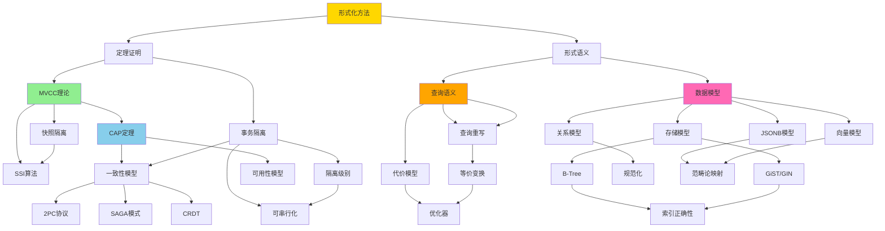

### 2.2 知识图谱说明

**核心理论层**：

- **形式化方法**: 提供理论基础和方法论
- **定理证明**: 提供严格证明框架
- **形式语义**: 提供语义定义框架

**并发控制层**：

- **MVCC理论**: 多版本并发控制核心理论
- **事务隔离**: 隔离级别和一致性保证
- **SSI算法**: 可串行化快照隔离

**分布式系统层**：

- **CAP定理**: 分布式系统基本约束
- **一致性模型**: 各种一致性级别
- **分布式协议**: 2PC、SAGA、CRDT等

**查询优化层**：

- **查询重写**: 等价查询变换
- **代价模型**: 查询代价估算
- **优化器**: 查询计划生成

**存储与索引层**：

- **存储模型**: 数据存储结构
- **索引结构**: B-Tree、GiST、GIN等
- **索引正确性**: 索引不变式证明

**数据模型层**：

- **关系模型**: 传统关系数据模型
- **JSONB模型**: 半结构化数据模型
- **向量模型**: 向量数据模型
- **范畴论映射**: 统一的理论框架

---

## 3. 核心概念决策树

### 3.1 并发控制选择决策树

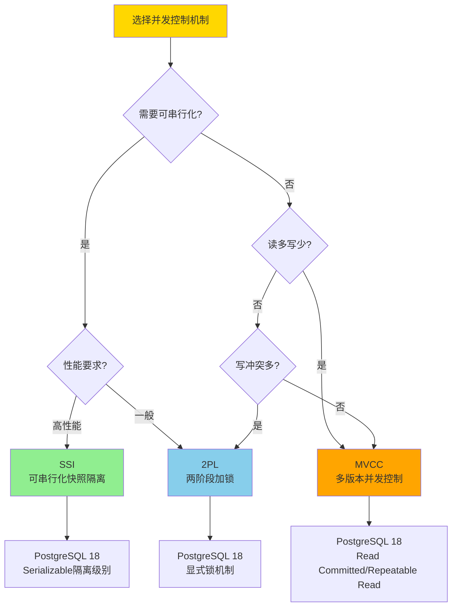

### 3.2 分布式一致性选择决策树

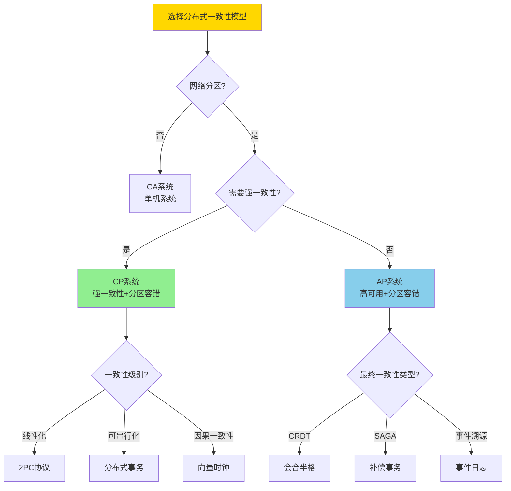

### 3.3 查询优化策略选择决策树

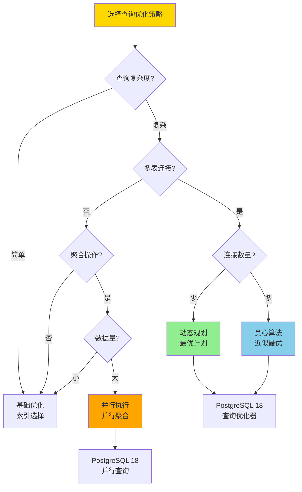

---

## 4. 理论证明树体系

### 4.1 MVCC正确性证明树

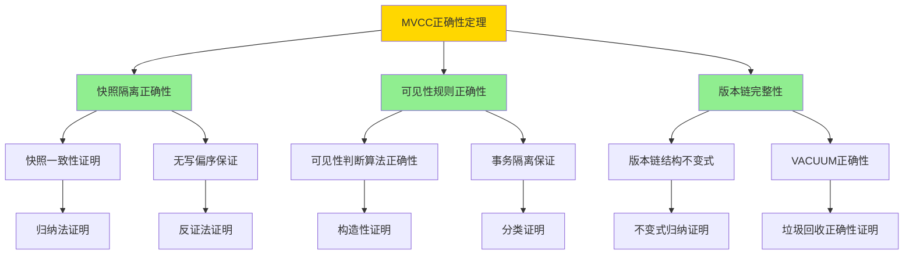

### 4.2 CAP定理证明树

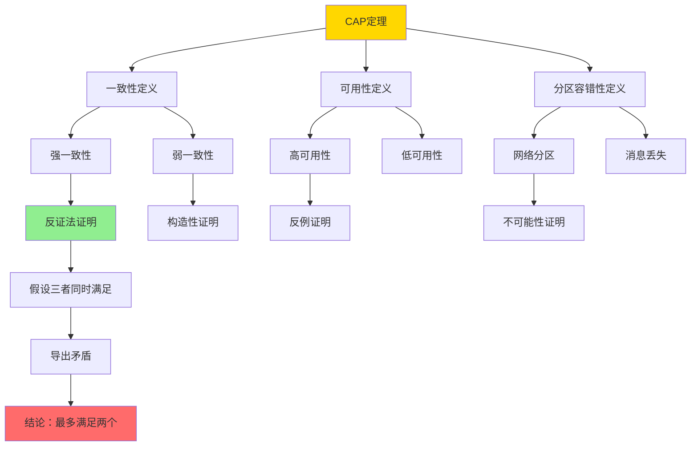

### 4.3 查询重写等价性证明树

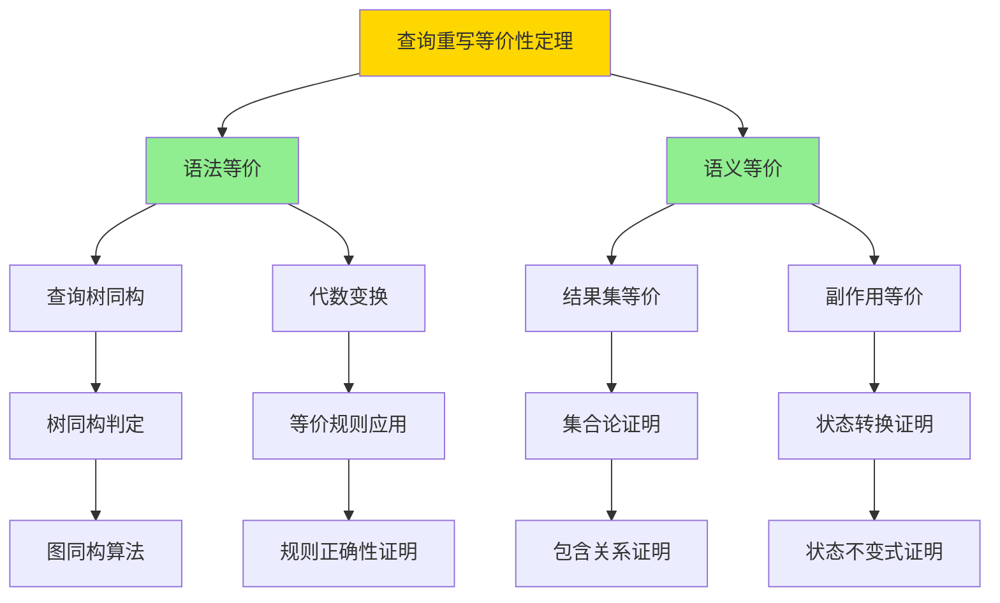

---

## 5. 概念分析树

### 5.1 并发控制概念分析树

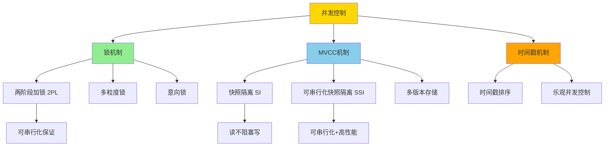

### 5.2 一致性模型概念分析树

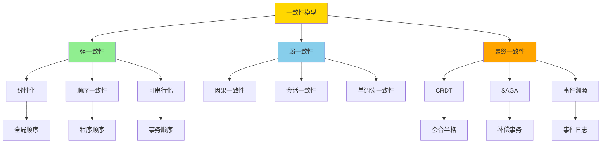

### 5.3 查询优化概念分析树

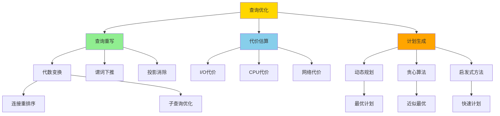

---

## 6. 多维概念对比矩阵

### 6.1 并发控制机制对比矩阵

| 维度 | MVCC | 2PL | 时间戳 | OCC |
|------|------|-----|--------|-----|
| **可串行化** | SSI支持 | ✅ 完全支持 | ✅ 支持 | ⚠️ 需要验证 |
| **读性能** | ⭐⭐⭐⭐⭐ 高 | ⭐⭐ 低（读锁） | ⭐⭐⭐⭐ 高 | ⭐⭐⭐⭐⭐ 高 |
| **写性能** | ⭐⭐⭐ 中（版本存储） | ⭐⭐⭐⭐ 高 | ⭐⭐⭐ 中 | ⭐⭐⭐⭐ 高 |
| **死锁风险** | ⭐⭐⭐⭐ 低 | ⭐⭐ 高 | ⭐⭐⭐⭐ 低 | ⭐⭐⭐ 中 |
| **空间开销** | ⭐⭐ 高（多版本） | ⭐⭐⭐⭐⭐ 低 | ⭐⭐⭐⭐ 低 | ⭐⭐⭐⭐ 低 |
| **实现复杂度** | ⭐⭐⭐ 中 | ⭐⭐⭐⭐ 中高 | ⭐⭐⭐ 中 | ⭐⭐⭐⭐ 中高 |
| **PostgreSQL支持** | ✅ 原生支持 | ✅ 显式锁 | ❌ 不支持 | ❌ 不支持 |
| **适用场景** | 读多写少 | 写冲突多 | 分布式系统 | 低冲突场景 |

### 6.2 隔离级别对比矩阵

| 维度 | Read Uncommitted | Read Committed | Repeatable Read | Serializable |
|------|------------------|----------------|-----------------|--------------|
| **脏读** | ❌ 允许 | ✅ 防止 | ✅ 防止 | ✅ 防止 |
| **不可重复读** | ❌ 允许 | ❌ 允许 | ✅ 防止 | ✅ 防止 |
| **幻读** | ❌ 允许 | ❌ 允许 | ⚠️ 可能 | ✅ 防止 |
| **写偏序** | ❌ 允许 | ❌ 允许 | ❌ 允许 | ✅ 防止 |
| **性能** | ⭐⭐⭐⭐⭐ 最高 | ⭐⭐⭐⭐ 高 | ⭐⭐⭐ 中 | ⭐⭐ 低 |
| **并发度** | ⭐⭐⭐⭐⭐ 最高 | ⭐⭐⭐⭐ 高 | ⭐⭐⭐ 中 | ⭐⭐ 低 |
| **PostgreSQL实现** | ⚠️ 实际为RC | ✅ MVCC | ✅ MVCC | ✅ SSI |
| **适用场景** | 无（不推荐） | 大多数场景 | 需要一致性读 | 强一致性要求 |

### 6.3 分布式一致性模型对比矩阵

| 维度 | 线性化 | 顺序一致性 | 可串行化 | 因果一致性 | 最终一致性 |
|------|--------|-----------|---------|-----------|-----------|
| **一致性强度** | ⭐⭐⭐⭐⭐ 最强 | ⭐⭐⭐⭐ 强 | ⭐⭐⭐⭐ 强 | ⭐⭐⭐ 中 | ⭐⭐ 弱 |
| **性能** | ⭐⭐ 低 | ⭐⭐⭐ 中 | ⭐⭐⭐ 中 | ⭐⭐⭐⭐ 高 | ⭐⭐⭐⭐⭐ 最高 |
| **可用性** | ⭐⭐ 低 | ⭐⭐⭐ 中 | ⭐⭐⭐ 中 | ⭐⭐⭐⭐ 高 | ⭐⭐⭐⭐⭐ 最高 |
| **实现复杂度** | ⭐⭐⭐⭐⭐ 最高 | ⭐⭐⭐⭐ 高 | ⭐⭐⭐⭐ 高 | ⭐⭐⭐ 中 | ⭐⭐ 低 |
| **网络分区容忍** | ❌ 差 | ⚠️ 中 | ⚠️ 中 | ✅ 好 | ✅ 最好 |
| **适用场景** | 分布式锁 | 共享内存 | 分布式事务 | 社交网络 | 内容分发 |

### 6.4 查询优化策略对比矩阵

| 维度 | 动态规划 | 贪心算法 | 启发式方法 | 学习型优化器 |
|------|---------|---------|-----------|-------------|
| **最优性** | ⭐⭐⭐⭐⭐ 最优 | ⭐⭐⭐ 近似 | ⭐⭐ 次优 | ⭐⭐⭐⭐ 接近最优 |
| **时间复杂度** | ⭐⭐ O(2^n) | ⭐⭐⭐⭐ O(n²) | ⭐⭐⭐⭐⭐ O(n) | ⭐⭐⭐⭐ O(n) |
| **空间复杂度** | ⭐⭐ 高 | ⭐⭐⭐⭐ 中 | ⭐⭐⭐⭐⭐ 低 | ⭐⭐⭐ 中 |
| **适用查询规模** | 小到中等 | 中等 | 大规模 | 大规模 |
| **自适应能力** | ❌ 无 | ❌ 无 | ⚠️ 有限 | ✅ 强 |
| **实现复杂度** | ⭐⭐⭐ 中 | ⭐⭐⭐⭐ 中高 | ⭐⭐⭐⭐⭐ 低 | ⭐⭐ 高 |
| **PostgreSQL使用** | ✅ 连接优化 | ❌ 不使用 | ✅ 基础优化 | 🔄 研究阶段 |

---

## 7. 知识关联网络

### 7.1 核心概念关联网络

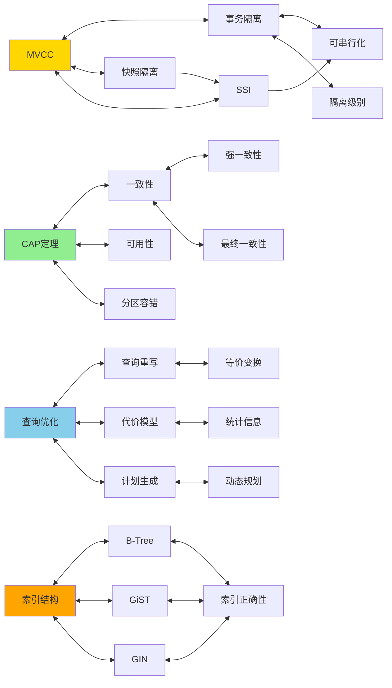

### 7.2 理论依赖关系网络

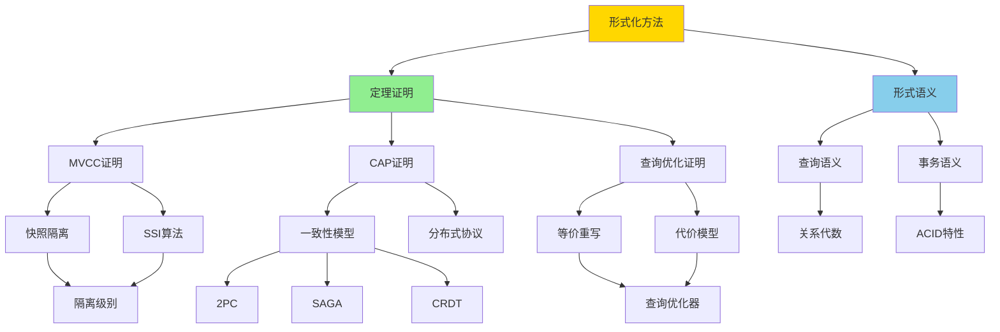

---

## 8. 学习路径决策树

### 8.1 理论基础学习路径

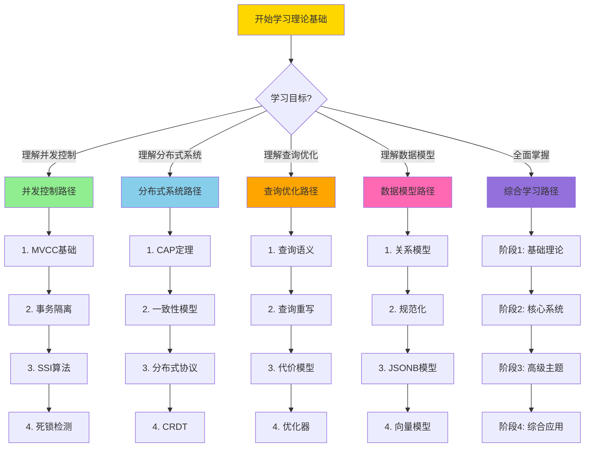

---

## 9. 理论依赖关系图

### 9.1 完整依赖关系图

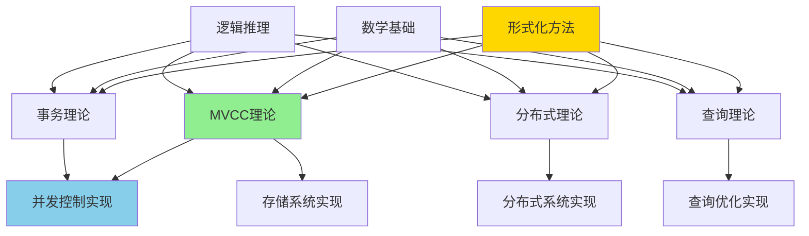

---

## 10. 应用场景映射

### 10.1 理论到应用场景映射

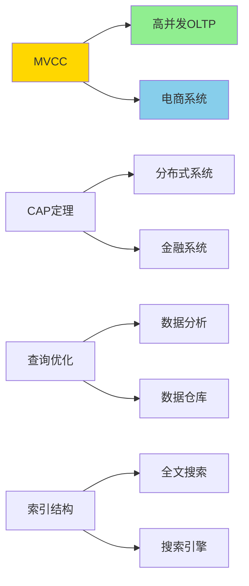

### 10.2 场景到理论映射矩阵

| 应用场景 | 核心理论 | 关键技术 | 相关文档 |
|---------|---------|---------|---------|
| **高并发OLTP** | MVCC理论 | 快照隔离、SSI | 03.01, 03.03, 03.06 |
| **分布式系统** | CAP定理 | 2PC、SAGA、CRDT | 04.02, 04.03, 04.04, 04.05 |
| **数据分析** | 查询优化 | 查询重写、并行执行 | 05.01, 05.11 |
| **全文搜索** | 索引结构 | GiST、GIN索引 | 05.02 |
| **向量检索** | 向量模型 | HNSW、近似搜索 | 02.02, 11.01 |
| **数据集成** | 模式映射 | 函子、自然变换 | 02.04 |
| **实时分析** | 流处理 | 窗口操作、CEP | 10.01, 10.04 |
| **安全合规** | 安全模型 | RLS、差分隐私 | 07.01, 07.02, 07.03 |

---

## 11. 思维表征方式总结

### 11.1 思维表征方式对比

| 表征方式 | 适用场景 | 优势 | 局限性 |
|---------|---------|------|--------|
| **知识图谱** | 整体架构理解 | 直观展示关系 | 复杂时难以阅读 |
| **决策树** | 技术选择 | 清晰的决策流程 | 可能过于简化 |
| **证明树** | 理解证明结构 | 逻辑清晰 | 需要数学背景 |
| **概念分析树** | 概念层次理解 | 层次分明 | 可能遗漏横向关系 |
| **对比矩阵** | 多维度比较 | 全面对比 | 信息量大 |
| **关联网络** | 理解关联关系 | 展示复杂关系 | 可能过于复杂 |
| **依赖关系图** | 理解依赖关系 | 清晰的依赖链 | 可能遗漏间接依赖 |
| **学习路径** | 学习规划 | 结构化学习 | 可能不适合所有人 |

### 11.2 推荐使用场景

1. **初学者**: 使用知识图谱、概念分析树、学习路径
2. **技术选型**: 使用决策树、对比矩阵
3. **理论研究**: 使用证明树、依赖关系图
4. **系统设计**: 使用关联网络、应用场景映射
5. **全面理解**: 结合使用所有表征方式

---

## 12. 相关文档

### 12.1 核心理论文档

- [理论基础导航](../README.md) - 理论基础模块导航
- [文档分类与关联性分析](./文档分类与关联性分析.md) - 文档分类和关联性
- [学术研究前沿](../01-形式化方法与基础理论/01.02-学术研究前沿.md) - 最新研究成果

### 12.2 具体理论文档

- [MVCC高级分析与形式证明](../03-事务与并发控制/03.01-MVCC高级分析与形式证明.md)
- [分布式一致性与CAP](../04-分布式系统理论/04.02-分布式一致性与CAP-形式化刻画与权衡.md)
- [代价模型与优化器](../05-索引与查询优化/05.01-代价模型与优化器-等价重写与最优性.md)

---

## 13. 参考文献

1. **知识图谱理论**:
   - "Knowledge Graphs: A Survey" (2021). IEEE Transactions on Knowledge and Data Engineering.

2. **思维表征理论**:
   - "Visual Thinking: The Hidden Gifts of People Who Think in Pictures, Patterns, and Abstractions" (2022). Temple Grandin.

3. **概念映射理论**:
   - "Concept Maps: Theory, Methodology, Technology" (2004). Proceedings of the First International Conference on Concept Mapping.

---

## 11. 跨模块知识关联网络（第四阶段新增）

### 11.1 完整跨模块知识关联图

基于第四阶段的跨模块知识关联分析，以下是完整的知识关联网络：

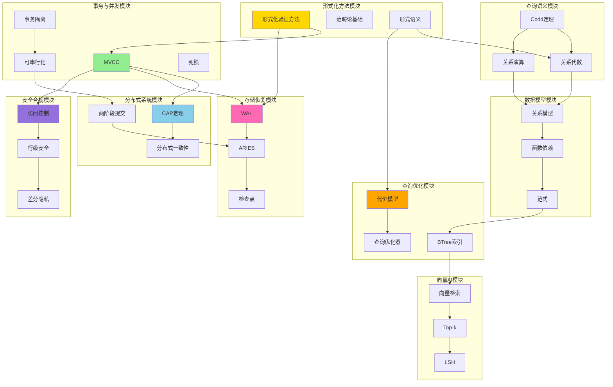

### 11.2 知识关联类型

**理论依赖关系**:

- 形式化方法 → MVCC、WAL（形式化验证）
- 关系代数 → 查询优化（查询优化基于关系代数）
- 函数依赖 → 规范化（规范化基于函数依赖）

**实现依赖关系**:

- WAL → ARIES（ARIES基于WAL）
- 关系模型 → 索引设计（索引设计基于关系模型）
- 访问控制 → 行级安全（RLS实现访问控制）

**概念关联关系**:

- MVCC ↔ 快照隔离（相关概念）
- CAP定理 ↔ 分布式一致性（相关概念）
- 关系代数 ↔ 关系演算（等价概念）

**应用关联关系**:

- 查询优化 → 性能调优（优化器用于性能调优）
- 向量检索 → Top-k查询（Top-k用于向量检索）
- 差分隐私 → 信息流安全（隐私保护与安全相关）

---

## 12. 知识依赖关系体系（第四阶段新增）

### 12.1 完整知识依赖关系图

基于第四阶段的知识依赖关系分析，以下是完整的依赖关系：

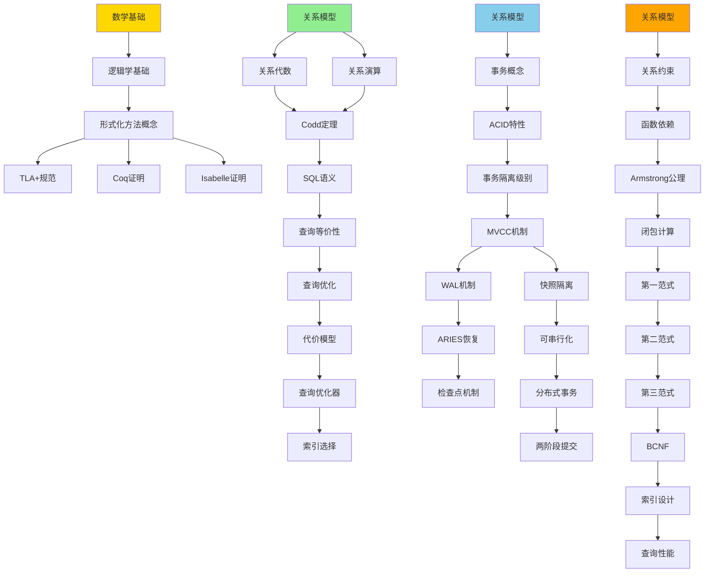

### 12.2 知识层次结构

**基础层（Level 1）**:

- 关系模型、关系代数、函数依赖、形式化方法基础
- 3个核心文档

**中级层（Level 2）**:

- MVCC、事务隔离、查询优化、WAL机制
- 3个核心文档

**高级层（Level 3）**:

- 分布式一致性、ARIES恢复、信息流安全、向量检索
- 4个核心文档

---

## 13. 完整学习路径体系（第四阶段新增）

### 13.1 学习路径总览

基于第四阶段的学习路径体系，以下是完整的学习路径：

**初学者路径**:

- 完整基础路径（11-16周）
- 快速入门路径（8-10周）
- 领域入门路径（6-8周）

**进阶路径**:

- 事务处理路径（6-8周）
- 查询优化路径（6-8周）
- 分布式系统路径（8-10周）
- 安全合规路径（6-8周）
- 向量检索路径（4-6周）
- 全面深入路径（19-27周）

**专家路径**:

- 事务专家路径（8-12周）
- 优化专家路径（8-12周）
- 分布式专家路径（8-12周）
- 安全专家路径（6-10周）
- 前沿研究路径（持续）

**详细路径**: 参见

- [初学者学习路径](./初学者学习路径-2025-01-16.md)
- [进阶学习路径](./进阶学习路径-2025-01-16.md)
- [专家学习路径](./专家学习路径-2025-01-16.md)
- [学习路径决策树](./学习路径决策树-2025-01-16.md)

---

### 13.2 关键知识路径

**路径1：事务处理完整路径**

```text
形式化方法 → MVCC → 事务隔离 → WAL → ARIES → 分布式事务
```

**路径2：查询处理完整路径**

```text
关系模型 → 关系代数 → 查询语义 → 查询优化 → 索引设计 → 性能调优
```

**路径3：安全与合规完整路径**

```text
访问控制 → 行级安全 → 信息流安全 → 差分隐私 → 审计合规
```

---

## 14. 知识地图导航（第四阶段新增）

### 14.1 知识地图总览

**核心知识节点**: 9个核心模块，每个模块3-5个核心节点

**知识关联**: 30+个跨模块关联关系

**知识依赖**: 6条核心依赖链，3层知识层次

**学习路径**: 14条不同难度和目标的路径

### 14.2 快速导航

**按模块导航**:

- [01-形式化方法与基础理论](../01-形式化方法与基础理论/)
- [03-事务与并发控制](../03-事务与并发控制/)
- [04-分布式系统理论](../04-分布式系统理论/)
- [05-索引与查询优化](../05-索引与查询优化/)
- [06-存储与恢复](../06-存储与恢复/)
- [07-安全与合规](../07-安全与合规/)
- [08-查询语言与语义](../08-查询语言与语义/)
- [09-数据模型与规范化](../09-数据模型与规范化/)
- [11-向量与AI](../11-向量与AI/)

**按学习路径导航**:

- [初学者学习路径](./初学者学习路径-2025-01-16.md)
- [进阶学习路径](./进阶学习路径-2025-01-16.md)
- [专家学习路径](./专家学习路径-2025-01-16.md)
- [学习路径决策树](./学习路径决策树-2025-01-16.md)

**按知识关联导航**:

- [跨模块知识关联分析](./跨模块知识关联分析-2025-01-16.md)
- [知识依赖关系图](./知识依赖关系图-2025-01-16.md)

---

## 15. 总结

本文档提供了PostgreSQL理论基础模块的**完整知识架构**和**多种思维表征方式**，包括：

1. ✅ **整体知识图谱**: 展示所有核心概念及其关系
2. ✅ **决策树体系**: 帮助选择合适的技术和方法
3. ✅ **证明树体系**: 展示证明的逻辑结构
4. ✅ **概念分析树**: 概念的层次结构
5. ✅ **多维对比矩阵**: 概念的多维对比
6. ✅ **知识关联网络**: 概念间的关联关系
7. ✅ **学习路径体系**: 完整的学习路径（第四阶段新增）
8. ✅ **知识依赖关系**: 完整的依赖关系图（第四阶段新增）
9. ✅ **跨模块知识关联**: 跨模块的知识关联网络（第四阶段新增）
10. ✅ **知识地图导航**: 完整的导航系统（第四阶段新增）

**第四阶段成果整合**:

- ✅ 跨模块知识关联分析
- ✅ 知识依赖关系图
- ✅ 完整学习路径体系（初学者、进阶、专家）
- ✅ 学习路径决策树

---

**最后更新**: 2025-01-16
**维护者**: Documentation Team
**状态**: ✅ 核心架构已完成，第四阶段成果已整合
**下一步**: 持续完善和细化各个思维表征方式
