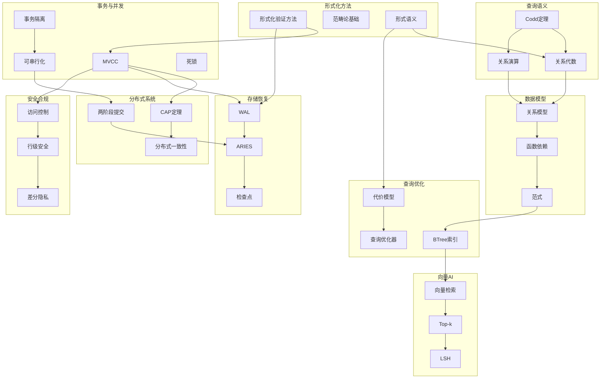

# 跨模块知识关联分析

> **创建日期**: 2025-01-16
> **状态**: 🚧 进行中
> **目标**: 建立完整的跨模块知识关联网络

---

## 📊 核心知识节点识别

### 1. 形式化方法与基础理论模块

**核心节点**:

- 形式化验证方法（TLA+、Coq、Isabelle、Alloy）
- 范畴论基础
- 查询语言的形式语义
- 学术研究前沿

**关联模块**:

- → 03-事务与并发控制（MVCC形式化验证）
- → 06-存储与恢复（TLA+与WAL）
- → 08-查询语言与语义（形式语义）

---

### 2. 事务与并发控制模块

**核心节点**:

- MVCC（多版本并发控制）
- 事务隔离级别
- 可串行化
- 死锁检测与避免
- 两阶段加锁

**关联模块**:

- ← 01-形式化方法与基础理论（形式化验证）
- → 04-分布式系统理论（分布式事务）
- → 06-存储与恢复（WAL、ARIES）
- → 07-安全与合规（并发安全）

---

### 3. 分布式系统理论模块

**核心节点**:

- CAP定理
- 分布式一致性
- 两阶段提交
- SAGA模式
- CRDT

**关联模块**:

- ← 03-事务与并发控制（分布式事务）
- → 06-存储与恢复（分布式恢复）
- → 07-安全与合规（分布式安全）

---

### 4. 索引与查询优化模块

**核心节点**:

- 代价模型
- 查询优化器
- BTree索引
- 物化视图
- 查询重写

**关联模块**:

- ← 08-查询语言与语义（查询语义）
- → 09-数据模型与规范化（索引设计）
- → 11-向量与AI（向量索引）

---

### 5. 存储与恢复模块

**核心节点**:

- WAL（预写日志）
- ARIES恢复算法
- 检查点机制
- 压缩与编码
- 缓存策略

**关联模块**:

- ← 01-形式化方法与基础理论（TLA+规范）
- ← 03-事务与并发控制（事务恢复）
- → 06-存储与恢复（备份与恢复）

---

### 6. 安全与合规模块

**核心节点**:

- 访问控制（RBAC、MAC）
- 行级安全（RLS）
- 差分隐私
- 信息流安全
- 审计与合规

**关联模块**:

- ← 03-事务与并发控制（并发安全）
- ← 04-分布式系统理论（分布式安全）
- → 07-安全与合规（审计）

---

### 7. 查询语言与语义模块

**核心节点**:

- 关系代数
- 关系演算
- Codd定理
- SQL语义
- 查询等价性

**关联模块**:

- ← 01-形式化方法与基础理论（形式语义）
- → 05-索引与查询优化（查询优化）
- → 09-数据模型与规范化（关系模型）

---

### 8. 数据模型与规范化模块

**核心节点**:

- 关系模型
- 函数依赖
- 范式（1NF、2NF、3NF、BCNF）
- 规范化算法

**关联模块**:

- ← 08-查询语言与语义（关系模型）
- → 05-索引与查询优化（索引设计）

---

### 9. 向量与AI模块

**核心节点**:

- 向量检索
- Top-k查询
- 最近邻搜索
- LSH（局部敏感哈希）
- 向量空间模型

**关联模块**:

- ← 05-索引与查询优化（向量索引）
- ← 08-查询语言与语义（查询语义）

---

## 🔗 跨模块知识关联图



---

## 📈 知识依赖关系

### 基础层（Level 1）

**前置知识**: 无

**核心概念**:

- 关系模型
- 关系代数
- 函数依赖
- 形式化方法基础

**文档**:

- 08.02-关系代数与关系演算
- 09.01-关系约束与规范化
- 01.01-形式化验证方法

---

### 中级层（Level 2）

**前置知识**: 基础层

**核心概念**:

- MVCC
- 事务隔离
- 查询优化
- WAL机制

**文档**:

- 03.01-MVCC高级分析与形式证明
- 05.01-代价模型与优化器
- 06.01-TLA+-事务与WAL

---

### 高级层（Level 3）

**前置知识**: 中级层

**核心概念**:

- 分布式一致性
- ARIES恢复
- 信息流安全
- 向量检索

**文档**:

- 04.02-分布式一致性与CAP
- 06.03-ARIES日志恢复
- 07.04-数据库安全模型
- 11.01-向量检索与Top-k

---

## 🔄 知识关联类型

### 1. 理论依赖关系

**类型**: 前置知识依赖

**示例**:

- 关系代数 → 查询优化（查询优化基于关系代数）
- 函数依赖 → 规范化（规范化基于函数依赖）
- 形式化方法 → MVCC验证（MVCC验证使用形式化方法）

---

### 2. 实现依赖关系

**类型**: 技术实现依赖

**示例**:

- WAL → ARIES（ARIES基于WAL）
- 关系模型 → 索引设计（索引设计基于关系模型）
- 访问控制 → 行级安全（RLS实现访问控制）

---

### 3. 概念关联关系

**类型**: 概念相似或互补

**示例**:

- MVCC ↔ 快照隔离（相关概念）
- CAP定理 ↔ 分布式一致性（相关概念）
- 关系代数 ↔ 关系演算（等价概念）

---

### 4. 应用关联关系

**类型**: 实际应用中的关联

**示例**:

- 查询优化 → 性能调优（优化器用于性能调优）
- 向量检索 → Top-k查询（Top-k用于向量检索）
- 差分隐私 → 信息流安全（隐私保护与安全相关）

---

## 📊 关联统计

### 模块关联度

| 模块 | 关联模块数 | 主要关联 |
|------|-----------|---------|
| **03-事务与并发控制** | 5 | 形式化方法、分布式、存储、安全、查询 |
| **05-索引与查询优化** | 4 | 查询语义、数据模型、向量、存储 |
| **06-存储与恢复** | 4 | 形式化方法、事务、分布式、安全 |
| **07-安全与合规** | 3 | 事务、分布式、查询 |
| **08-查询语言与语义** | 4 | 形式化方法、查询优化、数据模型、向量 |
| **09-数据模型与规范化** | 3 | 查询语义、查询优化、索引 |
| **11-向量与AI** | 2 | 查询优化、查询语义 |

---

## 🎯 关键知识路径

### 路径1：事务处理完整路径

```text
形式化方法 → MVCC → 事务隔离 → WAL → ARIES → 分布式事务
```

**学习顺序**:

1. 01.01-形式化验证方法
2. 03.01-MVCC高级分析与形式证明
3. 03.03-事务隔离与MVCC
4. 06.01-TLA+-事务与WAL
5. 06.03-ARIES日志恢复
6. 04.03-两阶段提交

---

### 路径2：查询处理完整路径

```text
关系模型 → 关系代数 → 查询语义 → 查询优化 → 索引设计 → 性能调优
```

**学习顺序**:

1. 09.01-关系约束与规范化
2. 08.02-关系代数与关系演算
3. 01.06-查询语言的形式语义
4. 05.01-代价模型与优化器
5. 05.02-索引结构正确性
6. 05.15-数据库性能调优

---

### 路径3：安全与合规完整路径

```text
访问控制 → 行级安全 → 信息流安全 → 差分隐私 → 审计合规
```

**学习顺序**:

1. 07.04-数据库安全模型
2. 07.03-行级安全-RLS
3. 07.01-安全策略与非干扰
4. 07.02-差分隐私
5. 07.05-数据库审计与合规

---

## 📝 下一步工作

1. **完善知识关联图**
   - 添加更多关联关系
   - 完善关联类型标注
   - 创建交互式知识地图

2. **建立知识依赖关系图**
   - 详细的前置知识依赖
   - 学习顺序建议
   - 知识难度标注

3. **创建学习路径文档**
   - 多个学习路径
   - 学习检查点
   - 学习时间估计

---

**最后更新**: 2025-01-16
**维护者**: Documentation Team
**状态**: 🚧 进行中
