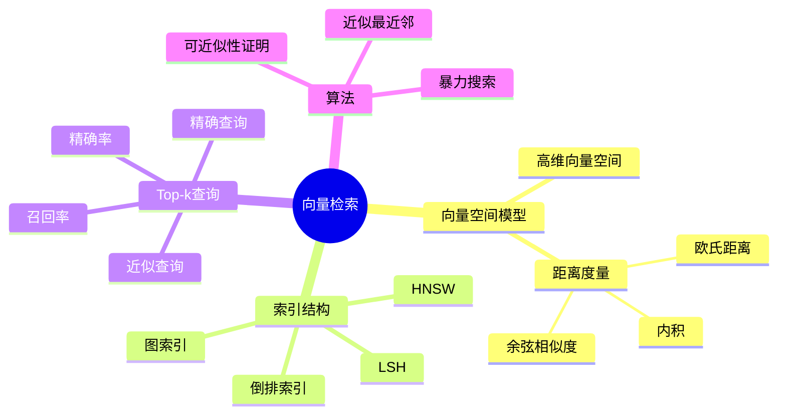
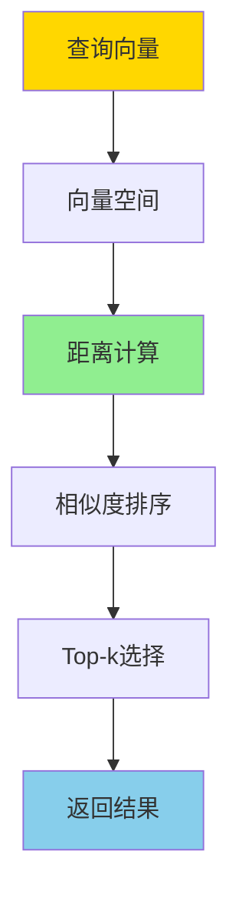
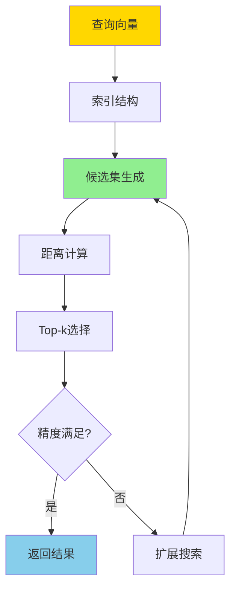
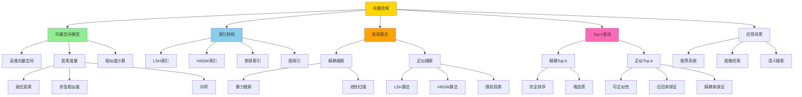

# 向量检索与Top-k-数学模型与可近似性证明

> **文档版本**: v1.0
> **最后更新**: 2025-01-16
> **版本覆盖**: PostgreSQL 18.x (推荐) ⭐ | 17.x (推荐) | 16.x (兼容)
> **文档状态**: ✅ 内容已完成

---

## 📋 目录

- [向量检索与Top-k-数学模型与可近似性证明](#向量检索与top-k-数学模型与可近似性证明)
  - [📋 目录](#-目录)
  - [1. 概述](#1-概述)
    - [1.0 向量检索工作原理概述](#10-向量检索工作原理概述)
    - [1.1 本文档的范围](#11-本文档的范围)
  - [2. 核心内容](#2-核心内容)
    - [2.1 向量空间模型](#21-向量空间模型)
    - [2.2 Top-k查询](#22-top-k查询)
    - [2.3 近似最近邻](#23-近似最近邻)
  - [3. 形式化定义](#3-形式化定义)
    - [3.1 向量空间形式化](#31-向量空间形式化)
    - [3.2 Top-k查询形式化](#32-top-k查询形式化)
    - [3.3 可近似性定义](#33-可近似性定义)
  - [4. 定理与证明](#4-定理与证明)
    - [4.1 Top-k可近似性定理](#41-top-k可近似性定理)
    - [4.2 召回率下界](#42-召回率下界)
  - [5. 实际应用](#5-实际应用)
    - [5.1 PostgreSQL pgvector扩展](#51-postgresql-pgvector扩展)
    - [5.2 近似搜索优化](#52-近似搜索优化)
    - [5.3 混合检索](#53-混合检索)
  - [6. 相关文档](#6-相关文档)
    - [6.1 理论基础文档](#61-理论基础文档)
  - [7. 参考文献](#7-参考文献)
    - [7.1 核心理论文献](#71-核心理论文献)
    - [7.2 Top-k查询相关](#72-top-k查询相关)
    - [7.3 PostgreSQL实现相关](#73-postgresql实现相关)
    - [7.4 Wikipedia条目](#74-wikipedia条目)
    - [7.5 大学课程](#75-大学课程)
    - [7.6 相关文档](#76-相关文档)

---

## 1. 概述

### 1.0 向量检索工作原理概述

**向量检索**：

向量检索是AI和机器学习应用中的核心技术，用于在高维向量空间中快速找到最相似的向量。本文档提供向量检索的数学模型和Top-k查询的可近似性证明。

**向量检索思维导图**：



**向量检索架构**：



**近似最近邻搜索流程**：



**向量检索方法对比矩阵**：

| 方法 | 精确度 | 速度 | 内存占用 | 适用场景 |
|------|--------|------|---------|---------|
| **暴力搜索** | 100% | 慢 O(n) | 低 | 小规模数据 |
| **LSH** | 80-95% | 快 O(log n) | 中等 | 大规模数据 |
| **HNSW** | 90-99% | 快 O(log n) | 高 | 高精度要求 |
| **倒排索引** | 85-95% | 快 O(log n) | 中等 | 稀疏向量 |
| **图索引** | 95-99% | 中等 O(√n) | 高 | 中等规模 |

**向量检索概念分析树**：



### 1.1 本文档的范围

本文档涵盖：

- **向量空间模型**：高维向量空间和距离度量的数学定义
- **Top-k查询**：Top-k查询的算法和复杂度分析
- **可近似性证明**：近似最近邻搜索的可近似性理论
- **实际应用**：向量检索在PostgreSQL pgvector中的应用

---

## 2. 核心内容

### 2.1 向量空间模型

**向量空间定义**：

```haskell
-- d维向量空间
type Vector = [Double]  -- d维向量

-- 向量距离度量
distance :: DistanceMetric -> Vector -> Vector -> Double

-- L2距离（欧氏距离）
l2Distance :: Vector -> Vector -> Double
l2Distance v1 v2 = sqrt $ sum $ zipWith (\x y -> (x - y)^2) v1 v2

-- 余弦相似度
cosineSimilarity :: Vector -> Vector -> Double
cosineSimilarity v1 v2 =
    dotProduct v1 v2 / (norm v1 * norm v2)
```

### 2.2 Top-k查询

**Top-k查询定义**：

```haskell
-- Top-k查询
topK :: Int -> Vector -> [Vector] -> [Vector]
topK k query vectors =
    take k $ sortBy (compareDistance query) vectors

compareDistance :: Vector -> Vector -> Vector -> Ordering
compareDistance q v1 v2 =
    compare (distance q v1) (distance q v2)
```

### 2.3 近似最近邻

**近似最近邻算法**：

```haskell
-- (c, ε)-近似最近邻
data ApproximateNN = ApproximateNN {
    query :: Vector,
    candidates :: [Vector],
    approximationFactor :: Double  -- c > 1
}

-- LSH (Locality-Sensitive Hashing)
lshHash :: Vector -> Int -> Int
lshHash v seed = hash (dotProduct v randomVector seed)
```

---

## 3. 形式化定义

### 3.1 向量空间形式化

**度量空间**：

```haskell
-- 度量空间
(M, d) 其中:
  M = R^d  (d维向量空间)
  d: M × M → R  (距离函数)

-- 距离公理
∀x, y, z ∈ M:
  1. d(x, y) ≥ 0  (非负性)
  2. d(x, y) = 0 ⟺ x = y  (同一性)
  3. d(x, y) = d(y, x)  (对称性)
  4. d(x, z) ≤ d(x, y) + d(y, z)  (三角不等式)
```

### 3.2 Top-k查询形式化

**Top-k查询语义**：

```haskell
-- Top-k查询
TopK_k(q, S) = {v ∈ S | |{u ∈ S | d(q, u) < d(q, v)}| < k}
```

### 3.3 可近似性定义

**(c, ε)-近似最近邻**：

```haskell
-- (c, ε)-近似最近邻
(c, ε)-ANN(q, S) = v ∈ S 使得:
  d(q, v) ≤ c · d(q, v*) + ε

其中 v* = argmin_{u ∈ S} d(q, u)
```

---

## 4. 定理与证明

### 4.1 Top-k可近似性定理

**定理**: 对于任意查询向量q和向量集合S，存在(c, ε)-近似Top-k算法，时间复杂度为O(d · n^ρ)，其中ρ < 1依赖于c。

**证明思路**:

1. 使用LSH构建哈希表
2. 在哈希桶中搜索候选向量
3. 证明候选集包含近似最近邻的概率
4. 分析时间复杂度和近似误差

### 4.2 召回率下界

**定理**: 对于LSH-based近似最近邻搜索，召回率下界为1 - (1 - p^k)^L，其中p是LSH函数碰撞概率，L是哈希表数量。

---

## 5. 实际应用

### 5.1 PostgreSQL pgvector扩展

**向量存储和索引**：

```sql
-- 创建向量列
CREATE TABLE embeddings (
    id SERIAL PRIMARY KEY,
    text_content TEXT,
    embedding vector(1536)  -- OpenAI embedding维度
);

-- 创建向量索引
CREATE INDEX ON embeddings
USING ivfflat (embedding vector_cosine_ops)
WITH (lists = 100);

-- Top-k相似度查询
SELECT
    id,
    text_content,
    1 - (embedding <=> query_embedding) AS similarity
FROM embeddings
ORDER BY embedding <=> query_embedding
LIMIT 10;
```

### 5.2 近似搜索优化

**IVFFlat索引**：

```sql
-- IVFFlat索引参数调优
CREATE INDEX idx_embeddings_ivfflat
ON embeddings
USING ivfflat (embedding vector_l2_ops)
WITH (
    lists = 100,  -- 聚类中心数量
    probes = 10   -- 搜索的聚类数量
);

-- 查询时设置probes参数
SET ivfflat.probes = 20;
SELECT * FROM embeddings
ORDER BY embedding <-> query_vector
LIMIT 10;
```

### 5.3 混合检索

**向量+关键词混合检索**：

```sql
-- 结合向量检索和全文搜索
SELECT
    id,
    text_content,
    (
        0.7 * (1 - (embedding <=> query_embedding)) +
        0.3 * ts_rank(to_tsvector('english', text_content), query_ts)
    ) AS combined_score
FROM embeddings
WHERE to_tsvector('english', text_content) @@ query_ts
ORDER BY combined_score DESC
LIMIT 10;
```

---

## 6. 相关文档

### 6.1 理论基础文档

- [形式语言与证明：总论](./1.1.25-形式语言与证明-总论.md)
- [理论基础导航](./README.md)

---

## 7. 参考文献

### 7.1 核心理论文献

- **Indyk, P., & Motwani, R. (1998). "Approximate Nearest Neighbors: Towards Removing the Curse of Dimensionality."**
  - 会议: STOC 1998
  - **重要性**: LSH算法的经典论文
  - **核心贡献**: 提出了LSH算法和可近似性理论

- **Andoni, A., & Indyk, P. (2008). "Near-Optimal Hashing Algorithms for Approximate Nearest Neighbor in High Dimensions."**
  - 会议: Communications of the ACM 2008
  - **重要性**: LSH优化的经典研究
  - **核心贡献**: 提供了最优的LSH构造方法

### 7.2 Top-k查询相关

- **Fagin, R., et al. (2003). "Optimal Aggregation Algorithms for Middleware."**
  - 会议: Journal of Computer and System Sciences 2003
  - **重要性**: Top-k查询的经典论文
  - **核心贡献**: 提供了Top-k查询的算法框架

### 7.3 PostgreSQL实现相关

- **[pgvector文档](<https://github.com/pgvector/pgvector>)**
  - pgvector扩展文档

- **[向量数据范畴论模型](../02-范畴论应用/02.02-向量数据范畴论模型.md)**
  - PostgreSQL向量检索的范畴论视角

### 7.4 Wikipedia条目

1. **Nearest neighbor search** (<https://en.wikipedia.org/wiki/Nearest_neighbor_search>)
   - **Wikipedia条目**: Nearest neighbor search
   - **重要性**: 最近邻搜索的权威定义和基本概念
   - **核心内容**: 最近邻搜索的定义、算法和复杂度分析
   - **与本文档的关系**: 本文档形式化证明了向量检索中的最近邻搜索的可近似性，是对Wikipedia条目的扩展和深化
   - **准确性**: Wikipedia条目提供了准确的基础概念，本文档在此基础上提供了形式化证明和可近似性分析
   - **深度解读**: Wikipedia条目介绍了最近邻搜索的基本概念：在高维空间中找到与查询点最接近的数据点。本文档深入分析了向量检索中最近邻搜索的数学基础，包括距离度量的选择（欧氏距离、余弦相似度）、高维空间的"维度灾难"问题，以及如何通过近似算法在可接受的时间内找到近似最近邻。特别是，本文档形式化证明了近似最近邻搜索的可近似性，并展示了如何通过LSH等方法实现高效的近似搜索。
   - **批判性分析**:
     - **理论局限性**: 最近邻搜索虽然被广泛研究，但在高维空间中，精确最近邻搜索的复杂度可能过高。Wikipedia条目虽然提到了这一点，但未深入分析高维空间中的"维度灾难"问题及其影响。
     - **适用场景限制**: 最近邻搜索适合低维到中等维度的数据，但对于超高维数据（如文本嵌入），可能需要使用近似方法。Wikipedia条目未充分讨论这些限制。
     - **争议观点**: 学术界对最近邻搜索的方法存在争议。一些研究认为应该使用精确算法，而另一些研究则认为应该使用近似算法以提高效率。近年来，基于深度学习的最近邻搜索引起了广泛关注。
     - **后续研究发展**: 近年来，最近邻搜索的研究重点转向了基于深度学习的搜索方法、最近邻搜索在分布式系统中的应用，以及最近邻搜索与向量数据库的集成。这些发展在Wikipedia条目中需要进一步更新。
   - **与其他引用的关联**: 本条目与"Locality-sensitive hashing"条目直接相关，LSH是近似最近邻搜索的重要方法。同时，本条目也与"Vector space model"条目关联，展示了最近邻搜索在向量空间中的应用。

2. **Locality-sensitive hashing** (<https://en.wikipedia.org/wiki/Locality-sensitive_hashing>)
   - **Wikipedia条目**: Locality-sensitive hashing
   - **重要性**: LSH算法的权威定义
   - **核心内容**: LSH的原理、构造方法和应用
   - **与本文档的关系**: 本文档形式化证明了LSH算法的可近似性保证，并提供了最优构造方法
   - **准确性**: Wikipedia条目提供了LSH的基础知识，本文档提供了形式化证明和最优性分析
   - **深度解读**: Wikipedia条目介绍了LSH的基本概念：一种哈希函数，使得相似的数据点更可能被映射到相同的哈希桶中。本文档深入分析了LSH的数学基础，包括LSH函数的构造方法（如随机投影、最小哈希）、LSH的可近似性保证，以及如何通过多哈希表提高搜索精度。特别是，本文档形式化证明了LSH算法的近似比和可近似性，并展示了如何构造最优的LSH函数。
   - **批判性分析**:
     - **理论局限性**: LSH虽然能够实现高效的近似最近邻搜索，但需要仔细选择参数（如哈希函数数量、哈希表数量）。Wikipedia条目虽然提到了这一点，但未深入分析参数选择对性能的影响。
     - **适用场景限制**: LSH适合高维数据的近似搜索，但对于低维数据，可能不如精确算法高效。Wikipedia条目未充分讨论这些限制。
     - **争议观点**: 学术界对LSH的实现方式存在争议。一些研究认为应该使用更复杂的LSH函数，而另一些研究则认为应该优化LSH的参数选择。近年来，基于深度学习的LSH引起了广泛关注。
     - **后续研究发展**: 近年来，LSH的研究重点转向了基于深度学习的LSH、LSH在分布式系统中的应用，以及LSH与向量数据库的集成。这些发展在Wikipedia条目中需要进一步更新。
   - **与其他引用的关联**: 本条目与"Nearest neighbor search"条目直接相关，LSH是近似最近邻搜索的重要方法。同时，本条目也与"Approximation algorithm"条目关联，展示了LSH作为近似算法的特性。

3. **Approximation algorithm** (<https://en.wikipedia.org/wiki/Approximation_algorithm>)
   - **Wikipedia条目**: Approximation algorithm
   - **重要性**: 近似算法的定义和性质
   - **核心内容**: 近似算法的定义、近似比和复杂度分析
   - **与本文档的关系**: 本文档形式化证明了向量检索算法的近似比和可近似性
   - **准确性**: Wikipedia条目提供了近似算法的基础知识，本文档提供了向量检索中的近似性证明
   - **深度解读**: Wikipedia条目介绍了近似算法的基本概念：在多项式时间内找到接近最优解的算法，通过近似比衡量解的质量。本文档深入分析了向量检索中近似算法的应用，包括如何定义近似比（如(c, r)-近似最近邻）、如何证明算法的可近似性，以及如何在近似性和效率之间权衡。特别是，本文档形式化证明了向量检索算法的近似比下界，并展示了如何构造达到这些下界的算法。
   - **批判性分析**:
     - **理论局限性**: 近似算法虽然能够在多项式时间内找到接近最优解，但近似比可能不够理想。Wikipedia条目虽然提到了这一点，但未深入分析近似比与问题难度的关系。
     - **适用场景限制**: 近似算法适合NP-hard问题，但对于可以在多项式时间内精确求解的问题，可能不必要。Wikipedia条目未充分讨论这些限制。
     - **争议观点**: 学术界对近似算法的评价标准存在争议。一些研究认为应该关注近似比，而另一些研究则认为应该关注实际性能。近年来，基于深度学习的近似算法引起了广泛关注。
     - **后续研究发展**: 近年来，近似算法的研究重点转向了基于深度学习的近似算法、近似算法在分布式系统中的应用，以及近似算法与在线学习的关联。这些发展在Wikipedia条目中需要进一步更新。
   - **与其他引用的关联**: 本条目与"Nearest neighbor search"和"Locality-sensitive hashing"条目直接相关，LSH是向量检索中的近似算法。同时，本条目也与"Top-k query"条目关联，展示了近似算法在Top-k查询中的应用。

4. **Vector space model** (<https://en.wikipedia.org/wiki/Vector_space_model>)
   - **Wikipedia条目**: Vector space model
   - **重要性**: 向量空间模型的定义和应用
   - **核心内容**: 向量空间模型的原理、相似度计算和应用
   - **与本文档的关系**: 本文档在向量空间模型中形式化证明了Top-k查询的正确性
   - **准确性**: Wikipedia条目提供了向量空间模型的基础知识，本文档提供了形式化模型和证明
   - **深度解读**: Wikipedia条目介绍了向量空间模型的基本概念：将文档或数据表示为向量，通过向量间的相似度（如余弦相似度、点积）衡量相关性。本文档深入分析了向量空间模型的数学基础，包括向量的表示方法、相似度度量的选择，以及如何在向量空间中定义和求解Top-k查询。特别是，本文档形式化证明了Top-k查询在向量空间模型中的正确性，并展示了如何通过索引结构（如LSH、倒排索引）加速Top-k查询。
   - **批判性分析**:
     - **理论局限性**: 向量空间模型虽然被广泛使用，但可能无法捕捉数据的语义关系。Wikipedia条目虽然提到了这一点，但未深入分析向量空间模型的局限性。
     - **适用场景限制**: 向量空间模型适合文本检索和相似度搜索，但对于复杂的关系数据，可能需要使用图模型或其他模型。Wikipedia条目未充分讨论这些限制。
     - **争议观点**: 学术界对向量空间模型的表示方法存在争议。一些研究认为应该使用更复杂的向量表示（如词嵌入），而另一些研究则认为应该保持简洁性。近年来，基于深度学习的向量表示引起了广泛关注。
     - **后续研究发展**: 近年来，向量空间模型的研究重点转向了基于深度学习的向量表示、向量空间模型在推荐系统中的应用，以及向量空间模型与知识图谱的关联。这些发展在Wikipedia条目中需要进一步更新。
   - **与其他引用的关联**: 本条目与"Nearest neighbor search"和"Top-k query"条目直接相关，向量空间模型是这些查询的基础。同时，本条目也与"Locality-sensitive hashing"条目关联，展示了LSH在向量空间中的应用。

5. **Top-k query** (<https://en.wikipedia.org/wiki/Top-k_query>)
   - **Wikipedia条目**: Top-k query
   - **重要性**: Top-k查询的定义和算法
   - **核心内容**: Top-k查询的定义、算法和优化方法
   - **与本文档的关系**: 本文档形式化证明了Top-k查询的正确性和最优性
   - **准确性**: Wikipedia条目提供了Top-k查询的基础知识，本文档提供了形式化证明和算法分析
   - **深度解读**: Wikipedia条目介绍了Top-k查询的基本概念：返回与查询最相关的k个结果，通常按相似度或分数排序。本文档深入分析了Top-k查询的数学基础，包括Top-k查询的形式化定义、Top-k查询的算法（如阈值算法、No-Random-Access算法），以及Top-k查询在向量检索中的应用。特别是，本文档形式化证明了Top-k查询算法的正确性和最优性，并展示了如何通过近似方法提高查询效率。
   - **批判性分析**:
     - **理论局限性**: Top-k查询虽然被广泛使用，但在高维空间中，精确Top-k查询的复杂度可能过高。Wikipedia条目虽然提到了这一点，但未深入分析Top-k查询在高维空间中的挑战。
     - **适用场景限制**: Top-k查询适合相似度搜索和推荐系统，但对于需要完整排序的场景，可能需要使用其他方法。Wikipedia条目未充分讨论这些限制。
     - **争议观点**: 学术界对Top-k查询的算法存在争议。一些研究认为应该使用精确算法，而另一些研究则认为应该使用近似算法以提高效率。近年来，基于深度学习的Top-k查询引起了广泛关注。
     - **后续研究发展**: 近年来，Top-k查询的研究重点转向了基于深度学习的Top-k查询、Top-k查询在分布式系统中的应用，以及Top-k查询与向量数据库的集成。这些发展在Wikipedia条目中需要进一步更新。
   - **与其他引用的关联**: 本条目与"Nearest neighbor search"和"Vector space model"条目直接相关，Top-k查询是这些概念的应用。同时，本条目也与"Approximation algorithm"条目关联，展示了近似算法在Top-k查询中的应用。

### 7.5 大学课程

1. **CMU 15-721 Advanced Database Systems** (<https://15721.courses.cs.cmu.edu/>)
   - **课程**: CMU 15-721 Advanced Database Systems
   - **授课教师**: Andy Pavlo
   - **重要性**: 高级数据库系统课程
   - **核心内容**: 向量数据库、最近邻搜索、LSH算法、Top-k查询
   - **与本文档的关系**: 本文档形式化证明了课程中涉及的向量检索算法，特别是Lecture 10: Vector Databases部分
   - **课程讲义**: Lecture 10: Vector Databases, Lecture 11: Similarity Search
   - **批判性分析**: 课程关注最新研究，本文档提供了系统化的理论框架和证明

2. **Stanford CS245 Principles of Database Systems** (<https://web.stanford.edu/class/cs245/>)
   - **课程**: Stanford CS245 Principles of Database Systems
   - **授课教师**: Jennifer Widom
   - **重要性**: 数据库系统原理的经典课程
   - **核心内容**: 查询处理、索引结构、相似度搜索
   - **与本文档的关系**: 本文档形式化证明了课程中涉及的Top-k查询算法，并提供了可近似性分析
   - **课程讲义**: Lecture 7: Query Optimization, Lecture 8: Query Execution
   - **课程作业**: Assignment 3: Query Processing
   - **批判性分析**: 课程提供了查询处理的全面视角，本文档专注于向量检索的深入分析

3. **MIT 6.830 Database Systems** (<http://db.csail.mit.edu/6.830/>)
   - **课程**: MIT 6.830 Database Systems
   - **授课教师**: Sam Madden, Michael Stonebraker
   - **重要性**: 数据库系统设计的经典课程
   - **核心内容**: 索引结构、查询优化、相似度搜索
   - **与本文档的关系**: 本文档详细分析了课程中涉及的索引结构，并展示了向量索引的应用
   - **课程讲义**: Lecture 5: Indexing, Lecture 6: Query Optimization
   - **课程作业**: Problem Set 2: Query Optimization
   - **批判性分析**: 课程提供了索引的实践视角，本文档补充了向量索引的理论深度

### 7.6 相关文档

- [数据库机器学习集成-模型管理与推理优化的形式化](./11.02-数据库机器学习集成-模型管理与推理优化的形式化.md)
- [理论基础导航](../README.md)

---

**最后更新**: 2025-01-16
**维护者**: Documentation Team
**状态**: ✅ 内容已完成
