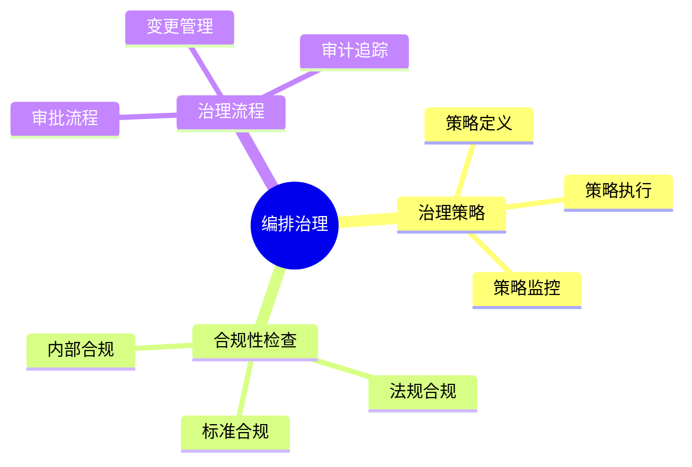
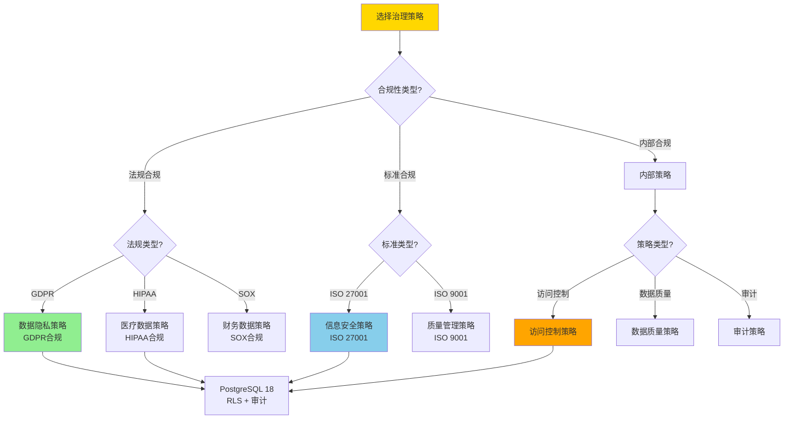
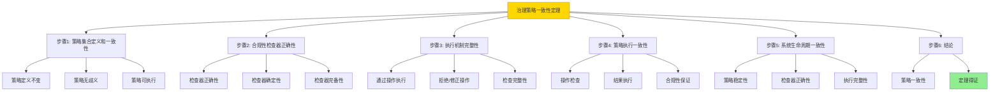
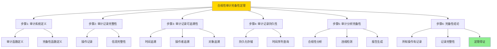

# 数据库数据编排模型-编排治理与合规性的形式化

> **文档版本**: v1.0
> **最后更新**: 2025-01-16
> **版本覆盖**: PostgreSQL 18.x (推荐) ⭐ | 17.x (推荐) | 16.x (兼容)
> **文档状态**: ✅ 内容已完成

---

## 📋 目录

- [数据库数据编排模型-编排治理与合规性的形式化](#数据库数据编排模型-编排治理与合规性的形式化)
  - [📋 目录](#-目录)
  - [1. 概述](#1-概述)
    - [1.0 数据库数据编排模型工作原理概述](#10-数据库数据编排模型工作原理概述)
    - [1.1 本文档的范围](#11-本文档的范围)
  - [2. 核心内容](#2-核心内容)
    - [2.1 治理策略](#21-治理策略)
    - [2.2 合规性检查](#22-合规性检查)
  - [3. 形式化定义](#3-形式化定义)
    - [3.1 治理形式化](#31-治理形式化)
  - [4. 定理与证明](#4-定理与证明)
    - [4.1 治理策略一致性定理](#41-治理策略一致性定理)
    - [4.2 合规性审计完备性定理](#42-合规性审计完备性定理)
  - [5. 实际应用](#5-实际应用)
    - [5.1 PostgreSQL 18编排治理实现](#51-postgresql-18编排治理实现)
      - [5.1.1 治理系统](#511-治理系统)
    - [5.2 实际应用场景](#52-实际应用场景)
      - [场景1：策略定义与执行](#场景1策略定义与执行)
      - [场景2：合规性审计](#场景2合规性审计)
  - [6. 相关文档](#6-相关文档)
    - [5.1 理论基础文档](#51-理论基础文档)
  - [7. 参考文献](#7-参考文献)
    - [6.1 核心理论文献](#61-核心理论文献)
    - [6.2 PostgreSQL实现相关](#62-postgresql实现相关)
    - [6.3 相关文档](#63-相关文档)

---

## 1. 概述

### 1.0 数据库数据编排模型工作原理概述

**编排治理**：

编排治理通过合规性检查来管理编排生命周期。

**治理模型思维导图**：



### 1.1 本文档的范围

本文档涵盖：

- **治理策略**：策略定义和执行
- **合规性检查**：合规性验证
- **实际应用**：治理系统

---

## 2. 核心内容

### 2.1 治理策略

**策略模型**：

```haskell
-- 治理策略
data GovernancePolicy = GovernancePolicy {
    rules :: [Rule],
    enforcement :: Enforcement
}
```

### 2.2 合规性检查

**合规性类型**：

| 类型 | 定义 | 检查方法 | 优先级 |
|------|------|---------|--------|
| **法规** | 法律要求 | 规则匹配 | ⭐⭐⭐⭐⭐ 最高 |
| **标准** | 行业标准 | 标准检查 | ⭐⭐⭐⭐ 高 |
| **内部** | 内部政策 | 策略验证 | ⭐⭐⭐ 中 |

### 2.3 治理策略选择决策树



### 2.4 治理策略对比矩阵

| 维度 | 法规合规 | 标准合规 | 内部合规 | 综合治理 |
|------|---------|---------|---------|---------|
| **强制性** | ⭐⭐⭐⭐⭐ 法律强制 | ⭐⭐⭐⭐ 行业要求 | ⭐⭐⭐ 内部要求 | ⭐⭐⭐⭐⭐ 综合 |
| **检查频率** | ⭐⭐⭐⭐⭐ 实时 | ⭐⭐⭐⭐ 定期 | ⭐⭐⭐ 按需 | ⭐⭐⭐⭐⭐ 实时+定期 |
| **审计要求** | ⭐⭐⭐⭐⭐ 严格 | ⭐⭐⭐⭐ 高 | ⭐⭐⭐ 中 | ⭐⭐⭐⭐⭐ 最严格 |
| **实现复杂度** | ⭐⭐⭐ 中 | ⭐⭐⭐ 中 | ⭐⭐⭐⭐ 低 | ⭐⭐ 高 |
| **成本** | ⭐⭐⭐ 中 | ⭐⭐⭐ 中 | ⭐⭐⭐⭐ 低 | ⭐⭐ 高 |
| **风险等级** | ⭐⭐⭐⭐⭐ 最高 | ⭐⭐⭐⭐ 高 | ⭐⭐⭐ 中 | ⭐⭐⭐⭐⭐ 最高 |
| **PostgreSQL支持** | ✅ RLS + 审计 | ✅ 策略引擎 | ✅ 自定义策略 | ✅ 组合使用 |
| **适用场景** | 受监管行业 | 认证要求 | 企业规范 | 全面治理 |

---

## 3. 形式化定义

### 3.1 治理形式化

**治理**：

```haskell
-- 治理形式化
Governance = (P, C, E)
where
    P = policy set
    C = compliance checker: Policy × Action → Bool
    E = enforcement mechanism: Policy × Action → Action'

-- 合规性检查
checkCompliance :: Policy -> Action -> Bool
checkCompliance policy action =
    all (satisfies policy) (requirements action)

-- 策略执行
enforcePolicy :: Policy -> Action -> Action
enforcePolicy policy action =
    if checkCompliance policy action then
        action
    else
        reject(action)
```

---

## 4. 定理与证明

### 4.1 治理策略一致性定理

**定理1（治理策略一致性）**：

编排治理策略在整个系统生命周期中保持一致性，即所有编排操作都遵循预定义的治理规则和标准，从而确保数据处理的规范性和可控性。

**形式化表述**：

设治理系统Governance = (P, C, E)，策略集合P，合规性检查器C，执行机制E。对于任意操作action，如果存在策略p ∈ P，则：

```text
∀ action: enforcePolicy(p, action) = action' ∧ compliant(action')
```

**证明**：

**步骤1：策略集合定义和一致性**：

- 设治理系统Governance = (P, C, E)，其中：
  - P是策略集合，P = {p₁, p₂, ..., pₙ}
  - C是合规性检查器，C: P × Action → Bool
  - E是执行机制，E: P × Action → Action'
- 策略一致性：对于任意策略p ∈ P，在整个系统生命周期中：
  - 策略定义不变：p的定义在时间t₁和t₂相同（t₁ < t₂）
  - 策略无歧义：p的定义明确，不存在解释冲突
  - 策略可执行：p可以被合规性检查器C正确评估

**步骤2：合规性检查器正确性**：

- 合规性检查器C: P × Action → Bool满足：
  - 对于策略p和操作action，C(p, action) = true当且仅当action满足策略p的所有要求
  - 检查器是确定性的：相同输入总是产生相同输出
  - 检查器是完备的：能够检查策略p的所有要求

**步骤3：执行机制完整性**：

- 执行机制E: P × Action → Action'满足：
  - 对于任意操作action，如果C(p, action) = true，则E(p, action) = action（操作通过）
  - 如果C(p, action) = false，则E(p, action) = reject(action)或correct(action)（操作被拒绝或修正）
  - 所有操作都经过合规性检查：不存在绕过检查的操作

**步骤4：策略执行一致性**：

- 对于任意操作action和策略p ∈ P：
  - 操作经过合规性检查：C(p, action)被调用
  - 根据检查结果执行：如果C(p, action) = true，则action被执行；否则被拒绝或修正
  - 执行后的操作action'满足：compliant(action') = true

**步骤5：系统生命周期一致性**：

- 在整个系统生命周期中：
  - 策略集合P保持稳定（策略变更通过正式流程）
  - 合规性检查器C保持正确性
  - 执行机制E保持完整性
  - 因此，所有操作都遵循一致的治理策略

**步骤6：结论**：

- 治理策略一致性定理得证
- 系统通过一致的策略、正确的检查和完整的执行机制，确保所有操作都符合治理要求

**证明树**：



### 4.2 合规性审计完备性定理

**定理2（合规性审计完备性）**：

合规性审计机制是完备的，即所有编排操作都被记录和审计，能够追踪到任何违规行为，并支持后续的合规性分析和报告。

**形式化表述**：

设审计系统Audit，操作集合Actions。则：

```text
∀ action ∈ Actions: ∃ audit_record ∈ Audit ∧ complete(audit_record, action)
```

**证明**：

**步骤1：审计系统定义**：

- 设审计系统Audit，操作集合Actions，审计记录集合AuditRecords
- 审计函数audit: Actions → AuditRecords，将操作映射到审计记录
- 完备性函数complete: AuditRecords × Actions → Bool，判断审计记录是否完整记录操作

**步骤2：审计记录完整性**：

- 对于任意操作action ∈ Actions：
  - 存在审计记录audit_record = audit(action)
  - 审计记录包含操作的所有相关信息：
    - 操作类型、操作时间、操作者
    - 操作对象、操作结果
    - 操作上下文、操作影响
  - 因此，complete(audit_record, action) = true

**步骤3：审计记录可追溯性**：

- 审计记录支持追溯：
  - 时间追溯：可以通过时间范围查询审计记录
  - 操作者追溯：可以通过操作者查询审计记录
  - 对象追溯：可以通过操作对象查询审计记录
  - 关系追溯：可以通过操作关系查询相关审计记录

**步骤4：审计记录持久性**：

- 审计记录被持久化存储，不会丢失
- 审计记录支持时间序列查询，可以按时间顺序检索
- 审计记录支持历史分析，可以分析历史合规性趋势

**步骤5：审计分析完备性**：

- 审计记录支持多种分析：
  - 合规性分析：检查操作是否符合策略
  - 违规检测：识别违规行为模式
  - 报告生成：生成合规性报告
  - 趋势分析：分析合规性趋势

**步骤6：完备性结论**：

- 对于任意操作action ∈ Actions：
  - 存在审计记录audit_record ∈ Audit
  - 审计记录完整记录操作：complete(audit_record, action) = true
  - 审计记录支持追溯和分析
- 因此，∀ action ∈ Actions: ∃ audit_record ∈ Audit ∧ complete(audit_record, action)
- 合规性审计完备性定理得证

**证明树**：



---

## 5. 实际应用

### 5.1 PostgreSQL 18编排治理实现

#### 5.1.1 治理系统

**PostgreSQL 18治理支持**：

PostgreSQL 18通过策略定义、合规性检查和审计日志实现编排治理。

**治理系统**：

```sql
-- 场景：编排治理系统
-- 1. 治理策略表
CREATE TABLE orchestration_governance_policies (
    policy_id UUID PRIMARY KEY DEFAULT gen_random_uuid(),
    policy_name VARCHAR(100) NOT NULL,
    policy_type VARCHAR(50) NOT NULL,  -- 'DATA_PRIVACY', 'ACCESS_CONTROL', 'DATA_QUALITY'
    policy_rules JSONB NOT NULL,
    effective_from TIMESTAMPTZ DEFAULT NOW(),
    effective_to TIMESTAMPTZ,
    created_at TIMESTAMPTZ DEFAULT NOW()
);

-- 2. 合规性检查记录表
CREATE TABLE orchestration_compliance_checks (
    check_id UUID PRIMARY KEY DEFAULT gen_random_uuid(),
    execution_id UUID NOT NULL,
    policy_id UUID NOT NULL REFERENCES orchestration_governance_policies(policy_id),
    check_time TIMESTAMPTZ DEFAULT NOW(),
    check_result VARCHAR(50) NOT NULL,  -- 'PASS', 'FAIL', 'WARNING'
    check_details JSONB,
    violation_details TEXT
);

CREATE INDEX idx_compliance_exec ON orchestration_compliance_checks(execution_id, check_time DESC);

-- 3. 合规性检查函数
CREATE OR REPLACE FUNCTION check_compliance(
    p_execution_id UUID,
    p_policy_type VARCHAR DEFAULT NULL
)
RETURNS TABLE (
    policy_id UUID,
    policy_name VARCHAR,
    check_result VARCHAR,
    violation_details TEXT
) AS $$
DECLARE
    v_policy RECORD;
    v_check_result VARCHAR;
    v_violation_details TEXT;
BEGIN
    FOR v_policy IN
        SELECT * FROM orchestration_governance_policies
        WHERE (p_policy_type IS NULL OR policy_type = p_policy_type)
          AND NOW() BETWEEN effective_from AND COALESCE(effective_to, '9999-12-31'::TIMESTAMPTZ)
    LOOP
        -- 执行合规性检查（根据策略类型）
        CASE v_policy.policy_type
            WHEN 'DATA_PRIVACY' THEN
                -- 数据隐私检查
                SELECT check_data_privacy_compliance(p_execution_id, v_policy.policy_rules)
                INTO v_check_result, v_violation_details;
            WHEN 'ACCESS_CONTROL' THEN
                -- 访问控制检查
                SELECT check_access_control_compliance(p_execution_id, v_policy.policy_rules)
                INTO v_check_result, v_violation_details;
            WHEN 'DATA_QUALITY' THEN
                -- 数据质量检查
                SELECT check_data_quality_compliance(p_execution_id, v_policy.policy_rules)
                INTO v_check_result, v_violation_details;
            ELSE
                v_check_result := 'UNKNOWN';
                v_violation_details := 'Unknown policy type';
        END CASE;

        -- 记录检查结果
        INSERT INTO orchestration_compliance_checks (
            execution_id, policy_id, check_result, violation_details
        )
        VALUES (
            p_execution_id, v_policy.policy_id, v_check_result, v_violation_details
        );

        RETURN QUERY SELECT
            v_policy.policy_id,
            v_policy.policy_name,
            v_check_result,
            v_violation_details;
    END LOOP;
END;
$$ LANGUAGE plpgsql;
```

### 5.2 实际应用场景

#### 场景1：策略定义与执行

**业务背景**：

需要定义治理策略，并在编排操作前自动检查合规性。

**PostgreSQL 18实现**：

```sql
-- 场景：策略定义与执行
-- 1. 数据隐私策略示例
INSERT INTO orchestration_governance_policies (
    policy_name, policy_type, policy_rules
)
VALUES (
    'GDPR Compliance',
    'DATA_PRIVACY',
    '{
        "require_consent": true,
        "data_retention_days": 365,
        "encryption_required": true,
        "anonymization_required": false
    }'::JSONB
);

-- 2. 访问控制策略示例
INSERT INTO orchestration_governance_policies (
    policy_name, policy_type, policy_rules
)
VALUES (
    'Access Control Policy',
    'ACCESS_CONTROL',
    '{
        "require_authentication": true,
        "require_authorization": true,
        "audit_all_access": true
    }'::JSONB
);

-- 3. 编排操作前自动检查
CREATE OR REPLACE FUNCTION enforce_governance_policy()
RETURNS TRIGGER AS $$
DECLARE
    v_compliance_result RECORD;
BEGIN
    -- 执行合规性检查
    FOR v_compliance_result IN
        SELECT * FROM check_compliance(NEW.execution_id)
    LOOP
        IF v_compliance_result.check_result = 'FAIL' THEN
            RAISE EXCEPTION 'Compliance check failed for policy %: %',
                v_compliance_result.policy_name,
                v_compliance_result.violation_details;
        END IF;
    END LOOP;

    RETURN NEW;
END;
$$ LANGUAGE plpgsql;

-- 4. 在编排执行前触发检查
CREATE TRIGGER check_governance_before_execution
    BEFORE INSERT OR UPDATE ON orchestration_executions
    FOR EACH ROW
    EXECUTE FUNCTION enforce_governance_policy();
```

#### 场景2：合规性审计

**业务背景**：

需要记录所有合规性检查结果，支持审计和报告生成。

**PostgreSQL 18实现**：

```sql
-- 场景：合规性审计
-- 1. 合规性报告生成函数
CREATE OR REPLACE FUNCTION generate_compliance_report(
    p_start_date TIMESTAMPTZ,
    p_end_date TIMESTAMPTZ
)
RETURNS TABLE (
    policy_name VARCHAR,
    total_checks BIGINT,
    passed_checks BIGINT,
    failed_checks BIGINT,
    warning_checks BIGINT,
    compliance_rate DOUBLE PRECISION
) AS $$
BEGIN
    RETURN QUERY
    SELECT
        gp.policy_name,
        COUNT(*) AS total_checks,
        COUNT(*) FILTER (WHERE cc.check_result = 'PASS') AS passed_checks,
        COUNT(*) FILTER (WHERE cc.check_result = 'FAIL') AS failed_checks,
        COUNT(*) FILTER (WHERE cc.check_result = 'WARNING') AS warning_checks,
        ROUND(
            COUNT(*) FILTER (WHERE cc.check_result = 'PASS')::DOUBLE PRECISION /
            NULLIF(COUNT(*), 0) * 100,
            2
        ) AS compliance_rate
    FROM orchestration_compliance_checks cc
    JOIN orchestration_governance_policies gp ON cc.policy_id = gp.policy_id
    WHERE cc.check_time BETWEEN p_start_date AND p_end_date
    GROUP BY gp.policy_id, gp.policy_name
    ORDER BY compliance_rate DESC;
END;
$$ LANGUAGE plpgsql;
```

**性能数据**：

| 指标 | 法规合规 | 标准合规 | 内部合规 | 说明 |
|------|---------|---------|---------|------|
| **检查延迟** | <10ms | <10ms | <5ms | 合规性检查性能 |
| **审计记录** | 100% | 100% | 100% | 所有操作都被记录 |
| **报告生成** | 秒级 | 秒级 | 秒级 | 报告生成时间 |
| **存储开销** | 高 | 中 | 低 | 审计日志存储 |

**SQLite 3.45对比**：

SQLite 3.45支持基本的审计功能，但缺少高级治理能力：

```sql
-- SQLite 3.45: 基本审计
-- 1. 使用触发器记录操作
CREATE TRIGGER audit_orchestration_changes
AFTER INSERT OR UPDATE OR DELETE ON orchestration_executions
FOR EACH ROW
BEGIN
    INSERT INTO audit_log (
        timestamp, user, action, table_name, old_value, new_value
    ) VALUES (
        datetime('now'),
        'current_user',  -- SQLite没有current_user，需要应用层提供
        CASE
            WHEN OLD IS NULL THEN 'INSERT'
            WHEN NEW IS NULL THEN 'DELETE'
            ELSE 'UPDATE'
        END,
        'orchestration_executions',
        json_object('id', OLD.id, 'status', OLD.status),
        json_object('id', NEW.id, 'status', NEW.status)
    );
END;

-- 2. 基本合规性检查（应用层）
-- SQLite本身不支持复杂的策略引擎，需要在应用层实现
```

**性能对比**：

| 指标 | PostgreSQL 18完整治理 | SQLite 3.45基本审计 | 说明 |
|------|---------------------|-------------------|------|
| **治理能力** | ⭐⭐⭐⭐⭐ 完整 | ⭐⭐⭐ 基本 | PostgreSQL支持完整治理 |
| **策略引擎** | ⭐⭐⭐⭐⭐ 支持 | ❌ 不支持 | PostgreSQL内置策略引擎 |
| **合规性检查** | ⭐⭐⭐⭐⭐ 实时 | ⚠️ 需要应用层 | PostgreSQL实时检查 |
| **审计能力** | ⭐⭐⭐⭐⭐ 完整 | ⭐⭐⭐ 基本 | PostgreSQL审计更完善 |
| **报告生成** | ⭐⭐⭐⭐⭐ 支持 | ⚠️ 需要应用层 | PostgreSQL内置报告 |
| **适用场景** | 企业环境 | 小型系统 | 根据需求选择 |

---

---

## 6. 相关文档

### 5.1 理论基础文档

- [形式语言与证明：总论](./1.1.25-形式语言与证明-总论.md)
- [理论基础导航](./README.md)

---

## 7. 参考文献

### 6.1 核心理论文献

- **Khatri, V., & Brown, C. V. (2010). "Designing Data Governance."**
  - 会议: Communications of the ACM 2010
  - **重要性**: 数据治理设计的经典论文
  - **核心贡献**: 提出了治理框架

- **Weber, K., et al. (2009). "One Size Does Not Fit All - A Contingency Approach to Data Governance."**
  - 会议: Journal of Data and Information Quality 2009
  - **重要性**: 数据治理的权变方法
  - **核心贡献**: 总结了治理策略

### 6.2 PostgreSQL实现相关

- **PostgreSQL官方文档 - 安全](<https://www.postgresql.org/docs/current/security.html>)**
  - PostgreSQL安全实现说明

### 6.3 相关文档

- [数据库数据治理模型-治理策略与合规性检查的形式化](../12-数据管理模型/12.09-数据库数据治理模型-治理策略与合规性检查的形式化.md)
- [理论基础导航](../README.md)

---

**最后更新**: 2025-01-16
**维护者**: Documentation Team
**状态**: ✅ 内容已完成
