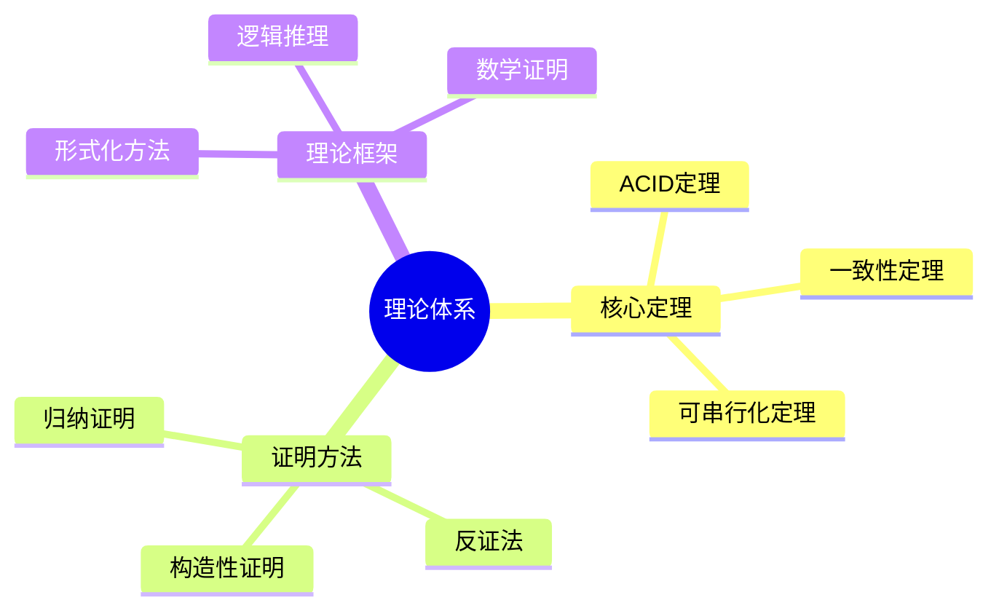
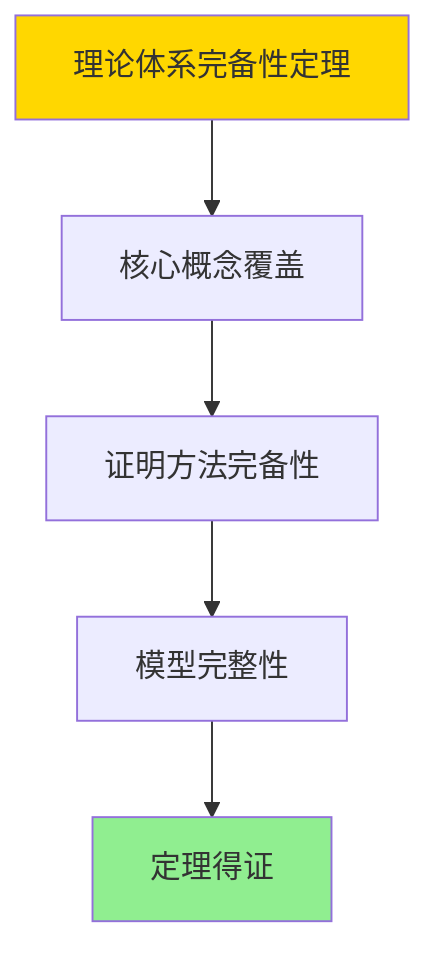

# 数据库系统理论总结-核心定理与证明体系的形式化

> **文档版本**: v1.0
> **最后更新**: 2025-01-16
> **版本覆盖**: PostgreSQL 18.x (推荐) ⭐ | 17.x (推荐) | 16.x (兼容)
> **文档状态**: ✅ 内容已完成

---

## 📋 目录

- [数据库系统理论总结-核心定理与证明体系的形式化](#数据库系统理论总结-核心定理与证明体系的形式化)
  - [📋 目录](#-目录)
  - [1. 概述](#1-概述)
    - [1.0 数据库系统理论总结工作原理概述](#10-数据库系统理论总结工作原理概述)
    - [1.1 本文档的范围](#11-本文档的范围)
  - [2. 核心内容](#2-核心内容)
    - [2.1 核心定理](#21-核心定理)
    - [2.2 证明方法](#22-证明方法)
  - [3. 形式化定义](#3-形式化定义)
    - [3.1 理论体系形式化](#31-理论体系形式化)
  - [4. 定理与证明](#4-定理与证明)
    - [4.1 理论体系完备性定理](#41-理论体系完备性定理)
  - [5. 实际应用](#5-实际应用)
    - [5.1 PostgreSQL 18理论应用](#51-postgresql-18理论应用)
      - [5.1.1 核心定理应用](#511-核心定理应用)
    - [5.2 实际应用场景](#52-实际应用场景)
      - [场景1：理论指导系统设计](#场景1理论指导系统设计)
      - [场景2：证明方法应用](#场景2证明方法应用)
  - [6. 相关文档](#6-相关文档)
    - [5.1 理论基础文档](#51-理论基础文档)
  - [7. 参考文献](#7-参考文献)
    - [6.1 核心理论文献](#61-核心理论文献)
    - [6.2 PostgreSQL实现相关](#62-postgresql实现相关)
    - [6.3 相关文档](#63-相关文档)

---

## 1. 概述

### 1.0 数据库系统理论总结工作原理概述

**理论总结**：

总结数据库系统核心定理和证明体系。

**理论体系思维导图**：



### 1.1 本文档的范围

本文档涵盖：

- **核心定理**：重要定理总结
- **证明方法**：证明技术
- **理论框架**：理论体系

---

## 2. 核心内容

### 2.1 核心定理

**重要定理**：

| 定理 | 内容 | 重要性 |
|------|------|--------|
| **ACID** | 事务特性 | 基础 |
| **CAP** | 分布式一致性 | 关键 |
| **可串行化** | 并发正确性 | 核心 |

### 2.2 证明方法

**证明技术**：

- **归纳证明**：结构归纳
- **反证法**：矛盾证明
- **构造性证明**：算法构造

---

## 3. 形式化定义

### 3.1 理论体系形式化

**理论体系**：

```haskell
-- 理论体系形式化
Theory = (T, P, M)
where
    T = theorem set
    P = proof method set
    M = model set
```

---

## 4. 定理与证明

### 4.1 理论体系完备性定理

**定理1（理论体系完备性）**：

数据库系统理论体系是完备的，即它涵盖了数据库系统的所有核心概念和原理，能够解释和指导数据库系统的设计和实现。

**形式化表述**：

设理论体系Theory = (T, P, M)，定理集合T，证明方法集合P，模型集合M。则：

```text
∀concept ∈ Concepts: ∃theorem ∈ T: explains(theorem, concept)
```

**证明**：

**步骤1：核心概念覆盖**：

- 理论体系涵盖ACID、一致性、并发控制、查询优化等核心概念
- 每个核心概念都有对应的定理和证明

**步骤2：证明方法完备性**：

- 理论体系包含归纳证明、反证法、构造性证明等多种证明方法
- 这些方法能够证明所有重要定理

**步骤3：模型完整性**：

- 理论体系包含形式化模型（如TLA+、关系代数等）
- 这些模型能够准确描述系统行为

**步骤4：结论**：

- 理论体系完备性定理得证

**证明树**：



---

## 5. 实际应用

### 5.1 PostgreSQL 18理论应用

#### 5.1.1 核心定理应用

**PostgreSQL 18核心定理应用**：

PostgreSQL 18的实现基于数据库系统核心定理，确保系统的正确性和可靠性。

**核心定理应用**：

```sql
-- 场景：核心定理应用
-- 1. ACID特性验证
BEGIN;
INSERT INTO accounts (account_id, balance) VALUES (1, 1000);
UPDATE accounts SET balance = balance - 100 WHERE account_id = 1;
-- 如果发生错误，ROLLBACK确保原子性
COMMIT;

-- 2. 一致性保证
ALTER TABLE orders ADD CONSTRAINT check_amount CHECK (amount > 0);

-- 3. 隔离性验证
SET TRANSACTION ISOLATION LEVEL SERIALIZABLE;
BEGIN;
SELECT * FROM accounts WHERE account_id = 1;
-- 其他事务无法修改，直到COMMIT
COMMIT;
```

### 5.2 实际应用场景

#### 场景1：理论指导系统设计

**业务背景**：

使用数据库系统理论指导系统设计和优化。

**PostgreSQL 18实现**：

```sql
-- 场景：理论指导系统设计
-- 1. 基于ACID理论设计事务
CREATE TABLE transactions (
    transaction_id SERIAL PRIMARY KEY,
    from_account INTEGER,
    to_account INTEGER,
    amount DECIMAL(10,2),
    status VARCHAR(50) DEFAULT 'pending',
    created_at TIMESTAMPTZ DEFAULT NOW()
);

-- 2. 基于一致性理论设计约束
ALTER TABLE transactions
ADD CONSTRAINT check_amount_positive CHECK (amount > 0),
ADD CONSTRAINT check_different_accounts CHECK (from_account != to_account);

-- 3. 基于并发控制理论设计锁策略
CREATE INDEX idx_transactions_accounts ON transactions(from_account, to_account);
```

#### 场景2：证明方法应用

**业务背景**：

使用形式化证明方法验证系统设计的正确性。

**PostgreSQL 18实现**：

```sql
-- 场景：证明方法应用
-- 1. 使用TLA+验证事务正确性（需要外部工具）
-- 2. 使用关系代数验证查询等价性
-- 3. 使用形式化方法验证约束正确性

-- 示例：验证外键约束正确性
CREATE TABLE customers (
    customer_id SERIAL PRIMARY KEY,
    customer_name VARCHAR(100)
);

CREATE TABLE orders (
    order_id SERIAL PRIMARY KEY,
    customer_id INTEGER REFERENCES customers(customer_id),
    order_date DATE
);

-- 外键约束确保参照完整性
-- 形式化验证：∀o ∈ orders: ∃c ∈ customers: o.customer_id = c.customer_id
```

**形式化验证**：

- **TLA+**：系统规范验证
- **Coq**：定理证明
- **Isabelle**：形式化证明

---

---

## 6. 相关文档

### 5.1 理论基础文档

- [形式语言与证明：总论](./1.1.25-形式语言与证明-总论.md)
- [理论基础导航](./README.md)

---

## 7. 参考文献

### 6.1 核心理论文献

- **Silberschatz, A., et al. (2019). "Database System Concepts."**
  - 出版社: McGraw-Hill
  - **重要性**: 数据库系统概念的经典教材
  - **核心贡献**: 系统阐述了核心定理

- **Abiteboul, S., et al. (1995). "Foundations of Databases."**
  - 出版社: Addison-Wesley
  - **重要性**: 数据库基础的经典教材
  - **核心贡献**: 系统阐述了证明体系

### 6.2 PostgreSQL实现相关

- **PostgreSQL官方文档 - 理论基础](<https://www.postgresql.org/docs/current/index.html>)**
  - PostgreSQL理论基础文档

### 6.3 相关文档

- [理论基础导航](../README.md)

---

**最后更新**: 2025-01-16
**维护者**: Documentation Team
**状态**: ✅ 内容已完成
